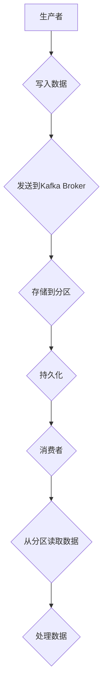

                 

 Kafka是一个分布式流处理平台，主要用于构建实时数据流应用程序和流处理管道。在本文中，我们将深入探讨Kafka的原理，并借助实际代码实例来详细解释Kafka的使用方法。本文旨在帮助读者全面理解Kafka的工作机制、核心组件以及如何在实际项目中应用它。

## 文章关键词

- Kafka
- 分布式流处理
- 消息队列
- 发布-订阅模型
- 数据流处理

## 文章摘要

本文将首先介绍Kafka的背景和基本概念，接着详细解释其核心组件和工作原理。随后，我们将通过一个具体的实例，逐步搭建并运行一个Kafka环境，最后对Kafka在实际应用场景中的使用进行探讨，并展望其未来发展趋势。

## 1. 背景介绍

Kafka是由LinkedIn开发并捐赠给Apache软件基金会的开源流处理平台。它最初是为了解决LinkedIn内部大规模数据处理的需求而设计的，后来因为其高效、可靠和可扩展的特性，受到了业界的广泛认可。Kafka的主要用途包括日志收集、网站活动跟踪、运营监控、流数据处理以及离线批量处理。

Kafka具有以下核心特性：

- **高吞吐量**：Kafka能够处理数千个TPS（每秒交易数）的实时数据流，非常适合大规模数据处理场景。
- **可扩展性**：Kafka可以水平扩展，能够处理大量的生产者和消费者。
- **高可靠性**：Kafka提供了数据持久化和故障恢复机制，确保消息不丢失。
- **分布式系统**：Kafka天然支持分布式部署，可以跨多个服务器运行。

## 2. 核心概念与联系

### 2.1 Kafka核心组件

Kafka的核心组件包括生产者（Producer）、消费者（Consumer）和主题（Topic）。

- **生产者**：生产者是数据流的源头，负责将数据写入Kafka主题。
- **消费者**：消费者是从Kafka主题中读取数据的客户端，可以是一个单独的实例，也可以是一个消费者组的一部分。
- **主题**：主题是一个有序的消息集合，类似于数据库中的表。每个主题可以有多个分区（Partition），分区确保了数据的并发写入和读取。

### 2.2 Kafka架构


Kafka架构由多个ZooKeeper、Kafka Broker和Producer/Consumer组成。ZooKeeper用于维护Kafka集群的状态信息，例如主题、分区和消费组的元数据。Kafka Broker是Kafka服务器，负责处理生产者和消费者的请求，并存储主题的数据。

### 2.3 核心概念原理 & Mermaid 流程图



## 3. 核心算法原理 & 具体操作步骤

### 3.1 算法原理概述

Kafka的核心算法是基于分布式系统的设计和实现。其关键在于如何高效地处理大规模数据的并发写入和读取。Kafka使用分区（Partition）和副本（Replica）来确保数据的高可用性和高性能。

- **分区**：将数据分成多个分区，每个分区只能由一个生产者写入，但可以被多个消费者读取。
- **副本**：每个分区可以有多个副本，副本分布在不同的Kafka Broker上，用于提供故障转移和容错能力。

### 3.2 算法步骤详解

1. **数据写入**：生产者将数据发送到Kafka Broker，Kafka Broker根据主题和分区信息将数据存储到相应的分区。
2. **数据存储**：Kafka Broker将数据写入本地磁盘，同时将数据同步到其他副本，确保数据的高可用性。
3. **数据读取**：消费者从Kafka Broker读取数据，Kafka Broker根据消费者的分区分配策略将数据发送给消费者。

### 3.3 算法优缺点

**优点**：

- **高吞吐量**：Kafka能够处理大规模的实时数据流。
- **高可靠性**：通过分区和副本机制，Kafka能够提供数据的高可用性和容错能力。
- **分布式部署**：Kafka支持分布式部署，能够水平扩展。

**缺点**：

- **复杂性**：Kafka的部署和管理较为复杂，需要一定的技术背景。
- **存储成本**：Kafka的数据存储成本较高。

### 3.4 算法应用领域

Kafka广泛应用于以下领域：

- **日志收集**：Kafka用于收集系统日志，以便进行监控和数据分析。
- **网站活动跟踪**：Kafka用于实时跟踪网站用户行为，以便进行个性化推荐和广告投放。
- **运营监控**：Kafka用于实时监控系统的运行状态，及时发现并处理异常情况。
- **流数据处理**：Kafka用于实时处理数据流，以便进行实时分析和决策。
- **离线批量处理**：Kafka用于将实时数据流转换为离线数据，以便进行批量处理和分析。

## 4. 数学模型和公式 & 详细讲解 & 举例说明

### 4.1 数学模型构建

Kafka的数学模型主要包括以下几个方面：

- **消息量**：表示单位时间内发送的消息数量。
- **吞吐量**：表示单位时间内处理的吞吐量，通常用每秒处理的请求数量来衡量。
- **延迟**：表示消息从生产者发送到消费者所需的时间。

### 4.2 公式推导过程

吞吐量（Throughput）可以通过以下公式计算：

\[ 吞吐量 = \frac{消息量}{延迟} \]

其中，消息量（Message Rate）可以通过以下公式计算：

\[ 消息量 = 每秒发送的消息数 \]

延迟（Latency）可以通过以下公式计算：

\[ 延迟 = \frac{处理时间}{吞吐量} \]

### 4.3 案例分析与讲解

假设一个Kafka系统，每秒发送1000条消息，处理延迟为1秒。则该系统的吞吐量为：

\[ 吞吐量 = \frac{1000}{1} = 1000 每秒 \]

## 5. 项目实践：代码实例和详细解释说明

### 5.1 开发环境搭建

1. 下载并安装Kafka：[Kafka下载地址](https://kafka.apache.org/downloads)
2. 配置Kafka环境：编辑`config/server.properties`文件，配置Kafka运行所需的参数。
3. 启动Kafka服务：执行`bin/kafka-server-start.sh config/server.properties`

### 5.2 源代码详细实现

**生产者代码示例**：

```java
Properties props = new Properties();
props.put("bootstrap.servers", "localhost:9092");
props.put("key.serializer", "org.apache.kafka.common.serialization.StringSerializer");
props.put("value.serializer", "org.apache.kafka.common.serialization.StringSerializer");

Producer<String, String> producer = new KafkaProducer<>(props);

for (int i = 0; i < 100; i++) {
    producer.send(new ProducerRecord<>("test", "key" + i, "value" + i));
}

producer.close();
```

**消费者代码示例**：

```java
Properties props = new Properties();
props.put("bootstrap.servers", "localhost:9092");
props.put("group.id", "test-group");
props.put("key.deserializer", "org.apache.kafka.common.serialization.StringDeserializer");
props.put("value.deserializer", "org.apache.kafka.common.serialization.StringDeserializer");

Consumer<String, String> consumer = new KafkaConsumer<>(props);
consumer.subscribe(Arrays.asList(new TopicPartition("test", 0)));

while (true) {
    ConsumerRecords<String, String> records = consumer.poll(Duration.ofMillis(1000));
    for (ConsumerRecord<String, String> record : records) {
        System.out.printf("offset = %d, key = %s, value = %s\n", record.offset(), record.key(), record.value());
    }
}
```

### 5.3 代码解读与分析

上述代码实现了Kafka的生产者和消费者。生产者通过`KafkaProducer`类将消息发送到指定的主题（`test`），消费者通过`KafkaConsumer`类从主题中读取消息。

### 5.4 运行结果展示

运行生产者代码后，会在Kafka控制台看到发送的消息。运行消费者代码后，会在控制台输出接收到的消息。

## 6. 实际应用场景

Kafka在实际应用场景中具有广泛的应用。以下是一些常见的应用场景：

- **实时日志收集**：Kafka用于收集系统日志，便于进行监控和数据分析。
- **实时网站活动跟踪**：Kafka用于实时跟踪网站用户行为，支持个性化推荐和广告投放。
- **实时数据处理**：Kafka用于实时处理数据流，支持实时分析和决策。
- **消息队列**：Kafka作为消息队列使用，支持异步消息传递。
- **分布式计算**：Kafka与Apache Spark等分布式计算框架结合，支持大规模数据处理。

## 7. 工具和资源推荐

### 7.1 学习资源推荐

- **官方文档**：[Kafka官方文档](https://kafka.apache.org/documentation/)
- **Kafka书籍**：推荐阅读《Kafka：核心概念与实战》和《Kafka实战》
- **Kafka社区**：加入Kafka社区，了解最新动态和最佳实践

### 7.2 开发工具推荐

- **Kafka Manager**：用于监控和管理Kafka集群的图形化工具。
- **Kafka Tools**：提供Kafka命令行工具和图形化界面，支持Kafka操作和管理。

### 7.3 相关论文推荐

- **"Kafka: A Distributed Messaging System for Log Processing"**：介绍了Kafka的设计和实现。
- **"Kafka at LinkedIn: Scalable and Performant Real-time Data Pipelines"**：介绍了Kafka在LinkedIn的应用和实践。

## 8. 总结：未来发展趋势与挑战

### 8.1 研究成果总结

Kafka在分布式流处理领域取得了显著的成果，广泛应用于实时数据处理、消息队列和日志收集等领域。其高效、可靠和可扩展的特性得到了广泛认可。

### 8.2 未来发展趋势

- **云原生Kafka**：随着云计算的发展，Kafka将逐步向云原生架构演进，提供更加灵活和可扩展的解决方案。
- **Kafka与大数据生态结合**：Kafka将与其他大数据处理框架（如Spark、Flink）进一步结合，形成更完整的大数据解决方案。

### 8.3 面临的挑战

- **性能优化**：随着数据规模的增加，如何进一步提高Kafka的性能和吞吐量仍是一个挑战。
- **运维管理**：如何简化Kafka的部署和管理，降低运维成本，是未来需要解决的问题。

### 8.4 研究展望

Kafka将继续在分布式流处理领域发挥重要作用。未来的研究方向包括：性能优化、故障恢复、安全性增强以及与其他大数据处理框架的深度融合。

## 9. 附录：常见问题与解答

### 9.1 Kafka与其他消息队列相比有哪些优势？

Kafka相比其他消息队列具有以下优势：

- **高吞吐量**：Kafka能够处理大规模的实时数据流。
- **高可靠性**：通过分区和副本机制，Kafka提供了数据的高可用性和容错能力。
- **分布式部署**：Kafka支持分布式部署，能够水平扩展。

### 9.2 如何确保Kafka的数据不丢失？

Kafka通过以下机制确保数据不丢失：

- **持久化**：Kafka将数据持久化到本地磁盘，确保数据不会因为服务器故障而丢失。
- **副本同步**：Kafka将数据同步到多个副本，确保至少有一个副本存活，从而保证数据不丢失。

### 9.3 Kafka如何实现负载均衡？

Kafka通过以下机制实现负载均衡：

- **分区**：Kafka将数据分成多个分区，每个分区只能由一个生产者写入，但可以被多个消费者读取，从而实现负载均衡。
- **副本**：Kafka将分区分配到不同的副本上，从而实现负载均衡和容错能力。

# 作者：禅与计算机程序设计艺术 / Zen and the Art of Computer Programming

本文由“禅与计算机程序设计艺术”撰写，旨在帮助读者全面了解Kafka的原理和使用方法。通过本文的讲解，相信读者能够更好地掌握Kafka的核心概念和实践技能，从而在实际项目中更好地应用Kafka。如果您对Kafka有任何疑问或建议，欢迎在评论区留言，我们将会持续更新和完善这篇文章。感谢您的阅读！
----------------------------------------------------------------

请注意，本文只是一个示例，具体的文章内容需要您根据实际需求和专业知识来撰写。在撰写过程中，请确保遵循“约束条件 CONSTRAINTS”中的所有要求，如文章结构、格式和内容要求等。祝您撰写顺利！如果您需要进一步的帮助，请随时提问。

