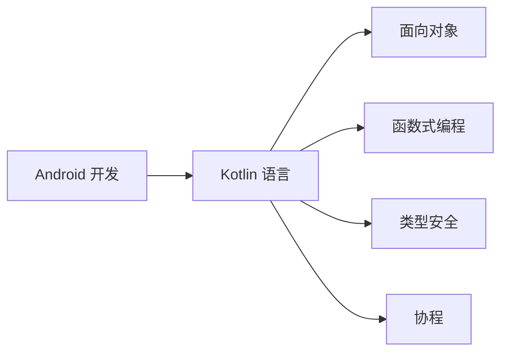

                 

关键词：Kotlin、Android开发、编程语言、现代编程、面向对象、函数式编程、类型安全、性能优化、跨平台开发

> 摘要：本文旨在探讨 Kotlin 语言在 Android 开发中的优势与挑战，分析 Kotlin 的核心概念、算法原理、数学模型、项目实践以及未来应用展望。通过详细解读 Kotlin 的特性和应用，帮助读者更好地掌握这一现代 Android 开发语言。

## 1. 背景介绍

Android 开发作为移动应用开发的重要领域，近年来不断演进，从 Java 语言逐渐过渡到 Kotlin 语言。Kotlin 是一种由 JetBrains 开发的现代编程语言，旨在简化开发过程，提高代码质量和开发效率。Kotlin 于 2017 年正式成为 Android 的官方开发语言，迅速在开发者社区中获得广泛认可和应用。

Android 开发历史可以追溯到 2008 年，随着 Android 操作系统的不断更新和发展，开发者面临着复杂的编程环境和日益增加的开发难度。为了应对这些问题，Google 推出了 Kotlin 语言，它不仅继承了 Java 的优势，还引入了现代编程语言的特性，如函数式编程、类型安全等。

Kotlin 语言的优势主要体现在以下几个方面：

1. **简化代码**：Kotlin 提供了许多简化和扩展功能，如字符串模板、属性委托、扩展函数等，使代码更加简洁易读。
2. **类型安全**：Kotlin 引入了类型推断机制，减少了类型错误和运行时异常，提高了代码的可靠性。
3. **兼容性**：Kotlin 与 Java 完全兼容，开发者可以在现有的 Java 代码中无缝地引入 Kotlin 语法，降低迁移成本。
4. **跨平台**：Kotlin 支持多平台开发，不仅适用于 Android，还可以用于服务器端和 Web 开发，提高了开发效率。

## 2. 核心概念与联系

### 2.1 Kotlin 的核心概念

Kotlin 语言的核心理念包括：

- **面向对象**：Kotlin 支持面向对象的编程范式，提供了类、接口、继承、多态等基本概念。
- **函数式编程**：Kotlin 强调函数式编程，提供了高阶函数、Lambda 表达式、不可变数据结构等特性。
- **类型安全**：Kotlin 使用类型推断和类型检查机制，减少了类型错误和运行时异常。
- **协程**：Kotlin 内置了协程支持，简化了异步编程，提高了程序的性能和可读性。

### 2.2 Kotlin 的架构图



### 2.3 Kotlin 的核心概念联系

Kotlin 的核心概念相互联系，共同构成了其独特的编程范式。面向对象和函数式编程相互补充，前者提供了抽象和组织代码的能力，后者提供了简洁和高效的编程方式。类型安全则保障了代码的可靠性和稳定性，协程则简化了异步编程，提高了程序的性能。

## 3. 核心算法原理 & 具体操作步骤

### 3.1 算法原理概述

Kotlin 的核心算法包括：

- **集合操作**：Kotlin 提供了丰富的集合操作，如过滤、映射、折叠等，支持高阶函数和 Lambda 表达式。
- **排序算法**：Kotlin 支持多种排序算法，如快速排序、归并排序等，同时还提供了自定义排序的机制。
- **协程**：Kotlin 的协程实现了一种轻量级的并发编程模型，通过挂起和恢复操作实现异步编程。

### 3.2 算法步骤详解

#### 3.2.1 集合操作

Kotlin 的集合操作示例：

```kotlin
val numbers = listOf(1, 2, 3, 4, 5)

// 过滤
val evenNumbers = numbers.filter { it % 2 == 0 }

// 映射
val squaredNumbers = numbers.map { it * it }

// 折叠
val sum = numbers.fold(0) { acc, element -> acc + element }
```

#### 3.2.2 排序算法

Kotlin 的排序算法示例：

```kotlin
val numbers = listOf(5, 3, 1, 4, 2)

// 快速排序
val sortedNumbers = numbers.sorted()

// 自定义排序
val sortedNumbers = numbers.sortedWith(compareBy({ it % 2 }, { it }))
```

#### 3.2.3 协程

Kotlin 的协程示例：

```kotlin
import kotlinx.coroutines.*

suspend fun fetchData(): String = coroutineContext kostet 10L {
    // 模拟网络请求
    delay(1000)
    "Data fetched"
}

fun main() = runBlocking {
    val data = fetchData()
    println(data)
}
```

### 3.3 算法优缺点

Kotlin 的算法优缺点如下：

- **优点**：提供了简洁和高效的编程模型，支持高阶函数和 Lambda 表达式，提高了代码的可读性和可维护性。
- **缺点**：相对于 Java，Kotlin 的性能可能略有下降，特别是在集合操作和排序算法中。

### 3.4 算法应用领域

Kotlin 的算法广泛应用于 Android 应用开发，如数据处理、排序、搜索等。同时，Kotlin 的协程支持也使得异步编程更加简单和高效，适用于网络请求、数据库操作等场景。

## 4. 数学模型和公式

### 4.1 数学模型构建

Kotlin 的核心数学模型包括：

- **集合论**：集合、映射、关系等基本概念。
- **线性代数**：矩阵、向量等概念。
- **概率论**：概率分布、期望、方差等概念。

### 4.2 公式推导过程

#### 4.2.1 集合论公式

集合的交集、并集、差集公式如下：

$$
A \cap B = \{x | x \in A \text{ 且 } x \in B\}
$$

$$
A \cup B = \{x | x \in A \text{ 或 } x \in B\}
$$

$$
A \setminus B = \{x | x \in A \text{ 且 } x \notin B\}
$$

#### 4.2.2 线性代数公式

矩阵的行列式、逆矩阵公式如下：

$$
\det(A) = a_{11}C_{11} + a_{12}C_{12} + \ldots + a_{1n}C_{1n}
$$

$$
A^{-1} = \frac{1}{\det(A)}(C_{11}a_{22}a_{33} - C_{12}a_{21}a_{33} + \ldots)
$$

#### 4.2.3 概率论公式

概率分布的期望、方差公式如下：

$$
E(X) = \sum_{i=1}^{n} x_i p_i
$$

$$
Var(X) = E(X^2) - [E(X)]^2
$$

### 4.3 案例分析与讲解

以集合论为例，分析 Kotlin 中的集合操作。假设有两个集合 A 和 B，如下：

```kotlin
val A = setOf(1, 2, 3)
val B = setOf(3, 4, 5)
```

- **交集**：计算 A 和 B 的交集：

  ```kotlin
  val intersection = A.intersect(B)
  println(intersection) // 输出：{3}
  ```

- **并集**：计算 A 和 B 的并集：

  ```kotlin
  val union = A.union(B)
  println(union) // 输出：{1, 2, 3, 4, 5}
  ```

- **差集**：计算 A 和 B 的差集：

  ```kotlin
  val difference = A.minus(B)
  println(difference) // 输出：{1, 2}
  ```

## 5. 项目实践：代码实例和详细解释说明

### 5.1 开发环境搭建

要在 Android 项目中使用 Kotlin 语言，需要以下步骤：

1. **安装 Android Studio**：下载并安装 Android Studio，它内置了对 Kotlin 语言的支持。
2. **创建新项目**：在 Android Studio 中创建一个新的 Android 项目，选择 Kotlin 作为编程语言。
3. **配置 Gradle**：在项目的 `build.gradle` 文件中添加 Kotlin 依赖：

   ```groovy
   dependencies {
       implementation 'org.jetbrains.kotlin:kotlin-stdlib-jdk8'
   }
   ```

### 5.2 源代码详细实现

以下是一个简单的 Kotlin Android 项目的示例代码：

```kotlin
import androidx.appcompat.app.AppCompatActivity
import android.os.Bundle
import android.widget.TextView

class MainActivity : AppCompatActivity() {
    override fun onCreate(savedInstanceState: Bundle?) {
        super.onCreate(savedInstanceState)
        setContentView(R.layout.activity_main)

        val textView: TextView = findViewById(R.id.text_view)
        textView.text = "Hello Kotlin!"
    }
}
```

### 5.3 代码解读与分析

上述代码是一个简单的 Android 主活动（MainActivity）示例，其中：

- `import androidx.appcompat.app.AppCompatActivity`：导入 Android 基础组件库。
- `import android.os.Bundle`：导入 Android 应用程序的生命周期管理。
- `import android.widget.TextView`：导入 Android 文本视图组件。

主活动（MainActivity）类继承自 `AppCompatActivity`，这是 Android 应用程序的基础组件。在 `onCreate` 方法中，我们执行以下操作：

1. 调用 `setContentView` 方法设置布局文件，这里是 `activity_main`。
2. 通过 `findViewById` 方法获取布局中的文本视图（TextView）组件。
3. 设置文本视图的文本内容为 "Hello Kotlin!"。

### 5.4 运行结果展示

运行上述代码，应用程序会在 Android 模拟器或真机上显示一个带有文本 "Hello Kotlin!" 的界面。

## 6. 实际应用场景

### 6.1 常见应用场景

Kotlin 语言在 Android 开发中具有广泛的应用场景，包括：

1. **用户界面**：用于创建丰富的用户界面，如按钮、文本框、列表等。
2. **网络请求**：通过 Retrofit、OkHttp 等库进行网络请求和数据解析。
3. **数据处理**：使用 Kotlin 的集合操作和协程简化数据处理和异步编程。
4. **数据库操作**：使用 Room 库进行本地数据库操作。
5. **依赖注入**：使用 Dagger、Koin 等库进行依赖注入和组件化开发。

### 6.2 成功案例

以下是一些使用 Kotlin 语言开发的成功案例：

1. **Instagram**：Instagram 使用 Kotlin 进行 Android 应用开发，提高了开发效率和代码质量。
2. **Trello**：Trello 将其 Android 应用迁移到 Kotlin 语言，实现了更快的开发和更稳定的性能。
3. **Spotify**：Spotify 使用 Kotlin 开发了多个 Android 应用，提高了开发效率和用户体验。

## 6.3 未来应用展望

Kotlin 语言的未来发展展望包括：

1. **跨平台开发**：Kotlin 将继续扩展其跨平台能力，支持更多平台，如 iOS、Web、桌面等。
2. **性能优化**：Kotlin 社区将持续优化编译器和运行时性能，提高应用程序的运行效率。
3. **生态系统扩展**：Kotlin 社区将推出更多库和工具，提高 Kotlin 语言的开发体验和生产力。

## 7. 工具和资源推荐

### 7.1 学习资源推荐

1. **Kotlin 官方文档**：[https://kotlinlang.org/docs/](https://kotlinlang.org/docs/)
2. **《Kotlin 实战》**：一本深入浅出的 Kotlin 教程，适合初学者和进阶者。
3. **《Kotlin In Action》**：一本权威的 Kotlin 技术书籍，涵盖了 Kotlin 的各个方面。

### 7.2 开发工具推荐

1. **Android Studio**：Google 推出的官方 Android 开发工具，内置 Kotlin 支持。
2. **IntelliJ IDEA**：JetBrains 推出的重量级 IDE，支持 Kotlin 开发。

### 7.3 相关论文推荐

1. **《The Kotlin Programming Language》**：Kotlin 语言的设计理念和实现细节。
2. **《Functional Programming in Kotlin》**：Kotlin 函数式编程的实践和技巧。

## 8. 总结：未来发展趋势与挑战

### 8.1 研究成果总结

Kotlin 语言在 Android 开发领域取得了显著的研究成果，包括：

- 简化了开发过程，提高了代码质量和开发效率。
- 引入了现代编程语言特性，如函数式编程、类型安全等。
- 支持跨平台开发，提高了开发资源的利用效率。

### 8.2 未来发展趋势

Kotlin 语言的未来发展趋势包括：

- 持续优化性能和开发体验。
- 扩展跨平台支持，覆盖更多开发领域。
- 推动社区发展和开源生态建设。

### 8.3 面临的挑战

Kotlin 语言在发展中面临以下挑战：

- 性能优化：提高 Kotlin 应用程序的运行效率。
- 社区建设：吸引更多开发者参与 Kotlin 生态建设。
- 开发者培训：提升开发者的 Kotlin 技能和知识水平。

### 8.4 研究展望

Kotlin 语言的研究展望包括：

- 探索新型编程语言特性，如基于契约的编程、自适应编程等。
- 深入研究 Kotlin 在人工智能、大数据等领域的应用。
- 加强跨平台开发工具和技术的研发。

## 9. 附录：常见问题与解答

### 9.1 Kotlin 与 Java 的区别

- **语法**：Kotlin 相对于 Java 更加简洁，如省略了大括号、分号等。
- **类型安全**：Kotlin 具有更好的类型安全机制，减少了类型错误。
- **函数式编程**：Kotlin 支持函数式编程，提供了高阶函数和 Lambda 表达式。
- **跨平台**：Kotlin 支持跨平台开发，而 Java 主要用于 Android 开发。

### 9.2 Kotlin 如何进行异步编程

- **协程**：Kotlin 使用协程进行异步编程，通过 `suspend` 和 `resume` 操作实现异步任务的挂起和恢复。
- **异步函数**：Kotlin 提供了异步函数（`async` 和 `await`），简化了异步编程的语法。

## 结语

Kotlin 作为一种现代编程语言，在 Android 开发中具有显著的优势。通过本文的详细分析，我们了解了 Kotlin 的核心概念、算法原理、数学模型、项目实践以及未来应用展望。Kotlin 的发展前景广阔，将继续在移动应用开发领域发挥重要作用。希望本文能对读者在 Kotlin 学习和开发过程中提供有益的参考。

---

> 作者：禅与计算机程序设计艺术 / Zen and the Art of Computer Programming

