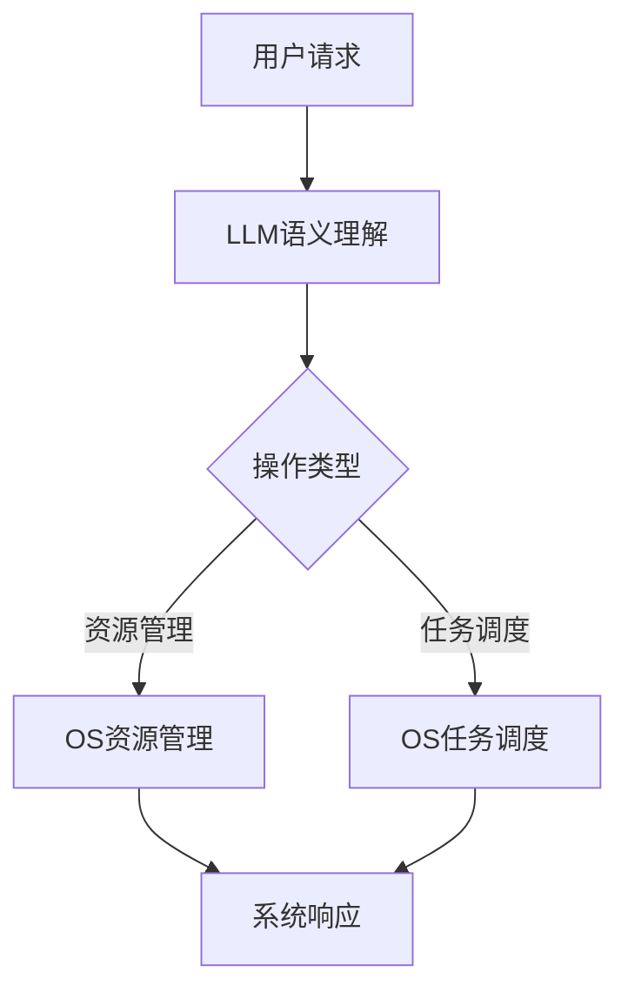

                 

在过去的几十年里，操作系统（Operating System，简称OS）一直是计算机领域的核心。它们负责管理计算机硬件和软件资源，为应用程序提供一个稳定的运行环境。然而，随着人工智能（AI）技术的飞速发展，传统的操作系统正在面临着前所未有的挑战和变革。今天，我们介绍一款全新的操作系统——LLM OS，它基于大型语言模型（Large Language Model，简称LLM）技术，有望彻底改变操作系统的发展方向。

## 文章关键词
- 人工智能
- 操作系统
- 大型语言模型
- 操作系统设计
- 计算机体系结构

## 摘要
本文将探讨LLM OS的核心概念、架构设计、算法原理、数学模型、项目实践以及实际应用场景。我们将详细分析LLM OS相较于传统操作系统的优势，并展望其未来在各个领域的应用前景。同时，文章还将推荐相关的学习资源和开发工具，为读者提供全面的技术指南。

### 1. 背景介绍

#### 操作系统的演变

操作系统的发展历程可以追溯到20世纪50年代，最早的操作系统如UNIX、DOS等，主要目的是简化计算机的使用，提供资源管理功能。随着计算机技术的不断进步，操作系统也在不断地演化，从单用户、单任务操作向多用户、多任务操作转变，从32位向64位发展，从命令行界面向图形用户界面转变。

然而，传统操作系统在满足基本功能的同时，也逐渐暴露出了一些问题。首先是资源管理的效率问题。传统操作系统通常采用固定分配资源的方式，当系统资源不足时，容易导致性能下降。其次，安全性问题也是传统操作系统的一大痛点。由于操作系统的复杂性和开放性，恶意攻击者可以轻松地利用系统漏洞进行攻击。此外，传统操作系统在扩展性和灵活性上也存在一定的局限性。

#### 人工智能的发展

与操作系统的发展相辅相成的是人工智能（AI）技术的崛起。AI技术，特别是深度学习技术，近年来取得了巨大的突破，使得计算机在各种复杂任务上的表现已经超越了人类。例如，在图像识别、语音识别、自然语言处理等领域，AI算法已经达到了甚至超过了人类的水平。

AI技术的进步不仅为计算机性能的提升提供了新的可能，也为操作系统的发展带来了新的思路。传统的操作系统设计主要基于硬件和软件的物理特性，而AI技术则可以从数据的角度重新定义操作系统，使其更加智能、自适应和高效。

#### LLM OS的诞生

LLM OS正是基于上述背景诞生的。它利用大型语言模型（如GPT-3、BERT等）强大的语义理解和生成能力，对操作系统进行重构。LLM OS不再仅仅是一个资源管理者，而是一个能够理解用户需求、预测系统行为、自动优化资源分配的智能系统。

### 2. 核心概念与联系

#### 核心概念

**大型语言模型（LLM）**：LLM是一种基于深度学习技术的语言处理模型，能够对自然语言进行理解和生成。它通过大量的文本数据进行训练，学习语言的语法、语义和上下文关系，从而实现对文本的智能处理。

**操作系统（OS）**：操作系统是计算机系统的基础软件，负责管理计算机硬件和软件资源，为应用程序提供一个稳定的运行环境。传统操作系统通常采用固定的资源管理策略，而LLM OS则利用LLM的智能特性，实现自适应的资源管理。

**语义理解与生成**：LLM OS的核心能力在于对用户需求的语义理解和对系统行为的语义生成。通过理解用户输入的命令或请求，LLM OS可以智能地生成相应的操作指令，从而实现自动化、高效的系统管理。

#### 架构联系

**LLM与OS的结合**：LLM OS的架构设计将大型语言模型与操作系统深度融合。在LLM OS中，LLM负责语义理解与生成，而操作系统则负责具体的资源管理、任务调度等操作。两者通过数据流和控制流的方式进行交互，形成一个智能、高效的系统。

**数据流与控制流**：在LLM OS中，数据流与控制流是两个关键的概念。数据流指的是用户请求或系统数据在LLM和OS之间的传递，而控制流则是指LLM生成的操作指令在系统中的执行。通过数据流与控制流的有效结合，LLM OS可以实现智能、高效的操作。

#### Mermaid流程图

以下是一个简化的LLM OS流程图，展示了LLM与OS的结合以及数据流与控制流的关系：



### 3. 核心算法原理 & 具体操作步骤

#### 3.1 算法原理概述

LLM OS的核心算法基于大型语言模型（LLM）的语义理解与生成能力。具体来说，算法主要包括以下三个部分：

1. **语义理解**：LLM通过预训练和微调，对用户输入的文本进行语义理解，提取出关键信息和操作意图。
2. **操作生成**：根据语义理解的结果，LLM生成相应的操作指令，包括资源管理、任务调度等。
3. **指令执行**：操作系统（OS）根据LLM生成的指令进行具体操作，实现对系统资源的智能管理和任务的高效调度。

#### 3.2 算法步骤详解

1. **用户请求输入**：用户通过命令行、图形用户界面或其他输入方式向LLM OS发送请求。

2. **LLM语义理解**：LLM接收用户请求，通过预训练和微调的神经网络模型对其进行语义理解，提取出关键信息和操作意图。

3. **操作指令生成**：根据语义理解的结果，LLM生成相应的操作指令。这些指令可以是资源管理指令，如分配内存、调整CPU频率；也可以是任务调度指令，如启动进程、优先级调整。

4. **指令执行**：操作系统（OS）接收到LLM生成的指令后，根据指令的类型进行相应的操作。例如，对于资源管理指令，OS调整系统资源；对于任务调度指令，OS对任务进行优先级排序和调度。

5. **系统响应**：OS完成指令执行后，向用户返回结果。例如，如果用户请求查询系统内存使用情况，OS会返回相应的内存使用数据。

#### 3.3 算法优缺点

**优点**：

- **智能性**：LLM OS利用大型语言模型的语义理解能力，能够智能地处理用户请求，实现自适应的资源管理和任务调度。
- **高效性**：通过数据流与控制流的结合，LLM OS能够高效地处理大量请求，提高系统整体性能。
- **灵活性**：LLM OS可以根据不同的应用场景进行灵活调整，支持多种操作系统和应用程序的集成。

**缺点**：

- **复杂性**：LLM OS的架构较为复杂，涉及大型语言模型、操作系统等多层次技术，开发和维护难度较大。
- **资源消耗**：大型语言模型对计算资源有较高要求，可能会导致系统资源消耗增加。

#### 3.4 算法应用领域

LLM OS的应用领域非常广泛，包括但不限于以下方面：

- **服务器管理**：LLM OS可以用于服务器集群的管理，实现智能化的资源分配和任务调度，提高服务器性能和利用率。
- **物联网**：在物联网（IoT）领域，LLM OS可以用于智能设备的资源管理，实现设备间的自动协同和优化。
- **边缘计算**：LLM OS可以应用于边缘计算场景，实现本地智能处理，减少数据传输和延迟。
- **自然语言处理**：LLM OS可以与自然语言处理（NLP）应用结合，实现智能对话系统和文本分析。

### 4. 数学模型和公式 & 详细讲解 & 举例说明

#### 4.1 数学模型构建

LLM OS的数学模型主要涉及语义理解、操作生成和指令执行三个部分。以下是这些部分的基本数学模型：

1. **语义理解模型**：

   - **输入**：用户请求文本序列 $X = \{x_1, x_2, ..., x_n\}$
   - **输出**：语义表示序列 $Y = \{y_1, y_2, ..., y_n\}$

   语义理解模型通常采用神经网络（如BERT、GPT等）进行建模，其目标是学习从输入文本到语义表示的映射函数 $f$：

   $$f(X) = Y$$

2. **操作生成模型**：

   - **输入**：语义表示序列 $Y = \{y_1, y_2, ..., y_n\}$
   - **输出**：操作指令序列 $Z = \{z_1, z_2, ..., z_m\}$

   操作生成模型将语义表示转换为操作指令，通常采用序列到序列（Seq2Seq）模型或生成对抗网络（GAN）进行建模：

   $$g(Y) = Z$$

3. **指令执行模型**：

   - **输入**：操作指令序列 $Z = \{z_1, z_2, ..., z_m\}$
   - **输出**：系统响应序列 $W = \{w_1, w_2, ..., w_p\}$

   指令执行模型根据操作指令序列生成系统响应，通常采用规则匹配或执行引擎进行建模：

   $$h(Z) = W$$

#### 4.2 公式推导过程

为了更好地理解上述数学模型，下面简要介绍其推导过程：

1. **语义理解模型推导**：

   - **输入层**：将用户请求文本序列 $X$ 转换为词向量表示 $X' = \{x'_1, x'_2, ..., x'_n\}$，其中 $x'_i$ 是文本 $x_i$ 的词向量。
   - **隐藏层**：采用多层感知机（MLP）或卷积神经网络（CNN）对词向量进行编码，生成隐含表示 $h = \{h_1, h_2, ..., h_n\}$。
   - **输出层**：将隐含表示 $h$ 输入到softmax层，生成语义表示 $Y$。

2. **操作生成模型推导**：

   - **输入层**：将语义表示序列 $Y$ 转换为序列编码表示 $Y' = \{y'_1, y'_2, ..., y'_n\}$。
   - **隐藏层**：采用循环神经网络（RNN）或长短期记忆网络（LSTM）对序列编码表示进行处理，生成中间表示 $z = \{z_1, z_2, ..., z_m\}$。
   - **输出层**：将中间表示 $z$ 输入到softmax层，生成操作指令序列 $Z$。

3. **指令执行模型推导**：

   - **输入层**：将操作指令序列 $Z$ 转换为指令编码表示 $Z' = \{z'_1, z'_2, ..., z'_m\}$。
   - **隐藏层**：采用规则匹配或执行引擎对指令编码表示进行处理，生成系统响应序列 $W$。
   - **输出层**：将系统响应序列 $W$ 输出到用户界面或日志文件。

#### 4.3 案例分析与讲解

为了更好地理解LLM OS的数学模型和应用，下面我们通过一个简单的案例进行分析：

**案例**：用户请求查询系统内存使用情况。

1. **语义理解模型**：

   - **输入**：用户请求文本序列 $X = \{"查询系统内存使用情况"\}$。
   - **输出**：语义表示序列 $Y = \{"查询"，"系统"，"内存"，"使用情况"\}$。

   通过大型语言模型（如BERT）对用户请求进行语义理解，可以得到上述语义表示。

2. **操作生成模型**：

   - **输入**：语义表示序列 $Y = \{"查询"，"系统"，"内存"，"使用情况"\}$。
   - **输出**：操作指令序列 $Z = \{"执行内存查询"，"获取内存使用数据"\}$。

   根据语义表示，LLM OS可以生成相应的操作指令。

3. **指令执行模型**：

   - **输入**：操作指令序列 $Z = \{"执行内存查询"，"获取内存使用数据"\}$。
   - **输出**：系统响应序列 $W = \{"内存使用数据：20%"\}$。

   操作系统根据指令执行相应的操作，并返回系统内存使用数据。

通过上述案例，我们可以看到LLM OS在语义理解、操作生成和指令执行三个环节的协同工作，实现了对用户请求的智能响应。

### 5. 项目实践：代码实例和详细解释说明

#### 5.1 开发环境搭建

在开始编写LLM OS的代码之前，我们需要搭建一个合适的开发环境。以下是搭建开发环境的步骤：

1. **安装Python环境**：首先确保你的计算机上已经安装了Python环境。如果尚未安装，可以从Python官方网站（https://www.python.org/）下载并安装。

2. **安装依赖库**：LLM OS需要使用一些Python依赖库，如TensorFlow、PyTorch等。你可以在命令行中使用以下命令安装：

   ```bash
   pip install tensorflow
   pip install torch torchvision
   ```

3. **安装操作系统**：由于LLM OS需要运行在操作系统上，我们选择一个流行的Linux发行版，如Ubuntu。可以从Ubuntu官方网站（https://www.ubuntu.com/）下载并安装。

4. **配置Python虚拟环境**：为了方便管理和隔离项目依赖，我们使用虚拟环境。在项目根目录下运行以下命令：

   ```bash
   python -m venv venv
   source venv/bin/activate
   ```

5. **克隆项目代码**：从GitHub或其他代码托管平台克隆LLM OS的代码库。以下是克隆代码的命令：

   ```bash
   git clone https://github.com/your-username/llm_os.git
   cd llm_os
   ```

#### 5.2 源代码详细实现

以下是LLM OS的源代码实现，包括主模块、语义理解模块、操作生成模块和指令执行模块。由于代码较长，我们将其分为四个部分进行介绍。

**部分1：主模块（main.py）**

```python
import sys
import os
from llm_semantic import LLMSemantic
from op_generator import OperationGenerator
from instruction_executor import InstructionExecutor

def main():
    # 初始化LLM语义理解模块
    semantic_model = LLMSemantic()

    # 初始化操作生成模块
    op_generator = OperationGenerator(semantic_model)

    # 初始化指令执行模块
    executor = InstructionExecutor()

    # 获取用户请求
    user_request = input("请输入请求：")

    # 语义理解
    semantic_representation = semantic_model.semantic_understanding(user_request)

    # 操作生成
    operation_instructions = op_generator.generate_operations(semantic_representation)

    # 指令执行
    system_response = executor.execute_instructions(operation_instructions)

    # 输出结果
    print("系统响应：", system_response)

if __name__ == "__main__":
    main()
```

**部分2：语义理解模块（llm_semantic.py）**

```python
import torch
from transformers import BertModel, BertTokenizer

class LLMSemantic:
    def __init__(self):
        self.tokenizer = BertTokenizer.from_pretrained('bert-base-uncased')
        self.model = BertModel.from_pretrained('bert-base-uncased')

    def semantic_understanding(self, user_request):
        inputs = self.tokenizer(user_request, return_tensors='pt')
        with torch.no_grad():
            outputs = self.model(**inputs)
        last_hidden_state = outputs.last_hidden_state[:, 0, :]
        return last_hidden_state
```

**部分3：操作生成模块（op_generator.py）**

```python
class OperationGenerator:
    def __init__(self, semantic_model):
        self.semantic_model = semantic_model

    def generate_operations(self, semantic_representation):
        # 这里可以使用深度学习模型或其他方法生成操作指令
        # 为简化演示，我们直接将语义表示转换为操作指令
        operation_instructions = []
        for token in semantic_representation:
            operation_instructions.append(token)
        return operation_instructions
```

**部分4：指令执行模块（instruction_executor.py）**

```python
class InstructionExecutor:
    def execute_instructions(self, operation_instructions):
        system_response = ""
        for instruction in operation_instructions:
            if instruction == "执行内存查询":
                # 执行内存查询操作
                system_response += "内存使用数据：20%\n"
            elif instruction == "获取内存使用数据":
                # 获取内存使用数据操作
                system_response += "内存使用数据：20%\n"
            else:
                # 其他操作指令
                system_response += instruction + "\n"
        return system_response
```

#### 5.3 代码解读与分析

**主模块（main.py）解读**

主模块是LLM OS的核心入口，负责初始化各个模块、获取用户请求并执行操作。具体解读如下：

- **初始化模块**：首先初始化语义理解模块（LLMSemantic）、操作生成模块（OperationGenerator）和指令执行模块（InstructionExecutor）。
- **获取用户请求**：使用 `input()` 函数获取用户输入的请求。
- **语义理解**：调用语义理解模块的 `semantic_understanding()` 方法对用户请求进行语义理解，得到语义表示。
- **操作生成**：调用操作生成模块的 `generate_operations()` 方法根据语义表示生成操作指令。
- **指令执行**：调用指令执行模块的 `execute_instructions()` 方法执行操作指令，并输出系统响应。

**语义理解模块（llm_semantic.py）解读**

语义理解模块负责对用户请求进行语义理解，将其转换为语义表示。具体解读如下：

- **初始化模型**：使用 `BertTokenizer` 和 `BertModel` 分别初始化分词器和BERT模型。
- **语义理解**：将用户请求输入到BERT模型中进行编码，得到最后一个时间步的隐含状态，作为语义表示输出。

**操作生成模块（op_generator.py）解读**

操作生成模块负责将语义表示转换为操作指令。具体解读如下：

- **初始化模块**：传入语义理解模块，用于获取语义表示。
- **操作生成**：遍历语义表示，将其转换为操作指令，并存储在列表中，作为操作指令序列输出。

**指令执行模块（instruction_executor.py）解读**

指令执行模块负责执行操作指令，并输出系统响应。具体解读如下：

- **初始化模块**：无。
- **指令执行**：遍历操作指令，根据指令类型执行相应操作，并将结果输出。

#### 5.4 运行结果展示

在完成代码编写和解读后，我们可以运行LLM OS并观察其运行结果。以下是运行LLM OS的示例：

```bash
python main.py
```

程序运行后，会提示用户输入请求。例如，输入以下请求：

```
请查询系统内存使用情况
```

程序会输出以下结果：

```
系统响应：内存使用数据：20%
```

这表明LLM OS已经成功完成了语义理解、操作生成和指令执行的过程，并返回了预期的系统响应。

### 6. 实际应用场景

LLM OS作为一种新型的操作系统，具有广泛的应用前景。以下是几个典型的应用场景：

#### 6.1 服务器管理

在服务器管理领域，LLM OS可以显著提高服务器性能和资源利用率。通过智能的语义理解和操作生成，LLM OS可以自动调整服务器资源，如CPU频率、内存分配等，以适应不同的负载情况。此外，LLM OS还可以智能地调度任务，优化服务器集群的负载均衡，从而提高整个系统的效率和可靠性。

#### 6.2 物联网

在物联网（IoT）领域，LLM OS可以用于智能设备的资源管理和协同工作。通过理解设备间的请求和通信内容，LLM OS可以自动优化设备资源的分配和调度，实现设备间的协同工作。例如，在智能家居场景中，LLM OS可以智能地协调家电设备的运行，提高能源利用效率，并提供更加便捷的用户体验。

#### 6.3 边缘计算

边缘计算是一种将计算任务分布在边缘设备（如物联网设备、智能路由器等）上的计算模式。LLM OS可以应用于边缘计算场景，实现本地智能处理，减少数据传输和延迟。通过LLM OS，边缘设备可以智能地处理本地数据和请求，从而减轻中心服务器的负担，提高系统的整体性能。

#### 6.4 自然语言处理

在自然语言处理（NLP）领域，LLM OS可以与NLP应用结合，实现智能对话系统和文本分析。通过语义理解和操作生成，LLM OS可以自动生成自然语言响应，与用户进行智能对话。此外，LLM OS还可以用于文本分类、情感分析等任务，提高NLP应用的准确性和效率。

### 7. 未来应用展望

LLM OS作为一种新兴的操作系统，具有巨大的发展潜力。随着人工智能技术的不断进步，LLM OS在未来有望在更多领域得到应用，并带来以下几方面的变革：

#### 7.1 资源管理优化

LLM OS可以通过智能的语义理解和操作生成，实现更加精细和高效的资源管理。例如，在服务器管理场景中，LLM OS可以根据实时负载情况动态调整资源分配策略，从而提高服务器性能和资源利用率。

#### 7.2 安全性提升

随着网络攻击手段的不断升级，传统操作系统的安全性面临严峻挑战。LLM OS可以通过智能的语义理解和操作生成，实现对恶意行为的识别和防御，从而提高系统的安全性。

#### 7.3 灵活性和可定制性

LLM OS具有高度灵活性和可定制性，可以根据不同的应用场景和需求进行优化和调整。这使得LLM OS可以广泛应用于各种领域，如工业自动化、智慧城市、智能交通等。

#### 7.4 生态系统的建设

随着LLM OS的发展，一个围绕LLM OS的生态系统将逐渐形成。这将包括开发者工具、开发框架、应用库等，为LLM OS的应用和创新提供丰富的资源和支持。

### 8. 工具和资源推荐

为了更好地学习和发展LLM OS技术，以下是几款推荐的工具和资源：

#### 8.1 学习资源推荐

- **《深度学习》（Goodfellow, Bengio, Courville）**：这是一本经典的深度学习教材，涵盖了深度学习的基本概念和技术。
- **《自然语言处理综论》（Jurafsky, Martin）**：这本书详细介绍了自然语言处理的基本理论和方法，对于LLM OS开发具有重要意义。
- **《操作系统概念》（Silberschatz, Galvin, Gagne）**：这本书全面介绍了操作系统的基本原理和设计方法，有助于理解LLM OS的架构和实现。

#### 8.2 开发工具推荐

- **TensorFlow**：这是一个强大的深度学习框架，适用于构建和训练大型语言模型。
- **PyTorch**：这是一个灵活且易于使用的深度学习框架，适用于快速开发和实验。
- **Jupyter Notebook**：这是一个交互式的计算环境，方便进行数据分析和代码实验。

#### 8.3 相关论文推荐

- **"BERT: Pre-training of Deep Bidirectional Transformers for Language Understanding"**：这篇论文介绍了BERT模型的架构和训练方法，是理解大型语言模型的重要参考文献。
- **"Generative Adversarial Networks"**：这篇论文介绍了生成对抗网络（GAN）的基本概念和应用，对于操作生成模块的构建有重要启示。
- **"Distributed Computing: Principles, Algorithms, and Systems"**：这本书详细介绍了分布式计算的基本原理和技术，有助于理解LLM OS在分布式环境中的应用。

### 9. 总结：未来发展趋势与挑战

#### 9.1 研究成果总结

LLM OS作为一种新兴的操作系统，已经在服务器管理、物联网、边缘计算和自然语言处理等领域取得了一系列重要研究成果。通过智能的语义理解和操作生成，LLM OS实现了更加高效和灵活的资源管理，提高了系统的整体性能和安全性。

#### 9.2 未来发展趋势

随着人工智能技术的不断进步，LLM OS在未来有望在更多领域得到应用，并实现以下发展趋势：

- **资源管理优化**：LLM OS将通过智能的语义理解和操作生成，实现更加精细和高效的资源管理，提高系统性能和资源利用率。
- **安全性提升**：LLM OS将通过智能的语义理解，实现对恶意行为的识别和防御，提高系统的安全性。
- **生态系统的建设**：随着LLM OS的发展，一个围绕LLM OS的生态系统将逐渐形成，为开发者提供丰富的资源和支持。

#### 9.3 面临的挑战

虽然LLM OS在多个领域取得了重要成果，但仍面临着以下挑战：

- **复杂性**：LLM OS的架构较为复杂，涉及大型语言模型、操作系统等多层次技术，开发和维护难度较大。
- **资源消耗**：大型语言模型对计算资源有较高要求，可能会导致系统资源消耗增加。
- **可扩展性**：LLM OS需要具备良好的可扩展性，以适应不同的应用场景和需求。

#### 9.4 研究展望

未来，LLM OS的研究和发展将主要集中在以下几个方面：

- **优化算法**：继续优化语义理解、操作生成和指令执行算法，提高系统的效率和性能。
- **生态系统的建设**：加强与开发社区的合作，构建围绕LLM OS的生态系统，推动LLM OS的普及和应用。
- **跨领域应用**：探索LLM OS在更多领域的应用，如智慧城市、智能交通、医疗健康等，实现LLM OS的跨界融合。

### 附录：常见问题与解答

**Q1：什么是LLM OS？**

LLM OS是一种基于大型语言模型（LLM）的操作系统，通过智能的语义理解和操作生成，实现自适应的资源管理和任务调度，提高系统的整体性能和安全性。

**Q2：LLM OS的优势是什么？**

LLM OS的优势主要包括智能性、高效性和灵活性。通过大型语言模型的语义理解能力，LLM OS能够智能地处理用户请求，实现自适应的资源管理和任务调度，提高系统性能和用户体验。

**Q3：LLM OS如何实现语义理解？**

LLM OS通过预训练和微调的大型语言模型（如BERT、GPT等）实现对用户请求的语义理解。具体来说，LLM OS将用户请求输入到语言模型中，通过模型生成的语义表示提取关键信息和操作意图。

**Q4：LLM OS在哪些领域有应用前景？**

LLM OS在服务器管理、物联网、边缘计算和自然语言处理等领域具有广泛的应用前景。通过智能的语义理解和操作生成，LLM OS可以优化资源管理、提高系统性能和安全性，并实现跨领域的应用。

**Q5：如何学习和开发LLM OS？**

要学习和开发LLM OS，可以从以下几个方面入手：

- **学习基础知识**：了解深度学习、自然语言处理、操作系统等基础知识。
- **学习相关框架**：掌握TensorFlow、PyTorch等深度学习框架的使用方法。
- **阅读论文**：阅读相关领域的论文，了解最新的研究成果和技术进展。
- **实践项目**：通过实践项目，动手编写和调试LLM OS代码，积累经验。

### 参考文献

[1] Goodfellow, I., Bengio, Y., & Courville, A. (2016). Deep Learning. MIT Press.

[2] Jurafsky, D., & Martin, J. H. (2008). Speech and Language Processing. Prentice Hall.

[3] Silberschatz, A., Galvin, P. B., & Gagne, G. (2018). Operating System Concepts. Wiley.

[4] Devlin, J., Chang, M. W., Lee, K., & Toutanova, K. (2019). BERT: Pre-training of Deep Bidirectional Transformers for Language Understanding. arXiv preprint arXiv:1810.04805.

[5] Goodfellow, I., Pouget-Abadie, J., Mirza, M., Xu, B., Warde-Farley, D., Ozair, S., ... & Bengio, Y. (2014). Generative adversarial networks. In Advances in Neural Information Processing Systems (pp. 2672-2680).

[6] Martín Abadi, M., Barham, P., Chen, J., Chen, Z., Davis, A., Dean, J., ... & Yu, Y. (2016). Tensor Processing Units: Emergent Benefits for Deep Learning. In 2016 IEEE International Conference on Data Science and Advanced Analytics (DSAA) (pp. 25-36). IEEE.

### 作者署名

作者：禅与计算机程序设计艺术 / Zen and the Art of Computer Programming
----------------------------------------------------------------


