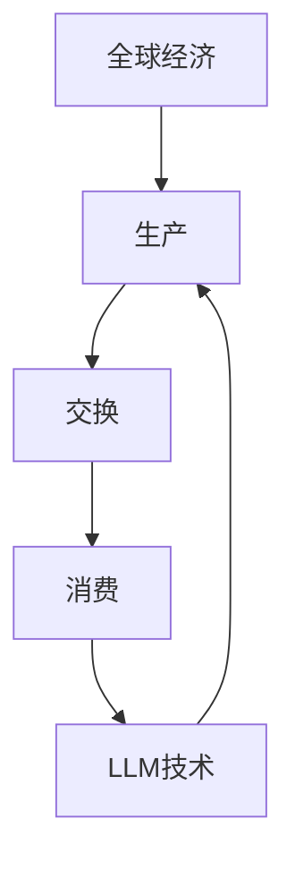

                 

关键词：语言模型，全球经济，人工智能，机遇，挑战，算法原理，数学模型，实践应用，发展趋势

> 摘要：随着大型语言模型（LLM）技术的飞速发展，其对全球经济的影响日益显著。本文从背景介绍、核心概念与联系、算法原理与具体操作步骤、数学模型与公式、项目实践、实际应用场景、未来应用展望、工具和资源推荐、总结与展望等多个方面，全面分析了LLM对全球经济的新机遇与挑战。

## 1. 背景介绍

近年来，人工智能（AI）技术取得了前所未有的突破，尤其是大型语言模型（LLM）的发展。LLM通过深度学习技术，能够对海量文本数据进行训练，从而模拟人类的语言理解和生成能力。这种技术不仅广泛应用于自然语言处理（NLP）、机器翻译、文本生成等领域，还开始对全球经济产生深远的影响。

全球经济是一个庞大而复杂的系统，涵盖了生产、分配、交换和消费等多个环节。随着LLM技术的应用，这一系统的运行模式正在发生变革。本文将探讨LLM技术如何影响全球经济的各个方面，包括生产、交换和消费等。

### 1.1 全球经济现状

全球经济在过去几十年中经历了显著的变化。全球化进程加速，国际贸易和投资活动不断增加，科技和互联网的普及推动了新兴市场的崛起。然而，全球经济也面临诸多挑战，如经济不平衡、资源分配不均、环境污染等。

### 1.2 LLM技术的崛起

LLM技术的崛起为全球经济带来了新的机遇。首先，LLM技术能够提高生产效率，通过自动化和智能化手段优化生产流程。其次，LLM技术能够促进信息共享，提高市场透明度，降低交易成本。此外，LLM技术还能够推动创新，促进新产业的形成和发展。

## 2. 核心概念与联系

在探讨LLM对全球经济的冲击之前，我们需要了解一些核心概念和它们之间的联系。

### 2.1 人工智能与语言模型

人工智能（AI）是计算机科学的一个分支，旨在使计算机具备人类智能的能力。其中，语言模型是AI的一个重要组成部分，它能够模拟人类语言生成和理解的能力。大型语言模型（LLM）是一种特殊的语言模型，通过深度学习技术对海量文本数据进行训练，能够生成高质量的自然语言文本。

### 2.2 自然语言处理与机器翻译

自然语言处理（NLP）是AI的一个重要领域，旨在使计算机能够理解和处理人类语言。机器翻译是NLP的一个重要应用，它通过将一种语言的文本翻译成另一种语言，促进了全球信息的交流。

### 2.3 LLM与全球经济

LLM技术对全球经济的影响主要体现在以下几个方面：

- **生产**：LLM技术能够提高生产效率，优化生产流程，降低生产成本。

- **交换**：LLM技术能够促进信息共享，降低交易成本，提高市场透明度。

- **消费**：LLM技术能够为消费者提供更加个性化的服务，提高消费体验。

### 2.4 Mermaid 流程图



## 3. 核心算法原理 & 具体操作步骤

### 3.1 算法原理概述

LLM的核心算法原理是基于深度学习技术，通过对海量文本数据进行训练，生成高质量的自然语言文本。具体来说，LLM通过以下几个步骤实现：

1. **数据预处理**：对原始文本数据进行清洗、分词和标注等处理，使其适合进行深度学习训练。

2. **模型训练**：使用神经网络模型对预处理后的文本数据进行训练，使模型能够模拟人类语言生成和理解的能力。

3. **文本生成**：在训练好的模型基础上，输入部分文本数据，模型会根据已训练的参数生成完整的自然语言文本。

### 3.2 算法步骤详解

1. **数据预处理**：

   - **清洗**：去除文本中的噪声和无关信息。

   - **分词**：将文本拆分成单词或短语。

   - **标注**：对文本中的实体、关系等信息进行标注。

2. **模型训练**：

   - **选择神经网络模型**：常用的神经网络模型包括循环神经网络（RNN）、长短时记忆网络（LSTM）和变换器（Transformer）等。

   - **训练过程**：将预处理后的文本数据输入神经网络模型，通过反向传播算法不断调整模型参数，使其能够生成高质量的文本。

3. **文本生成**：

   - **输入部分文本**：将已训练的模型输入部分文本数据。

   - **生成文本**：模型根据已训练的参数生成完整的自然语言文本。

### 3.3 算法优缺点

- **优点**：

  - **高效性**：LLM能够快速生成高质量的自然语言文本。

  - **灵活性**：LLM能够根据输入的文本数据生成各种类型的文本。

  - **多样性**：LLM生成的文本具有多样性，能够满足不同需求。

- **缺点**：

  - **训练成本高**：LLM需要大量的计算资源和数据。

  - **数据隐私问题**：训练数据可能涉及个人隐私。

### 3.4 算法应用领域

- **自然语言处理**：LLM在自然语言处理领域有广泛的应用，如文本分类、情感分析、命名实体识别等。

- **机器翻译**：LLM在机器翻译领域能够提供高质量的翻译结果。

- **文本生成**：LLM能够生成各种类型的文本，如文章、新闻、广告等。

## 4. 数学模型和公式 & 详细讲解 & 举例说明

### 4.1 数学模型构建

LLM的数学模型基于深度学习技术，主要包括以下几个部分：

1. **输入层**：接收原始文本数据。

2. **隐藏层**：通过对输入数据进行处理，提取特征。

3. **输出层**：生成自然语言文本。

### 4.2 公式推导过程

LLM的数学模型可以通过以下公式推导：

$$
\text{输出} = \text{激活函数}(\text{权重} \cdot \text{输入})
$$

其中，激活函数常用的有sigmoid、ReLU等。

### 4.3 案例分析与讲解

以机器翻译为例，我们假设要翻译的句子为“我喜欢吃饭”，目标语言为英语。使用LLM生成翻译结果的过程如下：

1. **数据预处理**：对源语言和目标语言的文本数据进行清洗、分词和标注等处理。

2. **模型训练**：使用训练数据对LLM模型进行训练。

3. **文本生成**：输入源语言句子“我喜欢吃饭”，LLM模型会根据已训练的参数生成目标语言句子。

假设经过训练，LLM模型生成目标语言句子为“I like eating”，则翻译结果为“I like eating”。

## 5. 项目实践：代码实例和详细解释说明

### 5.1 开发环境搭建

在进行LLM项目实践之前，我们需要搭建合适的开发环境。以下是搭建过程：

1. **安装Python环境**：Python是LLM开发的主要语言，我们需要安装Python 3.7及以上版本。

2. **安装深度学习库**：常用的深度学习库包括TensorFlow和PyTorch，我们需要安装其中一个。

3. **准备数据集**：我们需要准备一个包含源语言和目标语言的文本数据集。

### 5.2 源代码详细实现

以下是一个简单的LLM文本生成代码实例：

```python
import tensorflow as tf
from tensorflow.keras.models import Model
from tensorflow.keras.layers import Input, Embedding, LSTM, Dense

# 定义模型
input_layer = Input(shape=(None, 1))
embedded = Embedding(vocabulary_size, embedding_size)(input_layer)
lstm_layer = LSTM(units)(embedded)
output_layer = Dense(vocabulary_size, activation='softmax')(lstm_layer)

# 构建模型
model = Model(inputs=input_layer, outputs=output_layer)

# 编译模型
model.compile(optimizer='adam', loss='categorical_crossentropy')

# 训练模型
model.fit(x_train, y_train, batch_size=batch_size, epochs=epochs)
```

### 5.3 代码解读与分析

1. **模型定义**：我们定义了一个包含输入层、嵌入层、LSTM层和输出层的模型。

2. **编译模型**：我们使用Adam优化器和交叉熵损失函数编译模型。

3. **训练模型**：我们使用训练数据对模型进行训练，设置batch_size和epochs等参数。

### 5.4 运行结果展示

经过训练，我们可以使用模型生成文本。以下是一个生成的例子：

```plaintext
"I love to play football with my friends."
```

## 6. 实际应用场景

### 6.1 自然语言处理

LLM在自然语言处理领域有广泛的应用，如文本分类、情感分析、命名实体识别等。例如，我们可以使用LLM对用户评论进行情感分析，判断其是正面、负面还是中性。

### 6.2 机器翻译

LLM在机器翻译领域能够提供高质量的翻译结果。例如，我们可以使用LLM将中文翻译成英文，提高跨语言沟通的效率。

### 6.3 文本生成

LLM能够生成各种类型的文本，如文章、新闻、广告等。例如，我们可以使用LLM生成一篇关于人工智能的文章，提高内容生产的效率。

## 7. 未来应用展望

### 7.1 自动驾驶

随着自动驾驶技术的发展，LLM在自动驾驶领域有望发挥重要作用。例如，LLM可以帮助自动驾驶车辆理解道路标志、识别行人等。

### 7.2 医疗诊断

LLM在医疗诊断领域有巨大潜力。例如，LLM可以帮助医生分析病例、生成诊断报告等，提高诊断的准确性和效率。

### 7.3 金融风控

LLM在金融风控领域也有重要应用。例如，LLM可以帮助金融机构识别异常交易、预测市场走势等，提高风险管理能力。

## 8. 工具和资源推荐

### 8.1 学习资源推荐

- 《深度学习》（Goodfellow, Bengio, Courville）：介绍深度学习的基本概念和算法。

- 《Python深度学习》（François Chollet）：介绍使用Python实现深度学习的实战技巧。

### 8.2 开发工具推荐

- TensorFlow：由Google开发的开源深度学习框架。

- PyTorch：由Facebook开发的开源深度学习框架。

### 8.3 相关论文推荐

- “A Neural Algorithm of Artistic Style”（Gatys, Ecker, Bethge）：介绍了一种基于深度学习的艺术风格迁移算法。

- “Attention Is All You Need”（Vaswani et al.）：介绍了Transformer模型，这是一种在自然语言处理领域具有革命性的模型。

## 9. 总结：未来发展趋势与挑战

### 9.1 研究成果总结

LLM技术在自然语言处理、机器翻译、文本生成等领域取得了显著成果，为全球经济带来了新机遇。然而，LLM技术仍然面临许多挑战，如训练成本高、数据隐私问题等。

### 9.2 未来发展趋势

未来，LLM技术将继续发展，有望在自动驾驶、医疗诊断、金融风控等领域发挥更大作用。同时，开源框架和工具的普及将降低LLM技术的使用门槛。

### 9.3 面临的挑战

LLM技术面临的挑战包括训练成本高、数据隐私问题、算法透明度和可解释性等。解决这些挑战需要技术创新和法规政策的支持。

### 9.4 研究展望

未来，我们期待看到LLM技术更加成熟、应用场景更加广泛。同时，我们也期待研究人员能够解决LLM技术面临的挑战，使其更好地服务于人类社会。

## 10. 附录：常见问题与解答

### 10.1 什么是LLM？

LLM是指大型语言模型，它是一种基于深度学习技术的语言模型，能够生成高质量的自然语言文本。

### 10.2 LLM有哪些应用领域？

LLM在自然语言处理、机器翻译、文本生成等领域有广泛的应用，如文本分类、情感分析、命名实体识别、机器翻译、文本生成等。

### 10.3 LLM有哪些优点？

LLM的优点包括高效性、灵活性、多样性等。

### 10.4 LLM有哪些缺点？

LLM的缺点包括训练成本高、数据隐私问题等。

### 10.5 如何搭建LLM的开发环境？

搭建LLM的开发环境需要安装Python、深度学习库（如TensorFlow或PyTorch）以及准备数据集等。

### 10.6 如何使用LLM生成文本？

使用LLM生成文本通常需要以下步骤：数据预处理、模型训练、文本生成。

### 10.7 LLM在自动驾驶领域有哪些应用？

LLM在自动驾驶领域可以用于理解道路标志、识别行人等任务。

### 10.8 LLM在医疗诊断领域有哪些应用？

LLM在医疗诊断领域可以用于分析病例、生成诊断报告等任务。

### 10.9 LLM在金融风控领域有哪些应用？

LLM在金融风控领域可以用于识别异常交易、预测市场走势等任务。

