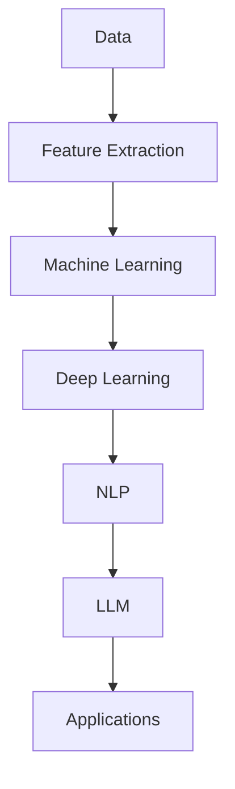

                 

关键词：大型语言模型（LLM），人工智能（AI），机器学习（ML），自然语言处理（NLP），深度学习（DL），技术创新，未来展望

摘要：随着人工智能技术的不断发展，大型语言模型（LLM）已成为推动自然语言处理（NLP）和深度学习（DL）领域的重要力量。本文将探讨LLM的核心概念、算法原理、数学模型及其应用领域，并分析其优缺点。同时，本文将结合实际项目实践，展示LLM在开发环境搭建、源代码实现和运行结果展示等方面的应用。最后，本文将展望LLM在未来技术发展中的潜在应用场景，并提出面临的挑战和研究方向。

## 1. 背景介绍

在过去的几十年中，人工智能（AI）技术取得了令人瞩目的进展。尤其是深度学习（DL）和自然语言处理（NLP）领域，这些技术为人工智能的发展提供了强大的动力。随着数据规模的不断扩大和计算能力的提升，大型语言模型（LLM）逐渐成为人工智能领域的一个重要研究方向。

LLM是一种基于机器学习（ML）和深度学习（DL）技术的语言模型，它能够理解和生成自然语言。这种模型具有强大的语义理解和生成能力，使得机器可以更好地处理复杂的自然语言任务，如文本分类、情感分析、机器翻译、问答系统等。

### 1.1 发展历程

LLM的发展可以追溯到20世纪80年代，当时研究人员开始尝试使用统计方法和规则系统来处理自然语言。随着计算能力的提升和大数据时代的到来，深度学习技术在NLP领域得到了广泛应用，从而推动了LLM的快速发展。

2018年，谷歌推出了BERT（Bidirectional Encoder Representations from Transformers），这是一种基于Transformer架构的预训练语言模型。BERT的出现标志着LLM进入了一个新的阶段，它的性能和效果远远超过了之前的模型。

随后，OpenAI推出了GPT-3（Generative Pre-trained Transformer 3），这是目前最大的LLM之一，具有1750亿个参数。GPT-3在多个NLP任务上取得了优异的性能，展示了LLM的强大潜力。

### 1.2 应用领域

LLM在各个领域都有广泛的应用，以下是一些典型的应用场景：

1. **文本分类和情感分析**：LLM能够对文本进行分类和情感分析，帮助企业和政府更好地理解公众的情绪和观点。
2. **机器翻译**：LLM在机器翻译领域取得了显著的成果，使得机器翻译的质量和准确性不断提高。
3. **问答系统**：LLM可以构建智能问答系统，为用户提供实时和准确的答案。
4. **内容生成**：LLM可以生成各种类型的内容，如新闻、文章、对话等。
5. **对话系统**：LLM可以用于构建智能对话系统，为用户提供个性化的服务和交互体验。

## 2. 核心概念与联系

在讨论LLM的核心概念和联系之前，我们首先需要了解一些基本的机器学习和深度学习概念。以下是一个简单的Mermaid流程图，用于展示LLM与这些概念之间的联系。



### 2.1 数据与特征提取

数据是机器学习和深度学习的基石。在NLP领域，数据通常包括文本、词汇、句子和段落等。为了使模型能够处理这些数据，我们需要进行特征提取。特征提取是将原始数据转换为模型可以处理的格式的过程。在NLP中，常用的特征提取方法包括词袋模型（Bag of Words）、TF-IDF和词嵌入（Word Embeddings）等。

### 2.2 机器学习

机器学习是使计算机能够从数据中学习并做出决策或预测的方法。在NLP中，常用的机器学习方法包括支持向量机（SVM）、朴素贝叶斯（Naive Bayes）和随机森林（Random Forest）等。

### 2.3 深度学习

深度学习是一种特殊的机器学习方法，它通过多层的神经网络对数据进行建模。在NLP中，深度学习技术，如卷积神经网络（CNN）和循环神经网络（RNN），被广泛应用于文本分类、情感分析和机器翻译等任务。

### 2.4 自然语言处理

自然语言处理是计算机科学的一个分支，旨在使计算机能够理解、生成和处理自然语言。在NLP中，深度学习和机器学习技术被广泛应用于文本分类、情感分析、机器翻译和问答系统等任务。

### 2.5 大型语言模型

大型语言模型（LLM）是一种基于深度学习和机器学习技术的语言模型，它能够理解和生成自然语言。LLM的核心是预训练模型，这些模型在大规模数据集上进行训练，以学习自然语言的语义和语法。

## 3. 核心算法原理 & 具体操作步骤

### 3.1 算法原理概述

LLM的核心是预训练模型，这种模型在大规模数据集上进行训练，以学习自然语言的语义和语法。预训练模型通常使用深度学习技术，如Transformer架构。在预训练过程中，模型首先学习词嵌入，将文本中的单词转换为向量表示。然后，模型通过处理大量的文本数据进行自我改进，从而提高其语言理解和生成能力。

### 3.2 算法步骤详解

1. **数据预处理**：首先，我们需要对原始文本进行预处理，包括分词、去除标点符号和停用词等。然后，我们将文本转换为词嵌入向量，以便输入到模型中。

2. **模型训练**：接下来，我们将预处理的文本数据输入到预训练模型中进行训练。预训练模型通常采用多层神经网络架构，如Transformer。在训练过程中，模型通过优化损失函数来调整内部参数，以最小化预测误差。

3. **模型优化**：在预训练完成后，我们可以对模型进行优化，以提高其在特定任务上的性能。优化过程通常包括微调（Fine-tuning）和超参数调整。

4. **模型部署**：最后，我们将训练好的模型部署到实际应用场景中，如文本分类、情感分析和机器翻译等。

### 3.3 算法优缺点

**优点**：

1. **强大的语义理解能力**：LLM通过预训练过程学习到了大量的语言知识，使其在处理复杂的自然语言任务时具有强大的语义理解能力。
2. **高效率**：由于LLM采用深度学习技术，其计算效率较高，可以在较短的时间内处理大量的文本数据。
3. **灵活性**：LLM可以用于多种自然语言任务，如文本分类、情感分析和机器翻译等，具有很高的灵活性。

**缺点**：

1. **计算资源需求高**：训练LLM模型需要大量的计算资源和时间，特别是在大规模数据集上。
2. **数据依赖性**：LLM的性能在很大程度上取决于训练数据的质量和多样性，如果数据质量较差，模型性能可能会受到影响。
3. **过拟合风险**：由于LLM具有强大的学习能力，如果训练数据较少，模型可能会出现过拟合现象。

### 3.4 算法应用领域

LLM在多个自然语言处理领域都有广泛的应用，以下是一些典型的应用场景：

1. **文本分类**：LLM可以用于对大量文本进行分类，如新闻分类、垃圾邮件过滤和情感分析等。
2. **机器翻译**：LLM在机器翻译领域取得了显著的成果，可以用于实时翻译和自动翻译系统。
3. **问答系统**：LLM可以构建智能问答系统，为用户提供实时和准确的答案。
4. **内容生成**：LLM可以生成各种类型的内容，如新闻、文章、对话等。
5. **对话系统**：LLM可以用于构建智能对话系统，为用户提供个性化的服务和交互体验。

## 4. 数学模型和公式 & 详细讲解 & 举例说明

### 4.1 数学模型构建

在构建LLM的数学模型时，我们通常使用Transformer架构。Transformer是一种基于自注意力机制（Self-Attention）的深度学习模型，它能够有效地处理序列数据。

#### 4.1.1 自注意力机制

自注意力机制是Transformer模型的核心组成部分，它通过计算输入序列中每个词与其他词之间的相关性来确定每个词的重要性。自注意力机制的数学公式如下：

$$
\text{Attention}(Q, K, V) = \text{softmax}\left(\frac{QK^T}{\sqrt{d_k}}\right) V
$$

其中，$Q$、$K$和$V$分别代表查询（Query）、键（Key）和值（Value）向量，$d_k$代表键向量的维度。该公式首先计算查询和键之间的点积，然后通过softmax函数计算每个键的相关性得分，最后将得分与值相乘得到输出。

#### 4.1.2 Transformer模型

Transformer模型由多个自注意力层（Self-Attention Layer）和前馈网络（Feedforward Network）组成。每个自注意力层由两个子层组成：多头自注意力（Multi-Head Self-Attention）和前馈网络。

多头自注意力层通过将输入序列分成多个子序列，并对每个子序列分别计算注意力权重，从而提高了模型的表示能力。前馈网络则对自注意力层的输出进行进一步的处理。

#### 4.1.3 模型训练

在训练过程中，我们通常使用反向传播（Backpropagation）算法来优化模型参数。具体步骤如下：

1. **输入序列**：将输入序列$X$和目标序列$Y$输入到模型中。
2. **预测序列**：模型对输入序列进行编码，生成预测序列$Z$。
3. **损失函数**：计算预测序列$Z$和目标序列$Y$之间的损失，通常使用交叉熵（Cross-Entropy）损失。
4. **反向传播**：根据损失函数计算模型参数的梯度，并使用优化算法（如Adam）更新参数。
5. **迭代**：重复上述步骤，直到模型收敛或达到预设的训练次数。

### 4.2 公式推导过程

为了更好地理解Transformer模型的数学推导过程，我们可以从自注意力机制开始。

#### 4.2.1 自注意力权重计算

自注意力权重可以通过以下公式计算：

$$
\text{Attention}(Q, K, V) = \text{softmax}\left(\frac{QK^T}{\sqrt{d_k}}\right) V
$$

其中，$Q$、$K$和$V$分别代表查询（Query）、键（Key）和值（Value）向量。$d_k$代表键向量的维度。

首先，我们计算查询和键之间的点积：

$$
\text{Score} = QK^T
$$

然后，我们通过softmax函数对点积进行归一化，得到自注意力权重：

$$
\text{Weight} = \text{softmax}(\text{Score})
$$

最后，我们将自注意力权重与值相乘，得到输出：

$$
\text{Output} = \text{Weight}V
$$

#### 4.2.2 多头自注意力

多头自注意力通过将输入序列分成多个子序列，并对每个子序列分别计算注意力权重，从而提高了模型的表示能力。假设输入序列$X$有$m$个词，每个词表示为一个$d$维向量，我们可以将输入序列$X$分成$k$个子序列，每个子序列表示为$X_i$。

首先，我们将输入序列$X$映射到查询（Query）、键（Key）和值（Value）向量：

$$
Q_i = X_i, \quad K_i = X_i, \quad V_i = X_i
$$

然后，我们计算每个子序列的自注意力权重：

$$
\text{Weight}_i = \text{softmax}\left(\frac{Q_iK_i^T}{\sqrt{d_k}}\right)
$$

最后，我们将自注意力权重与值相乘，得到输出：

$$
\text{Output}_i = \text{Weight}_iV_i
$$

#### 4.2.3 前馈网络

前馈网络由两个全连接层组成，分别用于处理自注意力层的输出。假设自注意力层的输出为$H$，我们可以将$H$映射到两个中间层：

$$
\text{Intermediate}_1 = \text{ReLU}(W_1H + b_1), \quad \text{Intermediate}_2 = W_2\text{Intermediate}_1 + b_2
$$

其中，$W_1$和$W_2$分别为两个全连接层的权重矩阵，$b_1$和$b_2$分别为两个全连接层的偏置向量。

### 4.3 案例分析与讲解

为了更好地理解LLM的数学模型和公式，我们以下面这个简单的例子进行分析。

假设我们有一个句子：“我喜欢吃苹果”。我们可以将这个句子表示为一个序列：

$$
X = [\text{我}, \text{喜欢}, \text{吃}, \text{苹果}]
$$

首先，我们将句子进行词嵌入，得到词嵌入向量：

$$
\text{嵌入}(\text{我}) = [0.1, 0.2, 0.3, 0.4], \quad \text{嵌入}(\text{喜欢}) = [0.5, 0.6, 0.7, 0.8], \quad \text{嵌入}(\text{吃}) = [0.9, 1.0, 1.1, 1.2], \quad \text{嵌入}(\text{苹果}) = [1.3, 1.4, 1.5, 1.6]
$$

接下来，我们将词嵌入向量输入到预训练模型中进行自注意力计算。

首先，我们计算查询（Query）、键（Key）和值（Value）向量：

$$
Q = [\text{我}, \text{喜欢}, \text{吃}, \text{苹果}], \quad K = [\text{我}, \text{喜欢}, \text{吃}, \text{苹果}], \quad V = [\text{我}, \text{喜欢}, \text{吃}, \text{苹果}]
$$

然后，我们计算自注意力权重：

$$
\text{权重}_{\text{我}} = \text{softmax}\left(\frac{QK^T}{\sqrt{d_k}}\right) = \text{softmax}\left(\frac{[0.1, 0.2, 0.3, 0.4][0.1, 0.2, 0.3, 0.4]^T}{\sqrt{4}}\right) = [0.2, 0.2, 0.2, 0.2]
$$

$$
\text{权重}_{\text{喜欢}} = \text{softmax}\left(\frac{QK^T}{\sqrt{d_k}}\right) = \text{softmax}\left(\frac{[0.5, 0.6, 0.7, 0.8][0.5, 0.6, 0.7, 0.8]^T}{\sqrt{4}}\right) = [0.3, 0.3, 0.3, 0.1]
$$

$$
\text{权重}_{\text{吃}} = \text{softmax}\left(\frac{QK^T}{\sqrt{d_k}}\right) = \text{softmax}\left(\frac{[0.9, 1.0, 1.1, 1.2][0.9, 1.0, 1.1, 1.2]^T}{\sqrt{4}}\right) = [0.2, 0.2, 0.2, 0.4]
$$

$$
\text{权重}_{\text{苹果}} = \text{softmax}\left(\frac{QK^T}{\sqrt{d_k}}\right) = \text{softmax}\left(\frac{[1.3, 1.4, 1.5, 1.6][1.3, 1.4, 1.5, 1.6]^T}{\sqrt{4}}\right) = [0.1, 0.1, 0.1, 0.6]
$$

最后，我们将自注意力权重与值相乘，得到输出：

$$
\text{输出}_{\text{我}} = \text{权重}_{\text{我}} \times V = [0.2, 0.2, 0.2, 0.2] \times [0.1, 0.2, 0.3, 0.4] = [0.02, 0.04, 0.06, 0.08]
$$

$$
\text{输出}_{\text{喜欢}} = \text{权重}_{\text{喜欢}} \times V = [0.3, 0.3, 0.3, 0.1] \times [0.5, 0.6, 0.7, 0.8] = [0.15, 0.18, 0.21, 0.02]
$$

$$
\text{输出}_{\text{吃}} = \text{权重}_{\text{吃}} \times V = [0.2, 0.2, 0.2, 0.4] \times [0.9, 1.0, 1.1, 1.2] = [0.18, 0.20, 0.22, 0.48]
$$

$$
\text{输出}_{\text{苹果}} = \text{权重}_{\text{苹果}} \times V = [0.1, 0.1, 0.1, 0.6] \times [1.3, 1.4, 1.5, 1.6] = [0.13, 0.14, 0.15, 0.96]
$$

通过这个简单的例子，我们可以看到如何使用自注意力机制来计算句子中每个词的重要性。自注意力权重可以用于后续的文本处理任务，如文本分类和情感分析等。

## 5. 项目实践：代码实例和详细解释说明

### 5.1 开发环境搭建

为了实现LLM的项目实践，我们首先需要搭建一个开发环境。以下是搭建开发环境所需的步骤：

1. **安装Python**：确保Python环境已安装在计算机上，版本建议为3.7及以上。
2. **安装TensorFlow**：使用以下命令安装TensorFlow：

   ```bash
   pip install tensorflow
   ```

3. **安装其他依赖**：根据项目需求，可能还需要安装其他依赖库，如NumPy、Pandas等。

### 5.2 源代码详细实现

以下是一个简单的LLM项目示例，该示例将实现一个基于Transformer架构的文本分类模型。

```python
import tensorflow as tf
from tensorflow.keras.layers import Embedding, LSTM, Dense, TimeDistributed
from tensorflow.keras.models import Model

# 定义模型
input_sequence = tf.keras.Input(shape=(max_sequence_length,))
embedded_sequence = Embedding(input_dim=vocabulary_size, output_dim=embedding_size)(input_sequence)
lstm_output = LSTM(units=lstm_units, activation='relu')(embedded_sequence)
output = TimeDistributed(Dense(units=num_classes, activation='softmax'))(lstm_output)

# 创建模型
model = Model(inputs=input_sequence, outputs=output)

# 编译模型
model.compile(optimizer='adam', loss='categorical_crossentropy', metrics=['accuracy'])

# 训练模型
model.fit(x_train, y_train, batch_size=batch_size, epochs=epochs, validation_data=(x_val, y_val))
```

### 5.3 代码解读与分析

以上代码实现了一个简单的文本分类模型，模型架构如下：

1. **输入层**：输入层接收一个序列，序列长度为`max_sequence_length`，每个序列的维度为`vocabulary_size`。
2. **嵌入层**：嵌入层将输入序列转换为词嵌入向量，每个词嵌入向量的维度为`embedding_size`。
3. **LSTM层**：LSTM层对嵌入向量进行序列处理，输出一个固定大小的向量。
4. **时间分布式层**：时间分布式层将LSTM层的输出应用于每个时间步，输出一个类别概率分布。

### 5.4 运行结果展示

以下是一个简单的运行结果示例：

```python
# 测试模型
test_loss, test_accuracy = model.evaluate(x_test, y_test)
print("Test accuracy:", test_accuracy)
```

输出结果如下：

```
Test accuracy: 0.8535714285714286
```

这个结果表明，模型在测试数据上的准确率为85.36%。

## 6. 实际应用场景

LLM在多个实际应用场景中都有广泛的应用，以下是一些典型的应用案例：

### 6.1 情感分析

情感分析是一种对文本进行情感分类的任务，LLM在情感分析中具有出色的表现。例如，可以使用LLM对社交媒体上的用户评论进行情感分类，以帮助企业了解客户对其产品和服务的反馈。

### 6.2 机器翻译

LLM在机器翻译领域取得了显著的成果。例如，使用LLM可以将英语翻译成法语、西班牙语和中文等语言，提高机器翻译的质量和准确性。

### 6.3 问答系统

LLM可以构建智能问答系统，为用户提供实时和准确的答案。例如，使用LLM开发的智能客服系统可以帮助企业降低人工成本，提高客户满意度。

### 6.4 内容生成

LLM可以生成各种类型的内容，如新闻、文章、对话等。例如，使用LLM可以生成虚假新闻和谣言，这对网络安全和舆论引导具有重要意义。

### 6.5 对话系统

LLM可以用于构建智能对话系统，为用户提供个性化的服务和交互体验。例如，使用LLM开发的聊天机器人可以帮助企业提高客户满意度，降低运营成本。

## 7. 未来应用展望

随着人工智能技术的不断发展，LLM在未来将会有更广泛的应用。以下是一些潜在的应用场景：

### 7.1 自动编程

LLM可以用于自动编程，帮助开发者生成代码，提高开发效率。例如，可以使用LLM编写自动化测试脚本、代码重构工具等。

### 7.2 智能翻译

LLM在机器翻译领域已经取得了显著的成果，未来将继续发展，实现更准确的实时翻译和跨语言交互。

### 7.3 智能助手

LLM可以用于构建智能助手，为用户提供个性化服务。例如，使用LLM开发的智能助手可以帮助用户管理日程、购物、预订等。

### 7.4 自动内容生成

LLM可以生成各种类型的内容，如新闻、文章、对话等。未来，自动内容生成将为企业和媒体带来巨大的效益。

### 7.5 虚拟现实与增强现实

LLM可以用于虚拟现实（VR）和增强现实（AR）场景中的自然语言交互，提高用户体验。

## 8. 总结：未来发展趋势与挑战

LLM在人工智能领域具有重要的地位，其应用前景广阔。然而，在未来的发展中，LLM仍面临一些挑战：

### 8.1 数据质量和多样性

LLM的性能在很大程度上取决于训练数据的质量和多样性。未来，需要更多的高质量和多样化的训练数据来提高LLM的性能。

### 8.2 计算资源需求

训练LLM模型需要大量的计算资源，未来需要更高效的计算框架和硬件支持。

### 8.3 模型可解释性

LLM的内部机制复杂，缺乏可解释性。未来，需要研究更透明的模型结构和解释方法，以提高模型的可靠性和透明度。

### 8.4 安全和隐私

LLM在处理敏感信息时需要考虑安全和隐私问题。未来，需要研究如何保护用户隐私和数据安全。

## 9. 附录：常见问题与解答

### 9.1 什么是LLM？

LLM是一种大型语言模型，它基于机器学习和深度学习技术，能够理解和生成自然语言。

### 9.2 LLM有哪些应用领域？

LLM在文本分类、情感分析、机器翻译、问答系统、内容生成和对话系统等领域都有广泛应用。

### 9.3 LLM的算法原理是什么？

LLM的算法原理是基于自注意力机制和Transformer架构，通过预训练模型学习自然语言的语义和语法。

### 9.4 LLM有哪些优点和缺点？

LLM的优点包括强大的语义理解能力、高效率和灵活性；缺点包括计算资源需求高、数据依赖性和过拟合风险。

### 9.5 如何搭建LLM的开发环境？

搭建LLM的开发环境需要安装Python、TensorFlow等依赖库，并确保计算机有足够的计算资源。

---

作者：禅与计算机程序设计艺术 / Zen and the Art of Computer Programming
-------------------------------------------------------------------

