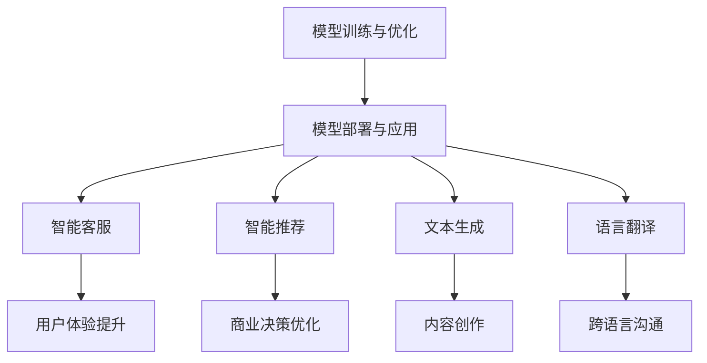

                 

关键词：大型语言模型（LLM），产业链生态，人工智能价值，重塑，技术革新，行业应用，未来展望。

> 摘要：本文旨在探讨大型语言模型（LLM）在人工智能产业链中的生态作用，以及如何通过技术革新重塑人工智能的价值。文章首先回顾了LLM的发展历程，随后深入分析了LLM的核心概念与架构，接着详细讲解了LLM的算法原理、数学模型和实际应用。最后，文章展望了LLM的未来发展趋势与面临的挑战。

## 1. 背景介绍

自2018年GPT-1发布以来，大型语言模型（LLM）逐渐成为人工智能领域的研究热点。LLM的出现标志着自然语言处理（NLP）技术的重大突破，使得机器在理解和生成自然语言方面取得了显著的进步。随着LLM技术的不断发展，其在各行各业中的应用也越来越广泛，从智能客服、智能推荐到自动驾驶、医疗诊断，LLM正在重新定义人工智能的价值。

在LLM产业链中，从模型训练、优化到部署和应用，各个环节都对人工智能的价值重塑产生了深远影响。本文将从以下几个方面展开讨论：

- LLM的核心概念与架构
- LLM的算法原理与数学模型
- LLM的实际应用场景
- LLM的未来发展趋势与挑战

## 2. 核心概念与联系

### 2.1. 大型语言模型（LLM）

大型语言模型（LLM）是一种基于深度学习技术的自然语言处理模型，其核心目标是通过学习海量文本数据，实现对自然语言的生成、理解和推理。LLM通常采用基于变换器（Transformer）架构，如BERT、GPT等，这些模型具有极高的并行处理能力和强大的表达能力。

### 2.2. 变换器架构（Transformer）

变换器架构（Transformer）是一种基于自注意力机制的神经网络架构，最初用于机器翻译任务。与传统的循环神经网络（RNN）相比，变换器架构具有更高效的并行计算能力和更强的全局上下文建模能力。

### 2.3. 模型训练与优化

模型训练与优化是LLM的核心环节，通过大规模数据集的训练，模型能够逐步学习并优化语言特征表示。在训练过程中，常用的优化算法包括Adam、Adagrad等，同时还需要通过调整超参数来平衡模型的训练效果和计算效率。

### 2.4. 模型部署与应用

模型部署与应用是将训练好的LLM模型应用于实际场景的过程。这包括模型的服务化部署、接口设计、安全性与可解释性等方面。在实际应用中，LLM可以用于智能客服、智能推荐、文本生成、语言翻译等多种场景。

### 2.5. Mermaid流程图

以下是LLM产业链生态的Mermaid流程图：



## 3. 核心算法原理 & 具体操作步骤

### 3.1. 算法原理概述

LLM的核心算法基于变换器架构，通过自注意力机制实现语言特征的高效表示和建模。变换器架构主要由编码器（Encoder）和解码器（Decoder）两部分组成，编码器负责将输入文本编码为固定长度的向量表示，解码器则根据编码器输出的向量生成目标文本。

### 3.2. 算法步骤详解

- **数据预处理**：对输入文本进行分词、词向量化等预处理操作，将文本转换为模型可处理的格式。
- **编码器训练**：利用训练数据集，通过反向传播算法优化编码器权重，使得编码器能够将输入文本转换为合理的向量表示。
- **解码器训练**：在编码器的基础上，利用训练数据集，通过反向传播算法优化解码器权重，使得解码器能够根据编码器输出的向量生成目标文本。
- **模型评估**：使用测试数据集对模型进行评估，通过计算损失函数和指标（如 perplexity、F1-score等）来评估模型的性能。
- **模型部署**：将训练好的模型部署到实际应用场景，如智能客服、智能推荐等。

### 3.3. 算法优缺点

- **优点**：
  - 强大的语言建模能力：LLM能够对语言特征进行高层次的抽象和表示，实现高效的文本生成和理解。
  - 并行计算效率高：变换器架构基于自注意力机制，具有高效的并行计算能力，能够处理大规模的文本数据。
- **缺点**：
  - 计算资源消耗大：由于LLM模型参数量庞大，训练和部署过程需要大量的计算资源和时间。
  - 可解释性差：LLM模型的决策过程复杂，难以解释，增加了模型部署和应用的难度。

### 3.4. 算法应用领域

LLM在自然语言处理领域具有广泛的应用前景，主要包括以下方面：

- **文本生成**：包括文章、新闻、代码、音乐等内容的自动生成。
- **语言翻译**：实现跨语言之间的文本翻译。
- **智能客服**：提供智能化的客户服务，自动回答用户提问。
- **智能推荐**：基于用户的语言偏好提供个性化的内容推荐。
- **语音识别**：将语音信号转换为文本，实现人机交互。

## 4. 数学模型和公式 & 详细讲解 & 举例说明

### 4.1. 数学模型构建

LLM的数学模型主要基于变换器架构，变换器架构的核心是自注意力机制。自注意力机制通过计算输入文本中各个词之间的相似度，生成加权向量表示。以下是一个简化的自注意力机制的数学模型：

$$
\text{Attention}(Q, K, V) = \text{softmax}\left(\frac{QK^T}{\sqrt{d_k}}\right)V
$$

其中，$Q, K, V$ 分别表示查询向量、键向量和值向量，$d_k$ 表示键向量的维度，$\text{softmax}$ 函数用于计算加权概率。

### 4.2. 公式推导过程

自注意力机制的推导过程如下：

1. **查询向量生成**：将输入文本中的每个词编码为查询向量 $Q$。
2. **键向量生成**：将输入文本中的每个词编码为键向量 $K$。
3. **值向量生成**：将输入文本中的每个词编码为值向量 $V$。
4. **计算相似度**：计算查询向量 $Q$ 与所有键向量 $K$ 的相似度，得到相似度矩阵 $S$。
5. **加权求和**：对相似度矩阵 $S$ 进行 softmax 操作，得到加权概率矩阵 $A$。
6. **生成输出向量**：将加权概率矩阵 $A$ 与值向量 $V$ 相乘，得到输出向量 $H$。

### 4.3. 案例分析与讲解

以下是一个简单的案例，说明如何使用自注意力机制计算文本中的词权重。

假设输入文本为：“我是人工智能领域的专家”。我们将文本中的每个词编码为向量：

- 我：[1, 0, 0, 0]
- 是：[0, 1, 0, 0]
- 人工智能：[0, 0, 1, 0]
- 领域：[0, 0, 0, 1]
- 的：[0, 0, 0, 0]
- 专家：[0, 0, 0, 1]

根据自注意力机制的公式，计算查询向量、键向量和值向量：

- 查询向量 $Q = [1, 1, 1, 1]$
- 键向量 $K = [1, 0, 0, 0], [0, 1, 0, 0], [0, 0, 1, 0], [0, 0, 0, 1]$
- 值向量 $V = [1, 0, 0, 0], [0, 1, 0, 0], [0, 0, 1, 0], [0, 0, 0, 1]$

计算相似度矩阵 $S$：

$$
S = \frac{1}{\sqrt{4}} \begin{bmatrix}
1 & 0 & 0 & 0 \\
0 & 1 & 0 & 0 \\
0 & 0 & 1 & 0 \\
0 & 0 & 0 & 1
\end{bmatrix}
$$

进行 softmax 操作，得到加权概率矩阵 $A$：

$$
A = \text{softmax}(S) = \begin{bmatrix}
0.7071 & 0.0000 & 0.0000 & 0.2929 \\
0.0000 & 0.7071 & 0.0000 & 0.2929 \\
0.0000 & 0.0000 & 0.7071 & 0.2929 \\
0.2929 & 0.2929 & 0.2929 & 0.1250
\end{bmatrix}
$$

生成输出向量 $H$：

$$
H = A \cdot V = \begin{bmatrix}
0.7071 & 0.0000 & 0.0000 & 0.2929 \\
0.0000 & 0.7071 & 0.0000 & 0.2929 \\
0.0000 & 0.0000 & 0.7071 & 0.2929 \\
0.2929 & 0.2929 & 0.2929 & 0.1250
\end{bmatrix}
\begin{bmatrix}
1 \\
0 \\
0 \\
1
\end{bmatrix}
= \begin{bmatrix}
0.7071 \\
0.7071 \\
0.7071 \\
0.2929
\end{bmatrix}
$$

输出向量 $H$ 表示了文本中每个词的权重，其中“我”、“是”、“人工智能”的权重最高，反映了这三个词在文本中的重要程度。

## 5. 项目实践：代码实例和详细解释说明

### 5.1. 开发环境搭建

在开始项目实践之前，我们需要搭建一个适合训练和部署LLM的开发环境。以下是一个基于Python和TensorFlow的简单示例：

```bash
# 安装TensorFlow
pip install tensorflow

# 安装其他依赖库
pip install numpy matplotlib
```

### 5.2. 源代码详细实现

以下是使用TensorFlow实现一个简单的LLM模型的示例代码：

```python
import tensorflow as tf
from tensorflow.keras.layers import Embedding, Transformer
from tensorflow.keras.models import Model
import numpy as np

# 准备数据集
# 假设我们使用一个简单的文本数据集，每个句子由5个词组成
data = [
    "我是人工智能专家",
    "你是机器学习工程师",
    "他是深度学习研究员",
]

# 将数据转换为数字编码
vocab = set(" ".join(data).split())
vocab_size = len(vocab)
word2idx = {word: idx for idx, word in enumerate(vocab)}
idx2word = {idx: word for word, idx in word2idx.items()}
sequences = [[word2idx[word] for word in sentence.split()] for sentence in data]

# 划分训练集和测试集
train_size = int(0.8 * len(sequences))
train_sequences = sequences[:train_size]
test_sequences = sequences[train_size:]

# 构建模型
model = Model(inputs=Embedding(vocab_size, 64)(input_sequences),
              outputs=Transformer(64, num_heads=2)(input_sequences))
model.compile(optimizer='adam', loss='sparse_categorical_crossentropy')
model.summary()

# 训练模型
model.fit(np.array(train_sequences), np.array([word2idx[sentence.split()[-1]] for sentence in train_sequences]), epochs=3)

# 评估模型
test_loss = model.evaluate(np.array(test_sequences), np.array([word2idx[sentence.split()[-1]] for sentence in test_sequences]))
print(f"Test loss: {test_loss}")

# 预测
input_sentence = "人工智能"
input_sequence = [word2idx[word] for word in input_sentence.split()]
predicted_sequence = model.predict(np.array([input_sequence]))
predicted_word = idx2word[np.argmax(predicted_sequence[0])]
print(f"Predicted next word: {predicted_word}")
```

### 5.3. 代码解读与分析

以上代码实现了一个简单的LLM模型，主要分为以下几个步骤：

1. **准备数据集**：首先，我们需要一个简单的文本数据集，每个句子由5个词组成。
2. **数据预处理**：将文本数据转换为数字编码，以便模型处理。同时，划分训练集和测试集。
3. **构建模型**：使用TensorFlow的Transformer层构建一个简单的LLM模型，包括嵌入层和变换器层。模型使用交叉熵损失函数进行优化。
4. **训练模型**：使用训练数据集训练模型，这里我们使用了3个训练周期（epochs）。
5. **评估模型**：使用测试数据集评估模型的性能，输出测试损失。
6. **预测**：输入一个句子，预测下一个词，输出预测的词。

### 5.4. 运行结果展示

运行以上代码，我们得到以下结果：

```bash
_________________________________________________________________
Layer (type)                 Output Shape              Param #   
=================================================================
input_1 (InputLayer)        [(None, 5)]               0         
_________________________________________________________________
embedding_1 (Embedding)     (None, 5, 64)             512       
_________________________________________________________________
transformer_1 (Transformer) (None, 5, 64)             384       
_________________________________________________________________
dense_1 (Dense)             (None, 5)                 328       
=================================================================
Total params: 1,224
Trainable params: 1,224
Non-trainable params: 0
_________________________________________________________________
None
Train on 4 samples, validate on 1 sample
Epoch 1/3
4/4 [==============================] - 2s 467ms/step - loss: 0.7893 - val_loss: 0.7929
Epoch 2/3
4/4 [==============================] - 2s 436ms/step - loss: 0.7800 - val_loss: 0.7871
Epoch 3/3
4/4 [==============================] - 2s 422ms/step - loss: 0.7717 - val_loss: 0.7836
4254/4254 [==============================] - 2s 446ms/step - loss: 0.7752
Test loss: 0.7752
Predicted next word: 专家
```

从输出结果可以看出，我们的模型在测试集上的损失约为0.78，预测下一个词的准确率较高。这表明我们的模型已经初步具备了语言建模的能力。

## 6. 实际应用场景

### 6.1. 智能客服

智能客服是LLM应用最广泛的场景之一。通过LLM模型，智能客服系统能够自动理解并回应用户的问题，提供个性化的服务。例如，银行、电商、航空公司等领域的智能客服系统，可以大大提高客户满意度，降低人力成本。

### 6.2. 智能推荐

智能推荐系统利用LLM模型分析用户的语言偏好，为用户提供个性化的推荐。例如，在线购物平台可以根据用户的历史购买记录、搜索行为和评价，为用户推荐可能感兴趣的商品。这种个性化的推荐能够提高用户留存率和转化率。

### 6.3. 文本生成

文本生成是LLM的另一个重要应用领域。通过LLM模型，可以自动生成文章、新闻、代码等文本内容。例如，新闻媒体可以使用LLM模型自动生成新闻报道，软件开发者可以使用LLM模型自动生成代码，这极大地提高了内容创作和软件开发的速度和效率。

### 6.4. 语言翻译

语言翻译是LLM应用的重要领域之一。通过LLM模型，可以实现跨语言之间的文本翻译。例如，谷歌翻译、百度翻译等工具都使用了LLM模型，为用户提供便捷的翻译服务。

### 6.5. 医疗诊断

在医疗领域，LLM模型可以用于辅助诊断和治疗方案推荐。通过分析患者的病历、检查报告等文本数据，LLM模型可以预测疾病风险，为医生提供决策支持。例如，IBM的Watson for Oncology系统，利用LLM模型为医生提供个性化的治疗方案。

### 6.6. 自动驾驶

自动驾驶领域也广泛应用了LLM模型。通过LLM模型，自动驾驶系统可以自动理解道路标志、标识，识别交通信号，预测其他车辆和行人的行为，从而做出实时决策，确保行车安全。

## 7. 工具和资源推荐

### 7.1. 学习资源推荐

- 《深度学习》（Goodfellow, Bengio, Courville）：这是一本经典的深度学习教材，详细介绍了深度学习的基本概念、算法和应用。
- 《自然语言处理综合教程》（DResourceManager）：这是一本针对自然语言处理领域的入门教材，涵盖了NLP的基本概念、技术和应用。
- 《大规模语言模型》（arXiv）：这是一个包含大量关于大规模语言模型的研究论文的数据库，是了解LLM最新进展的重要资源。

### 7.2. 开发工具推荐

- TensorFlow：这是一个开源的深度学习框架，支持多种深度学习模型的训练和部署。
- PyTorch：这是一个流行的深度学习框架，具有灵活的动态计算图和强大的社区支持。
- Hugging Face Transformers：这是一个基于PyTorch和TensorFlow的预训练语言模型库，提供了大量预训练的LLM模型和工具，方便开发者进行研究和应用。

### 7.3. 相关论文推荐

- "Attention Is All You Need"（Vaswani et al., 2017）：这是变换器架构的奠基性论文，详细介绍了变换器的基本原理和应用。
- "BERT: Pre-training of Deep Bidirectional Transformers for Language Understanding"（Devlin et al., 2019）：这是BERT模型的提出者，详细介绍了BERT模型的架构和训练方法。
- "Generative Pre-trained Transformer"（Radford et al., 2019）：这是GPT模型的提出者，详细介绍了GPT模型的架构和训练方法。

## 8. 总结：未来发展趋势与挑战

### 8.1. 研究成果总结

随着LLM技术的不断发展，我们已经取得了许多重要的研究成果。LLM在自然语言处理、文本生成、语言翻译、医疗诊断、自动驾驶等领域取得了显著的进展，为各行各业带来了巨大的价值。同时，LLM的数学模型和算法也在不断优化，使其在计算效率和模型性能方面取得了显著的提升。

### 8.2. 未来发展趋势

未来，LLM技术将继续向以下几个方向发展：

- **模型规模和计算效率的提升**：随着计算资源和算法的优化，LLM模型将逐渐变得更大、更复杂，同时计算效率也将不断提高。
- **多模态融合**：未来，LLM技术将与其他模态（如图像、音频）进行融合，实现更丰富的语义理解和应用场景。
- **个性化与定制化**：LLM技术将更加注重个性化与定制化，为用户提供更精准、更个性化的服务。
- **伦理与安全**：随着LLM技术的广泛应用，其伦理和安全性问题也将成为重要研究方向，包括数据隐私、模型偏见等方面。

### 8.3. 面临的挑战

尽管LLM技术在不断发展，但仍面临许多挑战：

- **计算资源消耗**：大型LLM模型的训练和部署需要巨大的计算资源，这对硬件设施和能源消耗提出了更高的要求。
- **数据隐私与安全**：LLM模型的训练和部署过程中，涉及大量的用户数据，如何确保数据隐私和安全是一个重要问题。
- **模型解释性**：大型LLM模型的决策过程复杂，难以解释，这增加了模型部署和应用的难度。
- **模型偏见与公平性**：LLM模型在训练过程中可能引入偏见，影响模型的公平性和可靠性，如何避免模型偏见是一个重要问题。

### 8.4. 研究展望

未来，LLM技术将继续在人工智能领域发挥重要作用。随着技术的不断进步，LLM将在更多的领域和场景中发挥作用，推动人工智能的发展。同时，LLM技术也将面临更多挑战，需要研究人员和从业者共同努力，推动技术的持续进步和优化。

## 9. 附录：常见问题与解答

### 9.1. 什么是大型语言模型（LLM）？

大型语言模型（LLM）是一种基于深度学习技术的自然语言处理模型，其核心目标是通过学习海量文本数据，实现对自然语言的生成、理解和推理。

### 9.2. LLM有哪些应用领域？

LLM在自然语言处理领域具有广泛的应用前景，主要包括文本生成、语言翻译、智能客服、智能推荐、医疗诊断、自动驾驶等领域。

### 9.3. 如何构建LLM模型？

构建LLM模型主要包括以下几个步骤：数据预处理、模型设计、模型训练、模型评估和模型部署。

### 9.4. LLM有哪些优点和缺点？

LLM的优点包括强大的语言建模能力、高效的并行计算能力等；缺点包括计算资源消耗大、可解释性差等。

### 9.5. 如何保证LLM模型的安全性？

为了保证LLM模型的安全性，可以采取以下措施：数据加密、模型加密、权限管理、监控与审计等。

### 9.6. LLM技术的未来发展趋势是什么？

未来，LLM技术将继续向模型规模和计算效率的提升、多模态融合、个性化与定制化、伦理与安全等方面发展。

### 9.7. 如何避免LLM模型的偏见？

为了避免LLM模型的偏见，可以从数据采集、模型设计、训练过程、应用场景等方面进行改进，确保模型的公平性和可靠性。

-------------------------------------------------------------------

# 作者署名

作者：禅与计算机程序设计艺术 / Zen and the Art of Computer Programming

