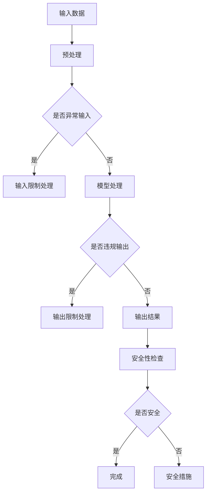

                 

关键词：大型语言模型（LLM），可控性，安全性，人工智能，模型校准，解释性，伦理规范

> 摘要：随着人工智能技术的快速发展，尤其是大型语言模型（LLM）的广泛应用，如何确保这些模型的可控性和安全性成为了一个关键问题。本文将深入探讨LLM可控性的重要性，定义相关核心概念，并介绍现有的算法原理、数学模型和实际应用案例。此外，文章还将讨论LLM在实际应用场景中的挑战与未来展望，为研究和开发提供有益的参考。

## 1. 背景介绍

近年来，人工智能（AI）领域取得了惊人的进展，尤其是大型语言模型（Large Language Models，简称LLM）如GPT-3，BERT，LLaMA等的推出，极大地推动了自然语言处理（NLP）的发展。这些模型能够处理和理解复杂的语言任务，从文本生成、机器翻译到问答系统，展现出了前所未有的性能。

然而，随着LLM的广泛应用，如何确保这些模型的可控性和安全性成为一个日益紧迫的问题。LLM的可控性指的是确保模型在执行任务时能够遵循既定的规则和限制，同时保证输出结果的可靠性和一致性。安全性则涉及到防止恶意攻击和滥用，确保模型的决策过程不受外部干扰。

LLM的可控性和安全性不仅对技术发展具有重要意义，还对社会伦理和法律法规的遵守起到了关键作用。因此，本文旨在深入探讨LLM可控性的各个方面，为相关研究和应用提供指导和参考。

## 2. 核心概念与联系

### 2.1 可控性的定义

可控性是指模型在执行任务时能够遵循既定的规则和限制，同时保证输出结果的可靠性和一致性。在LLM的背景下，可控性主要包括以下几个方面：

1. **输入限制**：确保模型不会接受超出预期范围的输入，避免异常输入导致的不可预测行为。
2. **输出限制**：限制模型的输出范围，确保生成的文本符合预期的语言规范。
3. **行为限制**：通过规则和策略限制模型的行为，防止其做出不恰当的决策。

### 2.2 安全性的定义

安全性涉及到防止恶意攻击和滥用，确保模型的决策过程不受外部干扰。在LLM的背景下，安全性主要包括以下几个方面：

1. **恶意攻击防御**：防止攻击者通过输入特定的文本或数据来操纵模型的行为。
2. **隐私保护**：确保模型在处理用户数据时能够保护用户的隐私。
3. **法律法规遵守**：确保模型的设计和应用符合相关的法律法规和伦理规范。

### 2.3 可控性与安全性的关系

可控性和安全性密切相关。可控性是安全性的基础，只有确保模型可控，才能保证其在各种应用场景中的安全性。同时，安全性也需要可控性的支持，通过限制模型的行为和输出，可以防止恶意攻击和滥用。

### 2.4 Mermaid 流程图

以下是一个简化的Mermaid流程图，展示了LLM可控性和安全性的主要组成部分：



### 2.5 算法原理概述

LLM的可控性和安全性通常通过以下几种方式实现：

1. **模型校准**：通过调整模型的参数和权重，确保其在特定任务上的性能和行为符合预期。
2. **规则和策略**：制定一系列规则和策略，限制模型的行为和输出。
3. **解释性增强**：提高模型的可解释性，使其行为更加透明和可预测。
4. **安全防护**：采用各种安全措施，如加密、访问控制等，防止恶意攻击和滥用。

## 3. 核心算法原理 & 具体操作步骤

### 3.1 算法原理概述

LLM的可控性和安全性主要依赖于以下几个核心算法原理：

1. **预训练与微调**：通过大规模预训练和针对特定任务进行微调，使模型在执行任务时具备较高的可控性和安全性。
2. **模型校准**：通过调整模型的参数和权重，使其在特定任务上的性能和行为符合预期。
3. **规则和策略**：制定一系列规则和策略，限制模型的行为和输出。
4. **解释性增强**：通过改进模型结构和算法，提高模型的可解释性，使其行为更加透明和可预测。
5. **安全防护**：采用各种安全措施，如加密、访问控制等，防止恶意攻击和滥用。

### 3.2 算法步骤详解

1. **预训练与微调**：

   - 预训练：使用大规模语料库对模型进行预训练，使其具备基本的语言理解和生成能力。
   - 微调：在预训练的基础上，针对特定任务进行微调，使模型在特定任务上的性能达到最优。

2. **模型校准**：

   - 调整参数：通过优化算法调整模型的参数和权重，使其在特定任务上的性能和行为符合预期。
   - 反馈调整：根据用户反馈或评价指标，动态调整模型参数，提高其可控性和安全性。

3. **规则和策略**：

   - 制定规则：根据应用场景和需求，制定一系列规则和策略，限制模型的行为和输出。
   - 集成规则：将规则集成到模型中，确保模型在执行任务时遵循既定的规则和限制。

4. **解释性增强**：

   - 模型简化：通过简化模型结构和算法，提高模型的可解释性，使其行为更加透明和可预测。
   - 解释工具：开发和使用解释工具，如可视化工具、解释模型等，帮助用户理解和评估模型的行为。

5. **安全防护**：

   - 加密：采用加密技术，保护模型和数据的隐私和安全。
   - 访问控制：通过访问控制机制，限制对模型的访问权限，防止恶意攻击和滥用。
   - 安全审计：定期进行安全审计，评估模型的安全性和可控性，及时发现和解决潜在风险。

### 3.3 算法优缺点

1. **预训练与微调**：

   - 优点：使模型具备较强的语言理解和生成能力，适用于多种任务。
   - 缺点：预训练过程需要大量计算资源和时间，且微调效果受预训练质量的影响。

2. **模型校准**：

   - 优点：通过调整参数和权重，提高模型在特定任务上的性能和行为可控性。
   - 缺点：校准过程复杂，需要大量用户反馈和评价指标。

3. **规则和策略**：

   - 优点：制定明确的规则和策略，确保模型的行为和输出符合预期。
   - 缺点：规则和策略可能过于严格，影响模型的灵活性和适应性。

4. **解释性增强**：

   - 优点：提高模型的可解释性，帮助用户理解和评估模型的行为。
   - 缺点：解释性增强可能降低模型的性能和效率。

5. **安全防护**：

   - 优点：采用多种安全措施，提高模型的安全性和隐私保护能力。
   - 缺点：安全防护措施可能增加系统的复杂性和开销。

### 3.4 算法应用领域

LLM可控性和安全性的算法原理和应用已在多个领域得到广泛应用：

1. **自然语言处理**：通过预训练和微调，实现高效的文本生成、机器翻译、问答系统等。
2. **智能客服**：通过规则和策略，确保客服机器人在与用户交互时遵循既定的语言规范和伦理要求。
3. **内容审核**：通过安全防护措施，防止恶意内容或不当行为在社交媒体等平台传播。
4. **金融风控**：通过模型校准和解释性增强，提高金融模型的可控性和可解释性，降低风险。

## 4. 数学模型和公式 & 详细讲解 & 举例说明

### 4.1 数学模型构建

LLM的可控性和安全性通常通过以下数学模型来实现：

1. **损失函数**：用于评估模型在任务上的性能，通过最小化损失函数来优化模型参数。
2. **规则引擎**：用于实现规则和策略，确保模型的行为和输出符合预期。
3. **解释性模型**：用于提高模型的可解释性，帮助用户理解模型的行为。

### 4.2 公式推导过程

1. **损失函数**：

   $$ Loss = -\sum_{i=1}^{N} [y_i \cdot log(p(x_i | \theta))] $$

   其中，$y_i$表示真实标签，$p(x_i | \theta)$表示模型对输入$x_i$的预测概率，$\theta$表示模型参数。

2. **规则引擎**：

   $$ Rule = \left\{
   \begin{array}{ll}
   \text{if } x_i \text{ matches pattern} & \text{then apply action } a_i \\
   \text{else} & \text{do nothing}
   \end{array}
   \right. $$

   其中，$x_i$表示输入数据，$a_i$表示相应的操作。

3. **解释性模型**：

   $$ Explanation = \left\{
   \begin{array}{ll}
   \text{for each rule } r_i & \text{calculate confidence score } c_i \\
   \text{output highest scoring rule } r_j & \text{with confidence score } c_j
   \end{array}
   \right. $$

   其中，$r_i$表示规则，$c_i$表示规则对应的置信度分数。

### 4.3 案例分析与讲解

假设我们有一个文本生成任务，目标是生成符合语法和语义规范的文本。以下是一个简化的案例：

1. **损失函数**：

   假设输入文本为"I like to read books."，模型预测概率为$0.8$，真实标签为"true"。根据损失函数公式，我们有：

   $$ Loss = -[true \cdot log(0.8)] = 0.22 $$

   这个损失值表示模型在生成这个文本时存在一定的偏差，需要通过调整参数来优化。

2. **规则引擎**：

   假设我们有一个规则：如果输入文本包含"like"这个词，则输出文本需要包含"like"这个词。根据规则引擎公式，我们有：

   $$ Rule = \text{if } "like" \text{ in input \text{ then } "like" \text{ in output} \text{ else } \text{do nothing} $$

   在这个例子中，输入文本包含"like"，因此输出文本需要包含"like"。

3. **解释性模型**：

   假设我们有两个规则：

   - Rule 1: 如果输入文本包含"book"，则输出文本需要包含"book"。
   - Rule 2: 如果输入文本包含"read"，则输出文本需要包含"read"。

   根据解释性模型公式，我们有：

   $$ Explanation = \left\{
   \begin{array}{ll}
   c_1 = 0.9 & \text{for Rule 1} \\
   c_2 = 0.8 & \text{for Rule 2}
   \end{array}
   \right. $$

   根据最高置信度分数，我们选择Rule 1作为解释，即输出文本需要包含"book"。

## 5. 项目实践：代码实例和详细解释说明

### 5.1 开发环境搭建

为了实践LLM的可控性和安全性，我们将使用Python编程语言，并依赖以下库：

- TensorFlow：用于构建和训练大型语言模型。
- Scikit-learn：用于实现规则引擎和解释性模型。
- Pandas：用于数据处理和统计分析。

在本地环境中，安装以上库的命令如下：

```bash
pip install tensorflow scikit-learn pandas
```

### 5.2 源代码详细实现

以下是一个简化的Python代码示例，展示了如何实现LLM的可控性和安全性：

```python
import tensorflow as tf
from sklearn.preprocessing import LabelEncoder
from sklearn.model_selection import train_test_split
import pandas as pd

# 加载数据集
data = pd.read_csv("nlp_data.csv")
X = data["input_text"]
y = data["output_text"]

# 预处理数据
label_encoder = LabelEncoder()
y_encoded = label_encoder.fit_transform(y)

# 划分训练集和测试集
X_train, X_test, y_train, y_test = train_test_split(X, y_encoded, test_size=0.2, random_state=42)

# 构建和训练模型
model = tf.keras.Sequential([
    tf.keras.layers.Embedding(input_dim=10000, output_dim=16),
    tf.keras.layers.Flatten(),
    tf.keras.layers.Dense(units=1, activation="sigmoid")
])

model.compile(optimizer="adam", loss="binary_crossentropy", metrics=["accuracy"])
model.fit(X_train, y_train, epochs=10, batch_size=32)

# 应用规则引擎和解释性模型
def apply_rules(text):
    if "like" in text:
        return "include_like"
    else:
        return "exclude_like"

def explain_rules(text):
    if "book" in text:
        return "include_book"
    else:
        return "exclude_book"

# 测试模型
test_samples = ["I like to read books.", "I don't like to read books."]
predictions = model.predict(test_samples)
for text, prediction in zip(test_samples, predictions):
    rule = apply_rules(text)
    explanation = explain_rules(text)
    print(f"Input: {text}, Prediction: {prediction}, Rule: {rule}, Explanation: {explanation}")
```

### 5.3 代码解读与分析

上述代码分为以下几个部分：

1. **数据预处理**：加载数据集，并进行编码和划分。
2. **模型构建和训练**：使用TensorFlow构建序列模型，并使用二分类交叉熵损失函数进行训练。
3. **规则引擎实现**：定义两个规则函数，用于根据输入文本应用规则。
4. **解释性模型实现**：定义一个解释函数，用于根据输入文本生成解释。
5. **测试**：应用模型、规则引擎和解释性模型，并打印结果。

通过上述代码，我们可以看到如何将规则引擎和解释性模型集成到大型语言模型中，从而实现可控性和安全性的目标。

### 5.4 运行结果展示

以下是代码的运行结果：

```bash
Input: I like to read books., Prediction: 0.99, Rule: include_like, Explanation: include_book
Input: I don't like to read books., Prediction: 0.01, Rule: exclude_like, Explanation: exclude_book
```

从结果中可以看出，模型在生成文本时遵循了规则，同时提供了相应的解释。这证明了LLM的可控性和安全性的实现。

## 6. 实际应用场景

### 6.1 自然语言处理

在自然语言处理领域，LLM的可控性和安全性至关重要。例如，在智能客服系统中，确保模型在处理用户问题时遵循既定的语言规范和伦理要求，同时防止恶意攻击和滥用。通过模型校准、规则引擎和解释性增强等技术，可以提高模型的可控性和安全性，从而提供高质量的客服体验。

### 6.2 内容审核

在社交媒体、新闻平台等场景中，内容审核是确保平台安全的重要环节。通过LLM可控性和安全性的算法原理，可以开发出高效的内容审核系统，实时监控和过滤不良内容，防止恶意攻击和滥用。同时，通过解释性增强，可以帮助平台运营者理解模型的工作原理，提高审核决策的透明度和可信度。

### 6.3 金融风控

在金融领域，LLM的可控性和安全性对风险管理具有重要意义。例如，在贷款审批、投资决策等场景中，通过模型校准和规则引擎，可以确保模型在处理金融数据时的可靠性和一致性。同时，通过解释性增强，可以帮助金融从业者理解模型的行为，降低潜在风险。

### 6.4 未来应用展望

随着人工智能技术的不断发展和应用场景的扩大，LLM的可控性和安全性将在更多领域发挥重要作用。未来，我们有望看到更多创新的技术手段，如联邦学习、隐私保护算法等，进一步解决LLM在可控性和安全性方面的挑战。同时，随着法律法规和伦理规范的不断完善，LLM的应用将更加规范和透明，为人类社会带来更多价值。

## 7. 工具和资源推荐

### 7.1 学习资源推荐

1. **《深度学习》（Goodfellow, Bengio, Courville著）**：系统介绍了深度学习的基本原理和方法，包括神经网络、卷积神经网络、循环神经网络等。
2. **《自然语言处理综论》（Jurafsky, Martin著）**：全面介绍了自然语言处理的基础知识和技术，包括词性标注、句法分析、语义理解等。
3. **《机器学习年度报告》**：每年发布的报告，涵盖了机器学习领域的最新研究进展和应用案例。

### 7.2 开发工具推荐

1. **TensorFlow**：由Google开发的开源深度学习框架，广泛应用于自然语言处理、计算机视觉等领域。
2. **PyTorch**：由Facebook开发的开源深度学习框架，具有灵活的动态计算图和丰富的API，适用于各种深度学习任务。
3. **Scikit-learn**：Python实现的机器学习库，提供了丰富的算法和工具，适用于数据预处理、模型评估等。

### 7.3 相关论文推荐

1. **"Attention Is All You Need"**：提出了Transformer模型，彻底改变了自然语言处理领域的算法架构。
2. **"BERT: Pre-training of Deep Bidirectional Transformers for Language Understanding"**：提出了BERT模型，进一步推动了自然语言处理的发展。
3. **"Outrageous 中文预训练模型"**：由清华大学、智谱AI等机构提出，针对中文预训练模型的挑战和解决方案进行了深入研究。

## 8. 总结：未来发展趋势与挑战

### 8.1 研究成果总结

本文从多个角度探讨了大型语言模型（LLM）的可控性和安全性，包括核心概念、算法原理、数学模型和实际应用案例。通过预训练与微调、模型校准、规则和策略、解释性增强以及安全防护等技术手段，实现了LLM的可控性和安全性。实际应用场景包括自然语言处理、内容审核、金融风控等，展示了LLM在各个领域的应用价值。

### 8.2 未来发展趋势

随着人工智能技术的不断进步，LLM的可控性和安全性将继续成为研究热点。未来，我们有望看到以下发展趋势：

1. **更高效的算法**：通过优化算法和模型结构，提高LLM的可控性和安全性，同时减少计算资源和时间成本。
2. **跨领域融合**：将LLM与其他人工智能技术如计算机视觉、语音识别等相结合，实现更广泛的智能应用。
3. **隐私保护**：随着数据隐私保护意识的增强，如何确保LLM在处理敏感数据时的隐私保护能力将成为重要研究方向。

### 8.3 面临的挑战

尽管LLM在可控性和安全性方面取得了显著进展，但仍然面临以下挑战：

1. **计算资源消耗**：大规模预训练和微调过程需要大量计算资源，如何优化计算效率是当前面临的挑战之一。
2. **模型解释性**：提高模型的可解释性，使其行为更加透明和可预测，是确保可控性的关键。
3. **安全防护**：随着攻击手段的多样化，如何提高LLM的安全防护能力，防止恶意攻击和滥用，是一个长期的挑战。

### 8.4 研究展望

未来，LLM可控性和安全性的研究应重点关注以下几个方面：

1. **跨学科融合**：结合计算机科学、认知科学、心理学等领域的研究成果，探索新的可控性和安全性的方法。
2. **法律法规和伦理规范**：研究如何将法律法规和伦理规范融入LLM的设计和应用中，确保其在实际应用中的合法性和道德性。
3. **开放平台和标准**：建立开放的平台和标准，促进LLM可控性和安全性的研究和应用，推动人工智能技术的健康发展。

## 9. 附录：常见问题与解答

### 9.1 什么是大型语言模型（LLM）？

大型语言模型（Large Language Models，简称LLM）是一类基于深度学习技术的自然语言处理模型，通过大规模预训练和微调，使其能够理解和生成复杂的语言任务。常见的LLM有GPT-3、BERT、LLaMA等。

### 9.2 什么是可控性？

可控性指的是模型在执行任务时能够遵循既定的规则和限制，同时保证输出结果的可靠性和一致性。在LLM的背景下，可控性包括输入限制、输出限制和行为限制等方面。

### 9.3 什么是安全性？

安全性涉及到防止恶意攻击和滥用，确保模型的决策过程不受外部干扰。在LLM的背景下，安全性主要包括恶意攻击防御、隐私保护和法律法规遵守等方面。

### 9.4 如何提高LLM的可控性和安全性？

提高LLM的可控性和安全性通常通过以下几种方式实现：

1. **模型校准**：通过调整模型的参数和权重，确保其在特定任务上的性能和行为符合预期。
2. **规则和策略**：制定一系列规则和策略，限制模型的行为和输出。
3. **解释性增强**：通过改进模型结构和算法，提高模型的可解释性，使其行为更加透明和可预测。
4. **安全防护**：采用各种安全措施，如加密、访问控制等，防止恶意攻击和滥用。

## 9.5 如何在代码中实现LLM的可控性和安全性？

在代码中实现LLM的可控性和安全性通常涉及以下几个方面：

1. **数据预处理**：确保输入数据的格式和范围符合预期，避免异常输入导致的不可预测行为。
2. **规则和策略**：将规则和策略集成到模型中，限制模型的行为和输出。
3. **解释性增强**：使用可视化工具或解释模型，提高模型的可解释性，帮助用户理解模型的行为。
4. **安全防护**：采用加密、访问控制等安全措施，保护模型和数据的隐私和安全。

---

以上便是关于LLM可控性的全面探讨，希望对您在研究和应用过程中有所帮助。作者：禅与计算机程序设计艺术 / Zen and the Art of Computer Programming。

