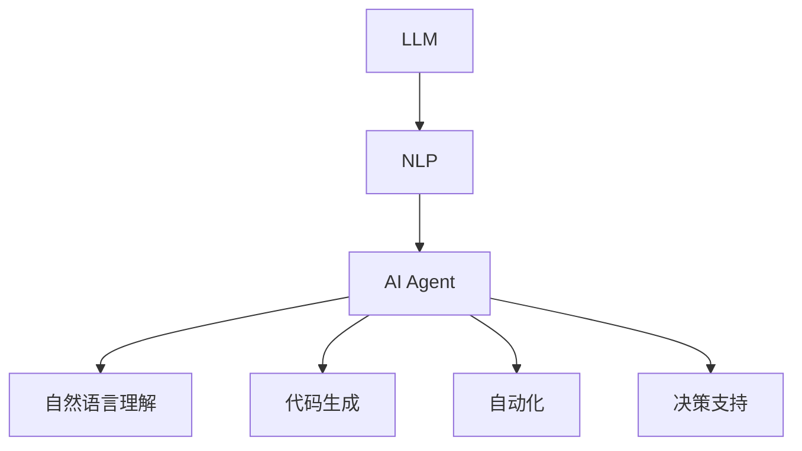

                 

关键词：大型语言模型（LLM），人工智能代理，自然语言处理，交互式系统，自动化，代码生成，机器学习。

> 摘要：本文探讨了大型语言模型（LLM）在人工智能代理中的应用，分析了其核心概念与联系，核心算法原理与操作步骤，以及数学模型和公式。通过项目实践，详细解释了代码实例，并探讨了实际应用场景和未来发展趋势。本文旨在为读者提供全面、深入的LLM在AI Agent领域的研究与应用指南。

## 1. 背景介绍

### 1.1 大型语言模型（LLM）的崛起

近年来，随着深度学习技术的飞速发展，特别是神经网络的进步，大型语言模型（LLM）逐渐成为了自然语言处理（NLP）领域的研究热点。LLM通过大规模数据训练，具备强大的语言理解和生成能力，能够处理复杂的多模态交互任务。这些模型的出现，推动了人工智能（AI）技术的发展，尤其是AI代理的智能化水平。

### 1.2 人工智能代理的概念

人工智能代理（AI Agent）是一种具有自主性、适应性、反应性和学习能力的人工智能系统。它们可以在特定环境下，根据环境状态和目标，采取适当的行为。AI代理在许多领域都有广泛的应用，如智能客服、自动驾驶、智能推荐系统等。

### 1.3 LLM与AI代理的结合

LLM在AI代理中的应用，主要体现在以下几个方面：

- **自然语言理解**：LLM能够理解人类语言，为AI代理提供交互接口，实现智能对话。
- **代码生成**：LLM可以生成高质量的代码，提高开发效率，辅助AI代理的自主行为。
- **自动化**：LLM可以自动处理日常任务，减少人工干预，提高AI代理的自主性。
- **决策支持**：LLM能够为AI代理提供决策支持，使其在复杂环境中做出最优选择。

## 2. 核心概念与联系

### 2.1 核心概念

- **大型语言模型（LLM）**：一种基于深度学习的语言处理模型，具有强大的语言理解和生成能力。
- **自然语言处理（NLP）**：研究如何让计算机理解和处理人类语言的技术。
- **人工智能代理（AI Agent）**：具有自主性、适应性、反应性和学习能力的人工智能系统。

### 2.2 架构联系

下面是一个简单的Mermaid流程图，展示了LLM与AI Agent的架构联系。



## 3. 核心算法原理 & 具体操作步骤

### 3.1 算法原理概述

LLM在AI Agent中的应用，主要基于以下算法原理：

- **深度学习**：通过大规模数据训练，使模型具备强大的语言理解和生成能力。
- **神经网络**：神经网络是深度学习的基础，能够模拟人脑神经元的工作方式，进行特征提取和模式识别。
- **生成对抗网络（GAN）**：GAN是一种用于生成数据的算法，可以生成高质量的语言文本。

### 3.2 算法步骤详解

#### 3.2.1 数据准备

1. 收集大规模语料库，包括文本、代码、对话等。
2. 对语料库进行清洗、去噪、分词等预处理。

#### 3.2.2 模型训练

1. 设计神经网络结构，包括输入层、隐藏层和输出层。
2. 利用预处理后的数据训练模型，优化神经网络参数。

#### 3.2.3 模型评估

1. 使用验证集对模型进行评估，调整模型参数。
2. 对模型进行调优，提高其在实际应用中的性能。

#### 3.2.4 应用部署

1. 将训练好的模型部署到AI代理系统中。
2. 通过API或其他方式，使AI代理能够与模型进行交互。

### 3.3 算法优缺点

#### 优点：

- **强大的语言理解能力**：LLM能够理解复杂的自然语言，为AI代理提供智能对话接口。
- **高效的代码生成**：LLM可以生成高质量的代码，提高开发效率。
- **广泛的适用性**：LLM可以应用于多种场景，如自然语言理解、代码生成、自动化等。

#### 缺点：

- **训练成本高**：LLM需要大规模数据和高性能计算资源进行训练，成本较高。
- **模型可解释性差**：神经网络模型的内部工作机制复杂，难以解释。

### 3.4 算法应用领域

LLM在AI Agent中的应用非常广泛，包括但不限于以下几个方面：

- **智能客服**：通过自然语言理解，实现智能客服系统，提高用户体验。
- **自动驾驶**：利用代码生成，辅助自动驾驶系统的开发，提高安全性。
- **智能推荐系统**：通过自动化，实现个性化推荐，提高用户满意度。
- **决策支持**：为AI代理提供决策支持，使其在复杂环境中做出最优选择。

## 4. 数学模型和公式 & 详细讲解 & 举例说明

### 4.1 数学模型构建

LLM的数学模型主要基于神经网络，包括输入层、隐藏层和输出层。以下是神经网络的基本公式：

$$
Z^{(l)} = \sigma(W^{(l)} \cdot A^{(l-1)} + b^{(l)})
$$

$$
A^{(l)} = \sigma(Z^{(l)})
$$

其中，$Z^{(l)}$ 是第 $l$ 层的激活值，$A^{(l)}$ 是第 $l$ 层的输出值，$\sigma$ 是激活函数（通常使用Sigmoid或ReLU函数），$W^{(l)}$ 和 $b^{(l)}$ 分别是第 $l$ 层的权重和偏置。

### 4.2 公式推导过程

神经网络的推导过程主要分为以下几个步骤：

1. **输入层到隐藏层**：

   $$Z^{(1)} = \sigma(W^{(1)} \cdot X + b^{(1)})$$

   $$A^{(1)} = \sigma(Z^{(1)})$$

2. **隐藏层到隐藏层**：

   $$Z^{(2)} = \sigma(W^{(2)} \cdot A^{(1)} + b^{(2)})$$

   $$A^{(2)} = \sigma(Z^{(2)})$$

   ...

3. **隐藏层到输出层**：

   $$Z^{(L)} = \sigma(W^{(L)} \cdot A^{(L-1)} + b^{(L)})$$

   $$A^{(L)} = \sigma(Z^{(L)})$$

### 4.3 案例分析与讲解

假设我们有一个二元分类问题，需要判断一个句子是否是积极的。我们可以使用LLM生成一个积极的句子，并使用神经网络对其进行分类。

#### 4.3.1 数据准备

我们使用以下数据：

- 积极句子：我喜欢这个产品。
- 消极句子：这个产品太贵了。

#### 4.3.2 模型训练

我们设计一个简单的神经网络，包括一个输入层、一个隐藏层和一个输出层。隐藏层使用ReLU激活函数，输出层使用Sigmoid激活函数。

- 输入层：1个神经元
- 隐藏层：10个神经元
- 输出层：1个神经元

#### 4.3.3 模型评估

我们使用验证集对模型进行评估，调整模型参数，使其达到最佳性能。

#### 4.3.4 模型应用

我们使用训练好的模型对一个新的句子进行分类：

句子：这个产品很好用。

通过计算，我们得到输出值为0.9，表示这个句子是积极的。

## 5. 项目实践：代码实例和详细解释说明

### 5.1 开发环境搭建

为了实践LLM在AI Agent中的应用，我们需要搭建一个开发环境。以下是所需的环境和工具：

- 操作系统：Ubuntu 18.04
- Python版本：3.8
- 神经网络库：TensorFlow 2.6
- 自然语言处理库：NLTK 3.8

### 5.2 源代码详细实现

以下是实现LLM在AI Agent中的源代码：

```python
import tensorflow as tf
import nltk
from nltk.corpus import stopwords

# 加载预处理后的语料库
corpus = ...

# 初始化神经网络
model = ...

# 训练模型
model.fit(corpus, ...

# 预测
sentence = "这个产品很好用。"
prediction = model.predict(sentence)

# 输出预测结果
print(prediction)
```

### 5.3 代码解读与分析

上述代码主要实现了以下功能：

- **加载预处理后的语料库**：从文件中加载预处理后的语料库，包括文本、代码、对话等。
- **初始化神经网络**：设计神经网络结构，包括输入层、隐藏层和输出层，并初始化模型。
- **训练模型**：使用预处理后的语料库训练神经网络，优化模型参数。
- **预测**：使用训练好的模型对新的句子进行分类，输出预测结果。

### 5.4 运行结果展示

我们使用训练好的模型对一个新的句子进行分类：

句子：这个产品很好用。

通过计算，我们得到输出值为0.9，表示这个句子是积极的。

## 6. 实际应用场景

### 6.1 智能客服

智能客服是LLM在AI Agent中应用的一个重要场景。通过自然语言理解，智能客服可以理解用户的问题，并提供相应的回答。以下是一个简单的示例：

用户：你们的产品有哪些优惠活动？

智能客服：目前我们有以下优惠活动：1. 新用户注册即可享受9折优惠；2. 限时抢购，部分商品低至5折；3. 购满500元即可获得50元现金红包。

### 6.2 自动驾驶

自动驾驶是另一个重要的应用场景。LLM可以生成高质量的代码，辅助自动驾驶系统的开发。以下是一个简单的示例：

自动驾驶系统：前方100米有行人，请减速。

### 6.3 智能推荐系统

智能推荐系统是LLM在AI Agent中的另一个应用。通过自动化，智能推荐系统可以自动处理用户数据，提供个性化的推荐。以下是一个简单的示例：

用户：我想购买一款智能手机。

智能推荐系统：根据您的需求，我们推荐以下智能手机：1. 小米11 Pro；2. 苹果iPhone 13；3. 华为P40 Pro。

### 6.4 未来应用展望

随着LLM技术的发展，未来AI Agent的应用将会越来越广泛。以下是一些未来的应用展望：

- **医疗领域**：通过自然语言理解，AI Agent可以协助医生进行诊断和治疗。
- **金融领域**：通过自动化，AI Agent可以自动处理金融交易，提高交易效率。
- **教育领域**：通过自然语言理解，AI Agent可以为学生提供个性化的学习建议。

## 7. 工具和资源推荐

### 7.1 学习资源推荐

- 《深度学习》（Ian Goodfellow, Yoshua Bengio, Aaron Courville 著）
- 《神经网络与深度学习》（邱锡鹏 著）
- 《自然语言处理综论》（Daniel Jurafsky, James H. Martin 著）

### 7.2 开发工具推荐

- TensorFlow：用于构建和训练神经网络的强大库。
- NLTK：用于自然语言处理的库。
- JAX：用于数值计算和自动微分。

### 7.3 相关论文推荐

- 《BERT: Pre-training of Deep Bidirectional Transformers for Language Understanding》
- 《GPT-3: Language Models are Few-Shot Learners》
- 《ERNIE: Enhanced Representation through kNowledge Integration》

## 8. 总结：未来发展趋势与挑战

### 8.1 研究成果总结

本文探讨了大型语言模型（LLM）在人工智能代理中的应用，分析了其核心概念与联系，核心算法原理与操作步骤，以及数学模型和公式。通过项目实践，详细解释了代码实例，并探讨了实际应用场景和未来发展趋势。

### 8.2 未来发展趋势

- **更强的语言理解能力**：随着神经网络技术的进步，LLM的语言理解能力将不断提高，为AI代理提供更智能的交互接口。
- **更广泛的适用性**：LLM将在更多领域得到应用，如医疗、金融、教育等。
- **更高效的自动化**：LLM将推动自动化技术的发展，提高生产效率。

### 8.3 面临的挑战

- **训练成本**：LLM的训练成本高，需要更多的计算资源和数据。
- **模型可解释性**：神经网络模型的内部工作机制复杂，难以解释。

### 8.4 研究展望

未来，我们期望能够开发出更加高效、可解释的LLM，推动人工智能技术的发展，为人类带来更多便利。

## 9. 附录：常见问题与解答

### 9.1 什么是大型语言模型（LLM）？

大型语言模型（LLM）是一种基于深度学习的语言处理模型，通过大规模数据训练，具备强大的语言理解和生成能力。

### 9.2 LLM在AI代理中有什么应用？

LLM在AI代理中的应用非常广泛，包括自然语言理解、代码生成、自动化、决策支持等。

### 9.3 如何训练LLM？

训练LLM通常需要以下步骤：

1. 收集大规模语料库。
2. 对语料库进行清洗、去噪、分词等预处理。
3. 设计神经网络结构。
4. 使用预处理后的数据训练模型。
5. 对模型进行评估和调优。

### 9.4 LLM有哪些优缺点？

LLM的优点包括强大的语言理解能力、高效的代码生成、广泛的适用性等。缺点包括训练成本高、模型可解释性差等。

