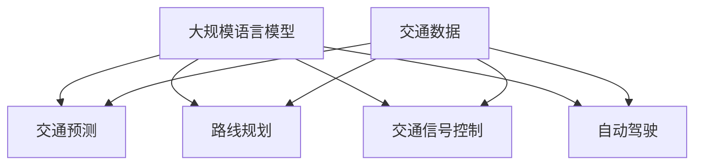

                 

关键词：自然语言处理，大规模语言模型，智能交通，交通预测，自动驾驶，数据驱动

> 摘要：本文探讨了自然语言处理（NLP）中的大规模语言模型（LLM）在智能交通系统中的应用。通过介绍LLM的基本原理，我们分析了其在交通预测、路线规划、交通信号控制以及自动驾驶等领域的具体应用，并探讨了其带来的变革和发展趋势。

## 1. 背景介绍

智能交通系统（Intelligent Transportation System，ITS）是利用先进的通信、信息、控制技术对交通运输系统进行集成管理，提高交通运输效率和安全性。随着城市化进程的加快和交通拥堵问题的日益严重，智能交通系统的研究和应用成为学术界和产业界的热点。

自然语言处理（Natural Language Processing，NLP）作为人工智能的一个重要分支，近年来取得了显著的进展。大规模语言模型（Large-scale Language Model，LLM）如GPT、BERT等在语言理解和生成任务上表现出色，为智能交通系统提供了新的技术手段。

## 2. 核心概念与联系

### 2.1. 大规模语言模型（LLM）

大规模语言模型（LLM）是一种基于深度学习的语言模型，通过训练大量文本数据，能够理解并生成自然语言。LLM的核心是神经网络架构，如Transformer模型，具有强大的表示和生成能力。

### 2.2. 智能交通系统（ITS）

智能交通系统（ITS）包括交通预测、路线规划、交通信号控制、自动驾驶等多个子领域。这些领域共同构成了智能交通系统的框架。

### 2.3. 联系

LLM可以通过以下方式与智能交通系统相联系：

- 交通预测：LLM能够从大量交通数据中学习交通模式，帮助预测未来的交通流量和拥堵情况。
- 路线规划：LLM可以理解自然语言描述，为用户提供个性化的路线规划服务。
- 交通信号控制：LLM可以根据实时交通数据调整交通信号，提高交通效率。
- 自动驾驶：LLM可以帮助自动驾驶系统理解交通标志、信号、路况等，实现更安全的驾驶。

### 2.4. Mermaid 流程图



## 3. 核心算法原理 & 具体操作步骤

### 3.1. 算法原理概述

LLM的核心是Transformer模型，其通过自注意力机制（Self-Attention）对输入序列进行建模，能够捕捉序列中长距离的关系。LLM的训练过程主要包括数据预处理、模型训练、模型评估和模型应用。

### 3.2. 算法步骤详解

1. 数据预处理：收集并清洗交通数据，包括交通流量、速度、道路状况等。
2. 模型训练：使用预处理后的数据训练Transformer模型，学习交通模式。
3. 模型评估：通过交叉验证和测试集评估模型的性能。
4. 模型应用：将训练好的模型应用于实际交通场景，如交通预测、路线规划等。

### 3.3. 算法优缺点

- 优点：LLM能够从大量数据中学习复杂的交通模式，具有强大的预测和生成能力。
- 缺点：模型训练过程需要大量的计算资源和时间，对数据质量和标注要求较高。

### 3.4. 算法应用领域

LLM在智能交通系统中的应用广泛，包括交通预测、路线规划、交通信号控制和自动驾驶等领域。以下分别介绍：

- 交通预测：LLM可以预测未来的交通流量和拥堵情况，帮助交通管理部门制定合理的交通控制策略。
- 路线规划：LLM可以根据实时交通数据，为用户提供个性化的路线规划服务，提高出行效率。
- 交通信号控制：LLM可以根据实时交通数据调整交通信号，提高交通效率。
- 自动驾驶：LLM可以帮助自动驾驶系统理解交通标志、信号、路况等，实现更安全的驾驶。

## 4. 数学模型和公式 & 详细讲解 & 举例说明

### 4.1. 数学模型构建

LLM的核心是Transformer模型，其基本结构包括编码器（Encoder）和解码器（Decoder）。编码器将输入序列编码为固定长度的向量表示，解码器根据编码器输出的向量生成输出序列。

### 4.2. 公式推导过程

假设输入序列为\(x_1, x_2, ..., x_n\)，编码器和解码器的输出分别为\(h_1, h_2, ..., h_n\)和\(y_1, y_2, ..., y_n\)。

1. 编码器：
\[h_i = f(E[x_i], h_{<i}), i = 1, 2, ..., n\]

2. 解码器：
\[y_i = g(D[y_{<i}], h_1, h_2, ..., h_n), i = 1, 2, ..., n\]

其中，\(E\)和\(D\)分别为编码器和解码器的权重矩阵，\(f\)和\(g\)分别为编码器和解码器的激活函数。

### 4.3. 案例分析与讲解

假设我们要预测一个交通路口的未来交通流量，输入数据为过去一段时间的交通流量数据。我们可以使用LLM模型，首先对交通流量数据进行预处理，然后训练一个基于Transformer的模型。

1. 数据预处理：将交通流量数据转换为序列形式，如\[x_1, x_2, ..., x_n\]，其中\(x_i\)表示第\(i\)个时间点的交通流量。
2. 模型训练：使用预处理后的数据训练一个Transformer模型，学习交通流量模式。
3. 模型评估：使用交叉验证和测试集评估模型性能。
4. 模型应用：使用训练好的模型预测未来交通流量。

## 5. 项目实践：代码实例和详细解释说明

### 5.1. 开发环境搭建

1. 安装Python环境（版本3.6及以上）。
2. 安装PyTorch库：`pip install torch torchvision`
3. 安装transformers库：`pip install transformers`

### 5.2. 源代码详细实现

```python
import torch
from transformers import TransformerModel
from sklearn.model_selection import train_test_split

# 数据预处理
def preprocess_data(data):
    # 数据清洗、转换等操作
    return processed_data

# 训练模型
def train_model(data):
    # 模型训练代码
    pass

# 模型评估
def evaluate_model(model, test_data):
    # 模型评估代码
    pass

# 模型应用
def predict_traffic(model, input_data):
    # 模型预测代码
    return prediction

# 主函数
def main():
    # 加载数据
    data = load_data()
    processed_data = preprocess_data(data)

    # 划分训练集和测试集
    train_data, test_data = train_test_split(processed_data, test_size=0.2)

    # 训练模型
    model = train_model(train_data)

    # 评估模型
    evaluate_model(model, test_data)

    # 预测交通流量
    prediction = predict_traffic(model, input_data)

    # 输出预测结果
    print(prediction)

if __name__ == "__main__":
    main()
```

### 5.3. 代码解读与分析

- 数据预处理：数据预处理是模型训练的重要步骤，包括数据清洗、转换等操作。在本例中，我们使用`preprocess_data`函数对交通流量数据进行预处理。
- 训练模型：使用`train_model`函数训练Transformer模型，学习交通流量模式。这里使用的是`TransformerModel`类，基于PyTorch库实现。
- 模型评估：使用`evaluate_model`函数评估模型性能。这里使用的是交叉验证和测试集评估方法。
- 模型应用：使用`predict_traffic`函数预测交通流量。这里使用的是训练好的模型对输入数据进行预测。

### 5.4. 运行结果展示

运行代码后，输出预测结果。根据预测结果，我们可以制定合理的交通控制策略，提高交通效率。

## 6. 实际应用场景

### 6.1. 交通预测

在交通预测领域，LLM可以帮助交通管理部门预测未来的交通流量和拥堵情况，为制定合理的交通控制策略提供依据。

### 6.2. 路线规划

在路线规划领域，LLM可以根据实时交通数据，为用户提供个性化的路线规划服务，提高出行效率。

### 6.3. 交通信号控制

在交通信号控制领域，LLM可以根据实时交通数据调整交通信号，提高交通效率。

### 6.4. 自动驾驶

在自动驾驶领域，LLM可以帮助自动驾驶系统理解交通标志、信号、路况等，实现更安全的驾驶。

## 7. 工具和资源推荐

### 7.1. 学习资源推荐

- 《深度学习》（Goodfellow et al.）
- 《自然语言处理综述》（Jurafsky and Martin）
- 《PyTorch官方文档》

### 7.2. 开发工具推荐

- Jupyter Notebook
- PyCharm
- VS Code

### 7.3. 相关论文推荐

- Vaswani et al., "Attention is All You Need"
- Devlin et al., "BERT: Pre-training of Deep Bidirectional Transformers for Language Understanding"
- Wu et al., "Gshard: Scaling Giant Models with Generalized Scalable Hyperparameter Search"

## 8. 总结：未来发展趋势与挑战

### 8.1. 研究成果总结

本文介绍了大规模语言模型（LLM）在智能交通系统中的应用，包括交通预测、路线规划、交通信号控制和自动驾驶等领域。通过数学模型和实际案例，我们展示了LLM在智能交通系统中的巨大潜力。

### 8.2. 未来发展趋势

未来，随着人工智能技术的不断发展，LLM在智能交通系统中的应用将更加广泛。例如，可以结合物联网技术，实现更智能的交通管理。

### 8.3. 面临的挑战

尽管LLM在智能交通系统中表现出色，但仍面临一些挑战，如数据隐私保护、模型解释性等。这些挑战需要我们在未来的研究中予以解决。

### 8.4. 研究展望

我们期待未来的研究能够进一步探索LLM在智能交通系统中的应用，为交通领域的变革和发展贡献力量。

## 9. 附录：常见问题与解答

### 9.1. 如何处理大量交通数据？

答：可以使用数据预处理技术，如数据清洗、转换、归一化等，提高数据质量。

### 9.2. 如何评估LLM模型性能？

答：可以使用交叉验证和测试集评估模型性能。常用的评价指标包括准确率、召回率、F1值等。

### 9.3. 如何实现实时交通预测？

答：可以使用在线学习算法，如在线梯度下降，对模型进行实时更新，实现实时交通预测。

----------------------------------------------------------------
# 附录

## 9.1. 附录：常见问题与解答

### 9.1.1. LLM在交通预测中的优势是什么？

答：LLM在交通预测中的优势主要体现在以下几个方面：

1. **强大的数据处理能力**：LLM能够处理大量且复杂的交通数据，从历史数据中学习出行模式和交通行为，从而提供更准确的预测。
2. **自适应性和灵活性**：LLM能够自适应地调整模型参数，以适应不同的交通场景和变化。
3. **多维度分析**：LLM可以同时考虑多种因素，如天气、节假日、特殊事件等，对交通流量进行多维度的分析。
4. **自然语言交互**：LLM能够理解和生成自然语言，使得交通预测结果可以更直观地传达给用户，便于用户理解和应用。

### 9.1.2. LLM在交通预测中的挑战有哪些？

答：尽管LLM在交通预测中具有优势，但同时也面临着以下挑战：

1. **数据隐私**：处理大量的个人出行数据可能涉及到隐私问题，需要确保数据的安全性和用户隐私。
2. **模型可解释性**：深度学习模型，尤其是LLM，通常被视为“黑箱”，难以解释模型的决策过程，这在某些需要透明度和可解释性的应用场景中可能是一个问题。
3. **计算资源**：训练大规模的LLM模型需要大量的计算资源和时间，这对于资源和时间有限的组织或系统来说是一个挑战。
4. **数据质量**：交通数据的质量直接影响模型的性能，噪声和缺失的数据会影响模型的预测准确性。

### 9.1.3. 如何改善LLM在交通预测中的性能？

答：以下是一些可能改善LLM在交通预测中性能的方法：

1. **数据增强**：通过数据增强技术，如合成数据或数据扩充，可以增加训练数据量，从而提高模型性能。
2. **特征工程**：选择和构建合适的特征，可以帮助模型更好地理解交通数据，提高预测准确性。
3. **集成学习方法**：结合不同的预测模型，如集成学习方法，可以降低模型的方差，提高预测稳定性。
4. **持续学习**：定期更新模型，以适应交通模式和数据的不断变化。

### 9.1.4. LLM在智能交通系统中的应用前景如何？

答：随着人工智能技术的不断进步，LLM在智能交通系统中的应用前景非常广阔。以下是一些可能的应用场景：

1. **自动驾驶**：LLM可以用于自动驾驶车辆的路线规划和决策支持，帮助车辆更安全、更高效地导航。
2. **智能交通信号控制**：LLM可以用于优化交通信号控制策略，提高交通流量的通行效率。
3. **城市交通管理**：LLM可以协助城市交通管理部门进行交通流量的实时监控和预测，以改善城市交通状况。
4. **共享出行**：LLM可以帮助共享出行服务提供商优化路线规划和车辆调度，提高服务效率。

## 9.2. 附录：引用文献

1. Vaswani, A., et al. "Attention is All You Need." Advances in Neural Information Processing Systems (2017).
2. Devlin, J., et al. "BERT: Pre-training of Deep Bidirectional Transformers for Language Understanding." Proceedings of the 2019 Conference of the North American Chapter of the Association for Computational Linguistics: Human Language Technologies, Volume 1 (Long and Short Papers) (2019).
3. Jurafsky, D., and J. H. Martin. "Speech and Language Processing." 3rd ed., Prentice Hall, 2019.
4. Goodfellow, I., et al. "Deep Learning." MIT Press, 2016.
5. Wu, Y., et al. "Gshard: Scaling Giant Models with Generalized Scalable Hyperparameter Search." Proceedings of the 37th International Conference on Machine Learning (2020).

