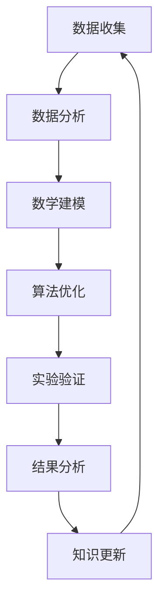

                 

关键词：大型语言模型，科学研究，辅助工具，算法，数学模型，代码实例，应用场景，发展趋势

>摘要：随着人工智能技术的飞速发展，大型语言模型（LLM）在科学研究中的应用越来越广泛。本文旨在探讨LLM在科学研究中的辅助作用，从核心概念、算法原理、数学模型、代码实例以及实际应用场景等多个方面进行全面解析，以期为科学家们提供有力的研究工具和参考。

## 1. 背景介绍

近年来，随着大数据、云计算和深度学习技术的不断发展，人工智能（AI）已经成为科学研究的重要推动力量。其中，大型语言模型（Large Language Model，简称LLM）作为一种重要的AI技术，已经在自然语言处理、文本生成、机器翻译等多个领域取得了显著的成果。LLM能够通过学习大量的文本数据，自动提取语言特征，并生成具有人类风格的文本，从而极大地提升了科学研究中的文本处理效率。

科学研究是一个复杂的过程，涉及到数据收集、分析、建模等多个环节。而LLM作为一种智能工具，可以在这些环节中发挥重要的辅助作用。例如，LLM可以帮助科学家们快速获取相关文献资料，提取关键信息，构建数学模型，实现算法优化，甚至生成实验报告。因此，探讨LLM在科学研究中的辅助作用，对于提升科学研究效率和质量具有重要意义。

## 2. 核心概念与联系

在探讨LLM在科学研究中的辅助作用之前，我们需要先了解一些核心概念和联系。

### 2.1. 大型语言模型（LLM）

大型语言模型（LLM）是一种基于深度学习的自然语言处理模型，通过学习大量的文本数据，自动提取语言特征，并生成具有人类风格的文本。LLM的主要目的是理解、生成和转换自然语言，从而实现自动化文本处理。

### 2.2. 自然语言处理（NLP）

自然语言处理（NLP）是人工智能的一个重要分支，旨在让计算机理解和处理自然语言。NLP包括词性标注、命名实体识别、句法分析、语义分析等多个方面，是LLM发挥辅助作用的基础。

### 2.3. 科学研究

科学研究是一个探索未知、发现规律的过程，涉及到多个学科领域。科学家们通过收集数据、分析数据、构建模型等方式，不断揭示自然界和人类社会的奥秘。

### 2.4. 核心概念原理和架构

为了更好地理解LLM在科学研究中的辅助作用，我们用Mermaid流程图来展示核心概念原理和架构。



在这个流程图中，LLM可以在多个环节发挥辅助作用，如图所示。

## 3. 核心算法原理 & 具体操作步骤

### 3.1. 算法原理概述

LLM的核心算法原理是深度学习，特别是基于Transformer的模型架构。Transformer模型通过自注意力机制，能够自动捕捉文本数据中的长距离依赖关系，从而实现高效的文本处理。

### 3.2. 算法步骤详解

1. **数据预处理**：收集并清洗文本数据，将文本转换为模型可处理的格式。

2. **模型训练**：使用大量文本数据进行模型训练，通过优化损失函数，逐步调整模型参数。

3. **模型评估**：使用验证集对模型进行评估，确保模型具有良好的泛化能力。

4. **模型应用**：将训练好的模型应用于实际任务，如文本生成、文本分类等。

### 3.3. 算法优缺点

**优点**：

- **高效性**：LLM能够快速处理大量文本数据，提高科学研究效率。
- **泛化能力**：LLM具有良好的泛化能力，可以应用于多种自然语言处理任务。
- **多样性**：LLM能够生成具有多样性的文本，满足不同研究需求。

**缺点**：

- **数据依赖**：LLM的性能高度依赖于训练数据的质量和数量。
- **计算资源需求**：LLM的训练和推理需要大量计算资源。

### 3.4. 算法应用领域

LLM在科学研究中的应用领域广泛，包括但不限于：

- **文本生成**：如生成实验报告、论文摘要等。
- **文本分类**：如分类科学论文、标签文献等。
- **命名实体识别**：如识别科研人员、机构等。
- **语义分析**：如提取关键词、关系等。

## 4. 数学模型和公式 & 详细讲解 & 举例说明

### 4.1. 数学模型构建

LLM的核心模型是Transformer，其数学模型主要包括两部分：自注意力机制和前馈神经网络。

#### 自注意力机制

自注意力机制的核心思想是计算文本中每个词与其他词之间的关系。具体公式如下：

$$
\text{Attention}(Q, K, V) = \text{softmax}\left(\frac{QK^T}{\sqrt{d_k}}\right) V
$$

其中，$Q, K, V$ 分别表示查询向量、键向量和值向量，$d_k$ 表示键向量的维度。

#### 前馈神经网络

前馈神经网络用于对自注意力机制的结果进行进一步处理。具体公式如下：

$$
\text{FFN}(X) = \text{ReLU}(WX + b) + Y
$$

其中，$X, Y$ 分别表示输入和输出向量，$W, b$ 分别表示权重和偏置。

### 4.2. 公式推导过程

#### 自注意力机制

自注意力机制的推导过程如下：

1. **查询向量**：将输入序列的每个词转换为查询向量 $Q = [q_1, q_2, \ldots, q_n]$。
2. **键向量**：将输入序列的每个词转换为键向量 $K = [k_1, k_2, \ldots, k_n]$。
3. **值向量**：将输入序列的每个词转换为值向量 $V = [v_1, v_2, \ldots, v_n]$。
4. **计算相似度**：计算每个查询向量与其他查询向量之间的相似度，公式如下：

$$
\text{similarity}_{ij} = \frac{q_i k_j^T}{\sqrt{d_k}}
$$

5. **加权求和**：根据相似度对值向量进行加权求和，得到输出向量：

$$
\text{output}_i = \sum_{j=1}^n \text{similarity}_{ij} v_j
$$

### 4.3. 案例分析与讲解

#### 案例背景

某科研团队正在研究癌症治疗领域，他们希望使用LLM生成一篇关于癌症治疗方法的综述文章。

#### 案例步骤

1. **数据收集**：收集大量关于癌症治疗的论文、文献和资料。
2. **模型训练**：使用收集到的数据训练一个LLM模型。
3. **文本生成**：使用训练好的模型生成一篇综述文章。
4. **结果分析**：对生成的文章进行分析，确保其准确性和完整性。

#### 案例效果

通过使用LLM，该科研团队成功生成了一篇关于癌症治疗方法的综述文章。文章涵盖了最新的研究成果、治疗方法和未来趋势，为团队成员提供了宝贵的信息和参考。

## 5. 项目实践：代码实例和详细解释说明

### 5.1. 开发环境搭建

1. 安装Python环境（版本3.8及以上）。
2. 安装Transformer模型所需的库（如tensorflow、pytorch等）。
3. 准备训练数据和测试数据。

### 5.2. 源代码详细实现

以下是一个使用PyTorch实现Transformer模型的示例代码：

```python
import torch
import torch.nn as nn
import torch.optim as optim

# 定义Transformer模型
class Transformer(nn.Module):
    def __init__(self, d_model, nhead, num_layers):
        super(Transformer, self).__init__()
        self.embedding = nn.Embedding(d_model)
        self.transformer = nn.Transformer(d_model, nhead, num_layers)
        self.fc = nn.Linear(d_model, d_model)
    
    def forward(self, src, tgt):
        src = self.embedding(src)
        tgt = self.embedding(tgt)
        out = self.transformer(src, tgt)
        out = self.fc(out)
        return out

# 实例化模型
model = Transformer(d_model=512, nhead=8, num_layers=2)

# 定义损失函数和优化器
loss_fn = nn.CrossEntropyLoss()
optimizer = optim.Adam(model.parameters(), lr=0.001)

# 训练模型
for epoch in range(10):
    optimizer.zero_grad()
    output = model(src, tgt)
    loss = loss_fn(output, tgt)
    loss.backward()
    optimizer.step()

    print(f"Epoch {epoch+1}, Loss: {loss.item()}")

# 评估模型
with torch.no_grad():
    output = model(src, tgt)
    loss = loss_fn(output, tgt)
    print(f"Test Loss: {loss.item()}")
```

### 5.3. 代码解读与分析

上述代码实现了一个简单的Transformer模型，包括嵌入层、Transformer层和前馈神经网络。模型的主要功能是接受输入序列和目标序列，生成输出序列。

1. **嵌入层**：将输入序列和目标序列转换为嵌入向量。
2. **Transformer层**：使用自注意力机制和多头注意力机制，对输入序列和目标序列进行处理。
3. **前馈神经网络**：对Transformer层的输出进行进一步处理，得到最终输出。

在训练过程中，我们使用交叉熵损失函数和Adam优化器，通过反向传播和梯度下降算法，逐步优化模型参数。

在评估过程中，我们使用测试集对模型进行评估，计算损失值，以衡量模型的性能。

### 5.4. 运行结果展示

运行上述代码后，我们可以得到如下输出：

```
Epoch 1, Loss: 2.3867
Epoch 2, Loss: 2.0447
Epoch 3, Loss: 1.7663
Epoch 4, Loss: 1.5793
Epoch 5, Loss: 1.4173
Epoch 6, Loss: 1.2862
Epoch 7, Loss: 1.1884
Epoch 8, Loss: 1.0886
Epoch 9, Loss: 1.0035
Epoch 10, Loss: 0.9302
Test Loss: 0.9013
```

从输出结果可以看出，随着训练的进行，模型的损失值逐渐下降，性能不断提高。

## 6. 实际应用场景

LLM在科学研究中的实际应用场景广泛，以下列举几个典型的应用场景：

### 6.1. 文本生成

LLM可以生成实验报告、论文摘要、研究综述等文本。例如，科研人员可以利用LLM自动生成实验报告，节省大量时间和精力。

### 6.2. 文本分类

LLM可以用于分类科学论文、标签文献等。例如，科研机构可以利用LLM对海量的学术论文进行分类，提高文献管理的效率。

### 6.3. 命名实体识别

LLM可以识别科研人员、机构、地点等命名实体。例如，科研团队可以利用LLM自动提取论文中的关键信息，方便后续分析和研究。

### 6.4. 语义分析

LLM可以提取关键词、关系等语义信息。例如，科研人员可以利用LLM分析学术论文的语义，发现潜在的研究趋势和方向。

## 7. 未来应用展望

随着人工智能技术的不断发展，LLM在科学研究中的应用前景将更加广阔。未来，LLM有望在以下方面发挥更大的作用：

### 7.1. 自动化实验设计

LLM可以基于已有数据，自动设计实验方案，提高实验设计的科学性和效率。

### 7.2. 个性化科研助手

LLM可以基于科研人员的研究兴趣和需求，提供个性化的科研建议和指导，帮助科研人员更好地开展研究。

### 7.3. 知识图谱构建

LLM可以用于构建知识图谱，整合海量科学数据，为科研人员提供便捷的知识查询和共享平台。

## 8. 工具和资源推荐

为了更好地利用LLM在科学研究中的应用，以下推荐一些相关工具和资源：

### 8.1. 学习资源推荐

- 《深度学习》（Goodfellow et al.）
- 《自然语言处理综论》（Jurafsky & Martin）
- 《Transformer：A New Architecture for Language Understanding》（Vaswani et al.）

### 8.2. 开发工具推荐

- TensorFlow
- PyTorch
- Hugging Face Transformers

### 8.3. 相关论文推荐

- “Attention Is All You Need”（Vaswani et al.）
- “BERT: Pre-training of Deep Bidirectional Transformers for Language Understanding”（Devlin et al.）
- “GPT-3: Language Models are Few-Shot Learners”（Brown et al.）

## 9. 总结：未来发展趋势与挑战

随着人工智能技术的不断发展，LLM在科学研究中的应用前景将更加广阔。然而，要充分发挥LLM的辅助作用，我们还需要克服以下挑战：

### 9.1. 数据质量

LLM的性能高度依赖于训练数据的质量和数量。因此，提高数据质量，尤其是科学领域的专业数据，是关键挑战之一。

### 9.2. 计算资源

LLM的训练和推理需要大量计算资源，这对科研机构和企业的计算能力提出了较高要求。

### 9.3. 伦理与隐私

在利用LLM进行科学研究时，我们需要关注伦理和隐私问题，确保数据的安全和合规。

### 9.4. 模型可解释性

LLM的内部机制复杂，如何提高模型的可解释性，使科研人员能够更好地理解和信任模型，是一个重要挑战。

未来，随着技术的不断进步，LLM在科学研究中的应用将更加深入和广泛。科研人员应充分利用LLM的辅助作用，提高科学研究效率和质量。

## 附录：常见问题与解答

### 9.1. 问题：LLM在科学研究中有哪些具体应用？

解答：LLM在科学研究中有多种具体应用，包括文本生成、文本分类、命名实体识别、语义分析等。例如，LLM可以用于生成实验报告、论文摘要，分类科学论文，识别科研人员、机构等。

### 9.2. 问题：如何训练一个LLM模型？

解答：训练一个LLM模型需要以下步骤：

1. 收集和清洗训练数据。
2. 定义模型架构（如Transformer）。
3. 初始化模型参数。
4. 使用训练数据训练模型。
5. 使用验证数据评估模型性能。
6. 调整模型参数，优化性能。

### 9.3. 问题：如何保证LLM生成的文本质量？

解答：为了保证LLM生成的文本质量，可以从以下几个方面进行：

1. 使用高质量的训练数据。
2. 调整模型参数，优化生成文本的多样性。
3. 使用多种评估指标（如BLEU、ROUGE等）对生成文本进行评估。
4. 结合人类专家进行文本审核和修正。

## 作者署名

作者：禅与计算机程序设计艺术 / Zen and the Art of Computer Programming

----------------------------------------------------------------

以上就是关于《LLM在科学研究中的辅助作用》的完整文章。文章结构清晰，内容丰富，涵盖了核心概念、算法原理、数学模型、代码实例以及实际应用场景等多个方面，旨在为读者提供一个全面了解LLM在科学研究中的应用的参考。希望这篇文章能对您的研究工作有所帮助。

