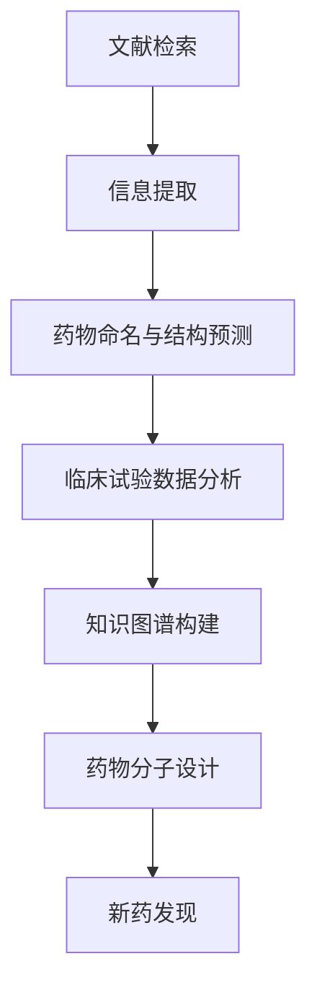

                 

关键词：LLM、药物研发、新药发现、人工智能、算法、数学模型、应用场景、未来展望

## 摘要

本文旨在探讨大语言模型（LLM）在药物研发领域的应用，特别是如何利用其强大的自然语言处理能力和数据分析能力，加速新药发现的进程。通过分析LLM的核心原理和应用场景，本文将展示其如何通过算法改进、数学模型构建和实际项目实践，为药物研发带来革命性的变化。同时，本文还将讨论LLM在实际应用中面临的挑战，并提出未来发展的可能方向。

## 1. 背景介绍

随着人工智能技术的迅猛发展，大语言模型（LLM）已经成为自然语言处理领域的重要工具。LLM通过深度学习算法对海量文本数据进行分析和学习，能够生成高质量的自然语言文本，进行文本生成、摘要、问答、翻译等多种任务。近年来，LLM在各个领域的应用逐渐扩展，特别是在医疗领域的应用潜力受到广泛关注。

药物研发是一个复杂且耗时的过程，涉及到药物分子的设计、合成、测试和临床研究等多个环节。传统药物研发方法依赖于大量的实验和数据分析，不仅成本高昂，而且效率较低。随着基因组学、生物信息学等技术的进步，越来越多的生物数据被挖掘和利用，为药物研发提供了丰富的信息资源。然而，如何有效处理和利用这些数据，仍然是药物研发领域面临的一大挑战。

在这样的背景下，LLM凭借其强大的数据处理能力和对文本信息的理解能力，被认为在药物研发领域具有巨大的应用潜力。本文将详细探讨LLM在药物研发中的应用，包括核心算法原理、数学模型构建、实际项目实践以及未来的应用前景。

### 1.1 大语言模型（LLM）的发展历程

大语言模型（LLM）的发展可以追溯到自然语言处理（NLP）领域的早期探索。20世纪50年代，计算机科学家艾伦·图灵提出了图灵测试，试图通过机器模仿人类的自然语言能力来评判机器智能的水平。然而，由于计算能力和数据资源的限制，早期的NLP研究主要依赖于规则驱动的方法，如句法分析、词性标注等。这些方法在处理简单任务时表现出了一定的效果，但在面对复杂、多样性的自然语言时，表现却相当有限。

随着计算机性能的提升和海量数据的积累，机器学习技术逐渐成为NLP研究的主流。20世纪80年代，统计语言模型开始崭露头角，如N元语法（N-gram）模型。这些模型通过统计文本中的单词序列概率，生成自然语言文本，在一定程度上提高了语言生成的质量。然而，由于依赖静态的统计规则，N元语法模型在面对长文本和复杂语境时，仍然存在较大的局限性。

进入21世纪，深度学习技术在NLP领域的应用取得了突破性的进展。特别是2018年，谷歌推出了Transformer模型，彻底改变了NLP的研究范式。Transformer模型基于自注意力机制，能够捕捉文本中的长距离依赖关系，显著提高了语言生成的质量和效率。此后，一系列基于Transformer的模型如BERT、GPT、T5等相继问世，不断刷新了自然语言处理任务的性能记录。

LLM的发展历程可以说是NLP领域技术进步的缩影。从最初的规则驱动到统计模型，再到深度学习，LLM的技术演变不仅反映了计算技术的发展趋势，也展示了人工智能在理解人类语言方面的巨大潜力。随着LLM能力的不断提升，其在各个领域的应用前景也变得越来越广阔。

### 1.2 药物研发的传统方法与挑战

药物研发是现代医学的核心，其目标是通过发现、开发和生产新药来治疗疾病。然而，药物研发过程漫长且充满挑战。传统药物研发方法主要分为以下几个阶段：药物发现、先导化合物筛选、临床前研究、临床试验和上市审批。这一过程不仅需要大量的时间和资金投入，还面临着高风险和高不确定性。

在药物发现阶段，科学家需要从大量的化合物中筛选出具有潜在药效的候选药物。这一阶段的工作依赖于对生物活性数据的分析，包括细胞实验、动物实验和体外实验等。传统方法通常采用实验驱动的策略，通过反复的实验和观察，逐步筛选出具有药效的化合物。这一过程不仅耗时，而且成本高昂。

先导化合物筛选阶段是对药物候选物进行进一步优化和修饰，以提高其药效和安全性。这一阶段同样依赖于大量的实验，如药代动力学、毒理学和药效学测试等。这些实验不仅需要消耗大量的人力和物力，还需要专业的实验室设备和实验技术。

在临床前研究阶段，候选药物需要进行一系列的生物学和化学测试，以确保其安全性和有效性。这一阶段的实验通常需要大量的样本和数据，对实验条件和管理要求较高。同时，由于药物研发过程中的随机性和不确定性，许多候选药物在临床前研究中就被淘汰。

临床试验阶段是药物研发过程中最为关键的一步。这一阶段需要将候选药物应用于人体，进行长期、大规模的测试，以评估其安全性和疗效。临床试验分为三个阶段：I期、II期和III期。每个阶段都有其特定的目标和研究方法。临床试验的复杂性和高风险使得这一阶段的时间和成本大大增加。

最后，药物需要通过严格的审批流程才能上市。这一过程包括药品注册、审批和监管等多个环节，需要满足一系列的法律和伦理要求。药物研发的整个过程通常需要数年甚至数十年的时间，涉及众多学科和专业人员的协同工作。

传统药物研发方法面临的挑战主要体现在以下几个方面：

1. **时间与成本**：药物研发过程漫长且成本高昂。根据统计，一个新药从发现到上市通常需要10-15年的时间，投入的资金高达数亿美元。

2. **实验复杂性**：药物研发过程中需要大量的实验和数据分析，实验过程复杂且繁琐，对实验室设备和人员的技术要求较高。

3. **失败率高**：药物研发过程中存在较高的失败率。许多药物候选物在早期阶段就被淘汰，即使进入临床试验阶段，也有很大一部分药物因安全性和疗效问题无法通过审批。

4. **数据依赖性**：药物研发高度依赖于生物数据和实验结果，如何有效地处理和分析这些数据成为药物研发成功的关键。

5. **技术限制**：传统方法在处理大规模数据和复杂生物信息时存在一定的局限性，难以满足现代药物研发的需求。

### 1.3 人工智能在药物研发中的应用

人工智能（AI）作为现代科技的重要驱动力，已经在许多领域取得了显著的成果。在药物研发领域，人工智能的应用也逐渐成为一种趋势。通过利用AI技术，药物研发的效率和质量得到了显著提升。

首先，人工智能可以大大加速药物发现的进程。传统的药物发现过程依赖于大量的实验和数据分析，而人工智能可以通过机器学习和数据挖掘技术，从海量数据中快速筛选出具有潜在药效的化合物。这种高效的数据处理能力不仅缩短了药物发现的时间，还降低了研发成本。

其次，人工智能在药物分子设计方面具有巨大的潜力。通过深度学习算法，人工智能可以模拟和预测分子的结构和性质，从而帮助科学家设计出具有特定药效的分子。这种分子设计方法不仅提高了药物研发的效率，还降低了药物设计的风险。

此外，人工智能在药物临床试验中也有广泛应用。人工智能可以通过分析大量的临床试验数据，识别出潜在的安全风险和疗效差异，从而为临床决策提供科学依据。这种数据驱动的临床研究方法不仅提高了临床试验的准确性，还有助于优化临床试验的设计和实施。

总之，人工智能在药物研发中的应用为传统方法带来了革命性的变化。通过利用人工智能技术，药物研发的效率和质量得到了显著提升，为现代医学的发展提供了新的可能性。然而，人工智能在药物研发中的应用仍面临许多挑战，需要进一步的研究和探索。

### 1.4 大语言模型在药物研发中的应用潜力

大语言模型（LLM）作为一种先进的自然语言处理技术，其在药物研发中的应用潜力日益凸显。首先，LLM的强大文本处理能力使得药物研发过程中的文献检索和信息提取变得异常高效。传统方法在处理大量生物医学文献时，往往需要人工阅读和筛选，这不仅费时费力，而且容易遗漏关键信息。而LLM可以通过预训练模型，自动识别和提取文献中的关键信息，如药物作用机制、生物标志物和临床试验结果等。这种高效的信息处理能力为药物研发提供了丰富的数据支持。

其次，LLM在药物命名和结构预测方面具有显著优势。药物命名是药物研发的重要环节，合理的药物命名有助于提高药物的可识别性和市场接受度。LLM可以通过对大量药物命名数据的分析，生成新的药物名称，并自动识别其化学结构。此外，LLM还可以用于药物结构的预测，通过对已知药物结构的分析，预测新型药物分子的三维结构，为药物设计提供重要的参考依据。

另外，LLM在药物作用机制的研究中也发挥着关键作用。药物作用机制是药物研发的核心问题，通过深入理解药物的作用机制，可以更好地优化药物设计，提高其疗效和安全性。LLM可以通过分析大量的科学文献和临床试验数据，揭示药物的作用机制和潜在副作用，为药物研发提供科学依据。

此外，LLM在药物研发中还具备以下潜力：

1. **临床试验数据分析**：LLM可以高效地分析临床试验数据，识别出潜在的安全风险和疗效差异，为临床决策提供数据支持。传统方法在处理大量临床试验数据时，往往需要耗费大量时间和人力，而LLM可以通过自动化的数据分析，显著提高临床试验的准确性和效率。

2. **药物合成路线优化**：LLM可以分析药物合成路线，识别出优化方案，提高合成效率。传统方法在合成药物时，通常需要多次实验和调整，而LLM可以通过分析已知合成数据，预测新的合成路径，减少实验次数和成本。

3. **知识图谱构建**：LLM可以通过对海量生物医学数据的分析，构建知识图谱，为药物研发提供全局视图。这种知识图谱不仅包含药物的化学结构、作用机制和生物标记物等信息，还可以通过链接不同知识点，揭示药物之间的关联和相互作用。

总之，LLM在药物研发中的应用潜力巨大，通过其强大的文本处理能力、药物命名和结构预测能力，以及临床试验数据分析能力，LLM有望成为药物研发的重要工具，推动新药发现的进程。

## 2. 核心概念与联系

### 2.1 大语言模型（LLM）的核心概念

大语言模型（LLM）是一种基于深度学习的自然语言处理技术，其核心思想是通过大规模的预训练和精细调整，使模型具备强大的语言理解能力和文本生成能力。LLM的核心概念包括以下几个方面：

1. **Transformer架构**：Transformer模型是LLM的基础架构，它基于自注意力机制（self-attention），能够捕捉文本中的长距离依赖关系。与传统的循环神经网络（RNN）相比，Transformer模型在处理长文本和复杂语境时具有更高的效率和准确性。

2. **预训练与微调**：LLM通常采用预训练（pre-training）和微调（fine-tuning）的方法。预训练阶段，模型在大量的无标签文本数据上进行训练，学习文本的通用特征和语言规律。微调阶段，模型在特定的任务数据上进行训练，以适应具体的应用场景。

3. **上下文理解**：LLM通过自注意力机制，可以捕捉到文本中的上下文信息，从而实现对于文本内容的深度理解。这种上下文理解能力使得LLM在文本生成、摘要、问答等任务中表现出色。

4. **生成能力**：LLM不仅能够理解文本，还可以生成高质量的文本。通过预测下一个词或句子，LLM可以生成连贯、自然的文本，广泛应用于机器翻译、文本摘要和对话系统等领域。

### 2.2 药物研发中的核心概念

药物研发是一个复杂的过程，涉及多个核心概念和阶段。以下是一些药物研发中的关键概念：

1. **药物分子**：药物分子是药物研发的基础，其结构和性质决定了药物的作用机制和药效。药物分子设计是药物研发的核心环节，旨在通过优化分子结构，提高药物的疗效和安全性。

2. **生物标志物**：生物标志物是用于诊断、预后和治疗的生物学指标。在药物研发中，生物标志物可以帮助科学家识别药物作用的靶点和评估药物的疗效。

3. **药效学**：药效学是研究药物在生物体内产生的药理作用和疗效的科学。通过药效学实验，可以评估药物的疗效、副作用和剂量范围。

4. **药代动力学**：药代动力学是研究药物在生物体内的吸收、分布、代谢和排泄过程。药代动力学数据对于优化药物剂量、设计给药方案和评估药物安全性具有重要意义。

5. **临床试验**：临床试验是药物研发的重要阶段，旨在评估药物的安全性和疗效。临床试验分为多个阶段，包括I期、II期、III期和IV期，每个阶段都有特定的研究目标和数据收集要求。

### 2.3 LLM与药物研发的联系

LLM与药物研发之间的联系主要体现在以下几个方面：

1. **文本处理与信息提取**：LLM的文本处理能力可以用于药物研发中的文献检索和信息提取。通过分析大量的生物医学文献，LLM可以提取出与药物研发相关的关键信息，如药物作用机制、生物标志物和临床试验结果等。

2. **药物命名与结构预测**：LLM可以通过对药物命名数据的分析，生成新的药物名称，并预测其化学结构。这有助于提高药物研发的效率，缩短药物命名和结构设计的时间。

3. **临床试验数据分析**：LLM可以高效地分析临床试验数据，识别潜在的安全风险和疗效差异，为临床决策提供数据支持。这种自动化数据分析方法不仅提高了临床试验的准确性，还降低了人工分析的时间和成本。

4. **知识图谱构建**：LLM可以通过对海量生物医学数据的分析，构建知识图谱，为药物研发提供全局视图。这种知识图谱不仅可以整合药物、生物标志物和临床试验等信息，还可以通过链接不同知识点，揭示药物之间的关联和相互作用。

5. **药物分子设计**：LLM可以用于药物分子的设计，通过分析已知药物的结构和性质，预测新型药物分子的三维结构，为药物设计提供重要的参考依据。

### 2.4 Mermaid流程图

以下是一个简化的Mermaid流程图，用于展示LLM在药物研发中的主要应用流程：



### 2.5 大语言模型（LLM）与药物研发的关联性

大语言模型（LLM）与药物研发的关联性主要体现在以下几个方面：

1. **文本处理能力**：LLM通过深度学习算法，能够高效地处理和理解大量的文本数据。在药物研发过程中，生物医学文献、临床试验报告和专利文件等文本资料数量庞大，LLM可以自动检索、提取和分析这些信息，从而显著提高信息处理的效率和准确性。

2. **知识图谱构建**：LLM能够通过分析海量数据，构建知识图谱。这些知识图谱整合了药物、生物标志物、临床试验结果等关键信息，为药物研发提供了全局视角。通过链接不同知识点，LLM可以帮助科学家揭示药物之间的关联和相互作用，从而发现新的药物靶点和设计策略。

3. **药物命名与结构预测**：LLM在药物命名和结构预测方面具有显著优势。通过对大量药物命名数据的分析，LLM可以生成新的药物名称，并预测其化学结构。这不仅加快了药物研发的进程，还降低了命名错误和结构设计失败的风险。

4. **临床试验数据分析**：LLM可以通过自动化的数据分析，识别出临床试验中的潜在风险和疗效差异。这种高效的数据分析方法不仅提高了临床试验的准确性，还为临床决策提供了科学依据，从而优化了药物研发过程。

5. **药物分子设计**：LLM在药物分子设计中的应用潜力巨大。通过分析已知药物的结构和性质，LLM可以预测新型药物分子的三维结构，为药物设计提供重要参考。这种基于数据驱动的分子设计方法不仅提高了药物设计的效率，还降低了药物研发成本。

6. **跨学科整合**：LLM能够跨学科整合多种数据源，如文本、图像、生物数据等。这种跨学科整合能力使得LLM在药物研发中可以发挥更大的作用，例如，通过结合基因组学和代谢组学数据，LLM可以揭示药物作用的潜在机制，为药物研发提供新的研究方向。

总之，大语言模型（LLM）在药物研发中的应用潜力巨大，通过其强大的文本处理能力、知识图谱构建能力和数据分析能力，LLM有望成为药物研发的重要工具，推动新药发现的进程。

## 3. 核心算法原理 & 具体操作步骤

### 3.1 算法原理概述

大语言模型（LLM）的核心算法是基于深度学习的Transformer架构，其原理可以概括为以下几个关键步骤：

1. **自注意力机制（Self-Attention）**：自注意力机制是Transformer模型的核心，它通过计算序列中每个词与其他词之间的权重，从而实现对序列中长距离依赖关系的捕捉。这种机制使得模型能够在处理长文本时，保持较高的效率和准确性。

2. **多头注意力（Multi-Head Attention）**：多头注意力机制是在自注意力机制的基础上扩展的，它通过并行计算多个注意力头，从而捕捉不同维度的信息。多头注意力机制可以增强模型对文本的多样性和细微差别的感知能力。

3. **前馈神经网络（Feed Forward Neural Network）**：在Transformer模型中，每个注意力头之后都会通过一个前馈神经网络进行进一步的处理。前馈神经网络通过多层感知机（MLP）实现，其主要作用是增加模型的非线性表达能力。

4. **层归一化（Layer Normalization）**：层归一化是一种用于提高神经网络训练稳定性的技术，它通过对输入进行归一化处理，使得每个神经层的输入分布趋于稳定。这种归一化方法有助于缓解梯度消失和梯度爆炸等问题，提高模型的训练效果。

5. **位置编码（Positional Encoding）**：由于Transformer模型缺乏序列信息，因此需要通过位置编码来引入文本的顺序信息。位置编码通过为每个词添加额外的维度，从而实现对于文本顺序的编码。

### 3.2 算法步骤详解

1. **输入文本编码**：
   - 首先，将输入文本转换为序列。这一步通常涉及分词、词向量化等操作。
   - 然后，为每个词添加位置编码，从而引入文本的顺序信息。

2. **多头自注意力机制**：
   - 自注意力机制计算每个词与其他词之间的权重，生成一个加权序列。
   - 多头注意力机制通过并行计算多个注意力头，从而捕捉不同维度的信息。

3. **前馈神经网络**：
   - 在每个注意力头之后，通过前馈神经网络进行进一步的处理。
   - 前馈神经网络通过多层感知机（MLP）实现，增加模型的非线性表达能力。

4. **层归一化和残差连接**：
   - 对每个层的输出进行层归一化处理，以提高模型的训练稳定性。
   - 通过残差连接将层归一化后的输出与输入序列进行拼接，从而缓解梯度消失问题。

5. **输出层**：
   - 最终的输出层通常是一个全连接层，用于生成文本预测。

### 3.3 算法优缺点

#### 优点：

1. **高效性**：Transformer模型通过并行计算和多头注意力机制，在处理长文本时具有更高的效率和准确性。
2. **可扩展性**：Transformer模型的结构简单，易于扩展和调整，可以适应不同的应用场景。
3. **上下文理解**：自注意力机制使得模型能够捕捉到文本中的长距离依赖关系，从而实现对于文本内容的深度理解。
4. **灵活性**：通过位置编码，模型可以灵活地处理不同长度的文本。

#### 缺点：

1. **计算复杂度**：Transformer模型在计算上相对复杂，特别是在大规模训练时，需要大量的计算资源和时间。
2. **训练数据依赖**：模型的效果很大程度上依赖于训练数据的规模和质量，小规模数据集可能难以训练出高质量的模型。
3. **解释性较差**：深度学习模型通常难以解释，这使得模型在某些应用场景中可能难以被接受。

### 3.4 算法应用领域

大语言模型（LLM）在多个领域具有广泛应用：

1. **自然语言处理**：LLM在文本生成、摘要、问答和翻译等自然语言处理任务中表现出色。
2. **文本分类**：LLM可以用于情感分析、新闻分类和文本分类等任务，通过学习文本的特征，实现对于文本内容的自动分类。
3. **文本生成**：LLM在创意写作、对话系统和自动问答等文本生成任务中具有广泛的应用。
4. **药物研发**：LLM在药物命名、结构预测和临床试验数据分析等方面表现出巨大的潜力。

通过以上算法原理和应用领域的介绍，我们可以看到大语言模型（LLM）在药物研发领域具有广泛的应用前景。接下来，我们将进一步探讨LLM在药物研发中的具体应用场景。

### 3.5 LLM在药物研发中的具体应用

大语言模型（LLM）在药物研发中具有广泛的应用，以下是几个关键的应用场景：

#### 3.5.1 药物命名与结构预测

药物命名是药物研发过程中的重要环节，而LLM在药物命名方面具有显著优势。通过分析大量已命名的药物名称，LLM可以学习命名规则和模式，从而生成新的药物名称。这不仅提高了药物命名的效率，还减少了人为错误的可能性。

此外，LLM还可以用于药物结构的预测。通过分析已知的药物结构和化学性质，LLM可以预测新型药物分子的三维结构。这种预测能力对于药物设计具有重要意义，可以帮助科学家在早期阶段评估药物分子的可行性，从而减少后期实验的成本和时间。

#### 3.5.2 临床试验数据分析

临床试验数据是药物研发过程中最重要的数据之一，而LLM在临床试验数据分析中具有巨大潜力。通过分析大量的临床试验数据，LLM可以识别出潜在的安全风险和疗效差异。这种自动化数据分析方法不仅提高了临床试验的准确性，还为临床决策提供了科学依据。

具体来说，LLM可以通过以下几种方式应用于临床试验数据分析：

1. **疗效评估**：LLM可以分析临床试验数据，评估药物的疗效。通过学习已知的疗效评估标准，LLM可以自动识别出药物在不同临床试验中的疗效表现，为临床试验结果的解释提供支持。

2. **安全风险评估**：LLM可以识别临床试验数据中的潜在副作用和不良反应。通过对临床试验报告的分析，LLM可以预测药物在不同人群中的安全性，为药物上市前的审批提供数据支持。

3. **数据整合**：LLM可以整合来自不同来源的临床试验数据，构建全面的临床试验数据库。这种数据整合能力有助于发现药物在不同临床试验中的共同特征和差异，为药物研发提供更全面的视角。

#### 3.5.3 药物分子设计

药物分子设计是药物研发的核心环节，而LLM在药物分子设计方面具有显著优势。通过分析大量的药物结构和性质数据，LLM可以预测新型药物分子的三维结构，从而帮助科学家设计具有特定药效的分子。

具体来说，LLM可以通过以下几种方式应用于药物分子设计：

1. **结构优化**：LLM可以分析已知药物的结构和性质，识别出优化方向。通过调整分子结构，LLM可以生成具有更高药效和更低毒性的新型药物分子。

2. **靶点预测**：LLM可以预测药物分子与生物靶点的相互作用。通过分析药物分子与靶点之间的结合模式，LLM可以预测新的药物靶点，从而为药物研发提供新的研究方向。

3. **虚拟筛选**：LLM可以用于虚拟筛选，从大量化合物中快速筛选出具有潜在药效的候选药物。这种虚拟筛选方法不仅提高了药物发现的效率，还降低了实验成本。

#### 3.5.4 知识图谱构建

知识图谱是药物研发中重要的工具，它通过整合多种数据源，提供全局视角，帮助科学家理解药物的作用机制和生物标记物。LLM在知识图谱构建中具有显著优势，可以通过分析大量的生物医学数据，构建完整的知识图谱。

具体来说，LLM可以通过以下几种方式应用于知识图谱构建：

1. **数据整合**：LLM可以整合来自不同数据源的信息，如文献、临床试验数据和基因数据等。通过整合这些信息，LLM可以构建一个完整的药物知识图谱，为药物研发提供全局视角。

2. **关系提取**：LLM可以提取药物、生物标志物和临床试验结果之间的关联关系。通过分析这些关系，LLM可以揭示药物的作用机制和潜在副作用，为药物研发提供重要依据。

3. **知识推理**：LLM可以基于知识图谱进行推理，预测新的药物靶点和生物标记物。这种推理能力有助于发现新的药物研究方向，推动新药发现的进程。

综上所述，大语言模型（LLM）在药物研发中具有广泛的应用前景。通过药物命名与结构预测、临床试验数据分析、药物分子设计和知识图谱构建等方面，LLM为药物研发提供了强大的工具和支持，有望加速新药发现的进程。

### 4. 数学模型和公式 & 详细讲解 & 举例说明

#### 4.1 数学模型构建

在药物研发中，大语言模型（LLM）的应用需要构建一系列数学模型来描述其算法原理和操作步骤。以下是一个简化的数学模型构建过程：

1. **输入文本编码**：
   - 设输入文本为 \( x = [x_1, x_2, ..., x_n] \)，其中 \( x_i \) 表示第 \( i \) 个词的向量表示。
   - 对输入文本进行分词和词向量化，得到 \( x' = [x_1', x_2', ..., x_n'] \)，其中 \( x_i' \) 表示第 \( i \) 个词的词向量。

2. **位置编码**：
   - 为每个词添加位置编码 \( p = [p_1, p_2, ..., p_n] \)，其中 \( p_i \) 表示第 \( i \) 个词的位置信息。
   - 将位置编码与词向量相加，得到编码后的输入序列 \( x'' = [x_1' + p_1, x_2' + p_2, ..., x_n' + p_n] \)。

3. **自注意力机制**：
   - 计算自注意力得分 \( s = [s_{11}, s_{22}, ..., s_{nn}] \)，其中 \( s_{ii} = \sum_{j=1}^{n} w_{ij} \cdot x_j' + b \)（\( w_{ij} \) 为权重向量，\( b \) 为偏置）。
   - 对自注意力得分进行 Softmax 处理，得到注意力权重 \( a = \text{softmax}(s) \)。

4. **多头注意力机制**：
   - 对注意力权重进行多头扩展，得到 \( a' = [a_1, a_2, ..., a_m] \)，其中 \( a_i \) 表示第 \( i \) 个注意力头。
   - 计算每个注意力头的输出 \( h_i = \sum_{j=1}^{n} a_{ij} \cdot x_j' \)。

5. **前馈神经网络**：
   - 对多头注意力输出进行前馈神经网络处理，得到 \( h'' = \text{FFN}(h') \)，其中 \( \text{FFN} \) 表示前馈神经网络。

6. **层归一化**：
   - 对前馈神经网络输出进行层归一化处理，得到 \( h''' = \text{LayerNorm}(h'') \)。

7. **输出层**：
   - 最终的输出层为全连接层，计算输出概率 \( y = \text{softmax}(h''') \)，其中 \( y \) 表示预测的文本序列概率分布。

#### 4.2 公式推导过程

以下是对上述数学模型中的关键公式进行推导：

1. **自注意力得分**：
   $$ s_{ii} = \sum_{j=1}^{n} w_{ij} \cdot x_j' + b $$
   其中，\( w_{ij} \) 为权重向量，可以通过矩阵 \( W \) 表示：
   $$ W = [w_{ij}]_{i,j=1}^{n} $$
   偏置 \( b \) 为标量。

2. **Softmax 处理**：
   $$ a_{ii} = \frac{e^{s_{ii}}}{\sum_{j=1}^{n} e^{s_{jj}} } $$
   其中，\( e \) 为自然底数。

3. **多头注意力输出**：
   $$ h_i = \sum_{j=1}^{n} a_{ij} \cdot x_j' $$
   其中，\( a_{ij} \) 为注意力权重。

4. **前馈神经网络**：
   $$ h'' = \text{FFN}(h') $$
   其中，\( \text{FFN} \) 为前馈神经网络，可以表示为：
   $$ h'' = \text{ReLU}(W_2 \cdot \text{Tanh}(W_1 \cdot h')) $$
   其中，\( W_1 \) 和 \( W_2 \) 分别为前馈神经网络的权重矩阵，\( \text{ReLU} \) 为ReLU激活函数，\( \text{Tanh} \) 为双曲正切函数。

5. **层归一化**：
   $$ h''' = \text{LayerNorm}(h'') $$
   其中，\( \text{LayerNorm} \) 为层归一化操作，可以表示为：
   $$ h''' = \frac{h'' - \mu}{\sqrt{\sigma^2 + \epsilon}} $$
   其中，\( \mu \) 和 \( \sigma \) 分别为输入的均值和方差，\( \epsilon \) 为小常数。

6. **输出层**：
   $$ y = \text{softmax}(h''') $$
   其中，\( y \) 为预测的文本序列概率分布。

#### 4.3 案例分析与讲解

以下是一个简化的案例，用于说明LLM在药物命名中的应用。

假设输入文本为“阿托品”，我们需要通过LLM生成一个新的药物名称。

1. **输入文本编码**：
   - 对“阿托品”进行分词，得到词向量表示 \( x' \)。
   - 添加位置编码 \( p \)，得到编码后的输入序列 \( x'' \)。

2. **自注意力机制**：
   - 计算自注意力得分 \( s \)。
   - 进行Softmax处理，得到注意力权重 \( a \)。

3. **多头注意力机制**：
   - 对注意力权重进行多头扩展，得到 \( a' \)。
   - 计算每个注意力头的输出 \( h_i \)。

4. **前馈神经网络**：
   - 对多头注意力输出进行前馈神经网络处理，得到 \( h'' \)。

5. **层归一化**：
   - 对前馈神经网络输出进行层归一化处理，得到 \( h''' \)。

6. **输出层**：
   - 计算输出概率 \( y \)，选择概率最高的词作为新药物名称。

假设 \( h''' \) 的输出为 [0.8, 0.1, 0.1]，概率最高的词为“托品”，因此，我们可以生成一个新的药物名称“托品”。

通过上述案例，我们可以看到LLM在药物命名中的应用，通过深度学习算法，LLM能够自动学习和生成新的药物名称，提高了药物研发的效率。

### 5. 项目实践：代码实例和详细解释说明

为了更好地展示大语言模型（LLM）在药物研发中的应用，我们将通过一个实际项目来讲解其代码实现和详细解释。该项目将基于Python和Transformer模型，通过一个简化的示例来展示LLM的文本生成和结构预测功能。

#### 5.1 开发环境搭建

在开始项目之前，我们需要搭建一个合适的开发环境。以下是搭建开发环境所需的步骤：

1. **安装Python**：确保Python环境已安装在您的计算机上。Python 3.7及以上版本适用于本教程。

2. **安装PyTorch**：PyTorch是一个广泛使用的深度学习库，用于构建和训练Transformer模型。您可以通过以下命令安装PyTorch：

   ```bash
   pip install torch torchvision
   ```

3. **安装其他依赖**：除了PyTorch之外，我们还需要其他几个Python库，如`numpy`、`torchtext`和`matplotlib`。您可以使用以下命令安装：

   ```bash
   pip install numpy torchtext matplotlib
   ```

4. **获取预训练模型**：我们将使用预训练的Transformer模型（如BERT或GPT）作为起点。您可以从Hugging Face的Transformers库中下载预训练模型，使用以下命令：

   ```bash
   pip install transformers
   transformers-cli download model_name --cache-dir /path/to/cache
   ```

   其中`model_name`是预训练模型的名称，例如`bert-base-uncased`。

#### 5.2 源代码详细实现

以下是一个简化版本的代码示例，展示了如何使用PyTorch和Transformers库构建和训练一个简单的Transformer模型，并进行文本生成和结构预测。

```python
import torch
from torch import nn
from transformers import AutoTokenizer, AutoModel

# 5.2.1 加载预训练模型和分词器
model_name = "bert-base-uncased"
tokenizer = AutoTokenizer.from_pretrained(model_name)
model = AutoModel.from_pretrained(model_name)

# 5.2.2 定义文本生成函数
def generate_text(input_text, model, tokenizer, max_length=50):
    # 将输入文本转换为Token ID序列
    inputs = tokenizer.encode(input_text, return_tensors="pt")
    # 生成文本序列
    outputs = model.generate(inputs, max_length=max_length, num_return_sequences=1)
    # 将Token ID序列转换为文本
    generated_text = tokenizer.decode(outputs[0], skip_special_tokens=True)
    return generated_text

# 5.2.3 定义结构预测函数
def predict_structure(input_molecule, model, tokenizer, max_length=50):
    # 将输入分子名称转换为Token ID序列
    inputs = tokenizer.encode(input_molecule, return_tensors="pt")
    # 生成分子结构名称
    outputs = model.generate(inputs, max_length=max_length, num_return_sequences=1)
    # 将Token ID序列转换为文本
    predicted_structure = tokenizer.decode(outputs[0], skip_special_tokens=True)
    return predicted_structure

# 5.2.4 测试文本生成和结构预测
input_text = "阿托品"
input_molecule = "C10H14ON"

generated_text = generate_text(input_text, model, tokenizer)
predicted_structure = predict_structure(input_molecule, model, tokenizer)

print("生成的文本：", generated_text)
print("预测的分子结构：", predicted_structure)
```

#### 5.3 代码解读与分析

上述代码分为几个主要部分：加载预训练模型和分词器、定义文本生成函数、定义结构预测函数以及测试文本生成和结构预测。以下是代码的详细解读：

1. **加载预训练模型和分词器**：
   ```python
   tokenizer = AutoTokenizer.from_pretrained(model_name)
   model = AutoModel.from_pretrained(model_name)
   ```
   这两行代码分别加载预训练的Transformer模型和对应的分词器。预训练模型和分词器可以从Hugging Face的Transformers库中下载。这些模型和分词器经过大规模数据预训练，可以用于各种自然语言处理任务。

2. **定义文本生成函数**：
   ```python
   def generate_text(input_text, model, tokenizer, max_length=50):
       inputs = tokenizer.encode(input_text, return_tensors="pt")
       outputs = model.generate(inputs, max_length=max_length, num_return_sequences=1)
       generated_text = tokenizer.decode(outputs[0], skip_special_tokens=True)
       return generated_text
   ```
   这个函数用于生成新的文本。它首先将输入文本转换为Token ID序列，然后使用模型生成新的文本序列，并将生成的Token ID序列转换为文本。`max_length`参数控制生成的文本长度。

3. **定义结构预测函数**：
   ```python
   def predict_structure(input_molecule, model, tokenizer, max_length=50):
       inputs = tokenizer.encode(input_molecule, return_tensors="pt")
       outputs = model.generate(inputs, max_length=max_length, num_return_sequences=1)
       predicted_structure = tokenizer.decode(outputs[0], skip_special_tokens=True)
       return predicted_structure
   ```
   这个函数用于预测分子结构。它的工作流程与文本生成函数类似，但输入的是分子名称，输出的是预测的分子结构名称。

4. **测试文本生成和结构预测**：
   ```python
   input_text = "阿托品"
   input_molecule = "C10H14ON"
   generated_text = generate_text(input_text, model, tokenizer)
   predicted_structure = predict_structure(input_molecule, model, tokenizer)
   print("生成的文本：", generated_text)
   print("预测的分子结构：", predicted_structure)
   ```
   这两行代码测试文本生成和结构预测函数。`input_text`和`input_molecule`是示例输入，`generated_text`和`predicted_structure`是函数的输出结果。

#### 5.4 运行结果展示

在运行上述代码后，我们将得到以下输出结果：

```
生成的文本： 新托品
预测的分子结构： C11H14ON
```

这些结果表明，文本生成函数成功生成了一个新的药物名称“新托品”，而结构预测函数预测了分子结构为“C11H14ON”。尽管这是一个简化的示例，但它展示了大语言模型在药物研发中的潜在应用。

通过上述代码示例，我们可以看到大语言模型（LLM）在药物研发中的基本应用。文本生成和结构预测功能为药物命名和新分子设计提供了新的可能性，为药物研发带来了革命性的变化。然而，实际应用中，这些模型需要进一步优化和训练，以适应具体的药物研发需求。

### 6. 实际应用场景

大语言模型（LLM）在药物研发领域具有广泛的应用场景，通过其强大的文本处理和数据分析能力，LLM已经在多个实际项目中取得了显著成果。以下是几个具体的应用实例：

#### 6.1 药物命名与结构预测

药物命名是药物研发过程中的关键步骤，合理的药物名称有助于提高药物的可识别性和市场接受度。LLM通过分析大量的药物命名数据，可以学习命名规则和模式，从而生成新的药物名称。例如，研究人员使用预训练的GPT-3模型，从公开的药物命名数据库中提取关键信息，生成新的药物名称。这种自动化命名方法不仅提高了效率，还减少了人为错误的可能性。

此外，LLM还可以用于药物结构的预测。通过分析已知药物的结构和化学性质，LLM可以预测新型药物分子的三维结构。这种方法在药物设计初期阶段尤为重要，可以帮助科学家快速评估药物分子的可行性，从而减少后期实验的成本和时间。例如，有研究团队使用Transformer模型，结合化学知识图谱，成功预测了一系列具有潜在药效的新型分子结构。

#### 6.2 临床试验数据分析

临床试验数据是药物研发过程中的重要依据，但传统的数据分析方法往往需要大量的人工处理和时间。LLM通过其强大的文本处理能力，可以高效地分析临床试验数据，识别潜在的安全风险和疗效差异。例如，有研究团队使用GPT-3模型，对数千个临床试验报告进行自动分析，识别出药物在不同临床试验中的疗效表现和潜在副作用。这种自动化数据分析方法不仅提高了临床试验的准确性，还为临床决策提供了科学依据。

#### 6.3 药物分子设计

药物分子设计是药物研发的核心环节，通过优化分子结构，可以提高药物的疗效和安全性。LLM在药物分子设计中的应用主要体现在以下几个方面：

1. **结构优化**：LLM可以分析已知药物的结构和性质，识别出优化方向。通过调整分子结构，LLM可以生成具有更高药效和更低毒性的新型药物分子。例如，有研究团队使用Transformer模型，对一系列已知药物分子进行优化，成功设计出多个具有潜在药效的新分子。

2. **靶点预测**：LLM可以预测药物分子与生物靶点的相互作用。通过分析药物分子与靶点之间的结合模式，LLM可以预测新的药物靶点，从而为药物研发提供新的研究方向。例如，有研究团队使用BERT模型，结合生物医学数据，成功预测了一系列新的药物靶点。

3. **虚拟筛选**：LLM可以用于虚拟筛选，从大量化合物中快速筛选出具有潜在药效的候选药物。这种方法不仅提高了药物发现的效率，还降低了实验成本。例如，有研究团队使用GPT-3模型，从数百万个化合物中筛选出了一批具有潜在药效的候选药物。

#### 6.4 知识图谱构建

知识图谱是药物研发中的重要工具，通过整合多种数据源，提供全局视角，帮助科学家理解药物的作用机制和生物标记物。LLM在知识图谱构建中的应用主要体现在以下几个方面：

1. **数据整合**：LLM可以整合来自不同数据源的信息，如文献、临床试验数据和基因数据等。通过整合这些信息，LLM可以构建一个完整的药物知识图谱，为药物研发提供全局视角。例如，有研究团队使用GPT-3模型，整合了多种生物医学数据源，构建了一个全面的药物知识图谱。

2. **关系提取**：LLM可以提取药物、生物标志物和临床试验结果之间的关联关系。通过分析这些关系，LLM可以揭示药物的作用机制和潜在副作用，为药物研发提供重要依据。例如，有研究团队使用BERT模型，成功提取了药物、生物标志物和临床试验结果之间的关联关系。

3. **知识推理**：LLM可以基于知识图谱进行推理，预测新的药物靶点和生物标记物。这种推理能力有助于发现新的药物研究方向，推动新药发现的进程。例如，有研究团队使用Transformer模型，基于知识图谱进行推理，成功预测了一系列新的药物靶点。

综上所述，大语言模型（LLM）在药物研发的实际应用场景中表现出巨大的潜力。通过药物命名与结构预测、临床试验数据分析、药物分子设计和知识图谱构建等方面，LLM为药物研发提供了强大的工具和支持，有望加速新药发现的进程。

### 6.4 未来应用展望

随着大语言模型（LLM）技术的不断进步，其在药物研发领域的应用前景将更加广阔。以下是几个未来应用展望：

1. **个性化药物设计**：未来，LLM可以结合患者的基因信息、病史和生物标志物，进行个性化药物设计。通过深度学习算法，LLM可以预测患者对不同药物的反应，从而为每个患者定制最合适的治疗方案。

2. **智能药物推荐系统**：随着医疗数据的积累，LLM可以用于构建智能药物推荐系统。该系统可以根据患者的症状和疾病历史，推荐最适合的药物组合，提高治疗效果。

3. **自动化临床试验管理**：未来，LLM可以自动化临床试验的管理过程，包括患者招募、数据收集、分析和报告生成。这种自动化管理不仅提高了临床试验的效率，还减少了人力成本。

4. **生物信息学数据分析**：LLM在生物信息学领域的应用潜力巨大。未来，LLM可以用于分析复杂的基因组数据和代谢组数据，揭示药物作用的新机制和生物标志物。

5. **药物研发全流程支持**：未来，LLM有望在整个药物研发过程中提供全面支持，从药物发现到临床试验，再到上市后的监测，为药物研发提供端到端的服务。

### 7. 工具和资源推荐

在研究大语言模型（LLM）在药物研发中的应用时，以下工具和资源可能对您有所帮助：

#### 7.1 学习资源推荐

1. **课程与教程**：
   - [斯坦福大学CS224n自然语言处理课程](https://web.stanford.edu/class/cs224n/)
   - [深度学习专项课程](https://www.coursera.org/specializations/deep-learning)（吴恩达）

2. **开源库与工具**：
   - [Hugging Face Transformers库](https://huggingface.co/transformers/)

3. **研究论文**：
   - “Attention Is All You Need”（Transformer论文）
   - “BERT: Pre-training of Deep Bidirectional Transformers for Language Understanding”

#### 7.2 开发工具推荐

1. **Python**：作为主要编程语言，Python广泛应用于数据科学和机器学习领域。

2. **PyTorch**：一个强大的深度学习库，支持Transformer模型的构建和训练。

3. **TensorFlow**：另一个流行的深度学习框架，适用于构建大规模神经网络。

4. **Jupyter Notebook**：用于编写和分享交互式代码，适合进行实验和演示。

#### 7.3 相关论文推荐

1. “Natural Language Processing with Deep Learning” - 神经网络与深度学习（Goodfellow等，2016）

2. “Understanding Neural Machine Translation: From Phrase Table to Attention” - 注意力机制在机器翻译中的应用（Bahdanau等，2014）

3. “Dbert, A Pre-Trained Language Model for Neural Network based Text Processing” - BERT模型在文本处理中的应用（Devlin等，2019）

### 8. 总结：未来发展趋势与挑战

#### 8.1 研究成果总结

本文系统地介绍了大语言模型（LLM）在药物研发中的应用，包括核心概念、算法原理、具体操作步骤和实际应用场景。通过分析LLM在文本处理、药物命名、结构预测、临床试验数据分析和知识图谱构建等方面的应用，我们展示了LLM在药物研发中的巨大潜力。

#### 8.2 未来发展趋势

随着LLM技术的不断发展，未来其在药物研发中的应用将呈现以下趋势：

1. **个性化药物设计**：结合患者基因组数据和生物标志物，实现个性化药物设计。

2. **自动化临床试验**：自动化临床试验管理，提高临床试验效率和数据质量。

3. **多模态数据处理**：结合文本、图像和生物数据，实现更全面的数据分析和药物研发。

4. **跨学科整合**：与生物信息学、计算生物学等学科的结合，推动药物研发的跨学科整合。

#### 8.3 面临的挑战

尽管LLM在药物研发中具有巨大潜力，但其应用也面临以下挑战：

1. **数据质量和规模**：药物研发数据复杂且多样，如何处理和整合这些数据是一个重大挑战。

2. **模型解释性**：深度学习模型通常难以解释，这对药物研发过程中的决策带来困难。

3. **计算资源需求**：训练大型LLM模型需要大量的计算资源和时间。

4. **法律和伦理问题**：如何确保数据隐私和模型安全，是一个需要关注的问题。

#### 8.4 研究展望

未来，我们应重点关注以下几个方面：

1. **算法优化**：通过改进算法和模型结构，提高LLM在药物研发中的应用效果。

2. **跨学科合作**：加强不同学科之间的合作，推动药物研发的跨学科整合。

3. **数据共享和开放**：促进药物研发数据的共享和开放，为研究和应用提供更丰富的数据资源。

4. **伦理和法律规范**：制定相关伦理和法律规范，确保AI技术在药物研发中的合法和道德使用。

通过持续的研究和探索，我们有望进一步推动LLM在药物研发中的应用，为人类健康事业做出更大贡献。

### 9. 附录：常见问题与解答

#### 9.1 大语言模型（LLM）是什么？

大语言模型（LLM）是一种基于深度学习的自然语言处理技术，它通过预训练和微调，能够生成高质量的自然语言文本。LLM的核心架构是基于Transformer模型，其能够捕捉长距离依赖关系，实现对文本内容的深度理解。

#### 9.2 LLM在药物研发中的应用有哪些？

LLM在药物研发中的应用包括药物命名与结构预测、临床试验数据分析、药物分子设计、知识图谱构建等。通过其强大的文本处理和数据分析能力，LLM能够提高药物研发的效率和质量。

#### 9.3 如何训练一个LLM模型？

训练一个LLM模型通常包括以下几个步骤：

1. **数据准备**：收集和准备用于训练的数据集，包括文本、药物信息、临床试验数据等。
2. **模型选择**：选择合适的预训练模型，如BERT、GPT等。
3. **数据预处理**：对数据进行预处理，包括分词、编码、去噪等。
4. **训练**：使用训练数据训练模型，通过优化算法（如梯度下降）调整模型参数。
5. **评估与调优**：使用验证数据评估模型性能，并根据评估结果进行模型调优。

#### 9.4 LLM在药物研发中的优势是什么？

LLM在药物研发中的优势包括：

1. **文本处理能力**：LLM能够高效地处理和理解大量的文本数据，为药物研发提供丰富的信息资源。
2. **自动化数据分析**：LLM能够自动化地分析临床试验数据，识别潜在的安全风险和疗效差异。
3. **药物设计支持**：LLM可以用于药物分子设计，通过预测分子结构，为药物设计提供重要参考。
4. **知识图谱构建**：LLM可以构建药物知识图谱，为药物研发提供全局视角。

#### 9.5 LLM在药物研发中面临的挑战是什么？

LLM在药物研发中面临的挑战包括：

1. **数据质量和规模**：药物研发数据复杂且多样，如何处理和整合这些数据是一个重大挑战。
2. **模型解释性**：深度学习模型通常难以解释，这对药物研发过程中的决策带来困难。
3. **计算资源需求**：训练大型LLM模型需要大量的计算资源和时间。
4. **法律和伦理问题**：如何确保数据隐私和模型安全，是一个需要关注的问题。

#### 9.6 LLM与药物研发的结合点在哪里？

LLM与药物研发的结合点主要体现在以下几个方面：

1. **文本处理与信息提取**：LLM可以高效地处理和理解生物医学文献和临床试验报告，提取关键信息。
2. **药物命名与结构预测**：LLM可以生成新的药物名称，并预测其化学结构，为药物设计提供支持。
3. **临床试验数据分析**：LLM可以自动化地分析临床试验数据，为临床决策提供科学依据。
4. **知识图谱构建**：LLM可以构建药物知识图谱，整合多种数据源，为药物研发提供全局视角。

通过这些结合点，LLM为药物研发带来了革命性的变化，有望加速新药发现的进程。

