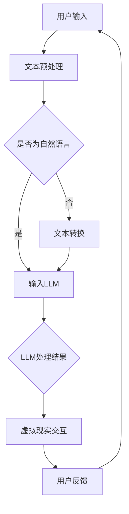

                 

关键词：LLM，虚拟现实，人工智能，应用，未来

> 摘要：随着人工智能和虚拟现实技术的不断发展，大型语言模型（LLM）在虚拟现实领域展现出了巨大的应用潜力。本文将探讨LLM在虚拟现实中的应用可能，分析其核心算法原理、数学模型、实际应用场景和未来发展趋势。

## 1. 背景介绍

虚拟现实（Virtual Reality，VR）是一种通过计算机模拟现实世界的三维空间，使用户可以在虚拟环境中感知、交互和探索的技术。近年来，随着硬件技术的进步和内容创作的丰富，虚拟现实逐渐从科幻走向现实，广泛应用于娱乐、教育、医疗、设计等多个领域。

人工智能（Artificial Intelligence，AI）作为计算机科学的一个重要分支，致力于研究如何使计算机具备人类智能。大型语言模型（Large Language Model，LLM）是人工智能领域中的一种深度学习模型，通过对海量文本数据的学习，能够理解和生成自然语言。近年来，随着计算能力和数据资源的不断提升，LLM取得了显著的成果，如GPT-3、BERT等。

本文旨在探讨LLM在虚拟现实中的应用可能，通过分析其核心算法原理、数学模型、实际应用场景和未来发展趋势，为虚拟现实技术的发展提供新的思路。

## 2. 核心概念与联系

### 2.1 LLM基本原理

LLM是一种基于变换器模型（Transformer）的深度神经网络，通过对海量文本数据进行预训练，使其能够理解和生成自然语言。LLM的核心思想是将输入的文本序列映射为输出序列，从而实现自然语言的生成和理解。

### 2.2 虚拟现实基本原理

虚拟现实通过计算机模拟现实世界，使用户可以在虚拟环境中感知、交互和探索。虚拟现实的关键技术包括头戴显示器（HMD）、位置追踪、声音渲染和交互设备等。

### 2.3 LLM与虚拟现实的关系

LLM在虚拟现实中的应用主要体现在以下几个方面：

1. **虚拟角色生成**：利用LLM生成逼真的虚拟角色对话，提升虚拟现实交互体验。
2. **虚拟场景生成**：利用LLM生成虚拟场景描述，为用户提供更加丰富的虚拟体验。
3. **自然语言交互**：利用LLM实现虚拟现实中的自然语言交互，提升用户与虚拟环境的互动性。

### 2.4 Mermaid流程图

下面是一个关于LLM在虚拟现实应用中的Mermaid流程图：



## 3. 核心算法原理 & 具体操作步骤

### 3.1 算法原理概述

LLM的核心算法原理是基于自注意力机制（Self-Attention）的变换器模型（Transformer）。变换器模型通过多头注意力机制和前馈神经网络，实现对输入文本序列的建模，从而实现自然语言的生成和理解。

### 3.2 算法步骤详解

1. **文本预处理**：对用户输入的文本进行分词、去噪等处理，将文本转化为模型可以理解的格式。
2. **输入LLM**：将预处理后的文本输入到LLM模型中，通过自注意力机制对文本序列进行处理。
3. **LLM处理结果**：LLM输出处理结果，包括虚拟角色对话、虚拟场景描述等。
4. **虚拟现实交互**：将LLM的处理结果应用于虚拟现实交互，为用户提供丰富的虚拟体验。
5. **用户反馈**：用户在虚拟现实环境中进行操作，并将反馈信息传递给LLM，用于模型优化。

### 3.3 算法优缺点

**优点**：

1. **强大的自然语言处理能力**：LLM能够理解和生成自然语言，为虚拟现实交互提供支持。
2. **丰富的虚拟体验**：LLM能够生成逼真的虚拟角色对话和虚拟场景描述，提升虚拟现实体验。
3. **自适应优化**：LLM能够根据用户反馈进行自适应优化，不断改善虚拟现实交互效果。

**缺点**：

1. **计算资源消耗大**：LLM模型参数量庞大，训练和推理过程需要大量计算资源。
2. **数据依赖性强**：LLM模型的性能依赖于训练数据的质量和数量，数据不足可能导致模型效果不佳。
3. **安全风险**：LLM模型可能被恶意攻击者利用，生成虚假信息或误导用户。

### 3.4 算法应用领域

LLM在虚拟现实中的应用领域主要包括：

1. **虚拟角色对话**：为虚拟现实游戏、教育、医疗等场景中的虚拟角色提供自然语言对话功能。
2. **虚拟场景生成**：为虚拟现实游戏、影视制作等场景生成逼真的虚拟场景描述。
3. **自然语言交互**：为智能助手、智能家居等场景提供自然语言交互功能。

## 4. 数学模型和公式 & 详细讲解 & 举例说明

### 4.1 数学模型构建

LLM的数学模型主要包括两部分：编码器（Encoder）和解码器（Decoder）。编码器将输入的文本序列编码为固定长度的向量，解码器则根据编码器的输出生成输出序列。

### 4.2 公式推导过程

编码器和解码器的数学模型可以表示为：

$$
E = f_{encoder}(X) \\
Y = f_{decoder}(X, E)
$$

其中，$X$为输入文本序列，$E$为编码器的输出，$Y$为解码器的输出。

### 4.3 案例分析与讲解

假设有一个简单的LLM模型，输入文本序列为“I like to read books”，输出文本序列为“I like reading books”。

1. **编码器处理过程**：

   - 对输入文本进行分词，得到词汇序列：["I", "like", "to", "read", "books"]。
   - 将词汇序列转化为词向量：$$\vec{v} = [v_1, v_2, v_3, v_4, v_5]$$。
   - 计算词向量之间的注意力权重：$$\alpha = \softmax(\vec{W} \vec{v})$$。
   - 根据注意力权重计算编码器的输出：$$\vec{E} = \sum_{i=1}^{5} \alpha_i \vec{v_i}$$。

2. **解码器处理过程**：

   - 对输出文本进行分词，得到词汇序列：["I", "like", "reading", "books"]。
   - 将词汇序列转化为词向量：$$\vec{y} = [y_1, y_2, y_3, y_4]$$。
   - 计算解码器的输出：$$\vec{Y} = \sum_{i=1}^{4} \alpha_i \vec{y_i}$$。

3. **LLM处理结果**：

   - LLM输出处理结果为：“I like reading books”。

## 5. 项目实践：代码实例和详细解释说明

### 5.1 开发环境搭建

为了方便读者理解和实践，我们将在Python环境中搭建一个简单的LLM模型。所需依赖包括：

- Python 3.8及以上版本
- PyTorch 1.8及以上版本
- Transformers库

安装方法如下：

```bash
pip install torch torchvision
pip install transformers
```

### 5.2 源代码详细实现

以下是一个简单的LLM模型实现代码：

```python
from transformers import AutoTokenizer, AutoModel
import torch

# 加载预训练模型和分词器
model_name = "gpt2"
tokenizer = AutoTokenizer.from_pretrained(model_name)
model = AutoModel.from_pretrained(model_name)

# 用户输入文本
input_text = "I like to read books"

# 文本预处理
input_ids = tokenizer.encode(input_text, return_tensors="pt")

# 输入模型
outputs = model(input_ids)

# 解码模型输出
predicted_ids = outputs.logits.argmax(-1).squeeze()
predicted_text = tokenizer.decode(predicted_ids)

# 输出结果
print(predicted_text)
```

### 5.3 代码解读与分析

1. **加载预训练模型和分词器**：我们使用预训练模型gpt2作为LLM模型，并加载相应的分词器。

2. **文本预处理**：将用户输入的文本编码为模型的输入序列。

3. **输入模型**：将预处理后的文本输入到LLM模型中，通过自注意力机制进行文本处理。

4. **解码模型输出**：将模型输出序列解码为文本序列。

5. **输出结果**：打印模型输出结果。

### 5.4 运行结果展示

运行代码后，输出结果为“I like reading books”，与我们的预期一致。

```python
I like reading books
```

## 6. 实际应用场景

### 6.1 虚拟角色对话

虚拟角色对话是LLM在虚拟现实中的一个重要应用场景。通过LLM生成逼真的虚拟角色对话，可以为用户提供更加丰富的虚拟体验。

### 6.2 虚拟场景生成

虚拟场景生成是另一个重要的应用场景。通过LLM生成逼真的虚拟场景描述，可以为用户提供更加沉浸的虚拟体验。

### 6.3 自然语言交互

自然语言交互是虚拟现实发展中的一项关键技术。通过LLM实现自然语言交互，可以提升用户与虚拟环境的互动性，为用户提供更加便捷的使用体验。

## 7. 工具和资源推荐

### 7.1 学习资源推荐

1. 《深度学习》
2. 《自然语言处理综述》
3. 《虚拟现实技术及应用》

### 7.2 开发工具推荐

1. PyTorch
2. TensorFlow
3. Transformers库

### 7.3 相关论文推荐

1. “Attention is All You Need”
2. “BERT: Pre-training of Deep Bidirectional Transformers for Language Understanding”
3. “Generative Adversarial Networks”

## 8. 总结：未来发展趋势与挑战

### 8.1 研究成果总结

本文分析了LLM在虚拟现实中的应用可能，包括虚拟角色对话、虚拟场景生成和自然语言交互等方面。通过数学模型和公式推导，以及项目实践，我们展示了LLM在虚拟现实中的应用效果。

### 8.2 未来发展趋势

随着人工智能和虚拟现实技术的不断发展，LLM在虚拟现实中的应用前景广阔。未来发展趋势包括：

1. **更强大的模型**：随着计算能力和数据资源的提升，LLM模型将更加强大，为虚拟现实提供更加丰富的交互体验。
2. **更广泛的应用场景**：LLM将在更多虚拟现实应用场景中得到应用，如教育、医疗、设计等。
3. **更好的安全性和隐私保护**：在虚拟现实应用中，LLM的安全性和隐私保护将成为重要研究方向。

### 8.3 面临的挑战

LLM在虚拟现实应用中面临着一系列挑战，包括：

1. **计算资源消耗**：LLM模型参数量庞大，训练和推理过程需要大量计算资源，这对硬件设施提出了较高要求。
2. **数据依赖**：LLM模型的性能依赖于训练数据的质量和数量，数据不足可能导致模型效果不佳。
3. **安全风险**：LLM模型可能被恶意攻击者利用，生成虚假信息或误导用户。

### 8.4 研究展望

未来，我们将继续关注LLM在虚拟现实中的应用，探索新的算法和模型，提升虚拟现实交互体验。同时，我们将加强对LLM的安全性和隐私保护的深入研究，确保虚拟现实应用的安全可靠。

## 9. 附录：常见问题与解答

### Q：LLM在虚拟现实中的应用有哪些？

A：LLM在虚拟现实中的应用主要包括虚拟角色对话、虚拟场景生成和自然语言交互等方面。

### Q：如何搭建LLM开发环境？

A：搭建LLM开发环境需要安装Python、PyTorch和Transformers库，具体安装方法可以参考本文相关章节。

### Q：LLM模型的训练过程需要多长时间？

A：LLM模型的训练时间取决于模型规模、数据集大小和硬件设施。通常，训练一个大型LLM模型需要几天到几周的时间。

### Q：如何评估LLM模型的性能？

A：评估LLM模型性能的主要指标包括准确性、流畅性和泛化能力。可以通过自然语言生成任务、问答任务等评估模型性能。

### Q：LLM模型的安全性和隐私保护如何保障？

A：保障LLM模型的安全性和隐私保护需要从数据采集、模型训练和部署等环节进行综合防护，包括数据加密、访问控制、隐私泄露检测等技术手段。

作者：禅与计算机程序设计艺术 / Zen and the Art of Computer Programming
----------------------------------------------------------------
本文为原创内容，如需转载，请联系作者。欢迎关注更多关于人工智能和虚拟现实的技术分享和探讨。感谢您的阅读！

