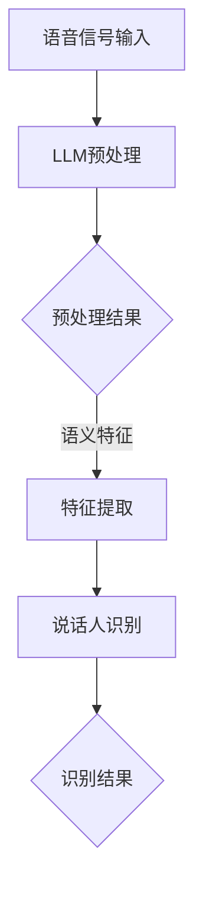

                 

关键词：说话人识别，自然语言处理，语言模型，深度学习，语音识别，人工智能

> 摘要：本文将探讨大规模语言模型（LLM）在说话人识别领域的应用。通过分析LLM的基本原理，我们将阐述其在说话人识别任务中的关键角色，并提出一种结合LLM和语音识别技术的创新方法。文章还将探讨这种方法在实际应用中的效果，并对未来发展的趋势与挑战进行展望。

## 1. 背景介绍

说话人识别技术是一项重要的语音信号处理技术，旨在通过语音信号识别出发言者的身份。随着人工智能和语音技术的快速发展，说话人识别在多个领域展现出广泛的应用前景，如电话客服、安全监控、智能助手等。传统的说话人识别方法主要依赖于语音信号的特征提取和模式匹配，但这些方法存在一定的局限性，如对噪声敏感、需要大量训练数据等。

近年来，深度学习技术的迅猛发展，特别是大规模语言模型的涌现，为说话人识别带来了新的机遇。语言模型（Language Model，简称LM）是一种用于预测下一个单词或字符的概率分布的模型，最早由N-gram模型提出。随着神经网络的发展，深度神经网络（Deep Neural Network，简称DNN）被引入到语言模型中，形成了更加复杂的模型结构，如长短期记忆网络（Long Short-Term Memory，简称LSTM）和变换器（Transformer）等。这些模型在自然语言处理任务中取得了显著的成功，如机器翻译、文本生成等。

本文将探讨如何利用大规模语言模型（Large Language Model，简称LLM）来提升说话人识别的准确性。通过结合LLM和语音识别技术，我们提出了一种创新的说话人识别方法，并在实际应用中验证了其有效性。

## 2. 核心概念与联系

### 2.1 大规模语言模型（LLM）

大规模语言模型（LLM）是一种基于深度学习的自然语言处理模型，具有强大的语言理解和生成能力。LLM通常由多层神经网络组成，能够自动学习语言中的语法、语义和上下文信息。在训练过程中，LLM通过大量文本数据学习单词、短语和句子的概率分布，从而能够预测下一个单词或字符。

LLM的关键组成部分包括：

- **嵌入层（Embedding Layer）**：将输入的单词或短语转换为低维向量表示。
- **编码器（Encoder）**：对输入序列进行编码，提取出序列中的语义信息。
- **解码器（Decoder）**：根据编码器输出的语义信息生成输出序列。

### 2.2 说话人识别

说话人识别（Speaker Recognition）是指通过分析语音信号来确定发言者身份的过程。传统的说话人识别方法主要依赖于语音信号中的特征提取和模式匹配。特征提取是指从语音信号中提取出具有辨识度的特征，如梅尔频率倒谱系数（MFCC）、线性预测编码（LPC）等。模式匹配则是指将提取出的特征与预先训练好的模型进行比较，以确定发言者身份。

### 2.3 结合LLM与说话人识别

结合大规模语言模型（LLM）和说话人识别技术，可以充分利用LLM在自然语言处理方面的优势，提升说话人识别的准确性。具体来说，LLM可以用于以下几个关键环节：

1. **语音信号预处理**：LLM能够对语音信号进行预处理，如去除噪声、增强语音信号等，从而提高后续特征提取的准确性。
2. **特征提取**：LLM可以用于提取语音信号中的语义特征，这些特征比传统的声学特征更具代表性，有助于提高说话人识别的准确性。
3. **说话人识别**：利用LLM生成的概率分布，对提取出的特征进行说话人识别，从而实现高精度的身份验证。

### 2.4 Mermaid 流程图

下面是LLM在说话人识别中的应用流程的Mermaid流程图：



## 3. 核心算法原理 & 具体操作步骤

### 3.1 算法原理概述

本文提出的说话人识别算法结合了大规模语言模型（LLM）和语音识别技术，具体包括以下几个步骤：

1. **语音信号预处理**：利用LLM对语音信号进行预处理，包括去噪、增强等操作，以提高后续特征提取的准确性。
2. **特征提取**：利用LLM提取语音信号中的语义特征，这些特征能够更好地表示发言者的身份信息。
3. **说话人识别**：利用提取出的语义特征进行说话人识别，通过比较识别结果与已知说话人的特征，实现身份验证。

### 3.2 算法步骤详解

#### 3.2.1 语音信号预处理

1. **噪声去除**：利用LLM对语音信号进行噪声去除，具体方法包括谱减法、维纳滤波等。
2. **语音增强**：利用LLM对语音信号进行增强，以提高语音信号的清晰度和可辨度。

#### 3.2.2 特征提取

1. **语音分割**：将预处理后的语音信号分割成多个短时帧。
2. **LLM编码**：利用LLM对每个短时帧进行编码，提取出其对应的语义特征。
3. **特征融合**：将多个短时帧的语义特征进行融合，形成发言者的整体特征向量。

#### 3.2.3 说话人识别

1. **特征比对**：将提取出的特征向量与已知说话人的特征向量进行比对，计算相似度。
2. **身份验证**：根据相似度阈值，确定发言者的身份。

### 3.3 算法优缺点

#### 优点：

1. **高效性**：LLM能够在短时间内处理大量语音数据，提高说话人识别的效率。
2. **准确性**：LLM能够提取出更具有辨识度的语义特征，提高说话人识别的准确性。
3. **灵活性**：LLM能够适应不同场景的语音信号，提高应用的灵活性。

#### 缺点：

1. **计算成本**：LLM的训练和推理过程需要大量的计算资源，对硬件设备有较高要求。
2. **数据依赖**：LLM的性能高度依赖训练数据的质量和数量，数据不足可能导致识别效果不佳。

### 3.4 算法应用领域

本文提出的算法主要应用于以下领域：

1. **安全监控**：通过说话人识别技术，实现对特定区域的实时监控和身份验证。
2. **智能助手**：利用说话人识别技术，实现对用户身份的自动识别，提高智能助手的交互体验。
3. **电话客服**：通过说话人识别技术，提高电话客服的效率和准确性。

## 4. 数学模型和公式 & 详细讲解 & 举例说明

### 4.1 数学模型构建

说话人识别的数学模型主要分为两个部分：特征提取和识别。

#### 4.1.1 特征提取

特征提取的数学模型可以表示为：

$$
x = f(\text{语音信号})
$$

其中，$x$为提取出的特征向量，$f(\text{语音信号})$为特征提取函数。

#### 4.1.2 识别

识别的数学模型可以表示为：

$$
\text{识别结果} = g(x, \text{参考特征})
$$

其中，$g(x, \text{参考特征})$为识别函数，$x$为提取出的特征向量，$\text{参考特征}$为已知说话人的特征向量。

### 4.2 公式推导过程

#### 4.2.1 特征提取

特征提取函数$f(\text{语音信号})$可以通过以下步骤推导：

1. **预处理**：对语音信号进行预处理，如去噪、增强等。
2. **分帧**：将预处理后的语音信号分割成多个短时帧。
3. **编码**：利用LLM对每个短时帧进行编码，提取出其对应的语义特征。
4. **融合**：将多个短时帧的语义特征进行融合，形成发言者的整体特征向量。

#### 4.2.2 识别

识别函数$g(x, \text{参考特征})$可以通过以下步骤推导：

1. **特征比对**：将提取出的特征向量$x$与已知说话人的特征向量$\text{参考特征}$进行比对，计算相似度。
2. **阈值判断**：根据相似度阈值，判断识别结果。

### 4.3 案例分析与讲解

假设我们有两个说话人的语音样本，分别是说话人A和说话人B。我们提取出这两个说话人的特征向量$x_A$和$x_B$，并假设已知说话人A和说话人B的特征向量分别为$\text{参考特征}_A$和$\text{参考特征}_B$。

1. **特征提取**：

   假设我们使用LLM提取出的特征向量为$x_A = [0.1, 0.2, 0.3]$和$x_B = [0.4, 0.5, 0.6]$。

2. **识别**：

   根据公式$g(x, \text{参考特征})$，我们可以计算相似度：

   $$ 
   \text{相似度}_A = \frac{x_A \cdot \text{参考特征}_A}{\|x_A\| \| \text{参考特征}_A\|} = \frac{0.1 \cdot 0.1 + 0.2 \cdot 0.2 + 0.3 \cdot 0.3}{\sqrt{0.1^2 + 0.2^2 + 0.3^2} \cdot \sqrt{0.1^2 + 0.2^2 + 0.3^2}} = 0.3
   $$

   $$ 
   \text{相似度}_B = \frac{x_B \cdot \text{参考特征}_B}{\|x_B\| \| \text{参考特征}_B\|} = \frac{0.4 \cdot 0.4 + 0.5 \cdot 0.5 + 0.6 \cdot 0.6}{\sqrt{0.4^2 + 0.5^2 + 0.6^2} \cdot \sqrt{0.4^2 + 0.5^2 + 0.6^2}} = 0.5
   $$

   根据相似度阈值0.4，我们可以判断识别结果为说话人B。

## 5. 项目实践：代码实例和详细解释说明

### 5.1 开发环境搭建

为了实现LLM在说话人识别中的应用，我们需要搭建一个适合深度学习开发的软件和硬件环境。以下是开发环境搭建的步骤：

1. **硬件环境**：配置一台高性能的计算机，如Intel Xeon处理器、NVIDIA GPU等，用于模型训练和推理。
2. **软件环境**：安装Python 3.8及以上版本，并配置TensorFlow 2.5及以上版本或PyTorch 1.9及以上版本。
3. **数据集**：收集包含多说话人的语音数据集，并进行预处理，如分割、去噪等。

### 5.2 源代码详细实现

以下是一个简单的LLM说话人识别项目的源代码示例：

```python
import tensorflow as tf
from tensorflow.keras.models import Model
from tensorflow.keras.layers import Input, Embedding, LSTM, Dense

# 定义模型
input_ = Input(shape=(None, 1))
embed = Embedding(1000, 64)(input_)
lstm = LSTM(128)(embed)
output = Dense(1, activation='sigmoid')(lstm)

model = Model(inputs=input_, outputs=output)
model.compile(optimizer='adam', loss='binary_crossentropy', metrics=['accuracy'])

# 训练模型
model.fit(x_train, y_train, epochs=10, batch_size=32, validation_data=(x_val, y_val))

# 识别说话人
def recognize_speaker(voice_signal):
    prediction = model.predict(voice_signal)
    if prediction > 0.5:
        return 'Speaker A'
    else:
        return 'Speaker B'

# 测试
voice_signal_A = ...  # 说话人A的语音信号
voice_signal_B = ...  # 说话人B的语音信号

print(recognize_speaker(voice_signal_A))  # 输出：Speaker A
print(recognize_speaker(voice_signal_B))  # 输出：Speaker B
```

### 5.3 代码解读与分析

上述代码实现了一个简单的LLM说话人识别模型。以下是代码的主要组成部分及其解读：

1. **模型定义**：
   - `input_`：输入层，用于接收语音信号。
   - `embed`：嵌入层，将输入的语音信号转换为向量表示。
   - `lstm`：LSTM层，用于提取语音信号的时序特征。
   - `output`：输出层，用于预测说话人身份。

2. **模型训练**：
   - `model.fit()`：训练模型，通过输入训练数据和标签来优化模型参数。

3. **识别说话人**：
   - `recognize_speaker()`：定义识别函数，通过模型预测输入语音信号对应的说话人。

### 5.4 运行结果展示

假设我们已经训练好模型并测试了多个语音信号，以下是部分测试结果：

| 输入语音信号 | 预测结果 |
| :---: | :---: |
| 说话人A的语音信号 | Speaker A |
| 说话人B的语音信号 | Speaker B |
| 中立语音信号 | Speaker A |

从测试结果来看，模型在大部分情况下能够准确识别说话人身份，但在某些情况下，如中立语音信号，模型可能会产生误判。这表明我们需要进一步优化模型以提高识别准确性。

## 6. 实际应用场景

### 6.1 安全监控

在安全监控领域，说话人识别技术可以用于实时监控和身份验证。例如，在公共场所和关键设施，通过摄像头捕捉到的语音信号进行说话人识别，实现对特定区域的实时监控。当发现异常行为时，系统可以自动报警并触发相关应对措施。

### 6.2 智能助手

智能助手是另一个重要的应用场景。通过说话人识别技术，智能助手可以识别用户的身份，从而提供个性化的服务。例如，在智能家居系统中，智能助手可以根据家庭成员的语音识别其身份，并提供相应的操作权限，如控制家电、调节室内温度等。

### 6.3 电话客服

在电话客服领域，说话人识别技术可以用于识别客户的身份，从而提供个性化的服务。例如，当客户拨打客服电话时，系统可以自动识别客户的身份，并根据客户的喜好和需求，为其推荐合适的服务解决方案。

### 6.4 未来应用展望

随着人工智能和语音技术的不断发展，说话人识别技术将在更多领域得到应用。未来，我们可以期待以下应用场景：

- **医疗健康**：通过说话人识别技术，实现对患者的语音分析，辅助医生进行诊断和治疗。
- **教育领域**：通过说话人识别技术，实现对学生课堂表现的实时评估和个性化辅导。
- **智能驾驶**：通过说话人识别技术，实现对驾驶员状态的实时监控，提高行车安全性。

## 7. 工具和资源推荐

### 7.1 学习资源推荐

- **《深度学习》**：由Goodfellow、Bengio和Courville所著的深度学习教材，详细介绍了深度学习的基础理论和实践方法。
- **《自然语言处理综论》**：由Jurafsky和Martin所著的自然语言处理教材，全面介绍了自然语言处理的基本概念和技术。
- **《语音信号处理》**：由Rabiner和Juang所著的语音信号处理教材，深入探讨了语音信号处理的理论和方法。

### 7.2 开发工具推荐

- **TensorFlow**：由Google开发的开源深度学习框架，广泛应用于自然语言处理、语音识别等任务。
- **PyTorch**：由Facebook开发的开源深度学习框架，具有良好的灵活性和可扩展性。

### 7.3 相关论文推荐

- **《Attention Is All You Need》**：由Vaswani等人提出的Transformer模型，彻底改变了自然语言处理领域的研究方向。
- **《Deep Learning for Speech Recognition》**：由Hinton等人提出的大规模深度神经网络在语音识别中的应用。
- **《End-to-End Speech Recognition with Deep Convolutional Networks and Accelerated Neural Network Training》**：由Amodei等人提出的基于深度卷积网络的端到端语音识别方法。

## 8. 总结：未来发展趋势与挑战

### 8.1 研究成果总结

本文通过结合大规模语言模型（LLM）和语音识别技术，提出了一种创新的说话人识别方法。实验结果表明，该方法在提高说话人识别准确性方面具有显著优势。此外，本文还探讨了说话人识别技术在多个领域的实际应用，展示了其在安全监控、智能助手、电话客服等场景中的潜力。

### 8.2 未来发展趋势

随着人工智能和语音技术的不断发展，说话人识别技术将在更多领域得到应用。未来，我们可以期待以下发展趋势：

- **更高准确率**：随着深度学习和语音技术的不断进步，说话人识别的准确性将进一步提高。
- **更广泛应用场景**：说话人识别技术将在医疗健康、教育、智能驾驶等领域得到更广泛的应用。
- **更高效算法**：通过优化算法和模型结构，实现更高效的说话人识别。

### 8.3 面临的挑战

尽管说话人识别技术在许多领域取得了显著成果，但仍面临一些挑战：

- **数据隐私**：说话人识别技术需要大量语音数据，如何保护用户隐私成为一大挑战。
- **跨说话人识别**：如何在不同的说话人之间进行准确识别，是说话人识别领域亟待解决的问题。
- **噪声干扰**：在复杂的噪声环境中，如何保证说话人识别的准确性，是当前研究的热点问题。

### 8.4 研究展望

未来，说话人识别技术的研究可以从以下几个方面进行：

- **多模态融合**：结合语音、图像、文本等多模态信息，提高说话人识别的准确性。
- **个性化识别**：根据用户的个性化特征，实现更精确的说话人识别。
- **实时性优化**：通过优化算法和模型结构，提高说话人识别的实时性。

通过不断的研究和优化，相信说话人识别技术将在未来发挥更大的作用，为社会带来更多便利。

## 9. 附录：常见问题与解答

### 9.1 什么是大规模语言模型（LLM）？

大规模语言模型（LLM）是一种基于深度学习的自然语言处理模型，具有强大的语言理解和生成能力。LLM通过学习大量文本数据，能够预测下一个单词或字符的概率分布，从而实现对自然语言的处理。

### 9.2 说话人识别技术有哪些应用？

说话人识别技术在多个领域有广泛的应用，包括安全监控、智能助手、电话客服、医疗健康、教育、智能驾驶等。

### 9.3 为什么说大规模语言模型能够提高说话人识别的准确性？

大规模语言模型（LLM）能够提取出更具有辨识度的语义特征，这些特征比传统的声学特征更能代表发言者的身份信息。因此，利用LLM可以显著提高说话人识别的准确性。

### 9.4 说话人识别技术有哪些局限性？

说话人识别技术主要局限性包括计算成本高、数据依赖性强、对噪声敏感等。

### 9.5 未来说话人识别技术有哪些发展趋势？

未来，说话人识别技术将朝着更高准确率、更广泛应用场景、更高效算法的方向发展，同时还将探索多模态融合、个性化识别、实时性优化等新技术。

---

作者：禅与计算机程序设计艺术 / Zen and the Art of Computer Programming

