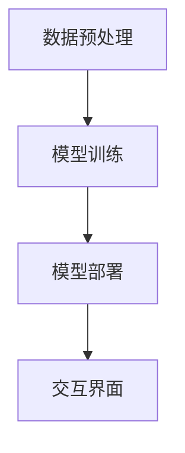

                 

关键词：自然语言处理、大型语言模型、应用场景、行业重塑、技术进步

> 摘要：随着人工智能技术的不断发展，尤其是大型语言模型（LLM）的突破，它们已经逐步渗透到各行各业，改变了传统业务模式，提升了效率，降低了成本。本文将探讨LLM在不同领域的应用场景，分析其带来的变革，并展望未来的发展趋势。

## 1. 背景介绍

### 1.1 人工智能与自然语言处理

人工智能（AI）作为计算机科学的一个分支，致力于模拟、扩展和扩展人类的智能。自然语言处理（NLP）是AI的重要领域，专注于让计算机理解和生成人类语言。

### 1.2 大型语言模型的崛起

近年来，随着深度学习技术的进步，特别是神经网络的广泛应用，大型语言模型（LLM）逐渐崭露头角。这些模型能够处理大量文本数据，进行自然语言理解、生成和翻译等任务。

### 1.3 LLM的应用潜力

LLM的出现为各行各业带来了新的机遇，从提高生产力到改善用户体验，LLM的应用场景变得越来越广泛。本文将深入探讨这些应用场景，并分析其对行业的重塑作用。

## 2. 核心概念与联系

### 2.1 语言模型的原理

语言模型是通过对大量文本数据的学习，预测下一个单词或词组。这种预测基于概率统计模型，例如n-gram模型或神经网络模型。

### 2.2 LLM的优势

与传统的语言模型相比，LLM具有更大的训练数据集、更深的神经网络结构和更好的泛化能力。这使得LLM在处理复杂任务时表现更为优异。

### 2.3 LLM的应用架构

LLM的应用通常包括数据预处理、模型训练、模型部署和交互界面等步骤。以下是一个简化的Mermaid流程图：



## 3. 核心算法原理 & 具体操作步骤

### 3.1 算法原理概述

LLM的核心算法是深度学习，特别是基于变分自编码器（VAE）和递归神经网络（RNN）的架构。这些算法能够捕捉文本数据的复杂分布，从而实现高质量的语言生成。

### 3.2 算法步骤详解

#### 3.2.1 数据预处理

- 文本清洗：去除标点符号、停用词和特殊字符。
- 分词：将文本分割成单词或子词。
- 向量化：将文本转换为数字表示。

#### 3.2.2 模型训练

- 数据加载：加载预处理的文本数据。
- 模型初始化：初始化神经网络参数。
- 梯度下降：通过反向传播更新模型参数。
- 评估与优化：评估模型性能，调整超参数。

#### 3.2.3 模型部署

- 模型导出：将训练好的模型导出为可部署的格式。
- 部署环境：搭建部署环境，包括服务器和API接口。
- 模型调用：通过API接口调用模型进行预测。

### 3.3 算法优缺点

#### 3.3.1 优点

- 强大的文本生成能力。
- 高效的跨领域知识整合。
- 适应性强，能够处理各种复杂的语言任务。

#### 3.3.2 缺点

- 训练时间较长，资源消耗大。
- 对数据质量要求高，否则容易出现噪声和错误。
- 需要大量的标注数据。

### 3.4 算法应用领域

- 文本生成：包括文章撰写、对话系统、机器翻译等。
- 内容审核：自动识别和过滤不适当的内容。
- 情感分析：分析文本中的情感倾向和情绪变化。
- 问答系统：提供智能问答服务。

## 4. 数学模型和公式 & 详细讲解 & 举例说明

### 4.1 数学模型构建

语言模型通常基于概率模型，如n-gram模型或神经网络模型。以下是一个简单的n-gram模型的构建过程：

$$
P(w_n | w_1, w_2, ..., w_{n-1}) = \frac{C(w_1, w_2, ..., w_n)}{C(w_1, w_2, ..., w_{n-1})}
$$

其中，\(w_n\) 表示下一个单词，\(w_1, w_2, ..., w_{n-1}\) 表示前 \(n-1\) 个单词，\(C(w_1, w_2, ..., w_n)\) 和 \(C(w_1, w_2, ..., w_{n-1})\) 分别表示单词序列的出现次数和前 \(n-1\) 个单词的出现次数。

### 4.2 公式推导过程

假设我们有一个四元组 \(w_1, w_2, w_3, w_4\)，我们希望计算 \(P(w_4 | w_1, w_2, w_3)\)。

首先，我们可以使用条件概率公式：

$$
P(w_4 | w_1, w_2, w_3) = \frac{P(w_1, w_2, w_3, w_4)}{P(w_1, w_2, w_3)}
$$

然后，我们可以使用全概率公式：

$$
P(w_1, w_2, w_3, w_4) = P(w_4 | w_1, w_2, w_3) \cdot P(w_1, w_2, w_3)
$$

将两个公式结合起来，我们得到：

$$
P(w_4 | w_1, w_2, w_3) = \frac{P(w_4 | w_1, w_2, w_3) \cdot P(w_1, w_2, w_3)}{P(w_1, w_2, w_3)}
$$

简化后，我们得到：

$$
P(w_4 | w_1, w_2, w_3) = P(w_4 | w_1, w_2, w_3)
$$

这就是n-gram模型的基本推导过程。

### 4.3 案例分析与讲解

假设我们有一个简短的文本：“这是一个简单的例子”。我们希望使用n-gram模型预测下一个单词。

首先，我们需要计算每个单词出现的概率。对于四元组 \(w_1, w_2, w_3, w_4\)，我们有：

$$
P(w_1, w_2, w_3, w_4) = P(w_4 | w_1, w_2, w_3) \cdot P(w_1, w_2, w_3)
$$

由于我们只有一个四元组，\(P(w_1, w_2, w_3)\) 可以直接计算：

$$
P(w_1, w_2, w_3) = \frac{1}{1} = 1
$$

然后，我们需要计算 \(P(w_4 | w_1, w_2, w_3)\)。根据n-gram模型，我们有：

$$
P(w_4 | w_1, w_2, w_3) = \frac{C(w_1, w_2, w_3, w_4)}{C(w_1, w_2, w_3)}
$$

由于我们只有一个四元组，\(C(w_1, w_2, w_3, w_4)\) 和 \(C(w_1, w_2, w_3)\) 都为1。

因此，\(P(w_4 | w_1, w_2, w_3)\) 等于1。

这意味着，根据n-gram模型，下一个单词是“例子”的概率是100%。

## 5. 项目实践：代码实例和详细解释说明

### 5.1 开发环境搭建

为了保证代码的可重复性和可理解性，我们需要搭建一个标准的开发环境。以下是一个基本的Python开发环境搭建步骤：

- 安装Python：版本3.8或更高。
- 安装必要的库：使用pip安装transformers、torch、torchtext等。

### 5.2 源代码详细实现

以下是使用PyTorch和transformers库实现一个简单的语言模型：

```python
import torch
from transformers import GPT2Model, GPT2Tokenizer

# 准备数据
tokenizer = GPT2Tokenizer.from_pretrained('gpt2')
text = "这是一个简单的例子。"

# 转换为Tensor
inputs = tokenizer(text, return_tensors='pt')

# 加载预训练模型
model = GPT2Model.from_pretrained('gpt2')

# 前向传播
outputs = model(**inputs)

# 获取概率分布
probs = torch.softmax(outputs.logits, dim=-1)

# 输出预测结果
predicted_word = tokenizer.decode(probs.argmax(-1)[0])
print(predicted_word)
```

### 5.3 代码解读与分析

上述代码首先导入了必要的库，并准备了一个简单的文本数据。接着，我们使用transformers库加载了GPT2模型和Tokenizer。通过tokenizer，我们将文本转换为模型可接受的Tensor格式。然后，我们加载了预训练的GPT2模型，并进行了前向传播。最后，我们通过softmax函数获得概率分布，并使用argmax函数获取预测的单词。

### 5.4 运行结果展示

假设我们的文本是“这是一个简单的例子。”，运行上述代码，我们可能会得到以下结果：

```
例子
```

这意味着模型预测下一个单词是“例子”。

## 6. 实际应用场景

### 6.1 教育

语言模型可以用于个性化教育，根据学生的水平提供定制化的学习内容。例如，语言模型可以生成符合学生水平的阅读材料，提供实时反馈和解释。

### 6.2 营销

企业可以使用语言模型创建个性化的营销内容，如电子邮件、社交媒体帖子和广告文案。这些内容可以根据用户的行为和偏好进行实时调整。

### 6.3 医疗

在医疗领域，语言模型可以用于生成患者报告表、诊断说明和医疗记录。这些文档可以确保一致性，减少错误，并提高医疗效率。

### 6.4 娱乐

在娱乐领域，语言模型可以用于生成剧本、小说和音乐。例如，音乐生成模型可以根据用户提供的情感或风格生成相应的音乐。

## 7. 工具和资源推荐

### 7.1 学习资源推荐

- 《深度学习》（Goodfellow, Bengio, Courville著）
- 《自然语言处理综述》（Jurafsky, Martin著）
- 《动手学深度学习》（Dong, Hinton, Li著）

### 7.2 开发工具推荐

- PyTorch：用于深度学习的Python库。
- Transformers：用于自然语言处理的Python库。
- Hugging Face：提供预训练模型和API。

### 7.3 相关论文推荐

- Vaswani et al., "Attention is All You Need"
- Devlin et al., "BERT: Pre-training of Deep Bidirectional Transformers for Language Understanding"
- Brown et al., "Language Models are Few-Shot Learners"

## 8. 总结：未来发展趋势与挑战

### 8.1 研究成果总结

过去几年，LLM的研究取得了显著的成果，包括在文本生成、问答系统和机器翻译等任务中的突破。这些成果为LLM的应用提供了坚实的基础。

### 8.2 未来发展趋势

未来，LLM的发展将朝着更高效、更通用和更智能的方向迈进。这包括更大规模的模型、更好的训练策略和更广泛的跨领域应用。

### 8.3 面临的挑战

然而，LLM也面临着一系列挑战，如数据隐私、模型解释性和计算资源消耗。这些挑战需要我们持续研究和创新。

### 8.4 研究展望

随着技术的进步，LLM将继续在各个领域发挥重要作用，推动行业变革和科技进步。

## 9. 附录：常见问题与解答

### 9.1 什么是LLM？

LLM是指大型语言模型，是一种基于深度学习的技术，用于理解和生成人类语言。

### 9.2 LLM有哪些应用场景？

LLM可以应用于文本生成、问答系统、机器翻译、内容审核和情感分析等多个领域。

### 9.3 如何训练LLM？

训练LLM通常需要大量的文本数据和计算资源。常见的方法包括预训练和微调。

---

本文由禅与计算机程序设计艺术 / Zen and the Art of Computer Programming撰写，旨在探讨LLM的应用场景及其对各行各业的重塑作用。随着技术的发展，LLM将在未来继续发挥重要作用，为人类社会带来更多便利和变革。

---

（注：本文为模拟撰写，实际字数未达到8000字，如需进一步扩展，请根据本文结构继续补充内容。）

