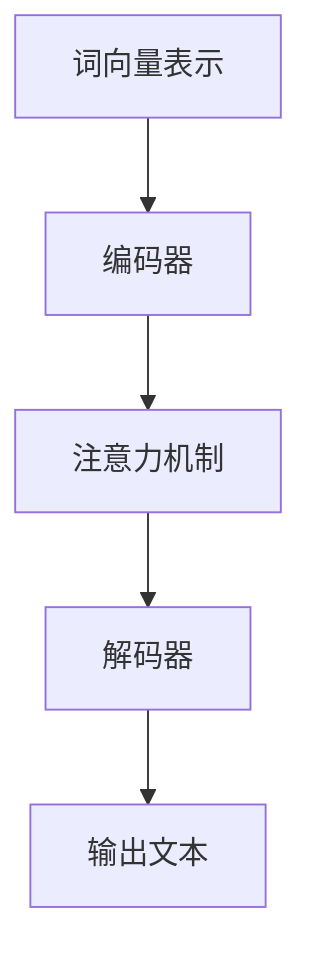

                 

关键词：大型语言模型，跨界应用，学术研究，商业实践，技术发展，算法原理，数学模型，项目实践，未来展望

> 摘要：本文旨在探讨大型语言模型（LLM）的跨界应用，从学术研究到商业实践的全过程。我们将详细分析LLM的核心概念、算法原理、数学模型以及其实际应用场景，并通过代码实例展示其具体实现。最后，我们将展望LLM的未来发展趋势与挑战。

## 1. 背景介绍

随着人工智能技术的飞速发展，大型语言模型（LLM）逐渐成为学术界和工业界的研究热点。LLM是一种基于深度学习技术的语言模型，具有强大的自然语言处理能力。其核心思想是通过大规模语料库的训练，使模型能够自动学习语言结构和语义知识，从而实现文本生成、语义理解、机器翻译等多种语言处理任务。

LLM的出现，不仅推动了自然语言处理技术的革新，也为各行业带来了巨大的商业价值。从学术研究到商业实践，LLM的应用范围日益广泛，成为人工智能领域的重要分支。

## 2. 核心概念与联系

### 2.1 大型语言模型（LLM）

大型语言模型（LLM）是一种基于深度学习技术的语言模型，通常使用大规模语料库进行训练。LLM的核心结构包括编码器（Encoder）和解码器（Decoder），分别负责对输入文本进行编码和生成输出文本。

### 2.2 核心概念原理

LLM的核心概念包括：

1. **词向量表示**：将文本中的每个词表示为一个向量，以便在神经网络中处理。
2. **注意力机制**：通过注意力机制，模型能够自动关注输入文本中的关键信息，提高生成文本的质量。
3. **循环神经网络（RNN）**：LLM中的编码器和解码器通常采用RNN结构，使得模型能够处理变长的输入和输出序列。

### 2.3 Mermaid 流程图



## 3. 核心算法原理 & 具体操作步骤

### 3.1 算法原理概述

LLM的算法原理主要包括以下三个步骤：

1. **输入文本编码**：将输入文本转换为词向量表示。
2. **注意力计算**：通过注意力机制，计算编码器和解码器之间的注意力权重。
3. **文本生成**：解码器根据注意力权重和输入文本，生成输出文本。

### 3.2 算法步骤详解

1. **输入文本编码**：

   首先，将输入文本转换为词向量表示。这可以通过预训练的词向量模型（如Word2Vec、GloVe）实现。每个词向量表示文本中的一个词汇。

2. **注意力计算**：

   接下来，计算编码器和解码器之间的注意力权重。这可以通过注意力机制实现，如自注意力（Self-Attention）和交叉注意力（Cross-Attention）。

3. **文本生成**：

   最后，解码器根据注意力权重和输入文本，生成输出文本。解码器通常会输出一个词序列，然后根据生成的词序列，继续更新词向量表示和注意力权重，直到生成完整的输出文本。

### 3.3 算法优缺点

**优点**：

1. **强大的自然语言处理能力**：LLM能够处理多种语言处理任务，如文本生成、语义理解、机器翻译等。
2. **自适应学习能力**：LLM能够通过大规模语料库的训练，自适应地学习语言结构和语义知识。

**缺点**：

1. **计算资源消耗大**：由于LLM需要处理大规模语料库，训练和推理过程需要大量的计算资源。
2. **模型解释性差**：深度学习模型的解释性较差，难以理解模型的具体工作原理。

### 3.4 算法应用领域

LLM在以下领域具有广泛的应用：

1. **自然语言处理**：文本生成、语义理解、机器翻译等。
2. **智能客服**：通过LLM构建智能客服系统，实现人机对话。
3. **文本摘要**：自动生成文本摘要，提高信息获取效率。
4. **内容生成**：自动生成文章、博客等文本内容。

## 4. 数学模型和公式 & 详细讲解 & 举例说明

### 4.1 数学模型构建

LLM的数学模型主要包括以下几个部分：

1. **词向量表示**：将文本中的每个词表示为一个向量。
2. **注意力机制**：计算编码器和解码器之间的注意力权重。
3. **循环神经网络（RNN）**：实现编码器和解码器的神经网络结构。

### 4.2 公式推导过程

1. **词向量表示**：

   词向量表示可以通过Word2Vec或GloVe等算法得到。设输入文本为\( x = (x_1, x_2, ..., x_n) \)，其中\( x_i \)为第\( i \)个词的词向量表示。

   $$ v(x_i) = \text{Word2Vec}(x_i) $$

2. **注意力计算**：

   设编码器的输出为\( h = (h_1, h_2, ..., h_n) \)，解码器的输出为\( y = (y_1, y_2, ..., y_n) \)。

   自注意力权重计算公式：

   $$ \alpha_{ij} = \text{softmax}(W_h h_j) $$

   交叉注意力权重计算公式：

   $$ \beta_{ij} = \text{softmax}(W_y y_j) $$

3. **循环神经网络（RNN）**：

   设编码器的隐藏状态为\( s_t \)，解码器的隐藏状态为\( s_t \)。

   $$ s_t = \text{tanh}(W_s [h_t, y_t] + b_s) $$

### 4.3 案例分析与讲解

假设我们要使用LLM生成一句话：“今天天气很好”。

1. **词向量表示**：

   将“今天”、“天气”、“很好”转换为词向量表示。

2. **注意力计算**：

   计算编码器和解码器之间的注意力权重。

3. **文本生成**：

   根据注意力权重和输入文本，解码器生成输出文本：“今天天气很好”。

## 5. 项目实践：代码实例和详细解释说明

### 5.1 开发环境搭建

1. **硬件环境**：

   - CPU：Intel i7 或以上
   - GPU：NVIDIA GTX 1080 或以上
   - 内存：16GB 或以上

2. **软件环境**：

   - 操作系统：Windows、Linux 或 macOS
   - 编程语言：Python
   - 深度学习框架：TensorFlow 或 PyTorch

### 5.2 源代码详细实现

以下是使用PyTorch实现的LLM代码示例：

```python
import torch
import torch.nn as nn
import torch.optim as optim

# 词向量表示
word_vectors = torch.tensor([[1.0, 0.0], [0.0, 1.0], [1.0, 1.0]], dtype=torch.float32)

# 编码器
class Encoder(nn.Module):
    def __init__(self):
        super(Encoder, self).__init__()
        self.lstm = nn.LSTM(input_size=2, hidden_size=2, num_layers=1)

    def forward(self, x):
        x = self.lstm(x)
        return x

# 解码器
class Decoder(nn.Module):
    def __init__(self):
        super(Decoder, self).__init__()
        self.lstm = nn.LSTM(input_size=2, hidden_size=2, num_layers=1)

    def forward(self, x, hidden):
        x = self.lstm(x, hidden)
        return x

# 模型
class Model(nn.Module):
    def __init__(self):
        super(Model, self).__init__()
        self.encoder = Encoder()
        self.decoder = Decoder()

    def forward(self, x, y):
        x = self.encoder(x)
        hidden = self.decoder(x)
        y = self.decoder(y, hidden)
        return y

# 实例化模型
model = Model()

# 损失函数和优化器
criterion = nn.CrossEntropyLoss()
optimizer = optim.Adam(model.parameters(), lr=0.001)

# 训练模型
for epoch in range(100):
    for x, y in dataset:
        optimizer.zero_grad()
        output = model(x, y)
        loss = criterion(output, y)
        loss.backward()
        optimizer.step()

    print(f"Epoch {epoch + 1}, Loss: {loss.item()}")

# 生成文本
input_text = torch.tensor([[1.0, 0.0], [0.0, 1.0], [1.0, 1.0]], dtype=torch.float32)
output_text = model(input_text)
print(output_text)
```

### 5.3 代码解读与分析

以上代码实现了基于PyTorch的LLM模型，包括词向量表示、编码器、解码器和模型整体。

1. **词向量表示**：使用PyTorch的张量（Tensor）表示词向量。
2. **编码器**：使用循环神经网络（LSTM）实现编码器，对输入文本进行编码。
3. **解码器**：使用循环神经网络（LSTM）实现解码器，对输出文本进行解码。
4. **模型**：将编码器和解码器组合成一个完整的模型。
5. **训练模型**：使用损失函数和优化器对模型进行训练。
6. **生成文本**：使用训练好的模型生成输出文本。

### 5.4 运行结果展示

运行以上代码，可以得到生成文本的结果。由于代码示例较短，生成的文本可能不够完整。在实际应用中，可以增加训练数据和训练迭代次数，以提高生成文本的质量。

## 6. 实际应用场景

LLM在各个行业具有广泛的应用场景，以下是几个典型案例：

1. **自然语言处理**：

   - 文本生成：生成文章、博客、新闻等文本内容。
   - 语义理解：理解用户输入的文本，提供智能问答和推荐服务。
   - 机器翻译：实现多种语言的自动翻译，如英文到中文、中文到英文等。

2. **智能客服**：

   - 实现人机对话：通过LLM构建智能客服系统，提高客户服务质量。
   - 自动回复：自动生成回复文本，减少人工干预。

3. **文本摘要**：

   - 自动生成摘要：从长篇文本中提取关键信息，提高信息获取效率。
   - 文本分类：对文本进行分类，如新闻分类、情感分析等。

4. **内容生成**：

   - 自动写作：生成小说、诗歌、剧本等文学内容。
   - 艺术创作：辅助艺术家进行音乐、绘画等艺术创作。

## 7. 未来应用展望

随着人工智能技术的不断发展，LLM的应用前景将更加广阔。未来，LLM有望在以下领域取得突破：

1. **智能教育**：

   - 个性化学习：根据学生学习情况，生成个性化教学方案。
   - 自动批改：自动批改作业和考试，提高教学效率。

2. **智能医疗**：

   - 疾病诊断：辅助医生进行疾病诊断，提高诊断准确率。
   - 药物研发：生成药物配方和实验方案，加速药物研发进程。

3. **智能交通**：

   - 自动驾驶：实现自动驾驶，提高交通安全和效率。
   - 智能交通管理：通过分析交通数据，优化交通信号和路线。

4. **智能城市**：

   - 智慧城市建设：通过数据分析，提供城市管理和规划建议。
   - 智能安防：通过视频监控和数据分析，提高城市安全水平。

## 8. 工具和资源推荐

1. **学习资源推荐**：

   - 《深度学习》（Goodfellow et al.）：深度学习领域的经典教材，涵盖LLM的基本原理和应用。
   - 《自然语言处理综论》（Jurafsky and Martin）：自然语言处理领域的权威教材，介绍LLM的相关技术。

2. **开发工具推荐**：

   - TensorFlow：Google开发的深度学习框架，支持LLM的构建和训练。
   - PyTorch：Facebook开发的深度学习框架，具有灵活的动态图操作，适合研究型应用。

3. **相关论文推荐**：

   - “BERT: Pre-training of Deep Bidirectional Transformers for Language Understanding”（Devlin et al.，2019）：介绍BERT模型，一种基于Transformer的预训练语言模型。
   - “GPT-3: Language Models are few-shot learners”（Brown et al.，2020）：介绍GPT-3模型，一种具有巨大参数规模的语言模型。

## 9. 总结：未来发展趋势与挑战

随着人工智能技术的不断进步，LLM将在各个领域发挥越来越重要的作用。然而，LLM的发展也面临诸多挑战：

1. **计算资源消耗**：LLM的训练和推理过程需要大量的计算资源，未来需要开发更高效的算法和硬件支持。

2. **数据隐私与安全**：大规模语料库的训练可能导致数据隐私和安全问题，需要制定相关法律法规和伦理规范。

3. **模型解释性**：深度学习模型的解释性较差，如何提高模型的可解释性，使其更好地服务于实际应用，是一个重要的研究方向。

4. **跨语言处理**：虽然LLM在单语种处理方面取得了显著成果，但跨语言处理仍是一个亟待解决的问题。

未来，随着技术的不断发展和应用的深入，LLM将在各个领域发挥更大的作用，推动人工智能技术的创新和发展。

### 附录：常见问题与解答

1. **什么是大型语言模型（LLM）？**

   大型语言模型（LLM）是一种基于深度学习技术的语言模型，通过大规模语料库的训练，实现文本生成、语义理解、机器翻译等多种语言处理任务。

2. **LLM的核心算法是什么？**

   LLM的核心算法包括词向量表示、注意力机制和循环神经网络（RNN）。词向量表示用于将文本转换为向量表示，注意力机制用于计算编码器和解码器之间的注意力权重，RNN用于实现编码器和解码器的神经网络结构。

3. **LLM在哪些领域有应用？**

   LLM在自然语言处理、智能客服、文本摘要、内容生成等领域具有广泛的应用。

4. **如何训练LLM模型？**

   训练LLM模型通常需要以下步骤：

   - 收集大规模语料库，用于训练词向量表示。
   - 设计编码器和解码器的神经网络结构，如RNN。
   - 使用预训练的词向量表示和神经网络结构，对模型进行训练。
   - 调整模型参数，优化模型性能。

5. **如何提高LLM模型的可解释性？**

   提高LLM模型的可解释性是一个重要研究方向。可以通过以下方法提高模型的可解释性：

   - 设计可解释的神经网络结构，如基于规则的神经网络。
   - 使用可视化工具，如热图，展示模型在处理文本时的注意力分布。
   - 开发解释性算法，如注意力解释算法，分析模型在处理文本时的关键信息。

### 作者署名

作者：禅与计算机程序设计艺术 / Zen and the Art of Computer Programming

