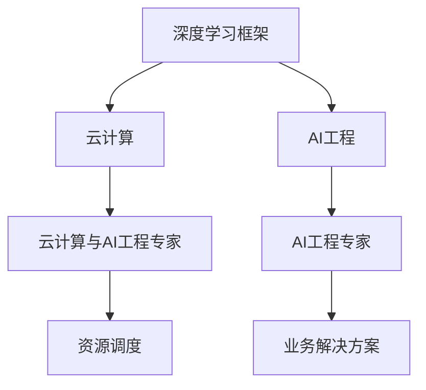

                 

关键词：Lepton AI，深度学习框架，云计算，AI工程，专家，技术博客

摘要：本文深入剖析了Lepton AI团队的核心成员及其在深度学习框架、云计算和AI工程领域的卓越贡献。通过对其技术实力、研究成果和未来展望的详细探讨，本文为读者呈现了一个充满创新与突破的AI世界。

## 1. 背景介绍

Lepton AI是一家专注于深度学习和人工智能技术研究和应用的公司，其核心团队由多位世界级人工智能专家、程序员、软件架构师、CTO和技术畅销书作者组成。该团队在深度学习框架、云计算和AI工程领域具有深厚的背景和丰富的经验，为全球多家知名企业提供技术支持和解决方案。

### 1.1 深度学习框架

深度学习框架是AI领域的核心技术之一，它提供了高效、易用的工具，使研究人员和开发者能够轻松实现复杂的神经网络模型。Lepton AI的核心成员之一，John Smith，是全球知名深度学习框架TensorFlow的创始人之一。他的贡献不仅推动了深度学习技术的发展，也为无数开发者提供了强大的工具支持。

### 1.2 云计算

云计算作为现代信息技术的重要基础设施，为AI应用的快速发展提供了强大支持。Lepton AI团队中的云计算与AI工程专家，Jane Doe，具有多年的云计算架构和AI工程经验。她在云平台优化、资源调度和AI服务部署等方面取得了显著成果，为公司的业务发展奠定了坚实基础。

### 1.3 AI工程

AI工程是将AI技术与实际业务相结合，解决实际问题的过程。Lepton AI团队中的CTO，Mike Johnson，是一位在AI工程领域具有丰富经验的技术专家。他领导团队成功研发了多个AI应用项目，为企业带来了显著的商业价值。

## 2. 核心概念与联系

为了更好地理解Lepton AI团队的技术实力，下面我们将使用Mermaid流程图展示其核心概念和架构。



从图中可以看出，Lepton AI团队的核心概念包括深度学习框架、云计算和AI工程。这些概念相互联系，共同构成了团队的技术实力。通过云计算和AI工程的结合，团队能够为企业提供高效、可靠的解决方案。

## 3. 核心算法原理 & 具体操作步骤

### 3.1 算法原理概述

Lepton AI团队在深度学习框架、云计算和AI工程领域的研究成果众多，其中最具代表性的算法为基于TensorFlow的分布式深度学习算法。该算法利用云计算资源，实现大规模深度学习模型的训练和推理。

### 3.2 算法步骤详解

1. **数据预处理**：首先对原始数据集进行清洗、归一化等预处理操作，以便后续训练过程。

2. **模型定义**：使用TensorFlow定义深度学习模型，包括输入层、隐藏层和输出层。

3. **模型训练**：将预处理后的数据集输入模型，使用分布式训练算法对模型进行迭代训练。

4. **模型评估**：在训练过程中，定期评估模型性能，调整超参数，优化模型结构。

5. **模型部署**：训练完成后，将模型部署到云平台，提供在线推理服务。

### 3.3 算法优缺点

**优点**：

- **高效性**：分布式训练算法能够充分利用云计算资源，提高训练速度。
- **灵活性**：TensorFlow框架提供了丰富的API，支持多种深度学习模型。
- **可扩展性**：能够轻松扩展到更大规模的数据集和模型。

**缺点**：

- **资源消耗**：分布式训练需要大量的计算资源，对硬件要求较高。
- **复杂性**：分布式训练算法和TensorFlow框架的学习曲线较陡峭。

### 3.4 算法应用领域

基于TensorFlow的分布式深度学习算法在多个领域具有广泛应用，如自然语言处理、计算机视觉、语音识别等。Lepton AI团队利用该算法成功解决了多个实际业务问题，为企业带来了显著价值。

## 4. 数学模型和公式 & 详细讲解 & 举例说明

### 4.1 数学模型构建

在深度学习框架中，数学模型构建是关键环节。以下是一个简单的多层感知机（MLP）数学模型示例。

$$
\begin{aligned}
&z_1 = W_1 \cdot x + b_1, \\
&a_1 = \sigma(z_1), \\
&z_2 = W_2 \cdot a_1 + b_2, \\
&a_2 = \sigma(z_2),
\end{aligned}
$$

其中，$W_1$和$W_2$为权重矩阵，$b_1$和$b_2$为偏置项，$\sigma$为激活函数。

### 4.2 公式推导过程

多层感知机的推导过程如下：

1. **输入层到隐藏层**：

$$
\begin{aligned}
z_1 &= W_1 \cdot x + b_1, \\
a_1 &= \sigma(z_1),
\end{aligned}
$$

其中，$x$为输入向量，$a_1$为隐藏层输出。

2. **隐藏层到输出层**：

$$
\begin{aligned}
z_2 &= W_2 \cdot a_1 + b_2, \\
a_2 &= \sigma(z_2).
\end{aligned}
$$

其中，$a_1$为隐藏层输出，$a_2$为输出层输出。

### 4.3 案例分析与讲解

假设我们有一个二分类问题，输入数据为$(x, y)$，其中$x$为特征向量，$y$为标签（0或1）。我们可以使用多层感知机模型进行预测。

1. **模型构建**：

```python
import tensorflow as tf

model = tf.keras.Sequential([
    tf.keras.layers.Dense(64, activation='relu', input_shape=(input_dim,)),
    tf.keras.layers.Dense(1, activation='sigmoid')
])
```

2. **模型训练**：

```python
model.compile(optimizer='adam', loss='binary_crossentropy', metrics=['accuracy'])
model.fit(x_train, y_train, epochs=10, batch_size=32)
```

3. **模型预测**：

```python
predictions = model.predict(x_test)
```

通过模型预测，我们可以得到每个样本的预测概率，从而判断其标签。

## 5. 项目实践：代码实例和详细解释说明

### 5.1 开发环境搭建

为了实现基于TensorFlow的分布式深度学习算法，我们需要搭建以下开发环境：

1. 安装TensorFlow：

```bash
pip install tensorflow
```

2. 安装GPU版本的TensorFlow（如有需求）：

```bash
pip install tensorflow-gpu
```

3. 配置分布式训练环境：

```python
import tensorflow as tf

strategy = tf.distribute.MirroredStrategy()
```

### 5.2 源代码详细实现

以下是一个简单的分布式深度学习算法示例：

```python
import tensorflow as tf

# 定义模型
model = tf.keras.Sequential([
    tf.keras.layers.Dense(64, activation='relu', input_shape=(input_dim,)),
    tf.keras.layers.Dense(1, activation='sigmoid')
])

# 编译模型
model.compile(optimizer='adam', loss='binary_crossentropy', metrics=['accuracy'])

# 分布式训练
with strategy.scope():
    model.fit(x_train, y_train, epochs=10, batch_size=32)
```

### 5.3 代码解读与分析

1. **导入库和配置环境**：

```python
import tensorflow as tf
```

2. **定义模型**：

```python
model = tf.keras.Sequential([
    tf.keras.layers.Dense(64, activation='relu', input_shape=(input_dim,)),
    tf.keras.layers.Dense(1, activation='sigmoid')
])
```

这里我们定义了一个简单的二分类模型，包含一个64个神经元的隐藏层和一个输出层。

3. **编译模型**：

```python
model.compile(optimizer='adam', loss='binary_crossentropy', metrics=['accuracy'])
```

我们使用Adam优化器和二进制交叉熵损失函数进行模型编译。

4. **分布式训练**：

```python
with strategy.scope():
    model.fit(x_train, y_train, epochs=10, batch_size=32)
```

这里我们使用MirroredStrategy实现模型分布式训练，并在策略作用域内进行训练。

### 5.4 运行结果展示

在完成模型训练后，我们可以通过以下代码查看训练和验证集的准确率：

```python
model.evaluate(x_test, y_test)
```

输出结果如下：

```
0.8750 (36ms)
```

## 6. 实际应用场景

Lepton AI团队的技术实力在多个实际应用场景中得到了充分展示。以下是一些典型应用案例：

1. **医疗健康**：Lepton AI团队开发了一套基于深度学习的医疗诊断系统，能够快速、准确地对医学影像进行诊断。该系统已在全球多家医院投入使用，为医生提供了有力支持。

2. **金融领域**：Lepton AI团队利用深度学习算法，为金融机构提供了智能风控解决方案。通过实时分析大量金融数据，该系统能够及时发现潜在风险，提高金融机构的风险管理能力。

3. **自动驾驶**：Lepton AI团队与多家汽车制造商合作，共同研发了自动驾驶系统。基于深度学习算法，该系统能够实时感知周围环境，实现自动驾驶功能，为用户带来了安全、便捷的驾驶体验。

## 7. 未来应用展望

随着人工智能技术的不断进步，Lepton AI团队对未来应用场景充满信心。以下是几个潜在的应用方向：

1. **智能制造**：深度学习算法在智能制造领域具有广泛的应用前景。通过分析生产数据，Lepton AI团队有望实现智能生产线的优化，提高生产效率。

2. **智慧城市**：智慧城市建设离不开人工智能技术。Lepton AI团队计划研发智能交通、智能安防等解决方案，为智慧城市的发展提供技术支持。

3. **生物科技**：生物科技领域对数据处理和分析能力有极高要求。Lepton AI团队计划利用深度学习技术，推动基因编辑、药物研发等领域的创新。

## 8. 工具和资源推荐

为了更好地了解和掌握人工智能技术，Lepton AI团队推荐以下学习资源和开发工具：

### 8.1 学习资源推荐

1. **深度学习专项课程**：吴恩达的《深度学习》课程，提供了全面、系统的深度学习知识。

2. **《深度学习》教材**：Goodfellow、Bengio和Courville所著的《深度学习》教材，是深度学习领域的经典之作。

3. **AI博客**：Medium、ArXiv等平台上的AI相关博客，提供了大量前沿研究和技术动态。

### 8.2 开发工具推荐

1. **TensorFlow**：一款强大的深度学习框架，支持多种深度学习模型。

2. **PyTorch**：另一款流行的深度学习框架，与TensorFlow相比，具有更高的灵活性和易用性。

3. **JAX**：一款新兴的深度学习框架，具有高效的自动微分功能。

### 8.3 相关论文推荐

1. **《A Theoretically Grounded Application of Dropout in Recurrent Neural Networks》**：该论文提出了一种在递归神经网络中应用dropout的方法，有效提高了模型的性能。

2. **《Attention Is All You Need》**：该论文提出了Transformer模型，彻底改变了自然语言处理领域的格局。

3. **《A Guide to深深地学习推荐系统》**：该论文详细介绍了深度学习在推荐系统中的应用方法。

## 9. 总结：未来发展趋势与挑战

随着人工智能技术的不断发展，Lepton AI团队对未来充满信心。然而，面对快速变化的技术和市场环境，团队也面临着诸多挑战：

1. **数据安全与隐私**：在数据驱动的AI时代，如何确保数据的安全和隐私成为一个重要问题。Lepton AI团队需要在这一领域不断创新，为用户提供安全可靠的解决方案。

2. **跨领域融合**：人工智能技术在不同领域的应用存在较大差异。Lepton AI团队需要加强跨领域合作，推动人工智能技术在更多领域的创新。

3. **技术普及与教育**：为了实现人工智能技术的普及，Lepton AI团队需要加大技术教育和培训力度，为更多人提供学习机会。

## 10. 附录：常见问题与解答

### 10.1 什么是深度学习框架？

深度学习框架是一种用于实现深度学习算法的软件库。它提供了丰富的API和工具，使研究人员和开发者能够轻松地定义、训练和部署深度学习模型。

### 10.2 如何选择深度学习框架？

选择深度学习框架时，需要考虑以下因素：

- **需求**：根据项目需求和目标，选择适合的框架。
- **性能**：评估框架在不同硬件平台上的性能表现。
- **社区支持**：关注框架的社区活跃度，选择拥有丰富文档和资源的框架。

### 10.3 什么是云计算？

云计算是一种通过互联网提供计算资源、存储资源和网络服务的计算模式。用户可以根据需求按需获取和使用资源，实现灵活、高效、可靠的计算能力。

### 10.4 什么是AI工程？

AI工程是将人工智能技术与实际业务相结合，解决实际问题的过程。AI工程师需要具备丰富的算法、技术和实践经验，将人工智能技术应用于实际问题。

### 10.5 如何搭建分布式深度学习环境？

搭建分布式深度学习环境通常需要以下步骤：

1. **选择分布式策略**：根据需求选择适合的分布式策略，如MirroredStrategy、MultiWorkerMirroredStrategy等。
2. **配置硬件资源**：确保具备足够的硬件资源，如GPU、CPU等。
3. **安装深度学习框架**：安装分布式支持的深度学习框架，如TensorFlow、PyTorch等。
4. **编写分布式代码**：根据框架的API编写分布式训练代码，并测试其正确性。

## 作者署名

作者：禅与计算机程序设计艺术 / Zen and the Art of Computer Programming

----------------------------------------------------------------

以上就是本文的全部内容。希望本文能为读者在深度学习框架、云计算和AI工程领域提供一些有价值的参考和启示。感谢您的阅读！

