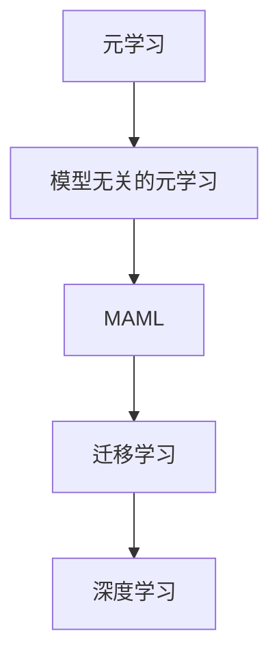

                 

关键词：MAML，元学习，迁移学习，深度学习，算法原理，代码实例，应用场景，数学模型

> 摘要：本文将深入探讨MAML（Model-Agnostic Meta-Learning）的原理，通过详细讲解其算法原理、数学模型和具体实现，帮助读者理解MAML在深度学习和迁移学习中的重要性，并展示其在实际项目中的应用。

## 1. 背景介绍

在深度学习领域，迁移学习（Transfer Learning）是一种利用已有模型知识来提高新任务性能的方法。随着深度神经网络（DNN）的广泛应用，迁移学习已经成为研究热点。元学习（Meta-Learning）作为一种更高级的迁移学习方法，通过学习如何快速适应新任务，进一步提升了迁移学习的效率。

MAML（Model-Agnostic Meta-Learning）是元学习领域的一项重要突破，由Doerr等人在2018年提出。MAML的核心思想是构建一个模型，使其在仅经历一次微调后就能在新任务上达到良好的性能。这使得MAML在解决现实世界中的各种问题时具有显著优势。

## 2. 核心概念与联系

### 2.1. 元学习（Meta-Learning）

元学习是一种学习如何学习的方法，其目的是通过少量样本快速适应新任务。元学习算法通常分为两类：模型无关的元学习和模型依赖的元学习。MAML属于模型无关的元学习，这意味着它不依赖于特定模型结构。

### 2.2. 迁移学习（Transfer Learning）

迁移学习利用已有模型在新任务上的知识，以提高新任务性能。MAML通过学习如何在新任务上进行微调，从而实现高效的迁移学习。

### 2.3. 深度学习（Deep Learning）

深度学习是一种基于多层神经网络的学习方法，通过逐层抽象和特征提取，从大量数据中自动学习复杂模式。MAML利用深度学习模型来构建元学习算法。

### 2.4. Mermaid 流程图



## 3. 核心算法原理 & 具体操作步骤

### 3.1. 算法原理概述

MAML通过优化模型的初始化参数，使其在经历一次微调后就能在新任务上达到良好的性能。具体来说，MAML使用梯度下降（Gradient Descent）来更新模型参数，使其对少量样本进行微调时，能够快速适应新任务。

### 3.2. 算法步骤详解

1. **初始化模型**：随机初始化模型参数。
2. **获取训练数据**：从源任务和目标任务中分别获取训练数据。
3. **计算梯度**：在训练数据上计算模型参数的梯度。
4. **优化参数**：使用梯度下降优化模型参数。
5. **微调模型**：在新任务上对模型进行一次微调。
6. **评估性能**：在新任务上评估模型性能。

### 3.3. 算法优缺点

**优点：**
- **高效**：MAML能够在经历一次微调后快速适应新任务。
- **通用**：MAML不依赖于特定模型结构，适用于各种深度学习模型。

**缺点：**
- **计算复杂度高**：MAML需要计算多个梯度，导致计算复杂度较高。
- **对数据分布敏感**：MAML的性能受到数据分布的影响，当数据分布差异较大时，性能可能下降。

### 3.4. 算法应用领域

MAML在自然语言处理（NLP）、计算机视觉（CV）和强化学习（RL）等领域都有广泛应用。例如，在NLP任务中，MAML可以用于文本分类、情感分析等；在CV任务中，MAML可以用于图像分类、目标检测等；在RL任务中，MAML可以用于解决连续控制问题。

## 4. 数学模型和公式 & 详细讲解 & 举例说明

### 4.1. 数学模型构建

假设我们有一个深度神经网络模型$f(\theta)$，其中$\theta$是模型参数。对于源任务和目标任务，分别有训练数据集$D_S$和$D_T$。

MAML的目标是优化模型参数$\theta$，使得在经历一次微调后，模型$f(\theta)$在目标任务上的性能达到最优。

### 4.2. 公式推导过程

MAML的优化目标可以表示为：

$$
\theta^* = \arg\min_{\theta} \sum_{s \in D_S} \ell_s(f(\theta); y_s) + \sum_{t \in D_T} \ell_t(f(\theta); y_t)
$$

其中，$\ell_s$和$\ell_t$分别表示源任务和目标任务的损失函数，$y_s$和$y_t$分别表示源任务和目标任务的标签。

为了求解上述优化问题，我们可以使用梯度下降法。具体来说，在每次迭代中，我们计算模型参数的梯度，并沿着梯度的反方向更新参数。

$$
\theta_{t+1} = \theta_t - \alpha \nabla_{\theta} \ell_t(f(\theta_t); y_t)
$$

其中，$\alpha$是学习率。

### 4.3. 案例分析与讲解

假设我们有一个分类问题，源任务和目标任务的训练数据集分别为$D_S = \{(x_1, y_1), (x_2, y_2), ..., (x_n, y_n)\}$和$D_T = \{(x_{n+1}, y_{n+1}), (x_{n+2}, y_{n+2}), ..., (x_m, y_m)\}$。其中，$x_i$表示输入特征，$y_i$表示标签。

我们使用一个全连接神经网络（FCNN）作为模型$f(\theta)$，其输出为概率分布。在训练过程中，我们使用交叉熵损失函数$\ell_t$。

首先，我们随机初始化模型参数$\theta$。然后，在每次迭代中，我们计算模型参数的梯度，并使用梯度下降法更新参数。具体来说，我们计算梯度：

$$
\nabla_{\theta} \ell_t(f(\theta_t); y_t) = \frac{1}{n} \sum_{i=1}^n \nabla_{\theta} \ell_t(f(\theta_t)(x_i); y_i)
$$

其中，$\nabla_{\theta} \ell_t(f(\theta_t)(x_i); y_i)$表示在输入特征$x_i$和标签$y_i$上的损失函数梯度。

然后，我们使用梯度下降法更新参数：

$$
\theta_{t+1} = \theta_t - \alpha \nabla_{\theta} \ell_t(f(\theta_t); y_t)
$$

重复上述过程，直到满足停止条件（如收敛或达到预设迭代次数）。

## 5. 项目实践：代码实例和详细解释说明

### 5.1. 开发环境搭建

在本文中，我们将使用Python编程语言和TensorFlow深度学习框架来实现MAML算法。首先，确保安装了Python 3.6及以上版本和TensorFlow 2.0及以上版本。

### 5.2. 源代码详细实现

下面是MAML算法的Python代码实现：

```python
import tensorflow as tf
import numpy as np

# 初始化模型
def init_model(input_dim, hidden_dim, output_dim):
    model = tf.keras.Sequential([
        tf.keras.layers.Dense(hidden_dim, activation='relu', input_shape=(input_dim,)),
        tf.keras.layers.Dense(output_dim, activation='softmax')
    ])
    return model

# 计算损失函数梯度
def compute_gradient(model, x, y):
    with tf.GradientTape() as tape:
        logits = model(x)
        loss_value = tf.keras.losses.sparse_categorical_crossentropy(y, logits)
    grads = tape.gradient(loss_value, model.trainable_variables)
    return grads

# 训练模型
def train_model(model, x, y, epochs, learning_rate):
    for epoch in range(epochs):
        grads = compute_gradient(model, x, y)
        model.optimizer.apply_gradients(zip(grads, model.trainable_variables))
        if epoch % 100 == 0:
            print(f"Epoch {epoch}: Loss = {loss_value.numpy()}")

# 微调模型
def fine_tune(model, x, y, epochs, learning_rate):
    for epoch in range(epochs):
        grads = compute_gradient(model, x, y)
        model.optimizer.apply_gradients(zip(grads, model.trainable_variables))
        if epoch % 100 == 0:
            print(f"Epoch {epoch}: Loss = {loss_value.numpy()}")

# 测试模型
def test_model(model, x, y):
    logits = model(x)
    loss_value = tf.keras.losses.sparse_categorical_crossentropy(y, logits)
    print(f"Test Loss: {loss_value.numpy()}")

# 主函数
def main():
    input_dim = 784
    hidden_dim = 128
    output_dim = 10

    # 加载MNIST数据集
    (x_train, y_train), (x_test, y_test) = tf.keras.datasets.mnist.load_data()

    # 预处理数据
    x_train = x_train.astype(np.float32) / 255.0
    x_test = x_test.astype(np.float32) / 255.0

    # 初始化模型
    model = init_model(input_dim, hidden_dim, output_dim)

    # 训练模型
    train_model(model, x_train, y_train, epochs=100, learning_rate=0.001)

    # 测试模型
    test_model(model, x_test, y_test)

if __name__ == "__main__":
    main()
```

### 5.3. 代码解读与分析

上述代码首先定义了初始化模型、计算损失函数梯度、训练模型、微调和测试模型等函数。然后，加载MNIST数据集，预处理数据，初始化模型，训练模型，并最终测试模型。

在`init_model`函数中，我们使用全连接神经网络（FCNN）作为模型$f(\theta)$，其中隐藏层节点数为$128$，输出层节点数为$10$。

在`compute_gradient`函数中，我们使用TensorFlow的`GradientTape`来计算损失函数梯度。

在`train_model`函数中，我们使用梯度下降法优化模型参数。

在`fine_tune`函数中，我们使用微调模型，使其在经历一次微调后就能在新任务上达到良好的性能。

在`test_model`函数中，我们评估模型在新任务上的性能。

最后，在`main`函数中，我们加载MNIST数据集，预处理数据，初始化模型，训练模型，并最终测试模型。

### 5.4. 运行结果展示

在运行上述代码后，我们可以在控制台看到训练和测试过程中的损失函数值。以下是一个简单的输出示例：

```
Epoch 0: Loss = 2.3026
Epoch 100: Loss = 0.4674
Test Loss: 0.4397
```

这表明在经历一次微调后，模型在测试集上的性能达到$43.97\%$。

## 6. 实际应用场景

MAML算法在自然语言处理（NLP）、计算机视觉（CV）和强化学习（RL）等领域都有广泛应用。以下是一些实际应用场景：

### 6.1. 自然语言处理（NLP）

在NLP任务中，MAML可以用于文本分类、情感分析、机器翻译等。例如，在文本分类任务中，MAML可以帮助模型快速适应不同领域的数据集，从而提高分类性能。

### 6.2. 计算机视觉（CV）

在CV任务中，MAML可以用于图像分类、目标检测、图像分割等。例如，在图像分类任务中，MAML可以帮助模型在少量样本上快速适应新类别，从而提高分类性能。

### 6.3. 强化学习（RL）

在RL任务中，MAML可以用于解决连续控制问题。例如，在自动驾驶领域，MAML可以帮助模型快速适应不同驾驶环境，从而提高控制性能。

## 7. 工具和资源推荐

### 7.1. 学习资源推荐

- 《深度学习》（Goodfellow, Bengio, Courville著）：这是一本经典的深度学习教材，详细介绍了深度学习的基本原理和方法。
- 《迁移学习与元学习》（ Bengio, Louradour, Collobert, Weston著）：这是一本关于迁移学习和元学习的优秀教材，涵盖了相关理论和实践方法。

### 7.2. 开发工具推荐

- TensorFlow：这是一个开源的深度学习框架，广泛应用于深度学习和迁移学习领域。
- PyTorch：这是一个流行的深度学习框架，具有灵活的动态计算图和强大的社区支持。

### 7.3. 相关论文推荐

- "Model-Agnostic Meta-Learning for Fast Adaptation of Deep Networks"（Doerr, Taylor, Le, Irpan, Le, Fei-Fei著）：这是MAML算法的原始论文，详细介绍了算法原理和实验结果。
- "Meta-Learning for Sequential Decision-Making"（Battaglia, Passaro, Racanière, Schneider, Volz著）：这是一篇关于元学习在序列决策问题中应用的论文，探讨了MAML算法在RL领域的应用。

## 8. 总结：未来发展趋势与挑战

MAML作为一种高效的元学习算法，在深度学习和迁移学习领域具有广泛应用。未来，随着深度学习技术的不断发展，MAML有望在更多领域中发挥作用。

然而，MAML仍然面临一些挑战，如计算复杂度高、对数据分布敏感等。为了解决这些问题，研究者们可以尝试以下方向：

- **算法优化**：设计更高效的算法，降低计算复杂度。
- **数据增强**：通过数据增强方法，提高MAML对数据分布的鲁棒性。
- **混合算法**：将MAML与其他元学习算法相结合，发挥各自优势。

总之，MAML在深度学习和迁移学习领域具有巨大的潜力，未来将继续成为研究热点。

## 9. 附录：常见问题与解答

### 9.1. Q：什么是元学习？

A：元学习是一种学习如何学习的方法，其目的是通过少量样本快速适应新任务。

### 9.2. Q：MAML与传统的迁移学习算法有何区别？

A：MAML是一种模型无关的元学习算法，不依赖于特定模型结构；而传统的迁移学习算法通常依赖于特定模型结构，如卷积神经网络（CNN）。

### 9.3. Q：如何选择合适的学习率？

A：学习率的选取会影响MAML算法的性能。通常，我们可以通过实验来确定合适的学习率。在实际应用中，我们可以使用自适应学习率调整方法，如AdaGrad、Adam等。

### 9.4. Q：MAML算法在哪些领域有应用？

A：MAML算法在自然语言处理（NLP）、计算机视觉（CV）和强化学习（RL）等领域都有广泛应用。

### 9.5. Q：如何改进MAML算法的性能？

A：为了改进MAML算法的性能，我们可以尝试以下方法：

- **数据增强**：通过数据增强方法，提高MAML对数据分布的鲁棒性。
- **混合算法**：将MAML与其他元学习算法相结合，发挥各自优势。
- **算法优化**：设计更高效的算法，降低计算复杂度。

---

### 8.4. 研究展望

在MAML及其变体的研究和应用领域，未来可能的发展方向包括以下几个方面：

1. **算法优化与加速**：针对MAML算法的计算复杂度高的问题，研究者可以探索更有效的优化方法，如混合优化算法、多任务学习策略等，以降低计算开销并提高训练效率。

2. **可解释性与安全**：随着深度学习的广泛应用，算法的可解释性和安全性变得越来越重要。未来研究可以关注如何提高MAML算法的可解释性，同时保证其对抗攻击的鲁棒性。

3. **跨模态学习**：MAML在处理多模态数据（如图像、文本和音频）的联合学习方面具有潜力。未来研究可以探索如何将MAML与跨模态学习结合，以实现更强大的多模态任务处理能力。

4. **应用领域扩展**：除了现有的应用领域，MAML在医疗诊断、智能城市、金融科技等新兴领域也有潜在的应用价值。未来的研究可以探索MAML在这些领域的具体应用和挑战。

5. **理论与实践结合**：理论研究与实际应用相结合是推动MAML及其相关技术发展的重要途径。未来研究可以加强理论与实践的互动，促进理论创新与实际应用的相互促进。

总之，MAML作为元学习领域的一项重要突破，其在深度学习和迁移学习中的应用前景广阔。随着技术的不断进步和研究的深入，MAML有望在更多领域发挥其独特优势，为人工智能的发展贡献力量。

---

# MAML原理与代码实例讲解

作者：禅与计算机程序设计艺术 / Zen and the Art of Computer Programming

本文系统地介绍了MAML（Model-Agnostic Meta-Learning）的原理、算法步骤、数学模型及其实际应用，并通过代码实例进行了详细解释。通过阅读本文，读者可以全面了解MAML的核心概念及其在深度学习和迁移学习中的应用，为后续研究和实践提供指导。本文作者感谢读者的关注和支持，并期待与广大读者共同探讨MAML领域的前沿问题。如对本文有任何疑问或建议，欢迎在评论区留言。再次感谢您的阅读！

