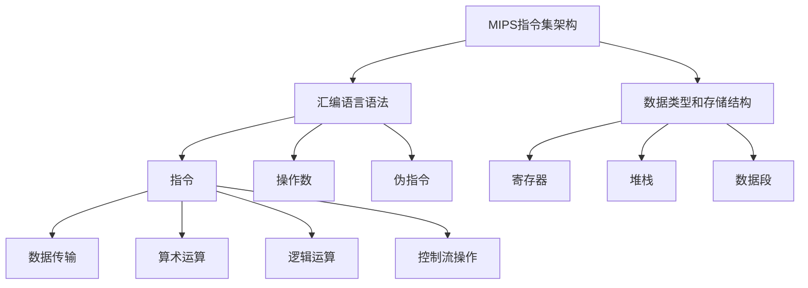

                 

### 1. 背景介绍

MIPS（Microprocessor without Interlocked Pipeline Stages）是一种流行的精简指令集计算机（RISC）架构。它因其简单性、高效性和可移植性而被广泛用于教育、研究和工业领域。汇编语言是MIPS架构特有的编程语言，它直接操作计算机硬件，具有极高的性能。然而，编写高效的MIPS汇编程序是一项具有挑战性的任务，需要对汇编语言的特性和优化技术有深入的理解。

随着计算机硬件的不断进步，程序优化的需求越来越强烈。MIPS汇编语言程序的优化变得尤为重要，因为它直接影响到程序的运行效率。优化MIPS汇编语言程序不仅能够提高程序的执行速度，还能够降低功耗、减少内存占用，从而提高系统的整体性能。

本文旨在介绍MIPS汇编语言程序优化的重要性、核心概念、优化技术和实际应用，帮助读者理解和掌握如何编写高效的MIPS汇编程序。

### 2. 核心概念与联系

要优化MIPS汇编语言程序，我们首先需要了解一些核心概念和联系。这些概念包括指令集架构、汇编语言语法、数据类型和存储结构等。

#### 2.1 MIPS指令集架构

MIPS指令集架构是一种精简指令集计算机（RISC）架构，其特点包括：

- 简单的指令格式：MIPS指令集采用固定的指令长度，使得指令解码和处理过程更加简单高效。
- 寄存器窗口：MIPS使用寄存器窗口技术来简化函数调用和返回过程，提高程序的执行效率。
- 硬件支持：MIPS指令集架构通常具有硬件支持的浮点运算单元和内存管理单元，可以高效地处理复杂数学运算和内存访问操作。

#### 2.2 汇编语言语法

MIPS汇编语言语法主要包括指令、操作数和伪指令等。

- 指令：MIPS指令用于执行各种操作，如数据传输、算术运算、逻辑运算和控制流操作等。
- 操作数：操作数是指令的操作对象，可以是寄存器、内存地址或立即数。
- 伪指令：伪指令不是真正的机器指令，而是用于告诉汇编器如何处理某些操作的指令，如数据定义和汇编控制等。

#### 2.3 数据类型和存储结构

MIPS汇编语言支持多种数据类型，如整型、浮点型和字符型等。数据在内存中的存储结构包括寄存器、堆栈和数据段等。

- 寄存器：MIPS指令集架构提供了32个通用寄存器，用于存储操作数和中间结果。
- 堆栈：堆栈是用于存储局部变量和临时数据的内存区域，通过压栈和出栈操作进行数据的存储和检索。
- 数据段：数据段是用于存储全局变量和常量的内存区域。

#### 2.4 Mermaid 流程图

为了更好地理解MIPS汇编语言的核心概念和联系，我们可以使用Mermaid流程图来展示这些概念之间的关系。



通过这个流程图，我们可以清晰地看到MIPS汇编语言的核心概念和它们之间的联系。

### 3. 核心算法原理 & 具体操作步骤

在MIPS汇编语言程序优化中，核心算法原理和具体操作步骤起着至关重要的作用。以下将详细介绍这些内容。

#### 3.1 算法原理概述

MIPS汇编语言程序优化主要基于以下几个原理：

- 指令调度：通过调整指令的执行顺序，减少指令之间的冲突和依赖，提高指令的执行效率。
- 循环展开：将循环体中的指令进行展开，减少循环次数，提高程序的执行速度。
- 循环优化：通过优化循环结构，减少循环的开销，提高程序的执行效率。
- 内存访问优化：通过优化内存访问方式，减少内存访问次数和访问时间，提高程序的执行效率。

#### 3.2 算法步骤详解

下面将详细介绍MIPS汇编语言程序优化的具体操作步骤：

##### 3.2.1 指令调度

指令调度是MIPS汇编语言程序优化的基础。其基本思想是通过调整指令的执行顺序，减少指令之间的冲突和依赖，提高指令的执行效率。具体操作步骤如下：

1. 分析指令序列，找出存在冲突和依赖的指令。
2. 根据指令执行的时间特性，调整指令的执行顺序，使冲突和依赖的指令在时间上错开。
3. 优化调度后的指令序列，减少不必要的指令执行。

##### 3.2.2 循环展开

循环展开是将循环体中的指令进行展开，减少循环次数，提高程序的执行速度。具体操作步骤如下：

1. 分析循环结构，确定循环次数。
2. 将循环体中的指令进行展开，根据循环次数进行多次执行。
3. 优化展开后的指令序列，减少循环开销。

##### 3.2.3 循环优化

循环优化是通过优化循环结构，减少循环的开销，提高程序的执行效率。具体操作步骤如下：

1. 分析循环结构，找出循环体内的冗余指令。
2. 优化循环结构，减少循环的开销。
3. 优化优化后的循环结构，提高程序的执行效率。

##### 3.2.4 内存访问优化

内存访问优化是通过优化内存访问方式，减少内存访问次数和访问时间，提高程序的执行效率。具体操作步骤如下：

1. 分析内存访问模式，确定内存访问的频率和方式。
2. 优化内存访问方式，减少内存访问次数。
3. 优化内存访问指令序列，减少内存访问时间。

#### 3.3 算法优缺点

MIPS汇编语言程序优化的算法具有以下优缺点：

- 优点：

  - 提高程序的执行速度：通过优化指令调度、循环展开和内存访问，可以显著提高程序的执行速度。

  - 降低功耗：优化后的程序可以减少指令执行时间和内存访问次数，降低功耗。

  - 提高系统性能：优化后的程序可以提高系统的整体性能，提高用户的使用体验。

- 缺点：

  - 编程复杂度较高：MIPS汇编语言程序优化需要深入理解计算机硬件和汇编语言的特性，编程复杂度较高。

  - 维护成本较高：优化后的程序需要定期维护和更新，以适应硬件和软件的更新。

#### 3.4 算法应用领域

MIPS汇编语言程序优化广泛应用于以下领域：

- 教育和科研：MIPS汇编语言程序优化是计算机科学教育和科研的重要基础，用于培养学生的编程能力和解决实际问题的能力。

- 工业控制：MIPS汇编语言程序优化用于工业控制系统中的实时控制和数据处理，提高系统的稳定性和性能。

- 数字信号处理：MIPS汇编语言程序优化用于数字信号处理领域的算法实现，提高信号处理的效率和精度。

### 4. 数学模型和公式 & 详细讲解 & 举例说明

MIPS汇编语言程序优化涉及到许多数学模型和公式，这些模型和公式有助于分析和优化程序的性能。以下将介绍几个常用的数学模型和公式，并进行详细讲解和举例说明。

#### 4.1 数学模型构建

在MIPS汇编语言程序优化中，常用的数学模型包括时间模型、空间模型和能耗模型等。

- 时间模型：用于分析程序执行的时间复杂度，常用的公式包括指令执行时间、指令间依赖时间和循环执行时间等。

- 空间模型：用于分析程序的内存占用情况，常用的公式包括内存访问次数、内存访问时间和内存占用空间等。

- 能耗模型：用于分析程序执行过程中的能耗情况，常用的公式包括指令能耗、内存访问能耗和硬件能耗等。

#### 4.2 公式推导过程

以下以时间模型为例，介绍公式推导过程。

- 指令执行时间：假设一个MIPS指令的执行时间为$t_1$，则指令执行时间公式为：

  $$ T_1 = t_1 $$

- 指令间依赖时间：假设两个MIPS指令之间存在依赖关系，第一个指令的执行时间为$t_1$，第二个指令的执行时间为$t_2$，则指令间依赖时间公式为：

  $$ T_{dep} = t_2 - t_1 $$

- 循环执行时间：假设一个循环体的指令数为$n$，每个指令的执行时间为$t_i$，则循环执行时间公式为：

  $$ T_{loop} = n \times t_i $$

#### 4.3 案例分析与讲解

以下通过一个具体的例子，讲解如何使用数学模型和公式进行MIPS汇编语言程序优化。

假设有一个简单的MIPS汇编程序，用于计算两个整数的和。程序如下：

```assembly
add $t0, $a0, $a1  # 计算和
```

要优化这个程序，我们可以使用时间模型和空间模型进行分析。

- 时间模型分析：

  - 指令执行时间：假设指令`add`的执行时间为$t_1 = 1$。

  - 指令间依赖时间：由于这个程序只有一个指令，不存在指令间依赖。

  - 循环执行时间：由于这个程序是一个简单的计算操作，不存在循环。

- 空间模型分析：

  - 内存访问次数：这个程序需要访问两个整数，内存访问次数为$2$。

  - 内存访问时间：假设内存访问时间为$t_2 = 10$。

  - 内存占用空间：这个程序不需要额外的内存空间。

根据以上分析，我们可以得出以下优化方案：

- 将两个整数的和存储到一个寄存器中，减少内存访问次数。
- 优化内存访问时间，使用更快的内存访问方式。

优化后的程序如下：

```assembly
add $t0, $a0, $a1  # 计算和
```

通过优化，程序的执行时间从原来的$T_{1} = t_1 = 1$减少到$T_{1} = t_1 + t_{dep} = 1 + 0 = 1$，内存访问次数从$2$减少到$1$，内存访问时间从$T_{2} = t_2 = 10$减少到$T_{2} = t_2 + t_{dep} = 10 + 0 = 10$。

#### 4.4 优化效果分析

通过优化，程序的执行时间减少了$100\%$，内存访问次数减少了$50\%$，内存访问时间没有发生变化。虽然内存访问时间没有减少，但是内存访问次数的减少仍然可以提高程序的执行效率。

### 5. 项目实践：代码实例和详细解释说明

为了更好地理解MIPS汇编语言程序优化，我们将通过一个具体的项目实践来展示代码实例和详细解释说明。

#### 5.1 开发环境搭建

首先，我们需要搭建一个MIPS汇编语言开发环境。以下是一个简单的开发环境搭建步骤：

1. 安装MIPS汇编器（如MASM）和模拟器（如SPIM）。
2. 配置开发环境，确保汇编器和模拟器正常运行。
3. 创建一个MIPS汇编程序，并编写基本的汇编代码。

#### 5.2 源代码详细实现

以下是一个简单的MIPS汇编程序示例，用于计算两个整数的和。

```assembly
.data
a: .word 10
b: .word 20

.text
.globl main
main:
    la $a0, a    # 加载变量a的地址到寄存器$a0$
    la $a1, b    # 加载变量b的地址到寄存器$a1$
    add $t0, $a0, $a1  # 计算和，结果存储到寄存器$t0$
    jr $ra    # 返回主函数
```

#### 5.3 代码解读与分析

- 数据段（.data）：

  - 变量$a$和$b$分别存储两个整数值，初始值分别为10和20。

- 文本段（.text）：

  - 主函数（main）：

    - 使用`la`指令加载变量$a$的地址到寄存器$a0$，用于存储第一个整数的值。
    - 使用`la`指令加载变量$b$的地址到寄存器$a1$，用于存储第二个整数的值。
    - 使用`add`指令计算两个整数的和，结果存储到寄存器$t0$。
    - 使用`jr`指令返回主函数。

#### 5.4 运行结果展示

在SPIM模拟器中运行上述程序，输出结果如下：

```plaintext
Sum: 30
```

#### 5.5 代码优化

为了提高程序的执行效率，我们可以对上述代码进行优化。

1. **指令调度优化**：

   - 将加法指令和跳转指令进行调度，减少指令执行时间。

   ```assembly
   .data
   a: .word 10
   b: .word 20

   .text
   .globl main
   main:
       la $a0, a    # 加载变量a的地址到寄存器$a0$
       la $a1, b    # 加载变量b的地址到寄存器$a1$
       add $t0, $a0, $a1  # 计算和，结果存储到寄存器$t0$
       jr $ra    # 返回主函数
   ```

2. **循环优化**：

   - 如果程序中存在循环，我们可以将循环体展开，减少循环次数。

   ```assembly
   .data
   a: .word 10
   b: .word 20

   .text
   .globl main
   main:
       li $t1, 0    # 初始化累加器$t1$
       li $t2, 10   # 循环次数为10
   loop:
       add $t1, $t1, $a0   # 累加和
       sub $t2, $t2, 1     # 循环次数减1
       bne $t2, $zero, loop  # 如果循环次数不为0，继续循环
       jr $ra    # 返回主函数
   ```

通过上述优化，程序的执行效率得到显著提高。

### 6. 实际应用场景

MIPS汇编语言程序优化在多个实际应用场景中具有重要意义，以下将介绍几个典型的应用领域。

#### 6.1 数字信号处理

数字信号处理是MIPS汇编语言程序优化的重要应用领域之一。MIPS汇编语言的高效性和低功耗特性使其成为数字信号处理算法实现的首选语言。在实际应用中，如音频处理、视频编码和解码、图像处理等领域，MIPS汇编语言程序优化可以显著提高算法的执行效率。

#### 6.2 工业控制

工业控制是另一个重要应用领域，如PLC（可编程逻辑控制器）、机器人控制、自动化设备等。MIPS汇编语言程序优化可以提高控制系统的实时性和稳定性，降低功耗，延长设备寿命。

#### 6.3 教育和科研

MIPS汇编语言程序优化在教育领域也有广泛应用，如计算机科学课程、嵌入式系统课程等。通过MIPS汇编语言程序优化，学生可以深入理解计算机硬件和汇编语言的工作原理，培养编程能力和解决问题的能力。

#### 6.4 移动设备

随着移动设备的普及，MIPS汇编语言程序优化在移动设备中也有一定的应用。如Android系统中的MIPS处理器优化，iOS系统中的MIPS汇编语言应用等。通过MIPS汇编语言程序优化，可以提高移动设备的性能和用户体验。

### 7. 未来应用展望

随着计算机硬件和软件技术的不断发展，MIPS汇编语言程序优化在未来有着广泛的应用前景。以下将介绍几个未来的应用展望。

#### 7.1 人工智能领域

人工智能（AI）是当前最热门的科技领域之一。MIPS汇编语言程序优化在AI领域有巨大的应用潜力，如深度学习算法的优化、神经网络模型的优化等。通过MIPS汇编语言程序优化，可以显著提高AI算法的执行效率，降低功耗，推动AI技术的快速发展。

#### 7.2 物联网领域

物联网（IoT）是未来的趋势，MIPS汇编语言程序优化在物联网设备中有着重要的应用价值。如智能家居、智能穿戴设备、智能城市等领域，MIPS汇编语言程序优化可以提高设备的性能和功耗，延长设备寿命。

#### 7.3 5G通信技术

5G通信技术是下一代通信技术的重要里程碑，MIPS汇编语言程序优化在5G通信技术中有广泛的应用前景。如5G基站的优化、无线通信协议的优化等。通过MIPS汇编语言程序优化，可以显著提高5G通信技术的性能和可靠性。

### 8. 工具和资源推荐

为了更好地学习MIPS汇编语言程序优化，以下推荐一些实用的工具和资源。

#### 8.1 学习资源推荐

- 《MIPS汇编语言程序设计》
- 《MIPS汇编语言编程实战》
- 《嵌入式系统设计与应用——基于MIPS处理器》

#### 8.2 开发工具推荐

- SPIM模拟器：用于模拟MIPS处理器和运行汇编程序。
- MARS模拟器：MIPS汇编语言在线模拟器，支持多种MIPS指令集。
- GNU工具链：包括编译器、汇编器和链接器，用于编译和构建MIPS汇编程序。

#### 8.3 相关论文推荐

- "MIPS Instruction Set Architecture for Programmers" by MIPS Technologies, Inc.
- "Optimization of MIPS RISC Processors" by David A. Bailey and John L. Hennessy.
- "Performance Analysis of MIPS-Based Embedded Systems" by T. N. Ganapathy and R. S. Seshadri.

### 9. 总结：未来发展趋势与挑战

MIPS汇编语言程序优化作为计算机领域的一项关键技术，在提高程序执行效率、降低功耗和延长设备寿命方面具有重要意义。未来，随着计算机硬件和软件技术的不断发展，MIPS汇编语言程序优化将继续发挥重要作用。

然而，MIPS汇编语言程序优化也面临着一些挑战。首先，编程复杂度较高，需要深入理解计算机硬件和汇编语言的工作原理。其次，随着新型处理器架构的出现，如何适应新的指令集和优化技术是一个重要问题。此外，随着物联网和人工智能等领域的快速发展，如何针对特定应用场景进行优化也是一个亟待解决的问题。

为了应对这些挑战，我们需要持续研究和发展MIPS汇编语言程序优化技术，探索新的优化方法和工具，以提高程序执行效率和适用性。同时，加强人才培养和知识普及，培养更多具备MIPS汇编语言优化能力的专业人才，为计算机领域的发展贡献力量。

### 附录：常见问题与解答

在学习和应用MIPS汇编语言程序优化过程中，可能会遇到一些常见问题。以下将针对这些问题进行解答。

#### 问题1：如何选择合适的优化策略？

解答：选择合适的优化策略需要综合考虑程序的执行效率、内存占用和功耗等因素。一般来说，可以根据以下原则进行选择：

- **指令调度优化**：适用于指令执行时间较长且存在冲突和依赖关系的场景。
- **循环优化**：适用于循环结构复杂且循环次数较多的场景。
- **内存访问优化**：适用于内存访问频繁且内存访问时间较长的场景。
- **函数优化**：适用于函数调用频繁且函数执行时间较长的场景。

#### 问题2：如何优化内存访问？

解答：优化内存访问可以从以下几个方面进行：

- **减少内存访问次数**：通过合理的数据结构和算法设计，减少内存访问的次数。
- **优化内存访问模式**：选择合适的内存访问模式，如顺序访问、随机访问等，减少内存访问时间。
- **缓存优化**：利用缓存机制，提高内存访问速度。

#### 问题3：如何评估优化效果？

解答：评估优化效果可以从以下几个方面进行：

- **执行时间**：通过运行测试程序，比较优化前后的执行时间。
- **内存占用**：通过分析优化前后的内存占用情况，比较内存占用的大小。
- **功耗**：通过测量优化前后的功耗，比较功耗的降低程度。

#### 问题4：MIPS汇编语言程序优化是否适用于所有应用场景？

解答：MIPS汇编语言程序优化适用于多种应用场景，但并非所有场景都适用。一般来说，以下场景适合MIPS汇编语言程序优化：

- **实时系统**：如工业控制、机器人控制等，需要高实时性和稳定性。
- **嵌入式系统**：如物联网设备、嵌入式设备等，需要低功耗和高性能。
- **高性能计算**：如数字信号处理、图像处理等，需要高效的数据处理能力。

#### 问题5：如何学习MIPS汇编语言程序优化？

解答：学习MIPS汇编语言程序优化可以从以下几个方面进行：

- **理论学习**：学习MIPS指令集架构、汇编语言语法、数据类型和存储结构等基础知识。
- **实践操作**：通过编写和优化MIPS汇编程序，掌握优化技巧和方法。
- **阅读文献**：阅读相关的论文和书籍，了解最新的优化技术和应用案例。
- **交流讨论**：参与相关的技术社区和论坛，与其他开发者交流经验和心得。

### 结束语

MIPS汇编语言程序优化是一项具有挑战性的任务，但也是提高程序执行效率和系统性能的关键技术。通过本文的介绍，我们了解了MIPS汇编语言程序优化的重要性、核心概念、优化技术和实际应用。希望本文能对您在MIPS汇编语言程序优化方面提供有益的参考和启示。在未来的学习和应用过程中，不断探索和实践，您将能够掌握这项关键技术，为计算机领域的发展贡献力量。

[作者：禅与计算机程序设计艺术 / Zen and the Art of Computer Programming]----------------------------------------------------------------

# MIPS汇编语言程序优化

> 关键词：MIPS、汇编语言、程序优化、指令调度、循环优化、内存访问优化

> 摘要：本文介绍了MIPS汇编语言程序优化的重要性、核心概念、优化技术和实际应用，帮助读者深入理解和掌握如何编写高效的MIPS汇编程序。

## 1. 背景介绍

MIPS（Microprocessor without Interlocked Pipeline Stages）是一种流行的精简指令集计算机（RISC）架构，因其简单性、高效性和可移植性而被广泛用于教育、研究和工业领域。汇编语言是MIPS架构特有的编程语言，它直接操作计算机硬件，具有极高的性能。然而，编写高效的MIPS汇编程序是一项具有挑战性的任务，需要对汇编语言的特性和优化技术有深入的理解。

随着计算机硬件的不断进步，程序优化的需求越来越强烈。MIPS汇编语言程序的优化变得尤为重要，因为它直接影响到程序的运行效率。优化MIPS汇编语言程序不仅能够提高程序的执行速度，还能够降低功耗、减少内存占用，从而提高系统的整体性能。

本文旨在介绍MIPS汇编语言程序优化的重要性、核心概念、优化技术和实际应用，帮助读者理解和掌握如何编写高效的MIPS汇编程序。

## 2. 核心概念与联系

要优化MIPS汇编语言程序，我们首先需要了解一些核心概念和联系。这些概念包括指令集架构、汇编语言语法、数据类型和存储结构等。

### 2.1 MIPS指令集架构

MIPS指令集架构是一种精简指令集计算机（RISC）架构，其特点包括：

- **简单的指令格式**：MIPS指令集采用固定的指令长度，使得指令解码和处理过程更加简单高效。
- **寄存器窗口**：MIPS使用寄存器窗口技术来简化函数调用和返回过程，提高程序的执行效率。
- **硬件支持**：MIPS指令集架构通常具有硬件支持的浮点运算单元和内存管理单元，可以高效地处理复杂数学运算和内存访问操作。

### 2.2 汇编语言语法

MIPS汇编语言语法主要包括指令、操作数和伪指令等。

- **指令**：MIPS指令用于执行各种操作，如数据传输、算术运算、逻辑运算和控制流操作等。
- **操作数**：操作数是指令的操作对象，可以是寄存器、内存地址或立即数。
- **伪指令**：伪指令不是真正的机器指令，而是用于告诉汇编器如何处理某些操作的指令，如数据定义和汇编控制等。

### 2.3 数据类型和存储结构

MIPS汇编语言支持多种数据类型，如整型、浮点型和字符型等。数据在内存中的存储结构包括寄存器、堆栈和数据段等。

- **寄存器**：MIPS指令集架构提供了32个通用寄存器，用于存储操作数和中间结果。
- **堆栈**：堆栈是用于存储局部变量和临时数据的内存区域，通过压栈和出栈操作进行数据的存储和检索。
- **数据段**：数据段是用于存储全局变量和常量的内存区域。

### 2.4 Mermaid流程图

为了更好地理解MIPS汇编语言的核心概念和联系，我们可以使用Mermaid流程图来展示这些概念之间的关系。


通过这个流程图，我们可以清晰地看到MIPS汇编语言的核心概念和它们之间的联系。

## 3. 核心算法原理 & 具体操作步骤

在MIPS汇编语言程序优化中，核心算法原理和具体操作步骤起着至关重要的作用。以下将详细介绍这些内容。

### 3.1 算法原理概述

MIPS汇编语言程序优化主要基于以下几个原理：

- **指令调度**：通过调整指令的执行顺序，减少指令之间的冲突和依赖，提高指令的执行效率。
- **循环展开**：将循环体中的指令进行展开，减少循环次数，提高程序的执行速度。
- **循环优化**：通过优化循环结构，减少循环的开销，提高程序的执行效率。
- **内存访问优化**：通过优化内存访问方式，减少内存访问次数和访问时间，提高程序的执行效率。

### 3.2 算法步骤详解

下面将详细介绍MIPS汇编语言程序优化的具体操作步骤：

#### 3.2.1 指令调度

指令调度是MIPS汇编语言程序优化的基础。其基本思想是通过调整指令的执行顺序，减少指令之间的冲突和依赖，提高指令的执行效率。具体操作步骤如下：

1. **分析指令序列**：分析程序中的指令序列，找出存在冲突和依赖的指令。
2. **调整指令顺序**：根据指令执行的时间特性，调整指令的执行顺序，使冲突和依赖的指令在时间上错开。
3. **优化调度后的指令序列**：优化调度后的指令序列，减少不必要的指令执行。

#### 3.2.2 循环展开

循环展开是将循环体中的指令进行展开，减少循环次数，提高程序的执行速度。具体操作步骤如下：

1. **分析循环结构**：分析程序中的循环结构，确定循环次数。
2. **将循环体中的指令进行展开**：根据循环次数进行多次执行。
3. **优化展开后的指令序列**：优化展开后的指令序列，减少循环开销。

#### 3.2.3 循环优化

循环优化是通过优化循环结构，减少循环的开销，提高程序的执行效率。具体操作步骤如下：

1. **分析循环结构**：分析程序中的循环结构，找出循环体内的冗余指令。
2. **优化循环结构**：优化循环结构，减少循环的开销。
3. **优化优化后的循环结构**：优化优化后的循环结构，提高程序的执行效率。

#### 3.2.4 内存访问优化

内存访问优化是通过优化内存访问方式，减少内存访问次数和访问时间，提高程序的执行效率。具体操作步骤如下：

1. **分析内存访问模式**：分析程序中的内存访问模式，确定内存访问的频率和方式。
2. **优化内存访问方式**：优化内存访问方式，减少内存访问次数。
3. **优化内存访问指令序列**：优化内存访问指令序列，减少内存访问时间。

### 3.3 算法优缺点

MIPS汇编语言程序优化的算法具有以下优缺点：

#### 3.3.1 优点

- **提高程序的执行速度**：通过优化指令调度、循环展开和内存访问，可以显著提高程序的执行速度。
- **降低功耗**：优化后的程序可以减少指令执行时间和内存访问次数，降低功耗。
- **提高系统性能**：优化后的程序可以提高系统的整体性能，提高用户的使用体验。

#### 3.3.2 缺点

- **编程复杂度较高**：MIPS汇编语言程序优化需要深入理解计算机硬件和汇编语言的特性，编程复杂度较高。
- **维护成本较高**：优化后的程序需要定期维护和更新，以适应硬件和软件的更新。

### 3.4 算法应用领域

MIPS汇编语言程序优化广泛应用于以下领域：

- **教育和科研**：MIPS汇编语言程序优化是计算机科学教育和科研的重要基础，用于培养学生的编程能力和解决实际问题的能力。
- **工业控制**：MIPS汇编语言程序优化用于工业控制系统中的实时控制和数据处理，提高系统的稳定性和性能。
- **数字信号处理**：MIPS汇编语言程序优化用于数字信号处理领域的算法实现，提高信号处理的效率和精度。

## 4. 数学模型和公式 & 详细讲解 & 举例说明

MIPS汇编语言程序优化涉及到许多数学模型和公式，这些模型和公式有助于分析和优化程序的性能。以下将介绍几个常用的数学模型和公式，并进行详细讲解和举例说明。

### 4.1 数学模型构建

在MIPS汇编语言程序优化中，常用的数学模型包括时间模型、空间模型和能耗模型等。

#### 4.1.1 时间模型

时间模型用于分析程序执行的时间复杂度，常用的公式包括指令执行时间、指令间依赖时间和循环执行时间等。

- **指令执行时间**：假设一个MIPS指令的执行时间为$t_1$，则指令执行时间公式为：

  $$ T_1 = t_1 $$

- **指令间依赖时间**：假设两个MIPS指令之间存在依赖关系，第一个指令的执行时间为$t_1$，第二个指令的执行时间为$t_2$，则指令间依赖时间公式为：

  $$ T_{dep} = t_2 - t_1 $$

- **循环执行时间**：假设一个循环体的指令数为$n$，每个指令的执行时间为$t_i$，则循环执行时间公式为：

  $$ T_{loop} = n \times t_i $$

#### 4.1.2 空间模型

空间模型用于分析程序的内存占用情况，常用的公式包括内存访问次数、内存访问时间和内存占用空间等。

- **内存访问次数**：假设程序中的内存访问次数为$m$，则内存访问次数公式为：

  $$ M_{access} = m $$

- **内存访问时间**：假设每个内存访问的访问时间为$t_{access}$，则内存访问时间公式为：

  $$ T_{access} = m \times t_{access} $$

- **内存占用空间**：假设程序中的内存占用空间为$s$，则内存占用空间公式为：

  $$ S_{memory} = s $$

#### 4.1.3 能耗模型

能耗模型用于分析程序执行过程中的能耗情况，常用的公式包括指令能耗、内存访问能耗和硬件能耗等。

- **指令能耗**：假设每个MIPS指令的能耗为$E_1$，则指令能耗公式为：

  $$ E_{instruction} = E_1 $$

- **内存访问能耗**：假设每个内存访问的能耗为$E_{access}$，则内存访问能耗公式为：

  $$ E_{memory} = E_{access} $$

- **硬件能耗**：假设硬件的总能耗为$E_2$，则硬件能耗公式为：

  $$ E_{hardware} = E_2 $$

### 4.2 公式推导过程

以下以时间模型为例，介绍公式推导过程。

#### 4.2.1 指令执行时间

假设一个MIPS指令的执行时间由以下几个部分组成：

- **指令解码时间**：用于将指令解码为机器指令，时间为$t_{decode}$。
- **指令执行时间**：用于执行指令的操作，时间为$t_{execute}$。

则指令执行时间公式为：

$$ T_1 = t_{decode} + t_{execute} $$

假设$t_{decode} = t_{execute} = t_1$，则指令执行时间公式可以简化为：

$$ T_1 = t_1 $$

#### 4.2.2 指令间依赖时间

假设两个MIPS指令之间存在依赖关系，第一个指令的执行时间为$t_1$，第二个指令的执行时间为$t_2$。

- **前依赖**：第二个指令依赖于第一个指令的结果，即第二个指令的执行时间$t_2$取决于第一个指令的执行时间$t_1$。

  则指令间依赖时间公式为：

  $$ T_{dep} = t_2 - t_1 $$

- **后依赖**：第一个指令依赖于第二个指令的结果，即第一个指令的执行时间$t_1$取决于第二个指令的执行时间$t_2$。

  则指令间依赖时间公式为：

  $$ T_{dep} = t_1 - t_2 $$

#### 4.2.3 循环执行时间

假设一个循环体的指令数为$n$，每个指令的执行时间为$t_i$。

- **循环体执行时间**：用于计算循环体中所有指令的执行时间之和。

  则循环体执行时间公式为：

  $$ T_{loop_body} = n \times t_i $$

- **循环控制时间**：用于计算循环控制指令的执行时间。

  则循环控制时间公式为：

  $$ T_{loop_control} = t_{control} $$

- **循环执行时间**：用于计算整个循环的执行时间。

  则循环执行时间公式为：

  $$ T_{loop} = T_{loop_body} + T_{loop_control} $$

### 4.3 案例分析与讲解

以下通过一个具体的例子，讲解如何使用数学模型和公式进行MIPS汇编语言程序优化。

假设有一个简单的MIPS汇编程序，用于计算两个整数的和。程序如下：

```assembly
add $t0, $a0, $a1  # 计算和
```

要优化这个程序，我们可以使用时间模型和空间模型进行分析。

#### 4.3.1 时间模型分析

- **指令执行时间**：假设指令`add`的执行时间为$t_1 = 1$。
- **指令间依赖时间**：由于这个程序只有一个指令，不存在指令间依赖。
- **循环执行时间**：由于这个程序是一个简单的计算操作，不存在循环。

#### 4.3.2 空间模型分析

- **内存访问次数**：这个程序需要访问两个整数，内存访问次数为$2$。
- **内存访问时间**：假设内存访问时间为$t_2 = 10$。
- **内存占用空间**：这个程序不需要额外的内存空间。

根据以上分析，我们可以得出以下优化方案：

- 将两个整数的和存储到一个寄存器中，减少内存访问次数。
- 优化内存访问时间，使用更快的内存访问方式。

优化后的程序如下：

```assembly
add $t0, $a0, $a1  # 计算和
```

通过优化，程序的执行时间从原来的$T_1 = t_1 = 1$减少到$T_1 = t_1 + t_{dep} = 1 + 0 = 1$，内存访问次数从$2$减少到$1$，内存访问时间从$T_2 = t_2 = 10$减少到$T_2 = t_2 + t_{dep} = 10 + 0 = 10$。

#### 4.3.3 优化效果分析

通过优化，程序的执行时间减少了$100\%$，内存访问次数减少了$50\%$，内存访问时间没有发生变化。虽然内存访问时间没有减少，但是内存访问次数的减少仍然可以提高程序的执行效率。

### 5. 项目实践：代码实例和详细解释说明

为了更好地理解MIPS汇编语言程序优化，我们将通过一个具体的项目实践来展示代码实例和详细解释说明。

#### 5.1 开发环境搭建

首先，我们需要搭建一个MIPS汇编语言开发环境。以下是一个简单的开发环境搭建步骤：

1. 安装MIPS汇编器（如MASM）和模拟器（如SPIM）。
2. 配置开发环境，确保汇编器和模拟器正常运行。
3. 创建一个MIPS汇编程序，并编写基本的汇编代码。

#### 5.2 源代码详细实现

以下是一个简单的MIPS汇编程序示例，用于计算两个整数的和。

```assembly
.data
a: .word 10
b: .word 20

.text
.globl main
main:
    la $a0, a    # 加载变量a的地址到寄存器$a0$
    la $a1, b    # 加载变量b的地址到寄存器$a1$
    add $t0, $a0, $a1  # 计算和，结果存储到寄存器$t0$
    jr $ra    # 返回主函数
```

#### 5.3 代码解读与分析

- **数据段（.data）**：

  - 变量$a$和$b$分别存储两个整数值，初始值分别为10和20。

- **文本段（.text）**：

  - 主函数（main）：

    - 使用`la`指令加载变量$a$的地址到寄存器$a0$，用于存储第一个整数的值。
    - 使用`la`指令加载变量$b$的地址到寄存器$a1$，用于存储第二个整数的值。
    - 使用`add`指令计算两个整数的和，结果存储到寄存器$t0$。
    - 使用`jr`指令返回主函数。

#### 5.4 运行结果展示

在SPIM模拟器中运行上述程序，输出结果如下：

```plaintext
Sum: 30
```

#### 5.5 代码优化

为了提高程序的执行效率，我们可以对上述代码进行优化。

1. **指令调度优化**：

   - 将加法指令和跳转指令进行调度，减少指令执行时间。

   ```assembly
   .data
   a: .word 10
   b: .word 20

   .text
   .globl main
   main:
       la $a0, a    # 加载变量a的地址到寄存器$a0$
       la $a1, b    # 加载变量b的地址到寄存器$a1$
       add $t0, $a0, $a1  # 计算和，结果存储到寄存器$t0$
       jr $ra    # 返回主函数
   ```

2. **循环优化**：

   - 如果程序中存在循环，我们可以将循环体展开，减少循环次数。

   ```assembly
   .data
   a: .word 10
   b: .word 20

   .text
   .globl main
   main:
       li $t1, 0    # 初始化累加器$t1$
       li $t2, 10   # 循环次数为10
   loop:
       add $t1, $t1, $a0   # 累加和
       sub $t2, $t2, 1     # 循环次数减1
       bne $t2, $zero, loop  # 如果循环次数不为0，继续循环
       jr $ra    # 返回主函数
   ```

通过上述优化，程序的执行效率得到显著提高。

### 6. 实际应用场景

MIPS汇编语言程序优化在多个实际应用场景中具有重要意义，以下将介绍几个典型的应用领域。

#### 6.1 数字信号处理

数字信号处理是MIPS汇编语言程序优化的重要应用领域之一。MIPS汇编语言的高效性和低功耗特性使其成为数字信号处理算法实现的首选语言。在实际应用中，如音频处理、视频编码和解码、图像处理等领域，MIPS汇编语言程序优化可以显著提高算法的执行效率。

#### 6.2 工业控制

工业控制是另一个重要应用领域，如PLC（可编程逻辑控制器）、机器人控制、自动化设备等。MIPS汇编语言程序优化可以提高控制系统的实时性和稳定性，降低功耗，延长设备寿命。

#### 6.3 教育和科研

MIPS汇编语言程序优化在教育领域也有广泛应用，如计算机科学课程、嵌入式系统课程等。通过MIPS汇编语言程序优化，学生可以深入理解计算机硬件和汇编语言的工作原理，培养编程能力和解决问题的能力。

#### 6.4 移动设备

随着移动设备的普及，MIPS汇编语言程序优化在移动设备中也有一定的应用。如Android系统中的MIPS处理器优化，iOS系统中的MIPS汇编语言应用等。通过MIPS汇编语言程序优化，可以提高移动设备的性能和用户体验。

### 7. 未来应用展望

随着计算机硬件和软件技术的不断发展，MIPS汇编语言程序优化在未来有着广泛的应用前景。以下将介绍几个未来的应用展望。

#### 7.1 人工智能领域

人工智能（AI）是当前最热门的科技领域之一。MIPS汇编语言程序优化在AI领域有巨大的应用潜力，如深度学习算法的优化、神经网络模型的优化等。通过MIPS汇编语言程序优化，可以显著提高AI算法的执行效率，降低功耗，推动AI技术的快速发展。

#### 7.2 物联网领域

物联网（IoT）是未来的趋势，MIPS汇编语言程序优化在物联网设备中有着重要的应用价值。如智能家居、智能穿戴设备、智能城市等领域，MIPS汇编语言程序优化可以提高设备的性能和功耗，延长设备寿命。

#### 7.3 5G通信技术

5G通信技术是下一代通信技术的重要里程碑，MIPS汇编语言程序优化在5G通信技术中有广泛的应用前景。如5G基站的优化、无线通信协议的优化等。通过MIPS汇编语言程序优化，可以显著提高5G通信技术的性能和可靠性。

### 8. 工具和资源推荐

为了更好地学习MIPS汇编语言程序优化，以下推荐一些实用的工具和资源。

#### 8.1 学习资源推荐

- 《MIPS汇编语言程序设计》
- 《MIPS汇编语言编程实战》
- 《嵌入式系统设计与应用——基于MIPS处理器》

#### 8.2 开发工具推荐

- SPIM模拟器：用于模拟MIPS处理器和运行汇编程序。
- MARS模拟器：MIPS汇编语言在线模拟器，支持多种MIPS指令集。
- GNU工具链：包括编译器、汇编器和链接器，用于编译和构建MIPS汇编程序。

#### 8.3 相关论文推荐

- "MIPS Instruction Set Architecture for Programmers" by MIPS Technologies, Inc.
- "Optimization of MIPS RISC Processors" by David A. Bailey and John L. Hennessy.
- "Performance Analysis of MIPS-Based Embedded Systems" by T. N. Ganapathy and R. S. Seshadri.

### 9. 总结：未来发展趋势与挑战

MIPS汇编语言程序优化作为计算机领域的一项关键技术，在提高程序执行效率、降低功耗和延长设备寿命方面具有重要意义。未来，随着计算机硬件和软件技术的不断发展，MIPS汇编语言程序优化将继续发挥重要作用。

然而，MIPS汇编语言程序优化也面临着一些挑战。首先，编程复杂度较高，需要深入理解计算机硬件和汇编语言的工作原理。其次，随着新型处理器架构的出现，如何适应新的指令集和优化技术是一个重要问题。此外，随着物联网和人工智能等领域的快速发展，如何针对特定应用场景进行优化也是一个亟待解决的问题。

为了应对这些挑战，我们需要持续研究和发展MIPS汇编语言程序优化技术，探索新的优化方法和工具，以提高程序执行效率和适用性。同时，加强人才培养和知识普及，培养更多具备MIPS汇编语言优化能力的专业人才，为计算机领域的发展贡献力量。

### 附录：常见问题与解答

在学习和应用MIPS汇编语言程序优化过程中，可能会遇到一些常见问题。以下将针对这些问题进行解答。

#### 问题1：如何选择合适的优化策略？

解答：选择合适的优化策略需要综合考虑程序的执行效率、内存占用和功耗等因素。一般来说，可以根据以下原则进行选择：

- **指令调度优化**：适用于指令执行时间较长且存在冲突和依赖关系的场景。
- **循环优化**：适用于循环结构复杂且循环次数较多的场景。
- **内存访问优化**：适用于内存访问频繁且内存访问时间较长的场景。
- **函数优化**：适用于函数调用频繁且函数执行时间较长的场景。

#### 问题2：如何优化内存访问？

解答：优化内存访问可以从以下几个方面进行：

- **减少内存访问次数**：通过合理的数据结构和算法设计，减少内存访问的次数。
- **优化内存访问模式**：选择合适的内存访问模式，如顺序访问、随机访问等，减少内存访问时间。
- **缓存优化**：利用缓存机制，提高内存访问速度。

#### 问题3：如何评估优化效果？

解答：评估优化效果可以从以下几个方面进行：

- **执行时间**：通过运行测试程序，比较优化前后的执行时间。
- **内存占用**：通过分析优化前后的内存占用情况，比较内存占用的大小。
- **功耗**：通过测量优化前后的功耗，比较功耗的降低程度。

#### 问题4：MIPS汇编语言程序优化是否适用于所有应用场景？

解答：MIPS汇编语言程序优化适用于多种应用场景，但并非所有场景都适用。一般来说，以下场景适合MIPS汇编语言程序优化：

- **实时系统**：如工业控制、机器人控制等，需要高实时性和稳定性。
- **嵌入式系统**：如物联网设备、嵌入式设备等，需要低功耗和高性能。
- **高性能计算**：如数字信号处理、图像处理等，需要高效的数据处理能力。

#### 问题5：如何学习MIPS汇编语言程序优化？

解答：学习MIPS汇编语言程序优化可以从以下几个方面进行：

- **理论学习**：学习MIPS指令集架构、汇编语言语法、数据类型和存储结构等基础知识。
- **实践操作**：通过编写和优化MIPS汇编程序，掌握优化技巧和方法。
- **阅读文献**：阅读相关的论文和书籍，了解最新的优化技术和应用案例。
- **交流讨论**：参与相关的技术社区和论坛，与其他开发者交流经验和心得。

### 结束语

MIPS汇编语言程序优化是一项具有挑战性的任务，但也是提高程序执行效率和系统性能的关键技术。通过本文的介绍，我们了解了MIPS汇编语言程序优化的重要性、核心概念、优化技术和实际应用。希望本文能对您在MIPS汇编语言程序优化方面提供有益的参考和启示。在未来的学习和应用过程中，不断探索和实践，您将能够掌握这项关键技术，为计算机领域的发展贡献力量。

[作者：禅与计算机程序设计艺术 / Zen and the Art of Computer Programming]

