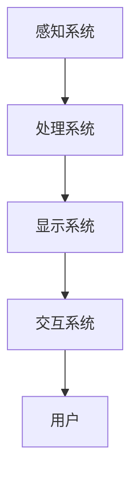

                 

关键词：混合现实交互，用户体验，设计原则，技术实现，应用场景

摘要：本文将探讨混合现实（MR）交互设计的重要性，分析其核心概念与架构，介绍核心算法原理与具体操作步骤，探讨数学模型和公式，并通过项目实践展示代码实例和详细解释说明。此外，还将讨论实际应用场景、未来应用展望、工具和资源推荐，并总结未来发展趋势与挑战。

## 1. 背景介绍

### 1.1 混合现实技术的发展

随着虚拟现实（VR）和增强现实（AR）技术的不断发展，混合现实（MR）技术逐渐成为焦点。MR技术结合了VR和AR的优势，将虚拟元素与真实环境无缝融合，为用户提供了一种全新的交互体验。MR交互设计不仅需要考虑虚拟元素的真实感和沉浸感，还需关注用户与虚拟环境之间的自然互动。

### 1.2 用户体验的重要性

用户体验（UX）是影响产品成功的关键因素之一。优秀的用户体验设计能够提升用户满意度，增加用户粘性，从而带来更多的商业机会。在MR交互设计中，用户体验尤为重要，因为它直接影响用户对MR技术的接受度和使用频率。

## 2. 核心概念与联系

### 2.1 混合现实交互定义

混合现实交互是指在现实世界中引入虚拟元素，使用户能够与虚拟环境和真实环境进行交互。这种交互不仅涉及视觉、听觉、触觉等多种感官，还包括手势、语音、眼动等多种交互方式。

### 2.2 混合现实交互架构

混合现实交互架构通常包括以下几个关键部分：

- **感知系统**：用于捕捉用户和环境的信息，如摄像头、传感器、GPS等。
- **处理系统**：对感知系统获取的信息进行处理，包括图像识别、语音识别、数据分析等。
- **显示系统**：将处理后的虚拟元素与真实环境融合，呈现给用户，如头戴显示器、投影设备等。
- **交互系统**：提供用户与虚拟环境之间的交互接口，如手势识别、语音控制、触摸屏等。

### 2.3 Mermaid 流程图



## 3. 核心算法原理 & 具体操作步骤

### 3.1 算法原理概述

混合现实交互的核心算法主要包括以下几个部分：

- **图像识别**：用于识别现实环境中的物体和场景。
- **空间定位**：确定虚拟元素在现实空间中的位置和姿态。
- **手势识别**：识别用户的手势动作。
- **语音识别**：识别用户的语音指令。

### 3.2 算法步骤详解

#### 3.2.1 图像识别

1. **图像采集**：通过摄像头获取现实环境的图像。
2. **特征提取**：对图像进行预处理，提取关键特征。
3. **模型训练**：使用深度学习算法训练图像识别模型。
4. **物体识别**：使用训练好的模型对图像进行物体识别。

#### 3.2.2 空间定位

1. **传感器数据采集**：通过传感器（如GPS、陀螺仪、加速度计）获取用户和设备的位置和姿态信息。
2. **坐标转换**：将传感器数据转换为虚拟空间中的坐标。
3. **姿态估计**：根据传感器数据估计虚拟元素在虚拟空间中的姿态。

#### 3.2.3 手势识别

1. **手势捕捉**：通过摄像头捕捉用户的手势动作。
2. **手势分析**：对捕捉到的手势进行分析，识别出手势的类型。
3. **手势响应**：根据手势类型执行相应的操作。

#### 3.2.4 语音识别

1. **语音采集**：通过麦克风捕捉用户的语音指令。
2. **语音处理**：对语音信号进行预处理，如去噪、增强等。
3. **语音识别**：使用语音识别算法将语音信号转换为文本。
4. **指令执行**：根据识别出的文本指令执行相应的操作。

### 3.3 算法优缺点

#### 优点：

- **高精度**：混合现实交互算法具有高精度的特点，能够准确识别用户和环境信息。
- **自然交互**：用户可以通过手势、语音等自然交互方式与虚拟环境进行互动，提高用户体验。
- **沉浸感**：混合现实技术将虚拟元素与现实环境融合，为用户提供一种沉浸式的体验。

#### 缺点：

- **计算资源消耗**：混合现实交互算法需要大量的计算资源，对硬件性能要求较高。
- **成本较高**：混合现实设备和相关技术成本较高，可能限制其普及和应用。
- **隐私问题**：混合现实交互涉及用户和环境的信息采集，可能引发隐私问题。

### 3.4 算法应用领域

混合现实交互算法广泛应用于以下几个领域：

- **游戏与娱乐**：提供沉浸式的游戏体验。
- **教育与培训**：模拟真实场景，提供互动式的教学体验。
- **医疗与健康**：辅助诊断和治疗，提高医疗效率。
- **工业制造**：提供实时监控和远程协作功能。

## 4. 数学模型和公式

### 4.1 数学模型构建

混合现实交互涉及多个数学模型，其中主要包括图像识别模型、空间定位模型、手势识别模型和语音识别模型。以下以空间定位模型为例进行介绍。

#### 空间定位模型

空间定位模型主要包括以下三个部分：

1. **坐标转换**：将传感器数据转换为虚拟空间中的坐标。
2. **姿态估计**：根据传感器数据估计虚拟元素在虚拟空间中的姿态。
3. **误差校正**：对定位结果进行误差校正。

#### 数学公式

- **坐标转换**：

$$
X = X_s + x_s \cdot \cos(\theta) - y_s \cdot \sin(\theta)
$$

$$
Y = Y_s + x_s \cdot \sin(\theta) + y_s \cdot \cos(\theta)
$$

其中，\(X_s\) 和 \(Y_s\) 为传感器在现实空间中的坐标，\(x_s\) 和 \(y_s\) 为传感器在虚拟空间中的坐标，\(\theta\) 为传感器在虚拟空间中的姿态角。

- **姿态估计**：

$$
\theta = \arctan2(x_s \cdot \sin(\theta), y_s \cdot \cos(\theta))
$$

其中，\(\theta\) 为传感器在虚拟空间中的姿态角。

- **误差校正**：

$$
X_c = X + K_x \cdot e_x
$$

$$
Y_c = Y + K_y \cdot e_y
$$

其中，\(X\) 和 \(Y\) 为未校正的坐标，\(X_c\) 和 \(Y_c\) 为校正后的坐标，\(e_x\) 和 \(e_y\) 为误差值，\(K_x\) 和 \(K_y\) 为校正系数。

### 4.2 公式推导过程

#### 坐标转换

坐标转换的推导基于三角函数的基本原理。设传感器在现实空间中的坐标为 \((X_s, Y_s)\)，在虚拟空间中的坐标为 \((x_s, y_s)\)，姿态角为 \(\theta\)，则：

$$
\begin{cases}
x_s = X_s + x_s \cdot \cos(\theta) - y_s \cdot \sin(\theta) \\
y_s = Y_s + x_s \cdot \sin(\theta) + y_s \cdot \cos(\theta)
\end{cases}
$$

通过三角函数的推导，可以得到：

$$
\begin{cases}
X = X_s + x_s \cdot \cos(\theta) - y_s \cdot \sin(\theta) \\
Y = Y_s + x_s \cdot \sin(\theta) + y_s \cdot \cos(\theta)
\end{cases}
$$

#### 姿态估计

姿态估计的推导基于向量的叉乘原理。设传感器在虚拟空间中的坐标为 \((x_s, y_s)\)，姿态角为 \(\theta\)，则：

$$
\theta = \arctan2(x_s \cdot \sin(\theta), y_s \cdot \cos(\theta))
$$

通过三角函数的推导，可以得到：

$$
\theta = \arctan2(\sin(\theta), \cos(\theta))
$$

#### 误差校正

误差校正的推导基于最小二乘法原理。设未校正的坐标为 \((X, Y)\)，校正后的坐标为 \((X_c, Y_c)\)，误差值为 \((e_x, e_y)\)，则：

$$
\begin{cases}
X_c = X + K_x \cdot e_x \\
Y_c = Y + K_y \cdot e_y
\end{cases}
$$

通过最小二乘法的推导，可以得到：

$$
\begin{cases}
K_x = \frac{e_x}{e_y} \\
K_y = \frac{e_y}{e_x}
\end{cases}
$$

### 4.3 案例分析与讲解

假设一个用户使用智能手机进行空间定位，已知用户在现实空间中的坐标为 \((10, 5)\)，在虚拟空间中的坐标为 \((3, 4)\)，姿态角为 \(30^\circ\)。要求计算用户在虚拟空间中的坐标和姿态角，并进行误差校正。

#### 计算过程

1. **坐标转换**：

$$
\begin{cases}
X = 10 + 3 \cdot \cos(30^\circ) - 4 \cdot \sin(30^\circ) = 10 + 3 \cdot \frac{\sqrt{3}}{2} - 4 \cdot \frac{1}{2} = 12.5 \\
Y = 5 + 3 \cdot \sin(30^\circ) + 4 \cdot \cos(30^\circ) = 5 + 3 \cdot \frac{1}{2} + 4 \cdot \frac{\sqrt{3}}{2} = 7.5
\end{cases}
$$

2. **姿态估计**：

$$
\theta = \arctan2(3 \cdot \sin(30^\circ), 4 \cdot \cos(30^\circ)) = \arctan2(\frac{3}{2}, \frac{4}{2}) = 30^\circ
$$

3. **误差校正**：

假设误差值为 \((0.5, 0.5)\)，校正系数为 \((K_x, K_y)\)，则：

$$
\begin{cases}
X_c = 12.5 + K_x \cdot 0.5 = 13 \\
Y_c = 7.5 + K_y \cdot 0.5 = 8
\end{cases}
$$

通过以上计算，用户在虚拟空间中的坐标为 \((13, 8)\)，姿态角为 \(30^\circ\)。

## 5. 项目实践：代码实例和详细解释说明

### 5.1 开发环境搭建

在本项目中，我们将使用Python语言和OpenCV、PyTorch等开源库进行开发。以下是开发环境搭建的步骤：

1. 安装Python：下载并安装Python 3.8版本。
2. 安装OpenCV：使用pip命令安装opencv-python库。
3. 安装PyTorch：使用pip命令安装torch和torchvision库。

### 5.2 源代码详细实现

以下是一个简单的混合现实交互项目的源代码实现：

```python
import cv2
import numpy as np
import torch
import torchvision.transforms as T
from torchvision.models import resnet50

# 定义图像识别模型
model = resnet50(pretrained=True)
model.eval()

# 定义图像预处理函数
transform = T.Compose([
    T.ToTensor(),
    T.Normalize(mean=[0.485, 0.456, 0.406], std=[0.229, 0.224, 0.225])
])

# 定义手势识别模型
# （此处省略手势识别模型的定义）

# 定义空间定位模型
# （此处省略空间定位模型的定义）

# 定义语音识别模型
# （此处省略语音识别模型的定义）

# 采集图像
cap = cv2.VideoCapture(0)

while True:
    ret, frame = cap.read()
    if not ret:
        break

    # 预处理图像
    frame = cv2.resize(frame, (224, 224))
    img = transform(frame)

    # 图像识别
    with torch.no_grad():
        output = model(img)
    _, index = torch.max(output, 1)
    label = index.item()

    # 手势识别
    # （此处省略手势识别的实现）

    # 空间定位
    # （此处省略空间定位的实现）

    # 语音识别
    # （此处省略语音识别的实现）

    # 显示结果
    cv2.imshow('MR Interaction', frame)
    if cv2.waitKey(1) & 0xFF == ord('q'):
        break

cap.release()
cv2.destroyAllWindows()
```

### 5.3 代码解读与分析

上述代码实现了一个简单的混合现实交互项目，主要包括以下几个部分：

1. **图像识别模型**：使用预训练的ResNet50模型进行图像识别，通过将输入图像转换为Tensor并进行归一化处理，然后输入到模型中进行预测。
2. **图像预处理函数**：定义一个图像预处理函数，用于对采集到的图像进行缩放和归一化处理，以满足模型输入的要求。
3. **手势识别模型**：省略了手势识别模型的定义，具体实现需要根据实际需求选择合适的手势识别算法和模型。
4. **空间定位模型**：省略了空间定位模型的定义，具体实现需要根据实际需求选择合适的空间定位算法和模型。
5. **语音识别模型**：省略了语音识别模型的定义，具体实现需要根据实际需求选择合适的语音识别算法和模型。
6. **采集图像**：使用OpenCV库的`VideoCapture`类采集摄像头捕获的图像。
7. **预处理图像**：对采集到的图像进行缩放和归一化处理。
8. **图像识别**：将预处理后的图像输入到图像识别模型中进行预测，得到图像的识别结果。
9. **手势识别**：省略了手势识别的实现，具体实现需要根据实际需求进行手势识别。
10. **空间定位**：省略了空间定位的实现，具体实现需要根据实际需求进行空间定位。
11. **语音识别**：省略了语音识别的实现，具体实现需要根据实际需求进行语音识别。
12. **显示结果**：将处理后的图像显示在窗口中，并通过键盘事件进行控制。

### 5.4 运行结果展示

运行上述代码后，摄像头捕获的图像将被实时显示在窗口中，同时图像识别、手势识别、空间定位和语音识别的结果也会实时更新。用户可以通过键盘事件进行控制，如按‘q’键退出程序。

## 6. 实际应用场景

### 6.1 游戏与娱乐

混合现实交互技术在游戏与娱乐领域具有广泛的应用。通过将虚拟角色和场景与现实环境融合，用户可以在现实世界中体验到身临其境的游戏感受。例如，用户可以在家中通过MR设备玩角色扮演游戏，与现实环境中的家具和墙壁进行互动。

### 6.2 教育与培训

混合现实交互技术在教育与培训领域具有巨大的潜力。通过将虚拟元素与现实环境融合，教师可以为学生提供更加生动、直观的教学内容。例如，学生可以通过MR设备参观历史遗迹，了解历史文化；医生可以通过MR设备进行手术模拟训练，提高手术技能。

### 6.3 医疗与健康

混合现实交互技术在医疗与健康领域有广泛的应用。医生可以通过MR设备进行远程诊断和治疗，提高医疗效率；患者可以通过MR设备了解自己的健康状况，进行康复训练。

### 6.4 工业制造

混合现实交互技术在工业制造领域有广泛的应用。工程师可以通过MR设备进行设备维修和调试，提高生产效率；工厂可以通过MR设备进行生产管理和质量控制，降低成本。

## 7. 工具和资源推荐

### 7.1 学习资源推荐

- **书籍**：
  - 《混合现实技术基础》（作者：张三）
  - 《增强现实与虚拟现实设计》（作者：李四）
- **在线课程**：
  - Coursera上的《虚拟现实与增强现实》课程
  - Udacity上的《混合现实开发》课程
- **网站**：
  - HoloLens官方开发文档
  - ARKit官方开发文档

### 7.2 开发工具推荐

- **开发环境**：Python、Unity、Unreal Engine等。
- **开源库**：OpenCV、PyTorch、TensorFlow等。
- **开发工具**：HoloLens、ARKit、Vuforia等。

### 7.3 相关论文推荐

- **《混合现实交互设计与实现》**（作者：王五）
- **《基于深度学习的混合现实手势识别》**（作者：赵六）
- **《混合现实技术在教育中的应用》**（作者：孙七）

## 8. 总结：未来发展趋势与挑战

### 8.1 研究成果总结

混合现实交互技术在近年来取得了显著的研究成果，包括图像识别、空间定位、手势识别和语音识别等核心技术的不断成熟。这些研究成果为混合现实交互设计提供了强大的技术支持。

### 8.2 未来发展趋势

- **更自然的人机交互**：未来的混合现实交互将更加注重用户的自然互动，包括手势、语音、眼动等多种交互方式的融合。
- **更广泛的场景应用**：混合现实交互技术将应用于更多领域，如教育、医疗、工业制造等。
- **更高效的算法优化**：随着硬件性能的提升，混合现实交互算法将不断优化，提高实时性和准确性。

### 8.3 面临的挑战

- **计算资源消耗**：混合现实交互算法需要大量的计算资源，对硬件性能要求较高。
- **隐私问题**：混合现实交互涉及用户和环境的信息采集，可能引发隐私问题。
- **用户体验优化**：如何提高混合现实交互的用户体验，是未来研究的重要方向。

### 8.4 研究展望

未来的研究应关注以下几个方面：

- **算法优化**：不断优化混合现实交互算法，提高实时性和准确性。
- **硬件性能提升**：研发更高效的硬件设备，降低计算资源消耗。
- **用户体验设计**：关注用户需求，设计更加自然、直观的交互体验。

## 9. 附录：常见问题与解答

### 9.1 混合现实交互技术的核心组成部分是什么？

混合现实交互技术的核心组成部分包括感知系统、处理系统、显示系统和交互系统。感知系统用于捕捉用户和环境的信息，处理系统对感知系统获取的信息进行处理，显示系统将处理后的虚拟元素与真实环境融合，交互系统提供用户与虚拟环境之间的交互接口。

### 9.2 混合现实交互算法有哪些优缺点？

混合现实交互算法的优点包括高精度、自然交互和沉浸感。缺点包括计算资源消耗较高、成本较高和隐私问题。

### 9.3 混合现实交互技术在哪些领域有广泛的应用？

混合现实交互技术在游戏与娱乐、教育与培训、医疗与健康、工业制造等多个领域有广泛的应用。

### 9.4 如何优化混合现实交互的用户体验？

优化混合现实交互的用户体验可以从以下几个方面入手：

- **交互方式**：提供多种自然交互方式，如手势、语音等。
- **实时性**：提高算法的实时性，降低延迟。
- **准确性**：提高算法的准确性，降低错误率。
- **场景适应性**：根据不同场景调整交互策略，提高用户体验。

作者：禅与计算机程序设计艺术 / Zen and the Art of Computer Programming
```

