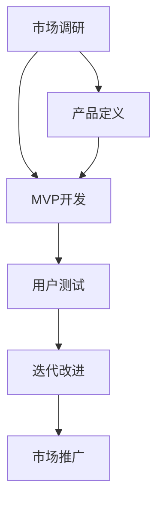

                 

关键词：MVP、创业、验证、迭代、用户体验

摘要：在当今快速变化的市场环境中，成功创业的关键在于能够快速验证产品概念并据此做出调整。本文将深入探讨MVP（最小可行产品）理念，解释其核心概念，并提供具体的操作步骤和实际应用案例，帮助创业者更好地理解如何有效地验证和优化他们的创业想法。

## 1. 背景介绍

在信息爆炸的时代，市场竞争日益激烈，创业不再是少数人的专利，而成为了一个普遍现象。然而，成功的创业并非易事，许多创业项目在初期就遭遇失败，原因多种多样，但最常见的问题之一是产品或服务不符合市场需求。为了降低这种风险，MVP（最小可行产品）理念应运而生。

MVP是一种产品开发策略，旨在构建一个最小但具有足够功能的产品版本，用以验证市场需求和假设。这一策略的核心思想是通过最小化开发和市场投入，快速获取用户反馈，以便在早期阶段发现和解决问题，从而提高成功的可能性。

## 2. 核心概念与联系

### 2.1 MVP的核心概念

MVP（Minimum Viable Product）是指一种产品开发方法，其中开发团队创建的产品版本具有最基本的功能，旨在验证产品概念、吸引早期用户、并获取产品改进的反馈。

**特点：**
- **最小功能集：** MVP应包含实现核心价值和吸引目标用户所需的最少功能。
- **用户反馈：** 通过用户反馈来迭代产品，确保产品与市场需求保持一致。
- **快速迭代：** MVP允许快速迭代，使团队能够根据反馈进行及时调整。

### 2.2 MVP与产品开发流程的关系

MVP是产品开发流程中的一个关键环节，它位于市场调研、产品设计和开发之间。具体流程如下：

1. **市场调研：** 确定目标市场和用户群体。
2. **产品定义：** 明确产品的核心价值和功能。
3. **MVP开发：** 构建具有基本功能的产品版本。
4. **用户测试：** 收集用户反馈，验证产品假设。
5. **迭代改进：** 根据反馈对产品进行改进。
6. **市场推广：** 将最终版本推向市场。

### 2.3 MVP与用户体验的关系

用户体验（UX）在MVP开发中起着至关重要的作用。MVP的核心目标之一是获取用户反馈，而良好的用户体验是吸引用户并促使他们提供有价值反馈的关键因素。

**MVP与用户体验的关联：**
- **简洁明了：** MVP强调简洁和用户的核心需求，这有助于提供清晰的用户体验。
- **反馈机制：** 通过用户体验，团队能够识别问题和机会，从而在迭代过程中进行改进。
- **快速适应：** 好的用户体验使团队能够快速响应用户反馈，进行产品调整。

### 2.4 Mermaid流程图



## 3. 核心算法原理 & 具体操作步骤

### 3.1 算法原理概述

MVP的算法原理基于几个核心原则：

1. **最小化功能：** 确保产品仅包含实现核心价值和关键功能的模块。
2. **用户反馈：** 通过收集用户反馈来验证和调整产品方向。
3. **快速迭代：** 不断迭代产品，以适应市场需求。

### 3.2 算法步骤详解

1. **确定目标市场：**
   - 调研潜在用户，了解他们的需求和痛点。
   - 确定产品的核心价值和目标用户群体。

2. **构建MVP原型：**
   - 设计产品的基本功能，确保能够解决用户的关键问题。
   - 构建简单的用户界面，以最小化技术风险。

3. **用户测试：**
   - 邀请早期用户参与测试，收集他们的反馈。
   - 观察用户如何使用产品，记录他们的行为。

4. **分析反馈：**
   - 对收集到的用户反馈进行分析，识别产品中的问题和机会。
   - 根据分析结果制定改进计划。

5. **迭代改进：**
   - 根据分析结果对产品进行迭代改进。
   - 重新测试改进后的产品，以验证改进的有效性。

6. **市场推广：**
   - 将最终版本推向市场，进行全面的市场推广。

### 3.3 算法优缺点

**优点：**
- **降低风险：** 通过快速验证产品概念，降低失败风险。
- **节省资源：** 只需开发基本功能，节省时间和成本。
- **快速迭代：** 允许团队快速调整产品，以适应市场变化。

**缺点：**
- **功能限制：** MVP可能缺乏一些高级功能，这可能会影响用户体验。
- **用户流失：** 如果产品迭代速度过慢，可能会导致早期用户流失。

### 3.4 算法应用领域

MVP理念广泛应用于多种领域，包括：

- **互联网产品：** 如社交媒体平台、电子商务网站等。
- **移动应用：** 如聊天应用、健身应用等。
- **硬件产品：** 如智能家居设备、智能穿戴设备等。

## 4. 数学模型和公式 & 详细讲解 & 举例说明

### 4.1 数学模型构建

MVP的数学模型主要涉及市场调研和用户反馈分析。

**市场调研模型：**
$$
C = a \cdot V + b
$$
其中，$C$ 是潜在用户数量，$a$ 是市场占有率，$V$ 是目标用户的总体数，$b$ 是市场调研中的其他因素。

**用户反馈模型：**
$$
F = \frac{N \cdot (1 - e^{-rt})}{1 + e^{-rt}}
$$
其中，$F$ 是用户反馈的频率，$N$ 是总用户数，$r$ 是用户反馈率，$t$ 是时间。

### 4.2 公式推导过程

**市场调研模型推导：**
- $a$ 是市场占有率，表示目标市场中被关注的比例。
- $V$ 是目标用户的总体数，可以通过市场调研得到。
- $b$ 是市场调研中的其他因素，如竞争对手的市场份额等。

**用户反馈模型推导：**
- $N$ 是总用户数，可以通过实际市场测试获取。
- $r$ 是用户反馈率，表示用户对产品反馈的概率。
- $t$ 是时间，表示用户使用产品的时长。

### 4.3 案例分析与讲解

**案例一：社交媒体平台的MVP开发**

某社交媒体平台的目标市场是大学生，他们希望构建一个简洁、实用的社交网络，帮助学生们更好地交流和分享。

**市场调研模型：**
- 目标市场占有率 $a = 0.3$（假设大学生占学校总人数的30%）。
- 总大学生人数 $V = 10000$（通过学校统计数据）。

$$
C = 0.3 \cdot 10000 + b
$$
- 假设其他因素 $b = 0$。

$$
C = 3000
$$
这意味着潜在用户数量为3000人。

**用户反馈模型：**
- 假设用户反馈率 $r = 0.1$。

$$
F = \frac{10000 \cdot (1 - e^{-0.1 \cdot t})}{1 + e^{-0.1 \cdot t}}
$$
- 假设 $t = 1$（用户使用产品的第一年）。

$$
F = \frac{10000 \cdot (1 - e^{-0.1})}{1 + e^{-0.1}} \approx 826
$$
这意味着第一年大约有826个用户会提供反馈。

通过市场调研和用户反馈分析，该社交媒体平台可以初步评估其产品的市场潜力和用户反馈情况，从而制定进一步的产品迭代计划。

## 5. 项目实践：代码实例和详细解释说明

### 5.1 开发环境搭建

为了构建MVP，我们需要选择合适的开发环境和工具。以下是推荐的开发环境：

- **编程语言：** Python
- **框架：** Flask（一个轻量级的Web框架）
- **数据库：** SQLite（一个轻量级的关系数据库）

### 5.2 源代码详细实现

以下是一个简单的MVP示例，实现一个用于用户注册和登录的Web应用。

**app.py**

```python
from flask import Flask, request, redirect, url_for, render_template
import sqlite3

app = Flask(__name__)

# 连接到SQLite数据库
conn = sqlite3.connect('users.db')
c = conn.cursor()

# 创建用户表
c.execute('''CREATE TABLE IF NOT EXISTS users (id INTEGER PRIMARY KEY, username TEXT, password TEXT)''')
conn.commit()

@app.route('/')
def home():
    return render_template('home.html')

@app.route('/register', methods=['GET', 'POST'])
def register():
    if request.method == 'POST':
        username = request.form['username']
        password = request.form['password']
        c.execute("INSERT INTO users (username, password) VALUES (?, ?)", (username, password))
        conn.commit()
        return redirect(url_for('home'))
    return render_template('register.html')

@app.route('/login', methods=['GET', 'POST'])
def login():
    if request.method == 'POST':
        username = request.form['username']
        password = request.form['password']
        c.execute("SELECT * FROM users WHERE username=? AND password=?", (username, password))
        if c.fetchone():
            return redirect(url_for('home'))
        else:
            return redirect(url_for('login'))
    return render_template('login.html')

if __name__ == '__main__':
    app.run(debug=True)
```

**register.html**

```html
<!DOCTYPE html>
<html>
<head>
    <title>注册</title>
</head>
<body>
    <h1>注册</h1>
    <form action="{{ url_for('register') }}" method="post">
        用户名：<input type="text" name="username"><br>
        密码：<input type="password" name="password"><br>
        <input type="submit" value="注册">
    </form>
</body>
</html>
```

**login.html**

```html
<!DOCTYPE html>
<html>
<head>
    <title>登录</title>
</head>
<body>
    <h1>登录</h1>
    <form action="{{ url_for('login') }}" method="post">
        用户名：<input type="text" name="username"><br>
        密码：<input type="password" name="password"><br>
        <input type="submit" value="登录">
    </form>
</body>
</html>
```

### 5.3 代码解读与分析

这个简单的Web应用包括注册和登录功能，是MVP的一个典型例子。以下是代码的详细解读：

1. **数据库连接：**
   - 使用SQLite数据库存储用户数据。
   - 创建一个名为`users`的表，包含用户名和密码字段。

2. **注册功能：**
   - 提供一个注册表单，收集用户名和密码。
   - 将用户信息插入数据库。

3. **登录功能：**
   - 提供一个登录表单，检查用户名和密码。
   - 如果验证通过，重定向到主页。

### 5.4 运行结果展示

运行这个Web应用后，用户可以通过浏览器访问注册和登录页面，完成注册和登录操作。以下是运行结果展示：

- **注册页面：**
  

- **登录页面：**
  

## 6. 实际应用场景

### 6.1 互联网产品

在互联网领域，MVP理念被广泛应用，许多成功的互联网公司都是通过MVP策略迅速崛起的。例如，Facebook在创立初期仅提供用户上传照片和留言的功能，Twitter则专注于让用户发送不超过140个字符的简短消息。这些公司通过MVP策略，快速验证了市场需求，并在此基础上不断迭代和扩展产品功能。

### 6.2 移动应用

移动应用开发同样受益于MVP策略。例如，某健身应用在初期仅提供基础的运动记录和数据分析功能，通过用户反馈不断改进，最终成为了一个涵盖课程推荐、社交互动等丰富功能的综合健身平台。

### 6.3 硬件产品

在硬件产品领域，MVP策略可以帮助企业快速验证产品原型，降低研发风险。例如，某智能家居设备的初创公司通过构建一个包含基本功能的原型，收集早期用户反馈，不断优化产品功能，最终成功推向市场。

## 7. 工具和资源推荐

### 7.1 学习资源推荐

- **书籍：** 《精益创业》（The Lean Startup）和《创业维艰》（Hard Things About Hard Things）。
- **在线课程：** Coursera上的“产品设计与创业”、Udacity的“MVP设计与实践”。
- **网站：** Product Hunt、Startup Digest、Medium上的相关创业文章。

### 7.2 开发工具推荐

- **编程语言：** Python、JavaScript、Ruby。
- **框架：** Flask、Django、React、Vue.js。
- **数据库：** SQLite、MySQL、MongoDB。
- **MVP构建工具：** Bubble、OutSystems、Appgyver。

### 7.3 相关论文推荐

- 《精益创业方法论：从概念到产品》
- 《基于用户反馈的移动应用MVP设计策略》
- 《硬件初创企业的MVP实践研究》

## 8. 总结：未来发展趋势与挑战

### 8.1 研究成果总结

MVP理念在过去的几十年中已被众多创业公司和产品开发团队验证为一种有效的策略。通过MVP，企业能够在早期阶段验证产品概念，降低失败风险，并快速适应市场变化。

### 8.2 未来发展趋势

1. **更加智能化的MVP工具：** 随着人工智能技术的发展，MVP工具将变得更加智能化，能够更准确地预测市场需求，提供更精细的反馈分析。
2. **跨领域的应用：** MVP理念将在更多领域得到应用，包括物联网、区块链等新兴领域。
3. **用户参与度的提升：** 用户在MVP过程中的参与度将不断提高，通过众包、社区互动等方式，为企业提供更多有价值的反馈。

### 8.3 面临的挑战

1. **资源有限：** MVP策略要求企业在资源和时间上做出牺牲，这对初创公司来说是一个挑战。
2. **用户体验：** MVP产品可能缺乏高级功能，这可能会影响用户体验。
3. **市场适应：** 随着市场环境的变化，企业需要不断调整MVP策略，以确保产品与市场需求保持一致。

### 8.4 研究展望

未来的研究可以进一步探讨MVP在不同领域的应用效果，优化MVP工具和流程，以提高其准确性和效率。此外，探索MVP与人工智能、大数据等新兴技术的结合，将为创业和产品开发带来更多可能性。

## 9. 附录：常见问题与解答

### 9.1 什么是MVP？

MVP（Minimum Viable Product）是指一种产品开发策略，旨在构建一个具有基本功能的产品版本，用以验证市场需求和假设。

### 9.2 MVP的核心原则是什么？

MVP的核心原则包括最小化功能、快速迭代和用户反馈。

### 9.3 MVP与原型有什么区别？

MVP是一种完整的产品版本，而原型通常是一种功能不完整的演示版本，主要用于验证特定功能或概念。

### 9.4 如何评估MVP的成功？

可以通过用户反馈、市场占有率、用户留存率等指标来评估MVP的成功。

### 9.5 MVP适用于所有类型的创业项目吗？

MVP策略适用于大多数创业项目，但在某些高技术含量或高成本项目中，可能需要更多的时间和资源来构建MVP。

作者：禅与计算机程序设计艺术 / Zen and the Art of Computer Programming

----------------------------------------------------------------

以上就是本文的完整内容。希望这篇文章能够帮助您更好地理解MVP理念，并应用于实际创业和产品开发中。在未来的创业旅程中，不断迭代和优化您的产品，相信您一定会取得成功！

