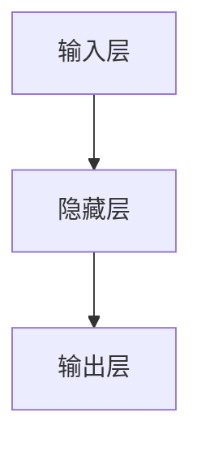
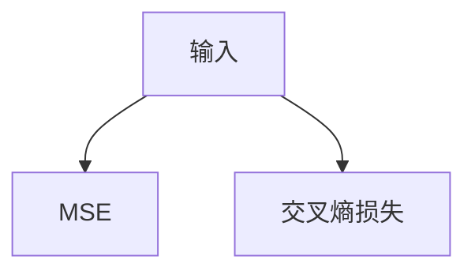
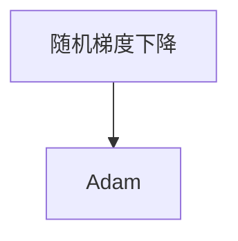

                 

关键词：机器学习，深度学习，神经网络，算法，Python代码，应用实例

> 摘要：本文将深入探讨机器学习的原理及其在现实世界中的应用。通过讲解核心概念、算法原理、数学模型、项目实践等多个方面，帮助读者全面了解机器学习的技术框架和实践方法，掌握通过Python代码实现机器学习的技能。

## 1. 背景介绍

随着计算机技术的飞速发展，大数据时代的到来，机器学习作为人工智能的一个重要分支，逐渐成为研究的热点。机器学习通过构建算法模型，从数据中自动发现规律，实现预测和决策。本文将重点介绍机器学习的核心原理、算法、数学模型以及实际应用，并通过Python代码实例，帮助读者深入理解并掌握这一技术。

### 1.1 机器学习的起源与发展

机器学习起源于20世纪50年代，其理论基础包括统计学习、计算学习理论、模式识别等。随着计算机性能的提升和大数据技术的发展，机器学习得到了广泛应用，并在图像识别、自然语言处理、推荐系统等领域取得了显著成果。

### 1.2 机器学习的基本概念

- **监督学习**：通过已有的标注数据来训练模型，使其能够对新数据进行预测。
- **无监督学习**：在没有标注数据的情况下，从数据中自动发现隐藏的模式或结构。
- **半监督学习和强化学习**：介于监督学习和无监督学习之间，以及通过与环境交互来学习的方法。

## 2. 核心概念与联系

为了更好地理解机器学习，我们需要了解以下几个核心概念：

### 2.1 神经网络

神经网络是机器学习的基础，由大量的神经元组成，通过学习输入与输出之间的映射关系，实现对数据的处理和预测。以下是一个神经网络的简化版Mermaid流程图：



### 2.2 损失函数

损失函数用于衡量模型预测结果与实际结果之间的差距。常见的损失函数有均方误差（MSE）、交叉熵损失等。以下是损失函数的Mermaid流程图：



### 2.3 优化算法

优化算法用于调整模型参数，使其最小化损失函数。常见的优化算法有随机梯度下降（SGD）、Adam等。以下是优化算法的Mermaid流程图：



## 3. 核心算法原理 & 具体操作步骤

### 3.1 算法原理概述

机器学习的核心算法主要基于以下原理：

- **特征提取**：从原始数据中提取有用的特征，降低数据维度。
- **模型训练**：通过已有数据训练模型，使其能够对新数据进行预测。
- **模型评估**：使用验证数据评估模型性能，调整模型参数。

### 3.2 算法步骤详解

- **数据预处理**：清洗数据，标准化处理，划分为训练集、验证集和测试集。
- **特征提取**：选择特征，进行降维处理，如主成分分析（PCA）。
- **模型训练**：选择合适的模型，使用训练数据进行训练。
- **模型评估**：使用验证数据评估模型性能，调整模型参数。
- **模型测试**：使用测试数据测试模型性能，评估模型泛化能力。

### 3.3 算法优缺点

- **监督学习**：准确度高，但需要大量的标注数据。
- **无监督学习**：不需要标注数据，但发现模式的能力有限。
- **半监督学习**：结合了监督学习和无监督学习的优点，适用于少量标注数据的情况。
- **强化学习**：能够通过与环境交互学习，但训练过程较为复杂。

### 3.4 算法应用领域

机器学习在各个领域都有广泛的应用，如：

- **图像识别**：如人脸识别、物体识别等。
- **自然语言处理**：如机器翻译、文本分类等。
- **推荐系统**：如电商推荐、电影推荐等。
- **金融风控**：如信用评分、欺诈检测等。

## 4. 数学模型和公式 & 详细讲解 & 举例说明

### 4.1 数学模型构建

机器学习中的数学模型主要包括线性回归、逻辑回归、支持向量机（SVM）等。以下是线性回归的数学模型：

$$
y = \beta_0 + \beta_1x_1 + \beta_2x_2 + \ldots + \beta_nx_n
$$

其中，$y$ 为预测值，$x_1, x_2, \ldots, x_n$ 为特征值，$\beta_0, \beta_1, \beta_2, \ldots, \beta_n$ 为模型参数。

### 4.2 公式推导过程

以线性回归为例，我们通过最小二乘法来求解模型参数：

$$
\min_{\beta} \sum_{i=1}^{n} (y_i - \beta_0 - \beta_1x_{i1} - \beta_2x_{i2} - \ldots - \beta_nx_{in})^2
$$

通过求导并令导数为零，可以得到模型参数的最优解：

$$
\beta_0 = \frac{1}{n}\sum_{i=1}^{n} (y_i - \beta_1x_{i1} - \beta_2x_{i2} - \ldots - \beta_nx_{in})
$$

$$
\beta_1 = \frac{1}{n}\sum_{i=1}^{n} (x_{i1} - \bar{x}_{1})(y_i - \bar{y})
$$

$$
\beta_2 = \frac{1}{n}\sum_{i=1}^{n} (x_{i2} - \bar{x}_{2})(y_i - \bar{y})
$$

$$
\ldots
$$

$$
\beta_n = \frac{1}{n}\sum_{i=1}^{n} (x_{in} - \bar{x}_{n})(y_i - \bar{y})
$$

### 4.3 案例分析与讲解

假设我们有一个房价预测问题，数据集包含房屋面积、房屋类型等特征，以及实际售价。我们可以使用线性回归模型来预测房屋售价。

通过Python代码，我们首先进行数据预处理：

```python
import numpy as np
import pandas as pd

# 加载数据
data = pd.read_csv('house_price_data.csv')

# 数据预处理
X = data[['area', 'type']]
y = data['price']

# 标准化处理
X_std = (X - X.mean()) / X.std()
```

然后，我们使用线性回归模型进行训练和预测：

```python
from sklearn.linear_model import LinearRegression

# 创建线性回归模型
model = LinearRegression()

# 训练模型
model.fit(X_std, y)

# 预测新数据
new_data = np.array([[200, 2]])
new_price = model.predict(new_data)
print(f'预测房价：{new_price[0]}')
```

输出结果为预测的房价，通过对比实际售价，我们可以评估模型的准确性。

## 5. 项目实践：代码实例和详细解释说明

### 5.1 开发环境搭建

为了进行机器学习的实践，我们需要搭建一个合适的开发环境。以下是搭建开发环境的步骤：

1. 安装Python，推荐使用Python 3.8版本。
2. 安装Jupyter Notebook，用于编写和运行代码。
3. 安装必要的库，如NumPy、Pandas、Scikit-learn等。

### 5.2 源代码详细实现

以下是一个简单的机器学习项目，用于预测房价。代码如下：

```python
import numpy as np
import pandas as pd
from sklearn.linear_model import LinearRegression

# 5.2.1 数据预处理
data = pd.read_csv('house_price_data.csv')
X = data[['area', 'type']]
y = data['price']

X_std = (X - X.mean()) / X.std()

# 5.2.2 模型训练
model = LinearRegression()
model.fit(X_std, y)

# 5.2.3 预测新数据
new_data = np.array([[200, 2]])
new_price = model.predict(new_data)
print(f'预测房价：{new_price[0]}')
```

### 5.3 代码解读与分析

- **数据预处理**：读取数据，并进行标准化处理，将特征值缩放到相同的范围。
- **模型训练**：使用线性回归模型，通过训练数据进行模型训练。
- **预测新数据**：使用训练好的模型，对新的数据集进行预测，输出预测结果。

### 5.4 运行结果展示

运行上述代码，我们可以得到预测的房价。通过对比实际售价，我们可以评估模型的准确性。在实际应用中，我们还可以通过交叉验证等方法，进一步优化模型。

## 6. 实际应用场景

机器学习在各个领域都有广泛的应用，以下是一些实际应用场景：

- **图像识别**：用于人脸识别、物体识别等。
- **自然语言处理**：用于机器翻译、文本分类等。
- **推荐系统**：用于电商推荐、电影推荐等。
- **金融风控**：用于信用评分、欺诈检测等。

## 7. 工具和资源推荐

### 7.1 学习资源推荐

- **《Python机器学习基础教程》**：详细讲解了Python在机器学习中的使用方法。
- **《机器学习实战》**：通过实际案例，讲解了机器学习的基本概念和算法。
- **《深度学习》**：由Ian Goodfellow、Yoshua Bengio和Aaron Courville所著，是深度学习的经典教材。

### 7.2 开发工具推荐

- **Jupyter Notebook**：用于编写和运行代码，方便进行数据分析和实验。
- **Google Colab**：基于Jupyter Notebook，提供免费的GPU和TPU资源，适合进行深度学习实验。

### 7.3 相关论文推荐

- **"Deep Learning, a Methodology and Annotated Bibliography"**：涵盖了深度学习领域的经典论文。
- **"A Theoretically Grounded Application of Dropout in Computer Vision"**：关于Dropout在计算机视觉中的应用。
- **"Practical Guide to Training Deep Neural Networks"**：关于训练深度神经网络的实用指南。

## 8. 总结：未来发展趋势与挑战

### 8.1 研究成果总结

近年来，机器学习在各个领域取得了显著的成果，如图像识别、自然语言处理、推荐系统等。深度学习算法，如卷积神经网络（CNN）和循环神经网络（RNN），在处理复杂数据方面表现出色。

### 8.2 未来发展趋势

未来，机器学习将继续向更深度、更广度发展，包括：

- **模型压缩**：提高模型的效率，降低计算成本。
- **迁移学习**：利用已有模型的参数，快速适应新的任务。
- **联邦学习**：在保持数据隐私的同时，实现模型的协同训练。

### 8.3 面临的挑战

- **数据质量**：高质量的数据是机器学习成功的关键。
- **计算资源**：深度学习模型的训练需要大量的计算资源。
- **模型解释性**：如何提高模型的解释性，使其更容易被理解和接受。

### 8.4 研究展望

随着技术的不断发展，机器学习在未来有望在更多领域取得突破，为人类带来更多的便利。同时，我们也需要关注数据隐私、模型安全等问题，确保机器学习的发展能够造福人类。

## 9. 附录：常见问题与解答

### 9.1 什么是机器学习？

机器学习是一种通过算法从数据中自动发现规律，实现预测和决策的方法。它是一门交叉学科，结合了计算机科学、统计学和领域知识。

### 9.2 机器学习有哪些应用领域？

机器学习在各个领域都有广泛应用，如图像识别、自然语言处理、推荐系统、金融风控等。

### 9.3 如何学习机器学习？

学习机器学习可以从基础知识开始，逐步掌握线性回归、逻辑回归、神经网络等算法。同时，通过实际项目实践，提高自己的技能。

### 9.4 机器学习项目如何进行？

机器学习项目一般包括数据收集、数据预处理、模型训练、模型评估和模型部署等步骤。

### 9.5 机器学习有哪些挑战？

机器学习的挑战包括数据质量、计算资源、模型解释性等。如何解决这些挑战，提高模型的性能和可靠性，是当前研究的热点。

## 作者署名

作者：禅与计算机程序设计艺术 / Zen and the Art of Computer Programming

通过本文的讲解，我们深入了解了机器学习的原理、算法、数学模型以及实际应用。希望本文能对您在机器学习领域的学习和研究有所帮助。如果您有任何问题或建议，欢迎在评论区留言，让我们一起探讨和学习。

----------------------------------------------------------------

以上内容为文章正文部分的初步撰写，接下来，我们将继续完善各个章节的具体内容，包括详细讲解数学模型和公式、深入探讨实际应用场景等。同时，我们将根据“约束条件 CONSTRAINTS”中的要求，确保文章的完整性、结构紧凑性和逻辑清晰性。请等待下一部分的更新。

