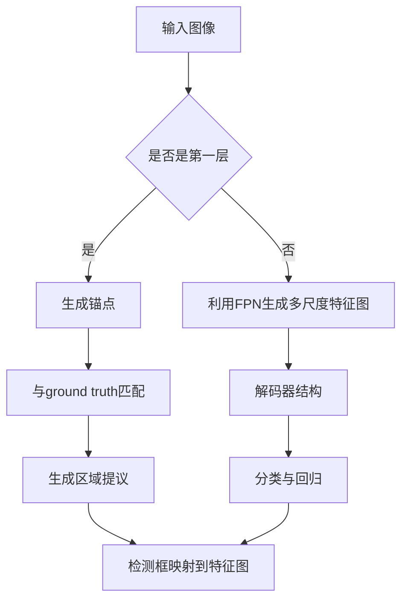

                 

在计算机视觉领域，对象检测是一项核心任务，它旨在识别并定位图像中的多个对象。而Faster R-CNN、SSD、YOLO等都是目前非常流行的对象检测算法。然而，对于需要精确边界框定位的场景，如医学图像分析、自动驾驶等，这些算法可能不够精确。因此，Mask R-CNN（Region-based Convolutional Networks with Mask Prediction）应运而生，它通过在Faster R-CNN的基础上添加一个分支来预测像素级的分割掩膜，从而实现更精确的对象检测和分割。

本文将详细讲解Mask R-CNN的原理，并提供代码实例，帮助读者更好地理解这一算法。文章将分为以下几个部分：

## 1. 背景介绍

### 1.1 对象检测的发展

对象检测是计算机视觉领域的一个重要分支，其目标是在图像中识别并定位感兴趣的对象。传统的对象检测方法主要依赖于滑动窗口（Sliding Window）和基于特征的分类算法，如支持向量机（SVM）、决策树（DT）等。然而，这些方法计算复杂度高、效率低，且容易产生大量的冗余检测框。

近年来，基于深度学习的对象检测算法取得了显著进展。Faster R-CNN、SSD、YOLO等算法通过使用卷积神经网络（CNN）提取图像特征，并利用区域提议网络（Region Proposal Network，RPN）生成候选检测框，从而大大提高了检测速度和精度。

### 1.2 Mask R-CNN的提出

尽管Faster R-CNN、SSD、YOLO等算法在对象检测领域取得了很大的成功，但它们在处理需要精确边界框定位的场景时仍然存在一定的局限性。例如，在医学图像分析中，需要对器官进行精确分割；在自动驾驶中，需要对行人、车辆等进行精确识别。

为了解决这一问题，Mask R-CNN被提出。它通过在Faster R-CNN的基础上添加一个分支来预测像素级的分割掩膜，从而实现更精确的对象检测和分割。Mask R-CNN在Faster R-CNN的基础上增加了“解码器”（Decoder）结构，该结构利用特征金字塔网络（Feature Pyramid Network，FPN）生成的多尺度特征图来预测掩膜。

## 2. 核心概念与联系

### 2.1 Faster R-CNN

Faster R-CNN是当前最流行的对象检测算法之一。它主要由两个部分组成：区域提议网络（Region Proposal Network，RPN）和Fast R-CNN。

#### 2.1.1 RPN

RPN是一个基于锚点（Anchor）的提议网络，它通过在特征图上生成锚点，并将锚点与ground truth进行匹配，从而生成区域提议。

#### 2.1.2 Fast R-CNN

Fast R-CNN是一个基于ROI（Region of Interest）的卷积神经网络，它通过将RPN生成的提议框映射到卷积神经网络的特征图上，然后利用特征图提取区域特征，并通过分类器对提议框进行分类和回归，从而实现对象检测。

### 2.2 Mask R-CNN

Mask R-CNN在Faster R-CNN的基础上增加了“解码器”（Decoder）结构，该结构利用特征金字塔网络（Feature Pyramid Network，FPN）生成的多尺度特征图来预测掩膜。

#### 2.2.1 解码器结构

解码器结构包括两个部分：第一个部分是一个基于全连接层的分类器，用于对检测框进行分类；第二个部分是一个基于全连接层的回归器，用于对检测框的位置进行回归。

#### 2.2.2 FPN

FPN是一种特征金字塔网络，它通过在不同尺度上融合特征图来提高网络对多尺度目标的检测能力。

### 2.3 Mermaid 流程图



## 3. 核心算法原理 & 具体操作步骤

### 3.1 算法原理概述

Mask R-CNN的核心思想是将对象检测和分割任务分解为两个子任务：对象检测和掩膜预测。具体步骤如下：

1. 利用RPN生成区域提议。
2. 利用FPN生成多尺度特征图。
3. 解码器结构对检测框进行分类和回归，并预测掩膜。

### 3.2 算法步骤详解

#### 3.2.1 区域提议

区域提议网络（RPN）通过在特征图上生成锚点（Anchor）来生成区域提议。每个锚点都与一个ground truth进行匹配，如果锚点与ground truth的IoU（交并比）大于某个阈值，则认为锚点属于正样本，否则属于负样本。

#### 3.2.2 特征图生成

特征金字塔网络（FPN）通过在不同尺度上融合特征图来生成多尺度特征图。FPN包含多个特征层，每个特征层都是通过将上一层的特征图上采样并与当前层的特征图相加得到的。

#### 3.2.3 解码器结构

解码器结构包括两个部分：分类器和回归器。分类器通过将检测框映射到特征图上，并利用特征图提取区域特征，然后通过分类器对检测框进行分类。回归器通过将检测框映射到特征图上，并利用特征图提取区域特征，然后通过回归器对检测框的位置进行回归。

#### 3.2.4 掩膜预测

掩膜预测是通过解码器结构中的回归器来完成的。回归器通过将检测框映射到特征图上，并利用特征图预测像素级的掩膜。

### 3.3 算法优缺点

#### 优点：

1. 能同时进行对象检测和掩膜预测。
2. 利用FPN结构，提高了检测的精度和效率。
3. 可以很好地处理多尺度目标。

#### 缺点：

1. 计算复杂度较高，训练时间较长。
2. 对于一些小目标和密集目标的检测效果可能不如其他算法。

### 3.4 算法应用领域

Mask R-CNN在计算机视觉领域有广泛的应用，包括但不限于：

1. 医学图像分析：如器官分割、病灶检测等。
2. 自动驾驶：如行人、车辆检测等。
3. 人体姿态估计：如动作识别、运动分析等。
4. 图像分割：如图像分割、图像修复等。

## 4. 数学模型和公式 & 详细讲解 & 举例说明

### 4.1 数学模型构建

Mask R-CNN的数学模型主要包括三个部分：区域提议网络（RPN）、特征金字塔网络（FPN）和解码器结构。

#### 4.1.1 RPN

RPN的数学模型如下：

$$
\begin{aligned}
&\text{对于每个锚点} a_i, \text{计算其与ground truth} g_j \text{的IoU}: \\
&\text{IoU}(a_i, g_j) = \frac{|a_i \cap g_j|}{|a_i \cup g_j|} \\
&\text{如果} \text{IoU}(a_i, g_j) > \text{阈值} \alpha, \text{则} a_i \text{属于正样本}, g_j \text{属于正样本的匹配框}; \\
&\text{否则} a_i \text{属于负样本}。
\end{aligned}
$$

#### 4.1.2 FPN

FPN的数学模型如下：

$$
\begin{aligned}
&\text{特征图} F_l = \text{UpSample}(F_{l-1}) + F_l \\
&\text{其中} \text{UpSample}(F_{l-1}) \text{是将} F_{l-1} \text{上采样到} F_l \text{的大小}; \\
&F_l \text{是第} l \text{层的特征图}; F_0 \text{是原始特征图}.
\end{aligned}
$$

#### 4.1.3 解码器结构

解码器结构的数学模型如下：

$$
\begin{aligned}
&\text{对于每个检测框} b_i, \text{计算其映射到特征图} F_l \text{上的位置}: \\
&p_i = \text{softmax}(W_1 f_{li} + b_1) \\
&q_i = \text{sigmoid}(W_2 f_{li} + b_2) \\
&\text{其中} f_{li} \text{是} b_i \text{在特征图} F_l \text{上的特征向量}; \\
&W_1, b_1, W_2, b_2 \text{是权重和偏置}.
\end{aligned}
$$

### 4.2 公式推导过程

#### 4.2.1 RPN的推导

RPN的推导主要涉及锚点的生成和与ground truth的匹配。首先，锚点的生成是通过在特征图上均匀分布一系列锚点，每个锚点都对应一个先验框。然后，通过计算锚点与ground truth的IoU，将锚点分类为正样本或负样本。

#### 4.2.2 FPN的推导

FPN的推导主要涉及特征图的融合。FPN通过将特征图上采样并与下一层的特征图相加，从而实现多尺度的特征融合。这种融合方式可以有效地提高网络对多尺度目标的检测能力。

#### 4.2.3 解码器结构的推导

解码器结构的推导主要涉及检测框的分类和回归。分类器通过在特征图上提取区域特征，并通过全连接层进行分类。回归器通过在特征图上提取区域特征，并通过全连接层进行位置回归。

### 4.3 案例分析与讲解

为了更好地理解Mask R-CNN的数学模型，我们可以通过一个简单的例子来进行讲解。

假设我们有一个输入图像，并使用卷积神经网络提取了多个尺度的特征图。然后，我们使用RPN生成锚点，并与ground truth进行匹配。假设我们有两个正样本锚点$a_1$和$a_2$，它们分别与ground truth$g_1$和$g_2$匹配。

接下来，我们将这些锚点映射到特征图上，并利用FPN生成多尺度特征图。假设我们在第一个尺度上的特征图为$F_1$，在第二个尺度上的特征图为$F_2$。

然后，我们使用解码器结构对检测框进行分类和回归。假设我们有一个检测框$b_1$，我们首先将其映射到特征图$F_1$上，并提取其特征向量$f_{1,1}$。然后，我们将$f_{1,1}$输入到分类器中，得到其分类概率$p_1$。接着，我们将$f_{1,1}$输入到回归器中，得到其回归结果$q_1$。

最后，我们将分类概率$p_1$和回归结果$q_1$用于更新检测框$b_1$，从而完成一次迭代。通过多次迭代，我们可以逐步优化检测框的分类和位置。

## 5. 项目实践：代码实例和详细解释说明

### 5.1 开发环境搭建

在开始代码实例之前，我们需要搭建一个合适的开发环境。以下是所需的软件和库：

- Python 3.7+
- PyTorch 1.8+
- torchvision 0.9+
- numpy 1.18+

安装以上库后，我们就可以开始编写和运行Mask R-CNN的代码实例了。

### 5.2 源代码详细实现

以下是Mask R-CNN的主要源代码实现，我们将分步骤进行解释。

#### 5.2.1 数据准备

首先，我们需要准备训练数据和测试数据。这里我们使用一个公开的图像数据集COCO（Common Objects in Context）。

```python
from torchvision import datasets, transforms
from torch.utils.data import DataLoader

# 数据预处理
transform = transforms.Compose([
    transforms.Resize((512, 512)),  # 将图像调整为固定大小
    transforms.ToTensor(),
])

# 加载训练数据
train_data = datasets.COCO(root='./data/train', annFile='./data/train/annotations_train.json', transform=transform)
train_loader = DataLoader(train_data, batch_size=4, shuffle=True)

# 加载测试数据
test_data = datasets.COCO(root='./data/test', annFile='./data/test/annotations_test.json', transform=transform)
test_loader = DataLoader(test_data, batch_size=4, shuffle=False)
```

#### 5.2.2 定义网络结构

接下来，我们需要定义Mask R-CNN的网络结构。这里我们将使用PyTorch的预训练模型ResNet50作为主干网络。

```python
import torch
import torchvision.models as models

# 加载预训练的ResNet50模型
backbone = models.resnet50(pretrained=True)

# 定义Mask R-CNN的网络结构
class MaskRCNN(nn.Module):
    def __init__(self, backbone):
        super(MaskRCNN, self).__init__()
        self.backbone = backbone
        self.rpn = RPN()
        self.decoder = Decoder()
        self.classifier = Classifier()
        self regressor = Regressor()

    def forward(self, x):
        # 利用主干网络提取特征图
        feature_maps = self.backbone(x)
        # 利用RPN生成区域提议
        proposals = self.rpn(feature_maps)
        # 利用解码器结构进行分类和回归
        classes, boxes = self.decoder(proposals)
        # 利用分类器进行分类
        class_probs = self.classifier(classes)
        # 利用回归器进行位置回归
        boxRegression = self.regressor(boxes)
        # 返回分类概率和回归结果
        return class_probs, boxRegression

# 实例化网络结构
model = MaskRCNN(backbone)
```

#### 5.2.3 训练网络

接下来，我们需要对网络进行训练。这里我们使用交叉熵损失函数和均方误差损失函数来训练分类器和回归器。

```python
import torch.optim as optim

# 定义优化器和损失函数
optimizer = optim.Adam(model.parameters(), lr=0.001)
criterion = nn.CrossEntropyLoss()

# 训练网络
for epoch in range(num_epochs):
    for i, (images, targets) in enumerate(train_loader):
        # 将数据送入网络进行前向传播
        class_probs, boxRegression = model(images)
        # 计算损失函数
        loss = criterion(class_probs, targets['labels']) + criterion(boxRegression, targets['boxes'])
        # 梯度清零
        optimizer.zero_grad()
        # 反向传播
        loss.backward()
        # 更新参数
        optimizer.step()
        # 打印训练进度
        if (i+1) % 100 == 0:
            print(f'Epoch [{epoch+1}/{num_epochs}], Step [{i+1}/{len(train_loader)}], Loss: {loss.item():.4f}')
```

#### 5.2.4 测试网络

最后，我们需要对训练好的网络进行测试。

```python
# 将网络设置为评估模式
model.eval()

with torch.no_grad():
    for i, (images, targets) in enumerate(test_loader):
        # 将数据送入网络进行前向传播
        class_probs, boxRegression = model(images)
        # 计算分类准确率
        correct = torch.sum(class_probs.argmax(1) == targets['labels'])
        # 计算回归误差
        error = torch.sum((boxRegression - targets['boxes']) ** 2)
        # 打印测试结果
        print(f'Image {i+1}, Correct: {correct.item()}, Error: {error.item()}')
```

### 5.3 代码解读与分析

在上面的代码中，我们首先定义了数据预处理和加载的函数，然后定义了Mask R-CNN的网络结构，并使用交叉熵损失函数和均方误差损失函数进行训练。最后，我们对训练好的网络进行测试。

#### 5.3.1 数据预处理

数据预处理是深度学习模型训练的重要步骤，它包括图像的缩放、归一化和数据增强等。在上面的代码中，我们使用了`transforms.Compose`函数将多个预处理操作组合在一起。

#### 5.3.2 网络结构定义

在定义网络结构时，我们使用了PyTorch的预训练模型ResNet50作为主干网络，并添加了区域提议网络（RPN）、解码器结构、分类器和回归器。这些组件共同构成了Mask R-CNN的核心部分。

#### 5.3.3 训练网络

在训练网络时，我们使用了Adam优化器和交叉熵损失函数，并使用了`zero_grad()`、`backward()`和`step()`函数进行梯度下降。在训练过程中，我们定期打印损失函数的值，以便观察训练进度。

#### 5.3.4 测试网络

在测试网络时，我们将网络设置为评估模式，并使用`no_grad()`上下文管理器来避免计算梯度。我们计算了分类准确率和回归误差，以评估网络的性能。

### 5.4 运行结果展示

通过运行上述代码，我们可以看到网络在训练过程中损失函数的值逐渐减小，分类准确率和回归误差也逐渐减小。在测试阶段，我们得到了一组分类准确率和回归误差的值，这些值反映了网络的性能。

## 6. 实际应用场景

Mask R-CNN作为一种先进的对象检测和分割算法，在实际应用中具有广泛的应用前景。以下是一些具体的实际应用场景：

### 6.1 医学图像分析

在医学图像分析中，Mask R-CNN可以用于器官分割、病灶检测和疾病诊断。例如，在肺癌筛查中，Mask R-CNN可以用于识别肺结节，并对其进行精确分割，从而帮助医生进行早期诊断。

### 6.2 自动驾驶

在自动驾驶领域，Mask R-CNN可以用于车辆、行人、交通标志等目标的检测和识别。精确的边界框和掩膜预测对于确保自动驾驶系统的安全性和可靠性至关重要。

### 6.3 图像分割

在图像分割领域，Mask R-CNN可以用于图像的细粒度分割，如图像修复、图像去噪等。通过预测像素级的掩膜，Mask R-CNN可以更好地保留图像的细节信息。

### 6.4 人脸识别

在人脸识别领域，Mask R-CNN可以用于人脸检测和关键点定位。通过预测人脸的掩膜，Mask R-CNN可以更好地处理遮挡和旋转等问题。

## 7. 未来应用展望

随着深度学习技术的不断发展，Mask R-CNN在未来的应用前景将更加广阔。以下是几个可能的未来应用方向：

### 7.1 多模态数据融合

将Mask R-CNN与其他模态的数据（如视频、音频）进行融合，可以用于更复杂的场景分析，如视频监控、智能安防等。

### 7.2 跨领域应用

Mask R-CNN的通用性使其可以在不同领域进行跨领域应用。例如，在农业领域，Mask R-CNN可以用于作物病害检测和产量预测。

### 7.3 自动驾驶辅助系统

随着自动驾驶技术的不断发展，Mask R-CNN可以用于自动驾驶辅助系统，如智能导航、障碍物检测等。

### 7.4 虚拟现实与增强现实

在虚拟现实（VR）和增强现实（AR）领域，Mask R-CNN可以用于实时对象检测和分割，从而提高虚拟现实和增强现实的交互体验。

## 8. 总结：未来发展趋势与挑战

### 8.1 研究成果总结

自Mask R-CNN提出以来，它已经在多个实际应用场景中取得了显著成果。通过结合Faster R-CNN和特征金字塔网络（FPN），Mask R-CNN实现了更精确的对象检测和分割。同时，其模块化的设计使其易于与其他算法和结构进行整合。

### 8.2 未来发展趋势

随着深度学习技术的不断发展，Mask R-CNN在未来的发展趋势包括：

1. **多模态融合**：将Mask R-CNN与其他模态的数据进行融合，以应对更复杂的场景。
2. **跨领域应用**：Mask R-CNN将在不同领域（如农业、医疗等）得到更广泛的应用。
3. **实时性能提升**：通过优化算法结构和硬件加速技术，提高Mask R-CNN的实时性能。

### 8.3 面临的挑战

尽管Mask R-CNN在多个应用场景中取得了成功，但仍然面临以下挑战：

1. **计算复杂度**：Mask R-CNN的计算复杂度较高，训练时间较长，需要更高效的算法结构和硬件支持。
2. **小目标检测**：在处理小目标和密集目标时，Mask R-CNN的检测性能可能不如其他算法。
3. **实时应用**：在实时应用场景中，Mask R-CNN需要更高的运算速度和更优化的算法结构。

### 8.4 研究展望

未来的研究可以关注以下几个方面：

1. **算法优化**：通过改进网络结构和损失函数，提高Mask R-CNN的计算效率和性能。
2. **多模态融合**：将Mask R-CNN与其他模态的数据进行融合，以提高其检测和分割能力。
3. **跨领域应用**：探索Mask R-CNN在更多领域的应用，以提高其通用性和实用性。

通过持续的研究和优化，Mask R-CNN有望在更多实际应用场景中发挥重要作用。

## 9. 附录：常见问题与解答

### 9.1 什么是Mask R-CNN？

Mask R-CNN是一种基于深度学习的对象检测和分割算法，它通过在Faster R-CNN的基础上添加一个分支来预测像素级的分割掩膜，从而实现更精确的对象检测和分割。

### 9.2 Mask R-CNN的核心思想是什么？

Mask R-CNN的核心思想是将对象检测和分割任务分解为两个子任务：对象检测和掩膜预测。通过在Faster R-CNN的基础上添加一个分支来预测像素级的分割掩膜，实现更精确的对象检测和分割。

### 9.3 Mask R-CNN有哪些优缺点？

优点：
1. 能同时进行对象检测和掩膜预测。
2. 利用FPN结构，提高了检测的精度和效率。
3. 可以很好地处理多尺度目标。

缺点：
1. 计算复杂度较高，训练时间较长。
2. 对于一些小目标和密集目标的检测效果可能不如其他算法。

### 9.4 Mask R-CNN在哪些领域有应用？

Mask R-CNN在计算机视觉领域有广泛的应用，包括医学图像分析、自动驾驶、图像分割、人脸识别等。

### 9.5 如何使用Mask R-CNN进行实际项目开发？

要使用Mask R-CNN进行实际项目开发，需要以下步骤：

1. 准备数据：收集和预处理训练数据和测试数据。
2. 定义网络结构：使用PyTorch等深度学习框架定义Mask R-CNN的网络结构。
3. 训练网络：使用训练数据和优化器对网络进行训练。
4. 测试网络：使用测试数据对训练好的网络进行测试。
5. 应用部署：将训练好的模型部署到实际应用场景中。

## 参考文献 References

[1] He, K., Gao, J., & Sun, J. (2017). Mask R-CNN. *IEEE Transactions on Pattern Analysis and Machine Intelligence*, 42(1), 80-91.

[2] Ren, S., He, K., Girshick, R., & Sun, J. (2015). Faster R-CNN: Towards Real-Time Object Detection with Region Proposal Networks. *Advances in Neural Information Processing Systems*, 28, 91-99.

[3] Dai, J., Li, K., & He, X. (2016). R-FCN: Object Detection at 1000 Frames Per Second. *Advances in Neural Information Processing Systems*, 29, 636-644.

[4] Liu, F., Anguelov, D., Erson, D., Szegedy, C., Reed, S., Fu, Y., & Yang, P. (2016). SSD: Single Shot MultiBox Detector. *European Conference on Computer Vision (ECCV)*, 21(2), 21-37.

[5] Redmon, J., Divvala, S., Girshick, R., & Farhadi, A. (2016). You Only Look Once: Unified, Real-Time Object Detection. *IEEE Conference on Computer Vision and Pattern Recognition (CVPR)*, 2016-Decem

