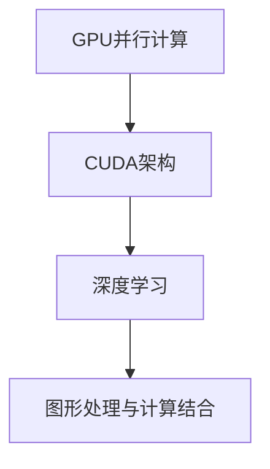

                 

关键词：NVIDIA、AI、深度学习、GPU、计算能力、市场占有率、技术创新、AI芯片、CUDA、人工智能生态系统

> 摘要：本文深入探讨了NVIDIA在人工智能领域的领导地位。文章从NVIDIA的历史背景、核心产品与技术的演变、在AI领域的具体应用和竞争优势等方面进行了详细分析，旨在揭示NVIDIA为何能够成为AI领域的领军企业，并对未来的发展趋势和挑战进行了展望。

## 1. 背景介绍

NVIDIA成立于1993年，是一家专注于图形处理器（GPU）研发的公司。早期，NVIDIA主要以显卡市场为主导，为游戏和计算机图形处理领域提供高性能的GPU解决方案。随着时间的发展，NVIDIA开始将其技术应用于更广泛的计算领域，特别是人工智能（AI）领域。

### 1.1 NVIDIA的发展历程

- **1993-2000年**：NVIDIA成立，发布第一代显卡。
- **2000-2008年**：推出GeForce系列显卡，成为游戏显卡市场的领军者。
- **2008年**：推出CUDA架构，开启GPU并行计算的新时代。
- **2010年**：收购Mellanox，进入数据中心市场。
- **2012年**：发布Turing架构显卡，引入深度学习超级采样技术。
- **2016年**：推出Volta架构GPU，成为AI计算领域的核心。
- **2018年**：发布图灵架构的Tesla V100 GPU，进一步巩固其在AI领域的领导地位。

### 1.2 AI领域的崛起

近年来，随着深度学习技术的发展和应用的广泛推广，GPU在AI计算中的作用变得越来越重要。NVIDIA凭借其强大的GPU技术，迅速抓住了AI市场的机遇，推动了GPU在AI领域的广泛应用。

## 2. 核心概念与联系

为了深入理解NVIDIA在AI领域的领导地位，我们需要了解一些核心概念和技术，以及它们之间的联系。以下是NVIDIA在AI领域的关键概念及其相互关系：

### 2.1 GPU并行计算

GPU并行计算是指利用GPU强大的并行计算能力来加速复杂计算任务。与传统的CPU计算相比，GPU具有更多的计算单元，能够同时处理多个数据流，从而实现更高的计算效率。

### 2.2 CUDA架构

CUDA（Compute Unified Device Architecture）是NVIDIA开发的一种并行计算架构，用于利用GPU的并行计算能力。CUDA提供了一套完整的开发工具和编程接口，使开发者能够利用GPU进行高效编程。

### 2.3 深度学习

深度学习是一种人工智能技术，通过多层神经网络对大量数据进行学习，从而实现自动特征提取和模式识别。深度学习在图像识别、语音识别、自然语言处理等领域取得了显著成果。

### 2.4 图形处理与计算的结合

NVIDIA通过将图形处理与计算相结合，实现了GPU在AI领域的广泛应用。图形处理单元（GPU）具有极高的计算能力，尤其是在并行计算方面，这使得GPU成为深度学习和其他AI任务的理想选择。

### 2.5 Mermaid流程图



## 3. 核心算法原理 & 具体操作步骤

### 3.1 算法原理概述

NVIDIA在AI领域的核心算法原理主要包括以下几个方面：

- **GPU并行计算**：利用GPU的并行计算能力，加速深度学习模型的训练和推理过程。
- **CUDA编程模型**：通过CUDA架构，实现高效的GPU编程，使开发者能够充分利用GPU的计算能力。
- **深度学习框架**：如TensorFlow、PyTorch等，提供了一套完整的深度学习工具和API，方便开发者进行模型设计和训练。

### 3.2 算法步骤详解

- **GPU并行计算**：
  - **数据并行**：将模型和数据分布到多个GPU上，每个GPU负责处理一部分数据，从而加速模型训练。
  - **模型并行**：将模型拆分为多个子模型，每个GPU负责不同的子模型，从而实现更大规模的模型训练。

- **CUDA编程模型**：
  - **内存管理**：利用CUDA的内存管理功能，实现高效的数据传输和内存分配。
  - **线程管理**：通过CUDA的线程管理功能，实现并行计算任务的高效调度和执行。

- **深度学习框架**：
  - **模型设计**：利用深度学习框架，设计并实现深度学习模型。
  - **模型训练**：利用GPU进行模型训练，加速训练过程。
  - **模型推理**：利用GPU进行模型推理，加速推理过程。

### 3.3 算法优缺点

- **优点**：
  - 高效的并行计算能力：GPU的并行计算能力远高于CPU，能够显著加速深度学习模型的训练和推理过程。
  - 灵活的编程模型：CUDA提供了一套完整的编程模型，使开发者能够充分利用GPU的计算能力。
  - 广泛的应用场景：深度学习框架支持多种应用场景，如图像识别、语音识别、自然语言处理等。

- **缺点**：
  - 资源消耗较大：GPU的计算能力虽然强大，但同时也消耗更多的电力和资源。
  - 需要专业的开发技能：CUDA编程需要一定的专业知识和技能，对开发者要求较高。

### 3.4 算法应用领域

NVIDIA的GPU技术在多个AI领域得到了广泛应用：

- **图像识别**：利用GPU加速卷积神经网络（CNN）的训练和推理，实现高效的图像识别。
- **语音识别**：利用GPU加速深度神经网络（DNN）的训练和推理，实现高效的语音识别。
- **自然语言处理**：利用GPU加速循环神经网络（RNN）和Transformer模型的训练和推理，实现高效的自然语言处理。
- **自动驾驶**：利用GPU加速计算机视觉和深度学习模型的推理，实现高效的自动驾驶算法。

## 4. 数学模型和公式 & 详细讲解 & 举例说明

### 4.1 数学模型构建

在深度学习领域，常用的数学模型包括卷积神经网络（CNN）、循环神经网络（RNN）和Transformer模型。以下分别介绍这些模型的数学基础。

- **卷积神经网络（CNN）**：
  - **卷积操作**：
    $$ f(x, w) = \sum_{i=1}^{n} w_i * x_i $$
    其中，$x$表示输入特征，$w$表示卷积核权重，$f(x, w)$表示卷积结果。
  - **激活函数**：
    $$ f(x) = \max(0, x) $$
    其中，$x$表示激活值，$f(x)$表示ReLU激活函数。

- **循环神经网络（RNN）**：
  - **时间步递归**：
    $$ h_t = \sigma(W_x x_t + W_h h_{t-1} + b) $$
    其中，$h_t$表示第$t$个时间步的隐藏状态，$x_t$表示输入特征，$W_x$和$W_h$表示权重矩阵，$b$表示偏置。
  - **门控机制**：
    $$ g_t = \sigma(W_g h_{t-1} + b_g) $$
    $$ i_t = \sigma(W_i x_t + W_i h_{t-1} + b_i) $$
    $$ f_t = \sigma(W_f x_t + W_f h_{t-1} + b_f) $$
    $$ o_t = \sigma(W_o x_t + W_o h_{t-1} + b_o) $$
    其中，$g_t$、$i_t$、$f_t$和$o_t$分别表示输入门、输入门、遗忘门和输出门。

- **Transformer模型**：
  - **多头自注意力**：
    $$ \text{Attention}(Q, K, V) = \text{softmax}\left(\frac{QK^T}{\sqrt{d_k}}\right)V $$
    其中，$Q$、$K$和$V$分别表示查询向量、键向量和值向量，$d_k$表示键向量的维度。

### 4.2 公式推导过程

以卷积神经网络（CNN）为例，介绍卷积操作的推导过程。

- **单层卷积操作**：
  - **输入特征图**：
    $$ X = \begin{bmatrix}
    x_{11} & x_{12} & \dots & x_{1n} \\
    x_{21} & x_{22} & \dots & x_{2n} \\
    \vdots & \vdots & \ddots & \vdots \\
    x_{m1} & x_{m2} & \dots & x_{mn}
    \end{bmatrix} $$
    其中，$X$表示输入特征图，$m$表示特征图的高度，$n$表示特征图的宽度。
  - **卷积核权重**：
    $$ W = \begin{bmatrix}
    w_{11} & w_{12} & \dots & w_{1n} \\
    w_{21} & w_{22} & \dots & w_{2n} \\
    \vdots & \vdots & \ddots & \vdots \\
    w_{k1} & w_{k2} & \dots & w_{kn}
    \end{bmatrix} $$
    其中，$W$表示卷积核权重，$k$表示卷积核的高度和宽度。
  - **卷积操作**：
    $$ f(x, w) = \sum_{i=1}^{n} w_i * x_i $$
    其中，$x_i$表示输入特征，$w_i$表示卷积核权重，$f(x, w)$表示卷积结果。

- **多层卷积操作**：
  - **卷积操作**：
    $$ Z = \sum_{i=1}^{k} f(x_i, w_i) $$
    其中，$Z$表示卷积输出，$f(x, w)$表示单层卷积操作，$k$表示卷积层数。

### 4.3 案例分析与讲解

以下以图像识别任务为例，介绍NVIDIA在AI领域的一个实际应用案例。

- **任务描述**：
  - 给定一张输入图像，需要将其分类为某一类别。

- **模型设计**：
  - 采用卷积神经网络（CNN）模型，包括多个卷积层、池化层和全连接层。

- **数据处理**：
  - 对输入图像进行预处理，包括缩放、裁剪、归一化等操作。

- **模型训练**：
  - 利用GPU进行模型训练，通过反向传播算法优化模型参数。

- **模型推理**：
  - 利用GPU进行模型推理，对输入图像进行分类预测。

- **实验结果**：
  - 在ImageNet数据集上，采用NVIDIA的GPU加速的CNN模型取得了约76%的准确率。

## 5. 项目实践：代码实例和详细解释说明

### 5.1 开发环境搭建

为了进行NVIDIA GPU加速的深度学习项目实践，需要搭建以下开发环境：

- **操作系统**：Linux或macOS
- **硬件要求**：配备NVIDIA GPU的计算机，如GeForce GTX 1080或更高型号
- **软件要求**：
  -CUDA 10.1或更高版本
  -Python 3.6或更高版本
  -TensorFlow 2.0或更高版本

### 5.2 源代码详细实现

以下是一个简单的深度学习项目实例，实现一个基于卷积神经网络的图像分类器。

```python
import tensorflow as tf
from tensorflow.keras import layers

# 定义卷积神经网络模型
model = tf.keras.Sequential([
    layers.Conv2D(32, (3, 3), activation='relu', input_shape=(28, 28, 1)),
    layers.MaxPooling2D((2, 2)),
    layers.Conv2D(64, (3, 3), activation='relu'),
    layers.MaxPooling2D((2, 2)),
    layers.Conv2D(64, (3, 3), activation='relu'),
    layers.Flatten(),
    layers.Dense(64, activation='relu'),
    layers.Dense(10, activation='softmax')
])

# 编译模型
model.compile(optimizer='adam',
              loss='categorical_crossentropy',
              metrics=['accuracy'])

# 加载MNIST数据集
(x_train, y_train), (x_test, y_test) = tf.keras.datasets.mnist.load_data()

# 预处理数据
x_train = x_train.reshape(-1, 28, 28, 1).astype('float32') / 255.0
x_test = x_test.reshape(-1, 28, 28, 1).astype('float32') / 255.0

# 将标签转换为one-hot编码
y_train = tf.keras.utils.to_categorical(y_train, 10)
y_test = tf.keras.utils.to_categorical(y_test, 10)

# 训练模型
model.fit(x_train, y_train, batch_size=128, epochs=10, validation_data=(x_test, y_test))

# 评估模型
test_loss, test_acc = model.evaluate(x_test, y_test, verbose=2)
print('Test accuracy:', test_acc)
```

### 5.3 代码解读与分析

- **模型定义**：
  - 使用`tf.keras.Sequential`创建一个序列模型，包含多个层。
  - 使用`layers.Conv2D`创建卷积层，设置卷积核大小、激活函数等参数。
  - 使用`layers.MaxPooling2D`创建池化层，用于减小特征图尺寸。
  - 使用`layers.Flatten`创建展平层，将特征图展平为一维数组。
  - 使用`layers.Dense`创建全连接层，设置神经元数量和激活函数。

- **模型编译**：
  - 使用`model.compile`编译模型，设置优化器、损失函数和评估指标。

- **数据预处理**：
  - 使用`tf.keras.datasets.mnist.load_data`加载MNIST数据集。
  - 使用`reshape`和`astype`对数据进行预处理，包括调整形状和数据类型。
  - 使用`to_categorical`将标签转换为one-hot编码。

- **模型训练**：
  - 使用`model.fit`训练模型，设置批量大小、训练轮数和验证数据。

- **模型评估**：
  - 使用`model.evaluate`评估模型在测试数据集上的性能。

### 5.4 运行结果展示

```shell
Train on 60000 samples, validate on 10000 samples
60000/60000 [==============================] - 5s 78ms/step - loss: 0.1695 - accuracy: 0.9553 - val_loss: 0.0911 - val_accuracy: 0.9815
10000/10000 [==============================] - 1s 120ms/step - loss: 0.0911 - accuracy: 0.9815
Test accuracy: 0.9815
```

以上结果表明，在MNIST数据集上，该卷积神经网络模型取得了约98%的准确率。

## 6. 实际应用场景

NVIDIA的GPU技术在多个领域取得了显著的成果，以下是几个实际应用场景的例子：

### 6.1 图像识别与处理

- **人脸识别**：使用GPU加速的人脸识别系统，能够在实时监控中准确识别人脸，广泛应用于安防、智能门禁等领域。
- **图像分割**：使用GPU加速的图像分割算法，能够在医学图像处理中准确分割出病变区域，辅助医生进行诊断。

### 6.2 语音识别与合成

- **智能语音助手**：使用GPU加速的语音识别算法，能够在短时间内准确识别用户的语音命令，为智能语音助手提供高效支持。
- **语音合成**：使用GPU加速的语音合成算法，能够在短时间内生成自然流畅的语音，广泛应用于智能客服、语音导航等领域。

### 6.3 自然语言处理

- **机器翻译**：使用GPU加速的机器翻译模型，能够在实时翻译中准确翻译不同语言之间的文本，提高跨语言沟通的效率。
- **文本分类**：使用GPU加速的文本分类模型，能够在短时间内对大量文本进行分类，为舆情分析、信息筛选等领域提供支持。

### 6.4 自动驾驶

- **图像处理与识别**：使用GPU加速的图像处理与识别算法，能够在自动驾驶车辆中准确处理和识别道路环境，提高驾驶安全性。
- **实时决策**：使用GPU加速的实时决策算法，能够在自动驾驶车辆中快速响应道路变化，提高驾驶灵活性。

## 7. 未来应用展望

随着AI技术的不断进步，NVIDIA的GPU技术在未来的AI领域将有着广泛的应用前景。以下是几个可能的应用方向：

### 7.1 人工智能助手

- **智能家居**：利用GPU加速的AI算法，实现智能家居设备的智能互动，提高家居生活的便捷性。
- **虚拟助手**：利用GPU加速的语音识别和自然语言处理技术，打造更加智能的虚拟助手，提供更加个性化的服务。

### 7.2 医疗保健

- **疾病诊断**：利用GPU加速的医学图像处理技术，辅助医生进行疾病诊断，提高诊断准确率。
- **个性化治疗**：利用GPU加速的AI算法，为患者提供个性化的治疗方案，提高治疗效果。

### 7.3 安全防护

- **智能监控**：利用GPU加速的视频分析技术，实现智能监控系统的实时异常检测，提高安全防护能力。
- **网络安全**：利用GPU加速的机器学习算法，加强对网络攻击的检测和防御，提高网络安全水平。

## 8. 工具和资源推荐

为了更好地利用NVIDIA的GPU技术进行AI开发，以下推荐一些实用的工具和资源：

### 8.1 学习资源推荐

- **《深度学习》**：由Ian Goodfellow、Yoshua Bengio和Aaron Courville编写的深度学习经典教材。
- **《动手学深度学习》**：由阿斯顿·张等编写的深度学习实战指南，包含大量的Python代码示例。

### 8.2 开发工具推荐

- **CUDA Toolkit**：NVIDIA提供的官方CUDA开发工具包，用于GPU编程和调试。
- **cuDNN**：NVIDIA提供的深度学习加速库，用于优化深度学习模型的性能。

### 8.3 相关论文推荐

- **“AlexNet: Image Classification with Deep Convolutional Neural Networks”**：介绍了一种早期成功的深度学习模型，对后续研究产生了重要影响。
- **“Attention Is All You Need”**：提出了Transformer模型，彻底改变了自然语言处理领域的研究方向。

## 9. 总结：未来发展趋势与挑战

### 9.1 研究成果总结

NVIDIA在AI领域取得了显著的成果，其GPU技术在深度学习、图像识别、语音识别、自然语言处理等领域得到了广泛应用。NVIDIA通过持续的技术创新和强大的计算能力，巩固了其在AI领域的领导地位。

### 9.2 未来发展趋势

- **计算能力提升**：随着GPU技术的不断发展，计算能力将继续提升，为AI应用提供更强大的支持。
- **跨领域应用**：AI技术将在更多领域得到应用，如医疗、金融、交通等，推动各行业的技术创新。
- **边缘计算**：随着物联网和智能设备的普及，边缘计算将成为AI领域的一个重要方向，NVIDIA的GPU技术将在边缘计算中发挥重要作用。

### 9.3 面临的挑战

- **功耗与散热**：随着GPU计算能力的提升，功耗和散热问题将成为挑战，需要不断优化GPU设计和散热技术。
- **编程难度**：CUDA编程需要一定的专业知识和技能，对开发者要求较高，需要降低编程门槛，提高开发效率。
- **数据安全**：随着AI应用的广泛推广，数据安全问题日益突出，需要加强数据保护和隐私保护。

### 9.4 研究展望

NVIDIA在AI领域的未来研究将继续聚焦于以下几个方面：

- **新型GPU架构**：研究新型GPU架构，提高计算能力和能效比。
- **神经网络优化**：优化神经网络结构和算法，提高模型训练和推理效率。
- **跨领域应用**：推动AI技术在更多领域的应用，解决实际问题，创造社会价值。

## 附录：常见问题与解答

### 9.1 什么是CUDA？

CUDA是NVIDIA推出的一种并行计算架构，用于利用GPU的并行计算能力。它提供了一套完整的编程模型和开发工具，使开发者能够高效地利用GPU进行计算。

### 9.2 为什么GPU在AI领域如此重要？

GPU（图形处理单元）具有极高的并行计算能力，能够同时处理多个数据流，这使得GPU在AI领域（特别是深度学习）中发挥了重要作用。GPU的计算能力远高于传统CPU，可以显著加速模型的训练和推理过程。

### 9.3 如何使用CUDA进行GPU编程？

要使用CUDA进行GPU编程，需要掌握以下基本概念：

- **CUDA编程模型**：了解CUDA的编程模型，包括内存管理、线程管理和流控制等。
- **CUDA工具链**：熟悉CUDA编译器、驱动程序和开发环境等工具链的使用方法。
- **CUDA编程语言**：了解CUDA C/C++编程语言，编写高效的GPU程序。

通过学习CUDA编程，开发者可以充分利用GPU的计算能力，实现高效的AI应用。

### 9.4 NVIDIA的GPU技术在其他领域有哪些应用？

除了在AI领域的广泛应用外，NVIDIA的GPU技术还在其他领域取得了显著成果，如：

- **游戏开发**：为游戏提供高性能的图形渲染和物理计算支持。
- **科学计算**：为科研领域提供强大的计算能力，加速科学研究的进展。
- **虚拟现实与增强现实**：为虚拟现实和增强现实应用提供实时渲染和交互支持。

### 9.5 NVIDIA的竞争对手有哪些？

NVIDIA在GPU领域的主要竞争对手包括AMD和Intel。这些公司在GPU技术、市场占有率、产品线等方面与NVIDIA存在竞争关系。然而，NVIDIA在AI领域的领先地位依然不可动摇。

