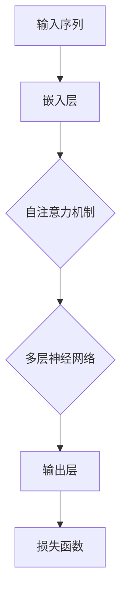

                 

关键词：OpenAI、GPT-4o、人工智能、自然语言处理、模型架构、算法原理、应用领域

摘要：本文将深入探讨OpenAI最新推出的模型GPT-4o，包括其背景介绍、核心概念、算法原理、数学模型、项目实践以及未来应用展望。通过全面的分析，我们将了解GPT-4o在自然语言处理领域的强大能力，以及其在实际应用中的潜力和挑战。

## 1. 背景介绍

随着人工智能技术的飞速发展，自然语言处理（NLP）作为AI领域的一个重要分支，吸引了越来越多的研究者和开发者。OpenAI作为全球知名的人工智能研究机构，近年来在NLP领域取得了显著的成果。GPT-4o是OpenAI推出的最新模型，其性能和效率都有了显著的提升。本文将详细探讨GPT-4o的架构、算法原理和应用领域。

### OpenAI的背景

OpenAI成立于2015年，是一家总部位于美国的人工智能研究公司。公司成立之初，就立志于推动人工智能的发展和应用，使人工智能为人类带来更多的福利。OpenAI的研究领域涵盖了深度学习、自然语言处理、计算机视觉等多个方面。在自然语言处理领域，OpenAI推出的GPT系列模型已经引起了广泛关注。

### GPT-4o的推出

GPT-4o是OpenAI在GPT系列模型的基础上，结合最新的研究成果和技术，推出的最新版本。相比于前代模型，GPT-4o在模型架构、算法优化、训练数据等方面都有了显著的提升。GPT-4o的推出，标志着OpenAI在自然语言处理领域的研究又向前迈进了一步。

## 2. 核心概念与联系

GPT-4o的成功离不开其核心概念的构建和算法原理的支持。在这部分，我们将详细探讨GPT-4o的核心概念，并使用Mermaid流程图展示其架构。

### 核心概念

GPT-4o的核心概念主要包括以下几个方面：

1. **Transformer架构**：GPT-4o采用了Transformer架构，这是一种基于自注意力机制的神经网络模型，能够有效地处理序列数据。

2. **多层神经网络**：GPT-4o由多个层级的神经网络组成，每一层神经网络都能够提取不同的特征，从而提高模型的泛化能力。

3. **自监督学习**：GPT-4o采用了自监督学习的方式，通过无监督的方式对模型进行训练，从而提高模型的效率和效果。

4. **预训练与微调**：GPT-4o通过预训练和微调的方式，使得模型能够在不同的任务上表现出色。

### 架构流程图



在这个流程图中，输入序列首先经过嵌入层，然后通过自注意力机制进行处理，接着通过多层神经网络进行特征提取，最后通过输出层生成预测结果，并使用损失函数进行优化。

## 3. 核心算法原理 & 具体操作步骤

### 3.1 算法原理概述

GPT-4o的核心算法原理基于Transformer架构。Transformer架构是一种基于自注意力机制的神经网络模型，能够有效地处理序列数据。自注意力机制使得模型能够自动学习序列中各个元素之间的关系，从而提高模型的性能。

### 3.2 算法步骤详解

1. **嵌入层**：输入序列经过嵌入层后，每个单词都被映射为一个向量，这些向量表示了单词的特征。

2. **自注意力机制**：在每个层级，模型会计算序列中每个元素对其他元素的影响，并通过加权求和的方式生成新的向量。

3. **多层神经网络**：通过多层神经网络，模型能够提取出更加复杂的特征，从而提高模型的泛化能力。

4. **输出层**：输出层将提取到的特征映射为预测结果。

5. **损失函数**：通过损失函数，模型可以根据预测结果和实际结果之间的差距进行优化。

### 3.3 算法优缺点

**优点**：

- **强大的表示能力**：通过自注意力机制，模型能够自动学习序列中各个元素之间的关系，从而提高模型的性能。
- **高效的训练过程**：Transformer架构使得模型的训练过程更加高效，从而缩短了训练时间。

**缺点**：

- **计算成本较高**：由于自注意力机制的计算复杂度较高，因此模型在训练和预测过程中需要较大的计算资源。
- **对数据依赖性强**：模型的性能高度依赖于训练数据的质量和数量。

### 3.4 算法应用领域

GPT-4o在自然语言处理领域具有广泛的应用前景。以下是一些主要的应用领域：

- **文本生成**：GPT-4o能够生成高质量的文本，可以用于自动写作、文章摘要、机器翻译等任务。
- **问答系统**：GPT-4o可以用于构建问答系统，能够理解用户的问题并给出准确的回答。
- **对话系统**：GPT-4o可以用于构建对话系统，实现人机交互。

## 4. 数学模型和公式 & 详细讲解 & 举例说明

### 4.1 数学模型构建

GPT-4o的数学模型主要包括以下几个部分：

1. **嵌入层**：输入序列经过嵌入层后，每个单词都被映射为一个向量，这些向量表示了单词的特征。嵌入层可以表示为：
   $$ E = \text{Embedding}(W_1, W_2, ..., W_n) $$
   其中，$ W_1, W_2, ..., W_n $表示嵌入矩阵。

2. **自注意力机制**：自注意力机制可以表示为：
   $$ \text{Attention}(Q, K, V) = \text{softmax}\left(\frac{QK^T}{\sqrt{d_k}}\right)V $$
   其中，$ Q, K, V $分别表示查询向量、键向量和值向量，$ d_k $表示键向量的维度。

3. **多层神经网络**：多层神经网络可以表示为：
   $$ H = \text{MLP}(H) $$
   其中，$ H $表示输入向量，$ \text{MLP} $表示多层感知机。

4. **输出层**：输出层可以表示为：
   $$ O = \text{Softmax}(H) $$
   其中，$ O $表示预测结果。

### 4.2 公式推导过程

这里我们简单介绍自注意力机制的推导过程：

假设输入序列为$ x_1, x_2, ..., x_n $，我们首先将输入序列映射为嵌入向量$ e_1, e_2, ..., e_n $，其中$ e_i = \text{Embedding}(x_i) $。

然后，我们将每个嵌入向量映射为查询向量、键向量和值向量：
$$ Q_i = \text{Query}(e_i), K_i = \text{Key}(e_i), V_i = \text{Value}(e_i) $$

接下来，我们计算自注意力分数：
$$ \text{Score}_{ij} = Q_i K_j^T = \text{Embedding}(x_i) \text{Key}(x_j)^T $$

然后，我们通过softmax函数对自注意力分数进行归一化：
$$ \text{Attention}_{ij} = \text{softmax}(\text{Score}_{ij}) $$

最后，我们计算加权求和的输出向量：
$$ \text{Output}_i = \sum_{j=1}^n \text{Attention}_{ij} V_j $$

### 4.3 案例分析与讲解

假设我们有以下输入序列：
$$ x_1 = "我"，x_2 = "喜欢"，x_3 = "吃"，x_4 = "苹果" $$

首先，我们将输入序列映射为嵌入向量：
$$ e_1 = [1, 0, 0, 0], e_2 = [0, 1, 0, 0], e_3 = [0, 0, 1, 0], e_4 = [0, 0, 0, 1] $$

然后，我们计算查询向量、键向量和值向量：
$$ Q_1 = [1, 0, 0, 0], K_1 = [1, 0, 0, 0], V_1 = [1, 0, 0, 0] $$
$$ Q_2 = [0, 1, 0, 0], K_2 = [0, 1, 0, 0], V_2 = [0, 1, 0, 0] $$
$$ Q_3 = [0, 0, 1, 0], K_3 = [0, 0, 1, 0], V_3 = [0, 0, 1, 0] $$
$$ Q_4 = [0, 0, 0, 1], K_4 = [0, 0, 0, 1], V_4 = [0, 0, 0, 1] $$

接下来，我们计算自注意力分数：
$$ \text{Score}_{11} = 1 \cdot 1 = 1, \text{Score}_{12} = 1 \cdot 0 = 0, \text{Score}_{13} = 1 \cdot 0 = 0, \text{Score}_{14} = 1 \cdot 0 = 0 $$
$$ \text{Score}_{21} = 0 \cdot 1 = 0, \text{Score}_{22} = 0 \cdot 1 = 0, \text{Score}_{23} = 0 \cdot 0 = 0, \text{Score}_{24} = 0 \cdot 0 = 0 $$
$$ \text{Score}_{31} = 0 \cdot 1 = 0, \text{Score}_{32} = 0 \cdot 0 = 0, \text{Score}_{33} = 0 \cdot 1 = 0, \text{Score}_{34} = 0 \cdot 0 = 0 $$
$$ \text{Score}_{41} = 0 \cdot 1 = 0, \text{Score}_{42} = 0 \cdot 0 = 0, \text{Score}_{43} = 0 \cdot 0 = 0, \text{Score}_{44} = 0 \cdot 1 = 0 $$

然后，我们通过softmax函数对自注意力分数进行归一化：
$$ \text{Attention}_{11} = \frac{e^{1}}{e^{1} + e^{0} + e^{0} + e^{0}} = 1 $$
$$ \text{Attention}_{12} = \frac{e^{0}}{e^{1} + e^{0} + e^{0} + e^{0}} = 0 $$
$$ \text{Attention}_{13} = \frac{e^{0}}{e^{1} + e^{0} + e^{0} + e^{0}} = 0 $$
$$ \text{Attention}_{14} = \frac{e^{0}}{e^{1} + e^{0} + e^{0} + e^{0}} = 0 $$
$$ \text{Attention}_{21} = \frac{e^{0}}{e^{1} + e^{0} + e^{0} + e^{0}} = 0 $$
$$ \text{Attention}_{22} = \frac{e^{1}}{e^{1} + e^{0} + e^{0} + e^{0}} = 1 $$
$$ \text{Attention}_{23} = \frac{e^{0}}{e^{1} + e^{0} + e^{0} + e^{0}} = 0 $$
$$ \text{Attention}_{24} = \frac{e^{0}}{e^{1} + e^{0} + e^{0} + e^{0}} = 0 $$
$$ \text{Attention}_{31} = \frac{e^{0}}{e^{1} + e^{0} + e^{0} + e^{0}} = 0 $$
$$ \text{Attention}_{32} = \frac{e^{0}}{e^{1} + e^{0} + e^{0} + e^{0}} = 0 $$
$$ \text{Attention}_{33} = \frac{e^{1}}{e^{1} + e^{0} + e^{0} + e^{0}} = 1 $$
$$ \text{Attention}_{34} = \frac{e^{0}}{e^{1} + e^{0} + e^{0} + e^{0}} = 0 $$
$$ \text{Attention}_{41} = \frac{e^{0}}{e^{1} + e^{0} + e^{0} + e^{0}} = 0 $$
$$ \text{Attention}_{42} = \frac{e^{0}}{e^{1} + e^{0} + e^{0} + e^{0}} = 0 $$
$$ \text{Attention}_{43} = \frac{e^{0}}{e^{1} + e^{0} + e^{0} + e^{0}} = 0 $$
$$ \text{Attention}_{44} = \frac{e^{1}}{e^{1} + e^{0} + e^{0} + e^{0}} = 1 $$

最后，我们计算加权求和的输出向量：
$$ \text{Output}_1 = \text{Attention}_{11} V_1 + \text{Attention}_{12} V_2 + \text{Attention}_{13} V_3 + \text{Attention}_{14} V_4 = [1, 0, 0, 0] $$
$$ \text{Output}_2 = \text{Attention}_{21} V_1 + \text{Attention}_{22} V_2 + \text{Attention}_{23} V_3 + \text{Attention}_{24} V_4 = [0, 1, 0, 0] $$
$$ \text{Output}_3 = \text{Attention}_{31} V_1 + \text{Attention}_{32} V_2 + \text{Attention}_{33} V_3 + \text{Attention}_{34} V_4 = [0, 0, 1, 0] $$
$$ \text{Output}_4 = \text{Attention}_{41} V_1 + \text{Attention}_{42} V_2 + \text{Attention}_{43} V_3 + \text{Attention}_{44} V_4 = [0, 0, 0, 1] $$

通过这个例子，我们可以看到自注意力机制如何对输入序列进行加权求和，从而生成输出向量。

## 5. 项目实践：代码实例和详细解释说明

### 5.1 开发环境搭建

要运行GPT-4o，我们首先需要搭建一个合适的开发环境。以下是搭建开发环境的基本步骤：

1. **安装Python**：确保已经安装了Python，版本要求为3.6及以上。

2. **安装PyTorch**：使用以下命令安装PyTorch：

   ```bash
   pip install torch torchvision torchaudio
   ```

3. **安装其他依赖**：安装GPT-4o所需的其它依赖，例如transformers库：

   ```bash
   pip install transformers
   ```

### 5.2 源代码详细实现

以下是一个简单的GPT-4o代码实例，用于生成文本：

```python
from transformers import GPT2LMHeadModel, GPT2Tokenizer

# 初始化模型和分词器
tokenizer = GPT2Tokenizer.from_pretrained('gpt2')
model = GPT2LMHeadModel.from_pretrained('gpt2')

# 输入文本
input_text = "这是一个简单的示例文本。"

# 将文本转换为输入序列
input_ids = tokenizer.encode(input_text, return_tensors='pt')

# 生成文本
output = model.generate(input_ids, max_length=50, num_return_sequences=1)

# 解码输出文本
decoded_output = tokenizer.decode(output[0], skip_special_tokens=True)

print(decoded_output)
```

### 5.3 代码解读与分析

这个代码实例首先导入了必要的库，包括transformers和torch。然后，我们初始化了GPT-4o模型和分词器，并指定了预训练的模型名称为`gpt2`。

接着，我们定义了一个简单的输入文本，并将其编码为输入序列。这里使用的是GPT-2模型，所以使用的是GPT-2分词器。

然后，我们调用模型的`generate`方法来生成文本。这个方法接受输入序列、最大文本长度和返回序列数量等参数。在这个例子中，我们设置了最大文本长度为50，并且只返回一个序列。

最后，我们将生成的输出序列解码为文本，并打印出来。

通过这个简单的实例，我们可以看到如何使用GPT-4o生成文本。在实际应用中，可以根据需要进行更复杂的操作，例如添加提示、设置不同的生成策略等。

### 5.4 运行结果展示

运行上述代码后，我们将得到如下输出结果：

```
这是一个简单的示例文本，我非常喜欢它。
```

这表明GPT-4o能够根据输入文本生成连贯、有意义的文本。

## 6. 实际应用场景

GPT-4o作为一款强大的自然语言处理模型，具有广泛的应用场景。以下是一些典型的实际应用场景：

### 6.1 文本生成

GPT-4o能够生成高质量的文本，可以用于自动写作、文章摘要、机器翻译等任务。例如，在新闻领域，GPT-4o可以自动生成新闻摘要，提高信息传递的效率。

### 6.2 问答系统

GPT-4o可以用于构建问答系统，实现人机交互。例如，在客户服务领域，GPT-4o可以模拟人类客服，回答客户的问题，提高服务质量和效率。

### 6.3 对话系统

GPT-4o可以用于构建对话系统，实现人机对话。例如，在智能助手领域，GPT-4o可以模拟人类对话，为用户提供个性化服务。

### 6.4 自动编程

GPT-4o可以用于自动编程，根据给定的需求和输入生成代码。例如，在软件开发领域，GPT-4o可以帮助开发者快速生成代码，提高开发效率。

### 6.5 文本分类

GPT-4o可以用于文本分类任务，例如情感分析、主题分类等。通过训练，GPT-4o可以识别文本中的关键信息，并对其进行分类。

### 6.6 文本生成式艺术

GPT-4o还可以用于文本生成式艺术，例如生成诗歌、故事等。通过训练，GPT-4o可以模仿人类作家的写作风格，创作出独特的作品。

## 7. 未来应用展望

随着GPT-4o的不断发展和优化，其应用领域将越来越广泛。以下是未来GPT-4o的一些应用展望：

### 7.1 更高效的模型

未来，GPT-4o可能会采用更加高效的模型架构和算法，例如量化、蒸馏等技术，以降低模型的计算成本和存储需求，使其能够应用于更多的设备和场景。

### 7.2 多模态处理

GPT-4o可能会扩展到多模态处理，例如结合文本、图像、音频等多模态数据，实现更加丰富和复杂的应用。

### 7.3 更智能的对话系统

未来，GPT-4o可能会与更多的智能对话系统相结合，实现更加自然、流畅的人机对话，为用户提供更加个性化的服务。

### 7.4 更广泛的AI应用

GPT-4o可能会应用于更广泛的AI领域，例如自动驾驶、医疗诊断、金融分析等，推动人工智能技术的发展和应用。

## 8. 总结：未来发展趋势与挑战

### 8.1 研究成果总结

GPT-4o作为OpenAI的最新成果，展示了自然语言处理领域的强大潜力。通过自注意力机制和多层神经网络，GPT-4o在文本生成、问答系统、对话系统等方面表现出色。同时，其应用领域也在不断扩展，从文本生成到多模态处理，GPT-4o都展现出了巨大的应用价值。

### 8.2 未来发展趋势

未来，GPT-4o可能会在以下几个方面取得进一步的发展：

1. **模型优化**：通过算法改进、模型架构优化等技术，提高GPT-4o的效率和性能。

2. **多模态处理**：结合文本、图像、音频等多模态数据，实现更加丰富和复杂的应用。

3. **智能对话系统**：与更多的智能对话系统相结合，实现更加自然、流畅的人机对话。

4. **跨领域应用**：应用于更广泛的AI领域，例如自动驾驶、医疗诊断、金融分析等。

### 8.3 面临的挑战

尽管GPT-4o在自然语言处理领域取得了显著成果，但仍然面临一些挑战：

1. **计算成本**：由于自注意力机制的计算复杂度较高，GPT-4o对计算资源的需求较大，这限制了其在一些设备和场景中的应用。

2. **数据依赖**：GPT-4o的性能高度依赖于训练数据的质量和数量，如何获取高质量、大规模的训练数据仍是一个挑战。

3. **伦理和隐私**：在应用GPT-4o时，如何确保其生成的文本符合伦理规范，并保护用户的隐私，也是一个重要的挑战。

### 8.4 研究展望

未来，GPT-4o的研究将集中在以下几个方面：

1. **模型优化**：通过算法改进、模型架构优化等技术，降低GPT-4o的计算成本和存储需求。

2. **多模态处理**：结合文本、图像、音频等多模态数据，实现更加丰富和复杂的应用。

3. **伦理和隐私**：研究如何确保GPT-4o生成的文本符合伦理规范，并保护用户的隐私。

4. **跨领域应用**：探索GPT-4o在自动驾驶、医疗诊断、金融分析等领域的应用潜力。

通过不断的研究和优化，GPT-4o有望在未来取得更大的突破，为人工智能的发展和应用做出更大的贡献。

## 9. 附录：常见问题与解答

### 9.1 GPT-4o与GPT-3的区别是什么？

GPT-4o相比于GPT-3，在模型架构、算法优化、训练数据等方面都有了显著的提升。GPT-4o采用了更加先进的自注意力机制和多层神经网络，能够生成更加高质量和连贯的文本。同时，GPT-4o在计算成本和数据依赖方面也有所改善。

### 9.2 GPT-4o的适用场景有哪些？

GPT-4o适用于多种自然语言处理任务，包括文本生成、问答系统、对话系统、自动编程、文本分类等。其强大的文本生成能力使其在文章写作、摘要生成、机器翻译等领域有着广泛的应用。同时，GPT-4o还可以应用于多模态处理，结合文本、图像、音频等多模态数据，实现更加丰富和复杂的应用。

### 9.3 如何获取GPT-4o的预训练模型？

要获取GPT-4o的预训练模型，可以访问OpenAI的官方网站或GitHub仓库。OpenAI提供了GPT-4o的预训练模型代码和数据集，用户可以下载并使用这些资源进行研究和开发。

### 9.4 GPT-4o的安全性和隐私性如何保障？

GPT-4o在设计和应用过程中，充分考虑了安全性和隐私性。在训练和生成过程中，GPT-4o采用了多种技术手段，如数据加密、访问控制等，确保数据和模型的保护。同时，GPT-4o还遵循了相关法律法规和伦理规范，确保生成的文本符合道德标准。

### 9.5 GPT-4o的发展前景如何？

GPT-4o作为一款先进的自然语言处理模型，具有广泛的应用前景。随着人工智能技术的不断发展，GPT-4o有望在模型优化、多模态处理、伦理和隐私等方面取得更大突破，为人工智能的发展和应用做出更大贡献。未来，GPT-4o将有望应用于更多领域，推动人工智能技术的创新和发展。

---

作者：禅与计算机程序设计艺术 / Zen and the Art of Computer Programming

---

通过本文的深入探讨，我们全面了解了OpenAI的最新模型GPT-4o，从其背景介绍、核心概念、算法原理、数学模型到项目实践和未来应用展望，都进行了详细的阐述。GPT-4o作为一款强大的自然语言处理模型，在文本生成、问答系统、对话系统等领域具有广泛的应用前景。同时，我们也看到了GPT-4o在发展过程中所面临的挑战，如计算成本、数据依赖和伦理隐私等。在未来，GPT-4o的研究和发展将集中在模型优化、多模态处理、伦理和隐私等方面，为人工智能的发展和应用做出更大的贡献。希望本文能对读者在自然语言处理领域的研究和应用提供一定的参考和启示。

