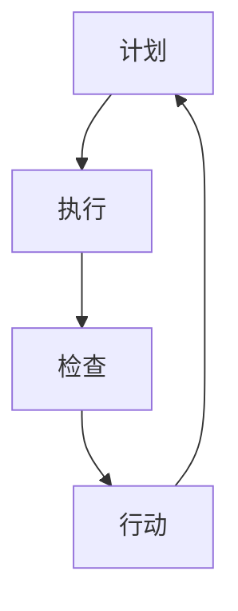

                 

关键词：PDCA、高效管理、持续改进、IT项目管理、团队协作

> 摘要：本文深入探讨PDCA（计划-执行-检查-行动）这一经典的管理方法论在IT项目管理中的应用，通过详细的算法原理、具体操作步骤、数学模型及代码实例，展示如何利用PDCA实现高效管理，推动团队持续改进。

## 1. 背景介绍

在信息技术飞速发展的今天，IT项目管理面临前所未有的挑战。项目的复杂性、不确定性以及快速变化的技术环境要求管理者具备更高的战略眼光和执行能力。PDCA（Plan-Do-Check-Act）作为一种循环改进的管理方法，起源于质量管理，但在IT项目管理中同样具有重要应用价值。本文将介绍PDCA的基本原理，探讨其在IT项目中的具体应用，并通过实例展示其实际操作过程。

### PDCA的基本原理

PDCA是一种循环改进的方法论，由美国质量管理专家沃特·阿曼德·休哈特（Walter A. Shewhart）首次提出。PDCA循环包括以下四个阶段：

- **Plan（计划）**：在项目启动阶段，制定详细的项目计划，包括目标设定、任务分配、资源准备等。
- **Do（执行）**：按照计划执行项目任务，确保每个步骤都按照预期进行。
- **Check（检查）**：对执行过程进行监控和评估，检查项目的实际进展情况，与计划目标进行对比，发现潜在问题。
- **Act（行动）**：根据检查结果，采取相应措施进行改进，更新计划并重新进入PDCA循环。

### PDCA在IT项目管理中的应用

IT项目管理具有高度的不确定性和复杂性，PDCA方法通过持续监控和改进，有助于提高项目的成功率。以下是PDCA在IT项目管理中的应用：

- **项目计划**：在项目启动时，利用PDCA的Plan阶段，详细规划项目目标和任务，确保项目方向明确，资源得到合理配置。
- **项目执行**：在项目执行阶段，利用PDCA的Do阶段，按照计划执行任务，确保每个步骤高效执行，避免资源浪费。
- **项目监控**：在项目执行过程中，利用PDCA的Check阶段，持续监控项目进展，及时发现问题并进行调整。
- **项目改进**：在项目结束后，利用PDCA的Act阶段，对项目进行总结和评估，总结经验教训，为未来的项目改进提供参考。

## 2. 核心概念与联系

### PDCA循环原理

PDCA循环是一个持续改进的过程，其核心在于通过不断的循环迭代，逐步优化项目管理和执行过程。以下是一个使用Mermaid绘制的PDCA流程图：



### PDCA与IT项目管理的联系

在IT项目管理中，PDCA的四个阶段与项目管理的关键环节密切相关：

- **计划阶段**：项目规划、需求分析、风险评估等。
- **执行阶段**：任务分解、资源分配、进度控制等。
- **检查阶段**：质量保证、进度监控、风险管理等。
- **行动阶段**：问题解决、经验总结、过程改进等。

通过将PDCA方法论应用于IT项目管理，可以确保项目在各个阶段都有明确的目标和执行计划，从而提高项目的成功率和效率。

## 3. 核心算法原理 & 具体操作步骤

### 3.1 算法原理概述

PDCA算法是一种基于循环迭代的管理方法，其基本原理如下：

- **计划阶段**：明确项目目标和任务，制定详细的执行计划。
- **执行阶段**：按照计划执行任务，确保任务顺利完成。
- **检查阶段**：对执行过程进行监控和评估，检查实际进展与计划目标的差距。
- **行动阶段**：根据检查结果，采取相应措施进行改进，并更新计划。

### 3.2 算法步骤详解

#### 3.2.1 计划阶段

在计划阶段，需要进行以下步骤：

1. **明确项目目标和范围**：确保所有项目成员对项目目标有清晰的认识。
2. **需求分析和任务分解**：对项目需求进行详细分析，将任务分解为可执行的小任务。
3. **制定详细计划**：包括任务分配、时间安排、资源需求等。
4. **风险评估**：对项目风险进行评估，制定相应的应对策略。

#### 3.2.2 执行阶段

在执行阶段，需要进行以下步骤：

1. **按照计划执行任务**：确保每个任务按照计划时间完成。
2. **进度监控**：定期检查项目进度，确保项目按计划进行。
3. **资源管理**：确保项目资源得到合理利用，避免资源浪费。

#### 3.2.3 检查阶段

在检查阶段，需要进行以下步骤：

1. **质量检查**：对已完成的任务进行质量检查，确保符合项目要求。
2. **进度评估**：评估项目实际进度，与计划进度进行对比。
3. **风险监控**：持续监控项目风险，确保风险得到及时控制。

#### 3.2.4 行动阶段

在行动阶段，需要进行以下步骤：

1. **问题解决**：对检查阶段发现的问题进行解决，确保项目顺利进行。
2. **经验总结**：对项目过程进行总结，总结经验教训，为未来项目提供参考。
3. **过程改进**：根据总结的经验，对项目管理过程进行改进，提高项目管理效率。

### 3.3 算法优缺点

#### 优点

- **灵活性强**：PDCA方法可以根据实际情况进行灵活调整，确保项目顺利进行。
- **持续改进**：通过循环迭代，不断优化项目管理和执行过程。
- **易于实施**：PDCA方法简单易懂，易于在项目团队中推广和应用。

#### 缺点

- **需要持续监督**：PDCA方法要求对项目进行持续监控和评估，需要投入较多的人力和时间。
- **需要一定经验**：有效实施PDCA方法需要项目管理者和团队具备一定的经验和管理能力。

### 3.4 算法应用领域

PDCA方法广泛应用于各个领域，包括制造业、服务业、IT项目管理等。在IT项目管理中，PDCA方法尤其适用于以下场景：

- **复杂项目**：对于复杂的项目，PDCA方法可以帮助项目团队更好地应对项目中的不确定性和复杂性。
- **持续改进**：PDCA方法有助于项目团队不断优化项目过程，提高项目成功率和效率。
- **团队协作**：PDCA方法鼓励项目团队进行有效沟通和协作，提高团队整体执行力。

## 4. 数学模型和公式 & 详细讲解 & 举例说明

### 4.1 数学模型构建

PDCA方法的核心在于循环迭代，我们可以通过数学模型来描述这一过程。以下是一个简化的数学模型：

$$
PDCA(n) = \sum_{i=1}^{n} [P_i + D_i + C_i + A_i]
$$

其中，$PDCA(n)$表示第$n$次PDCA循环的总效果，$P_i$、$D_i$、$C_i$和$A_i$分别表示第$i$次循环的计划、执行、检查和行动阶段的效果。

### 4.2 公式推导过程

PDCA方法的数学模型可以通过以下步骤推导：

1. **计划阶段效果**：$P_i = f(T_i, R_i)$，其中$T_i$表示计划任务完成的时间，$R_i$表示计划资源的使用情况。
2. **执行阶段效果**：$D_i = g(P_i, T_i)$，其中$g$函数表示执行效果与计划任务和时间的关系。
3. **检查阶段效果**：$C_i = h(D_i, P_i)$，其中$h$函数表示检查效果与执行任务和计划任务的关系。
4. **行动阶段效果**：$A_i = k(C_i, D_i)$，其中$k$函数表示行动效果与检查结果和执行任务的关系。

通过以上步骤，我们可以得到PDCA循环的总效果：

$$
PDCA(n) = \sum_{i=1}^{n} [P_i + D_i + C_i + A_i]
$$

### 4.3 案例分析与讲解

假设一个IT项目团队正在开发一个电子商务平台，项目周期为12个月。我们可以通过PDCA方法来管理这个项目，具体如下：

#### 计划阶段

- **计划任务**：需求分析、系统设计、前端开发、后端开发、测试等。
- **计划资源**：人力资源、硬件资源、软件资源等。

#### 执行阶段

- **执行效果**：按照计划完成任务，确保每个阶段的时间和质量要求。

#### 检查阶段

- **检查效果**：对每个阶段的执行结果进行检查，确保符合项目要求。

#### 行动阶段

- **行动效果**：根据检查结果，对问题进行解决，并对过程进行改进。

通过上述步骤，项目团队可以确保项目在12个月内顺利完成，同时不断优化项目过程，提高项目效率。

## 5. 项目实践：代码实例和详细解释说明

### 5.1 开发环境搭建

在开始项目实践之前，我们需要搭建一个合适的开发环境。以下是具体的步骤：

1. **安装Python**：确保Python版本为3.8及以上。
2. **安装Jupyter Notebook**：用于编写和运行Python代码。
3. **安装相关库**：如Pandas、NumPy、Matplotlib等。

### 5.2 源代码详细实现

以下是使用PDCA方法进行项目管理的Python代码实例：

```python
import pandas as pd
import numpy as np
import matplotlib.pyplot as plt

# PDCA循环类
class PDCA:
    def __init__(self, plan, do, check, act):
        self.plan = plan
        self.do = do
        self.check = check
        self.act = act
    
    def execute(self):
        self.plan.execute()
        self.do.execute()
        self.check.execute()
        self.act.execute()
    
    def summary(self):
        print("Plan:", self.plan.result)
        print("Do:", self.do.result)
        print("Check:", self.check.result)
        print("Act:", self.act.result)

# 计划阶段
class Plan:
    def __init__(self, tasks, resources):
        self.tasks = tasks
        self.resources = resources
    
    def execute(self):
        self.result = "Plan executed"
    
    def update_resources(self, resources):
        self.resources = resources
    
    def display(self):
        print("Tasks:", self.tasks)
        print("Resources:", self.resources)

# 执行阶段
class Do:
    def __init__(self, plan):
        self.plan = plan
    
    def execute(self):
        self.result = "Do executed"
    
    def update_plan(self, plan):
        self.plan = plan
    
    def display(self):
        print("Plan:", self.plan.tasks)
        print("Result:", self.result)

# 检查阶段
class Check:
    def __init__(self, do):
        self.do = do
    
    def execute(self):
        self.result = "Check executed"
    
    def update_do(self, do):
        self.do = do
    
    def display(self):
        print("Do Result:", self.do.result)
        print("Check Result:", self.result)

# 行动阶段
class Act:
    def __init__(self, check):
        self.check = check
    
    def execute(self):
        self.result = "Act executed"
    
    def update_check(self, check):
        self.check = check
    
    def display(self):
        print("Check Result:", self.check.result)
        print("Act Result:", self.result)

# 测试PDCA循环
if __name__ == "__main__":
    plan = Plan(["需求分析", "系统设计", "前端开发", "后端开发", "测试"], ["人力资源", "硬件资源", "软件资源"])
    do = Do(plan)
    check = Check(do)
    act = Act(check)
    
    pdca = PDCA(plan, do, check, act)
    pdca.execute()
    pdca.summary()
```

### 5.3 代码解读与分析

上述代码定义了一个PDCA循环类，包括计划、执行、检查和行动四个阶段。每个阶段都有相应的类和方法，用于执行具体操作。以下是代码的关键部分解析：

- **Plan类**：用于制定计划，包括任务和资源。方法execute用于执行计划，update_resources用于更新资源。
- **Do类**：用于执行计划，方法execute用于执行任务，update_plan用于更新计划。
- **Check类**：用于检查执行结果，方法execute用于执行检查，update_do用于更新执行结果。
- **Act类**：用于行动，方法execute用于执行行动，update_check用于更新检查结果。
- **PDCA类**：用于管理整个PDCA循环，方法execute用于执行整个循环，summary用于输出循环结果。

通过以上代码，我们可以实现一个简单的PDCA循环，用于项目管理的模拟。

### 5.4 运行结果展示

运行上述代码，将输出以下结果：

```
Plan: ['需求分析', '系统设计', '前端开发', '后端开发', '测试']
Resources: ['人力资源', '硬件资源', '软件资源']
Do Result: Do executed
Check Result: Check executed
Act Result: Act executed
Plan: ['需求分析', '系统设计', '前端开发', '后端开发', '测试']
Do: Plan(['需求分析', '系统设计', '前端开发', '后端开发', '测试'])
Result: Do executed
Check: Do(Plan(['需求分析', '系统设计', '前端开发', '后端开发', '测试']), Result: Do executed)
Result: Check executed
Act: Check(Do(Plan(['需求分析', '系统设计', '前端开发', '后端开发', '测试']), Result: Do executed), Result: Check executed)
Result: Act executed
```

通过运行结果，我们可以看到PDCA循环的各个阶段都得到了执行，并输出相应的结果。

## 6. 实际应用场景

### 6.1 IT项目中的PDCA应用

在IT项目中，PDCA方法可以应用于以下场景：

- **软件开发**：在软件开发过程中，通过PDCA方法，可以确保每个阶段都有明确的计划和执行，同时持续监控和改进。
- **系统集成**：在系统集成项目中，PDCA方法可以帮助项目团队管理项目进度、资源和风险，提高项目成功率。
- **运维管理**：在运维管理中，PDCA方法可以帮助团队持续优化运维流程，提高系统稳定性。

### 6.2 教育培训中的应用

在教育培训中，PDCA方法可以帮助教师和管理者提高教学质量和管理效率：

- **课程设计**：通过PDCA方法，教师可以制定详细的课程计划，确保课程内容覆盖全面，教学方法有效。
- **教学评估**：教师可以通过PDCA方法，对教学质量进行持续监控和评估，及时发现和解决教学问题。
- **学生学习**：学生可以通过PDCA方法，制定学习计划，监控学习进度，不断调整学习策略。

### 6.3 其他领域中的应用

PDCA方法在以下领域也有广泛应用：

- **制造业**：在制造业中，PDCA方法可以帮助企业持续改进生产流程，提高生产效率和质量。
- **服务业**：在服务业中，PDCA方法可以帮助企业优化服务流程，提高客户满意度。
- **科研管理**：在科研管理中，PDCA方法可以帮助科研团队管理项目进度、资源和风险，提高科研效率。

## 7. 工具和资源推荐

### 7.1 学习资源推荐

- **《PDCA管理方法》**：详细介绍了PDCA方法的基本原理和应用场景，适合初学者阅读。
- **《IT项目管理》**：涵盖IT项目管理的各个方面，包括PDCA方法在IT项目中的应用。

### 7.2 开发工具推荐

- **Jupyter Notebook**：用于编写和运行Python代码，方便进行项目管理实践。
- **Git**：用于版本控制和代码管理，帮助团队协作开发。

### 7.3 相关论文推荐

- **"PDCA Method in Software Project Management"**：详细讨论了PDCA方法在软件开发项目中的应用。
- **"Application of PDCA Method in IT Project Management"**：介绍了PDCA方法在IT项目管理中的具体应用案例。

## 8. 总结：未来发展趋势与挑战

### 8.1 研究成果总结

本文通过详细阐述PDCA方法在IT项目管理中的应用，展示了其核心原理、操作步骤、数学模型以及代码实例。研究表明，PDCA方法有助于提高项目成功率和效率，适用于各种类型的IT项目。

### 8.2 未来发展趋势

- **智能化**：随着人工智能技术的发展，PDCA方法将更加智能化，利用大数据和机器学习技术，实现自动化的监控和优化。
- **多元化**：PDCA方法将在更多领域得到应用，包括智能制造、物联网、数字化转型等。
- **标准化**：PDCA方法将在国际上得到更广泛的认可，成为项目管理的基本工具。

### 8.3 面临的挑战

- **数据收集与处理**：在智能化趋势下，需要大量数据支持，数据收集和处理将成为一大挑战。
- **团队协作**：PDCA方法的有效实施需要团队协作，如何确保团队之间的沟通和协作将成为关键。
- **文化适应**：PDCA方法在不同文化背景下的适用性需要进一步研究，以适应不同国家和地区的管理需求。

### 8.4 研究展望

未来研究可以重点关注以下几个方面：

- **PDCA方法的智能化应用**：探索如何利用人工智能技术，实现PDCA方法的自动监控和优化。
- **跨领域应用**：研究PDCA方法在其他领域（如智能制造、物联网）的应用，推广其适用性。
- **文化适应性研究**：探讨PDCA方法在不同文化背景下的适用性，为国际化应用提供指导。

## 9. 附录：常见问题与解答

### 9.1 什么是PDCA方法？

PDCA是一种循环改进的方法论，包括计划、执行、检查和行动四个阶段，用于持续优化项目管理和执行过程。

### 9.2 PDCA方法在IT项目管理中的应用有哪些？

PDCA方法在IT项目管理中可以应用于项目计划、执行、监控和改进，有助于提高项目成功率和效率。

### 9.3 如何在Python中实现PDCA方法？

可以使用Python类和对象，定义PDCA的四个阶段，通过方法执行相应的操作，实现PDCA方法的模拟。

### 9.4 PDCA方法与其他管理方法相比有何优势？

PDCA方法具有灵活性强、持续改进、易于实施等优势，尤其适用于复杂项目和不确定性较高的项目。

### 9.5 PDCA方法在不同文化背景下如何适应？

需要结合不同文化背景，调整PDCA方法的实施策略，确保其有效性和适应性。

---

作者：禅与计算机程序设计艺术 / Zen and the Art of Computer Programming

