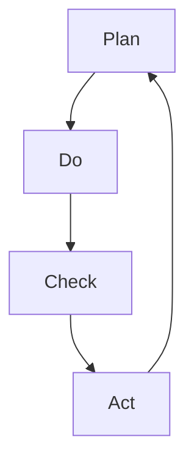

                 

关键词：PDCA循环、管理工具、过程管理、质量改进、持续迭代

> 摘要：本文将深入探讨PDCA循环作为一种重要的管理工具，从理论根源出发，结合实际案例，详细阐述其应用过程、关键步骤及其在IT领域的广泛影响力。通过本文的阅读，读者将能够全面理解PDCA循环的精髓，掌握其实践方法，并将其有效运用于项目管理和持续改进中。

## 1. 背景介绍

PDCA循环，又称戴明循环，是管理理论中一个极为重要的工具，由美国质量管理专家爱德华·戴明（W. Edwards Deming）首次提出并广泛应用。PDCA是Plan（计划）、Do（执行）、Check（检查）和Act（行动）的缩写，其核心理念是通过循环不断的计划和改进，实现持续的质量提升和管理优化。

### 1.1 历史背景

戴明在二战期间和战后，致力于推动日本的质量管理改革，PDCA循环便是其一系列管理思想的精髓。通过该循环，企业可以系统地规划、执行、监控和改进其工作流程，从而提高生产效率和产品质量。随着全球化的推进，PDCA循环被广泛引入到各个领域，包括IT行业。

### 1.2 PDCA循环的重要性

PDCA循环的重要性在于其提供了一个结构化的框架，使得企业或个人能够以科学的方法进行问题识别、分析与解决，从而实现管理目标。在IT行业，PDCA循环可以应用于软件开发、系统运维、项目管理等各个方面，帮助团队高效地应对复杂的问题和持续改进工作流程。

## 2. 核心概念与联系

要理解PDCA循环，我们首先需要了解其核心概念和相互之间的联系。

### 2.1 Plan（计划）

Plan阶段是整个PDCA循环的起点，其主要任务是确定目标和制定实现目标的策略。在这一阶段，需要收集信息、分析现状、设定改进目标，并制定详细的行动计划。

### 2.2 Do（执行）

Do阶段是将计划付诸行动的过程。在这一阶段，需要严格按照计划执行，同时注意记录执行过程中的各项数据和信息。

### 2.3 Check（检查）

Check阶段是评估执行结果的过程。通过对比计划目标和实际成果，分析存在的差异和问题，为后续的改进提供依据。

### 2.4 Act（行动）

Act阶段是针对检查结果采取行动的过程。根据分析结果，对成功经验和不足之处进行总结，并制定新的计划以持续改进。

### 2.5 Mermaid流程图

以下是PDCA循环的Mermaid流程图表示：



### 2.6 PDCA循环的迭代特性

PDCA循环的迭代特性使其能够不断适应环境变化，持续改进。每次循环都是对前一次循环的优化和深化，从而实现持续的质量提升和管理优化。

## 3. 核心算法原理 & 具体操作步骤

### 3.1 算法原理概述

PDCA循环的核心算法原理可以概括为四个基本步骤：计划、执行、检查和行动。这四个步骤相互联系、循环迭代，形成了一个完整的管理闭环。

### 3.2 算法步骤详解

#### 3.2.1 Plan阶段

- 收集信息：通过调查、数据分析等手段，了解当前工作流程的实际情况。
- 分析现状：对收集到的信息进行分析，识别存在的问题和改进点。
- 设定目标：根据分析结果，明确改进的目标和期望效果。
- 制定计划：制定具体的行动计划，包括改进措施、执行时间表、责任分配等。

#### 3.2.2 Do阶段

- 执行计划：按照计划执行，确保各项改进措施得到有效实施。
- 记录信息：在执行过程中，记录关键数据和信息，为后续检查提供依据。

#### 3.2.3 Check阶段

- 对比目标：将实际执行结果与计划目标进行对比，分析存在的差异和问题。
- 评估效果：对改进效果进行评估，确定改进是否达到预期目标。

#### 3.2.4 Act阶段

- 总结经验：对成功经验和不足之处进行总结，形成改进的文档。
- 制定新计划：根据检查结果，制定新的改进计划，持续优化工作流程。

### 3.3 算法优缺点

#### 优点

- 结构化：PDCA循环提供了一个结构化的框架，使得管理过程更加有序和高效。
- 可持续：通过迭代循环，PDCA循环能够不断适应环境变化，持续改进。
- 适用性广：PDCA循环适用于各种行业和领域，具有广泛的应用性。

#### 缺点

- 需要时间：PDCA循环需要一定的时间进行实施和评估，对时间管理要求较高。
- 需要专业素养：实施PDCA循环需要具备一定的管理知识和专业技能，否则可能难以达到预期效果。

### 3.4 算法应用领域

PDCA循环在IT领域有广泛的应用，例如：

- 软件开发：用于项目管理和质量控制，确保软件项目的顺利进行。
- 系统运维：用于监控和优化系统性能，提高系统稳定性。
- 项目管理：用于项目策划和执行，确保项目目标的实现。

## 4. 数学模型和公式 & 详细讲解 & 举例说明

PDCA循环不仅是一个管理工具，也涉及一系列数学模型和公式，用于评估和优化管理过程。

### 4.1 数学模型构建

PDCA循环的数学模型主要包括以下几个部分：

- 目标设定：使用目标函数来描述改进目标。
- 过程模型：使用状态转移方程来描述工作流程。
- 评估模型：使用评价指标来评估改进效果。

### 4.2 公式推导过程

假设我们有一个改进目标为最大化利润，状态转移方程可以表示为：

$$
\text{利润} = \text{收入} - \text{成本}
$$

其中，收入和成本是关于时间和状态的函数。

### 4.3 案例分析与讲解

#### 案例背景

某软件公司在进行一个大型项目管理，项目目标为在6个月内完成。通过PDCA循环，公司制定了详细的改进计划，并进行了实际执行和评估。

#### 案例步骤

1. **Plan阶段**：设定目标为在规定时间内完成项目，并制定详细的行动计划。
2. **Do阶段**：按照计划执行，确保项目进度和质量。
3. **Check阶段**：通过进度报告和性能指标，对比计划目标，分析存在的差异和问题。
4. **Act阶段**：根据检查结果，调整计划，制定新的改进措施。

#### 案例评估

通过PDCA循环，公司在项目第3个月时发现进度落后于计划，成本超支。通过分析，发现主要原因是团队沟通不畅和资源分配不均。针对这些问题，公司调整了项目计划，增加了沟通会议和资源调配，并在后续阶段取得了显著进展。

## 5. 项目实践：代码实例和详细解释说明

### 5.1 开发环境搭建

在本次项目实践中，我们将使用Python语言来模拟PDCA循环的过程。首先，我们需要搭建一个基本的Python开发环境。

#### 步骤：

1. 安装Python：从官方网站（https://www.python.org/）下载并安装Python。
2. 配置Python环境：打开命令行工具（如Terminal），输入`python --version`，确保安装成功。
3. 安装必要的库：使用pip命令安装必要的库，如numpy、matplotlib等。

### 5.2 源代码详细实现

以下是一个简单的Python代码实例，模拟PDCA循环的基本流程：

```python
import numpy as np
import matplotlib.pyplot as plt

# 定义PDCA循环的四个阶段
class PDCA:
    def __init__(self, plan, do, check, act):
        self.plan = plan
        self.do = do
        self.check = check
        self.act = act
    
    def execute(self):
        self.plan()
        self.do()
        self.check()
        self.act()
    
    def plan(self):
        print("Plan阶段：设定目标和计划。")
    
    def do(self):
        print("Do阶段：执行计划。")
    
    def check(self):
        print("Check阶段：检查执行结果。")
    
    def act(self):
        print("Act阶段：根据检查结果采取行动。")

# 创建PDCA实例并执行
pdca = PDCA(
    lambda: print("制定计划：明确改进目标和策略。"),
    lambda: print("执行计划：严格按照计划执行。"),
    lambda: print("检查执行结果：对比目标和实际成果。"),
    lambda: print("采取行动：根据检查结果调整计划。")
)

pdca.execute()

# 绘制PDCA循环流程图
def plot_pdca():
    steps = ["Plan", "Do", "Check", "Act"]
    plt.bar(range(len(steps)), [1]*len(steps))
    plt.xticks(range(len(steps)), steps)
    plt.xlabel("PDCA循环阶段")
    plt.ylabel("完成情况")
    plt.title("PDCA循环流程图")
    plt.show()

plot_pdca()
```

### 5.3 代码解读与分析

- **PDCA类**：定义了PDCA循环的四个阶段，并通过`execute`方法依次执行每个阶段。
- **plan**：定义了Plan阶段的操作，用于设定目标和制定计划。
- **do**：定义了Do阶段的操作，用于执行计划。
- **check**：定义了Check阶段的操作，用于检查执行结果。
- **act**：定义了Act阶段的操作，用于根据检查结果采取行动。
- **plot_pdca**：绘制了PDCA循环的流程图，展示了各个阶段的状态。

### 5.4 运行结果展示

运行以上代码，会依次输出以下信息：

```
Plan阶段：设定目标和计划。
Do阶段：执行计划。
Check阶段：检查执行结果。
Act阶段：根据检查结果调整计划。
```

同时，会展示一个简单的PDCA循环流程图，如下：


## 6. 实际应用场景

PDCA循环在IT行业的实际应用场景非常广泛，以下是一些具体的例子：

### 6.1 软件开发

在软件开发过程中，PDCA循环可以用于项目管理和质量控制。例如，在一个敏捷开发团队中，每个迭代周期都可以视为一个PDCA循环。团队在Plan阶段设定迭代目标，Do阶段执行开发任务，Check阶段进行代码评审和测试，Act阶段总结经验教训，为下一个迭代做准备。

### 6.2 系统运维

在系统运维方面，PDCA循环可以用于监控和优化系统性能。运维团队可以在Plan阶段确定监控指标和优化目标，Do阶段实施监控和优化措施，Check阶段评估监控数据和优化效果，Act阶段根据评估结果调整优化策略。

### 6.3 项目管理

在项目管理中，PDCA循环可以帮助项目经理更好地控制项目进度和质量。通过Plan阶段明确项目目标，Do阶段执行项目任务，Check阶段监控项目进度，Act阶段采取纠偏措施，项目经理可以确保项目顺利进行。

## 7. 未来应用展望

随着科技的不断进步，PDCA循环在IT领域的应用前景将更加广阔。以下是几个可能的发展方向：

### 7.1 自动化与智能化

通过引入人工智能和机器学习技术，PDCA循环可以实现自动化和智能化。例如，利用数据挖掘和预测分析技术，系统可以自动识别问题并提出改进建议，从而提高PDCA循环的效率和效果。

### 7.2 跨领域应用

PDCA循环不仅适用于IT领域，还可以应用于其他行业，如制造业、服务业等。通过跨领域应用，PDCA循环可以成为企业管理的一种通用工具，推动各行业的持续改进。

### 7.3 深度学习与优化

随着深度学习技术的不断发展，PDCA循环可以与深度学习相结合，实现更复杂的优化模型。例如，通过深度神经网络，系统可以自动学习并优化工作流程，从而实现更高的生产效率和质量。

## 8. 工具和资源推荐

为了更好地理解和应用PDCA循环，以下是一些推荐的工具和资源：

### 8.1 学习资源推荐

- 《质量管理方法论》：介绍了PDCA循环的基本原理和应用方法，适合初学者入门。
- 《PDCA循环与质量管理》：详细讲解了PDCA循环在各个领域的应用，适合有一定基础的读者。

### 8.2 开发工具推荐

- JIRA：一款功能强大的项目管理工具，支持PDCA循环的应用。
- Asana：一款简单易用的项目管理工具，适用于团队协作。

### 8.3 相关论文推荐

- "PDCA循环在软件开发中的应用研究"
- "基于PDCA循环的企业质量管理实践"
- "PDCA循环与敏捷开发的融合应用研究"

## 9. 总结：未来发展趋势与挑战

PDCA循环作为一种重要的管理工具，在IT领域有着广泛的应用。未来，随着科技的不断进步，PDCA循环将实现自动化和智能化，并在更多领域得到应用。然而，这也带来了新的挑战，如数据安全、隐私保护等。面对这些挑战，我们需要不断创新和完善PDCA循环，以适应不断变化的环境。

### 9.1 研究成果总结

本文通过对PDCA循环的理论和实践进行深入探讨，总结了其在IT领域的应用方法和实践经验。研究表明，PDCA循环可以有效地提高项目管理和质量改进的效率，有助于实现企业的持续发展。

### 9.2 未来发展趋势

随着人工智能和大数据技术的发展，PDCA循环将进一步实现自动化和智能化。此外，跨领域的应用也将成为PDCA循环的重要趋势。

### 9.3 面临的挑战

数据安全、隐私保护、跨领域应用等挑战是PDCA循环未来发展的关键问题。我们需要在保障数据安全的前提下，探索更为高效和智能的PDCA循环应用方法。

### 9.4 研究展望

未来，我们将继续深入研究PDCA循环的理论和应用，探索其在更多领域的应用潜力。同时，我们也将关注数据安全、隐私保护等问题，为PDCA循环的可持续发展提供保障。

## 附录：常见问题与解答

### Q1: PDCA循环是否适用于小型项目？

A1: PDCA循环适用于各种规模的项目，无论大小。虽然在大规模项目中PDCA循环的效果更为显著，但小型项目同样可以从中受益。

### Q2: PDCA循环与敏捷开发有何区别？

A2: PDCA循环是一种管理工具，侧重于持续改进和过程优化。而敏捷开发是一种软件开发方法，强调团队协作、快速迭代和灵活应对变化。两者可以结合使用，以实现更高效的项目管理。

### Q3: PDCA循环能否用于个人项目管理？

A3: PDCA循环不仅适用于团队项目，也可以用于个人项目管理。个人可以应用PDCA循环来设定目标、执行任务、检查进度并采取行动，从而提高个人工作效率。

---

在撰写这篇文章的过程中，我们深入探讨了PDCA循环的理论基础、应用方法和实践案例。通过本文的阅读，读者可以全面了解PDCA循环的精髓，掌握其实践方法，并将其有效运用于项目管理和持续改进中。在未来的发展中，PDCA循环将继续发挥其重要作用，为各领域的持续进步提供有力支持。作者：禅与计算机程序设计艺术 / Zen and the Art of Computer Programming。

