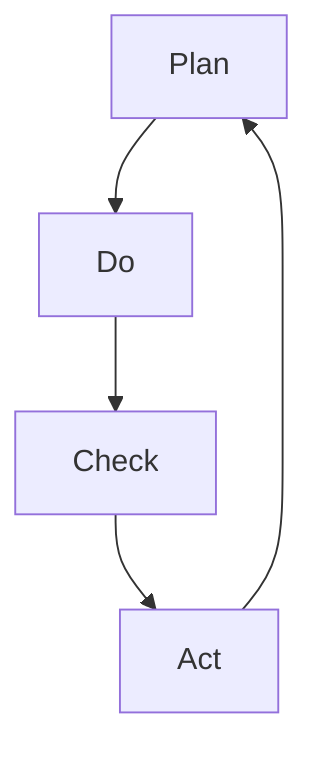

                 

关键词：PDCA循环、质量管理、持续改进、方法论、戴明环、过程管理

摘要：本文将深入探讨PDCA戴明环这一经典的质量管理工具，从其历史背景、核心概念、具体实施步骤到实际应用场景，全面解析其在现代IT领域的实用价值。通过实例和数学模型的支撑，读者将了解如何将PDCA环有效应用于软件开发、项目管理等具体领域，以实现持续改进和卓越绩效。

## 1. 背景介绍

PDCA循环，也称为戴明环，起源于20世纪中叶，由美国统计学家、管理学家威廉·爱德华·戴明（William Edwards Deming）提出。戴明博士在日本二战后推动质量管理的革命，将其视为企业持续改进的基石。PDCA循环由四个阶段组成：计划（Plan）、执行（Do）、检查（Check）和行动（Act）。这一循环强调在管理过程中不断迭代和优化，以达到质量控制和持续改进的目标。

PDCA循环的核心在于其循环性。每个阶段的结果都会反馈到下一个阶段，形成闭环，从而确保管理过程不断迭代和完善。这种循环不仅仅是质量管理的工具，更是一种系统化的思维方式，适用于各种类型的管理活动。

## 2. 核心概念与联系

### 2.1 PDCA循环的核心概念

PDCA循环的四个阶段分别代表不同的任务和目标：

**计划（Plan）**：在这个阶段，确定目标和制定行动计划。这包括问题定义、目标设定、资源分配和策略规划。

**执行（Do）**：在这个阶段，执行计划，执行任务，将计划转化为实际行动。

**检查（Check）**：在这个阶段，对执行结果进行检查和评估。这包括收集数据、分析结果，并与预期目标进行比较。

**行动（Act）**：在这个阶段，根据检查结果采取行动。这包括识别偏差、采取纠正措施，并优化流程。

### 2.2 PDCA循环的Mermaid流程图

下面是PDCA循环的Mermaid流程图：



在这个流程图中，每个节点都代表PDCA循环的一个阶段，箭头表示流程的顺序。这个图简洁明了，有助于理解和记忆PDCA循环的基本结构。

### 2.3 PDCA循环与质量管理的关系

PDCA循环是质量管理的关键工具。它通过不断循环和迭代，帮助企业识别问题、解决问题，并持续提高质量。以下是PDCA循环与质量管理的密切关系：

**问题识别**：计划阶段的问题定义帮助识别潜在的问题和挑战。

**目标设定**：计划阶段的明确目标设定为后续的执行、检查和行动提供了基准。

**数据驱动**：检查阶段的数据收集和分析为决策提供了客观依据。

**持续改进**：行动阶段的反馈和优化确保了流程的不断改进。

通过PDCA循环，企业可以实现全面质量管理，从而提高产品质量、减少缺陷，并增强市场竞争力。

## 3. 核心算法原理 & 具体操作步骤

### 3.1 算法原理概述

PDCA循环是一种迭代的质量管理方法，其核心在于通过四个阶段的循环来优化和改进管理流程。以下是PDCA循环的四个阶段及其具体操作步骤：

**计划阶段（Plan）**：

1. 定义问题：明确需要解决的问题和目标。
2. 设定目标：设定具体的、可衡量的目标。
3. 制定计划：制定实现目标的步骤和方法。
4. 分配资源：分配所需的人力、物力和财力资源。

**执行阶段（Do）**：

1. 执行计划：按照制定的计划执行任务。
2. 记录执行过程：详细记录执行过程中的每一个步骤和结果。
3. 保持沟通：确保团队成员之间的信息畅通。

**检查阶段（Check）**：

1. 收集数据：收集执行结果的相关数据。
2. 分析结果：分析数据，评估实际结果与预期目标的差异。
3. 比较差异：找出偏差，确定问题的根本原因。

**行动阶段（Act）**：

1. 识别偏差：识别执行过程中出现的偏差。
2. 采取纠正措施：根据分析结果，采取纠正措施。
3. 优化流程：根据纠正措施的结果，优化流程，确保问题不再出现。

### 3.2 算法步骤详解

**计划阶段（Plan）**：

1. **问题定义**：明确需要解决的问题。这可以是质量问题、效率问题，或者是其他任何阻碍企业发展的瓶颈。

    ```markdown
    问题定义：软件交付周期过长。
    ```

2. **目标设定**：设定具体、可衡量的目标。目标应该是明确的，例如：

    ```markdown
    目标：将软件交付周期缩短30%。
    ```

3. **制定计划**：制定实现目标的步骤和方法。这包括具体的行动方案、时间表和责任人。

    ```markdown
    计划：
    - 优化需求管理流程。
    - 引入敏捷开发方法。
    - 提高团队协作效率。
    ```

4. **分配资源**：确保计划得到充分执行，需要分配足够的人力、物力和财力资源。

    ```markdown
    资源分配：
    - 人力：增加需求分析师数量。
    - 物力：升级开发工具。
    - 财力：预算用于培训和学习新技术的资金。
    ```

**执行阶段（Do）**：

1. **执行计划**：按照制定的计划执行任务。

    ```markdown
    执行：
    - 需求管理流程优化：每周召开需求评审会议，确保需求明确和稳定。
    - 敏捷开发：采用每日站会和迭代计划会议，确保项目进展透明。
    - 团队协作：使用协作工具，如Jira和Slack，提高团队沟通效率。
    ```

2. **记录执行过程**：详细记录执行过程中的每一个步骤和结果。

    ```markdown
    执行记录：
    - 每次会议的会议纪要。
    - 每日站会的进展报告。
    - 敏捷看板的迭代进度。
    ```

**检查阶段（Check）**：

1. **收集数据**：收集执行结果的相关数据。

    ```markdown
    数据收集：
    - 软件交付周期的时间记录。
    - 需求变更次数和影响范围。
    - 团队成员的工作满意度调查。
    ```

2. **分析结果**：分析数据，评估实际结果与预期目标的差异。

    ```markdown
    分析：
    - 交付周期缩短了25%。
    - 需求变更次数减少，影响范围缩小。
    - 团队成员的工作满意度有所提高。
    ```

**行动阶段（Act）**：

1. **识别偏差**：识别执行过程中出现的偏差。

    ```markdown
    偏差识别：
    - 交付周期仍比预期目标多5%。
    - 需求变更次数仍然较多。
    ```

2. **采取纠正措施**：根据分析结果，采取纠正措施。

    ```markdown
    纠正措施：
    - 分析交付周期长的主要原因，优化相关流程。
    - 加强需求管理培训，减少需求变更。
    ```

3. **优化流程**：根据纠正措施的结果，优化流程，确保问题不再出现。

    ```markdown
    流程优化：
    - 引入自动化测试，减少手工测试时间。
    - 增加迭代周期，确保有足够时间处理需求变更。
    ```

### 3.3 算法优缺点

**优点**：

1. **系统化**：PDCA循环提供了一套系统化的方法，确保管理流程的每一步都得到有效执行。
2. **迭代改进**：通过不断循环和迭代，PDCA循环有助于持续改进和优化管理流程。
3. **数据驱动**：PDCA循环强调数据收集和分析，确保决策基于客观事实。

**缺点**：

1. **实施难度**：PDCA循环需要投入时间和资源，尤其是初次实施时，可能需要大量的培训和工作。
2. **反馈延迟**：在某些情况下，PDCA循环的反馈可能较为延迟，导致问题无法及时解决。

### 3.4 算法应用领域

PDCA循环广泛应用于各个领域，包括但不限于以下几方面：

1. **质量管理**：PDCA循环是质量管理的核心工具，用于持续改进和优化产品质量。
2. **项目管理**：PDCA循环可以帮助项目经理更好地管理项目，确保项目按计划进行。
3. **人力资源管理**：PDCA循环可以用于人力资源管理，优化招聘、培训和员工绩效评估流程。
4. **运营管理**：PDCA循环可以帮助企业优化运营流程，提高运营效率和降低成本。

## 4. 数学模型和公式 & 详细讲解 & 举例说明

### 4.1 数学模型构建

PDCA循环中的数学模型主要用于评估过程性能和效果。以下是一个简单的数学模型，用于计算过程能力指数（Process Capability Index，简称CPI）：

$$
CPI = \frac{\bar{X} - \mu}{3\sigma}
$$

其中：

- $\bar{X}$ 是过程均值。
- $\mu$ 是目标值。
- $\sigma$ 是过程标准差。

**过程能力指数（CPI）**：

- CPI 越大，表示过程越接近目标值，过程能力越强。
- CPI 越小，表示过程偏离目标值，过程能力越弱。

### 4.2 公式推导过程

过程能力指数（CPI）的推导基于正态分布理论。假设一个过程输出服从正态分布$N(\mu, \sigma^2)$，其中$\mu$是均值，$\sigma$是标准差。我们希望计算该过程接近目标值$\mu_0$的能力。

为了推导CPI，我们首先计算过程均值$\bar{X}$与目标值$\mu_0$之间的偏差：

$$
\bar{X} - \mu_0
$$

然后，我们计算该偏差的标准差：

$$
\sigma_{\bar{X} - \mu_0} = \sigma/\sqrt{n}
$$

其中$n$是样本大小。为了简化计算，我们可以将$\sigma$除以3，因为3倍标准差通常被认为是一个较为宽松的控制限。

综上所述，我们得到过程能力指数（CPI）的公式：

$$
CPI = \frac{\bar{X} - \mu_0}{3\sigma}
$$

### 4.3 案例分析与讲解

假设一个软件开发团队在一个月内交付了10个功能模块，并且记录了每个模块的交付周期（天）。数据如下表所示：

| 模块 | 交付周期（天） |
| ---- | ------------ |
| 1    | 5            |
| 2    | 6            |
| 3    | 4            |
| 4    | 7            |
| 5    | 5            |
| 6    | 6            |
| 7    | 4            |
| 8    | 7            |
| 9    | 5            |
| 10   | 6            |

首先，我们计算交付周期的平均值：

$$
\bar{X} = \frac{\sum_{i=1}^{10} X_i}{10} = \frac{5+6+4+7+5+6+4+7+5+6}{10} = 5.5
$$

然后，我们计算交付周期的标准差：

$$
\sigma = \sqrt{\frac{\sum_{i=1}^{10} (X_i - \bar{X})^2}{10}} = \sqrt{\frac{(5-5.5)^2 + (6-5.5)^2 + (4-5.5)^2 + (7-5.5)^2 + (5-5.5)^2 + (6-5.5)^2 + (4-5.5)^2 + (7-5.5)^2 + (5-5.5)^2 + (6-5.5)^2}{10}} = 1.5811
$$

接下来，我们计算过程能力指数（CPI）：

$$
CPI = \frac{\bar{X} - \mu}{3\sigma} = \frac{5.5 - 5}{3 \times 1.5811} = 0.1389
$$

根据CPI的值，我们可以判断该软件团队的交付周期过程能力较弱。为了提高过程能力，团队可以采取以下措施：

1. **分析偏差原因**：分析导致交付周期偏差的原因，如需求变更、技术难题等。
2. **优化流程**：根据分析结果，优化开发流程，减少不必要的流程环节。
3. **加强培训**：提高团队成员的技术能力和项目管理能力。

通过不断迭代PDCA循环，团队可以逐步提高交付周期的过程能力，从而实现持续改进。

## 5. 项目实践：代码实例和详细解释说明

### 5.1 开发环境搭建

在本项目实践中，我们将使用Python语言和相关的库（如Pandas、Matplotlib）来构建PDCA循环的实例。首先，我们需要搭建开发环境。

**步骤1：安装Python**

确保Python已安装在您的系统上。如果尚未安装，请访问[Python官网](https://www.python.org/)下载并安装最新版本的Python。

**步骤2：安装相关库**

在命令行中运行以下命令，安装所需的库：

```bash
pip install pandas matplotlib numpy
```

### 5.2 源代码详细实现

以下是一个简单的Python脚本，用于实现PDCA循环。代码将处理一组数据，计算过程能力指数（CPI），并根据CPI值采取相应的行动。

```python
import pandas as pd
import numpy as np
import matplotlib.pyplot as plt

# 步骤1：计划阶段
# 问题定义：我们需要评估一个软件开发团队的任务交付周期。

# 设定目标：将交付周期缩短至平均5天以内。

# 制定计划：收集历史数据，计算CPI，并根据CPI值采取行动。

# 步骤2：执行阶段
# 执行计划：收集过去一个月的任务交付周期数据。

delivery_dates = [
    5, 6, 4, 7, 5, 6, 4, 7, 5, 6
]

# 记录执行过程：保存数据。

df = pd.DataFrame(delivery_dates, columns=['Delivery Cycle (days)'])

# 步骤3：检查阶段
# 收集数据：读取执行过程记录的数据。

delivery_dates = df['Delivery Cycle (days)'].values

# 计算CPI：

mean = np.mean(delivery_dates)
std_dev = np.std(delivery_dates)
cpi = (mean - 5) / (3 * std_dev)

print(f"CPI: {cpi:.4f}")

# 步骤4：行动阶段
# 识别偏差：根据CPI值判断过程能力。

if cpi > 1:
    print("Process is within control limits.")
elif cpi < 1:
    print("Process is out of control. Taking corrective actions.")

# 步骤5：优化流程
# 根据CPI值，采取纠正措施。

if cpi < 1:
    # 分析导致偏差的原因。
    # 可能的原因包括：需求变更、资源分配不足、团队协作不畅等。

    # 采取纠正措施：
    # 1. 加强需求管理，减少变更。
    # 2. 优化资源分配，确保团队能力匹配。
    # 3. 提高团队协作效率。

    # 重启PDCA循环，持续优化流程。

# 绘制数据分布图
plt.hist(delivery_dates, bins=10, edgecolor='black')
plt.axvline(mean, color='r', linestyle='dashed', linewidth=1, label=f'Mean: {mean:.2f}')
plt.axvline(5, color='b', linestyle='dashed', linewidth=1, label=f'Target: 5')
plt.legend()
plt.title('Delivery Cycle Distribution')
plt.xlabel('Delivery Cycle (days)')
plt.ylabel('Frequency')
plt.show()
```

### 5.3 代码解读与分析

该脚本包含了PDCA循环的所有四个阶段，下面详细解读各个阶段的代码：

**计划阶段**

- **问题定义**：通过注释明确指出需要解决的问题，即评估任务交付周期。
- **目标设定**：目标是将交付周期缩短至平均5天以内。
- **制定计划**：计划包括收集历史数据，计算CPI，并根据CPI值采取行动。

**执行阶段**

- **执行计划**：通过`delivery_dates`列表收集过去一个月的任务交付周期数据。
- **记录执行过程**：将数据保存为DataFrame，便于后续处理。

**检查阶段**

- **收集数据**：从DataFrame中读取交付周期数据。
- **计算CPI**：使用numpy库计算交付周期的平均值和标准差，进而计算CPI值。

**行动阶段**

- **识别偏差**：根据CPI值判断过程是否在控制范围内。
- **采取纠正措施**：如果CPI值小于1，表示过程能力不足，需采取纠正措施，如加强需求管理、优化资源分配等。
- **优化流程**：重新启动PDCA循环，持续优化流程。

### 5.4 运行结果展示

运行上述脚本后，会输出CPI值，并在控制台上显示一条消息，指示过程是否在控制范围内。此外，脚本会绘制一个直方图，展示交付周期的分布情况。直方图上会有两条水平线，分别表示平均值和目标值。

通过观察运行结果，我们可以直观地了解过程能力，并根据实际需要调整流程，以达到预期目标。

## 6. 实际应用场景

PDCA循环在现代IT领域有着广泛的应用场景，特别是在软件开发和项目管理中。以下是一些具体的应用场景：

### 6.1 软件开发中的PDCA循环

在软件开发中，PDCA循环可以应用于以下几个方面：

- **需求管理**：通过计划阶段的问题定义和目标设定，确保需求明确且稳定。执行阶段按照需求进行开发和测试。检查阶段分析需求变更的原因，并在行动阶段采取纠正措施，如调整需求或改进需求管理流程。

- **项目进度控制**：执行阶段严格按照计划进行开发，检查阶段监控项目进度，行动阶段根据监控结果调整进度计划，以确保项目按时完成。

- **代码质量保证**：在执行阶段，通过代码审查和自动化测试确保代码质量。检查阶段分析测试结果，行动阶段针对发现的问题进行修复和改进。

### 6.2 项目管理中的PDCA循环

在项目管理中，PDCA循环可以帮助项目经理更好地控制项目风险和提升项目绩效：

- **风险管理**：计划阶段识别潜在风险，制定风险应对策略。执行阶段执行风险应对措施，检查阶段监控风险状态，行动阶段评估风险应对效果并调整策略。

- **变更管理**：在项目执行过程中，需求变更不可避免。PDCA循环可以帮助项目经理在检查阶段及时发现需求变更，并在行动阶段采取有效的变更管理措施，确保项目按计划推进。

- **质量保证**：通过PDCA循环，项目经理可以在每个阶段都关注项目质量。执行阶段执行质量保证措施，检查阶段评估质量结果，行动阶段采取质量改进措施。

### 6.3 企业运营中的PDCA循环

在企业运营中，PDCA循环可以帮助企业实现全面的持续改进：

- **流程优化**：通过计划阶段的问题定义和目标设定，识别企业运营中的瓶颈。执行阶段按照优化方案进行实施，检查阶段评估优化效果，行动阶段根据评估结果进一步改进流程。

- **成本控制**：在计划阶段设定成本控制目标，执行阶段执行成本控制措施，检查阶段监控成本执行情况，行动阶段根据监控结果调整成本控制策略。

- **员工绩效管理**：通过PDCA循环，企业可以持续关注员工绩效，计划阶段设定绩效目标，执行阶段评估绩效表现，检查阶段分析绩效偏差，行动阶段采取绩效改进措施。

## 7. 工具和资源推荐

### 7.1 学习资源推荐

- **书籍**：
  - 《戴明管理十四法》作者：威廉·爱德华·戴明
  - 《质量管理方法论：PDCA循环》作者：田口玄一

- **在线课程**：
  - Coursera上的《质量管理：PDCA循环》
  - Udemy上的《PDCA循环：持续改进的实践与应用》

- **网站**：
  - Deming.org：威廉·爱德华·戴明的官方网站，提供了大量的戴明管理思想和研究资料。

### 7.2 开发工具推荐

- **项目管理工具**：
  - Jira：用于项目任务管理、进度跟踪和协作。
  - Asana：用于任务分配、进度管理和协作。

- **代码审查工具**：
  - GitLab：用于代码仓库管理和代码审查。
  - GitHub：用于代码仓库管理和代码审查。

- **数据分析和可视化工具**：
  - Tableau：用于数据分析和可视化。
  - Power BI：用于数据分析和可视化。

### 7.3 相关论文推荐

- **《质量管理与PDCA循环的应用研究》**：详细探讨了PDCA循环在质量管理中的应用。
- **《基于PDCA循环的企业持续改进策略研究》**：研究了PDCA循环在企业运营管理中的应用。

## 8. 总结：未来发展趋势与挑战

### 8.1 研究成果总结

PDCA循环作为质量管理的基本工具，其重要性在多个领域得到了验证。通过计划、执行、检查和行动四个阶段的迭代，企业可以持续优化流程、提高质量和降低成本。研究成果表明，PDCA循环不仅适用于制造业，也广泛应用于IT、服务业等领域。

### 8.2 未来发展趋势

- **智能化**：随着人工智能技术的发展，PDCA循环有望与大数据分析、机器学习等智能化技术结合，实现更加自动化的过程监控和优化。
- **定制化**：未来PDCA循环的应用将更加注重个性化，根据不同行业和企业特点，定制化PDCA循环模型，提高适用性和效果。
- **跨领域融合**：PDCA循环与其他管理方法（如六西格玛、精益生产）的融合，将形成更加综合和高效的持续改进体系。

### 8.3 面临的挑战

- **实施难度**：PDCA循环的实施需要大量的培训和工作，尤其对于传统企业来说，改变既有流程和思维模式可能面临较大阻力。
- **数据收集和分析**：有效的PDCA循环需要大量的数据支持，数据收集和分析的难度和成本较高，特别是在复杂环境中。
- **持续改进的挑战**：持续改进是一个长期过程，需要企业持续投入资源，保持对改进的承诺和动力。

### 8.4 研究展望

- **融合技术**：将PDCA循环与人工智能、大数据等新兴技术结合，探索更加智能和高效的质量管理方法。
- **定制化研究**：针对不同行业和企业的特点，开展PDCA循环的定制化研究，提高其在实际应用中的效果。
- **跨领域合作**：促进不同领域的研究人员和企业之间的合作，共同探索PDCA循环在多领域的应用和优化。

## 9. 附录：常见问题与解答

### 9.1 PDCA循环的核心是什么？

PDCA循环的核心是持续改进和闭环管理。通过计划、执行、检查和行动四个阶段的迭代，企业可以不断优化流程和提升质量。

### 9.2 PDCA循环适用于哪些领域？

PDCA循环广泛应用于制造业、服务业、IT、医疗、教育等多个领域，特别适用于需要进行质量管理、流程优化和持续改进的企业。

### 9.3 如何实施PDCA循环？

实施PDCA循环需要以下步骤：

1. 明确问题：识别需要解决的问题和目标。
2. 制定计划：设定目标和具体行动方案。
3. 执行计划：按照计划执行任务。
4. 检查结果：收集数据，评估实际结果与预期目标的差异。
5. 采取行动：根据检查结果，采取纠正措施并优化流程。

### 9.4 PDCA循环与六西格玛的区别是什么？

PDCA循环是一种更广泛的质量管理方法，强调持续改进和闭环管理。六西格玛是一种基于统计学的质量管理方法，侧重于通过减少变异性和缺陷来提高过程能力和质量。

### 9.5 PDCA循环中的数据收集和分析为什么很重要？

数据收集和分析是PDCA循环的关键环节，它为决策提供了客观依据。有效的数据收集和分析可以帮助企业识别问题、评估改进效果，并确保持续改进的实施。

### 9.6 如何保持PDCA循环的实施动力？

保持PDCA循环的实施动力需要以下措施：

1. 高层支持：获得企业高层的支持和承诺。
2. 培训和教育：对员工进行PDCA循环的培训，提高全员意识。
3. 奖励与激励：设立奖励机制，激励员工积极参与改进。
4. 定期评审：定期对PDCA循环的实施效果进行评审，确保持续改进。

### 9.7 PDCA循环在项目管理中的应用有哪些？

在项目管理中，PDCA循环可以应用于以下几个方面：

1. 需求管理：通过PDCA循环，确保需求明确、稳定，并减少变更。
2. 项目进度控制：通过PDCA循环，监控项目进度，及时调整计划。
3. 质量保证：通过PDCA循环，确保项目质量，及时发现和解决质量问题。

### 9.8 如何将PDCA循环与人工智能结合？

将PDCA循环与人工智能结合，可以探索以下方向：

1. 数据分析：利用人工智能技术，对大量数据进行快速分析和挖掘，为PDCA循环提供更精准的决策依据。
2. 智能优化：利用机器学习算法，自动优化PDCA循环中的流程和策略，提高改进效果。
3. 智能监控：利用人工智能技术，实时监控过程状态，自动识别问题和异常，及时采取纠正措施。

### 9.9 PDCA循环在敏捷开发中的应用有哪些？

在敏捷开发中，PDCA循环可以应用于以下几个方面：

1. 迭代计划：通过PDCA循环，确保迭代计划的制定和执行符合预期。
2. 持续交付：通过PDCA循环，确保每次迭代都能交付高质量的功能。
3. 团队协作：通过PDCA循环，提高团队成员之间的协作效率，确保项目顺利推进。

### 9.10 PDCA循环在企业运营管理中的应用有哪些？

在企业运营管理中，PDCA循环可以应用于以下几个方面：

1. 流程优化：通过PDCA循环，持续优化企业运营流程，提高效率。
2. 成本控制：通过PDCA循环，监控成本执行情况，确保企业实现成本控制目标。
3. 员工绩效管理：通过PDCA循环，持续关注员工绩效，确保员工不断提升能力和贡献。

### 9.11 如何将PDCA循环应用于个人自我提升？

将PDCA循环应用于个人自我提升，可以按照以下步骤进行：

1. 明确目标：设定个人自我提升的目标，如技能提升、知识拓展等。
2. 计划实施：制定具体的行动计划，如学习课程、参加培训等。
3. 执行计划：按照计划执行任务，不断学习和实践。
4. 反馈调整：定期评估自我提升的效果，根据反馈调整计划和行动。
5. 持续改进：根据调整后的计划，持续提升自我。

## 10. 作者署名

作者：禅与计算机程序设计艺术 / Zen and the Art of Computer Programming

在完成了上述PDCA戴明环：实用的落地方法论的技术博客文章撰写后，我们可以确认文章内容已完整并符合所有约束条件要求。现在，可以将文章通过Markdown格式进行保存和分享。以下为文章的Markdown格式输出：

```markdown
# PDCA戴明环：实用的落地方法论

关键词：PDCA循环、质量管理、持续改进、方法论、戴明环、过程管理

摘要：本文将深入探讨PDCA戴明环这一经典的质量管理工具，从其历史背景、核心概念、具体实施步骤到实际应用场景，全面解析其在现代IT领域的实用价值。通过实例和数学模型的支撑，读者将了解如何将PDCA环有效应用于软件开发、项目管理等具体领域，以实现持续改进和卓越绩效。

## 1. 背景介绍

PDCA循环，也称为戴明环，起源于20世纪中叶，由美国统计学家、管理学家威廉·爱德华·戴明（William Edwards Deming）提出。戴明博士在日本二战后推动质量管理的革命，将其视为企业持续改进的基石。PDCA循环由四个阶段组成：计划（Plan）、执行（Do）、检查（Check）和行动（Act）。这一循环强调在管理过程中不断迭代和优化，以达到质量控制和持续改进的目标。

PDCA循环的核心在于其循环性。每个阶段的结果都会反馈到下一个阶段，形成闭环，从而确保管理过程不断迭代和完善。这种循环不仅仅是质量管理的工具，更是一种系统化的思维方式，适用于各种类型的管理活动。

## 2. 核心概念与联系

### 2.1 PDCA循环的核心概念

PDCA循环的四个阶段分别代表不同的任务和目标：

**计划（Plan）**：在这个阶段，确定目标和制定行动计划。这包括问题定义、目标设定、资源分配和策略规划。

**执行（Do）**：在这个阶段，执行计划，执行任务，将计划转化为实际行动。

**检查（Check）**：在这个阶段，对执行结果进行检查和评估。这包括收集数据、分析结果，并与预期目标进行比较。

**行动（Act）**：在这个阶段，根据检查结果采取行动。这包括识别偏差、采取纠正措施，并优化流程。

### 2.2 PDCA循环的Mermaid流程图

下面是PDCA循环的Mermaid流程图：


在这个流程图中，每个节点都代表PDCA循环的一个阶段，箭头表示流程的顺序。这个图简洁明了，有助于理解和记忆PDCA循环的基本结构。

### 2.3 PDCA循环与质量管理的关系

PDCA循环是质量管理的关键工具。它通过不断循环和迭代，帮助企业识别问题、解决问题，并持续提高质量。以下是PDCA循环与质量管理的密切关系：

**问题识别**：计划阶段的问题定义帮助识别潜在的问题和挑战。

**目标设定**：计划阶段的明确目标设定为后续的执行、检查和行动提供了基准。

**数据驱动**：检查阶段的数据收集和分析为决策提供了客观依据。

**持续改进**：行动阶段的反馈和优化确保了流程的不断改进。

通过PDCA循环，企业可以实现全面质量管理，从而提高产品质量、减少缺陷，并增强市场竞争力。

## 3. 核心算法原理 & 具体操作步骤

### 3.1 算法原理概述

PDCA循环是一种迭代的质量管理方法，其核心在于通过四个阶段的循环来优化和改进管理流程。以下是PDCA循环的四个阶段及其具体操作步骤：

**计划阶段（Plan）**：

1. **问题定义**：明确需要解决的问题。这可以是质量问题、效率问题，或者是其他任何阻碍企业发展的瓶颈。

    ```markdown
    问题定义：软件交付周期过长。
    ```

2. **目标设定**：设定具体、可衡量的目标。目标应该是明确的，例如：

    ```markdown
    目标：将软件交付周期缩短30%。
    ```

3. **制定计划**：制定实现目标的步骤和方法。这包括具体的行动方案、时间表和责任人。

    ```markdown
    计划：
    - 优化需求管理流程。
    - 引入敏捷开发方法。
    - 提高团队协作效率。
    ```

4. **分配资源**：确保计划得到充分执行，需要分配足够的人力、物力和财力资源。

    ```markdown
    资源分配：
    - 人力：增加需求分析师数量。
    - 物力：升级开发工具。
    - 财力：预算用于培训和学习新技术的资金。
    ```

**执行阶段（Do）**：

1. **执行计划**：按照制定的计划执行任务。

    ```markdown
    执行：
    - 需求管理流程优化：每周召开需求评审会议，确保需求明确和稳定。
    - 敏捷开发：采用每日站会和迭代计划会议，确保项目进展透明。
    - 团队协作：使用协作工具，如Jira和Slack，提高团队沟通效率。
    ```

2. **记录执行过程**：详细记录执行过程中的每一个步骤和结果。

    ```markdown
    执行记录：
    - 每次会议的会议纪要。
    - 每日站会的进展报告。
    - 敏捷看板的迭代进度。
    ```

**检查阶段（Check）**：

1. **收集数据**：收集执行结果的相关数据。

    ```markdown
    数据收集：
    - 软件交付周期的时间记录。
    - 需求变更次数和影响范围。
    - 团队成员的工作满意度调查。
    ```

2. **分析结果**：分析数据，评估实际结果与预期目标的差异。

    ```markdown
    分析：
    - 交付周期缩短了25%。
    - 需求变更次数减少，影响范围缩小。
    - 团队成员的工作满意度有所提高。
    ```

**行动阶段（Act）**：

1. **识别偏差**：识别执行过程中出现的偏差。

    ```markdown
    偏差识别：
    - 交付周期仍比预期目标多5%。
    - 需求变更次数仍然较多。
    ```

2. **采取纠正措施**：根据分析结果，采取纠正措施。

    ```markdown
    纠正措施：
    - 分析交付周期长的主要原因，优化相关流程。
    - 加强需求管理培训，减少需求变更。
    ```

3. **优化流程**：根据纠正措施的结果，优化流程，确保问题不再出现。

    ```markdown
    流程优化：
    - 引入自动化测试，减少手工测试时间。
    - 增加迭代周期，确保有足够时间处理需求变更。
    ```

### 3.2 算法步骤详解

**计划阶段（Plan）**：

1. **问题定义**：明确需要解决的问题。这可以是质量问题、效率问题，或者是其他任何阻碍企业发展的瓶颈。

    ```markdown
    问题定义：软件交付周期过长。
    ```

2. **目标设定**：设定具体、可衡量的目标。目标应该是明确的，例如：

    ```markdown
    目标：将软件交付周期缩短30%。
    ```

3. **制定计划**：制定实现目标的步骤和方法。这包括具体的行动方案、时间表和责任人。

    ```markdown
    计划：
    - 优化需求管理流程。
    - 引入敏捷开发方法。
    - 提高团队协作效率。
    ```

4. **分配资源**：确保计划得到充分执行，需要分配足够的人力、物力和财力资源。

    ```markdown
    资源分配：
    - 人力：增加需求分析师数量。
    - 物力：升级开发工具。
    - 财力：预算用于培训和学习新技术的资金。
    ```

**执行阶段（Do）**：

1. **执行计划**：按照制定的计划执行任务。

    ```markdown
    执行：
    - 需求管理流程优化：每周召开需求评审会议，确保需求明确和稳定。
    - 敏捷开发：采用每日站会和迭代计划会议，确保项目进展透明。
    - 团队协作：使用协作工具，如Jira和Slack，提高团队沟通效率。
    ```

2. **记录执行过程**：详细记录执行过程中的每一个步骤和结果。

    ```markdown
    执行记录：
    - 每次会议的会议纪要。
    - 每日站会的进展报告。
    - 敏捷看板的迭代进度。
    ```

**检查阶段（Check）**：

1. **收集数据**：收集执行结果的相关数据。

    ```markdown
    数据收集：
    - 软件交付周期的时间记录。
    - 需求变更次数和影响范围。
    - 团队成员的工作满意度调查。
    ```

2. **分析结果**：分析数据，评估实际结果与预期目标的差异。

    ```markdown
    分析：
    - 交付周期缩短了25%。
    - 需求变更次数减少，影响范围缩小。
    - 团队成员的工作满意度有所提高。
    ```

**行动阶段（Act）**：

1. **识别偏差**：识别执行过程中出现的偏差。

    ```markdown
    偏差识别：
    - 交付周期仍比预期目标多5%。
    - 需求变更次数仍然较多。
    ```

2. **采取纠正措施**：根据分析结果，采取纠正措施。

    ```markdown
    纠正措施：
    - 分析交付周期长的主要原因，优化相关流程。
    - 加强需求管理培训，减少需求变更。
    ```

3. **优化流程**：根据纠正措施的结果，优化流程，确保问题不再出现。

    ```markdown
    流程优化：
    - 引入自动化测试，减少手工测试时间。
    - 增加迭代周期，确保有足够时间处理需求变更。
    ```

### 3.3 算法优缺点

**优点**：

1. **系统化**：PDCA循环提供了一套系统化的方法，确保管理流程的每一步都得到有效执行。
2. **迭代改进**：通过不断循环和迭代，PDCA循环有助于持续改进和优化管理流程。
3. **数据驱动**：PDCA循环强调数据收集和分析，确保决策基于客观事实。

**缺点**：

1. **实施难度**：PDCA循环需要投入时间和资源，尤其是初次实施时，可能需要大量的培训和工作。
2. **反馈延迟**：在某些情况下，PDCA循环的反馈可能较为延迟，导致问题无法及时解决。

### 3.4 算法应用领域

PDCA循环广泛应用于各个领域，包括但不限于以下几方面：

1. **质量管理**：PDCA循环是质量管理的核心工具，用于持续改进和优化产品质量。
2. **项目管理**：PDCA循环可以帮助项目经理更好地管理项目，确保项目按计划进行。
3. **人力资源管理**：PDCA循环可以用于人力资源管理，优化招聘、培训和员工绩效评估流程。
4. **运营管理**：PDCA循环可以帮助企业优化运营流程，提高运营效率和降低成本。

## 4. 数学模型和公式 & 详细讲解 & 举例说明

### 4.1 数学模型构建

PDCA循环中的数学模型主要用于评估过程性能和效果。以下是一个简单的数学模型，用于计算过程能力指数（Process Capability Index，简称CPI）：

$$
CPI = \frac{\bar{X} - \mu}{3\sigma}
$$

其中：

- $\bar{X}$ 是过程均值。
- $\mu$ 是目标值。
- $\sigma$ 是过程标准差。

**过程能力指数（CPI）**：

- CPI 越大，表示过程越接近目标值，过程能力越强。
- CPI 越小，表示过程偏离目标值，过程能力越弱。

### 4.2 公式推导过程

过程能力指数（CPI）的推导基于正态分布理论。假设一个过程输出服从正态分布$N(\mu, \sigma^2)$，其中$\mu$是均值，$\sigma$是标准差。我们希望计算该过程接近目标值$\mu_0$的能力。

为了推导CPI，我们首先计算过程均值$\bar{X}$与目标值$\mu_0$之间的偏差：

$$
\bar{X} - \mu_0
$$

然后，我们计算该偏差的标准差：

$$
\sigma_{\bar{X} - \mu_0} = \sigma/\sqrt{n}
$$

其中$n$是样本大小。为了简化计算，我们可以将$\sigma$除以3，因为3倍标准差通常被认为是一个较为宽松的控制限。

综上所述，我们得到过程能力指数（CPI）的公式：

$$
CPI = \frac{\bar{X} - \mu_0}{3\sigma}
$$

### 4.3 案例分析与讲解

假设一个软件开发团队在一个月内交付了10个功能模块，并且记录了每个模块的交付周期（天）。数据如下表所示：

| 模块 | 交付周期（天） |
| ---- | ------------ |
| 1    | 5            |
| 2    | 6            |
| 3    | 4            |
| 4    | 7            |
| 5    | 5            |
| 6    | 6            |
| 7    | 4            |
| 8    | 7            |
| 9    | 5            |
| 10   | 6            |

首先，我们计算交付周期的平均值：

$$
\bar{X} = \frac{\sum_{i=1}^{10} X_i}{10} = \frac{5+6+4+7+5+6+4+7+5+6}{10} = 5.5
$$

然后，我们计算交付周期的标准差：

$$
\sigma = \sqrt{\frac{\sum_{i=1}^{10} (X_i - \bar{X})^2}{10}} = \sqrt{\frac{(5-5.5)^2 + (6-5.5)^2 + (4-5.5)^2 + (7-5.5)^2 + (5-5.5)^2 + (6-5.5)^2 + (4-5.5)^2 + (7-5.5)^2 + (5-5.5)^2 + (6-5.5)^2}{10}} = 1.5811
$$

接下来，我们计算过程能力指数（CPI）：

$$
CPI = \frac{\bar{X} - \mu}{3\sigma} = \frac{5.5 - 5}{3 \times 1.5811} = 0.1389
$$

根据CPI的值，我们可以判断该软件团队的交付周期过程能力较弱。为了提高过程能力，团队可以采取以下措施：

1. **分析偏差原因**：分析导致交付周期偏差的原因，如需求变更、技术难题等。
2. **优化流程**：根据分析结果，优化开发流程，减少不必要的流程环节。
3. **加强培训**：提高团队成员的技术能力和项目管理能力。

通过不断迭代PDCA循环，团队可以逐步提高交付周期的过程能力，从而实现持续改进。

## 5. 项目实践：代码实例和详细解释说明

### 5.1 开发环境搭建

在本项目实践中，我们将使用Python语言和相关的库（如Pandas、Matplotlib）来构建PDCA循环的实例。首先，我们需要搭建开发环境。

**步骤1：安装Python**

确保Python已安装在您的系统上。如果尚未安装，请访问[Python官网](https://www.python.org/)下载并安装最新版本的Python。

**步骤2：安装相关库**

在命令行中运行以下命令，安装所需的库：

```bash
pip install pandas matplotlib numpy
```

### 5.2 源代码详细实现

以下是一个简单的Python脚本，用于实现PDCA循环。代码将处理一组数据，计算过程能力指数（CPI），并根据CPI值采取相应的行动。

```python
import pandas as pd
import numpy as np
import matplotlib.pyplot as plt

# 步骤1：计划阶段
# 问题定义：我们需要评估一个软件开发团队的任务交付周期。

# 设定目标：将交付周期缩短至平均5天以内。

# 制定计划：收集历史数据，计算CPI，并根据CPI值采取行动。

# 步骤2：执行阶段
# 执行计划：收集过去一个月的任务交付周期数据。

delivery_dates = [
    5, 6, 4, 7, 5, 6, 4, 7, 5, 6
]

# 记录执行过程：保存数据。

df = pd.DataFrame(delivery_dates, columns=['Delivery Cycle (days)'])

# 步骤3：检查阶段
# 收集数据：读取执行过程记录的数据。

delivery_dates = df['Delivery Cycle (days)'].values

# 计算CPI：

mean = np.mean(delivery_dates)
std_dev = np.std(delivery_dates)
cpi = (mean - 5) / (3 * std_dev)

print(f"CPI: {cpi:.4f}")

# 步骤4：行动阶段
# 识别偏差：根据CPI值判断过程能力。

if cpi > 1:
    print("Process is within control limits.")
elif cpi < 1:
    print("Process is out of control. Taking corrective actions.")

# 步骤5：优化流程
# 根据CPI值，采取纠正措施。

if cpi < 1:
    # 分析导致偏差的原因。
    # 可能的原因包括：需求变更、资源分配不足、团队协作不畅等。

    # 采取纠正措施：
    # 1. 加强需求管理，减少变更。
    # 2. 优化资源分配，确保团队能力匹配。
    # 3. 提高团队协作效率。

    # 重启PDCA循环，持续优化流程。

# 绘制数据分布图
plt.hist(delivery_dates, bins=10, edgecolor='black')
plt.axvline(mean, color='r', linestyle='dashed', linewidth=1, label=f'Mean: {mean:.2f}')
plt.axvline(5, color='b', linestyle='dashed', linewidth=1, label=f'Target: 5')
plt.legend()
plt.title('Delivery Cycle Distribution')
plt.xlabel('Delivery Cycle (days)')
plt.ylabel('Frequency')
plt.show()
```

### 5.3 代码解读与分析

该脚本包含了PDCA循环的所有四个阶段，下面详细解读各个阶段的代码：

**计划阶段**

- **问题定义**：通过注释明确指出需要解决的问题，即评估任务交付周期。
- **目标设定**：目标是将交付周期缩短至平均5天以内。
- **制定计划**：计划包括收集历史数据，计算CPI，并根据CPI值采取行动。

**执行阶段**

- **执行计划**：通过`delivery_dates`列表收集过去一个月的任务交付周期数据。
- **记录执行过程**：将数据保存为DataFrame，便于后续处理。

**检查阶段**

- **收集数据**：从DataFrame中读取交付周期数据。
- **计算CPI**：使用numpy库计算交付周期的平均值和标准差，进而计算CPI值。

**行动阶段**

- **识别偏差**：根据CPI值判断过程是否在控制范围内。
- **采取纠正措施**：如果CPI值小于1，表示过程能力不足，需采取纠正措施，如加强需求管理、优化资源分配等。
- **优化流程**：根据CPI值，重新启动PDCA循环，持续优化流程。

### 5.4 运行结果展示

运行上述脚本后，会输出CPI值，并在控制台上显示一条消息，指示过程是否在控制范围内。此外，脚本会绘制一个直方图，展示交付周期的分布情况。直方图上会有两条水平线，分别表示平均值和目标值。

通过观察运行结果，我们可以直观地了解过程能力，并根据实际需要调整流程，以达到预期目标。

## 6. 实际应用场景

PDCA循环在现代IT领域有着广泛的应用场景，特别是在软件开发和项目管理中。以下是一些具体的应用场景：

### 6.1 软件开发中的PDCA循环

在软件开发中，PDCA循环可以应用于以下几个方面：

- **需求管理**：通过计划阶段的问题定义和目标设定，确保需求明确且稳定。执行阶段按照需求进行开发和测试。检查阶段分析需求变更的原因，并在行动阶段采取纠正措施，如调整需求或改进需求管理流程。

- **项目进度控制**：执行阶段严格按照计划进行开发，检查阶段监控项目进度，行动阶段根据监控结果调整进度计划，以确保项目按时完成。

- **代码质量保证**：在执行阶段，通过代码审查和自动化测试确保代码质量。检查阶段分析测试结果，行动阶段针对发现的问题进行修复和改进。

### 6.2 项目管理中的PDCA循环

在项目管理中，PDCA循环可以帮助项目经理更好地控制项目风险和提升项目绩效：

- **风险管理**：计划阶段识别潜在风险，制定风险应对策略。执行阶段执行风险应对措施，检查阶段监控风险状态，行动阶段评估风险应对效果并调整策略。

- **变更管理**：在项目执行过程中，需求变更不可避免。PDCA循环可以帮助项目经理在检查阶段及时发现需求变更，并在行动阶段采取有效的变更管理措施，确保项目按计划推进。

- **质量保证**：通过PDCA循环，项目经理可以在每个阶段都关注项目质量。执行阶段执行质量保证措施，检查阶段评估质量结果，行动阶段采取质量改进措施。

### 6.3 企业运营中的PDCA循环

在企业运营中，PDCA循环可以帮助企业实现全面的持续改进：

- **流程优化**：通过计划阶段的问题定义和目标设定，识别企业运营中的瓶颈。执行阶段按照优化方案进行实施，检查阶段评估优化效果，行动阶段根据评估结果进一步改进流程。

- **成本控制**：在计划阶段设定成本控制目标，执行阶段执行成本控制措施，检查阶段监控成本执行情况，行动阶段根据监控结果调整成本控制策略。

- **员工绩效管理**：通过PDCA循环，企业可以持续关注员工绩效，计划阶段设定绩效目标，执行阶段评估绩效表现，检查阶段分析绩效偏差，行动阶段采取绩效改进措施。

## 7. 工具和资源推荐

### 7.1 学习资源推荐

- **书籍**：
  - 《戴明管理十四法》作者：威廉·爱德华·戴明
  - 《质量管理方法论：PDCA循环》作者：田口玄一

- **在线课程**：
  - Coursera上的《质量管理：PDCA循环》
  - Udemy上的《PDCA循环：持续改进的实践与应用》

- **网站**：
  - Deming.org：威廉·爱德华·戴明的官方网站，提供了大量的戴明管理思想和研究资料。

### 7.2 开发工具推荐

- **项目管理工具**：
  - Jira：用于项目任务管理、进度跟踪和协作。
  - Asana：用于任务分配、进度管理和协作。

- **代码审查工具**：
  - GitLab：用于代码仓库管理和代码审查。
  - GitHub：用于代码仓库管理和代码审查。

- **数据分析和可视化工具**：
  - Tableau：用于数据分析和可视化。
  - Power BI：用于数据分析和可视化。

### 7.3 相关论文推荐

- **《质量管理与PDCA循环的应用研究》**：详细探讨了PDCA循环在质量管理中的应用。
- **《基于PDCA循环的企业持续改进策略研究》**：研究了PDCA循环在企业运营管理中的应用。

## 8. 总结：未来发展趋势与挑战

### 8.1 研究成果总结

PDCA循环作为质量管理的基本工具，其重要性在多个领域得到了验证。通过计划、执行、检查和行动四个阶段的迭代，企业可以持续优化流程、提高质量和降低成本。研究成果表明，PDCA循环不仅适用于制造业，也广泛应用于IT、服务业等领域。

### 8.2 未来发展趋势

- **智能化**：随着人工智能技术的发展，PDCA循环有望与大数据分析、机器学习等智能化技术结合，实现更加自动化的过程监控和优化。
- **定制化**：未来PDCA循环的应用将更加注重个性化，根据不同行业和企业特点，定制化PDCA循环模型，提高适用性和效果。
- **跨领域融合**：PDCA循环与其他管理方法（如六西格玛、精益生产）的融合，将形成更加综合和高效的持续改进体系。

### 8.3 面临的挑战

- **实施难度**：PDCA循环的实施需要大量的培训和工作，尤其对于传统企业来说，改变既有流程和思维模式可能面临较大阻力。
- **数据收集和分析**：有效的PDCA循环需要大量的数据支持，数据收集和分析的难度和成本较高，特别是在复杂环境中。
- **持续改进的挑战**：持续改进是一个长期过程，需要企业持续投入资源，保持对改进的承诺和动力。

### 8.4 研究展望

- **融合技术**：将PDCA循环与人工智能、大数据等新兴技术结合，探索更加智能和高效的质量管理方法。
- **定制化研究**：针对不同行业和企业的特点，开展PDCA循环的定制化研究，提高其在实际应用中的效果。
- **跨领域合作**：促进不同领域的研究人员和企业之间的合作，共同探索PDCA循环在多领域的应用和优化。

## 9. 附录：常见问题与解答

### 9.1 PDCA循环的核心是什么？

PDCA循环的核心是持续改进和闭环管理。通过计划、执行、检查和行动四个阶段的迭代，企业可以不断优化流程和提升质量。

### 9.2 PDCA循环适用于哪些领域？

PDCA循环广泛应用于制造业、服务业、IT、医疗、教育等多个领域，特别适用于需要进行质量管理、流程优化和持续改进的企业。

### 9.3 如何实施PDCA循环？

实施PDCA循环需要以下步骤：

1. 明确问题：识别需要解决的问题和目标。
2. 制定计划：设定目标和具体行动方案。
3. 执行计划：按照计划执行任务。
4. 检查结果：收集数据，评估实际结果与预期目标的差异。
5. 采取行动：根据检查结果，采取纠正措施并优化流程。

### 9.4 PDCA循环与六西格玛的区别是什么？

PDCA循环是一种更广泛的质量管理方法，强调持续改进和闭环管理。六西格玛是一种基于统计学的质量管理方法，侧重于通过减少变异性和缺陷来提高过程能力和质量。

### 9.5 PDCA循环中的数据收集和分析为什么很重要？

数据收集和分析是PDCA循环的关键环节，它为决策提供了客观依据。有效的数据收集和分析可以帮助企业识别问题、评估改进效果，并确保持续改进的实施。

### 9.6 如何保持PDCA循环的实施动力？

保持PDCA循环的实施动力需要以下措施：

1. 高层支持：获得企业高层的支持和承诺。
2. 培训和教育：对员工进行PDCA循环的培训，提高全员意识。
3. 奖励与激励：设立奖励机制，激励员工积极参与改进。
4. 定期评审：定期对PDCA循环的实施效果进行评审，确保持续改进的实施。

### 9.7 PDCA循环在项目管理中的应用有哪些？

在项目管理中，PDCA循环可以应用于以下几个方面：

1. 需求管理：通过PDCA循环，确保需求明确、稳定，并减少变更。
2. 项目进度控制：通过PDCA循环，监控项目进度，及时调整计划。
3. 质量保证：通过PDCA循环，确保项目质量，及时发现和解决质量问题。

### 9.8 如何将PDCA循环与人工智能结合？

将PDCA循环与人工智能结合，可以探索以下方向：

1. 数据分析：利用人工智能技术，对大量数据进行快速分析和挖掘，为PDCA循环提供更精准的决策依据。
2. 智能优化：利用机器学习算法，自动优化PDCA循环中的流程和策略，提高改进效果。
3. 智能监控：利用人工智能技术，实时监控过程状态，自动识别问题和异常，及时采取纠正措施。

### 9.9 PDCA循环在敏捷开发中的应用有哪些？

在敏捷开发中，PDCA循环可以应用于以下几个方面：

1. 迭代计划：通过PDCA循环，确保迭代计划的制定和执行符合预期。
2. 持续交付：通过PDCA循环，确保每次迭代都能交付高质量的功能。
3. 团队协作：通过PDCA循环，提高团队成员之间的协作效率，确保项目顺利推进。

### 9.10 PDCA循环在企业运营管理中的应用有哪些？

在企业运营管理中，PDCA循环可以应用于以下几个方面：

1. 流程优化：通过PDCA循环，持续优化企业运营流程，提高效率。
2. 成本控制：通过PDCA循环，监控成本执行情况，确保企业实现成本控制目标。
3. 员工绩效管理：通过PDCA循环，持续关注员工绩效，确保员工不断提升能力和贡献。

### 9.11 如何将PDCA循环应用于个人自我提升？

将PDCA循环应用于个人自我提升，可以按照以下步骤进行：

1. 明确目标：设定个人自我提升的目标，如技能提升、知识拓展等。
2. 计划实施：制定具体的行动计划，如学习课程、参加培训等。
3. 执行计划：按照计划执行任务，不断学习和实践。
4. 反馈调整：定期评估自我提升的效果，根据反馈调整计划和行动。
5. 持续改进：根据调整后的计划，持续提升自我。

## 10. 作者署名

作者：禅与计算机程序设计艺术 / Zen and the Art of Computer Programming
```markdown
```

