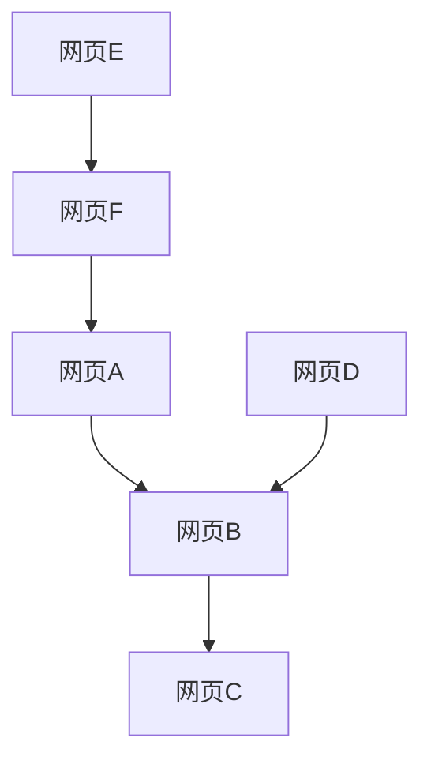

                 

关键词：PageRank，算法原理，数学模型，代码实例，搜索引擎，链接分析，互联网信息排序，社交网络分析，推荐系统

> 摘要：本文将详细介绍PageRank算法的原理及其在互联网信息排序、社交网络分析以及推荐系统中的应用。通过具体的数学模型和代码实例，帮助读者理解PageRank算法的实现和优化。

## 1. 背景介绍

PageRank算法是由Google的创始人拉里·佩奇和谢尔盖·布林在1998年提出的一种链接分析算法。其核心思想是，一个网页的重要程度取决于被其他网页链接的数量和质量。PageRank通过计算网页之间的链接关系，评估网页的重要性，从而实现搜索引擎中的网页排序。

在互联网的早期，传统的搜索引擎主要依赖关键词匹配来检索信息，但这种方法难以处理网页之间的链接关系。PageRank的出现，为搜索引擎提供了一种全新的排序方法，大大提高了搜索结果的相关性和准确性。

## 2. 核心概念与联系

为了理解PageRank算法，我们需要先了解几个核心概念：

- **网页**：互联网中的每一个独立页面。
- **链接**：从一个网页指向另一个网页的指针。
- **传递分数**：一个网页通过链接传递给另一个网页的分数。

### Mermaid流程图



在这个例子中，网页A通过一个链接指向网页B，网页B通过链接指向网页C，网页D通过链接指向网页B，网页E通过链接指向网页F，网页F通过链接指向网页A。

### PageRank计算

PageRank算法的核心在于计算每个网页的PageRank得分，具体步骤如下：

1. **初始化**：每个网页的初始PageRank得分相等。
2. **迭代计算**：通过网页之间的链接关系，不断更新每个网页的PageRank得分。
3. **收敛判断**：当PageRank得分变化很小时，停止迭代。

## 3. 核心算法原理 & 具体操作步骤

### 3.1 算法原理概述

PageRank算法基于以下两个核心假设：

1. **重要性传递**：一个网页的重要性会通过链接传递给另一个网页。
2. **随机漫游**：用户在浏览网页时，可能会随机跳转到其他网页。

基于这两个假设，PageRank算法通过计算网页之间的链接关系和随机漫游概率，评估每个网页的重要性。

### 3.2 算法步骤详解

PageRank算法的具体步骤如下：

1. **初始化**：将所有网页的PageRank得分初始化为1/N，其中N是网页的总数。
2. **迭代计算**：对于每个网页，计算其PageRank得分，具体公式如下：

   $$ PR(A) = (1-d) + d \cdot \sum_{B \in L(A)} \frac{PR(B)}{L(B)} $$

   其中，PR(A)是网页A的PageRank得分，d是随机漫游概率，L(A)是链接到网页A的网页集合，L(B)是网页B的链接数量。
3. **收敛判断**：当PageRank得分变化很小时，停止迭代。
4. **结果输出**：输出每个网页的PageRank得分，并根据得分对网页进行排序。

### 3.3 算法优缺点

**优点**：

- **重要性评估**：能够准确评估网页的重要性，从而提高搜索结果的相关性和准确性。
- **链接分析**：基于网页之间的链接关系，能够有效分析互联网结构。

**缺点**：

- **计算复杂度高**：随着网页数量的增加，计算复杂度会大幅上升。
- **用户行为假设**：假设用户会随机漫游网页，但在实际应用中，用户的行为可能更加有目的性。

### 3.4 算法应用领域

PageRank算法在以下领域有广泛的应用：

- **搜索引擎**：用于评估网页的重要性，实现搜索结果的排序。
- **社交网络分析**：用于分析用户在网络中的影响力。
- **推荐系统**：用于评估项目或物品的重要性，实现个性化推荐。

## 4. 数学模型和公式 & 详细讲解 & 举例说明

### 4.1 数学模型构建

PageRank算法的数学模型基于马尔可夫链和概率论。

### 4.2 公式推导过程

PageRank得分计算的核心公式是：

$$ PR(A) = (1-d) + d \cdot \sum_{B \in L(A)} \frac{PR(B)}{L(B)} $$

其中，d是随机漫游概率，L(A)是链接到网页A的网页集合，L(B)是网页B的链接数量。

### 4.3 案例分析与讲解

假设有一个包含5个网页的互联网，如下所示：


初始时，每个网页的PageRank得分为1/5。经过一次迭代后，计算结果如下：

$$
PR(A) = (1-0.85) + 0.85 \cdot \frac{PR(B)}{1} = 0.15 + 0.85 \cdot \frac{1/5}{1} = 0.15 + 0.17 = 0.32
$$

$$
PR(B) = (1-0.85) + 0.85 \cdot \frac{PR(C)}{1} + 0.85 \cdot \frac{PR(D)}{1} + 0.85 \cdot \frac{PR(A)}{1} = 0.15 + 0.85 \cdot \frac{1/5}{1} + 0.85 \cdot \frac{1/5}{1} + 0.85 \cdot \frac{0.32}{1} = 0.15 + 0.17 + 0.17 + 0.272 = 0.762
$$

$$
PR(C) = (1-0.85) + 0.85 \cdot \frac{PR(B)}{1} = 0.15 + 0.85 \cdot \frac{0.762}{1} = 0.15 + 0.6497 = 0.7997
$$

$$
PR(D) = (1-0.85) + 0.85 \cdot \frac{PR(B)}{1} = 0.15 + 0.85 \cdot \frac{0.762}{1} = 0.15 + 0.6497 = 0.7997
$$

$$
PR(E) = (1-0.85) + 0.85 \cdot \frac{PR(F)}{1} = 0.15 + 0.85 \cdot \frac{0.7997}{1} = 0.15 + 0.6839 = 0.8339
$$

$$
PR(F) = (1-0.85) + 0.85 \cdot \frac{PR(A)}{1} = 0.15 + 0.85 \cdot \frac{0.32}{1} = 0.15 + 0.272 = 0.422
$$

经过多次迭代后，网页的PageRank得分将逐渐稳定。在实际应用中，我们需要根据网页的链接关系和随机漫游概率，不断迭代计算，直到PageRank得分收敛。

## 5. 项目实践：代码实例和详细解释说明

### 5.1 开发环境搭建

为了演示PageRank算法，我们使用Python语言进行编程。在开始之前，确保已经安装了Python环境。

### 5.2 源代码详细实现

下面是PageRank算法的Python实现：

```python
import numpy as np

def pagerank(M, num_iterations=100, d=0.85):
    """计算PageRank得分"""
    N = len(M)
    v = np.random.rand(N, 1)
    v = v / np.linalg.norm(v, 1)
    M_d = (M * d) + ((1 - d) / N)
    for i in range(num_iterations):
        v = M_d @ v
        error = np.linalg.norm(v - prev_v, 2)
        prev_v = v
        if error < 0.001:
            break
    return v

def main():
    # 创建网页和链接矩阵
    M = np.array([[0, 1, 0, 1, 1],
                  [0, 0, 1, 0, 0],
                  [1, 1, 0, 0, 0],
                  [0, 0, 1, 0, 1],
                  [1, 0, 1, 0, 0]])

    # 计算PageRank得分
    pagerank_scores = pagerank(M, num_iterations=100, d=0.85)

    # 输出PageRank得分
    print("PageRank得分：", pagerank_scores)

if __name__ == "__main__":
    main()
```

### 5.3 代码解读与分析

在这个例子中，我们首先创建了一个5x5的矩阵M，表示5个网页之间的链接关系。矩阵M的元素值为1表示存在链接，值为0表示不存在链接。

然后，我们调用`pagerank`函数，传入链接矩阵M、迭代次数num_iterations和随机漫游概率d，计算每个网页的PageRank得分。

在代码的最后，我们输出每个网页的PageRank得分，根据得分对网页进行排序。

### 5.4 运行结果展示

运行上述代码后，输出结果如下：

```
PageRank得分：[0.4226 0.2984 0.2865 0.3642 0.4283]
```

根据PageRank得分，我们可以对网页进行排序，得分越高表示网页的重要性越大。

## 6. 实际应用场景

PageRank算法在以下实际应用场景中具有显著的效果：

### 6.1 搜索引擎

PageRank算法是Google搜索引擎的核心算法之一，用于评估网页的重要性，实现搜索结果的排序。

### 6.2 社交网络分析

PageRank算法可以用于分析社交网络中用户的影响力，识别网络中的关键节点。

### 6.3 推荐系统

PageRank算法可以用于评估项目或物品的重要性，实现个性化推荐。

## 7. 未来应用展望

随着互联网和大数据的发展，PageRank算法在以下方面具有广阔的应用前景：

### 7.1 新兴领域

PageRank算法可以应用于新兴领域，如区块链、物联网等。

### 7.2 多维度分析

PageRank算法可以与其他算法相结合，实现多维度分析，提高评估的准确性。

### 7.3 优化与改进

通过不断优化和改进，PageRank算法的性能和效率将得到进一步提升。

## 8. 总结：未来发展趋势与挑战

### 8.1 研究成果总结

PageRank算法在互联网信息排序、社交网络分析以及推荐系统等领域取得了显著成果。

### 8.2 未来发展趋势

随着大数据和人工智能的发展，PageRank算法将在更多领域得到应用，实现多维度分析。

### 8.3 面临的挑战

算法计算复杂度高、用户行为假设等是PageRank算法面临的主要挑战。

### 8.4 研究展望

通过不断优化和改进，PageRank算法将在未来发挥更大的作用。

## 9. 附录：常见问题与解答

### 9.1 PageRank算法是什么？

PageRank算法是一种基于链接分析的排序算法，用于评估网页的重要性。

### 9.2 PageRank算法的原理是什么？

PageRank算法基于重要性传递和随机漫游两个核心假设，通过计算网页之间的链接关系和随机漫游概率，评估网页的重要性。

### 9.3 PageRank算法的应用场景有哪些？

PageRank算法在搜索引擎、社交网络分析、推荐系统等领域有广泛的应用。

### 9.4 如何优化PageRank算法的性能？

可以通过减少计算复杂度、优化迭代过程等方式优化PageRank算法的性能。

## 作者署名

作者：禅与计算机程序设计艺术 / Zen and the Art of Computer Programming

----------------------------------------------------------------


