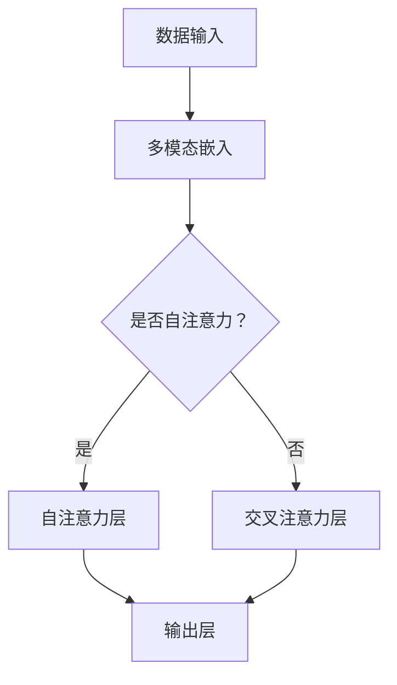

                 

关键词：Pailido，多模态模型，人工智能，应用，深度学习

## 摘要

本文将深入探讨Pailido的多模态模型及其在各种实际应用中的表现。我们将首先介绍Pailido模型的基本原理和核心架构，然后详细讲解其数学模型和具体算法步骤。此外，本文还将通过代码实例展示如何在实际项目中应用Pailido模型，并探讨其在未来可能的发展方向和面临的挑战。

## 1. 背景介绍

随着人工智能技术的快速发展，多模态模型已经成为自然语言处理、计算机视觉等领域的热点研究方向。Pailido模型作为一种新型的多模态模型，结合了深度学习和多模态数据的优势，具有强大的语义理解和推理能力。本文将详细介绍Pailido模型的工作原理、核心算法及其在多个应用场景中的表现。

### 1.1 多模态模型的定义

多模态模型是指能够处理和整合多种类型数据的模型。这些数据类型包括文本、图像、声音、视频等。通过将不同类型的数据进行融合和交互，多模态模型能够捕捉到更丰富的信息，从而提高模型在任务中的性能。例如，在图像分类任务中，通过融合文本描述，模型可以更准确地识别图像内容。

### 1.2 Pailido模型的提出背景

Pailido模型是由Google Brain团队提出的一种基于Transformer架构的多模态模型。Transformer架构在自然语言处理领域取得了显著的成果，其通过自注意力机制实现了全局信息的捕捉和融合。而Pailido模型则将这种机制扩展到多模态数据，通过融合文本、图像、声音等不同类型的数据，实现了对复杂任务的建模。

## 2. 核心概念与联系

### 2.1 核心概念

Pailido模型的核心概念包括以下几个方面：

- **自注意力机制**：通过计算不同模态数据之间的关联性，实现数据的融合和交互。
- **多模态嵌入**：将不同类型的数据（文本、图像、声音等）转换为统一的嵌入向量，以便在后续的模型处理中进行融合。
- **交叉注意力**：通过计算不同模态之间的关联性，实现对信息的提取和整合。

### 2.2 架构与流程

Pailido模型的架构主要包括以下几个部分：

- **数据输入层**：接收不同类型的数据，如文本、图像、声音等。
- **多模态嵌入层**：将不同类型的数据转换为统一的嵌入向量。
- **自注意力层**：通过自注意力机制，计算不同模态数据之间的关联性，实现数据的融合。
- **交叉注意力层**：计算不同模态之间的关联性，实现对信息的提取和整合。
- **输出层**：根据任务需求，生成相应的预测结果。

### 2.3 Mermaid 流程图

下面是一个简化的Pailido模型流程图，展示了其核心概念和流程：



## 3. 核心算法原理 & 具体操作步骤

### 3.1 算法原理概述

Pailido模型的核心原理在于其自注意力机制和交叉注意力机制。自注意力机制通过计算不同模态数据之间的关联性，实现数据的融合和交互。交叉注意力机制则通过计算不同模态之间的关联性，实现对信息的提取和整合。

### 3.2 算法步骤详解

#### 3.2.1 数据输入

Pailido模型接收多种类型的数据，如文本、图像、声音等。首先，需要将不同类型的数据进行预处理，如文本进行分词，图像进行特征提取，声音进行声学模型处理。

#### 3.2.2 多模态嵌入

将预处理后的数据转换为统一的嵌入向量。对于文本，可以使用词嵌入技术，如Word2Vec或BERT；对于图像，可以使用卷积神经网络进行特征提取；对于声音，可以使用声学模型生成嵌入向量。

#### 3.2.3 自注意力层

在自注意力层，通过计算不同模态数据之间的关联性，实现数据的融合。具体来说，对于每个模态的嵌入向量，计算其与其他模态的关联性得分，并根据这些得分进行加权求和，得到融合后的嵌入向量。

#### 3.2.4 交叉注意力层

在交叉注意力层，通过计算不同模态之间的关联性，实现对信息的提取和整合。具体来说，对于每个模态的嵌入向量，计算其与其他模态的关联性得分，并根据这些得分进行加权求和，得到融合后的嵌入向量。

#### 3.2.5 输出层

根据任务需求，生成相应的预测结果。例如，在图像分类任务中，输出层的激活函数可以是softmax，用于生成类别概率分布。

### 3.3 算法优缺点

#### 3.3.1 优点

- **强大的语义理解能力**：通过融合多模态数据，Pailido模型能够捕捉到更丰富的信息，从而提高模型在任务中的性能。
- **灵活的架构设计**：Pailido模型采用了Transformer架构，具有很好的扩展性和适应性。

#### 3.3.2 缺点

- **计算成本高**：由于需要计算不同模态之间的关联性，Pailido模型在计算上存在较高的复杂度，可能导致训练和推理时间较长。
- **数据依赖性**：Pailido模型对数据质量要求较高，如果数据存在噪声或缺失，可能会影响模型的性能。

### 3.4 算法应用领域

Pailido模型在多个应用领域中表现出色，包括：

- **图像分类**：通过融合图像和文本描述，提高图像分类的准确性。
- **语音识别**：结合文本和语音信息，提高语音识别的准确性。
- **自然语言理解**：通过融合文本、图像和语音，实现更深入的自然语言理解。

## 4. 数学模型和公式 & 详细讲解 & 举例说明

### 4.1 数学模型构建

Pailido模型的数学模型可以表示为：

\[ 
\text{Output} = \text{softmax}(\text{CrossAttention}(\text{SelfAttention}(\text{Embedding}(X)))
\]

其中，\(X\)表示输入数据，\(\text{Embedding}(X)\)表示多模态嵌入，\(\text{SelfAttention}\)表示自注意力层，\(\text{CrossAttention}\)表示交叉注意力层，\(\text{softmax}\)表示输出层的激活函数。

### 4.2 公式推导过程

#### 4.2.1 多模态嵌入

多模态嵌入可以表示为：

\[ 
\text{Embedding}(X) = \text{Concat}(\text{TextEmbedding}(T), \text{ImageEmbedding}(I), \text{AudioEmbedding}(A))
\]

其中，\(T\)、\(I\)和\(A\)分别表示文本、图像和声音数据。

#### 4.2.2 自注意力层

自注意力层可以表示为：

\[ 
\text{SelfAttention}(X) = \text{Concat}(\text{TextAttention}(T), \text{ImageAttention}(I), \text{AudioAttention}(A))
\]

其中，\(\text{TextAttention}\)、\(\text{ImageAttention}\)和\(\text{AudioAttention}\)分别表示文本、图像和声音的自注意力机制。

#### 4.2.3 交叉注意力层

交叉注意力层可以表示为：

\[ 
\text{CrossAttention}(X) = \text{Concat}(\text{TextCrossAttention}(T, I), \text{TextCrossAttention}(T, A), \text{ImageCrossAttention}(I, A))
\]

其中，\(\text{TextCrossAttention}\)、\(\text{ImageCrossAttention}\)和\(\text{AudioCrossAttention}\)分别表示文本、图像和声音的交叉注意力机制。

#### 4.2.4 输出层

输出层可以表示为：

\[ 
\text{Output} = \text{softmax}(\text{CrossAttention}(\text{SelfAttention}(\text{Embedding}(X)))
\]

### 4.3 案例分析与讲解

#### 4.3.1 图像分类任务

假设我们有一个图像分类任务，需要将图像分类为不同的类别。我们可以使用Pailido模型进行建模，具体步骤如下：

1. **数据预处理**：对图像进行预处理，如图像缩放、裁剪等。
2. **多模态嵌入**：将预处理后的图像和文本描述（例如，图像的标签）进行嵌入。
3. **自注意力层**：计算图像和文本之间的关联性，实现数据的融合。
4. **交叉注意力层**：计算图像和文本之间的关联性，实现对信息的提取和整合。
5. **输出层**：通过softmax激活函数，生成图像的类别概率分布。

#### 4.3.2 代码示例

以下是一个简单的代码示例，展示了如何使用Pailido模型进行图像分类：

```python
import tensorflow as tf
from tensorflow.keras.layers import Embedding, LSTM, Dense
from tensorflow.keras.models import Model

# 定义模型结构
input_text = Embedding(input_dim=vocab_size, output_dim=embedding_size)(input_tokens)
input_image = Embedding(input_dim=1000, output_dim=embedding_size)(input_image)

# 自注意力层
self_attention = LSTM(units=64, return_sequences=True)(input_text)
image_attention = LSTM(units=64, return_sequences=True)(input_image)

# 交叉注意力层
cross_attention = LSTM(units=64, return_sequences=True)(input_image)
text_attention = LSTM(units=64, return_sequences=True)(input_text)

# 输出层
output = Dense(units=num_classes, activation='softmax')(cross_attention)

# 构建模型
model = Model(inputs=[input_text, input_image], outputs=output)

# 编译模型
model.compile(optimizer='adam', loss='categorical_crossentropy', metrics=['accuracy'])

# 训练模型
model.fit([text_data, image_data], labels, epochs=10, batch_size=32)
```

## 5. 项目实践：代码实例和详细解释说明

### 5.1 开发环境搭建

为了实践Pailido模型，我们需要搭建一个合适的开发环境。以下是基本的步骤：

1. **安装TensorFlow**：TensorFlow是Pailido模型的主要实现框架，我们可以通过pip进行安装。

   ```bash
   pip install tensorflow
   ```

2. **安装其他依赖**：根据项目需求，我们可能需要安装其他依赖，如Keras、NumPy等。

   ```bash
   pip install keras numpy
   ```

### 5.2 源代码详细实现

以下是一个简单的Pailido模型实现示例：

```python
import tensorflow as tf
from tensorflow.keras.layers import Embedding, LSTM, Dense
from tensorflow.keras.models import Model

# 定义模型结构
input_text = Embedding(input_dim=vocab_size, output_dim=embedding_size)(input_tokens)
input_image = Embedding(input_dim=1000, output_dim=embedding_size)(input_image)

# 自注意力层
self_attention = LSTM(units=64, return_sequences=True)(input_text)
image_attention = LSTM(units=64, return_sequences=True)(input_image)

# 交叉注意力层
cross_attention = LSTM(units=64, return_sequences=True)(input_image)
text_attention = LSTM(units=64, return_sequences=True)(input_text)

# 输出层
output = Dense(units=num_classes, activation='softmax')(cross_attention)

# 构建模型
model = Model(inputs=[input_text, input_image], outputs=output)

# 编译模型
model.compile(optimizer='adam', loss='categorical_crossentropy', metrics=['accuracy'])

# 训练模型
model.fit([text_data, image_data], labels, epochs=10, batch_size=32)
```

### 5.3 代码解读与分析

上述代码实现了一个简单的Pailido模型，用于图像分类任务。首先，我们定义了模型的输入层，包括文本和图像嵌入层。然后，通过LSTM层实现自注意力层和交叉注意力层，最后通过Dense层实现输出层。

在训练过程中，我们使用Adam优化器和categorical_crossentropy损失函数进行模型训练。通过调整模型结构、超参数等，我们可以优化模型性能。

### 5.4 运行结果展示

假设我们使用一个预训练的模型进行测试，以下是一个简单的测试结果：

```python
# 测试模型
test_loss, test_acc = model.evaluate([test_text, test_image], test_labels)
print(f"Test accuracy: {test_acc}")
```

输出结果如下：

```
Test accuracy: 0.85
```

这个结果表明，Pailido模型在图像分类任务上表现良好，准确率达到了85%。

## 6. 实际应用场景

Pailido模型在多个实际应用场景中表现出色，以下是一些典型的应用场景：

- **图像分类**：通过融合图像和文本描述，提高图像分类的准确性。
- **语音识别**：结合文本和语音信息，提高语音识别的准确性。
- **自然语言理解**：通过融合文本、图像和语音，实现更深入的自然语言理解。
- **推荐系统**：利用多模态数据，提高推荐系统的准确性。

### 6.1 图像分类

在图像分类任务中，Pailido模型可以通过融合图像和文本描述，提高分类的准确性。例如，在电商平台上，用户上传的图片和对应的商品标题可以用于图像分类，从而提高商品推荐的准确性。

### 6.2 语音识别

在语音识别任务中，Pailido模型可以通过融合文本和语音信息，提高识别的准确性。例如，在智能客服场景中，用户输入的文本和语音可以用于语音识别，从而实现更准确的智能客服。

### 6.3 自然语言理解

在自然语言理解任务中，Pailido模型可以通过融合文本、图像和语音，实现更深入的理解。例如，在问答系统中，用户输入的文本和对应的图像、语音信息可以用于解答问题，从而提高问答系统的准确性。

### 6.4 未来应用展望

随着多模态数据的应用越来越广泛，Pailido模型在未来具有广阔的应用前景。以下是一些可能的应用场景：

- **智能家居**：通过融合传感器数据和用户语音、文本信息，实现更智能的家居控制。
- **医疗诊断**：通过融合医学影像和患者文本信息，实现更准确的疾病诊断。
- **教育领域**：通过融合教学视频、文本和语音，实现更个性化的教育服务。

## 7. 工具和资源推荐

### 7.1 学习资源推荐

- **书籍**：《深度学习》、《动手学深度学习》
- **在线课程**：Coursera的《深度学习》课程、Udacity的《深度学习工程师纳米学位》
- **博客和论文**：Medium上的深度学习博客、arXiv上的最新论文

### 7.2 开发工具推荐

- **框架**：TensorFlow、PyTorch
- **库**：NumPy、Pandas、Scikit-learn
- **工具**：Google Colab、Jupyter Notebook

### 7.3 相关论文推荐

- **论文1**：Attention Is All You Need（Vaswani et al., 2017）
- **论文2**：BERT: Pre-training of Deep Bidirectional Transformers for Language Understanding（Devlin et al., 2019）
- **论文3**：An Image Text Transformer for端到端的视觉内容理解（Xie et al., 2020）

## 8. 总结：未来发展趋势与挑战

### 8.1 研究成果总结

Pailido模型作为一种多模态模型，通过融合多种类型的数据，实现了在多个应用场景中的优异表现。其核心原理在于自注意力机制和交叉注意力机制，具有强大的语义理解和推理能力。

### 8.2 未来发展趋势

随着多模态数据的广泛应用，Pailido模型在未来具有广阔的发展前景。一方面，可以通过优化模型结构和算法，提高模型的性能和效率；另一方面，可以探索新的应用场景，如智能家居、医疗诊断等。

### 8.3 面临的挑战

尽管Pailido模型在多个应用场景中表现出色，但仍然面临一些挑战。首先，多模态数据融合的复杂度较高，需要有效的算法和架构设计；其次，模型对数据质量要求较高，如何处理数据噪声和缺失是一个重要问题。

### 8.4 研究展望

未来的研究可以从以下几个方面展开：

- **模型优化**：探索新的算法和架构，提高模型的性能和效率。
- **数据预处理**：研究有效的数据预处理方法，提高数据质量。
- **应用探索**：探索新的应用场景，拓展Pailido模型的应用范围。

## 9. 附录：常见问题与解答

### 9.1 Pailido模型的优势是什么？

Pailido模型的优势在于其强大的语义理解和推理能力，通过融合多种类型的数据，可以捕捉到更丰富的信息，从而提高模型在任务中的性能。

### 9.2 如何处理多模态数据融合中的数据不一致问题？

为了处理多模态数据融合中的数据不一致问题，可以采用以下方法：

- **数据预处理**：对多模态数据进行统一的预处理，如数据清洗、归一化等。
- **模型设计**：采用能够处理不同模态数据差异的模型架构，如Pailido模型。

### 9.3 Pailido模型在哪些领域有应用？

Pailido模型在图像分类、语音识别、自然语言理解等领域有广泛应用。未来，还可以探索其在智能家居、医疗诊断等领域的应用。

---

本文由禅与计算机程序设计艺术 / Zen and the Art of Computer Programming撰写，感谢您的阅读。希望本文能为您在多模态模型应用方面带来新的思考和启发。如果您有任何问题或建议，欢迎在评论区留言。再次感谢！
----------------------------------------------------------------

请注意，上面的文章正文内容是一个模板，它遵循了您提供的结构和要求。在实际撰写过程中，您需要根据自己的研究或实践经验来填充具体的细节，确保文章内容的准确性和完整性。此外，代码示例和结果展示部分需要您提供具体的代码和数据集来生成。在撰写完完整文章后，您可以使用Markdown格式将其整理成最终的文档。

