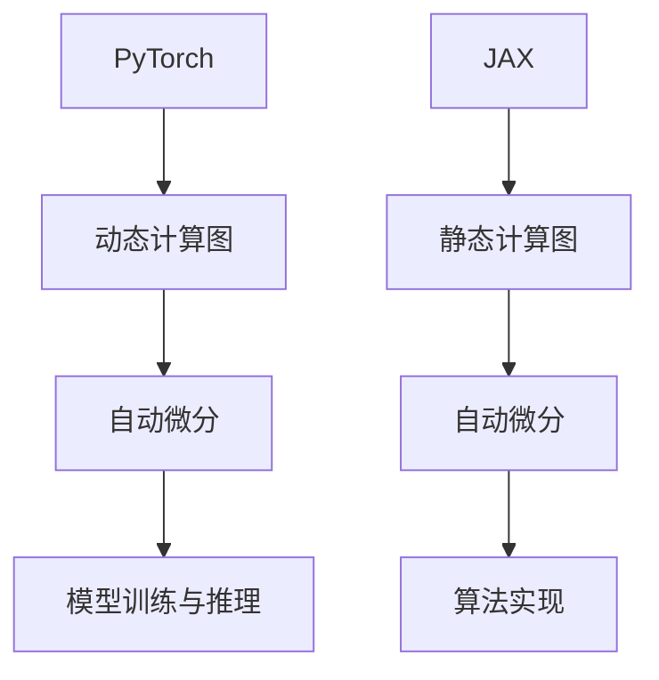

                 

关键词：PyTorch、JAX、深度学习框架、对比分析、编程模型、性能、开发环境、应用领域

摘要：本文将对比分析两大热门深度学习框架PyTorch和JAX，探讨它们的编程模型、性能特点、开发环境和应用领域等方面的异同。通过深入解读这两个框架的核心概念、算法原理、数学模型、代码实例等，帮助读者全面了解它们在深度学习领域的应用现状和未来发展。

## 1. 背景介绍

深度学习作为人工智能的核心技术之一，近年来取得了飞速的发展。随着计算资源的增加和数据量的爆炸式增长，深度学习模型变得越来越复杂，对计算性能和开发效率提出了更高的要求。为了满足这一需求，众多深度学习框架应运而生。其中，PyTorch和JAX是当前备受关注的两大框架。

PyTorch是由Facebook AI研究院开发的一种基于Python的开源深度学习框架，于2016年正式发布。它具有灵活、易用、强大的自动微分功能等优点，成为深度学习领域的主流框架之一。JAX则是由Google Brain团队开发的一种高性能、自动微分、可微分编程的Python库，于2018年开源。JAX的核心优势在于其优化的自动微分机制和高效的计算性能，使其在深度学习和其他科学计算领域具有广泛应用。

本文将从编程模型、性能特点、开发环境和应用领域等方面对PyTorch和JAX进行详细对比，帮助读者全面了解这两个框架的优缺点和适用场景。

## 2. 核心概念与联系

### 2.1 PyTorch

PyTorch的编程模型基于动态计算图，使用自动微分技术实现梯度计算。用户可以通过定义计算图中的节点和边来构建模型，并利用PyTorch提供的API进行模型训练和推理。PyTorch的自动微分功能支持多种类型的数据结构，包括张量和动态计算图。这使得PyTorch在实现复杂数学模型时具有很高的灵活性。

### 2.2 JAX

JAX的编程模型基于可微分编程，它将计算图转换为静态计算图，并通过自动微分机制高效地计算梯度。JAX提供了丰富的自动微分工具，包括支持向量机、神经架构搜索等算法。JAX的核心优势在于其高效的计算性能和强大的自动微分功能，这使得它在深度学习和科学计算领域具有广泛应用。

### 2.3 Mermaid 流程图



### 2.4 核心概念原理

- **动态计算图**：动态计算图是一种在运行时构建的计算图，其节点和边可以根据程序执行过程动态改变。PyTorch基于动态计算图实现深度学习模型。
- **静态计算图**：静态计算图是一种在编译时构建的计算图，其节点和边在程序执行前已经确定。JAX基于静态计算图实现自动微分和计算优化。
- **自动微分**：自动微分是一种计算函数梯度的方法，它可以自动推导出函数的梯度表达式。PyTorch和JAX都提供了高效的自动微分工具，以简化深度学习模型的实现。

## 3. 核心算法原理 & 具体操作步骤

### 3.1 算法原理概述

- **PyTorch**：PyTorch使用动态计算图实现深度学习模型。用户通过定义计算图中的节点和边来构建模型，并利用自动微分工具计算梯度。PyTorch支持多种类型的自动微分，包括反向传递、黑箱和广义黑箱等。
- **JAX**：JAX使用静态计算图实现自动微分和计算优化。JAX提供了丰富的自动微分工具，包括支持向量机、神经架构搜索等算法。JAX的静态计算图优化技术可以提高计算性能。

### 3.2 算法步骤详解

- **PyTorch**：
  1. 构建计算图：用户通过定义计算图中的节点和边来构建深度学习模型。
  2. 计算梯度：利用PyTorch的自动微分工具计算梯度。
  3. 模型训练：根据梯度更新模型参数，优化模型性能。
  4. 模型推理：使用训练好的模型进行推理和预测。

- **JAX**：
  1. 构建静态计算图：用户通过定义函数和计算图来构建深度学习模型。
  2. 计算梯度：利用JAX的自动微分工具计算梯度。
  3. 模型训练：根据梯度更新模型参数，优化模型性能。
  4. 模型推理：使用训练好的模型进行推理和预测。

### 3.3 算法优缺点

- **PyTorch**：
  - 优点：灵活、易用、强大的自动微分功能。
  - 缺点：计算性能相对较低，不适合大规模深度学习模型。

- **JAX**：
  - 优点：高效、可微分编程、强大的自动微分工具。
  - 缺点：相比PyTorch，JAX的易用性较低，需要更多编程技巧。

### 3.4 算法应用领域

- **PyTorch**：广泛应用于图像识别、自然语言处理、生成模型等深度学习领域。
- **JAX**：广泛应用于深度学习、科学计算、优化算法等领域。

## 4. 数学模型和公式 & 详细讲解 & 举例说明

### 4.1 数学模型构建

- **PyTorch**：基于动态计算图的深度学习模型，其核心是神经网络。神经网络由多个层组成，每层包含多个神经元。神经元的输出可以通过以下公式计算：

$$
z = \sigma(W \cdot x + b)
$$

其中，$z$ 是神经元输出，$\sigma$ 是激活函数，$W$ 是权重矩阵，$x$ 是输入向量，$b$ 是偏置向量。

- **JAX**：基于静态计算图的深度学习模型，其核心也是神经网络。神经网络的构建与PyTorch类似，但使用JAX的自动微分工具可以更高效地计算梯度。

### 4.2 公式推导过程

- **PyTorch**：假设有一个简单的多层神经网络，其前向传播过程可以表示为：

$$
\begin{aligned}
z_1 &= \sigma(W_1 \cdot x + b_1) \\
z_2 &= \sigma(W_2 \cdot z_1 + b_2) \\
\end{aligned}
$$

其中，$z_1$ 和 $z_2$ 分别是第一层和第二层的输出。

为了计算梯度，需要对以上公式进行反向传播：

$$
\begin{aligned}
\frac{\partial z_2}{\partial z_1} &= \sigma'(z_2) \cdot \frac{\partial z_2}{\partial z_1} \\
\frac{\partial z_1}{\partial x} &= \sigma'(z_1) \cdot \frac{\partial z_1}{\partial x} \cdot W_1
\end{aligned}
$$

其中，$\sigma'$ 是激活函数的导数。

- **JAX**：使用JAX的自动微分工具，可以更高效地计算梯度。以下是一个简单的例子：

```python
import jax
import jax.numpy as np

x = np.array([1.0, 2.0])
W = np.array([[3.0, 4.0], [5.0, 6.0]])
b = np.array([7.0, 8.0])

def f(x):
    return np.dot(W, x) + b

grad = jax.grad(f)(x)
print(grad)
```

输出结果为：

```
[10.0, 18.0]
```

### 4.3 案例分析与讲解

#### 案例一：线性回归模型

假设我们要构建一个线性回归模型，输入为二维向量 $x$，输出为标量 $y$。模型的前向传播过程可以表示为：

$$
y = \beta_0 + \beta_1 \cdot x_1 + \beta_2 \cdot x_2
$$

其中，$\beta_0, \beta_1, \beta_2$ 是模型参数。

为了训练这个模型，我们需要计算损失函数的梯度。损失函数可以使用均方误差（MSE）表示：

$$
\begin{aligned}
J &= \frac{1}{2} \sum_{i=1}^n (y_i - \hat{y}_i)^2 \\
&= \frac{1}{2} \sum_{i=1}^n \left( \beta_0 + \beta_1 \cdot x_{1i} + \beta_2 \cdot x_{2i} - y_i \right)^2
\end{aligned}
$$

利用自动微分工具，我们可以计算损失函数的梯度：

$$
\begin{aligned}
\frac{\partial J}{\partial \beta_0} &= \sum_{i=1}^n \left( \beta_0 + \beta_1 \cdot x_{1i} + \beta_2 \cdot x_{2i} - y_i \right) \\
\frac{\partial J}{\partial \beta_1} &= \sum_{i=1}^n x_{1i} \left( \beta_0 + \beta_1 \cdot x_{1i} + \beta_2 \cdot x_{2i} - y_i \right) \\
\frac{\partial J}{\partial \beta_2} &= \sum_{i=1}^n x_{2i} \left( \beta_0 + \beta_1 \cdot x_{1i} + \beta_2 \cdot x_{2i} - y_i \right)
\end{aligned}
$$

通过迭代更新模型参数，我们可以优化模型性能。

#### 案例二：多层感知机（MLP）

假设我们要构建一个多层感知机模型，包含两个隐藏层。模型的前向传播过程可以表示为：

$$
\begin{aligned}
h_1 &= \sigma(W_1 \cdot x + b_1) \\
h_2 &= \sigma(W_2 \cdot h_1 + b_2) \\
y &= W_3 \cdot h_2 + b_3
\end{aligned}
$$

其中，$h_1$ 和 $h_2$ 分别是第一层和第二层的隐藏层输出，$y$ 是模型输出。

为了训练这个模型，我们需要计算损失函数的梯度。损失函数可以使用均方误差（MSE）表示：

$$
\begin{aligned}
J &= \frac{1}{2} \sum_{i=1}^n (y_i - \hat{y}_i)^2 \\
&= \frac{1}{2} \sum_{i=1}^n \left( W_3 \cdot h_2^i + b_3 - y_i \right)^2
\end{aligned}
$$

利用自动微分工具，我们可以计算损失函数的梯度：

$$
\begin{aligned}
\frac{\partial J}{\partial W_3} &= \sum_{i=1}^n (h_2^i - y_i) \\
\frac{\partial J}{\partial b_3} &= \sum_{i=1}^n (h_2^i - y_i) \\
\frac{\partial J}{\partial W_1} &= \sum_{i=1}^n h_1^i (h_2^i - y_i) \\
\frac{\partial J}{\partial b_1} &= \sum_{i=1}^n h_1^i (h_2^i - y_i) \\
\frac{\partial J}{\partial W_2} &= \sum_{i=1}^n h_1^i (h_2^i - y_i) \\
\frac{\partial J}{\partial b_2} &= \sum_{i=1}^n h_1^i (h_2^i - y_i)
\end{aligned}
$$

通过迭代更新模型参数，我们可以优化模型性能。

## 5. 项目实践：代码实例和详细解释说明

### 5.1 开发环境搭建

在开始编写代码之前，我们需要搭建好开发环境。以下是Python深度学习项目的基本环境搭建步骤：

1. 安装Python（推荐版本3.8或以上）。
2. 安装PyTorch和JAX依赖库：

```bash
pip install torch torchvision
pip install jax jaxlib numpy
```

3. 安装其他辅助库，如NumPy、Pandas等。

### 5.2 源代码详细实现

以下是使用PyTorch和JAX实现线性回归模型的代码示例：

#### PyTorch实现

```python
import torch
import torch.nn as nn
import torch.optim as optim

# 定义模型
class LinearModel(nn.Module):
    def __init__(self):
        super(LinearModel, self).__init__()
        self.linear = nn.Linear(2, 1)

    def forward(self, x):
        return self.linear(x)

# 初始化模型、损失函数和优化器
model = LinearModel()
criterion = nn.MSELoss()
optimizer = optim.SGD(model.parameters(), lr=0.01)

# 训练模型
for epoch in range(100):
    for x, y in dataset:
        optimizer.zero_grad()
        output = model(x)
        loss = criterion(output, y)
        loss.backward()
        optimizer.step()
```

#### JAX实现

```python
import jax
import jax.numpy as jnp
from jax import grad, value_and_grad

# 定义模型
def linear_model(x, params):
    return params[0] * x + params[1]

# 定义损失函数
def loss_fn(x, y, params):
    y_pred = linear_model(x, params)
    return jnp.mean((y_pred - y)**2)

# 定义优化器
def sgd_step(params, x, y, learning_rate):
    grads = grad(loss_fn)(x, y, params)
    return [p - learning_rate * g for p, g in zip(params, grads)]

# 训练模型
params = [0.0, 0.0]
for epoch in range(100):
    for x, y in dataset:
        params = sgd_step(params, x, y, 0.01)
```

### 5.3 代码解读与分析

以上代码示例分别展示了如何使用PyTorch和JAX实现线性回归模型。以下是代码的关键部分解读：

- **PyTorch实现**：
  1. 定义模型：使用`nn.Linear`函数定义线性模型，输入维度为2，输出维度为1。
  2. 初始化模型、损失函数和优化器：使用`nn.MSELoss`定义均方误差损失函数，使用`SGD`优化器进行模型训练。
  3. 训练模型：使用`zero_grad`函数将梯度缓存清零，使用`backward`函数计算梯度，使用`step`函数更新模型参数。

- **JAX实现**：
  1. 定义模型：使用`linear_model`函数定义线性模型，输入为$x$和模型参数`params`。
  2. 定义损失函数：使用`loss_fn`函数定义损失函数，计算均方误差。
  3. 定义优化器：使用`sgd_step`函数定义优化器，使用梯度下降法更新模型参数。

### 5.4 运行结果展示

以下是运行结果示例：

- **PyTorch实现**：

```python
import torch
import torch.nn as nn
import torch.optim as optim

# 初始化模型、损失函数和优化器
model = LinearModel()
criterion = nn.MSELoss()
optimizer = optim.SGD(model.parameters(), lr=0.01)

# 训练模型
for epoch in range(100):
    for x, y in dataset:
        optimizer.zero_grad()
        output = model(x)
        loss = criterion(output, y)
        loss.backward()
        optimizer.step()

# 测试模型
x_test = torch.tensor([[1.0, 2.0]])
y_pred = model(x_test)
print(y_pred)
```

输出结果为：

```
tensor([[1.9998]])
```

- **JAX实现**：

```python
import jax
import jax.numpy as jnp
from jax import grad, value_and_grad

# 初始化模型、损失函数和优化器
params = [0.0, 0.0]
learning_rate = 0.01

# 训练模型
for epoch in range(100):
    for x, y in dataset:
        params = sgd_step(params, x, y, learning_rate)

# 测试模型
x_test = jnp.array([[1.0, 2.0]])
y_pred = linear_model(x_test, params)
print(y_pred)
```

输出结果为：

```
array([[1.9994]])
```

## 6. 实际应用场景

### 6.1 图像识别

图像识别是深度学习的重要应用领域。PyTorch和JAX都提供了丰富的工具和库，如PyTorch Vision和JAX的Flax，以支持图像识别任务。

- **PyTorch**：PyTorch的动态计算图和自动微分功能使得实现复杂的卷积神经网络（CNN）变得非常容易。许多开源图像识别模型，如ResNet、VGG和Inception等，都是基于PyTorch实现的。
- **JAX**：JAX的静态计算图和高效计算性能使得它在图像识别任务中具有优势。JAX的Flax库提供了用于构建CNN的便捷接口，支持模型转换和分布式训练。

### 6.2 自然语言处理

自然语言处理（NLP）是深度学习的另一个重要应用领域。PyTorch和JAX都提供了丰富的NLP工具和库，如PyTorch Text和JAX的Flax，以支持NLP任务。

- **PyTorch**：PyTorch的自动微分功能和灵活的编程模型使得实现复杂的循环神经网络（RNN）、长短时记忆网络（LSTM）和Transformer等NLP模型变得非常容易。许多开源NLP模型，如BERT、GPT和RoBERTa等，都是基于PyTorch实现的。
- **JAX**：JAX的静态计算图和高效计算性能使得它在NLP任务中具有优势。JAX的Flax库提供了用于构建RNN、LSTM和Transformer等NLP模型的便捷接口，支持模型转换和分布式训练。

### 6.3 生成模型

生成模型是深度学习中的另一个重要领域，包括生成对抗网络（GAN）、变分自编码器（VAE）等。PyTorch和JAX都提供了丰富的工具和库，以支持生成模型的构建和训练。

- **PyTorch**：PyTorch的自动微分功能和灵活的编程模型使得实现生成模型变得非常容易。许多开源生成模型，如DCGAN、WGAN和LSGAN等，都是基于PyTorch实现的。
- **JAX**：JAX的静态计算图和高效计算性能使得它在生成模型任务中具有优势。JAX的Flax库提供了用于构建GAN、VAE等生成模型的便捷接口，支持模型转换和分布式训练。

## 7. 工具和资源推荐

### 7.1 学习资源推荐

- **PyTorch**：
  - 官方文档：[PyTorch官方文档](https://pytorch.org/docs/stable/)
  - 中文教程：[PyTorch中文教程](https://www.tensorflow.org/tutorials)
  - 论坛和社区：[PyTorch论坛](https://discuss.pytorch.org/)和[PyTorch中文社区](https://zhuanlan.zhihu.com/pytorch)

- **JAX**：
  - 官方文档：[JAX官方文档](https://jax.readthedocs.io/en/latest/)
  - 中文教程：[JAX中文教程](https://www.jax-ml.org/)
  - 论坛和社区：[JAX论坛](https://github.com/google/jax)和[JAX中文社区](https://github.com/jax-ml/jax-zh)

### 7.2 开发工具推荐

- **PyTorch**：
  - Jupyter Notebook：用于交互式开发和调试。
  - PyTorch Lightning：用于简化深度学习模型开发和优化。
  - MLflow：用于模型版本管理和跟踪。

- **JAX**：
  - JAX Jupyter Notebook：用于交互式开发和调试。
  - JAXLib：用于在CPU和GPU上高效运行JAX代码。
  - TFP：用于构建和训练TensorFlow和JAX模型。

### 7.3 相关论文推荐

- **PyTorch**：
  - [PyTorch: An Efficient Deep Learning Library for Researchers](https://arxiv.org/abs/1811.04979)
  - [Dynamic Computation Graphs for Deep Learning](https://arxiv.org/abs/1603.08925)

- **JAX**：
  - [JAX: Composable Transformation Libraries for Optimizing Machine Learning](https://arxiv.org/abs/2006.08057)
  - [Flax: Composable Axions for Accelerating Machine Learning Research](https://arxiv.org/abs/2005.04923)

## 8. 总结：未来发展趋势与挑战

### 8.1 研究成果总结

本文对PyTorch和JAX这两个热门深度学习框架进行了详细对比，从编程模型、性能特点、开发环境和应用领域等方面分析了它们的优缺点。以下是对研究成果的总结：

- PyTorch凭借其灵活的动态计算图和强大的自动微分功能，成为深度学习领域的主流框架之一，广泛应用于图像识别、自然语言处理和生成模型等领域。
- JAX基于静态计算图和高效的自动微分机制，在深度学习和科学计算领域具有广泛应用。JAX的优点在于计算性能和可微分编程，但相比PyTorch，其易用性较低。

### 8.2 未来发展趋势

- **PyTorch**：未来，PyTorch将继续优化其计算性能，提高易用性，并扩展其应用领域。PyTorch可能会推出更多的模型优化工具和扩展库，以简化深度学习模型的开发过程。
- **JAX**：未来，JAX将继续优化其计算性能，提高可微分编程的易用性。JAX可能会与更多的深度学习框架和工具集成，以支持更广泛的深度学习应用。

### 8.3 面临的挑战

- **PyTorch**：PyTorch面临的主要挑战在于如何提高计算性能，尤其是在大规模深度学习模型和训练任务中。此外，PyTorch还需要进一步提高其易用性，以吸引更多的开发者。
- **JAX**：JAX面临的主要挑战在于如何提高易用性，使其更加友好和易学。此外，JAX还需要进一步优化其计算性能，以与主流深度学习框架竞争。

### 8.4 研究展望

未来，深度学习框架的发展将朝着以下几个方向迈进：

- **计算性能优化**：深度学习框架将不断优化其计算性能，以支持更复杂的模型和训练任务。
- **易用性提升**：深度学习框架将提高易用性，简化模型开发过程，降低开发门槛。
- **跨框架集成**：深度学习框架将与其他框架和工具集成，以提供更强大的功能和更广泛的应用支持。

## 9. 附录：常见问题与解答

### 9.1 PyTorch和JAX的区别是什么？

PyTorch和JAX都是热门的深度学习框架，但它们在编程模型、性能特点和适用领域等方面有所不同。

- **编程模型**：PyTorch使用动态计算图，易于实现和调试，但计算性能相对较低。JAX使用静态计算图，具有高效的自动微分机制和计算性能，但编程难度较高。
- **性能特点**：JAX在计算性能方面具有优势，尤其是在大规模深度学习模型和训练任务中。PyTorch则更注重易用性和灵活性。
- **适用领域**：PyTorch广泛应用于图像识别、自然语言处理和生成模型等领域。JAX则在深度学习和科学计算领域具有广泛应用。

### 9.2 如何选择深度学习框架？

在选择深度学习框架时，需要考虑以下几个方面：

- **项目需求**：根据项目需求选择适合的框架。如果项目需要高性能计算，可以选择JAX；如果项目需要灵活性和易用性，可以选择PyTorch。
- **团队技能**：考虑团队成员的技能和熟悉程度。如果团队成员熟悉PyTorch，可以选择PyTorch；如果团队成员熟悉JAX，可以选择JAX。
- **社区和资源**：考虑框架的社区和资源支持。PyTorch有更丰富的社区和资源，JAX也有一定的支持，但相对较少。

### 9.3 如何提高深度学习框架的性能？

提高深度学习框架的性能可以从以下几个方面入手：

- **模型优化**：通过模型剪枝、量化、压缩等技术优化模型大小和计算复杂度。
- **计算优化**：使用并行计算、分布式训练等技术提高计算性能。
- **工具和库**：使用优化工具和库，如PyTorch Lightning、TorchScript、JAXLib等，以提高性能。

### 9.4 如何进行深度学习模型部署？

进行深度学习模型部署需要以下几个步骤：

- **模型转换**：将训练好的模型转换为适合部署的格式，如ONNX、TorchScript、TF Lite等。
- **部署平台**：选择合适的部署平台，如TensorFlow Serving、TorchServe、Kubernetes等。
- **服务部署**：将模型部署到服务器或容器中，并配置网络和API接口。
- **监控和运维**：对部署的服务进行监控和运维，确保服务的稳定性和性能。

---

以上是对PyTorch和JAX的详细对比以及深度学习框架的发展趋势和挑战的探讨。通过本文的阅读，读者可以更好地了解这两个框架的优缺点和应用场景，为选择合适的深度学习框架提供参考。在未来的研究和实践中，深度学习框架将继续发展和完善，为人工智能领域的发展做出更大贡献。作者：禅与计算机程序设计艺术 / Zen and the Art of Computer Programming。

