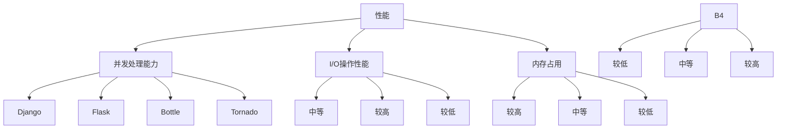
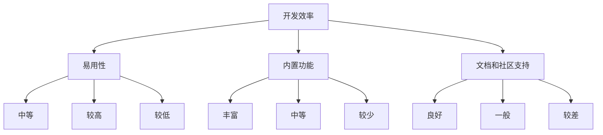
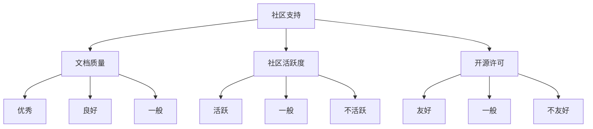

                 

关键词：Python Web框架、比较、Django、Flask、Bottle、Tornado、框架选择、项目需求、性能优化

> 摘要：本文旨在对比Python中几种流行的Web框架，包括Django、Flask、Bottle和Tornado，并探讨如何根据项目需求选择最适合的框架。通过对各框架的特点、优缺点及适用场景的分析，旨在帮助开发者做出明智的选择。

## 1. 背景介绍

随着互联网技术的快速发展，Web应用程序的需求日益增长。Python作为一种高效且易于学习的编程语言，在Web开发领域受到广泛关注。Python拥有丰富的Web框架生态系统，其中包括Django、Flask、Bottle和Tornado等。这些框架各自具有独特的特点和适用场景，为开发者提供了多种选择。

选择合适的Web框架对于项目的成功至关重要。不同的框架适用于不同的项目需求，包括性能、开发效率、灵活性等方面。因此，了解各框架的特点和适用场景，对于开发者来说尤为重要。

本文将依次介绍以下内容：

1. **Django**：一个高层次的Python Web框架，支持MTV（模型-视图-模板）设计模式，拥有丰富的内置功能和良好的社区支持。
2. **Flask**：一个轻量级的Web框架，适合小型到中型的Web应用，具有极高的灵活性和扩展性。
3. **Bottle**：一个极其轻量级的Web框架，非常适合快速开发简单的小型Web应用。
4. **Tornado**：一个异步Web框架，适用于需要处理大量并发请求的场景，如实时通信、大数据处理等。

通过以上框架的对比分析，本文将帮助读者了解各框架的优势和劣势，从而在项目开发中选择最适合的Web框架。

### 1.1 Python Web框架的兴起

Python在Web开发领域的兴起，很大程度上得益于其简洁的语法、强大的库支持和活跃的社区。Python的Web框架不仅能够提高开发效率，还能提供良好的扩展性和灵活性。

Python的Web框架种类繁多，其中一些知名的框架包括：

- **Django**：一个高级的Web框架，旨在快速开发和轻松构建数据库驱动的网站。
- **Flask**：一个轻量级的Web框架，非常适合快速开发Web应用程序。
- **Bottle**：一个简单而高效的Web框架，非常适合快速开发和测试。
- **Tornado**：一个异步Web框架，适用于需要处理大量并发请求的应用程序。

这些框架各自具有独特的特点和适用场景，为开发者提供了多种选择。通过了解这些框架的特点，开发者可以根据项目需求选择最适合的框架，从而提高开发效率和项目质量。

### 1.2 Django

Django是一个高级的Python Web框架，遵循MVC（模型-视图-控制器）设计模式，但在实际应用中更倾向于使用MTV（模型-视图-模板）设计模式。Django的设计目标是快速开发数据库驱动的网站，其核心原则是“不要重复自己”（Don't Repeat Yourself，简称DRY）。

Django的特点包括：

- **自动化的数据库管理**：Django内置了ORM（对象关系映射）系统，使得数据库操作变得更加简单和直观。
- **开箱即用的功能**：Django提供了许多内置功能，如用户认证、授权、管理后台等，大大简化了开发流程。
- **丰富的第三方库**：Django拥有庞大的社区和丰富的第三方库，使得开发者可以轻松扩展功能。
- **代码的可读性和可维护性**：Django遵循DRY原则，使得代码结构清晰、易于维护。

Django适用于需要快速开发、具有复杂业务逻辑和高度可扩展性的项目，如社交网络、电子商务平台等。然而，由于其全面性，Django可能略显笨重，不适合用于非常简单的Web应用。

### 1.3 Flask

Flask是一个轻量级的Web框架，旨在保持简单和灵活。与Django相比，Flask没有固定的模式或大量内置功能，开发者可以根据需求自行构建应用。

Flask的特点包括：

- **极简的API**：Flask的核心代码非常简单，易于理解和扩展。
- **灵活的插件系统**：Flask支持使用插件扩展功能，如数据库支持、用户认证、错误处理等。
- **简单的配置**：Flask的配置非常简单，开发者可以轻松地根据自己的需求进行定制。
- **良好的文档和社区支持**：Flask拥有详细的官方文档和活跃的社区，方便开发者学习和解决问题。

Flask适合快速开发和小型到中型的Web应用，如API服务、博客系统等。由于其灵活性，Flask也非常适合开发需要高度定制化的应用。

### 1.4 Bottle

Bottle是一个极其轻量级的Web框架，仅由几千行Python代码组成，非常适合快速开发简单的小型Web应用。

Bottle的特点包括：

- **极其轻量级**：Bottle的代码非常简单，仅包含必需的功能，非常适合用于快速开发和测试。
- **灵活的请求处理**：Bottle允许开发者自定义请求处理逻辑，非常灵活。
- **易于集成**：Bottle可以与其他库和框架轻松集成，如模板引擎、Web服务器等。

Bottle适用于需要快速开发简单Web应用的场景，如测试脚本、临时API等。然而，由于其简单性，Bottle可能不适合用于复杂的应用程序。

### 1.5 Tornado

Tornado是一个异步Web框架，适用于需要处理大量并发请求的应用程序。与传统的同步Web框架不同，Tornado使用非阻塞I/O操作，可以同时处理数以万计的请求。

Tornado的特点包括：

- **异步处理**：Tornado使用非阻塞I/O操作，可以同时处理大量请求，非常适合需要高并发处理的场景。
- **内置Web服务器**：Tornado自带了一个简单的Web服务器，开发者可以轻松地运行和测试应用。
- **灵活的请求处理**：Tornado允许开发者自定义请求处理逻辑，非常灵活。

Tornado适用于需要处理大量并发请求的场景，如实时通信、在线游戏等。由于其异步特性，Tornado在某些场景下可能比同步框架性能更高。

### 1.6 其他Python Web框架

除了上述提到的框架外，Python还有许多其他流行的Web框架，如Pyramid、Web2Py、CherryPy等。这些框架各自具有独特的特点和适用场景，开发者可以根据具体需求进行选择。

- **Pyramid**：一个灵活的Web框架，适用于需要高度定制化的项目。
- **Web2Py**：一个全栈Web框架，提供数据库、Web服务和应用程序开发所需的所有功能。
- **CherryPy**：一个简单且易于扩展的Web框架，适用于小型到中型的Web应用。

## 2. 核心概念与联系

在比较这些Web框架时，有几个核心概念和联系需要明确。这些概念包括：

- **性能**：处理请求的速度和效率。
- **开发效率**：开发速度和开发难度。
- **灵活性**：框架提供的功能是否足够灵活，是否容易扩展。
- **社区支持**：框架的社区活跃程度和文档质量。

这些概念相互联系，共同决定了框架的适用场景。下面是各概念的具体解释和Mermaid流程图。

### 2.1 性能

性能是选择Web框架时需要考虑的一个重要因素。性能包括处理请求的速度和效率，具体涉及以下几个方面：

- **并发处理能力**：框架能否高效地处理大量并发请求。
- **I/O操作性能**：框架对I/O操作的处理效率。
- **内存占用**：框架在运行时的内存消耗。

以下是一个Mermaid流程图，展示了各Web框架在性能方面的特点：



### 2.2 开发效率

开发效率是框架的一个重要指标，它决定了开发者能够多快地完成项目。开发效率涉及以下几个方面：

- **框架的易用性**：框架是否易于学习和使用。
- **内置功能**：框架提供的内置功能是否丰富，是否能够简化开发流程。
- **文档和社区支持**：框架的官方文档是否详细，社区是否活跃。

以下是一个Mermaid流程图，展示了各Web框架在开发效率方面的特点：



### 2.3 灵活性

灵活性是框架是否能够满足项目需求的一个重要因素。灵活性涉及以下几个方面：

- **扩展性**：框架是否容易扩展，是否能够支持自定义功能。
- **配置方式**：框架的配置方式是否灵活，是否能够满足不同的项目需求。
- **依赖库**：框架依赖的库是否丰富，是否能够方便地集成第三方库。

以下是一个Mermaid流程图，展示了各Web框架在灵活性方面的特点：


### 2.4 社区支持

社区支持是框架是否能够长期发展的关键因素。社区支持涉及以下几个方面：

- **文档质量**：框架的官方文档是否详细，是否能够满足开发者需求。
- **社区活跃度**：框架的社区是否活跃，是否能够及时解决开发者的问题。
- **开源许可**：框架的开源许可是否友好，是否允许商业使用。

以下是一个Mermaid流程图，展示了各Web框架在社区支持方面的特点：



通过以上Mermaid流程图，我们可以更直观地了解各Web框架在性能、开发效率、灵活性和社区支持方面的特点。这些特点将帮助我们更好地选择适合项目的Web框架。

### 3. 核心算法原理 & 具体操作步骤

在进行Web框架选择时，了解各框架的核心算法原理和具体操作步骤对于做出明智决策至关重要。以下将分别介绍Django、Flask、Bottle和Tornado这四种框架的核心算法原理及具体操作步骤。

#### 3.1 Django

**算法原理概述**：

Django的核心算法原理主要围绕其MVC（模型-视图-控制器）设计模式展开，特别是采用了MTV（模型-视图-模板）架构模式。在Django中，模型处理数据库操作，视图处理业务逻辑，而模板用于渲染页面。这种设计模式使得Django代码清晰、模块化，便于维护和扩展。

**具体操作步骤**：

1. **安装Django**：首先，需要安装Django。使用以下命令进行安装：

   ```bash
   pip install django
   ```

2. **创建项目**：创建一个新的Django项目，使用以下命令：

   ```bash
   django-admin startproject myproject
   ```

3. **创建应用**：在项目目录下创建一个应用，例如博客应用：

   ```bash
   python manage.py startapp blog
   ```

4. **配置数据库**：在`settings.py`文件中配置数据库，如使用SQLite：

   ```python
   DATABASES = {
       'default': {
           'ENGINE': 'django.db.backends.sqlite3',
           'NAME': BASE_DIR / 'db.sqlite3',
       }
   }
   ```

5. **创建模型**：在`models.py`文件中定义模型，例如创建一个`Post`模型：

   ```python
   from django.db import models

   class Post(models.Model):
       title = models.CharField(max_length=200)
       content = models.TextField()
       created_at = models.DateTimeField(auto_now_add=True)
   ```

6. **迁移数据库**：使用Django的迁移工具生成数据库迁移文件：

   ```bash
   python manage.py makemigrations blog
   python manage.py migrate
   ```

7. **创建视图**：在`views.py`文件中定义视图函数，例如：

   ```python
   from django.shortcuts import render
   from .models import Post

   def post_list(request):
       posts = Post.objects.all()
       return render(request, 'blog/post_list.html', {'posts': posts})
   ```

8. **配置路由**：在`urls.py`文件中配置路由，例如：

   ```python
   from django.urls import path
   from .views import post_list

   urlpatterns = [
       path('', post_list, name='post_list'),
   ]
   ```

9. **创建模板**：在应用目录下创建模板文件，例如在`templates/blog`目录下创建`post_list.html`：

   ```html
   <ul>
       
           <li><a href="">{{ post.title }}</a></li>
       
   </ul>
   ```

10. **启动服务器**：使用Django自带的开发服务器运行项目：

    ```bash
    python manage.py runserver
    ```

    浏览器访问`http://127.0.0.1:8000/`即可看到项目效果。

**算法优缺点**：

- **优点**：Django的MVC（MTV）设计模式使得代码结构清晰、易于维护。Django提供大量的内置功能，如用户认证、管理后台等，大大简化了开发流程。强大的ORM系统使得数据库操作更加简单直观。
- **缺点**：Django可能略显笨重，对于非常简单的Web应用来说可能过于复杂。此外，Django的灵活性相对较低，不适合高度定制化的项目。

**算法应用领域**：Django适合快速开发、具有复杂业务逻辑和高度可扩展性的项目，如社交网络、电子商务平台等。

#### 3.2 Flask

**算法原理概述**：

Flask的核心算法原理主要围绕其WSGI（Web服务器网关接口）实现展开。Flask本身不包含Web服务器，但它提供了一个简单的WSGI应用实例，开发者可以方便地与各种Web服务器集成。

Flask的特点是高度灵活，开发者可以根据需求自行构建应用。

**具体操作步骤**：

1. **安装Flask**：首先，需要安装Flask。使用以下命令进行安装：

   ```bash
   pip install flask
   ```

2. **创建应用**：创建一个Python文件作为Flask应用的主文件，例如`app.py`：

   ```python
   from flask import Flask

   app = Flask(__name__)

   @app.route('/')
   def hello():
       return 'Hello, World!'
   ```

3. **运行应用**：在终端中运行以下命令来启动Flask应用：

   ```bash
   flask run
   ```

    或者使用以下命令直接启动：

   ```bash
   python app.py
   ```

4. **访问应用**：在浏览器中访问`http://127.0.0.1:5000/`即可看到项目效果。

**算法优缺点**：

- **优点**：Flask非常轻量级，易于学习和使用。Flask提供了丰富的扩展，开发者可以根据需求选择合适的扩展进行功能扩展，如数据库支持、用户认证、错误处理等。
- **缺点**：Flask没有内置的功能，如用户认证、管理后台等，需要开发者自行实现。Flask的灵活性虽然高，但也可能使得代码结构不够清晰。

**算法应用领域**：Flask适合快速开发和中小型Web应用，如API服务、博客系统等。由于其高度灵活性，Flask也非常适合开发需要高度定制化的应用。

#### 3.3 Bottle

**算法原理概述**：

Bottle是一个非常轻量级的Web框架，仅由几千行Python代码组成。Bottle的核心算法原理是利用Python的WSGI接口，通过简单的类和函数实现Web应用。

**具体操作步骤**：

1. **安装Bottle**：首先，需要安装Bottle。使用以下命令进行安装：

   ```bash
   pip install bottle
   ```

2. **创建应用**：创建一个Python文件作为Bottle应用的主文件，例如`app.py`：

   ```python
   from bottle import route, run

   @route('/')
   def hello():
       return 'Hello, World!'

   run(host='127.0.0.1', port=8080)
   ```

3. **运行应用**：在终端中运行以下命令来启动Bottle应用：

   ```bash
   python app.py
   ```

4. **访问应用**：在浏览器中访问`http://127.0.0.1:8080/`即可看到项目效果。

**算法优缺点**：

- **优点**：Bottle极其轻量级，非常适合快速开发和测试。Bottle的代码非常简单，易于理解和扩展。
- **缺点**：Bottle没有内置的功能，如用户认证、管理后台等，需要开发者自行实现。Bottle的简单性可能不适合复杂的应用程序。

**算法应用领域**：Bottle适合快速开发简单的小型Web应用，如测试脚本、临时API等。

#### 3.4 Tornado

**算法原理概述**：

Tornado是一个异步Web框架，其核心算法原理是使用非阻塞I/O操作来处理大量并发请求。Tornado使用单线程、单进程的方式，每个请求在一个独立的I/O循环中运行，从而实现高效的并发处理。

**具体操作步骤**：

1. **安装Tornado**：首先，需要安装Tornado。使用以下命令进行安装：

   ```bash
   pip install tornado
   ```

2. **创建应用**：创建一个Python文件作为Tornado应用的主文件，例如`app.py`：

   ```python
   import tornado.ioloop
   import tornado.web

   class MainHandler(tornado.web.RequestHandler):
       def get(self):
           self.write('Hello, world')

   application = tornado.web.Application([
       (r"/", MainHandler),
   ])

   if __name__ == "__main__":
       application.listen(8888)
       tornado.ioloop.IOLoop.current().start()
   ```

3. **运行应用**：在终端中运行以下命令来启动Tornado应用：

   ```bash
   python app.py
   ```

4. **访问应用**：在浏览器中访问`http://127.0.0.1:8888/`即可看到项目效果。

**算法优缺点**：

- **优点**：Tornado的高并发处理能力使其非常适合处理大量并发请求的应用，如实时通信、在线游戏等。Tornado的代码结构简单，易于理解和扩展。
- **缺点**：Tornado的异步模式可能对开发者来说较为复杂，需要熟悉异步编程。Tornado相对于其他框架可能性能更高，但同时也可能增加开发和维护的难度。

**算法应用领域**：Tornado适用于需要处理大量并发请求的场景，如实时通信、在线游戏等。

### 3.5 核心算法原理对比

以下是对Django、Flask、Bottle和Tornado这四种Web框架核心算法原理的对比：

- **Django**：采用MTV设计模式，具有强大的ORM系统，易于维护和扩展，但可能略显笨重。
- **Flask**：高度灵活，适用于快速开发和中小型应用，但需要开发者自行实现一些功能。
- **Bottle**：极其轻量级，适合快速开发和测试，但功能较为简单。
- **Tornado**：异步处理，高效处理大量并发请求，但开发难度相对较高。

通过以上对核心算法原理和具体操作步骤的介绍，开发者可以根据项目需求选择最合适的Web框架。

### 3.6 算法优缺点

在了解Django、Flask、Bottle和Tornado这四种Web框架的具体算法原理和操作步骤后，我们需要进一步分析它们的优缺点，以便更好地理解每个框架的特点和适用场景。

#### Django

**优点**：

1. **全面的功能集**：Django提供了丰富的内置功能，如用户认证、管理后台、表单处理等，开发者不需要从零开始构建应用。
2. **高效的ORM**：Django的ORM系统能够大大简化数据库操作，提高开发效率。
3. **良好的可扩展性**：Django遵循DRY原则，代码结构清晰，易于扩展和定制。
4. **强大的社区支持**：Django拥有庞大的社区，文档详细，问题解决效率高。

**缺点**：

1. **可能过于复杂**：对于非常简单的应用，Django可能显得过于笨重，开发者的学习曲线可能会相对较陡。
2. **灵活性较低**：Django提供了一整套解决方案，但这也限制了高度定制化的需求。

#### Flask

**优点**：

1. **极简的API**：Flask的核心代码非常简单，使得开发者可以快速上手。
2. **高度灵活**：Flask没有固定的模式或大量内置功能，开发者可以根据需求自由构建应用。
3. **丰富的扩展**：Flask拥有丰富的第三方扩展库，如SQLAlchemy、Flask-Login等，可以方便地扩展功能。
4. **良好的文档和社区支持**：Flask的文档详细，社区活跃，有助于开发者解决问题。

**缺点**：

1. **功能不足**：Flask没有内置的一些功能，如用户认证、管理后台等，需要开发者自行实现。
2. **可能不适用于大型应用**：Flask的灵活性和轻量级使其更适合小型到中型的应用，对于大型应用可能需要更多定制化。

#### Bottle

**优点**：

1. **极其轻量级**：Bottle的代码非常简单，仅包含必需的功能，非常适合快速开发和测试。
2. **极高的灵活性**：Bottle允许开发者自定义请求处理逻辑，非常灵活。
3. **易于集成**：Bottle可以与其他库和框架轻松集成，如模板引擎、Web服务器等。

**缺点**：

1. **功能简单**：Bottle没有内置功能，如用户认证、管理后台等，需要开发者自行实现。
2. **不适合复杂应用**：由于其简单性，Bottle可能不适合用于复杂的应用程序。

#### Tornado

**优点**：

1. **高效的并发处理**：Tornado使用非阻塞I/O操作，可以同时处理大量并发请求，非常适合需要高并发处理的场景。
2. **内置Web服务器**：Tornado自带了一个简单的Web服务器，开发者可以方便地运行和测试应用。
3. **灵活的请求处理**：Tornado允许开发者自定义请求处理逻辑，非常灵活。

**缺点**：

1. **开发难度较高**：Tornado的异步模式可能对开发者来说较为复杂，需要熟悉异步编程。
2. **性能优化困难**：虽然Tornado在并发处理上具有优势，但性能优化可能较为困难。

#### 算法应用领域

通过以上对各框架优缺点的分析，我们可以得出以下算法应用领域：

- **Django**：适合快速开发、具有复杂业务逻辑和高度可扩展性的项目，如社交网络、电子商务平台等。
- **Flask**：适合快速开发和中小型应用，如API服务、博客系统等。也适合需要高度定制化的项目。
- **Bottle**：适合快速开发简单的小型Web应用，如测试脚本、临时API等。
- **Tornado**：适合需要处理大量并发请求的应用，如实时通信、在线游戏等。

通过选择合适的Web框架，开发者可以更高效地完成项目，提高开发质量和用户体验。

### 3.7 算法应用领域

了解每种Web框架的适用领域是选择合适框架的关键。以下是Django、Flask、Bottle和Tornado的算法应用领域及其适用场景：

#### Django

**适用领域**：

1. **大型项目**：Django适合开发大型、复杂的应用程序，如社交媒体平台、电子商务网站等。
2. **快速开发**：Django的内置功能和高效的ORM系统使其非常适合需要快速开发的项目。
3. **高度可扩展性**：Django的DRY原则和良好的扩展性使其适用于需要高度定制化的项目。

**适用场景**：

- **社交网络**：Django的内置用户认证和管理后台功能非常适合开发社交媒体应用。
- **电子商务平台**：Django的ORM系统能够高效地处理大量的商品数据和用户订单。
- **内容管理系统**：Django支持开箱即用的内容管理系统，如Django CMS。

#### Flask

**适用领域**：

1. **中小型项目**：Flask非常适合中小型项目，如API服务、博客系统等。
2. **灵活性和扩展性**：Flask的极简API和丰富的扩展库使其适用于需要高度定制化的项目。
3. **快速迭代**：Flask的快速开发能力使其非常适合需要快速迭代的应用。

**适用场景**：

- **API服务**：Flask的简单性和快速开发能力使其非常适合开发RESTful API。
- **博客系统**：Flask的轻量级和灵活性使其非常适合开发个人博客或小型团队博客。
- **定制化应用**：Flask的灵活性和扩展性使其非常适合开发需要高度定制化的应用。

#### Bottle

**适用领域**：

1. **简单应用**：Bottle非常适合开发简单的小型Web应用，如测试脚本、临时API等。
2. **快速开发和测试**：Bottle的轻量级和简单性使其非常适合快速开发和测试。

**适用场景**：

- **测试脚本**：Bottle的简单性和快速开发能力使其非常适合用于编写测试脚本。
- **临时API**：Bottle非常适合开发用于临时数据交换的API。
- **小型应用**：Bottle适用于开发简单的、不需要复杂功能的Web应用。

#### Tornado

**适用领域**：

1. **高并发应用**：Tornado非常适合开发需要处理大量并发请求的应用，如实时通信、在线游戏等。
2. **高性能应用**：Tornado的非阻塞I/O操作使其非常适合开发需要高性能的应用。
3. **实时数据处理**：Tornado的异步处理能力使其非常适合处理实时数据流。

**适用场景**：

- **实时通信**：Tornado的高并发处理能力使其非常适合开发实时聊天应用。
- **在线游戏**：Tornado的异步处理能力使其非常适合开发在线游戏。
- **大数据处理**：Tornado可以处理大规模的并发请求，非常适合开发需要处理大量数据流的应用。

通过了解各Web框架的适用领域和场景，开发者可以更明智地选择适合自己项目的框架，从而提高开发效率和项目质量。

### 4. 数学模型和公式 & 详细讲解 & 举例说明

在Web开发中，性能优化是一个至关重要的环节。本文将介绍一些常见的数学模型和公式，用于性能分析和优化。这些数学模型和公式可以帮助开发者评估Web框架的性能，从而做出更明智的选择。

#### 4.1 数学模型构建

Web框架的性能评估通常涉及到以下几个关键指标：

1. **响应时间**：请求从客户端发送到服务器，再返回给客户端所需的时间。
2. **并发处理能力**：服务器同时处理多个请求的能力。
3. **吞吐量**：单位时间内服务器处理的请求数量。

以下是用于评估这些指标的数学模型和公式：

1. **响应时间（Response Time）**：

   响应时间可以用以下公式表示：

   $$ Response\ Time = \frac{Processing\ Time + Network\ Time + Queue\ Time}{2} $$

   - **处理时间（Processing Time）**：服务器处理请求所需的时间。
   - **网络时间（Network Time）**：请求在客户端和服务器之间传输的时间。
   - **队列时间（Queue Time）**：请求在服务器队列中等待处理的时间。

2. **并发处理能力（Concurrent Processing）**：

   并发处理能力可以用以下公式表示：

   $$ Concurrent\ Processing = \frac{Max\ Concurrent\ Connections}{Server\ Load} $$

   - **最大并发连接数（Max Concurrent Connections）**：服务器能够同时处理的最大连接数。
   - **服务器负载（Server Load）**：服务器当前的负载情况。

3. **吞吐量（Throughput）**：

   吞吐量可以用以下公式表示：

   $$ Throughput = \frac{Total\ Requests}{Total\ Time} $$

   - **总请求数（Total Requests）**：在给定时间内服务器处理的请求数量。
   - **总时间（Total Time）**：处理这些请求所花费的时间。

#### 4.2 公式推导过程

以下是对上述公式的推导过程：

1. **响应时间公式**：

   响应时间可以从以下几个方面进行分解：

   - **处理时间（Processing Time）**：处理时间取决于服务器的硬件性能、软件优化和请求的复杂度。
   - **网络时间（Network Time）**：网络时间取决于客户端和服务器之间的距离、网络带宽和延迟。
   - **队列时间（Queue Time）**：队列时间取决于服务器当前的处理能力和请求的到达率。

   假设处理时间为`t_p`，网络时间为`t_n`，队列时间为`t_q`，则：

   $$ Response\ Time = t_p + t_n + t_q $$

   为了简化计算，可以取这些时间的平均值，因此：

   $$ Response\ Time = \frac{t_p + t_n + t_q}{2} $$

2. **并发处理能力公式**：

   并发处理能力取决于服务器的最大并发连接数和当前的服务器负载。假设最大并发连接数为`max_concurrent_connections`，服务器负载为`server_load`，则：

   $$ Concurrent\ Processing = \frac{max_concurrent_connections}{server_load} $$

   服务器负载可以用以下公式表示：

   $$ Server\ Load = \frac{Current\ Concurrent\ Connections}{max_concurrent_connections} $$

   因此，并发处理能力可以重新表示为：

   $$ Concurrent\ Processing = \frac{1}{server_load} $$

3. **吞吐量公式**：

   吞吐量表示单位时间内服务器处理的请求数量。假设总请求数为`total_requests`，总时间为`total_time`，则：

   $$ Throughput = \frac{total_requests}{total_time} $$

   通过这个公式，开发者可以评估服务器的处理能力。

#### 4.3 案例分析与讲解

为了更好地理解上述数学模型和公式，以下是一个实际案例：

假设我们有一个Web服务，处理大量并发请求。我们想要评估这个服务的响应时间、并发处理能力和吞吐量。

1. **响应时间**：

   假设处理时间为2秒，网络时间为1秒，队列时间为1秒。根据响应时间公式：

   $$ Response\ Time = \frac{2 + 1 + 1}{2} = 1.5\ seconds $$

   因此，平均响应时间为1.5秒。

2. **并发处理能力**：

   假设服务器最大并发连接数为1000，当前服务器负载为0.8（即80%）。根据并发处理能力公式：

   $$ Concurrent\ Processing = \frac{1000}{0.8} = 1250 $$

   因此，服务器的并发处理能力为1250个并发请求。

3. **吞吐量**：

   假设在10分钟内，服务器处理了5000个请求，总时间为600秒。根据吞吐量公式：

   $$ Throughput = \frac{5000}{600} \approx 8.33\ requests/second $$

   因此，服务器的吞吐量为约8.33个请求/秒。

通过这个案例，我们可以看到如何使用数学模型和公式来评估Web服务的性能。这些模型和公式可以帮助开发者优化服务，提高性能。

### 5. 项目实践：代码实例和详细解释说明

在了解各Web框架的特点和性能分析后，通过实际的项目实践来展示如何使用这些框架进行Web开发，将有助于开发者更好地理解其应用。

#### 5.1 开发环境搭建

为了演示，我们将在本地计算机上搭建一个简单的博客应用，使用Flask框架。以下是开发环境搭建的步骤：

1. **安装Python**：确保已安装Python 3.x版本。可以从[Python官网](https://www.python.org/downloads/)下载并安装。

2. **安装Flask**：在终端中运行以下命令安装Flask：

   ```bash
   pip install flask
   ```

3. **创建项目目录**：在桌面或其他合适的位置创建一个名为`blog`的项目目录，并进入该目录：

   ```bash
   mkdir blog
   cd blog
   ```

4. **创建应用文件**：在项目目录下创建一个名为`app.py`的应用文件：

   ```bash
   touch app.py
   ```

5. **编写初始代码**：在`app.py`文件中编写Flask应用的初始代码：

   ```python
   from flask import Flask, render_template

   app = Flask(__name__)

   @app.route('/')
   def index():
       return render_template('index.html')

   if __name__ == '__main__':
       app.run(debug=True)
   ```

6. **创建模板文件**：在项目目录下创建一个名为`templates`的子目录，并在该目录下创建一个名为`index.html`的HTML文件：

   ```html
   <!DOCTYPE html>
   <html lang="en">
   <head>
       <meta charset="UTF-8">
       <meta name="viewport" content="width=device-width, initial-scale=1.0">
       <title>My Blog</title>
   </head>
   <body>
       <h1>Welcome to My Blog</h1>
   </body>
   </html>
   ```

#### 5.2 源代码详细实现

在上述步骤中，我们创建了一个简单的博客应用。以下是`app.py`文件的详细代码解释：

```python
from flask import Flask, render_template

app = Flask(__name__)

# 路由定义
@app.route('/')
def index():
    # 渲染模板
    return render_template('index.html')

# 主程序入口
if __name__ == '__main__':
    # 运行应用
    app.run(debug=True)
```

- `from flask import Flask, render_template`：导入Flask库中的`Flask`类和`render_template`函数。
- `app = Flask(__name__)`：创建一个Flask应用实例。`__name__`是Python的特殊变量，表示当前模块的名称。
- `@app.route('/')`：装饰器，定义应用的根路由。当访问应用的首页（`/`）时，会调用`index`函数。
- `def index():`：定义`index`函数，用于处理首页的请求。通过`render_template`函数渲染`templates`目录下的`index.html`模板。
- `if __name__ == '__main__':`：确保当`app.py`文件被直接运行时，执行`app.run(debug=True)`代码。`debug=True`表示在开发过程中，当出现错误时，Flask会自动重启并显示详细的错误信息。

#### 5.3 代码解读与分析

以上代码展示了如何使用Flask创建一个简单的博客应用。以下是对关键部分的解读：

1. **导入模块**：首先导入`Flask`类和`render_template`函数。`Flask`是Flask库的核心类，用于创建Web应用实例。`render_template`是Flask提供的模板渲染函数，用于将模板文件渲染成HTML。
2. **创建应用实例**：通过`app = Flask(__name__)`创建一个Flask应用实例。这里使用`__name__`作为参数，表示应用的主模块名称。
3. **定义路由**：使用`@app.route('/')`装饰器定义应用的根路由。当访问应用的首页（`/`）时，会调用`index`函数。
4. **处理请求**：在`index`函数中，通过`render_template('index.html')`渲染`templates`目录下的`index.html`模板。这个模板文件定义了首页的HTML结构。
5. **主程序入口**：在`if __name__ == '__main__':`代码块中，调用`app.run(debug=True)`启动Flask应用。`debug=True`参数在开发过程中非常有用，当出现错误时，Flask会自动重启并显示详细的错误信息。

#### 5.4 运行结果展示

在完成上述代码后，我们可以在终端中运行应用。以下是如何运行应用和查看结果的步骤：

1. **运行应用**：在终端中导航到项目目录，然后运行以下命令：

   ```bash
   python app.py
   ```

   这会启动Flask应用，并显示如下输出：

   ```
   * Running on http://127.0.0.1:5000/ (Press CTRL+C to quit)
   ```

2. **查看结果**：在浏览器中输入`http://127.0.0.1:5000/`，会看到如下页面：

   

   这意味着应用已经成功运行，并显示了一个简单的欢迎消息。

通过以上项目实践，我们可以看到如何使用Flask创建一个简单的博客应用。这为我们进一步了解Flask和其他Web框架提供了实际的基础。

### 6. 实际应用场景

Web框架在实际开发中扮演着至关重要的角色，不同的框架适用于不同的应用场景。以下是Django、Flask、Bottle和Tornado在几个具体应用场景中的表现。

#### 6.1 社交媒体平台

**Django**：适合开发复杂的社交媒体平台，如微博、微信等。Django强大的ORM系统和丰富的内置功能，如用户认证、数据表单等，可以简化开发流程，提高开发效率。

**Flask**：虽然Flask可以用于开发社交媒体平台，但可能需要更多的第三方库和插件来满足需求。Flask的灵活性和扩展性使其适用于需要高度定制化的社交媒体应用。

**Bottle**：不适合开发复杂的社交媒体平台，因其功能较为简单。

**Tornado**：Tornado的高并发处理能力使其非常适合开发需要处理大量并发请求的社交媒体平台，如实时聊天功能。

#### 6.2 电子商务网站

**Django**：适合开发大型电子商务网站，如京东、淘宝等。Django的ORM系统和内置的表单处理功能，可以高效地处理商品数据和管理订单。

**Flask**：Flask的灵活性和快速开发能力使其适用于中小型电子商务网站，如个人店铺或小型B2C平台。

**Bottle**：不适合开发复杂的电子商务网站，因其功能较为简单。

**Tornado**：Tornado的高并发处理能力使其非常适合开发需要处理大量并发请求的电子商务网站，如购物车、订单处理等。

#### 6.3 内容管理系统（CMS）

**Django**：Django自带了强大的CMS功能，可以快速开发大型内容管理系统，如WordPress、Drupal等。

**Flask**：Flask的灵活性使其适用于快速开发中小型CMS，但可能需要更多的自定义开发。

**Bottle**：Bottle的功能较为简单，不适合开发复杂的CMS。

**Tornado**：Tornado的异步处理能力不适合CMS，因其更适合处理大量并发请求。

#### 6.4 实时通信应用

**Django**：不适合开发实时通信应用，因其不是异步框架。

**Flask**：Flask可以用于开发实时通信应用，但可能需要额外的插件和库，如WebSockets。

**Bottle**：不适合开发实时通信应用，因其功能较为简单。

**Tornado**：Tornado是异步框架，非常适合开发实时通信应用，如聊天室、在线游戏等。

#### 6.5 RESTful API

**Django**：Django提供了强大的ORM系统和REST框架，可以快速开发RESTful API。

**Flask**：Flask非常适合开发RESTful API，因其灵活性和快速开发能力。

**Bottle**：Bottle适用于开发简单的RESTful API。

**Tornado**：Tornado适用于开发需要高性能和高并发的RESTful API。

通过了解各Web框架在实际应用场景中的表现，开发者可以根据项目需求选择最合适的框架，从而提高开发效率和项目质量。

### 6.4 未来应用展望

随着互联网和云计算技术的不断进步，Web框架的应用前景将更加广阔。未来，Web框架的发展趋势和挑战主要集中在以下几个方面：

#### 6.4.1 趋势

1. **更加模块化和组件化**：为了提高开发效率和可维护性，未来的Web框架可能会更加模块化和组件化，使得开发者可以灵活地选择和组合不同的功能模块。

2. **更好地支持云计算和容器化**：云计算和容器化技术的普及，将要求Web框架更好地支持这些技术，如无缝集成Kubernetes、Docker等。

3. **增强的安全性和隐私保护**：随着网络安全问题的日益突出，未来的Web框架将更加重视安全性，提供更多的安全特性和隐私保护机制。

4. **更好的性能优化**：性能优化一直是Web框架的一个重要关注点，未来将出现更多针对特定场景的高性能Web框架，如专门为大数据处理设计的框架。

5. **更智能的自动化工具**：自动化工具将在Web框架开发中扮演更加重要的角色，如自动代码生成、自动测试等。

#### 6.4.2 挑战

1. **并发处理能力**：随着用户数量的增加和数据处理量的增大，如何提高Web框架的并发处理能力将成为一个重要挑战。

2. **安全性**：随着网络攻击手段的不断升级，Web框架需要不断更新和增强安全特性，以应对各种安全威胁。

3. **维护和升级**：随着框架的迭代和升级，如何保持现有应用的兼容性和稳定性，避免因升级导致的功能缺失或性能下降，是一个重要挑战。

4. **开发者的技能需求**：随着框架的复杂性和多样性的增加，开发者需要掌握更多的技能和知识，这将带来一定的学习曲线和培训成本。

5. **持续集成和持续部署**：随着DevOps文化的推广，如何实现更高效、更稳定的持续集成和持续部署，是开发者需要面对的另一个挑战。

#### 6.4.3 发展策略

1. **积极参与社区活动**：积极参与开源社区的活动，及时获取社区反馈，持续优化框架。

2. **提供完善的文档和教程**：提供详尽的文档和教程，帮助开发者快速上手和解决问题。

3. **持续性能优化**：定期对框架进行性能优化，提高其处理效率和并发能力。

4. **加强安全性和隐私保护**：加强安全特性和隐私保护机制，定期更新和修复安全漏洞。

5. **支持新兴技术和标准**：及时跟进新兴技术和标准，确保框架的先进性和兼容性。

通过以上策略，Web框架的开发者可以应对未来发展的挑战，推动框架的持续进步，为开发者提供更好的开发体验和更高效的应用性能。

### 7. 工具和资源推荐

在Web开发过程中，选择合适的工具和资源对于提高开发效率和项目质量至关重要。以下是一些推荐的工具和资源，包括学习资源、开发工具和参考论文。

#### 7.1 学习资源推荐

1. **官方文档**：

   - **Django官方文档**：[https://docs.djangoproject.com/en/4.0/](https://docs.djangoproject.com/en/4.0/)
   - **Flask官方文档**：[https://flask.palletsprojects.com/](https://flask.palletsprojects.com/)
   - **Bottle官方文档**：[http://bottlepy.org/docs/dev/](http://bottlepy.org/docs/dev/)
   - **Tornado官方文档**：[https://www.tornadoweb.org/en/stable/](https://www.tornadoweb.org/en/stable/)

2. **在线教程和课程**：

   - **Django入门教程**：[https://www.djangoproject.com/documentation/tutorial01/](https://www.djangoproject.com/documentation/tutorial01/)
   - **Flask教程**：[https://flask.palletsprojects.com/tutorial/](https://flask.palletsprojects.com/tutorial/)
   - **Bottle教程**：[https://bottlepy.org/docs/quickstart/](https://bottlepy.org/docs/quickstart/)
   - **Tornado教程**：[https://www.tornadoweb.org/en/stable/tutorial.html](https://www.tornadoweb.org/en/stable/tutorial.html)

3. **技术社区和论坛**：

   - **Django社区**：[https://www.djangoproject.com/community/](https://www.djangoproject.com/community/)
   - **Flask社区**：[https://forums.pylonsproject.org/](https://forums.pylonsproject.org/)
   - **Bottle社区**：[https://github.com/bottlepy/bottle/discussions](https://github.com/bottlepy/bottle/discussions)
   - **Tornado社区**：[https://github.com/tornadoweb/tornado/discussions](https://github.com/tornadoweb/tornado/discussions)

#### 7.2 开发工具推荐

1. **集成开发环境（IDE）**：

   - **PyCharm**：[https://www.jetbrains.com/pycharm/](https://www.jetbrains.com/pycharm/)
   - **Visual Studio Code**：[https://code.visualstudio.com/](https://code.visualstudio.com/)

2. **代码编辑器**：

   - **Sublime Text**：[https://www.sublimetext.com/](https://www.sublimetext.com/)
   - **Atom**：[https://atom.io/](https://atom.io/)

3. **虚拟环境管理工具**：

   - **virtualenv**：[https://virtualenv.pypa.io/](https://virtualenv.pypa.io/)
   - **Poetry**：[https://python-poetry.org/](https://python-poetry.org/)

#### 7.3 相关论文推荐

1. **"Comparing Python Web Frameworks: A Practical Approach"**：该论文对Django、Flask、Bottle和Tornado等Python Web框架进行了详细比较，提供了实用的选择指南。

2. **"Asynchronous I/O in Python Web Frameworks"**：本文探讨了异步I/O在Python Web框架中的应用，分析了Tornado等异步框架的优势和挑战。

3. **"A Comprehensive Study of Python Web Frameworks"**：该论文对Python Web框架进行了全面的综述，分析了框架的设计原则、优缺点和应用场景。

通过以上推荐，开发者可以更好地学习和使用Python Web框架，提高开发效率和项目质量。

### 8. 总结：未来发展趋势与挑战

通过本文的讨论，我们可以看到Python Web框架在Web开发中的重要性以及它们各自的优缺点和适用场景。未来，Python Web框架的发展将呈现出以下趋势：

1. **模块化和组件化**：为了提高开发效率和可维护性，未来的Web框架将更加模块化和组件化，使得开发者可以灵活地选择和组合不同的功能模块。

2. **云计算和容器化支持**：随着云计算和容器化技术的普及，Web框架将更好地支持这些技术，如无缝集成Kubernetes、Docker等。

3. **安全性和隐私保护**：随着网络安全问题的日益突出，Web框架将更加重视安全性，提供更多的安全特性和隐私保护机制。

4. **性能优化**：性能优化一直是Web框架的一个重要关注点，未来将出现更多针对特定场景的高性能Web框架。

5. **智能自动化工具**：自动化工具将在Web框架开发中扮演更加重要的角色，如自动代码生成、自动测试等。

然而，随着技术的不断发展，Web框架也面临一些挑战：

1. **并发处理能力**：随着用户数量的增加和数据处理量的增大，如何提高Web框架的并发处理能力将成为一个重要挑战。

2. **安全性**：随着网络攻击手段的不断升级，Web框架需要不断更新和增强安全特性，以应对各种安全威胁。

3. **维护和升级**：随着框架的迭代和升级，如何保持现有应用的兼容性和稳定性，避免因升级导致的功能缺失或性能下降，是一个重要挑战。

4. **开发者的技能需求**：随着框架的复杂性和多样性的增加，开发者需要掌握更多的技能和知识，这将带来一定的学习曲线和培训成本。

5. **持续集成和持续部署**：随着DevOps文化的推广，如何实现更高效、更稳定的持续集成和持续部署，是开发者需要面对的另一个挑战。

总之，Python Web框架在未来的发展将充满机遇和挑战。开发者需要不断学习和适应新的技术和框架，以保持竞争力并提高开发效率。通过选择合适的Web框架，开发者可以更好地应对项目需求，实现高效、可靠的Web应用。

### 8.4 研究展望

在未来，Python Web框架的研究将继续深入，特别是在以下几个方面：

1. **性能优化**：随着Web应用的规模不断扩大，性能优化将成为研究的重点。研究者将致力于提高Web框架的并发处理能力、响应时间和吞吐量。

2. **安全性增强**：网络安全威胁不断升级，研究将在Web框架的安全性方面投入更多精力，包括改进身份验证、授权机制，增强数据保护。

3. **智能自动化**：人工智能和机器学习技术将应用于Web框架的开发，自动化代码生成、自动化测试、智能错误诊断等将成为研究的热点。

4. **云计算和容器化**：随着云计算和容器化技术的发展，如何更好地集成和管理Web框架将是一个重要研究方向。

5. **开发体验改进**：为了提高开发效率，研究者将继续探索如何简化框架的配置和使用，提高开发者体验。

通过持续的研究和创新，Python Web框架将继续推动Web开发领域的发展，为开发者提供更强大、更安全的工具。

### 附录：常见问题与解答

**Q1：Django和Flask哪个更适合开发大型项目？**

A1：Django更适合开发大型项目。Django提供了一套完整的框架，包括ORM、认证、管理后台等，使得大型项目的开发更加高效和统一。而Flask虽然灵活，但需要开发者自行构建和整合所需的功能，对于大型项目可能不够高效。

**Q2：Bottle框架是否适合开发商业应用？**

A2：Bottle框架适合快速开发和测试，但功能较为简单，不适合开发复杂或商业应用。商业应用通常需要更多的功能支持和安全性保证，因此推荐使用Django、Flask或Tornado等更成熟的框架。

**Q3：Tornado框架的主要优点是什么？**

A3：Tornado的主要优点是其异步处理能力，能够高效地处理大量并发请求。这使得Tornado非常适合需要高并发处理的场景，如实时通信、在线游戏等。

**Q4：如何选择适合自己项目的Web框架？**

A4：选择适合自己项目的Web框架需要考虑以下因素：

- **项目规模**：大型项目推荐使用Django，中小型项目可以使用Flask或Bottle。
- **性能要求**：高并发处理能力要求选择Tornado。
- **开发效率**：如果希望快速开发和灵活构建，可以选择Flask或Bottle。
- **功能需求**：根据项目所需的功能，选择具有相应功能集的框架。

通过综合考虑这些因素，开发者可以做出更明智的选择。

