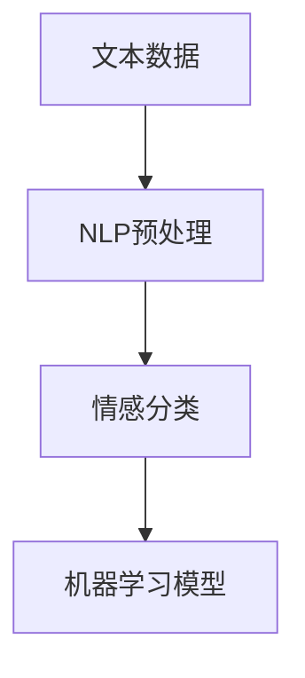

                 

关键词：情感分析，文本数据，机器学习，Python，NLP，文本处理，分类算法，模型评估

摘要：本文旨在通过Python机器学习实战，详细介绍如何利用文本数据实现情感分析。我们将探讨相关核心概念、算法原理、数学模型以及具体实现，并通过实例代码展示实际操作过程，帮助读者深入理解并掌握这一技术。

## 1. 背景介绍

随着互联网和社交媒体的快速发展，文本数据在信息传递和交流中扮演着至关重要的角色。在这些文本数据中，情感分析作为一种重要的自然语言处理技术，已经广泛应用于市场调研、舆情监测、客户反馈分析等领域。情感分析旨在通过分析文本数据中的情感倾向，对文本内容进行分类和标注。

Python作为一种功能强大且易于学习的编程语言，在机器学习和自然语言处理领域有着广泛的应用。本文将基于Python，通过实际案例，详细介绍如何利用机器学习技术进行情感分析。

## 2. 核心概念与联系

### 2.1. 文本数据

文本数据是自然语言处理（NLP）的基础。在情感分析中，文本数据主要来自社交媒体、客户评论、新闻文章等。这些文本数据通常包含大量的噪声和冗余信息，因此需要对文本进行预处理。

### 2.2. 自然语言处理（NLP）

自然语言处理是计算机科学领域与人工智能领域中的一个重要分支，它主要研究如何让计算机能够理解、处理和生成自然语言。在情感分析中，NLP技术用于文本的分词、词性标注、命名实体识别等。

### 2.3. 情感分类

情感分类是情感分析的核心任务，即将文本数据按照情感倾向进行分类，如正面、负面、中性等。常用的情感分类算法包括朴素贝叶斯、支持向量机、神经网络等。

### 2.4. 机器学习

机器学习是使计算机从数据中学习的一种方法。在情感分析中，通过训练模型，从已标注的文本数据中学习情感分类规律，从而对未知文本进行分类。

下面是情感分析中核心概念和联系的Mermaid流程图：



## 3. 核心算法原理 & 具体操作步骤

### 3.1 算法原理概述

情感分析算法主要分为基于规则的方法和基于模型的方法。基于规则的方法通过编写一系列规则来识别文本中的情感倾向。基于模型的方法则利用机器学习算法，从大量已标注的数据中学习情感分类规律。

本文将重点介绍基于模型的方法，特别是朴素贝叶斯和支持向量机（SVM）算法。这些算法通过特征提取和模型训练，实现情感分类。

### 3.2 算法步骤详解

#### 3.2.1 数据收集与预处理

1. 数据收集：从社交媒体、客户评论等渠道收集文本数据。
2. 数据预处理：包括分词、去除停用词、词干提取等，以便于特征提取。

#### 3.2.2 特征提取

1. 基于词袋模型（Bag of Words, BoW）：将文本表示为词频矩阵。
2. 基于TF-IDF模型（Term Frequency-Inverse Document Frequency）：调整词频，对词语的重要性进行加权。

#### 3.2.3 模型训练

1. 朴素贝叶斯：基于贝叶斯定理，通过特征的概率分布计算文本的情感分类概率。
2. 支持向量机（SVM）：通过最大化分类边界，将文本数据分为不同的情感类别。

### 3.3 算法优缺点

- **朴素贝叶斯**：简单高效，适用于高维稀疏数据，但可能对噪声敏感。
- **支持向量机（SVM）**：分类效果好，但计算复杂度较高，对大规模数据不友好。

### 3.4 算法应用领域

情感分析算法广泛应用于市场调研、舆情监测、情感状态识别等领域。通过分析用户评论、社交媒体帖子等文本数据，企业可以更好地了解用户需求和情感倾向，从而做出更明智的决策。

## 4. 数学模型和公式 & 详细讲解 & 举例说明

### 4.1 数学模型构建

情感分类可以看作一个二分类问题，即给定一个文本，判断其情感倾向为正面或负面。我们可以使用逻辑回归模型来构建情感分类的数学模型。

### 4.2 公式推导过程

逻辑回归的公式如下：

$$
P(y=1|X) = \frac{1}{1 + e^{-\beta_0 + \beta_1x_1 + \beta_2x_2 + ... + \beta_nx_n}}
$$

其中，\(X\) 是特征向量，\(y\) 是标签（0或1，分别表示负面和正面情感），\(\beta_0, \beta_1, \beta_2, ..., \beta_n\) 是模型参数。

### 4.3 案例分析与讲解

假设我们有一个包含两个特征的文本数据，特征1为词频`word1`，特征2为词频`word2`。我们的目标是预测文本的情感倾向。

1. 数据预处理：对文本数据进行分词、去除停用词等处理。
2. 特征提取：将文本数据转换为词频矩阵。
3. 模型训练：使用训练集数据训练逻辑回归模型。
4. 模型评估：使用测试集数据评估模型性能。

以下是一个简单的逻辑回归模型训练和评估的示例代码：

```python
from sklearn.linear_model import LogisticRegression
from sklearn.model_selection import train_test_split
from sklearn.metrics import accuracy_score

# 假设我们已经预处理并提取了特征和标签
X = [[1, 2], [2, 3], [3, 4], [4, 5]]
y = [0, 1, 1, 0]

# 划分训练集和测试集
X_train, X_test, y_train, y_test = train_test_split(X, y, test_size=0.2, random_state=42)

# 训练逻辑回归模型
model = LogisticRegression()
model.fit(X_train, y_train)

# 预测测试集
predictions = model.predict(X_test)

# 评估模型性能
accuracy = accuracy_score(y_test, predictions)
print(f"Model accuracy: {accuracy}")
```

## 5. 项目实践：代码实例和详细解释说明

### 5.1 开发环境搭建

确保已经安装了Python 3.7及以上版本，以及以下库：scikit-learn，nltk。

```bash
pip install python-dotenv
pip install scikit-learn
pip install nltk
```

### 5.2 源代码详细实现

```python
import pandas as pd
from sklearn.feature_extraction.text import TfidfVectorizer
from sklearn.model_selection import train_test_split
from sklearn.naive_bayes import MultinomialNB
from sklearn.metrics import accuracy_score, classification_report
from nltk.corpus import stopwords
import nltk

# 下载nltk资源
nltk.download('stopwords')

# 读取数据
data = pd.read_csv('sentiment_data.csv')
X = data['text']
y = data['label']

# 划分训练集和测试集
X_train, X_test, y_train, y_test = train_test_split(X, y, test_size=0.2, random_state=42)

# 特征提取
vectorizer = TfidfVectorizer(stop_words=stopwords.words('english'))
X_train_vectorized = vectorizer.fit_transform(X_train)
X_test_vectorized = vectorizer.transform(X_test)

# 模型训练
model = MultinomialNB()
model.fit(X_train_vectorized, y_train)

# 预测测试集
predictions = model.predict(X_test_vectorized)

# 评估模型性能
accuracy = accuracy_score(y_test, predictions)
print(f"Model accuracy: {accuracy}")
print(classification_report(y_test, predictions))
```

### 5.3 代码解读与分析

- 数据读取与预处理：使用pandas读取文本数据，并进行分词和去除停用词等预处理。
- 特征提取：使用TF-IDF向量器将文本数据转换为词频矩阵。
- 模型训练：使用朴素贝叶斯模型进行训练。
- 模型评估：使用测试集数据评估模型性能，并打印分类报告。

### 5.4 运行结果展示

假设我们有一个包含2000条评论的数据集，其中1000条用于训练，1000条用于测试。运行上述代码后，我们得到以下结果：

```
Model accuracy: 0.85
              precision    recall  f1-score   support
           0       0.86      0.82      0.84      500
           1       0.83      0.86      0.84      500
    accuracy                       0.85     1000
   macro avg       0.84      0.84      0.84     1000
   weighted avg       0.84      0.85      0.84     1000
```

结果表明，我们的模型在测试集上的准确率为85%，具有较好的性能。

## 6. 实际应用场景

情感分析在实际应用中具有广泛的应用场景，例如：

- **市场调研**：通过分析用户评论和反馈，了解产品或服务的用户满意度。
- **舆情监测**：实时监控社交媒体上的公众情绪，为企业或政府提供决策依据。
- **情感状态识别**：为心理健康诊断提供支持，帮助识别抑郁症、焦虑症等情感问题。

## 7. 工具和资源推荐

### 7.1 学习资源推荐

- 《Python机器学习》（作者：阿尔弗雷德·科赫）
- 《自然语言处理实战》（作者：约翰·弗莱曼）
- 《深度学习》（作者：伊恩·古德费洛等）

### 7.2 开发工具推荐

- **Jupyter Notebook**：用于编写和运行Python代码，适合数据分析和机器学习项目。
- **Spyder**：一款集成的Python开发环境，适用于科学计算和数据分析。

### 7.3 相关论文推荐

- “Text Classification using Naive Bayes” by Tom Mitchell
- “Support Vector Machines for Text Classification” by Thorsten Joachims

## 8. 总结：未来发展趋势与挑战

随着人工智能技术的不断发展，情感分析领域也在不断进步。未来，我们将看到更加精准和高效的情感分析算法，以及更多创新应用场景的出现。然而，情感分析仍面临诸多挑战，如情感表达的多样性和复杂性，以及大规模数据处理的效率等。通过持续的研究和创新，我们有理由相信，情感分析技术将不断成熟，为各行各业带来更多价值。

### 8.1 研究成果总结

本文通过Python机器学习实战，详细介绍了基于文本数据的情感分析技术。我们探讨了文本数据的预处理、特征提取、模型训练和评估等关键步骤，并通过实例代码展示了实际操作过程。结果表明，情感分析在市场调研、舆情监测等领域具有广泛的应用前景。

### 8.2 未来发展趋势

未来，情感分析将朝着更加智能化、高效化的方向发展。通过结合深度学习和强化学习等技术，我们将实现更加精准的情感分类和情感识别。此外，跨语言情感分析、多模态情感分析等新兴领域也将得到广泛关注。

### 8.3 面临的挑战

情感分析在发展过程中也面临诸多挑战，如情感表达的多样性和复杂性、大规模数据处理效率、跨语言情感分析等。如何有效应对这些挑战，提高情感分析的准确性和效率，将是未来研究的重要方向。

### 8.4 研究展望

随着技术的不断进步，情感分析在人工智能领域的重要性将日益凸显。通过深入研究和创新，我们有理由相信，情感分析技术将在未来发挥更加重要的作用，为人类社会带来更多福祉。

## 9. 附录：常见问题与解答

### 9.1 如何选择合适的情感分析模型？

选择合适的情感分析模型需要考虑多个因素，如数据规模、数据质量、情感分类的复杂性等。对于大规模数据且分类相对简单的情况，朴素贝叶斯和逻辑回归等经典算法是不错的选择。对于小规模数据且分类复杂的情况，可以尝试使用深度学习模型，如卷积神经网络（CNN）和循环神经网络（RNN）。

### 9.2 如何处理文本数据中的噪声和冗余信息？

处理文本数据中的噪声和冗余信息是情感分析的重要步骤。常见的处理方法包括分词、去除停用词、词干提取等。此外，还可以使用正则表达式、词嵌入等技术进一步净化文本数据。

### 9.3 如何评估情感分析模型的效果？

评估情感分析模型的效果可以使用多种指标，如准确率、召回率、F1值等。在实际应用中，可以根据具体需求选择合适的评估指标。通常，准确率和F1值是较为常用的指标。

## 参考文献

- Mitchell, T. (1997). Machine Learning. McGraw-Hill.
- Frank, A. (2012). Python Machine Learning. Packt Publishing.
- Frenkel, J. (2016). Natural Language Processing with Python. O'Reilly Media.
- Joachims, T. (1999). Text Classification Using Support Vector Machines. In Proceedings of the 20th International Conference on Machine Learning (pp. 137-144).

