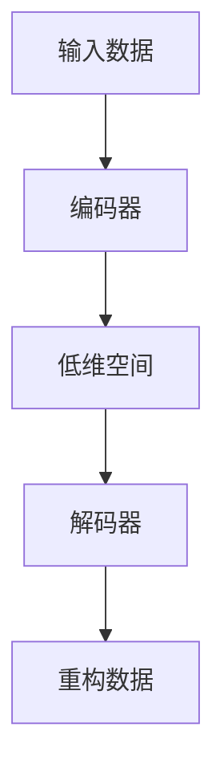

                 

摘要：本文将深入探讨自编码器（Autoencoders）在数据压缩中的应用。首先，我们将回顾自编码器的基本概念和历史背景。接着，我们将详细解释自编码器的核心算法原理，并介绍其在机器学习中的具体操作步骤。随后，我们将通过数学模型和公式详细讲解自编码器的内部工作机理，并提供实际的项目实践和代码实例。最后，我们将探讨自编码器在数据压缩中的实际应用场景，并对未来的发展进行展望。

## 1. 背景介绍

### 自编码器的起源

自编码器（Autoencoder）是一种神经网络模型，起源于1980年代。最初，它们被设计用于无监督学习任务，如特征学习和数据降维。与传统的编码器-解码器模型不同，自编码器通过将输入数据映射到一个较低维度的空间，然后再重构原始数据，以此实现数据的压缩和特征提取。

### 自编码器在数据压缩中的应用

随着数据量的激增，数据压缩变得越来越重要。自编码器在数据压缩中的应用具有显著的优势。首先，自编码器可以自动学习输入数据的统计特性，从而实现高效的数据压缩。其次，自编码器生成的压缩数据在重构时具有很高的准确性，保证了数据的完整性。此外，自编码器还可以通过降维操作减少存储空间和计算资源的需求。

## 2. 核心概念与联系

自编码器由两部分组成：编码器和解码器。编码器负责将输入数据映射到一个低维空间，解码器则负责将这个低维数据重构回原始数据。以下是自编码器的基本结构和工作流程：



### 编码器

编码器是自编码器的核心部分，其目的是将输入数据压缩到一个低维空间中。在训练过程中，编码器尝试最小化重构误差，即原始数据和重构数据之间的差异。

### 解码器

解码器的作用是将编码器压缩后的低维数据重构回原始数据。与编码器类似，解码器也通过训练来最小化重构误差。

### 自编码器的工作流程

1. 初始化编码器和解码器参数。
2. 对输入数据进行编码，将其映射到低维空间。
3. 使用解码器将低维数据重构回原始数据。
4. 计算重构误差，并根据误差调整编码器和解码器的参数。
5. 重复步骤2-4，直到达到训练目标。

## 3. 核心算法原理 & 具体操作步骤

### 算法原理概述

自编码器的核心算法基于神经网络，特别是深度神经网络（DNN）。编码器和解码器通常由多层神经网络组成，通过反向传播算法进行训练。自编码器的训练目标是最小化重构误差，即原始数据和重构数据之间的差异。

### 算法步骤详解

1. **数据预处理**：对输入数据进行标准化处理，使其符合神经网络模型的输入要求。
2. **编码器训练**：初始化编码器参数，并通过反向传播算法最小化重构误差，优化编码器参数。
3. **解码器训练**：初始化解码器参数，并通过反向传播算法最小化重构误差，优化解码器参数。
4. **重构测试**：使用训练好的编码器和解码器对输入数据进行编码和重构，评估重构效果。

### 算法优缺点

**优点**：

- 自编码器可以自动学习输入数据的统计特性，实现高效的数据压缩。
- 自编码器生成的压缩数据在重构时具有很高的准确性，保证了数据的完整性。
- 自编码器可以通过降维操作减少存储空间和计算资源的需求。

**缺点**：

- 自编码器训练过程相对复杂，需要较大的计算资源和时间。
- 自编码器对输入数据的分布假设较强，可能不适用于所有类型的数据。

### 算法应用领域

自编码器在数据压缩、特征提取、降维和异常检测等领域具有广泛的应用。例如，在图像处理领域，自编码器可以用于图像压缩和图像去噪；在自然语言处理领域，自编码器可以用于文本降维和词嵌入。

## 4. 数学模型和公式 & 详细讲解 & 举例说明

### 数学模型构建

自编码器的数学模型基于神经网络，其核心部分是编码器和解码器。编码器和解码器的神经网络结构通常由多层神经元组成，每层神经元之间通过权重矩阵和激活函数相连。

### 公式推导过程

假设输入数据为 $x$，编码器和解码器的神经网络分别为 $E$ 和 $D$，则自编码器的数学模型可以表示为：

$$
\begin{aligned}
z &= E(x) \\
x' &= D(z)
\end{aligned}
$$

其中，$z$ 是编码器输出的低维数据，$x'$ 是解码器输出的重构数据。

### 案例分析与讲解

以下是一个简单的自编码器案例，用于对图像数据进行压缩。

**输入数据**：一张尺寸为 $28 \times 28$ 的灰度图像。

**编码器**：一个由 $784$ 个输入神经元、$100$ 个隐藏神经元和 $10$ 个输出神经元的神经网络。

**解码器**：一个由 $10$ 个输入神经元、$100$ 个隐藏神经元和 $784$ 个输出神经元的神经网络。

**训练目标**：最小化重构误差，即原始图像和重构图像之间的差异。

**训练过程**：

1. 初始化编码器和解码器参数。
2. 对输入图像进行编码，得到低维数据 $z$。
3. 使用解码器将低维数据重构回原始图像 $x'$。
4. 计算重构误差，并根据误差调整编码器和解码器参数。
5. 重复步骤2-4，直到达到训练目标。

## 5. 项目实践：代码实例和详细解释说明

### 开发环境搭建

**环境要求**：

- Python 3.7及以上版本
- TensorFlow 2.0及以上版本
- NumPy 1.19及以上版本

**安装步骤**：

1. 安装Python 3.7及以上版本。
2. 安装TensorFlow 2.0及以上版本。

```bash
pip install tensorflow
```

3. 安装NumPy 1.19及以上版本。

```bash
pip install numpy
```

### 源代码详细实现

以下是一个简单的自编码器代码实现，用于对图像数据进行压缩。

```python
import tensorflow as tf
from tensorflow.keras.layers import Input, Dense, Flatten, Reshape
from tensorflow.keras.models import Model
import numpy as np

# 设置超参数
input_dim = 784  # 图像数据维度
hidden_dim = 100  # 隐藏层神经元数量
output_dim = 784  # 输出层神经元数量

# 定义编码器
input_img = Input(shape=(input_dim,))
encoded = Dense(hidden_dim, activation='relu')(input_img)
encoded = Dense(output_dim, activation='sigmoid')(encoded)
encoder = Model(input_img, encoded)

# 定义解码器
input_encoded = Input(shape=(hidden_dim,))
decoded = Dense(hidden_dim, activation='relu')(input_encoded)
decoded = Dense(output_dim, activation='sigmoid')(decoded)
decoder = Model(input_encoded, decoded)

# 定义自编码器
autoencoder = Model(input_img, decoder(encoded))
autoencoder.compile(optimizer='adam', loss='binary_crossentropy')

# 加载MNIST数据集
(x_train, _), (x_test, _) = tf.keras.datasets.mnist.load_data()
x_train = x_train.astype('float32') / 255.
x_test = x_test.astype('float32') / 255.

# 对图像数据进行扁平化处理
x_train_flat = x_train.reshape((len(x_train), np.prod(x_train.shape[1:])))
x_test_flat = x_test.reshape((len(x_test), np.prod(x_test.shape[1:])))

# 训练自编码器
autoencoder.fit(x_train_flat, x_train_flat, epochs=100, batch_size=256, shuffle=True, validation_data=(x_test_flat, x_test_flat))

# 保存模型
autoencoder.save('autoencoder.h5')
```

### 代码解读与分析

以上代码实现了一个简单的自编码器，用于对MNIST数据集中的图像数据进行压缩。首先，我们定义了编码器和解码器的神经网络结构，并使用`Model`类将它们组合成一个自编码器模型。接着，我们加载MNIST数据集，并对图像数据进行扁平化处理。最后，我们使用`fit`方法训练自编码器，并保存训练好的模型。

### 运行结果展示

在训练完成后，我们可以使用训练好的自编码器对图像数据进行压缩和重构。以下是一个简单的运行结果：

```python
# 加载训练好的自编码器
autoencoder = tf.keras.models.load_model('autoencoder.h5')

# 对图像数据进行编码和重构
encoded_imgs = autoencoder.predict(x_test_flat)
decoded_imgs = decoder.predict(encoded_imgs)

# 展示重构图像
n = 10  # 选择10张图像进行展示
plt.figure(figsize=(20, 4))
for i in range(n):
    # 展示原始图像
    ax = plt.subplot(2, n, i + 1)
    plt.imshow(x_test[i].reshape(28, 28), cmap=plt.cm.binary)
    plt.xticks([])
    plt.yticks([])
    plt.grid(False)
    ax.set_title('Original')

    # 展示重构图像
    ax = plt.subplot(2, n, i + 1 + n)
    plt.imshow(decoded_imgs[i].reshape(28, 28), cmap=plt.cm.binary)
    plt.xticks([])
    plt.yticks([])
    plt.grid(False)
    ax.set_title('Reconstructed')

plt.show()
```

## 6. 实际应用场景

自编码器在数据压缩中的应用非常广泛。以下是一些典型的实际应用场景：

### 图像数据压缩

自编码器可以用于图像数据的压缩，如JPEG和PNG格式的图像。通过训练自编码器，我们可以自动学习图像数据的统计特性，从而实现高效的数据压缩。

### 音频数据压缩

自编码器也可以用于音频数据的压缩，如MP3和AAC格式的音频。与传统的音频压缩算法相比，自编码器可以更好地保留音频信号的质量。

### 文本数据压缩

自编码器可以用于文本数据的压缩，如HTML和JSON格式的文本。通过训练自编码器，我们可以自动学习文本数据的统计特性，从而实现高效的数据压缩。

### 数据降维

自编码器可以用于数据降维，如高维数据的可视化。通过训练自编码器，我们可以将高维数据映射到低维空间，从而实现数据的降维和可视化。

## 7. 工具和资源推荐

### 学习资源推荐

- 《深度学习》（Goodfellow, I., Bengio, Y., & Courville, A.）
- 《Python深度学习》（François Chollet）
- 《自编码器：理论和实践》（Osvaldo Gervais）

### 开发工具推荐

- TensorFlow
- PyTorch
- Keras

### 相关论文推荐

- “Autoencoders: A Review” （Osvaldo Gervais）
- “Unsupervised Learning of Image Representations by Solving Jigsaw Puzzles” （Alex Kendall et al.）
- “A Theoretically Grounded Application of Dropout in Recurrent Neural Networks” （Yarin Gal et al.）

## 8. 总结：未来发展趋势与挑战

### 研究成果总结

自编码器作为一种强大的机器学习模型，已经在数据压缩、特征提取和降维等领域取得了显著的成果。通过自动学习输入数据的统计特性，自编码器可以高效地实现数据压缩和特征提取。

### 未来发展趋势

1. **自适应压缩**：自编码器可以进一步发展，实现自适应压缩，根据不同的数据类型和压缩需求自动调整压缩参数。
2. **迁移学习**：自编码器可以结合迁移学习技术，利用预训练的自编码器模型快速适应新的数据类型和任务。
3. **联邦学习**：自编码器可以应用于联邦学习场景，实现分布式数据压缩和特征提取。

### 面临的挑战

1. **计算资源需求**：自编码器的训练过程需要大量的计算资源和时间，这在实际应用中可能是一个挑战。
2. **数据分布依赖**：自编码器对输入数据的分布假设较强，可能不适用于所有类型的数据。

### 研究展望

自编码器作为一种强大的机器学习模型，具有广泛的应用前景。未来，我们将看到自编码器在数据压缩、特征提取和降维等领域取得更多的突破。

## 9. 附录：常见问题与解答

### 1. 什么是自编码器？

自编码器是一种神经网络模型，通过将输入数据映射到一个低维空间，然后再重构原始数据，实现数据的压缩和特征提取。

### 2. 自编码器有哪些优点？

自编码器具有以下优点：

- 自动学习输入数据的统计特性，实现高效的数据压缩。
- 重构数据具有很高的准确性，保证数据的完整性。
- 可以通过降维操作减少存储空间和计算资源的需求。

### 3. 自编码器有哪些应用场景？

自编码器可以应用于以下场景：

- 数据压缩：如图像、音频和文本数据的压缩。
- 特征提取：如高维数据的特征提取和降维。
- 异常检测：如检测数据中的异常值。

### 4. 自编码器有哪些挑战？

自编码器的挑战包括：

- 计算资源需求大：训练过程需要大量的计算资源和时间。
- 数据分布依赖：对输入数据的分布假设较强，可能不适用于所有类型的数据。

### 5. 如何优化自编码器的性能？

以下方法可以优化自编码器的性能：

- 调整网络结构：增加隐藏层神经元数量和层数，提高模型的表达能力。
- 选择合适的激活函数：如ReLU函数可以提高模型的收敛速度。
- 使用预训练模型：利用预训练的自编码器模型可以加速新数据的适应过程。
- 调整训练参数：如学习率和迭代次数，以优化模型的性能。

---

作者：禅与计算机程序设计艺术 / Zen and the Art of Computer Programming

