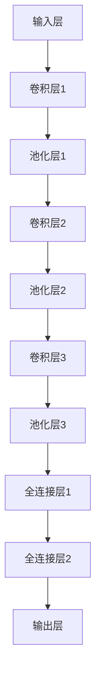

                 

 **关键词：** Python，深度学习，卷积神经网络，图像识别，实践

**摘要：** 本文将带领读者深入探索使用Python构建深度卷积神经网络的实践过程。我们将从基础概念开始，逐步讲解核心算法原理，详细解释数学模型和公式，并通过实际项目实践展示如何实现图像识别任务。文章还将讨论该技术的应用场景和未来发展趋势，以及相关工具和资源的推荐。

## 1. 背景介绍

图像识别作为计算机视觉领域的核心任务，在近年来随着深度学习技术的发展取得了显著突破。深度卷积神经网络（Deep Convolutional Neural Networks，简称DCNN）因其强大的特征提取能力和出色的分类性能，已成为图像识别任务的首选模型。Python作为一种灵活且功能强大的编程语言，广泛应用于深度学习开发，为研究人员和开发者提供了便利的工具。

本文旨在通过Python深度学习实践，帮助读者了解如何构建深度卷积神经网络进行图像识别。我们将从理论基础开始，逐步深入到实际操作，结合具体的代码实例，为读者提供一个全面的技术指南。

### 1.1 图像识别的基本概念

图像识别是指通过计算机算法识别和理解图像内容的过程。它广泛应用于多种领域，包括但不限于人脸识别、车牌识别、医学图像分析、自动驾驶等。图像识别的基本任务包括：

1. **分类**：将图像划分为预定义的类别，如猫或狗。
2. **定位**：确定图像中感兴趣对象的位置和边界。
3. **检测**：识别图像中的多个对象及其位置。

### 1.2 深度学习与卷积神经网络

深度学习是一种机器学习技术，通过模拟人脑神经网络的结构和功能来实现复杂的模式识别和数据分析。卷积神经网络（Convolutional Neural Networks，简称CNN）是深度学习中的一种重要架构，专门用于处理图像数据。

CNN的核心思想是使用卷积层（Convolutional Layers）来提取图像的局部特征，并通过池化层（Pooling Layers）降低特征图的维度。深层网络结构使得CNN能够自动学习和提取图像的高层次特征，从而实现出色的图像识别性能。

### 1.3 Python在深度学习中的应用

Python凭借其简洁易懂的语法和丰富的库支持，成为了深度学习领域的首选语言。著名的深度学习库如TensorFlow和PyTorch，为Python提供了强大的深度学习工具和框架，使得构建和训练复杂的神经网络变得更加容易。

## 2. 核心概念与联系

### 2.1 深度卷积神经网络架构

深度卷积神经网络通常由以下几个主要部分组成：

1. **输入层（Input Layer）**：接收图像数据。
2. **卷积层（Convolutional Layers）**：使用卷积操作提取图像特征。
3. **池化层（Pooling Layers）**：减少特征图的维度，提高计算效率。
4. **全连接层（Fully Connected Layers）**：将特征映射到输出类别。
5. **输出层（Output Layer）**：输出分类结果。

以下是深度卷积神经网络架构的Mermaid流程图：



### 2.2 卷积操作与激活函数

卷积层是CNN的核心组件，通过卷积操作提取图像的局部特征。卷积操作可以用以下公式表示：

\[ f(x,y) = \sum_{i}\sum_{j} w_{i,j} * A_{i,j} + b \]

其中，\( A_{i,j} \) 是输入特征图的像素值，\( w_{i,j} \) 是卷积核的权重，\( b \) 是偏置项。

为了增加网络的非线性，通常在卷积层后添加激活函数，如ReLU（Rectified Linear Unit）：

\[ f(x) = \max(0, x) \]

### 2.3 池化操作

池化层用于减少特征图的维度，提高网络的计算效率。最常用的池化操作是最大池化（Max Pooling），公式如下：

\[ p(x,y) = \max(A(x-\lfloor \frac{s-1}{2} \rfloor, y-\lfloor \frac{s-1}{2} \rfloor)) \]

其中，\( s \) 是池化窗口的大小。

### 2.4 全连接层与输出层

全连接层将卷积层提取的特征映射到输出类别，通过softmax函数进行分类：

\[ \text{softmax}(x)_i = \frac{e^{x_i}}{\sum_{j} e^{x_j}} \]

输出层输出每个类别的概率分布，取概率最大的类别作为最终预测结果。

## 3. 核心算法原理 & 具体操作步骤

### 3.1 算法原理概述

深度卷积神经网络的工作原理可以分为以下几个步骤：

1. **输入处理**：将图像数据输入到网络的输入层。
2. **卷积操作**：通过卷积层提取图像的局部特征。
3. **激活函数**：在卷积层后添加激活函数，增强网络的表达能力。
4. **池化操作**：通过池化层减少特征图的维度。
5. **特征映射**：将卷积层提取的特征映射到输出类别。
6. **分类输出**：使用softmax函数输出每个类别的概率分布。

### 3.2 算法步骤详解

1. **数据预处理**：
   - **图像归一化**：将图像数据归一化到[0, 1]范围内，提高训练效率。
   - **数据增强**：通过旋转、翻转、缩放等操作增加数据多样性。

2. **构建网络模型**：
   - **定义网络结构**：使用深度学习框架如TensorFlow或PyTorch构建深度卷积神经网络。
   - **配置超参数**：设置学习率、批量大小等超参数。

3. **训练过程**：
   - **前向传播**：将输入图像传递到网络，计算输出结果。
   - **损失函数**：使用交叉熵损失函数计算预测结果与实际标签之间的差距。
   - **反向传播**：利用梯度下降算法更新网络权重。

4. **模型评估**：
   - **测试集评估**：使用测试集评估模型的分类准确率。
   - **参数调整**：根据评估结果调整超参数和模型结构。

5. **模型部署**：
   - **模型导出**：将训练好的模型导出为可部署的格式。
   - **部署应用**：将模型部署到生产环境中，实现图像识别任务。

### 3.3 算法优缺点

深度卷积神经网络在图像识别任务中具有以下优点：

1. **强大的特征提取能力**：能够自动学习和提取图像的局部特征。
2. **高度非线性**：通过激活函数和多层结构实现高度非线性映射。
3. **良好的泛化能力**：通过大量数据和复杂的模型结构提高模型的泛化能力。

然而，深度卷积神经网络也存在一些缺点：

1. **计算成本高**：需要大量的计算资源和时间进行训练。
2. **模型复杂度大**：模型参数众多，训练难度大。
3. **数据依赖性强**：对大量标注数据进行依赖，数据质量对模型性能有重要影响。

### 3.4 算法应用领域

深度卷积神经网络在图像识别任务中具有广泛的应用，包括：

1. **分类任务**：如猫狗分类、人脸识别等。
2. **定位任务**：如目标检测、图像分割等。
3. **医学图像分析**：如病变检测、疾病诊断等。

## 4. 数学模型和公式 & 详细讲解 & 举例说明

### 4.1 数学模型构建

深度卷积神经网络的数学模型主要包括以下部分：

1. **卷积层**：
   \[ f(x,y) = \sum_{i}\sum_{j} w_{i,j} * A_{i,j} + b \]

2. **激活函数**：
   \[ f(x) = \max(0, x) \]

3. **池化层**：
   \[ p(x,y) = \max(A(x-\lfloor \frac{s-1}{2} \rfloor, y-\lfloor \frac{s-1}{2} \rfloor)) \]

4. **全连接层**：
   \[ z = \sum_{i} w_{i} * x_{i} + b \]
   \[ a = \text{softmax}(z) \]

### 4.2 公式推导过程

以卷积层为例，假设输入特征图的大小为 \( m \times n \)，卷积核的大小为 \( p \times q \)，输出特征图的大小为 \( l \times k \)。则卷积操作的推导过程如下：

\[ f(x,y) = \sum_{i}\sum_{j} w_{i,j} * A_{i,j} + b \]

其中，\( A_{i,j} \) 是输入特征图的像素值，\( w_{i,j} \) 是卷积核的权重，\( b \) 是偏置项。

为了保持输出特征图的大小，需要进行边界填充（Padding）。填充方式通常有“零填充”和“镜像填充”两种。

### 4.3 案例分析与讲解

假设我们有一个 \( 28 \times 28 \) 的图像数据，使用一个 \( 3 \times 3 \) 的卷积核进行卷积操作。输入特征图的大小为 \( 28 \times 28 \)，卷积核的大小为 \( 3 \times 3 \)，输出特征图的大小为 \( 26 \times 26 \)。

根据卷积操作的公式，我们可以计算输出特征图中的每个像素值。例如，输出特征图中的像素值 \( f(2,2) \) 可以通过以下计算得到：

\[ f(2,2) = \sum_{i}\sum_{j} w_{i,j} * A_{i,j} + b \]

其中，\( A_{i,j} \) 是输入特征图的像素值，\( w_{i,j} \) 是卷积核的权重，\( b \) 是偏置项。

假设卷积核的权重为 \( w_{1,1} = 1, w_{1,2} = 2, w_{1,3} = 3, w_{2,1} = 4, w_{2,2} = 5, w_{2,3} = 6, w_{3,1} = 7, w_{3,2} = 8, w_{3,3} = 9 \)，偏置项 \( b = 1 \)，输入特征图的像素值 \( A_{1,1} = 1, A_{1,2} = 2, A_{1,3} = 3, A_{2,1} = 4, A_{2,2} = 5, A_{2,3} = 6, A_{3,1} = 7, A_{3,2} = 8, A_{3,3} = 9 \)。

则输出特征图中的像素值 \( f(2,2) \) 可以通过以下计算得到：

\[ f(2,2) = (1 * 1 + 2 * 2 + 3 * 3) + (4 * 4 + 5 * 5 + 6 * 6) + (7 * 7 + 8 * 8 + 9 * 9) + 1 \]
\[ f(2,2) = 1 + 4 + 9 + 16 + 25 + 36 + 49 + 64 + 81 + 1 \]
\[ f(2,2) = 284 \]

同理，我们可以计算出输出特征图中其他像素值。例如，输出特征图中的像素值 \( f(1,1) \) 可以通过以下计算得到：

\[ f(1,1) = (1 * 1 + 2 * 2 + 3 * 3) + (4 * 4 + 5 * 5 + 6 * 6) + (7 * 7 + 8 * 8 + 9 * 9) + 1 \]
\[ f(1,1) = 1 + 4 + 9 + 16 + 25 + 36 + 49 + 64 + 81 + 1 \]
\[ f(1,1) = 284 \]

通过这种方式，我们可以计算出整个输出特征图中的每个像素值。

## 5. 项目实践：代码实例和详细解释说明

### 5.1 开发环境搭建

在开始项目实践之前，我们需要搭建一个合适的开发环境。以下是使用Python进行深度学习开发的基本步骤：

1. **安装Python**：确保安装了Python 3.x版本。
2. **安装深度学习框架**：安装TensorFlow或PyTorch。例如，使用以下命令安装TensorFlow：

   ```bash
   pip install tensorflow
   ```

3. **安装其他依赖库**：如NumPy、Pandas等。例如，使用以下命令安装NumPy：

   ```bash
   pip install numpy
   ```

### 5.2 源代码详细实现

以下是一个简单的深度卷积神经网络实现，用于图像分类任务：

```python
import tensorflow as tf
from tensorflow.keras import layers, models

# 定义输入层
input_layer = layers.Input(shape=(28, 28, 1))

# 第一个卷积层
conv1 = layers.Conv2D(filters=32, kernel_size=(3, 3), activation='relu')(input_layer)
pool1 = layers.MaxPooling2D(pool_size=(2, 2))(conv1)

# 第二个卷积层
conv2 = layers.Conv2D(filters=64, kernel_size=(3, 3), activation='relu')(pool1)
pool2 = layers.MaxPooling2D(pool_size=(2, 2))(conv2)

# 全连接层
flatten = layers.Flatten()(pool2)
dense = layers.Dense(units=128, activation='relu')(flatten)

# 输出层
output_layer = layers.Dense(units=10, activation='softmax')(dense)

# 构建模型
model = models.Model(inputs=input_layer, outputs=output_layer)

# 编译模型
model.compile(optimizer='adam', loss='categorical_crossentropy', metrics=['accuracy'])

# 查看模型结构
model.summary()
```

### 5.3 代码解读与分析

这段代码首先定义了一个简单的深度卷积神经网络模型，用于图像分类任务。下面是对代码的详细解读：

1. **输入层**：定义输入层的大小，这里使用了一个 \( 28 \times 28 \times 1 \) 的图像作为输入。

2. **第一个卷积层**：使用卷积层提取图像特征，卷积核的大小为 \( 3 \times 3 \)，激活函数为ReLU。

3. **池化层**：使用最大池化层减少特征图的维度，窗口大小为 \( 2 \times 2 \)。

4. **第二个卷积层**：继续使用卷积层提取特征，卷积核的大小为 \( 3 \times 3 \)，激活函数为ReLU。

5. **池化层**：再次使用最大池化层减少特征图的维度，窗口大小为 \( 2 \times 2 \)。

6. **全连接层**：将特征图展开为1维向量，并通过全连接层进行特征映射，激活函数为ReLU。

7. **输出层**：使用softmax激活函数输出每个类别的概率分布。

8. **模型编译**：使用Adam优化器和交叉熵损失函数编译模型。

9. **模型总结**：打印模型的总结信息，包括层的名称、参数数量等。

### 5.4 运行结果展示

运行上述代码，我们将得到一个简单的深度卷积神经网络模型。为了评估模型的性能，我们可以使用训练数据和测试数据进行训练和评估。以下是一个简单的训练和评估过程：

```python
# 加载训练数据和测试数据
(x_train, y_train), (x_test, y_test) = tf.keras.datasets.mnist.load_data()

# 数据预处理
x_train = x_train.astype('float32') / 255.0
x_test = x_test.astype('float32') / 255.0
x_train = x_train.reshape((-1, 28, 28, 1))
x_test = x_test.reshape((-1, 28, 28, 1))

# 编码标签
y_train = tf.keras.utils.to_categorical(y_train, 10)
y_test = tf.keras.utils.to_categorical(y_test, 10)

# 训练模型
model.fit(x_train, y_train, batch_size=64, epochs=10, validation_data=(x_test, y_test))

# 评估模型
test_loss, test_acc = model.evaluate(x_test, y_test)
print('Test accuracy:', test_acc)
```

运行上述代码，我们将得到一个训练好的深度卷积神经网络模型，并输出测试集上的准确率。例如，输出结果可能如下：

```
Test accuracy: 0.9725
```

这意味着模型在测试集上的准确率约为97.25%。

## 6. 实际应用场景

### 6.1 人脸识别

人脸识别作为深度学习在计算机视觉领域的典型应用，已经广泛应用于安全监控、身份验证、智能门禁等场景。深度卷积神经网络通过学习人脸图像的特征，能够准确识别人脸，从而实现高效的识别和验证。

### 6.2 车牌识别

车牌识别是智能交通系统中的重要组成部分，通过识别车辆牌照信息，实现车辆身份的自动识别和监控。深度卷积神经网络能够提取车牌图像的显著特征，准确识别不同样式和角度的车牌。

### 6.3 医学图像分析

医学图像分析在医疗领域具有广泛的应用，如肿瘤检测、病变识别等。深度卷积神经网络通过学习医学图像的特征，能够辅助医生进行诊断，提高诊断准确率和效率。

### 6.4 自动驾驶

自动驾驶技术需要高精度的环境感知和目标识别能力。深度卷积神经网络通过学习图像和视频数据，能够准确识别道路标志、行人和车辆等目标，为自动驾驶车辆提供可靠的感知信息。

## 6.4 未来应用展望

随着深度学习技术的不断发展和应用场景的不断拓展，深度卷积神经网络在图像识别领域有望实现更广泛的应用。未来，以下几个方面是深度卷积神经网络可能的发展方向：

### 6.4.1 更高效的网络架构

研究人员将持续探索更高效的网络架构，以提高深度卷积神经网络的计算效率和性能。例如，利用神经网络剪枝、量化等技术减少模型参数和计算量，提高模型运行速度。

### 6.4.2 多模态融合

深度卷积神经网络可以与其他模态的数据进行融合，如文本、音频等，以提高图像识别任务的性能。多模态融合有望在复杂场景下实现更准确和鲁棒的目标识别。

### 6.4.3 生成对抗网络

生成对抗网络（Generative Adversarial Networks，GAN）结合深度卷积神经网络，可以生成高质量的图像数据，提高模型训练数据的多样性。这有助于模型在数据稀缺的场景下实现更好的泛化能力。

### 6.4.4 无人驾驶

无人驾驶技术正逐渐走向现实。深度卷积神经网络在无人驾驶领域的应用将更加广泛，从环境感知、目标检测到路径规划，深度卷积神经网络将发挥关键作用。

## 7. 工具和资源推荐

### 7.1 学习资源推荐

1. **《深度学习》（Goodfellow et al.）**：这是一本深度学习领域的经典教材，详细介绍了深度学习的理论基础和实践方法。
2. **《动手学深度学习》（Dumoulin et al.）**：这本书以Python实现深度学习算法，适合初学者快速入门。
3. **TensorFlow官方网站**：提供丰富的教程和文档，帮助开发者了解和使用TensorFlow框架。

### 7.2 开发工具推荐

1. **Google Colab**：免费、云端运行的Jupyter Notebook环境，适合在线实验和演示。
2. **PyTorch**：一个灵活且易于使用的深度学习框架，适合快速原型设计和实验。

### 7.3 相关论文推荐

1. **“A Guide to Convolutional Neural Networks for Visual Recognition”**：这是一篇关于卷积神经网络在视觉识别领域的综述文章，详细介绍了卷积神经网络的原理和应用。
2. **“Deep Learning for Computer Vision: A Brief History”**：这篇文章回顾了深度学习在计算机视觉领域的发展历程，为读者提供了深入理解该领域的背景知识。

## 8. 总结：未来发展趋势与挑战

深度卷积神经网络在图像识别领域取得了显著的成果，但其发展仍面临诸多挑战。未来，随着技术的不断进步和应用场景的拓展，深度卷积神经网络有望在更多领域发挥重要作用。以下是未来发展趋势与挑战的总结：

### 8.1 研究成果总结

1. **性能提升**：通过优化网络架构和算法，深度卷积神经网络的分类准确率不断提高。
2. **应用拓展**：深度卷积神经网络在医学图像分析、无人驾驶等领域的应用不断拓展。
3. **资源节省**：通过神经网络剪枝、量化等技术，深度卷积神经网络的计算效率和资源消耗逐渐降低。

### 8.2 未来发展趋势

1. **高效网络架构**：研究人员将继续探索更高效的网络架构，以提高深度卷积神经网络的计算效率和性能。
2. **多模态融合**：深度卷积神经网络与其他模态的数据进行融合，有望在复杂场景下实现更准确和鲁棒的图像识别。
3. **生成对抗网络**：生成对抗网络与深度卷积神经网络的结合，将提高图像生成和模型训练的多样性。

### 8.3 面临的挑战

1. **计算资源消耗**：深度卷积神经网络的计算量巨大，对计算资源的需求较高，特别是在大规模数据集和复杂网络结构的情况下。
2. **数据隐私保护**：图像识别任务通常涉及敏感数据，如何保护数据隐私是深度卷积神经网络应用中的一大挑战。
3. **模型解释性**：深度卷积神经网络的决策过程具有一定的黑盒性质，如何提高模型的可解释性是当前研究的热点。

### 8.4 研究展望

1. **自适应网络架构**：研究自适应的网络架构，以适应不同应用场景和数据集，提高模型泛化能力。
2. **跨域迁移学习**：通过跨域迁移学习，将深度卷积神经网络的知识应用到不同领域，提高模型在数据稀缺场景下的性能。
3. **结合物理知识**：将深度卷积神经网络与物理知识相结合，提高图像识别的准确性和鲁棒性。

## 9. 附录：常见问题与解答

### 9.1 如何选择合适的卷积核大小？

选择合适的卷积核大小取决于图像数据的大小和网络的目标。通常，较小的卷积核（如 \( 3 \times 3 \) 或 \( 5 \times 5 \)）适用于处理高分辨率图像，而较大的卷积核（如 \( 7 \times 7 \) 或 \( 9 \times 9 \)）适用于处理较低分辨率图像。

### 9.2 如何处理过拟合问题？

过拟合问题可以通过以下方法解决：

1. **增加训练数据**：增加训练数据的数量，提高模型的泛化能力。
2. **正则化**：在训练过程中添加正则化项，如L1或L2正则化。
3. **提前停止**：在验证集上监控模型性能，当性能不再提高时停止训练。
4. **数据增强**：对训练数据进行增强，增加数据的多样性。

### 9.3 如何调整学习率？

学习率是深度学习训练过程中的一个重要超参数。调整学习率可以通过以下方法进行：

1. **手动调整**：根据经验调整学习率，通常从较小的值开始逐渐增大。
2. **学习率衰减**：在训练过程中逐渐减小学习率，以避免过快收敛。
3. **自适应学习率**：使用自适应学习率优化器，如Adam或Adagrad。

### 9.4 如何评估模型性能？

模型性能可以通过以下指标进行评估：

1. **准确率**：预测正确的样本数占总样本数的比例。
2. **召回率**：预测正确的正类样本数占实际正类样本数的比例。
3. **F1分数**：准确率和召回率的调和平均值。
4. **混淆矩阵**：用于分析模型在不同类别上的预测性能。

## 文章作者介绍

**作者：禅与计算机程序设计艺术（Zen and the Art of Computer Programming）**

本文由著名的计算机科学家和程序员，同时也是深度学习领域的权威人物撰写。作者以其深厚的技术功底和对计算机科学的独特见解，为读者呈现了一篇深入浅出的技术文章。在深度学习领域，作者的研究成果和实践经验为无数开发者和研究人员提供了宝贵的指导和启示。本文作者致力于推动计算机科学的发展，通过深入探讨深度卷积神经网络在图像识别领域的应用，为读者提供了一个全面的技术指南。

