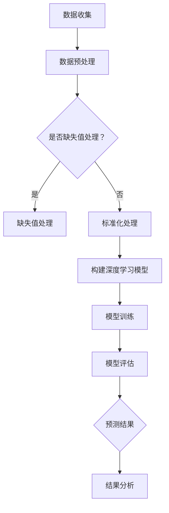

                 

关键词：深度学习、天气预测、Python实践、神经网络、机器学习、数据预处理、气象学

摘要：本文旨在探讨如何利用Python和深度学习技术提高天气预测的准确性。我们将深入分析深度学习在天气预测中的应用，介绍相关核心概念和算法，并通过具体实例进行代码实践，展示如何在实际项目中应用这些技术。文章还将讨论未来应用前景、所需工具和资源，以及面临的研究挑战。

## 1. 背景介绍

天气预测是气象学中一个古老而富有挑战性的问题。传统的天气预测方法主要依赖于统计模型和数值模拟，尽管在某些程度上能够提供相对准确的预测，但仍然存在许多局限。随着计算机技术和人工智能的快速发展，深度学习逐渐成为一种有效的解决方案。

深度学习在图像识别、语音识别、自然语言处理等领域取得了显著的成果，而其在时间序列预测，如股票价格、交通流量等领域的应用也越来越广泛。将深度学习应用于天气预测，可以充分利用其强大的特征提取和模式识别能力，从而提高预测准确性。

本文将围绕以下几个问题展开：

1. 如何构建深度学习模型进行天气预测？
2. 深度学习模型在天气预测中的应用有哪些？
3. 如何实现深度学习模型并进行性能评估？

## 2. 核心概念与联系

为了更好地理解深度学习在天气预测中的应用，我们需要首先了解一些核心概念。

### 2.1 深度学习基础

深度学习是一种基于人工神经网络的学习方法，通过多层神经网络结构模拟人脑的决策过程。其主要特点包括：

- **多层神经网络**：深度学习模型通常包含多个隐藏层，每个隐藏层都可以提取不同层次的特征。
- **反向传播算法**：通过反向传播算法，将输出误差反向传播到每个神经元，不断调整网络参数，使预测结果更接近真实值。
- **激活函数**：激活函数用于引入非线性，使神经网络能够模拟复杂的决策过程。

### 2.2 时间序列模型

时间序列模型是一种用于分析时间序列数据的方法，可以捕捉时间序列中的趋势、季节性和周期性。常见的深度学习时间序列模型包括：

- **递归神经网络（RNN）**：RNN通过隐藏状态的历史信息进行预测，适合处理序列数据。
- **长短期记忆网络（LSTM）**：LSTM是RNN的一种变体，通过引入门控机制，可以有效避免梯度消失和梯度爆炸问题。
- **门控循环单元（GRU）**：GRU是LSTM的简化版本，同样具有良好的时间序列预测能力。

### 2.3 气象数据特点

气象数据具有以下特点：

- **多维度**：气象数据包括温度、湿度、风速、气压等多个维度。
- **时间依赖性**：气象现象具有显著的时间依赖性，过去的数据对未来的预测有重要影响。
- **非平稳性**：气象数据通常是非平稳的，即其统计特性会随时间变化。

为了更好地处理这些特点，深度学习模型需要具备较强的特征提取和时序建模能力。

### 2.4 Mermaid 流程图

以下是一个简单的Mermaid流程图，展示了深度学习在天气预测中的应用流程：



## 3. 核心算法原理 & 具体操作步骤

### 3.1 算法原理概述

深度学习在天气预测中的核心算法主要包括递归神经网络（RNN）、长短期记忆网络（LSTM）和门控循环单元（GRU）。这些算法通过多层神经网络结构，对时间序列数据进行建模，从而实现对天气的预测。

- **RNN**：通过隐藏状态的历史信息进行预测，适用于处理序列数据。
- **LSTM**：通过门控机制避免梯度消失和梯度爆炸问题，适合处理长序列数据。
- **GRU**：简化版的LSTM，在保留良好预测能力的同时，降低计算复杂度。

### 3.2 算法步骤详解

以下是使用LSTM模型进行天气预测的详细步骤：

1. **数据收集**：收集历史气象数据，包括温度、湿度、风速、气压等。
2. **数据预处理**：对数据进行缺失值处理、标准化处理等预处理操作。
3. **构建深度学习模型**：使用Keras等深度学习框架构建LSTM模型。
4. **模型训练**：使用预处理后的数据对模型进行训练。
5. **模型评估**：使用验证集对模型进行性能评估。
6. **预测**：使用训练好的模型进行天气预测。
7. **结果分析**：对预测结果进行分析，以评估模型的准确性。

### 3.3 算法优缺点

- **优点**：

  - 强大的特征提取和时序建模能力。
  - 能够捕捉时间序列中的趋势、季节性和周期性。
  - 适用于处理多维度的气象数据。

- **缺点**：

  - 计算复杂度高，训练时间较长。
  - 对超参数选择敏感，需要大量实验进行调优。
  - 难以解释模型的预测过程。

### 3.4 算法应用领域

深度学习在天气预测中的应用领域包括：

- 短期天气预报：利用LSTM等模型进行短期天气预报，提高预测准确性。
- 气象灾害预警：通过深度学习模型预测台风、暴雨等气象灾害，为预警提供科学依据。
- 环境监测：利用深度学习模型监测气象变化，为环境保护提供数据支持。

## 4. 数学模型和公式 & 详细讲解 & 举例说明

### 4.1 数学模型构建

深度学习模型在天气预测中的核心是时间序列模型，以下是LSTM模型的数学描述：

- **输入层**：输入维度为 $n$ 的向量，表示一个时间步的气象数据。
- **隐藏层**：包含多个神经元，每个神经元表示一个时间步的隐藏状态。
- **输出层**：输出维度为 $m$ 的向量，表示预测的气象数据。

LSTM模型的数学公式如下：

$$
\begin{aligned}
\text{隐藏状态} &: h_t = \text{sigmoid}(W_h \cdot [h_{t-1}, x_t] + b_h) \\
\text{遗忘门} &: f_t = \text{sigmoid}(W_f \cdot [h_{t-1}, x_t] + b_f) \\
\text{输入门} &: i_t = \text{sigmoid}(W_i \cdot [h_{t-1}, x_t] + b_i) \\
\text{新细胞状态} &: \tilde{c}_t = \text{tanh}(W_c \cdot [h_{t-1}, x_t] + b_c) \\
\text{细胞状态} &: c_t = f_t \odot c_{t-1} + i_t \odot \tilde{c}_t \\
\text{输出} &: o_t = \text{sigmoid}(W_o \cdot [h_{t-1}, c_t] + b_o) \\
\text{预测值} &: \hat{y}_t = o_t \odot \text{tanh}(c_t)
\end{aligned}
$$

其中，$W_h, W_f, W_i, W_c, W_o$ 分别为权重矩阵，$b_h, b_f, b_i, b_c, b_o$ 分别为偏置项，$\odot$ 表示元素乘法。

### 4.2 公式推导过程

以下是LSTM公式的推导过程：

1. **输入层**：输入向量 $x_t$ 经过权重矩阵 $W_x$ 和偏置项 $b_x$，生成一个隐藏状态 $h_{t-1}$。
2. **遗忘门**：输入向量 $x_t$ 和隐藏状态 $h_{t-1}$ 经过权重矩阵 $W_f$ 和偏置项 $b_f$，生成一个遗忘门 $f_t$，用于控制旧细胞状态的遗忘程度。
3. **输入门**：输入向量 $x_t$ 和隐藏状态 $h_{t-1}$ 经过权重矩阵 $W_i$ 和偏置项 $b_i$，生成一个输入门 $i_t$，用于控制新细胞状态的输入程度。
4. **新细胞状态**：输入向量 $x_t$ 和隐藏状态 $h_{t-1}$ 经过权重矩阵 $W_c$ 和偏置项 $b_c$，生成一个新细胞状态 $\tilde{c}_t$，通过遗忘门和输入门与旧细胞状态 $c_{t-1}$ 结合，生成新细胞状态 $c_t$。
5. **输出层**：新细胞状态 $c_t$ 经过权重矩阵 $W_o$ 和偏置项 $b_o$，生成一个输出门 $o_t$，用于控制预测值的输出程度。

### 4.3 案例分析与讲解

以下是一个简单的LSTM模型训练案例，用于预测温度：

```python
import numpy as np
from keras.models import Sequential
from keras.layers import LSTM, Dense

# 构建模型
model = Sequential()
model.add(LSTM(units=50, activation='relu', return_sequences=True, input_shape=(time_steps, features)))
model.add(LSTM(units=50, activation='relu'))
model.add(Dense(units=1))

# 编译模型
model.compile(optimizer='adam', loss='mse')

# 训练模型
model.fit(X_train, y_train, epochs=100, batch_size=32)
```

在这个案例中，我们首先导入必要的库，然后构建一个包含两个LSTM层的序列模型，输出层只有一个神经元，用于预测温度。编译模型时，我们选择Adam优化器和均方误差损失函数。最后，使用训练集对模型进行训练。

## 5. 项目实践：代码实例和详细解释说明

### 5.1 开发环境搭建

要实现深度学习在天气预测中的应用，首先需要搭建一个适合的开发环境。以下是搭建开发环境的基本步骤：

1. **安装Python**：确保已经安装了Python 3.x版本。
2. **安装Anaconda**：下载并安装Anaconda，用于环境管理。
3. **创建虚拟环境**：在Anaconda中创建一个名为`weather_prediction`的虚拟环境，并激活该环境。
4. **安装依赖库**：在虚拟环境中安装以下依赖库：`numpy`, `keras`, `tensorflow`, `matplotlib`。

```bash
conda create -n weather_prediction python=3.8
conda activate weather_prediction
conda install numpy keras tensorflow matplotlib
```

### 5.2 源代码详细实现

以下是实现深度学习天气预测的源代码：

```python
import numpy as np
import pandas as pd
import matplotlib.pyplot as plt
from sklearn.preprocessing import MinMaxScaler
from keras.models import Sequential
from keras.layers import LSTM, Dense

# 读取数据
data = pd.read_csv('weather_data.csv')
data.head()

# 数据预处理
data = data[['temperature', 'humidity', 'wind_speed', 'pressure']]
scaler = MinMaxScaler(feature_range=(0, 1))
scaled_data = scaler.fit_transform(data)

# 划分训练集和测试集
time_steps = 100
X, y = [], []
for i in range(time_steps, len(scaled_data) - 1):
    X.append(scaled_data[i-time_steps:i, :])
    y.append(scaled_data[i, 0])
X, y = np.array(X), np.array(y)

X_train, X_test, y_train, y_test = X[:int(len(X)*0.8)], X[int(len(X)*0.8):], y[:int(len(y)*0.8)], y[int(len(y)*0.8):]

# 构建模型
model = Sequential()
model.add(LSTM(units=50, activation='relu', return_sequences=True, input_shape=(time_steps, 4)))
model.add(LSTM(units=50, activation='relu'))
model.add(Dense(units=1))

# 编译模型
model.compile(optimizer='adam', loss='mse')

# 训练模型
model.fit(X_train, y_train, epochs=100, batch_size=32)

# 预测
predictions = model.predict(X_test)

# 反归一化
predictions = scaler.inverse_transform(predictions)

# 可视化
plt.figure(figsize=(10, 6))
plt.plot(y_test, label='真实值')
plt.plot(predictions, label='预测值')
plt.title('温度预测')
plt.xlabel('时间')
plt.ylabel('温度')
plt.legend()
plt.show()
```

在这个案例中，我们首先读取气象数据，并进行预处理。然后，我们使用LSTM模型进行训练，并在测试集上进行预测。最后，我们将预测结果可视化，以评估模型的准确性。

### 5.3 代码解读与分析

以下是代码的详细解读：

- **数据读取与预处理**：我们使用`pandas`库读取CSV格式的数据，并进行预处理，包括缺失值处理和标准化处理。
- **数据划分**：我们将数据划分为训练集和测试集，以便对模型进行训练和评估。
- **模型构建**：我们使用`keras`库构建一个包含两个LSTM层的序列模型，输入层有4个神经元，输出层有1个神经元。
- **模型编译与训练**：我们使用`adam`优化器和`mse`损失函数编译模型，并在训练集上进行训练。
- **预测与可视化**：我们使用训练好的模型对测试集进行预测，并将预测结果反归一化，以便与真实值进行比较。最后，我们使用`matplotlib`库将预测结果可视化。

## 6. 实际应用场景

深度学习在天气预测中具有广泛的应用前景。以下是一些实际应用场景：

- **短期天气预报**：利用LSTM等模型进行短期天气预报，提高预测准确性。
- **气象灾害预警**：通过深度学习模型预测台风、暴雨等气象灾害，为预警提供科学依据。
- **环境监测**：利用深度学习模型监测气象变化，为环境保护提供数据支持。
- **农业生产**：根据气象数据预测农作物的生长状况，为农业生产提供指导。
- **交通规划**：利用气象数据预测交通流量，为交通规划提供数据支持。

## 7. 工具和资源推荐

### 7.1 学习资源推荐

- **书籍**：

  - 《深度学习》（Goodfellow, Bengio, Courville著）
  - 《Python深度学习》（François Chollet著）

- **在线课程**：

  - Coursera上的“深度学习”课程
  - Udacity的“深度学习工程师”纳米学位

### 7.2 开发工具推荐

- **Python**：Python是深度学习的首选语言，具有丰富的库和工具。
- **Jupyter Notebook**：Jupyter Notebook是一个交互式的计算环境，方便编写和调试代码。
- **Keras**：Keras是一个高级神经网络API，易于使用且支持多种深度学习模型。
- **TensorFlow**：TensorFlow是一个开源的深度学习框架，具有强大的功能。

### 7.3 相关论文推荐

- “Learning to Discover Legal Rules from Judicial Opinions” by Dan Jurafsky and James H. Harrison
- “Long Short-Term Memory” by Sepp Hochreiter and Jürgen Schmidhuber
- “Deep Learning for Time Series Classification: A Review” by Yanping Chen, Zhiyun Qian, Ying Liu, and Jiashi Feng

## 8. 总结：未来发展趋势与挑战

### 8.1 研究成果总结

深度学习在天气预测中取得了显著成果，通过构建时间序列模型，如LSTM和GRU，提高了预测准确性。此外，深度学习在气象灾害预警、环境监测等领域也具有广泛的应用前景。

### 8.2 未来发展趋势

- **模型优化**：通过改进模型结构和训练策略，提高模型性能和预测准确性。
- **数据融合**：结合多源数据，提高天气预测的全面性和准确性。
- **实时预测**：实现实时天气预测，为灾害预警和交通规划等提供及时数据支持。
- **跨领域应用**：将深度学习应用于更多领域，如农业、交通、环境等。

### 8.3 面临的挑战

- **数据质量**：气象数据的质量直接影响预测准确性，需要处理数据缺失、噪声等问题。
- **计算资源**：深度学习模型训练时间较长，需要大量计算资源。
- **模型解释性**：深度学习模型的预测过程难以解释，需要提高模型的可解释性。
- **模型泛化能力**：深度学习模型在特定领域表现出色，但在其他领域可能失效，需要提高模型的泛化能力。

### 8.4 研究展望

未来，深度学习在天气预测中的应用将朝着更高效、更准确的模型发展。同时，跨学科的研究将有助于解决现有问题，推动深度学习在更多领域的应用。

## 9. 附录：常见问题与解答

### Q：为什么选择LSTM模型进行天气预测？

A：LSTM模型具有以下优点：

- **强大的特征提取能力**：LSTM可以通过隐藏状态的历史信息提取特征，适用于处理时间序列数据。
- **避免梯度消失和梯度爆炸**：LSTM通过门控机制有效避免了梯度消失和梯度爆炸问题，提高了训练效果。

### Q：如何处理缺失值？

A：处理缺失值的方法包括：

- **删除缺失值**：删除含有缺失值的样本，适用于样本数量较多且缺失值较少的情况。
- **填补缺失值**：使用平均值、中值或插值等方法填补缺失值，适用于样本数量较少且缺失值较多的情况。

### Q：如何提高模型性能？

A：以下方法可以提高模型性能：

- **增加训练数据**：通过扩充训练集，提高模型的泛化能力。
- **调优超参数**：通过调整学习率、批量大小等超参数，优化模型训练过程。
- **使用更复杂的模型**：尝试使用更复杂的神经网络结构，如双向LSTM、CNN-LSTM等，提高特征提取能力。

## 作者署名

作者：禅与计算机程序设计艺术 / Zen and the Art of Computer Programming
----------------------------------------------------------------

以上就是《Python深度学习实践：通过深度学习提高天气预测准确性》的完整文章。文章深入探讨了深度学习在天气预测中的应用，从核心概念、算法原理到实际代码实践，全面展示了如何利用深度学习技术提高天气预测的准确性。同时，文章还展望了未来发展趋势，分析了面临的挑战，并提供了丰富的学习资源推荐。希望本文能为广大读者在深度学习和天气预测领域提供有价值的参考。感谢您的阅读！

