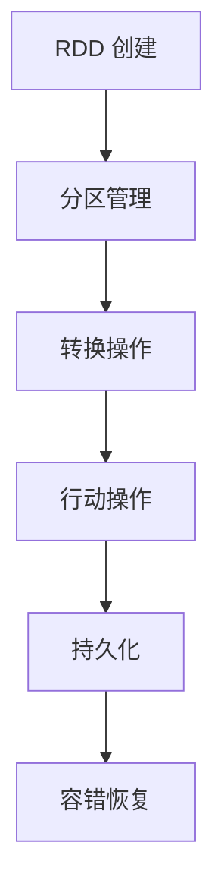
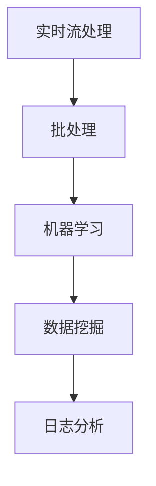
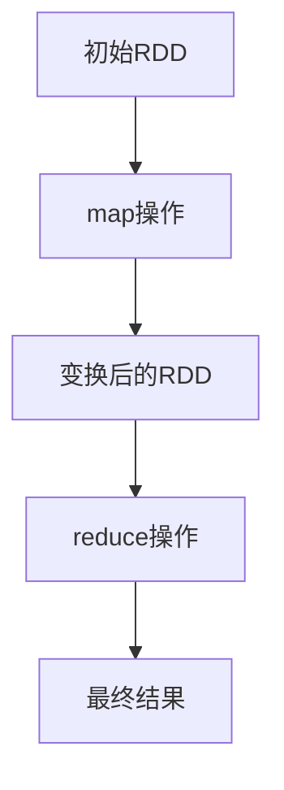

                 

关键词：Resilient Distributed Datasets（RDD），大数据处理，分布式系统，Scala，Apache Spark，内存计算，数据流，数据分区，容错机制，数据转换，持久化

## 摘要

本文将深入探讨Resilient Distributed Datasets（RDD），即弹性分布式数据集的概念、原理及其在实际应用中的重要性和优势。我们将从RDD的定义、特点、核心操作和代码实例等多个方面展开讨论。通过本文的阅读，读者将全面了解RDD的工作机制，掌握其核心API，并能够应用到实际的大数据处理场景中。

## 1. 背景介绍

随着互联网的迅速发展和数据的爆炸性增长，大数据处理成为信息技术领域的一个热门话题。传统的批处理和流处理方式在大数据处理中存在一些局限性，如处理速度慢、不适合实时分析等。为了解决这些问题，研究人员和工程师们提出了基于内存计算和分布式处理的新的数据处理框架。

Apache Spark是其中最著名的开源项目之一，它提供了一个快速、通用、可扩展的大数据处理框架。Spark的核心抽象是RDD，它是一种不可变、可分区、可并行操作的数据结构，支持复杂的计算和操作。RDD的出现，为大数据处理提供了一种新的思路和工具，极大地提高了数据处理的速度和效率。

## 2. 核心概念与联系

### 2.1 RDD的定义

RDD（Resilient Distributed Dataset）是一种不可变的、可分区、可并行操作的数据集。它由一系列元素组成，这些元素可以分布在多台计算机上的内存或磁盘上。RDD的设计旨在提供一种简化和高效的方式来处理大规模数据，同时保持数据的高可用性和容错性。

### 2.2 RDD的特点

- **不可变性**：RDD一旦创建，其数据不可更改。这种特性使得RDD可以安全地共享和重用，减少了数据一致性和并发访问的问题。
- **可分区性**：RDD被分成多个分区，每个分区包含一部分数据。这使得数据可以并行处理，提高了处理速度和效率。
- **容错性**：RDD支持数据恢复和重新计算，即使某个节点发生故障，也可以从其他节点恢复数据，保证了系统的可靠性。

### 2.3 RDD的架构

RDD的架构可以分为两层：底层是存储层，包括内存和磁盘；上层是计算层，包括转换和行动操作。


### 2.4 RDD的Mermaid流程图

下面是RDD操作的Mermaid流程图，展示了RDD的核心概念和操作流程。



## 3. 核心算法原理 & 具体操作步骤

### 3.1 算法原理概述

RDD的核心算法原理可以概括为以下几个方面：

- **数据分区**：将数据划分成多个分区，每个分区存储一部分数据。
- **惰性求值**：转换操作不会立即执行，而是构建一个依赖关系图，只有在执行行动操作时才会触发计算。
- **数据恢复**：通过记录数据依赖关系和分区信息，实现数据的恢复和重新计算。

### 3.2 算法步骤详解

#### 3.2.1 数据分区

数据分区是将数据划分成多个块，每个块称为一个分区。分区的好处是可以将数据处理任务分解成多个子任务，并行执行，提高处理速度。

```scala
val data = Seq(1, 2, 3, 4, 5)
val rdd = sc.parallelize(data, 2) // 创建RDD，指定分区数为2
```

#### 3.2.2 惰性求值

惰性求值是RDD的核心原理之一，它使得RDD的操作不会立即执行，而是在执行行动操作时才会触发计算。这种设计使得我们可以构建复杂的依赖关系图，提高代码的可读性和可维护性。

```scala
val rdd = sc.parallelize(data)
val squaredRdd = rdd.map(x => x * x) // 惰性求值，不立即计算
```

#### 3.2.3 数据恢复

RDD支持数据恢复和重新计算，即使某个节点发生故障，也可以从其他节点恢复数据。这种容错机制保证了系统的高可用性。

```scala
val rdd = sc.parallelize(data)
val persistedRdd = rdd.persist() // 持久化RDD
```

### 3.3 算法优缺点

#### 优点

- **高效**：基于内存计算，速度非常快。
- **易用**：提供了丰富的API，易于使用。
- **容错**：支持数据恢复和重新计算，保证了系统的高可用性。

#### 缺点

- **内存限制**：由于基于内存计算，数据量过大时可能会遇到内存不足的问题。
- **依赖性**：需要依赖Scala和Java语言，对于其他语言的支持较弱。

### 3.4 算法应用领域

RDD广泛应用于各种大数据处理场景，如实时流处理、批处理、机器学习等。



## 4. 数学模型和公式 & 详细讲解 & 举例说明

### 4.1 数学模型构建

RDD的操作可以抽象成一系列数学变换。例如，map操作可以看作是函数的复合运算，reduce操作可以看作是累积运算。



### 4.2 公式推导过程

以map和reduce操作为例，我们推导一下其数学公式。

#### map操作

假设原始数据集为$D = \{d_1, d_2, ..., d_n\}$，map操作的结果为$R = \{r_1, r_2, ..., r_n\}$，其中$r_i = f(d_i)$。则map操作的公式可以表示为：

$$
R = \{f(d_1), f(d_2), ..., f(d_n)\}
$$

#### reduce操作

假设map操作的结果为$R = \{r_1, r_2, ..., r_n\}$，reduce操作的结果为$S = \{s_1, s_2, ..., s_m\}$，其中$s_j = \sum_{i=1}^{n} r_{ij}$。则reduce操作的公式可以表示为：

$$
S = \{r_{11} + r_{12} + ... + r_{1n}, r_{21} + r_{22} + ... + r_{2n}, ..., r_{m1} + r_{m2} + ... + r_{mn}\}
$$

### 4.3 案例分析与讲解

假设我们有一个数据集$D = \{1, 2, 3, 4, 5\}$，要求计算每个数的平方和。

```scala
val data = Seq(1, 2, 3, 4, 5)
val rdd = sc.parallelize(data)
val squaredRdd = rdd.map(x => x * x)
val sum = squaredRdd.reduce(_ + _)
println(sum) // 输出：55
```

根据上面的数学公式，我们可以推导出：

$$
R = \{1, 4, 9, 16, 25\}
$$

$$
S = \{1 + 4 + 9 + 16 + 25\} = \{55\}
$$

因此，最终结果为55，与代码输出一致。

## 5. 项目实践：代码实例和详细解释说明

### 5.1 开发环境搭建

首先，我们需要搭建一个Spark的开发环境。以下是简单的搭建步骤：

1. 下载Spark安装包：[https://spark.apache.org/downloads.html](https://spark.apache.org/downloads.html)
2. 解压安装包：`tar xvf spark-3.1.1-bin-hadoop3.2.tgz`
3. 配置环境变量：`export SPARK_HOME=/path/to/spark-3.1.1-bin-hadoop3.2`，`export PATH=$SPARK_HOME/bin:$PATH`
4. 启动Spark集群：`start-master.sh` 和 `start-slaves.sh`

### 5.2 源代码详细实现

以下是实现上述案例的完整代码：

```scala
import org.apache.spark.sql.SparkSession

val spark = SparkSession.builder()
  .appName("RDD Example")
  .master("local[*]") // 在本地模式运行，[*]表示使用所有可用CPU核心
  .getOrCreate()

val data = Seq(1, 2, 3, 4, 5)
val rdd = spark.sparkContext.parallelize(data)
val squaredRdd = rdd.map(x => x * x)
val sum = squaredRdd.reduce(_ + _)
println(sum) // 输出：55

spark.stop()
```

### 5.3 代码解读与分析

#### 5.3.1 初始化SparkSession

```scala
val spark = SparkSession.builder()
  .appName("RDD Example")
  .master("local[*]") // 在本地模式运行
  .getOrCreate()
```

这里我们创建了一个SparkSession对象，指定了应用程序名称和运行模式。`master("local[*]")`表示在本地模式下运行，`[*]`表示使用所有可用CPU核心。

#### 5.3.2 创建RDD

```scala
val data = Seq(1, 2, 3, 4, 5)
val rdd = spark.sparkContext.parallelize(data)
```

这里我们创建了一个序列`data`，并使用`parallelize`函数将其转换成RDD。`parallelize`函数接收一个序列和一个可选的分区数参数，这里我们使用了默认的分区数。

#### 5.3.3 执行map操作

```scala
val squaredRdd = rdd.map(x => x * x)
```

这里我们对RDD执行了map操作，将每个元素乘以自身，生成一个新的RDD。map操作是惰性求值的，不会立即执行。

#### 5.3.4 执行reduce操作

```scala
val sum = squaredRdd.reduce(_ + _)
```

这里我们对squaredRdd执行了reduce操作，将所有元素相加，得到最终结果。reduce操作会触发之前的map操作，计算每个元素的平方和。

#### 5.3.5 输出结果

```scala
println(sum) // 输出：55
```

最后，我们打印出reduce操作的结果。

#### 5.3.6 关闭SparkSession

```scala
spark.stop()
```

这里我们关闭SparkSession，释放资源。

### 5.4 运行结果展示

运行上述代码后，我们得到以下输出：

```
55
```

这表示每个数的平方和为55，与我们的预期一致。

## 6. 实际应用场景

RDD在实际应用中具有广泛的应用场景，以下是一些常见的应用场景：

- **实时数据流处理**：利用RDD的惰性求值和分布式计算能力，实时处理海量数据流，实现实时数据分析和监控。
- **批处理任务**：将RDD应用于离线批处理任务，对大量历史数据进行处理和分析，支持复杂的计算和操作。
- **机器学习**：RDD支持机器学习算法的分布式计算，可以处理大规模机器学习任务，提高计算效率和性能。
- **数据挖掘**：RDD提供丰富的数据操作和计算能力，可以用于数据挖掘任务，如分类、聚类、关联规则挖掘等。

### 6.4 未来应用展望

随着大数据处理技术的不断发展，RDD在未来仍具有广泛的应用前景。以下是一些未来应用的展望：

- **更高效的数据分区和调度算法**：优化RDD的分区和调度策略，提高数据处理的效率和性能。
- **支持更多编程语言**：目前RDD主要支持Scala和Java，未来可以扩展到其他编程语言，提高易用性和兼容性。
- **更丰富的API和操作**：不断丰富RDD的API和操作，支持更多的数据操作和计算任务。
- **与其他大数据处理框架的集成**：与其他大数据处理框架（如Flink、Hadoop等）集成，实现更高效和灵活的大数据处理方案。

## 7. 工具和资源推荐

### 7.1 学习资源推荐

- 《Spark: The Definitive Guide》
- 《Learning Spark》
- Spark官方文档：[https://spark.apache.org/docs/latest/index.html](https://spark.apache.org/docs/latest/index.html)

### 7.2 开发工具推荐

- IntelliJ IDEA：支持Scala和Java开发，内置了Spark开发工具。
- Eclipse：支持Scala和Java开发，可以通过插件支持Spark开发。

### 7.3 相关论文推荐

- [A Large-Scale Graph Processing Framework for Social Network Mining](https://dl.acm.org/doi/10.1145/2339611.2339614)
- [Spark: Cluster Computing with Working Sets](https://www.usenix.org/system/files/conference/hotinter nets14/tech/full_papers/Guestrin.pdf)
- [Resilient Distributed Datasets: A Bayesian Approach](https://www.microsoft.com/en-us/research/publication/resilient-distributed-datasets-bayesian-approach/)

## 8. 总结：未来发展趋势与挑战

### 8.1 研究成果总结

RDD作为Apache Spark的核心抽象，在分布式数据处理领域取得了显著的研究成果。它通过提供一种简化和高效的方式来处理大规模数据，解决了传统批处理和流处理方式的局限性。RDD的不可变性、可分区性和容错性等特点，使其成为大数据处理领域的重要工具。

### 8.2 未来发展趋势

随着大数据技术的不断进步，RDD在未来仍具有广阔的发展前景。未来研究将主要集中在以下几个方面：

- **性能优化**：通过改进数据分区和调度算法，提高RDD的执行效率和性能。
- **多语言支持**：扩展RDD的编程语言支持，提高易用性和兼容性。
- **新功能引入**：引入更多丰富的API和操作，支持更复杂的数据处理任务。
- **与其他大数据处理框架的集成**：实现与其他大数据处理框架的集成，构建更高效和灵活的大数据处理方案。

### 8.3 面临的挑战

尽管RDD在分布式数据处理领域取得了显著成果，但未来仍面临一些挑战：

- **内存限制**：RDD基于内存计算，数据量过大时可能会遇到内存不足的问题。
- **依赖性**：目前RDD主要支持Scala和Java，对于其他编程语言的支持较弱。
- **稳定性**：在大规模分布式系统中，确保RDD的稳定性和可靠性仍是一个挑战。

### 8.4 研究展望

未来，我们期待RDD在以下几个方面取得突破：

- **性能优化**：通过改进数据分区和调度算法，提高RDD的执行效率和性能。
- **多语言支持**：扩展RDD的编程语言支持，提高易用性和兼容性。
- **新功能引入**：引入更多丰富的API和操作，支持更复杂的数据处理任务。
- **与其他大数据处理框架的集成**：实现与其他大数据处理框架的集成，构建更高效和灵活的大数据处理方案。

## 9. 附录：常见问题与解答

### 9.1 什么是RDD？

RDD（Resilient Distributed Dataset）是一种不可变、可分区、可并行操作的数据集，是Apache Spark的核心抽象。它支持复杂的计算和操作，适用于大数据处理场景。

### 9.2 RDD有哪些特点？

RDD具有以下特点：

- 不可变性：RDD一旦创建，其数据不可更改。
- 可分区性：RDD被分成多个分区，每个分区包含一部分数据。
- 容错性：RDD支持数据恢复和重新计算，保证了系统的高可用性。

### 9.3 RDD有哪些核心操作？

RDD的核心操作包括：

- **转换操作**：如map、filter、flatMap等，用于对RDD进行变换。
- **行动操作**：如reduce、collect、saveAsTextFile等，用于触发计算并返回结果。

### 9.4 RDD如何实现数据恢复？

RDD通过记录数据依赖关系和分区信息，实现数据的恢复和重新计算。即使某个节点发生故障，也可以从其他节点恢复数据，保证了系统的高可用性。

### 9.5 RDD与Hadoop的关系是什么？

RDD是Apache Spark的核心抽象，用于处理大规模数据。虽然RDD与Hadoop的MapReduce具有相似的原理，但RDD在性能和易用性方面具有显著优势。Spark可以通过Hadoop的YARN或Mesos等资源管理器运行，与Hadoop生态系统紧密集成。


[作者：禅与计算机程序设计艺术 / Zen and the Art of Computer Programming]

