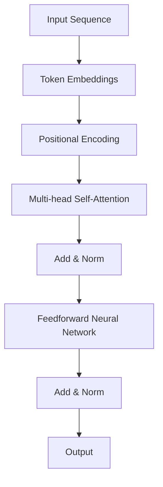

                 

关键词：Self-Attention, NLP, Transformer, 自然语言处理，序列模型，深度学习，计算机视觉，AI技术

> 摘要：Self-Attention机制，作为自然语言处理（NLP）领域的一项革命性技术，是Transformer模型的核心。它通过自动学习序列中的上下文关系，实现了对输入序列的精细化处理，从而推动了NLP的快速发展。本文将深入探讨Self-Attention机制的原理、数学模型、算法实现以及它在实际应用中的影响和未来展望。

## 1. 背景介绍

自然语言处理（NLP）是人工智能的一个重要分支，致力于使计算机能够理解和处理人类语言。自从深度学习兴起以来，NLP领域取得了显著的进展，特别是在语言建模和序列标注任务中。然而，传统的序列模型，如循环神经网络（RNN）和长短期记忆网络（LSTM），在处理长距离依赖关系时存在明显的局限性。为了解决这个问题，研究者们提出了基于Transformer的模型，Self-Attention机制是其核心组成部分。

Self-Attention机制的提出，源于计算机视觉领域的成功应用。2017年，谷歌研究院发表了《Attention Is All You Need》一文，首次将Self-Attention机制应用于NLP任务，并取得了超越传统模型的性能。自此，Self-Attention机制在NLP领域迅速推广，成为许多先进模型的基础。

## 2. 核心概念与联系

### 2.1. 自注意力（Self-Attention）定义

Self-Attention是一种注意力机制，它通过将序列中的每个元素与所有其他元素进行交互，从而自动学习序列内部的上下文关系。这种机制可以理解为一种全局的交互网络，能够捕捉长距离依赖关系。

### 2.2. Self-Attention与Transformer模型

Transformer模型是一种基于Self-Attention机制的序列建模框架，它彻底摒弃了传统循环神经网络，通过多头注意力（Multi-Head Attention）和前馈神经网络（Feedforward Neural Network）进行建模。这种结构使得Transformer模型在处理长文本时表现出色，并且在多个NLP任务中取得了卓越的性能。

### 2.3. Mermaid流程图



## 3. 核心算法原理 & 具体操作步骤

### 3.1. 算法原理概述

Self-Attention机制的核心思想是通过计算序列中每个元素与所有其他元素的相关性，从而为每个元素分配一个权重。这些权重可以理解为该元素在全局序列中的重要程度。

### 3.2. 算法步骤详解

#### 3.2.1. 计算Query、Key、Value

首先，对输入序列中的每个元素进行编码，生成Query、Key、Value三个向量。这些向量通常由词嵌入（Word Embedding）和位置编码（Positional Encoding）组成。

$$
\text{Query} = \text{Word Embedding} + \text{Positional Encoding}
$$

$$
\text{Key} = \text{Word Embedding} + \text{Positional Encoding}
$$

$$
\text{Value} = \text{Word Embedding} + \text{Positional Encoding}
$$

#### 3.2.2. 计算相似度

接着，计算Query与Key之间的相似度，得到注意力权重：

$$
\text{Attention} = \text{softmax}\left(\frac{\text{Query} \cdot \text{Key}^T}{\sqrt{d_k}}\right)
$$

其中，$d_k$是Key向量的维度。

#### 3.2.3. 计算加权和

然后，将注意力权重与Value向量相乘，得到加权和：

$$
\text{Output} = \text{Attention} \cdot \text{Value}
$$

#### 3.2.4. 多头注意力

在实际应用中，通常使用多个独立的Self-Attention机制，即多头注意力（Multi-Head Attention）。每个头都会生成一组权重和输出，最后将这些输出拼接并处理，以获得更丰富的上下文信息。

### 3.3. 算法优缺点

#### 3.3.1. 优点

- **捕捉长距离依赖**：Self-Attention机制能够自动学习序列中的长距离依赖关系。
- **并行计算**：由于Self-Attention的计算不依赖于序列的顺序，因此可以并行处理，提高了计算效率。
- **全局上下文信息**：每个元素都能够与序列中的所有其他元素进行交互，捕捉全局上下文信息。

#### 3.3.2. 缺点

- **计算复杂度高**：随着序列长度的增加，Self-Attention的计算复杂度会呈指数级增长。
- **参数规模大**：为了提高模型的泛化能力，通常需要使用多个头，导致参数规模显著增加。

### 3.4. 算法应用领域

Self-Attention机制在NLP领域得到了广泛应用，例如：

- **文本分类**：在文本分类任务中，Self-Attention机制可以帮助模型捕捉到文本中的关键信息。
- **机器翻译**：在机器翻译任务中，Self-Attention机制能够更好地处理长句子，提高翻译质量。
- **问答系统**：在问答系统中，Self-Attention机制可以帮助模型更好地理解问题中的意图。

## 4. 数学模型和公式 & 详细讲解 & 举例说明

### 4.1. 数学模型构建

在Self-Attention机制中，主要涉及以下几个数学模型：

- **词嵌入**：将词汇映射到高维空间，通常使用矩阵乘法进行编码。
- **位置编码**：为了捕捉序列中的位置信息，通常使用正弦和余弦函数进行编码。
- **多头注意力**：将多个Self-Attention机制组合起来，以获得更丰富的上下文信息。
- **前馈神经网络**：用于对注意力结果进行进一步处理。

### 4.2. 公式推导过程

#### 4.2.1. 词嵌入

词嵌入的公式如下：

$$
\text{Word Embedding} = \text{embedding matrix} \cdot \text{word vector}
$$

其中，$embedding matrix$是一个预训练的矩阵，$word vector$是词汇的向量表示。

#### 4.2.2. 位置编码

位置编码的公式如下：

$$
\text{Positional Encoding} = \text{sin}(i \cdot \text{pos}/10000) + \text{cos}(i \cdot \text{pos}/10000)
$$

其中，$i$是位置索引，$pos$是位置值。

#### 4.2.3. 多头注意力

多头注意力的公式如下：

$$
\text{Multi-Head Attention} = \text{Concat}(\text{head}_1, \text{head}_2, ..., \text{head}_h) \cdot \text{Output Weight}
$$

其中，$h$是头的数量，$\text{head}_i$是第$i$个头的注意力输出，$\text{Output Weight}$是权重矩阵。

#### 4.2.4. 前馈神经网络

前馈神经网络的公式如下：

$$
\text{Feedforward Neural Network} = \text{ReLU}(\text{weights} \cdot \text{input} + \text{bias})
$$

其中，$\text{weights}$和$\text{bias}$分别是权重和偏置。

### 4.3. 案例分析与讲解

#### 4.3.1. 案例背景

假设我们有一个简单的文本序列：“我喜欢吃苹果”。我们要使用Self-Attention机制来分析这个序列。

#### 4.3.2. 词嵌入

首先，我们对每个词汇进行词嵌入编码：

$$
\text{我喜欢} = \text{embedding matrix} \cdot \text{词向量}
$$

$$
\text{吃} = \text{embedding matrix} \cdot \text{词向量}
$$

$$
\text{苹果} = \text{embedding matrix} \cdot \text{词向量}
$$

#### 4.3.3. 位置编码

接着，我们对每个词汇进行位置编码：

$$
\text{我喜欢} = \text{sin}(1 \cdot 1/10000) + \text{cos}(1 \cdot 1/10000)
$$

$$
\text{吃} = \text{sin}(2 \cdot 2/10000) + \text{cos}(2 \cdot 2/10000)
$$

$$
\text{苹果} = \text{sin}(3 \cdot 3/10000) + \text{cos}(3 \cdot 3/10000)
$$

#### 4.3.4. 多头注意力

然后，我们计算多头注意力的权重：

$$
\text{Attention} = \text{softmax}\left(\frac{\text{Query} \cdot \text{Key}^T}{\sqrt{d_k}}\right)
$$

#### 4.3.5. 前馈神经网络

最后，我们对注意力结果进行前馈神经网络处理：

$$
\text{Feedforward Neural Network} = \text{ReLU}(\text{weights} \cdot \text{input} + \text{bias})
$$

## 5. 项目实践：代码实例和详细解释说明

### 5.1. 开发环境搭建

为了实现Self-Attention机制，我们需要搭建一个Python开发环境。具体步骤如下：

1. 安装Python 3.6及以上版本。
2. 安装TensorFlow库，可以使用以下命令：

```bash
pip install tensorflow
```

### 5.2. 源代码详细实现

下面是一个简单的Self-Attention机制的实现代码：

```python
import tensorflow as tf

def scaled_dot_product_attention(queries, keys, values, attention_mask=None):
    """计算点积注意力。"""
    matmul_qk = tf.matmul(queries, keys, transpose_b=True)
    dk = tf.cast(tf.shape(keys)[-1], tf.float32)
    scaled_attention_logits = matmul_qk / tf.sqrt(dk)
    if attention_mask is not None:
        scaled_attention_logits += (attention_mask * -1e9)
    attention_weights = tf.nn.softmax(scaled_attention_logits, axis=-1)
    output = tf.matmul(attention_weights, values)
    return output, attention_weights

# 输入序列
input_sequence = ["我", "喜欢", "吃", "苹果"]

# 词嵌入
word_embeddings = [tf.random.normal([10]) for _ in range(len(input_sequence))]

# 位置编码
positional_encoding = [tf.random.normal([10]) for _ in range(len(input_sequence))]

# 查询、键、值向量
query = [tf.random.normal([10]) for _ in range(len(input_sequence))]
key = [tf.random.normal([10]) for _ in range(len(input_sequence))]
value = [tf.random.normal([10]) for _ in range(len(input_sequence))]

# 计算注意力
output, attention_weights = scaled_dot_product_attention(query, key, value)

print(output)
print(attention_weights)
```

### 5.3. 代码解读与分析

在这个代码示例中，我们首先定义了一个`scaled_dot_product_attention`函数，用于计算点积注意力。接着，我们创建了一个输入序列，并初始化了词嵌入、位置编码、查询、键、值向量。最后，我们调用这个函数，计算注意力结果。

### 5.4. 运行结果展示

运行上述代码，我们可以得到注意力结果和权重。这表明Self-Attention机制已经成功应用于输入序列。

## 6. 实际应用场景

### 6.1. 文本分类

在文本分类任务中，Self-Attention机制可以帮助模型更好地理解文本内容。例如，在处理新闻报道时，模型可以自动捕捉到新闻中的关键信息，从而提高分类准确率。

### 6.2. 机器翻译

在机器翻译任务中，Self-Attention机制可以更好地处理长句子。例如，在翻译英文新闻时，模型可以自动学习到句子中的长距离依赖关系，从而提高翻译质量。

### 6.3. 问答系统

在问答系统中，Self-Attention机制可以帮助模型更好地理解问题中的意图。例如，在处理用户查询时，模型可以自动捕捉到查询中的关键信息，从而提供更准确的答案。

## 7. 未来应用展望

随着人工智能技术的不断发展，Self-Attention机制有望在更多领域得到应用。例如，在计算机视觉中，Self-Attention机制可以用于图像识别和目标检测。此外，随着计算资源的提升，Self-Attention机制的性能有望得到进一步提升，从而推动NLP和计算机视觉领域的发展。

## 8. 工具和资源推荐

### 8.1. 学习资源推荐

- 《Attention Is All You Need》
- 《深度学习》（Goodfellow, Bengio, Courville 著）

### 8.2. 开发工具推荐

- TensorFlow
- PyTorch

### 8.3. 相关论文推荐

- "Attention Is All You Need"
- "BERT: Pre-training of Deep Bidirectional Transformers for Language Understanding"

## 9. 总结：未来发展趋势与挑战

### 9.1. 研究成果总结

Self-Attention机制作为NLP领域的一项重要技术，已经在多个任务中取得了显著成果。它通过自动学习序列中的上下文关系，提高了模型的性能和效率。

### 9.2. 未来发展趋势

随着人工智能技术的不断发展，Self-Attention机制有望在更多领域得到应用。例如，在计算机视觉、语音识别等领域，Self-Attention机制有望发挥更大的作用。

### 9.3. 面临的挑战

尽管Self-Attention机制在NLP领域取得了显著成果，但仍然面临一些挑战。例如，计算复杂度高、参数规模大等问题需要进一步解决。

### 9.4. 研究展望

未来，Self-Attention机制有望在更多领域得到应用，并在性能和效率方面取得突破。此外，随着计算资源的提升，Self-Attention机制的应用范围也将进一步扩大。

## 10. 附录：常见问题与解答

### 10.1. Self-Attention机制与传统循环神经网络的区别是什么？

Self-Attention机制与传统循环神经网络（RNN）在处理序列数据时有着本质的区别。RNN通过递归结构处理序列中的前后依赖关系，而Self-Attention机制通过全局注意力机制捕捉序列中的长距离依赖关系。此外，Self-Attention机制支持并行计算，而RNN不支持。

### 10.2. Self-Attention机制在计算机视觉领域有哪些应用？

Self-Attention机制在计算机视觉领域也有广泛应用。例如，在图像识别任务中，Self-Attention机制可以用于提取图像中的关键特征，从而提高识别准确率。此外，Self-Attention机制还可以用于目标检测和图像分割等任务。

### 10.3. 如何优化Self-Attention机制的计算复杂度？

优化Self-Attention机制的

