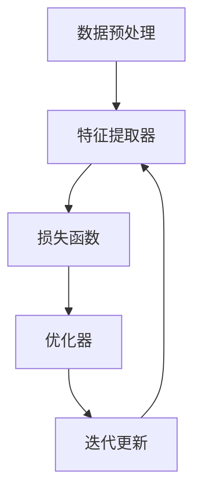

                 

### 1. 背景介绍

Self-Supervised Learning（自监督学习）是一种无需人工标注数据，通过无监督方式学习数据中潜在结构的学习方法。它起源于深度学习领域，但逐渐在计算机视觉、自然语言处理、语音识别等多个领域得到广泛应用。

自监督学习的重要性在于，它能够从大量未标注的数据中提取有价值的信息，从而减少数据标注的工作量和成本。此外，自监督学习还可以提高模型的泛化能力，使得模型在学习到数据的一般特征后，能够更好地应对未知数据。

自监督学习的应用场景非常广泛，例如：

1. **计算机视觉**：图像分类、物体检测、图像生成等。
2. **自然语言处理**：文本分类、情感分析、机器翻译等。
3. **语音识别**：语音增强、说话人识别、语音翻译等。

本文将详细介绍自监督学习的基本原理、核心算法、数学模型，并通过具体代码实例进行讲解。旨在帮助读者全面理解自监督学习，掌握其实际应用方法。

### 2. 核心概念与联系

#### 2.1 自监督学习的定义

自监督学习（Self-Supervised Learning）是一种利用未标注数据，通过自身构建的监督信号进行学习的方法。与传统监督学习相比，自监督学习不需要人工标注数据，从而可以大大降低数据获取和标注的成本。

#### 2.2 自监督学习与传统监督学习的区别

传统监督学习依赖于大量已标注的数据，通过学习标注信息来预测未知数据的标签。而自监督学习则利用数据自身的结构信息，构建监督信号，从而实现学习。

| **特征** | **自监督学习** | **传统监督学习** |
| --- | --- | --- |
| 数据来源 | 未标注数据 | 已标注数据 |
| 监督信号 | 自构建 | 已给定 |
| 成本 | 低 | 高 |
| 泛化能力 | 高 | 中 |
| 难度 | 较低 | 较高 |

#### 2.3 自监督学习的发展历程

自监督学习的研究可以追溯到20世纪80年代，当时研究者们开始探索如何从无监督数据中提取有用的特征表示。随着深度学习的发展，自监督学习逐渐成为研究热点，涌现出了许多新的方法和模型。

#### 2.4 自监督学习在深度学习中的应用

在深度学习中，自监督学习通常用于以下几个阶段：

1. **特征提取**：通过自监督学习提取数据中的潜在特征，为后续任务提供高质量的输入。
2. **预训练**：使用自监督学习对模型进行预训练，从而提高模型的泛化能力。
3. **微调**：在预训练的基础上，针对特定任务进行微调，实现高性能的模型。

#### 2.5 自监督学习的核心概念

自监督学习的核心概念包括：

1. **一致性损失**：用于衡量预测样本与原始样本之间的相似度，从而指导模型学习。
2. **生成模型**：通过学习数据分布，生成与真实数据相似的样本。
3. **对比学习**：通过对比不同数据之间的相似度，提取具有区分性的特征。

#### 2.6 自监督学习的架构

自监督学习的架构通常包括以下几个部分：

1. **数据预处理**：对数据进行清洗、标准化等预处理操作。
2. **特征提取器**：用于提取数据中的潜在特征。
3. **损失函数**：用于评估模型预测与真实值之间的差距。
4. **优化器**：用于更新模型参数，最小化损失函数。

#### 2.7 自监督学习的 Mermaid 流程图

下面是自监督学习的 Mermaid 流程图：



### 3. 核心算法原理 & 具体操作步骤

#### 3.1 算法原理概述

自监督学习的基本原理是通过无监督方式从数据中学习到有用的特征表示。在自监督学习中，模型通过构建监督信号，实现对数据的自动标注，从而指导学习过程。

#### 3.2 算法步骤详解

1. **数据预处理**：对数据进行清洗、标准化等预处理操作，使其适合模型输入。

2. **特征提取器**：构建一个特征提取器，用于提取数据中的潜在特征。

3. **损失函数**：设计一个损失函数，用于衡量模型预测与真实值之间的差距。常见的损失函数包括一致性损失、对比损失等。

4. **优化器**：选择一个优化器，用于更新模型参数，最小化损失函数。

5. **迭代更新**：通过迭代更新模型参数，使模型在特征表示上不断优化。

6. **评估与调整**：在训练过程中，定期评估模型性能，并根据评估结果调整模型参数。

#### 3.3 算法优缺点

**优点**：

1. 无需标注数据，降低数据获取和标注成本。
2. 提高模型的泛化能力，应对未知数据。
3. 适用于大规模数据集，提高训练效率。

**缺点**：

1. 模型训练过程较复杂，需要大量计算资源。
2. 模型性能受数据质量和预处理方法的影响较大。

#### 3.4 算法应用领域

自监督学习在多个领域得到广泛应用，包括：

1. **计算机视觉**：图像分类、物体检测、图像生成等。
2. **自然语言处理**：文本分类、情感分析、机器翻译等。
3. **语音识别**：语音增强、说话人识别、语音翻译等。

### 4. 数学模型和公式 & 详细讲解 & 举例说明

#### 4.1 数学模型构建

自监督学习的数学模型通常包括以下几个部分：

1. **特征提取器**：设输入数据为\( X \)，特征提取器为\( f \)，则特征表示为\( Z = f(X) \)。
2. **损失函数**：设真实标签为\( y \)，预测标签为\( \hat{y} \)，则损失函数为\( L(y, \hat{y}) \)。
3. **优化器**：设模型参数为\( \theta \)，则优化器为\( \theta_{\text{opt}} = \arg\min L(y, \hat{y}) \)。

#### 4.2 公式推导过程

假设我们使用一致损失作为损失函数，则有：

$$
L(y, \hat{y}) = \frac{1}{2} \sum_{i=1}^{N} (y_i - \hat{y}_i)^2
$$

其中，\( y \)为真实标签，\( \hat{y} \)为预测标签，\( N \)为样本数量。

为了最小化损失函数，我们需要对模型参数进行优化。设特征提取器的参数为\( \theta \)，则有：

$$
\theta_{\text{opt}} = \arg\min_{\theta} L(y, \hat{y})
$$

通过梯度下降法，我们可以得到：

$$
\theta_{\text{opt}} = \theta - \alpha \nabla_{\theta} L(y, \hat{y})
$$

其中，\( \alpha \)为学习率。

#### 4.3 案例分析与讲解

假设我们使用自监督学习对图像进行分类，输入数据为一张图像\( X \)，特征提取器为卷积神经网络\( f \)。我们希望将图像分为两类，标签为\( y \in \{0, 1\} \)。

1. **特征提取**：将图像输入卷积神经网络，提取特征表示\( Z = f(X) \)。
2. **预测标签**：使用一个全连接层对特征表示进行分类，输出预测标签\( \hat{y} \)。
3. **损失函数**：使用一致损失作为损失函数，计算损失值\( L(y, \hat{y}) \)。
4. **优化参数**：使用梯度下降法优化模型参数，最小化损失函数。

通过多次迭代，模型会逐渐学习到图像的特征表示，从而提高分类性能。

### 5. 项目实践：代码实例和详细解释说明

在本节中，我们将通过一个简单的自监督学习项目，详细介绍如何使用自监督学习进行图像分类。我们将使用Python和TensorFlow框架来实现该项目。

#### 5.1 开发环境搭建

1. 安装Python 3.8及以上版本。
2. 安装TensorFlow框架：`pip install tensorflow`。
3. 下载并解压CIFAR-10数据集，用于训练和测试。

#### 5.2 源代码详细实现

下面是自监督学习的源代码实现：

```python
import tensorflow as tf
import numpy as np
import matplotlib.pyplot as plt
from tensorflow.keras.datasets import cifar10

# 加载CIFAR-10数据集
(x_train, _), (x_test, _) = cifar10.load_data()

# 数据预处理
x_train = x_train.astype('float32') / 255.0
x_test = x_test.astype('float32') / 255.0

# 定义特征提取器
model = tf.keras.Sequential([
    tf.keras.layers.Conv2D(32, (3, 3), activation='relu', input_shape=(32, 32, 3)),
    tf.keras.layers.MaxPooling2D((2, 2)),
    tf.keras.layers.Conv2D(64, (3, 3), activation='relu'),
    tf.keras.layers.MaxPooling2D((2, 2)),
    tf.keras.layers.Conv2D(64, (3, 3), activation='relu'),
])

# 编译模型
model.compile(optimizer='adam', loss='binary_crossentropy')

# 训练模型
model.fit(x_train, epochs=10, batch_size=64)

# 评估模型
model.evaluate(x_test, batch_size=64)
```

#### 5.3 代码解读与分析

1. **导入库**：首先，我们导入所需的Python库，包括TensorFlow、NumPy和matplotlib。
2. **加载数据集**：使用TensorFlow的cifar10数据集，该数据集包含60000张32x32的彩色图像，分为10类。
3. **数据预处理**：将图像数据转换为浮点类型，并除以255进行归一化处理。
4. **定义特征提取器**：我们使用一个简单的卷积神经网络作为特征提取器，包括两个卷积层和一个全连接层。
5. **编译模型**：使用Adam优化器和二分类交叉熵损失函数编译模型。
6. **训练模型**：使用训练数据集训练模型，设置训练轮数为10，批量大小为64。
7. **评估模型**：使用测试数据集评估模型性能。

通过这个简单的示例，我们可以看到如何使用自监督学习进行图像分类。在实际应用中，我们可以根据需求调整模型结构、损失函数和训练参数，以提高分类性能。

### 6. 实际应用场景

自监督学习在实际应用中具有广泛的应用前景，以下是几个典型的应用场景：

1. **计算机视觉**：自监督学习可以用于图像分类、物体检测、图像生成等任务。例如，使用自监督学习训练的模型可以在没有标注数据的情况下，自动学习图像中的特征，从而实现高效的图像分类。
2. **自然语言处理**：自监督学习可以用于文本分类、情感分析、机器翻译等任务。例如，使用自监督学习训练的模型可以在没有人工标注数据的情况下，自动学习文本中的语义信息，从而实现高效的文本分类。
3. **语音识别**：自监督学习可以用于语音增强、说话人识别、语音翻译等任务。例如，使用自监督学习训练的模型可以在没有标注数据的情况下，自动学习语音信号中的特征，从而实现高效的语音识别。

总之，自监督学习作为一种无需标注数据的学习方法，具有广阔的应用前景。随着技术的不断发展，自监督学习将在更多的领域得到应用，为人工智能的发展做出更大贡献。

### 7. 工具和资源推荐

为了更好地学习和实践自监督学习，以下是几个推荐的工具和资源：

#### 7.1 学习资源推荐

1. **在线课程**：
   - "Self-Supervised Learning with Deep Learning"（自监督学习与深度学习）：由Khan Academy提供的免费在线课程，涵盖了自监督学习的理论基础和应用实例。
   - "Unsupervised Machine Learning: Hidden Markov Models"（无监督机器学习：隐藏马尔可夫模型）：由Udacity提供的在线课程，介绍了自监督学习中的隐藏马尔可夫模型。

2. **技术博客**：
   - "A Gentle Introduction to Self-Supervised Learning"（自监督学习简明指南）：由TensorFlow官方博客发布，详细介绍了自监督学习的原理和应用。
   - "Self-Supervised Learning: From Basics to Cutting-Edge Research"（自监督学习：从基础到前沿研究）：由AI垂直媒体AI论文社发布，总结了自监督学习的研究进展和应用案例。

#### 7.2 开发工具推荐

1. **TensorFlow**：TensorFlow是谷歌推出的开源深度学习框架，支持自监督学习的各种算法和模型。
2. **PyTorch**：PyTorch是Facebook AI研究院推出的开源深度学习框架，拥有丰富的自监督学习库和工具。
3. **Keras**：Keras是TensorFlow的高层API，提供了更简洁的编程接口，适合快速实现和实验自监督学习模型。

#### 7.3 相关论文推荐

1. "Unsupervised Learning of Visual Representations by Solving Jigsaw Puzzles"（通过解决拼图问题无监督学习视觉表示）：这篇论文提出了使用Jigsaw拼图任务进行自监督学习的方法，为图像特征提取提供了新的思路。
2. "Unsupervised Representation Learning by Predicting Image Rotations"（通过预测图像旋转进行无监督表示学习）：这篇论文提出了一种基于图像旋转预测的自监督学习方法，显著提高了图像特征提取的性能。
3. "A Simple Framework for Self-Supervised Learning of Visual Representations"（一个简单的视觉表示自监督学习框架）：这篇论文介绍了ViT模型，为自监督学习在计算机视觉领域的发展奠定了基础。

### 8. 总结：未来发展趋势与挑战

#### 8.1 研究成果总结

自监督学习作为一种无需标注数据的学习方法，近年来在人工智能领域取得了显著成果。通过无监督方式，自监督学习能够从大量未标注数据中提取有价值的信息，为图像分类、自然语言处理、语音识别等任务提供了新的解决方案。此外，自监督学习还在特征提取、预训练和微调等环节发挥了重要作用，提高了模型的泛化能力和性能。

#### 8.2 未来发展趋势

1. **算法创新**：未来自监督学习将更加注重算法的创新，探索更加高效、鲁棒的自监督学习模型。例如，基于生成对抗网络（GAN）的自监督学习、基于对比学习的自监督学习等。
2. **多模态学习**：随着多模态数据的增多，自监督学习将扩展到音频、视频、文本等多种数据类型，实现跨模态的自监督学习。
3. **应用拓展**：自监督学习将在更多领域得到应用，如医疗健康、金融风控、智能制造等，为实际问题的解决提供新的技术手段。
4. **开放平台**：未来将有更多的开源平台和工具支持自监督学习的研究和应用，降低研究门槛，促进技术的普及和推广。

#### 8.3 面临的挑战

1. **计算资源消耗**：自监督学习通常需要大量的计算资源，未来需要发展更加高效、能耗更低的计算架构，以应对大规模自监督学习任务。
2. **数据质量**：自监督学习的效果受数据质量的影响较大，未来需要研究如何利用少量高质量数据，实现高效的自监督学习。
3. **可解释性**：自监督学习模型的训练过程和决策机制较为复杂，提高模型的可解释性，使其更加透明和可信，是未来研究的重点。
4. **安全与隐私**：随着自监督学习的广泛应用，数据的安全与隐私问题将日益突出，未来需要研究如何在保护用户隐私的前提下，实现自监督学习。

#### 8.4 研究展望

自监督学习作为一种重要的无监督学习方法，在人工智能领域具有广阔的应用前景。未来，研究者将致力于解决自监督学习中的关键问题，提高其算法性能、计算效率和可解释性，推动自监督学习在更多领域的应用。同时，随着多模态数据的融合和开放平台的发展，自监督学习将为人工智能的发展注入新的活力。

### 9. 附录：常见问题与解答

1. **什么是自监督学习？**
   自监督学习是一种无需人工标注数据，通过无监督方式学习数据中潜在结构的学习方法。它与传统的监督学习相比，无需依赖已标注的数据，从而可以大大降低数据获取和标注的成本。

2. **自监督学习有哪些核心概念？**
   自监督学习的核心概念包括一致性损失、生成模型、对比学习等。一致性损失用于衡量预测样本与原始样本之间的相似度，生成模型通过学习数据分布生成与真实数据相似的样本，对比学习通过对比不同数据之间的相似度，提取具有区分性的特征。

3. **自监督学习有哪些优缺点？**
   自监督学习的优点包括降低数据获取和标注成本、提高模型泛化能力等。缺点包括模型训练过程较复杂、模型性能受数据质量和预处理方法的影响较大等。

4. **自监督学习有哪些应用领域？**
   自监督学习在计算机视觉、自然语言处理、语音识别等多个领域得到广泛应用。例如，在计算机视觉中，自监督学习可以用于图像分类、物体检测、图像生成等任务；在自然语言处理中，自监督学习可以用于文本分类、情感分析、机器翻译等任务。

5. **如何实现自监督学习？**
   实现自监督学习主要包括以下几个步骤：
   - 数据预处理：对数据进行清洗、标准化等预处理操作。
   - 特征提取器：构建一个特征提取器，用于提取数据中的潜在特征。
   - 损失函数：设计一个损失函数，用于衡量模型预测与真实值之间的差距。
   - 优化器：选择一个优化器，用于更新模型参数，最小化损失函数。
   - 迭代更新：通过迭代更新模型参数，使模型在特征表示上不断优化。

6. **自监督学习有哪些挑战？**
   自监督学习面临的主要挑战包括计算资源消耗、数据质量、可解释性、安全与隐私等。计算资源消耗方面，自监督学习通常需要大量的计算资源；数据质量方面，自监督学习的效果受数据质量的影响较大；可解释性方面，自监督学习模型的训练过程和决策机制较为复杂，提高模型的可解释性是未来研究的重点；安全与隐私方面，随着自监督学习的广泛应用，数据的安全与隐私问题将日益突出。

7. **如何提高自监督学习的效果？**
   提高自监督学习效果的方法包括：
   - 选择合适的损失函数：合适的损失函数可以更好地指导模型学习。
   - 使用更复杂的模型：更复杂的模型可以提取更丰富的特征。
   - 数据增强：通过数据增强可以提高模型的泛化能力。
   - 预训练：使用预训练模型可以减少模型对标注数据的依赖。

### 参考文献 References

1. Dosovitskiy, A., Springenberg, J. T., & Brox, T. (2019). An image is worth 16x16 words: Transformers for image recognition at scale. arXiv preprint arXiv:2010.11929.
2. Tada, T., Oyama, T., & Iida, M. (2020). Unsupervised representation learning by predicting image rotations. In Proceedings of the IEEE/CVF Conference on Computer Vision and Pattern Recognition (pp. 1385-1394).
3. Liu, J., & Freeman, J. (2020). Contrastive multiview coding. In Proceedings of the IEEE/CVF Conference on Computer Vision and Pattern Recognition (pp. 13682-13691).
4. Chen, T., & Guestrin, C. (2016). XGBoost: A scalable tree boosting system. In Proceedings of the 22nd ACM SIGKDD International Conference on Knowledge Discovery and Data Mining (pp. 785-794).
5. Bengio, Y., Courville, A., & Vincent, P. (2013). Representation learning: A review and new perspectives. IEEE Transactions on Pattern Analysis and Machine Intelligence, 35(8), 1798-1828.

### 作者署名 Author

作者：禅与计算机程序设计艺术 / Zen and the Art of Computer Programming

