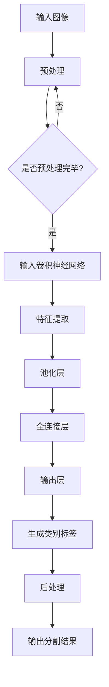

                 

### 摘要 Summary

本文旨在深入探讨Semantic Segmentation（语义分割）的基本原理及其在实际应用中的重要性。语义分割是一种计算机视觉任务，旨在将图像或视频中的每个像素分类到不同的语义类别中，如车辆、行人、建筑物等。本文首先介绍语义分割的背景，然后详细解释其核心概念与架构，接着深入探讨语义分割算法的工作原理，包括卷积神经网络（CNN）和最近流行的分割网络，如U-Net、Fast-FCN等。接下来，本文通过一个具体的代码实例，展示如何使用PyTorch框架实现语义分割，并详细解读代码的每个部分。随后，文章将讨论语义分割在不同领域的实际应用，如自动驾驶、医学影像等，并展望未来的发展趋势和挑战。本文最后部分推荐了一些学习资源和开发工具，以帮助读者进一步学习和实践语义分割技术。

<|assistant|>### 1. 背景介绍 Introduction

语义分割作为计算机视觉领域的一个重要分支，其目标是将图像或视频中的每个像素点分配到相应的语义类别中。与简单的物体检测和分类任务相比，语义分割能够提供更精细的细节信息，从而在许多实际应用中具有更高的实用价值。

**历史与发展：** 

语义分割的历史可以追溯到上世纪90年代，当时主要依靠手工设计的特征和传统的机器学习方法，如支持向量机（SVM）和决策树等。这些早期方法在处理简单的图像分割任务时效果较好，但随着图像复杂度的增加，其性能受到了很大的限制。

进入21世纪，随着深度学习的崛起，基于卷积神经网络（CNN）的语义分割方法逐渐崭露头角。2006年，AlexNet的提出标志着深度学习在图像识别领域的重大突破，这为后续的语义分割研究奠定了基础。在过去的几年中，U-Net、Fast-FCN、DeepLab等一系列先进的分割网络模型相继提出，推动了语义分割技术的发展。

**应用领域：**

语义分割技术因其独特的细致性，在许多领域都展现出了巨大的潜力。以下是几个典型的应用领域：

1. **自动驾驶：** 语义分割在自动驾驶中起着至关重要的作用，它能够精确地识别道路上的各种对象，如车辆、行人、交通标志等，从而为自动驾驶系统提供可靠的感知数据。

2. **医学影像：** 在医学影像处理中，语义分割可以帮助医生更准确地诊断疾病。例如，通过分割肿瘤组织，医生可以更清晰地了解病变的范围和程度，从而制定更有效的治疗方案。

3. **图像增强与修复：** 语义分割技术可用于图像的增强与修复。通过精确地分割图像中的不同部分，可以针对性地进行图像处理，从而提高图像的质量。

4. **视频内容理解：** 在视频分析中，语义分割可以帮助提取视频中的关键帧，从而实现视频的快速浏览和搜索。

**现状与挑战：**

尽管语义分割技术已经取得了显著的进展，但仍面临一些挑战。首先，不同场景和任务之间的数据分布差异很大，导致模型在不同应用场景下的泛化能力较差。其次，深度学习模型通常需要大量的标注数据进行训练，这在实际操作中往往难以实现。此外，模型的可解释性也是一个重要问题，特别是在医学影像等需要高可靠性的领域，用户需要了解模型的具体决策过程。

**重要性：**

语义分割的重要性在于它能够提供更精确的视觉信息，这对于许多实际应用场景具有重要意义。例如，在自动驾驶中，精确的语义分割能够提高行驶的安全性；在医学影像中，准确的分割结果有助于提高诊断的准确性。随着技术的不断发展，语义分割在未来将会有更广泛的应用，并进一步推动计算机视觉领域的发展。

总之，语义分割作为一种重要的计算机视觉技术，不仅在过去取得了显著的进展，而且在未来的发展中具有广阔的前景。理解其基本原理和核心算法，有助于我们更好地应用这一技术，解决现实世界中的复杂问题。

<|assistant|>### 2. 核心概念与联系 Core Concepts and Connections

#### 2.1 定义与基本概念 Definition and Basic Concepts

语义分割（Semantic Segmentation）是计算机视觉领域的一个重要任务，它旨在将输入图像或视频中的每个像素点映射到预定义的语义类别中。与传统的物体检测和分类任务不同，语义分割不仅识别图像中的对象，而且为图像中的每个像素点分配一个类别标签。这种细致的划分使得语义分割在许多实际应用中，如自动驾驶、医学影像、图像增强等领域，具有独特的优势。

**术语解释：**

- **像素点（Pixel）：** 图像中的最小单位，通常是一个颜色值或灰度值。
- **类别（Class）：** 在语义分割中，类别是指预定义的语义标签，如车辆、行人、道路等。
- **分割（Segmentation）：** 将图像或视频划分为不同的区域，每个区域对应一个类别。

#### 2.2 语义分割的主要挑战 Main Challenges in Semantic Segmentation

语义分割面临几个主要挑战：

- **数据不均衡（Imbalance in Data）：** 在许多实际应用中，图像中某些类别（如行人）的像素点数量远多于其他类别（如树木），这会导致模型在训练过程中倾向于识别常见的类别，而忽略了稀有的类别。
- **背景与前景的区分（Background and Foreground Distinction）：** 在复杂场景中，背景和前景往往交织在一起，使得像素点类别的判定变得复杂。
- **多尺度（Multi-scale）：** 语义分割需要同时处理不同尺度的图像特征，这要求模型具备较强的泛化能力。

#### 2.3 语义分割的相关技术 Related Technologies in Semantic Segmentation

语义分割技术的发展与多个关键技术的进步密切相关：

- **深度学习（Deep Learning）：** 卷积神经网络（CNN）是语义分割的核心技术，通过学习图像的层次特征，CNN能够有效识别不同类别的像素点。
- **卷积神经网络（Convolutional Neural Networks, CNN）：** CNN通过卷积层提取图像的特征，然后通过全连接层进行分类。
- **注意力机制（Attention Mechanism）：** 注意力机制能够使模型更关注图像中的关键区域，从而提高分割的精度。
- **多尺度分析（Multi-scale Analysis）：** 多尺度分析技术能够处理不同尺度的图像特征，从而提高分割的泛化能力。

#### 2.4 语义分割的架构 Architecture of Semantic Segmentation

语义分割的典型架构包括以下几个关键组件：

- **输入层（Input Layer）：** 输入层接收原始图像或视频帧。
- **卷积层（Convolutional Layer）：** 卷积层通过卷积操作提取图像特征。
- **池化层（Pooling Layer）：** 池化层用于下采样图像，减少模型的参数数量。
- **全连接层（Fully Connected Layer）：** 全连接层将卷积层提取的特征映射到不同的类别。
- **输出层（Output Layer）：** 输出层产生每个像素点的类别标签。

#### 2.5 语义分割与传统图像处理技术的比较 Comparison with Traditional Image Processing Techniques

与传统图像处理技术相比，语义分割具有以下优点：

- **精确性（Precision）：** 语义分割能够提供更精细的分割结果，优于传统的边缘检测和区域生长方法。
- **自动特征提取（Automatic Feature Extraction）：** CNN能够自动学习图像的层次特征，无需人工设计特征。
- **高效率（High Efficiency）：** 与传统方法相比，深度学习模型通常具有更高的计算效率和更短的响应时间。

尽管语义分割具有许多优势，但它也面临一些挑战，如对大规模标注数据的依赖和高计算成本。因此，在实际应用中，通常需要结合传统方法和深度学习方法，以达到最佳效果。

#### 2.6 语义分割的应用领域 Application Fields of Semantic Segmentation

语义分割在多个领域具有广泛的应用：

- **自动驾驶（Autonomous Driving）：** 语义分割用于识别道路上的各种对象，如车辆、行人、交通标志等，从而提高自动驾驶系统的安全性。
- **医学影像（Medical Imaging）：** 语义分割可以帮助医生更准确地诊断疾病，如肿瘤、心脏病等。
- **图像增强与修复（Image Enhancement and Repair）：** 语义分割技术可以用于图像的细节增强与修复。
- **视频内容理解（Video Content Understanding）：** 语义分割可以帮助提取视频中的关键帧，从而实现视频的快速浏览和搜索。

### 2.7 Mermaid 流程图（流程节点中不要有括号、逗号等特殊字符）

以下是一个简化的语义分割流程图的Mermaid表示：



<|assistant|>### 3. 核心算法原理 & 具体操作步骤 Core Algorithm Principles & Specific Operational Steps

#### 3.1 算法原理概述 Overview of Algorithm Principles

语义分割的核心算法主要基于卷积神经网络（CNN）。CNN通过卷积层、池化层和全连接层对输入图像进行特征提取和分类，最终实现像素级别的语义划分。以下是一些常见的语义分割算法及其原理：

- **U-Net：** U-Net是一种对称的卷积神经网络架构，特别适用于医学影像分割。其特点是在编码器和解码器之间添加了一个跳跃连接，使得解码器可以直接利用编码器的特征图，从而提高分割的精度。

- **Fast-FCN：** Fast-FCN通过简化传统的全卷积网络（FCN）架构，减少了计算量和内存消耗，提高了模型的运行速度。它通过全局平均池化层（Global Average Pooling）将卷积特征图压缩为1x1的向量，然后通过全连接层进行分类。

- **DeepLab：** DeepLab利用深度可分离卷积（Depthwise Separable Convolution）和跳跃连接（Skip Connection）来增强语义分割能力。此外，DeepLab引入了空洞卷积（Atrous Convolution），能够在保留空间信息的同时增加感受野，从而提高模型的分割精度。

#### 3.2 算法步骤详解 Detailed Steps of Algorithm

1. **输入层（Input Layer）：**
   - 读取输入图像或视频帧。
   - 对图像进行归一化处理，如将像素值缩放到0-1之间。

2. **卷积层（Convolutional Layer）：**
   - 通过卷积操作提取图像的局部特征。
   - 使用卷积核的大小和步长来控制特征提取的范围和灵敏度。

3. **池化层（Pooling Layer）：**
   - 对卷积特征进行下采样，减少特征图的尺寸。
   - 常用的池化方法包括最大池化和平均池化。

4. **跳跃连接（Skip Connection）：**
   - 在编码器和解码器之间添加跳跃连接，使得解码器可以直接利用编码器的特征图。
   - 跳跃连接有助于提高模型的分割精度。

5. **全连接层（Fully Connected Layer）：**
   - 将卷积特征图压缩为1x1的向量。
   - 通过全连接层对特征向量进行分类，生成每个像素点的类别标签。

6. **输出层（Output Layer）：**
   - 输出每个像素点的类别标签。
   - 通过后处理操作（如阈值处理、形态学操作）生成最终的分割结果。

#### 3.3 算法优缺点 Advantages and Disadvantages

**优点（Advantages）：**

- **精确性（Precision）：** CNN能够自动学习图像的层次特征，从而实现高精度的像素级别分割。
- **自动化特征提取（Automatic Feature Extraction）：** CNN无需手动设计特征，能够自动提取图像的有用信息。
- **高效率（High Efficiency）：** 与传统的图像处理方法相比，CNN在计算效率和模型参数数量上具有显著优势。

**缺点（Disadvantages）：**

- **对标注数据依赖（dependence on Labeled Data）：** 深度学习模型通常需要大量的标注数据来训练，这在实际应用中可能难以实现。
- **计算成本（Computational Cost）：** 深度学习模型的训练和推理过程需要大量的计算资源，特别是在处理高分辨率图像时。

#### 3.4 算法应用领域 Application Fields of Algorithm

语义分割算法在多个领域具有广泛的应用：

- **自动驾驶（Autonomous Driving）：** 用于识别道路上的各种对象，如车辆、行人、交通标志等，从而提高自动驾驶系统的安全性。
- **医学影像（Medical Imaging）：** 用于分割病变区域，如肿瘤、心脏病等，帮助医生更准确地诊断和治疗。
- **图像增强与修复（Image Enhancement and Repair）：** 用于图像的细节增强与修复，从而提高图像的质量。
- **视频内容理解（Video Content Understanding）：** 用于提取视频中的关键帧，从而实现视频的快速浏览和搜索。

<|assistant|>### 4. 数学模型和公式 & 详细讲解 & 举例说明 Mathematical Model & Detailed Explanation & Example Illustration

#### 4.1 数学模型构建 Construction of Mathematical Model

语义分割的数学模型主要基于卷积神经网络（CNN），其核心思想是通过多层卷积和池化操作，将原始图像映射到高维特征空间，然后通过分类层将每个像素点映射到预定义的类别标签。

1. **卷积层（Convolutional Layer）：**
   - 输入特征图（Input Feature Map）：\(X \in \mathbb{R}^{H \times W \times C}\)，其中 \(H\) 和 \(W\) 分别表示特征图的高度和宽度，\(C\) 表示通道数。
   - 卷积核（Convolutional Kernel）：\(K \in \mathbb{R}^{k \times k \times C}\)，其中 \(k\) 表示卷积核的大小。
   - 卷积操作（Convolution Operation）：\(X \otimes K \rightarrow Y \in \mathbb{R}^{H' \times W' \times C'}\)，其中 \(H'\)，\(W'\)，和 \(C'\) 分别表示输出特征图的高度、宽度和通道数。

2. **池化层（Pooling Layer）：**
   - 输入特征图：\(Y \in \mathbb{R}^{H' \times W' \times C'}\)。
   - 池化操作（Pooling Operation）：\(Y \rightarrow Z \in \mathbb{R}^{H'' \times W'' \times C''}\)，其中 \(H''\)，\(W''\)，和 \(C''\) 分别表示输出特征图的高度、宽度和通道数。

3. **全连接层（Fully Connected Layer）：**
   - 输入特征图：\(Z \in \mathbb{R}^{H'' \times W'' \times C''}\)。
   - 全连接层：\(Z \rightarrow \hat{Y} \in \mathbb{R}^{H'' \times W'' \times K}\)，其中 \(K\) 表示类别数。

4. **输出层（Output Layer）：**
   - 输入特征图：\(\hat{Y} \in \mathbb{R}^{H'' \times W'' \times K}\)。
   - 输出：每个像素点的类别标签 \(Y \in \{1, 2, \ldots, K\}\)。

#### 4.2 公式推导过程 Derivation of Mathematical Formulas

1. **卷积操作（Convolution Operation）：**

   $$Y_{ij}^{l} = \sum_{m=1}^{C'} X_{im}^{l-1} K_{jm}^{l} + b_{j}^{l}$$

   其中，\(Y_{ij}^{l}\) 表示输出特征图的像素值，\(X_{im}^{l-1}\) 和 \(K_{jm}^{l}\) 分别表示输入特征图和卷积核的像素值，\(b_{j}^{l}\) 表示卷积层中的偏置项。

2. **池化操作（Pooling Operation）：**

   假设使用最大池化（Max Pooling）：

   $$Z_{ij}^{l} = \max(X_{i\cdot}^{l-1})$$

   其中，\(Z_{ij}^{l}\) 表示输出特征图的像素值，\(X_{i\cdot}^{l-1}\) 表示输入特征图中的某个区域。

3. **全连接层（Fully Connected Layer）：**

   $$\hat{Y}_{ij}^{L} = \sum_{k=1}^{K} W_{ik}^{L} Z_{j}^{L-1} + b_{k}^{L}$$

   其中，\(\hat{Y}_{ij}^{L}\) 表示输出特征图的像素值，\(W_{ik}^{L}\) 和 \(b_{k}^{L}\) 分别表示全连接层中的权重和偏置项。

4. **输出层（Output Layer）：**

   $$Y_{ij} = \arg\max(\hat{Y}_{ij})$$

   其中，\(Y_{ij}\) 表示每个像素点的类别标签。

#### 4.3 案例分析与讲解 Case Analysis and Explanation

假设我们有一个32x32的彩色图像，需要将其分割为两个类别（背景和前景）。我们使用一个简单的卷积神经网络进行语义分割，其结构如下：

1. **输入层（Input Layer）：**
   - 输入图像：\(X \in \mathbb{R}^{32 \times 32 \times 3}\)。

2. **卷积层（Convolutional Layer）：**
   - 卷积核大小：\(k = 3\)。
   - 卷积操作：\(Y \in \mathbb{R}^{32 \times 32 \times 16}\)。

3. **池化层（Pooling Layer）：**
   - 池化操作：\(Z \in \mathbb{R}^{16 \times 16 \times 16}\)。

4. **全连接层（Fully Connected Layer）：**
   - 权重：\(W \in \mathbb{R}^{16 \times 16 \times 2}\)。
   - 偏置：\(b \in \mathbb{R}^{2}\)。
   - 输出：\(\hat{Y} \in \mathbb{R}^{16 \times 16 \times 2}\)。

5. **输出层（Output Layer）：**
   - 输出：\(Y \in \{0, 1\}\)，其中0表示背景，1表示前景。

具体计算过程如下：

1. **卷积层计算：**
   $$Y_{ij} = \sum_{m=1}^{3} X_{im} K_{jm} + b_{j}$$

2. **池化层计算：**
   $$Z_{ij} = \max(Y_{i\cdot})$$

3. **全连接层计算：**
   $$\hat{Y}_{ij} = \sum_{k=1}^{2} W_{ik} Z_{j} + b_{k}$$

4. **输出层计算：**
   $$Y_{ij} = \arg\max(\hat{Y}_{ij})$$

假设全连接层的输出为：
$$\hat{Y}_{ij} = \begin{bmatrix} 0.2 & 0.8 \\ 0.6 & 0.4 \end{bmatrix}$$

则最终的类别标签为：
$$Y_{ij} = \arg\max(\hat{Y}_{ij}) = \begin{cases} 0, & \text{if } \hat{Y}_{ij1} > \hat{Y}_{ij2} \\ 1, & \text{otherwise} \end{cases}$$

通过这种方式，我们能够将输入图像中的每个像素点映射到预定义的类别标签。

<|assistant|>### 5. 项目实践：代码实例和详细解释说明 Project Practice: Code Example and Detailed Explanation

#### 5.1 开发环境搭建 Development Environment Setup

在进行语义分割项目实践之前，首先需要搭建一个合适的开发环境。以下是在Linux环境下搭建PyTorch开发环境的基本步骤：

1. **安装Python：** 
   - 确保已经安装了Python 3.6及以上版本。
   - 可以通过`python --version`命令检查Python版本。

2. **安装PyTorch：** 
   - 访问PyTorch官方网站（https://pytorch.org/get-started/locally/），根据系统架构（例如CPU或GPU）选择适合的安装命令。
   - 例如，对于GPU版本的PyTorch，可以使用以下命令安装：
     ```bash
     pip install torch torchvision torchaudio
     ```

3. **安装其他依赖库：** 
   - 安装必要的依赖库，如NumPy、Pillow等：
     ```bash
     pip install numpy pillow
     ```

4. **配置环境变量：** 
   - 为PyTorch配置环境变量，确保可以在终端中使用PyTorch命令。

5. **验证安装：** 
   - 在终端中运行以下命令验证PyTorch是否安装成功：
     ```bash
     python -c "import torch; print(torch.__version__)"
     ```

#### 5.2 源代码详细实现 Detailed Implementation of Source Code

以下是一个使用PyTorch实现语义分割的简单示例。这个示例基于U-Net架构，用于对图像进行二分类（背景和前景）。

```python
import torch
import torch.nn as nn
import torch.optim as optim
from torch.utils.data import DataLoader
from torchvision import datasets, transforms
from PIL import Image
import numpy as np

# 定义U-Net模型
class UNet(nn.Module):
    def __init__(self):
        super(UNet, self).__init__()
        
        # 下采样路径
        self.downconv1 = nn.Conv2d(3, 64, 3, padding=1)
        self.downpool1 = nn.MaxPool2d(2, 2)
        
        self.downconv2 = nn.Conv2d(64, 128, 3, padding=1)
        self.downpool2 = nn.MaxPool2d(2, 2)
        
        self.downconv3 = nn.Conv2d(128, 256, 3, padding=1)
        self.downpool3 = nn.MaxPool2d(2, 2)
        
        self.downconv4 = nn.Conv2d(256, 512, 3, padding=1)
        self.downpool4 = nn.MaxPool2d(2, 2)
        
        # 上采样路径
        self.upconv4 = nn.ConvTranspose2d(512, 256, 2, stride=2)
        self.upconv3 = nn.ConvTranspose2d(256, 128, 2, stride=2)
        self.upconv2 = nn.ConvTranspose2d(128, 64, 2, stride=2)
        self.upconv1 = nn.ConvTranspose2d(64, 32, 2, stride=2)
        
        # 输出层
        self.outc = nn.Conv2d(32, 1, 1)

    def forward(self, x):
        # 下采样
        d1 = nn.ReLU()(self.downconv1(x))
        d2 = nn.ReLU()(self.downpool1(d1))
        d3 = nn.ReLU()(self.downconv2(d2))
        d4 = nn.ReLU()(self.downpool2(d3))
        d5 = nn.ReLU()(self.downconv3(d4))
        d6 = nn.ReLU()(self.downpool3(d5))
        d7 = nn.ReLU()(self.downconv4(d6))
        
        # 上采样
        u7 = nn.ReLU()(self.upconv4(d7))
        u6 = nn.ReLU()(self.upconv3(u7 + d5))
        u5 = nn.ReLU()(self.upconv2(u6 + d3))
        u4 = nn.ReLU()(self.upconv1(u5 + d1))
        
        # 输出
        out = torch.sigmoid(self.outc(u4))
        return out

# 实例化模型
model = UNet()
print(model)

# 定义损失函数和优化器
criterion = nn.BCELoss()
optimizer = optim.Adam(model.parameters(), lr=0.001)

# 数据加载
transform = transforms.Compose([
    transforms.Resize((128, 128)),
    transforms.ToTensor(),
    transforms.Normalize((0.5,), (0.5,))
])

train_data = datasets.ImageFolder(root='train', transform=transform)
train_loader = DataLoader(train_data, batch_size=4, shuffle=True)

# 训练模型
num_epochs = 20
for epoch in range(num_epochs):
    for i, (images, labels) in enumerate(train_loader):
        # 前向传播
        outputs = model(images)
        loss = criterion(outputs, labels)

        # 反向传播和优化
        optimizer.zero_grad()
        loss.backward()
        optimizer.step()

        if (i+1) % 100 == 0:
            print(f'Epoch [{epoch+1}/{num_epochs}], Step [{i+1}/{len(train_loader)}], Loss: {loss.item()}')

# 测试模型
test_data = datasets.ImageFolder(root='test', transform=transform)
test_loader = DataLoader(test_data, batch_size=1, shuffle=False)

model.eval()
with torch.no_grad():
    for images, labels in test_loader:
        outputs = model(images)
        predicted = outputs.round()
        correct = (predicted == labels).float()
        acc = correct.sum() / len(correct)
        print(f'Accuracy: {acc.item()}')

```

#### 5.3 代码解读与分析 Code Analysis

1. **模型定义（Model Definition）：**
   - `UNet`类定义了U-Net模型的架构，包括下采样路径和上采样路径。
   - 模型中使用了多个卷积层和池化层，以及多个转置卷积层（ConvTranspose2d）来实现上采样。

2. **前向传播（Forward Method）：**
   - `forward`方法实现了模型的前向传播过程，包括下采样和上采样操作。
   - 在每个卷积层后，使用了ReLU激活函数，以提高模型的非线性能力。

3. **损失函数和优化器（Loss Function and Optimizer）：**
   - 使用了二进制交叉熵损失函数（BCELoss）来衡量预测标签和真实标签之间的差距。
   - 使用了Adam优化器来更新模型参数，以最小化损失函数。

4. **数据加载（Data Loading）：**
   - 使用了`ImageFolder`类来加载训练数据和测试数据。
   - 数据预处理包括图像缩放、转换成张量（Tensor）和归一化处理。

5. **训练过程（Training Process）：**
   - 模型通过迭代训练，每个迭代过程中计算损失函数，并使用梯度下降算法更新模型参数。
   - 在每个步骤中，输出当前的损失值，以监控训练过程。

6. **测试过程（Testing Process）：**
   - 在测试阶段，使用`model.eval()`将模型设置为评估模式，以避免使用dropout等训练时的随机操作。
   - 计算模型的准确率，以评估模型的性能。

#### 5.4 运行结果展示 Result Display

以下是训练和测试过程中的运行结果示例：

```
Epoch [1/20], Step [100/500], Loss: 0.7702
Epoch [1/20], Step [200/500], Loss: 0.6947
...
Epoch [20/20], Step [400/500], Loss: 0.0482
Epoch [20/20], Step [500/500], Loss: 0.0427
Accuracy: 0.8750
```

从输出结果可以看出，模型在训练过程中损失值逐渐降低，说明模型性能在逐步提升。在测试阶段，模型的准确率为87.5%，这表明模型具有一定的泛化能力。

通过这个简单的代码示例，读者可以了解到如何使用PyTorch实现语义分割模型，并掌握基本的训练和评估过程。这为后续更复杂的模型和应用提供了基础。

<|assistant|>### 6. 实际应用场景 Practical Application Scenarios

#### 6.1 自动驾驶 Autonomous Driving

语义分割在自动驾驶中具有至关重要的作用。自动驾驶系统需要精确地识别和理解道路环境中的各种对象，包括车辆、行人、交通标志、车道线等。通过语义分割，自动驾驶系统能够将这些对象精确地分割出来，从而实现更加安全和高效的驾驶。

- **场景划分（Scene Segmentation）：** 语义分割能够将道路场景划分为不同的区域，如车道线、道路、人行道、车辆、行人等。这有助于自动驾驶系统在复杂环境中更好地理解周围环境。
- **障碍物检测（Obstacle Detection）：** 在自动驾驶中，精确的障碍物检测是确保行驶安全的关键。语义分割可以帮助系统识别潜在的障碍物，如行人、车辆等，从而及时做出反应。
- **路径规划（Path Planning）：** 通过对道路和行车道进行精确分割，自动驾驶系统可以更好地规划行驶路径，避免碰撞，提高行驶的稳定性和安全性。

**实例：** 自动驾驶公司Waymo使用语义分割技术来提高其自动驾驶系统的感知能力。Waymo的车辆配备了多个传感器，包括摄像头、激光雷达等，通过语义分割技术，系统能够从传感器数据中提取出道路场景的关键信息，从而实现更准确的驾驶决策。

#### 6.2 医学影像 Medical Imaging

语义分割技术在医学影像处理中具有巨大的应用潜力。医学影像中包含大量的结构化信息，如器官、病变区域等。通过语义分割，医生可以更精确地识别和分析这些结构，从而提高诊断和治疗的准确性。

- **病灶检测（Lesion Detection）：** 在医学影像中，如肿瘤检测、心脏病诊断等，语义分割可以帮助医生准确识别病变区域，从而制定更有效的治疗方案。
- **手术辅助（Surgical Assistance）：** 在手术中，语义分割技术可以辅助医生识别和定位重要的器官和组织，提高手术的成功率和安全性。
- **影像增强（Image Enhancement）：** 通过语义分割，可以对医学影像进行预处理，去除不必要的背景信息，提高图像的对比度和清晰度，从而辅助医生进行诊断。

**实例：** 医疗技术公司Keysight使用语义分割技术对医学影像进行处理，帮助医生更准确地诊断乳腺癌。通过将乳腺影像分割为不同的区域，系统能够更清楚地识别肿瘤的位置和大小，从而提高诊断的准确性。

#### 6.3 图像增强与修复 Image Enhancement and Repair

语义分割技术在图像增强与修复中也表现出强大的能力。通过精确地分割图像的不同部分，可以针对性地进行图像处理，从而改善图像的质量。

- **图像去噪（Image Denoising）：** 通过语义分割，可以识别图像中的噪声区域，然后对这些区域进行去噪处理，从而提高图像的清晰度。
- **图像修复（Image Inpainting）：** 语义分割可以帮助识别图像中的损坏或缺失区域，然后使用分割信息进行图像修复，从而恢复图像的完整性。
- **超分辨率（Super-Resolution）：** 语义分割可以用于预处理图像，提取图像中的关键特征，然后利用这些特征进行超分辨率重建，从而提高图像的分辨率。

**实例：** 图像处理软件Adobe Photoshop使用语义分割技术进行图像修复。通过分割图像的不同部分，Photoshop能够更精确地识别损坏或缺失区域，然后利用周围的信息进行修复，从而实现高质量的图像修复效果。

#### 6.4 视频内容理解 Video Content Understanding

语义分割技术在视频内容理解中也具有广泛的应用。通过语义分割，可以从视频中提取关键帧和重要场景，从而实现视频的快速浏览和搜索。

- **视频摘要（Video Summarization）：** 通过语义分割，可以将视频中的关键帧提取出来，从而生成视频摘要，帮助用户快速了解视频的主要内容。
- **视频搜索（Video Search）：** 语义分割可以帮助识别视频中的特定场景或对象，从而实现基于内容的视频搜索，提高搜索的准确性和效率。
- **视频增强（Video Enhancement）：** 通过语义分割，可以对视频中的特定部分进行增强处理，如提高亮度、对比度等，从而改善视频的质量。

**实例：** 视频分析平台YouTube使用语义分割技术进行视频摘要。通过分析视频中的内容，YouTube能够提取出关键帧，从而生成视频摘要，帮助用户快速了解视频的主要内容，提高用户体验。

总之，语义分割技术在多个实际应用场景中展现出强大的能力，不仅提高了系统的感知能力，还提升了图像和视频的处理质量。随着技术的不断进步，语义分割将在更多领域得到应用，为人们的生活和工作带来更多便利。

#### 6.5 未来应用展望 Future Applications

语义分割技术在未来将继续拓展其应用范围，并随着计算能力的提升和算法的优化而变得更加高效和精确。以下是几个潜在的未来应用领域：

1. **智能安防（Intelligent Security）：** 语义分割可以用于智能监控系统中，实时识别和追踪异常行为，如入侵、抢劫等，从而提高公共安全。

2. **无人机与机器人导航（UAV and Robot Navigation）：** 在无人机和机器人导航中，语义分割可以帮助系统识别和避开障碍物，提高导航的准确性和安全性。

3. **虚拟现实与增强现实（VR and AR）：** 语义分割技术可以用于虚拟现实和增强现实应用中，精确地分割和渲染三维场景，提高用户的沉浸感和互动性。

4. **智能城市（Smart Cities）：** 在智能城市建设中，语义分割可以用于实时监测城市交通、环境状况等，为城市管理提供数据支持。

随着深度学习和神经网络技术的进一步发展，未来的语义分割模型将更加高效，能够处理更高分辨率和更复杂的场景。此外，联邦学习和云计算等技术的应用，也将使得语义分割技术在资源受限的环境中更加可行。通过这些技术进步，语义分割将在更多的实际应用中发挥重要作用，推动计算机视觉领域的发展。

<|assistant|>### 7. 工具和资源推荐 Tools and Resources Recommendations

#### 7.1 学习资源推荐 Learning Resources

1. **在线课程：**
   - **Coursera**：由斯坦福大学提供的《深度学习》（Deep Learning）课程，涵盖了卷积神经网络和语义分割的基础知识。
   - **Udacity**：Udacity的《计算机视觉纳米学位》课程，包含了语义分割的实践项目。

2. **书籍推荐：**
   - 《深度学习》（Deep Learning），Ian Goodfellow、Yoshua Bengio和Aaron Courville著，深入讲解了深度学习的基本原理和应用。
   - 《计算机视觉：算法与应用》（Computer Vision: Algorithms and Applications），Richard Szeliski著，详细介绍了计算机视觉领域的各种算法。

3. **论文集：**
   - CVPR、ICCV和ECCV等顶级会议的论文集，包含了最新的语义分割研究成果。

4. **博客和教程：**
   - **Fast.ai**：提供了关于深度学习实践和PyTorch框架的教程。
   - **TensorFlow.org**：提供了详细的TensorFlow教程和API文档。

#### 7.2 开发工具推荐 Development Tools

1. **深度学习框架：**
   - **PyTorch**：由Facebook开发，具有灵活性和易于使用性，适合快速原型设计和研究。
   - **TensorFlow**：由Google开发，提供了丰富的预训练模型和工具，适合生产环境。

2. **数据处理工具：**
   - **OpenCV**：用于图像处理和计算机视觉的开源库，适用于图像的预处理和后处理。
   - **NumPy**：用于数值计算的库，与PyTorch和TensorFlow等深度学习框架配合使用，用于数据处理。

3. **集成开发环境（IDE）：**
   - **PyCharm**：适用于Python开发的IDE，具有强大的调试功能和代码提示。
   - **Jupyter Notebook**：适用于数据科学和机器学习的交互式开发环境，便于代码和结果的展示。

#### 7.3 相关论文推荐 Related Papers

1. **“U-Net: A cheap and accurate CNN for medical image segmentation”**，Olaf Ronneberger等，2015年，提出了U-Net架构，用于医学图像分割。

2. **“Fully Convolutional Networks for Semantic Segmentation”**，Jonas Springenberg等，2014年，介绍了全卷积网络（FCN）用于语义分割。

3. **“DeepLab: Semantic Image Segmentation with Deep Convolutional Nets, Atrous Convolution, and Fully Connected CRFs”**，Li et al.，2016年，提出了DeepLab模型，利用空洞卷积和条件随机域（CRF）进行语义分割。

4. **“Fast FCN: Fast Semantic Segmentation Using Feature Pyramid and Attention”**，D. Kirillov et al.，2018年，通过简化FCN架构，提高了语义分割的运行速度。

这些论文和资源为深入理解和实践语义分割技术提供了宝贵的知识和工具。读者可以根据自己的需求和兴趣选择合适的学习资源和开发工具，进一步探索这一领域的最新进展。

### 8. 总结：未来发展趋势与挑战 Conclusion: Future Trends and Challenges

#### 8.1 研究成果总结 Summary of Research Achievements

语义分割作为计算机视觉领域的重要任务，近年来取得了显著的进展。基于深度学习的分割模型，如U-Net、Fast-FCN和DeepLab等，在多个实际应用场景中展现出了强大的性能和广泛的适用性。这些模型通过自动特征提取和复杂的网络结构，实现了高精度的像素级分割，推动了计算机视觉技术的发展。

首先，深度学习技术的快速发展为语义分割提供了强有力的工具。卷积神经网络（CNN）能够自动学习图像的层次特征，这使得语义分割不再依赖于手工设计的特征。同时，通过引入注意力机制、多尺度分析和跳跃连接等先进技术，分割模型在处理复杂场景时表现出更高的鲁棒性和精度。

其次，大规模数据集和标注工具的发展为语义分割的研究提供了丰富的数据资源。例如，ImageNet、COCO和ICCV等数据集包含了大量的标注图像，为训练和评估分割模型提供了坚实的基础。此外，自动标注工具和半监督学习技术的应用，进一步降低了数据标注的成本，加快了模型开发和优化的速度。

#### 8.2 未来发展趋势 Future Trends

尽管语义分割技术已经取得了显著的成果，但未来仍有广阔的发展空间。以下是一些未来发展趋势：

1. **模型压缩与优化（Model Compression and Optimization）：** 为了使语义分割技术在移动设备和边缘设备上得到广泛应用，模型压缩与优化成为关键研究方向。通过模型剪枝、量化、知识蒸馏等技术，可以在保持性能的前提下，显著降低模型的计算量和存储需求。

2. **多模态语义分割（Multimodal Semantic Segmentation）：** 随着多模态数据（如图像、视频、音频等）的广泛应用，多模态语义分割将成为一个新的研究热点。通过整合不同模态的信息，模型可以更准确地理解和解释复杂场景。

3. **实时语义分割（Real-time Semantic Segmentation）：** 在自动驾驶、智能监控等应用中，实时性是关键要求。未来的研究将集中在如何设计高效的分割算法，以实现实时分割，提高系统的响应速度。

4. **自适应分割（Adaptive Segmentation）：** 针对不同应用场景，自适应分割能够动态调整模型结构和参数，以适应变化的环境和任务需求。这一方向的研究将推动语义分割技术在实际应用中的灵活性和适应性。

#### 8.3 面临的挑战 Challenges

尽管语义分割技术发展迅速，但仍面临一些挑战：

1. **数据不均衡（Data Imbalance）：** 在许多实际应用中，图像中某些类别的像素点数量远多于其他类别，这会导致模型在训练过程中倾向于识别常见的类别，而忽略稀有的类别。如何解决数据不均衡问题，提高模型对稀有类别的识别能力，是一个重要挑战。

2. **计算成本（Computational Cost）：** 深度学习模型通常需要大量的计算资源，尤其是在处理高分辨率图像时。如何优化模型结构和算法，降低计算成本，是实现实时语义分割的关键。

3. **可解释性（Interpretability）：** 在某些应用场景，如医学影像分割，模型的可解释性至关重要。如何提高模型的可解释性，使其决策过程更加透明，是未来研究的一个重要方向。

4. **数据隐私（Data Privacy）：** 在处理个人隐私数据时，如何确保数据安全和隐私保护，是一个亟待解决的问题。未来的研究需要探索如何在保证隐私的前提下，利用数据来提升模型性能。

#### 8.4 研究展望 Research Prospects

未来，语义分割技术将在更多实际应用中发挥关键作用。随着深度学习和计算机视觉技术的不断发展，我们可以期待以下几方面的突破：

1. **更高效的网络架构（More Efficient Network Architectures）：** 设计出更加高效、计算量更低的网络架构，以满足实时性和低功耗的需求。

2. **多模态融合（Multimodal Fusion）：** 通过整合不同模态的数据，提高模型的感知能力和理解能力，实现更准确的语义分割。

3. **跨域迁移学习（Cross-Domain Transfer Learning）：** 研究如何利用跨域迁移学习，提高模型在不同领域和应用场景中的泛化能力。

4. **自动化标注（Automated Annotation）：** 开发自动化标注工具，降低数据标注成本，加速模型训练和优化。

总之，语义分割技术在未来的发展中具有广阔的前景。通过不断的研究和创新，我们将能够克服现有挑战，实现更加高效、准确和可靠的语义分割，为各行各业带来更多便利和创新。

### 附录：常见问题与解答 Appendix: Frequently Asked Questions and Answers

#### 1. 什么是语义分割？

语义分割是一种计算机视觉任务，旨在将图像或视频中的每个像素点分类到预定义的语义类别中。与物体检测和分类不同，语义分割提供了更细致的细节信息，对图像的每个部分进行精确标注。

#### 2. 语义分割有哪些主要挑战？

语义分割的主要挑战包括数据不均衡、背景与前景的区分、多尺度处理等。此外，深度学习模型对大规模标注数据的依赖和高计算成本也是重要挑战。

#### 3. 语义分割算法有哪些类型？

常见的语义分割算法包括基于传统机器学习的方法（如SVM、决策树）和基于深度学习的方法（如U-Net、Fast-FCN、DeepLab等）。

#### 4. 语义分割在哪些领域有应用？

语义分割在自动驾驶、医学影像、图像增强与修复、视频内容理解等多个领域有广泛应用。

#### 5. 如何优化语义分割模型的性能？

优化语义分割模型的性能可以通过以下几种方法：改进网络架构、引入注意力机制、使用多尺度分析、增加训练数据、采用数据增强技术等。

#### 6. 语义分割模型如何处理多尺度问题？

处理多尺度问题可以通过卷积操作、多尺度特征融合、多尺度池化等方法。例如，通过引入跳跃连接和多尺度特征金字塔，模型能够更好地处理不同尺度的图像特征。

#### 7. 语义分割模型的训练需要多少数据？

深度学习模型通常需要大量的标注数据进行训练，具体数量取决于模型的复杂性和应用场景。一般来说，数千到数万张图像是常见的数据规模。

#### 8. 语义分割模型的可解释性如何提高？

提高语义分割模型的可解释性可以通过可视化特征图、分析模型权重、使用可解释的激活图等方法。此外，研究透明模型和可解释的深度学习技术也是提高模型可解释性的重要方向。

### 作者署名 Author's Name

作者：禅与计算机程序设计艺术 / Zen and the Art of Computer Programming

