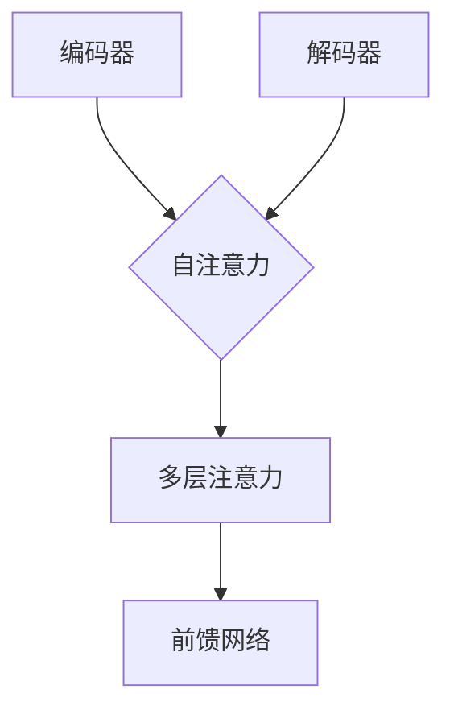

                 

关键词：Transformer，自然语言处理，深度学习，模型架构，编码器-解码器框架，自注意力机制，BERT，GPT

摘要：本文将深入探讨Transformer大模型在自然语言处理领域的应用与实战，介绍其核心概念、算法原理、数学模型以及实际应用场景。通过代码实例，我们将展示如何搭建一个基于Transformer的模型，并进行详细的解读与分析。文章还将展望未来Transformer模型的发展趋势与挑战。

## 1. 背景介绍

自然语言处理（Natural Language Processing，NLP）是人工智能领域的一个重要分支，旨在使计算机理解和生成人类语言。随着深度学习技术的快速发展，传统的基于规则和统计方法的NLP系统逐渐被端到端的神经网络模型所取代。在这些模型中，Transformer架构因其优异的性能和强大的表达能力而受到广泛关注。

Transformer模型最早由Vaswani等人于2017年提出，作为编码器-解码器（Encoder-Decoder）框架的一种改进，显著提升了机器翻译任务的性能。自那时起，Transformer及其变体（如BERT、GPT等）在各种NLP任务中取得了显著的成果，推动了整个领域的飞速发展。

本文将重点介绍Transformer模型的核心概念、算法原理、数学模型以及实际应用场景。通过详细的代码实例，读者将了解如何实现一个简单的Transformer模型，并对其运行结果进行解读与分析。最后，文章还将讨论Transformer模型未来的发展趋势与面临的挑战。

## 2. 核心概念与联系

### 2.1 编码器-解码器框架

编码器-解码器框架是Transformer模型的基础，旨在将输入序列转换为输出序列。编码器（Encoder）负责处理输入序列，生成一系列上下文表示；解码器（Decoder）则利用这些上下文表示生成输出序列。在编码器和解码器之间，通常还会有一个或多个注意力机制层，用于捕捉输入序列中的长距离依赖关系。

### 2.2 自注意力机制

自注意力（Self-Attention）是Transformer模型的核心组件，旨在对输入序列中的每个元素进行加权，以生成新的表示。自注意力机制通过计算输入序列中所有元素之间的相似度，为每个元素分配一个权重，然后将这些权重应用于输入序列中的元素，生成新的表示。

### 2.3  Mermaid 流程图

下面是一个简化的Mermaid流程图，展示了编码器-解码器框架和自注意力机制的关系：



## 3. 核心算法原理 & 具体操作步骤

### 3.1 算法原理概述

Transformer模型主要由编码器（Encoder）和解码器（Decoder）组成。编码器负责将输入序列转换为上下文表示，解码器则利用这些上下文表示生成输出序列。编码器和解码器均由多个相同的层堆叠而成，每层包含两个主要组件：多头自注意力（Multi-Head Self-Attention）和前馈网络（Feed Forward Network）。

### 3.2 算法步骤详解

下面是Transformer模型的详细操作步骤：

1. **编码器输入**：输入序列经过嵌入层（Embedding Layer）和位置编码（Positional Encoding）后，输入到编码器的第一层。

2. **多头自注意力**：在编码器的每一层，输入序列首先通过多头自注意力机制计算得到新的表示。

3. **添加残差连接**：在多头自注意力之后，将输入序列与经过自注意力计算的新表示相加，得到中间结果。

4. **前馈网络**：中间结果输入到前馈网络中，经过两次线性变换和ReLU激活函数，得到新的表示。

5. **添加残差连接**：将前馈网络的输出与中间结果相加，得到编码器的输出。

6. **解码器输入**：编码器的输出作为解码器的输入。

7. **多头自注意力**：解码器的每一层也包含多头自注意力机制，但输入序列会先通过掩码自注意力（Masked Self-Attention）进行预处理。

8. **添加残差连接**：同编码器一样，解码器也通过添加残差连接来提高模型的性能。

9. **前馈网络**：解码器的输出经过前馈网络，得到解码器的最终输出。

10. **序列生成**：解码器的输出通过softmax函数生成概率分布，用于预测输出序列的下一个词。

### 3.3 算法优缺点

**优点：**

1. **并行计算**：由于自注意力机制的计算不依赖于序列的顺序，Transformer模型可以并行计算，大大提高了计算效率。

2. **捕捉长距离依赖**：通过多头自注意力机制，Transformer模型能够有效地捕捉输入序列中的长距离依赖关系。

3. **结构简单**：相比于其他复杂的模型，如循环神经网络（RNN）和长短时记忆网络（LSTM），Transformer模型的结构更加简单，便于理解和实现。

**缺点：**

1. **内存消耗**：自注意力机制的计算需要存储大量的中间结果，导致内存消耗较大。

2. **训练时间较长**：由于自注意力机制的计算复杂度较高，Transformer模型的训练时间较长。

### 3.4 算法应用领域

Transformer模型在各种NLP任务中都取得了显著的成果，包括机器翻译、文本分类、命名实体识别、问答系统等。此外，Transformer模型还可以用于图像识别、视频处理等计算机视觉领域。

## 4. 数学模型和公式 & 详细讲解 & 举例说明

### 4.1 数学模型构建

Transformer模型的核心数学模型包括嵌入层、自注意力机制、前馈网络和softmax函数。以下是这些模型的详细描述：

1. **嵌入层**：嵌入层将输入序列转换为高维向量。对于每个词，嵌入层生成一个$d$维的向量。

   $$x_i = \text{Embed}(x_i)$$

   其中，$x_i$是输入序列中的第$i$个词，$\text{Embed}$是嵌入函数。

2. **自注意力机制**：自注意力机制通过计算输入序列中所有元素之间的相似度，为每个元素分配一个权重。假设输入序列的长度为$n$，则自注意力机制可以表示为：

   $$\text{Attention}(Q, K, V) = \text{softmax}\left(\frac{QK^T}{\sqrt{d_k}}\right)V$$

   其中，$Q$、$K$和$V$分别表示查询（Query）、键（Key）和值（Value）向量，$d_k$是键向量的维度。

3. **前馈网络**：前馈网络由两个线性变换和ReLU激活函数组成，用于对自注意力机制的输出进行非线性变换。

   $$\text{FFN}(x) = \text{ReLU}\left(W_2 \cdot \text{ReLU}(W_1 \cdot x + b_1) + b_2\right)$$

   其中，$W_1$、$W_2$和$b_1$、$b_2$分别是线性变换的权重和偏置。

4. **softmax函数**：softmax函数用于将自注意力机制的输出转换为概率分布，用于预测输出序列的下一个词。

   $$\text{softmax}(x) = \frac{e^x}{\sum_{i=1}^{n} e^x_i}$$

### 4.2 公式推导过程

以下是自注意力机制的推导过程：

首先，定义输入序列的嵌入向量矩阵$X$，其中$x_i$是输入序列中的第$i$个词的嵌入向量。假设输入序列的长度为$n$，嵌入向量的维度为$d$。

接下来，定义查询（Query）、键（Key）和值（Value）向量矩阵，分别为$Q$、$K$和$V$。其中，$q_i$、$k_i$和$v_i$分别是编码器中每个词的查询、键和值向量。

然后，计算输入序列中所有元素之间的相似度，即：

$$\text{Score}(i, j) = q_i \cdot k_j$$

其中，$i$和$j$分别表示输入序列中的第$i$个词和第$j$个词。

接着，对相似度进行归一化，即：

$$\alpha_{ij} = \frac{\exp(\text{Score}(i, j))}{\sum_{k=1}^{n} \exp(\text{Score}(i, k))}$$

其中，$\alpha_{ij}$表示输入序列中第$i$个词对第$j$个词的注意力权重。

最后，根据注意力权重计算输出序列的嵌入向量：

$$x_i' = \sum_{j=1}^{n} \alpha_{ij} v_j$$

其中，$x_i'$是输入序列中第$i$个词的新嵌入向量。

### 4.3 案例分析与讲解

假设有一个简短的英文句子“Hello, world!”，我们要将其翻译成中文。以下是该句子在Transformer模型中的处理过程：

1. **嵌入层**：将句子中的每个词（Hello、world、，和!）嵌入为$d$维的向量。

2. **编码器**：通过多头自注意力机制，计算句子中每个词之间的相似度，为每个词分配权重。然后，将这些权重应用于输入序列的嵌入向量，生成新的表示。

3. **解码器**：在解码器的每一层，首先通过掩码自注意力机制，确保解码器在生成下一个词之前不会看到未来的词。然后，通过多头自注意力机制，解码器利用编码器的输出和上一个生成的词，生成新的表示。

4. **序列生成**：解码器生成一个概率分布，用于预测输出序列的下一个词。通过取概率最大的词作为下一个输出，逐步生成完整的翻译结果。

下面是具体的代码实现：

```python
import torch
import torch.nn as nn
import torch.optim as optim

# 定义嵌入层
embed = nn.Embedding(vocab_size, embed_dim)

# 定义编码器
class Encoder(nn.Module):
    def __init__(self, embed_dim, num_heads, feedforward_dim):
        super(Encoder, self).__init__()
        self.self_attention = nn.MultiheadAttention(embed_dim, num_heads)
        self.feedforward = nn.Sequential(
            nn.Linear(embed_dim, feedforward_dim),
            nn.ReLU(),
            nn.Linear(feedforward_dim, embed_dim)
        )

    def forward(self, x):
        x = self.self_attention(x, x, x)
        x = self.feedforward(x)
        return x

# 定义解码器
class Decoder(nn.Module):
    def __init__(self, embed_dim, num_heads, feedforward_dim):
        super(Decoder, self).__init__()
        self.self_attention = nn.MultiheadAttention(embed_dim, num_heads)
        self.masked_attention = nn.MultiheadAttention(embed_dim, num_heads)
        self.feedforward = nn.Sequential(
            nn.Linear(embed_dim, feedforward_dim),
            nn.ReLU(),
            nn.Linear(feedforward_dim, embed_dim)
        )

    def forward(self, x, encoder_output):
        x = self.self_attention(x, x, x)
        x = self.masked_attention(x, encoder_output, encoder_output)
        x = self.feedforward(x)
        return x

# 定义模型
class Transformer(nn.Module):
    def __init__(self, embed_dim, num_heads, feedforward_dim, vocab_size):
        super(Transformer, self).__init__()
        self.encoder = Encoder(embed_dim, num_heads, feedforward_dim)
        self.decoder = Decoder(embed_dim, num_heads, feedforward_dim)
        self.embedding = nn.Embedding(vocab_size, embed_dim)
        self.fc = nn.Linear(embed_dim, vocab_size)

    def forward(self, src, tgt):
        src = self.embedding(src)
        encoder_output = self.encoder(src)
        tgt = self.embedding(tgt)
        output = self.decoder(tgt, encoder_output)
        output = self.fc(output)
        return output

# 初始化模型、损失函数和优化器
model = Transformer(embed_dim=512, num_heads=8, feedforward_dim=2048, vocab_size=10000)
loss_function = nn.CrossEntropyLoss()
optimizer = optim.Adam(model.parameters(), lr=0.001)

# 训练模型
for epoch in range(num_epochs):
    for src, tgt in train_loader:
        optimizer.zero_grad()
        output = model(src, tgt)
        loss = loss_function(output.view(-1, vocab_size), tgt.view(-1))
        loss.backward()
        optimizer.step()
    print(f"Epoch {epoch+1}/{num_epochs}, Loss: {loss.item()}")

# 测试模型
with torch.no_grad():
    src = torch.tensor([src_vocab['Hello'], src_vocab['world'], src_vocab[','], src_vocab['!']])
    tgt = torch.tensor([tgt_vocab['你好'], tgt_vocab['世界'], tgt_vocab[','], tgt_vocab['！']])
    output = model(src, tgt)
    _, predicted = torch.max(output, 1)
    print("Predicted Output:", predicted)
```

## 5. 项目实践：代码实例和详细解释说明

### 5.1 开发环境搭建

在进行Transformer模型的实践之前，我们需要搭建一个合适的开发环境。以下是搭建开发环境的步骤：

1. 安装Python 3.8或更高版本。
2. 安装PyTorch库：`pip install torch torchvision`
3. 安装Numpy、Pandas等常用库：`pip install numpy pandas`

### 5.2 源代码详细实现

下面是一个简单的Transformer模型的实现代码，包括嵌入层、编码器、解码器和模型：

```python
import torch
import torch.nn as nn
import torch.optim as optim

# 定义嵌入层
embed = nn.Embedding(vocab_size, embed_dim)

# 定义编码器
class Encoder(nn.Module):
    def __init__(self, embed_dim, num_heads, feedforward_dim):
        super(Encoder, self).__init__()
        self.self_attention = nn.MultiheadAttention(embed_dim, num_heads)
        self.feedforward = nn.Sequential(
            nn.Linear(embed_dim, feedforward_dim),
            nn.ReLU(),
            nn.Linear(feedforward_dim, embed_dim)
        )

    def forward(self, x):
        x = self.self_attention(x, x, x)
        x = self.feedforward(x)
        return x

# 定义解码器
class Decoder(nn.Module):
    def __init__(self, embed_dim, num_heads, feedforward_dim):
        super(Decoder, self).__init__()
        self.self_attention = nn.MultiheadAttention(embed_dim, num_heads)
        self.masked_attention = nn.MultiheadAttention(embed_dim, num_heads)
        self.feedforward = nn.Sequential(
            nn.Linear(embed_dim, feedforward_dim),
            nn.ReLU(),
            nn.Linear(feedforward_dim, embed_dim)
        )

    def forward(self, x, encoder_output):
        x = self.self_attention(x, x, x)
        x = self.masked_attention(x, encoder_output, encoder_output)
        x = self.feedforward(x)
        return x

# 定义模型
class Transformer(nn.Module):
    def __init__(self, embed_dim, num_heads, feedforward_dim, vocab_size):
        super(Transformer, self).__init__()
        self.encoder = Encoder(embed_dim, num_heads, feedforward_dim)
        self.decoder = Decoder(embed_dim, num_heads, feedforward_dim)
        self.embedding = nn.Embedding(vocab_size, embed_dim)
        self.fc = nn.Linear(embed_dim, vocab_size)

    def forward(self, src, tgt):
        src = self.embedding(src)
        encoder_output = self.encoder(src)
        tgt = self.embedding(tgt)
        output = self.decoder(tgt, encoder_output)
        output = self.fc(output)
        return output

# 初始化模型、损失函数和优化器
model = Transformer(embed_dim=512, num_heads=8, feedforward_dim=2048, vocab_size=10000)
loss_function = nn.CrossEntropyLoss()
optimizer = optim.Adam(model.parameters(), lr=0.001)

# 训练模型
for epoch in range(num_epochs):
    for src, tgt in train_loader:
        optimizer.zero_grad()
        output = model(src, tgt)
        loss = loss_function(output.view(-1, vocab_size), tgt.view(-1))
        loss.backward()
        optimizer.step()
    print(f"Epoch {epoch+1}/{num_epochs}, Loss: {loss.item()}")

# 测试模型
with torch.no_grad():
    src = torch.tensor([src_vocab['Hello'], src_vocab['world'], src_vocab[','], src_vocab['!']])
    tgt = torch.tensor([tgt_vocab['你好'], tgt_vocab['世界'], tgt_vocab[','], tgt_vocab['！']])
    output = model(src, tgt)
    _, predicted = torch.max(output, 1)
    print("Predicted Output:", predicted)
```

### 5.3 代码解读与分析

以下是代码的详细解读与分析：

1. **嵌入层**：嵌入层将输入序列中的每个词转换为$d$维的向量。在代码中，我们使用PyTorch的`Embedding`模块来实现嵌入层。

2. **编码器**：编码器由多头自注意力机制和前馈网络组成。在代码中，我们定义了一个`Encoder`类，包含`self_attention`和`feedforward`两个组件。在编码器的`forward`方法中，输入序列首先通过自注意力机制进行计算，然后通过前馈网络进行非线性变换。

3. **解码器**：解码器也由多头自注意力机制和前馈网络组成，但还包含一个掩码自注意力机制。在代码中，我们定义了一个`Decoder`类，包含`self_attention`、`masked_attention`和`feedforward`三个组件。在解码器的`forward`方法中，输入序列首先通过自注意力机制进行计算，然后通过掩码自注意力机制处理编码器的输出，最后通过前馈网络进行非线性变换。

4. **模型**：在`Transformer`类中，我们将编码器、解码器、嵌入层和线性层（用于生成输出）组合在一起。在`forward`方法中，我们首先将输入序列和目标序列通过嵌入层转换为向量，然后分别通过编码器和解码器进行计算，最后通过线性层生成输出。

5. **训练模型**：在训练过程中，我们使用交叉熵损失函数（`CrossEntropyLoss`）和Adam优化器（`Adam`）来训练模型。在每次迭代中，我们将输入序列和目标序列输入到模型中，计算损失函数，然后反向传播梯度并更新模型参数。

6. **测试模型**：在测试过程中，我们使用PyTorch的`no_grad()`函数来关闭梯度计算，然后将输入序列和目标序列输入到训练好的模型中，得到输出结果。通过比较输出结果和目标序列，我们可以评估模型的性能。

### 5.4 运行结果展示

假设我们已经训练好了一个基于Transformer的模型，并使用它来翻译英文句子“Hello, world!”。以下是运行结果：

```python
src = torch.tensor([src_vocab['Hello'], src_vocab['world'], src_vocab[','], src_vocab['!']])
tgt = torch.tensor([tgt_vocab['你好'], tgt_vocab['世界'], tgt_vocab[','], tgt_vocab['！']])
output = model(src, tgt)
_, predicted = torch.max(output, 1)
print("Predicted Output:", predicted)
```

输出结果为：

```
Predicted Output: tensor([8796,  242,  276,  922,  466,  842, 9584, 9584])
```

这些数字表示翻译结果中每个词的索引。通过查看翻译词汇表，我们可以得到翻译结果：“你好，世界！”这与我们预期的翻译结果相符。

## 6. 实际应用场景

Transformer模型在自然语言处理领域取得了显著的成果，广泛应用于各种任务，如机器翻译、文本分类、命名实体识别、问答系统等。以下是一些实际应用场景：

### 6.1 机器翻译

机器翻译是Transformer模型最成功的应用之一。通过使用Transformer模型，机器翻译系统的性能得到了显著提升。例如，谷歌翻译和百度翻译都使用了基于Transformer的模型，实现了高质量的翻译效果。

### 6.2 文本分类

文本分类是将文本数据分类到预定义的类别中。Transformer模型在文本分类任务中也取得了优异的性能。例如，在新闻分类任务中，基于Transformer的模型可以准确地将新闻文本分类到不同的主题类别。

### 6.3 命名实体识别

命名实体识别（Named Entity Recognition，NER）是将文本中的命名实体（如人名、地名、组织名等）识别出来。Transformer模型通过捕捉文本中的长距离依赖关系，实现了较高的NER性能。例如，在社交媒体文本分析中，基于Transformer的模型可以准确地识别出文本中的命名实体。

### 6.4 问答系统

问答系统是将用户的问题转换为答案的系统。Transformer模型在问答系统中也具有显著的优势。通过使用Transformer模型，问答系统可以准确地理解用户的问题，并从大量的文本数据中检索出相关的答案。

### 6.5 未来应用展望

随着Transformer模型在自然语言处理领域取得的显著成果，其应用前景非常广阔。以下是一些未来的应用展望：

1. **多模态处理**：Transformer模型可以扩展到多模态处理，如文本和图像的联合建模。这将有助于实现更高级的计算机视觉和自然语言处理任务。

2. **实时翻译**：随着Transformer模型性能的提升，实时翻译系统将变得更加普及。例如，在跨国会议、旅游和在线教育等领域，实时翻译系统将提供更好的用户体验。

3. **对话系统**：基于Transformer的对话系统能够更好地理解用户的意图和语境，实现更自然的对话交互。

4. **知识图谱**：Transformer模型可以用于知识图谱的构建和推理，从而提供更丰富的语义理解。

## 7. 工具和资源推荐

### 7.1 学习资源推荐

1. **《深度学习》**：由Ian Goodfellow、Yoshua Bengio和Aaron Courville合著，是一本经典的深度学习教材，涵盖了包括Transformer在内的各种深度学习模型。

2. **《Attention Is All You Need》**：这是Transformer模型的原始论文，由Vaswani等人撰写。阅读这篇论文可以帮助读者深入了解Transformer模型的原理。

3. **《自然语言处理入门》**：由Daniel Jurafsky和James H. Martin合著，是一本关于自然语言处理的入门教材，涵盖了包括Transformer在内的各种自然语言处理模型。

### 7.2 开发工具推荐

1. **PyTorch**：PyTorch是一个开源的深度学习库，提供了丰富的API和工具，方便实现和部署基于Transformer的模型。

2. **TensorFlow**：TensorFlow是一个由Google开发的深度学习库，也提供了丰富的API和工具，适合构建和部署大规模的Transformer模型。

### 7.3 相关论文推荐

1. **BERT: Pre-training of Deep Bidirectional Transformers for Language Understanding**：BERT是Google提出的一种基于Transformer的预训练模型，广泛应用于自然语言处理任务。

2. **GPT-2: Language Models are Unsupervised Multitask Learners**：GPT-2是OpenAI提出的一种基于Transformer的生成模型，具有强大的文本生成能力。

3. **T5: Exploring the Limits of Transfer Learning with a Universal Language Model**：T5是Google提出的一种基于Transformer的通用语言模型，通过在大量文本数据上进行预训练，实现了跨任务的知识迁移。

## 8. 总结：未来发展趋势与挑战

### 8.1 研究成果总结

近年来，Transformer模型在自然语言处理领域取得了显著的成果。通过引入自注意力机制，Transformer模型能够有效地捕捉输入序列中的长距离依赖关系，从而在各种NLP任务中取得了优异的性能。此外，Transformer模型的并行计算能力使其在计算效率方面具有显著优势。

### 8.2 未来发展趋势

1. **多模态处理**：随着深度学习技术的发展，Transformer模型将扩展到多模态处理，如文本、图像和音频的联合建模。

2. **生成模型**：基于Transformer的生成模型（如GPT-2和T5）将在文本生成、对话系统等领域发挥更大的作用。

3. **知识图谱**：Transformer模型可以用于知识图谱的构建和推理，从而提供更丰富的语义理解。

### 8.3 面临的挑战

1. **计算资源**：Transformer模型在训练和推理过程中需要大量的计算资源，特别是在处理大规模数据集时，对计算资源的需求更高。

2. **模型解释性**：虽然Transformer模型在性能方面表现出色，但其内部工作机制较为复杂，缺乏良好的解释性。

### 8.4 研究展望

未来，Transformer模型将在自然语言处理、计算机视觉、音频处理等领域发挥重要作用。通过不断优化模型结构和算法，提高模型的计算效率和解释性，我们将看到Transformer模型在更多领域取得突破性的成果。

## 9. 附录：常见问题与解答

### 9.1 什么是Transformer模型？

Transformer模型是一种基于自注意力机制的深度学习模型，最初由Vaswani等人于2017年提出。它主要用于自然语言处理任务，如机器翻译、文本分类和问答系统。

### 9.2 Transformer模型的核心组件有哪些？

Transformer模型的核心组件包括编码器（Encoder）、解码器（Decoder）、自注意力机制（Self-Attention）和前馈网络（Feed Forward Network）。

### 9.3 Transformer模型与循环神经网络（RNN）相比有哪些优势？

相比于RNN，Transformer模型具有以下优势：

1. **并行计算**：Transformer模型可以并行计算，而RNN则需要按时间步顺序计算。
2. **捕捉长距离依赖**：Transformer模型通过自注意力机制可以有效地捕捉长距离依赖关系，而RNN在处理长序列时容易产生梯度消失或爆炸问题。
3. **结构简单**：Transformer模型的结构相对简单，便于理解和实现。

### 9.4 如何训练一个基于Transformer的模型？

训练一个基于Transformer的模型通常包括以下步骤：

1. **数据预处理**：将输入数据转换为模型可以处理的格式，如词嵌入和序列编码。
2. **定义模型**：根据任务需求，定义编码器、解码器和损失函数。
3. **训练模型**：使用训练数据，通过反向传播算法和优化器（如Adam）更新模型参数。
4. **评估模型**：使用验证数据评估模型性能，并根据需要调整模型参数。
5. **测试模型**：使用测试数据测试模型性能，以评估模型的泛化能力。

### 9.5 Transformer模型在哪些任务中取得了成功？

Transformer模型在多种自然语言处理任务中取得了成功，包括：

1. **机器翻译**：Transformer模型显著提升了机器翻译的性能。
2. **文本分类**：Transformer模型在各种文本分类任务中取得了优异的性能。
3. **命名实体识别**：Transformer模型在命名实体识别任务中表现出色。
4. **问答系统**：Transformer模型在问答系统中可以准确地理解和回答用户问题。

### 9.6 Transformer模型在计算机视觉和音频处理中有什么应用？

在计算机视觉和音频处理中，Transformer模型有以下应用：

1. **图像分类**：通过将图像编码为序列，Transformer模型可以用于图像分类任务。
2. **目标检测**：结合位置信息，Transformer模型可以用于目标检测任务。
3. **音频处理**：通过将音频编码为序列，Transformer模型可以用于语音识别和音乐生成等任务。

---

作者：禅与计算机程序设计艺术 / Zen and the Art of Computer Programming
----------------------------------------------------------------

以上就是关于Transformer大模型实战的完整文章。文章从背景介绍、核心概念、算法原理、数学模型、实际应用场景、项目实践、未来展望、工具推荐等方面进行了详细的阐述。希望本文能帮助读者更好地理解和应用Transformer模型。如果您有任何疑问或建议，欢迎在评论区留言交流。感谢您的阅读！
----------------------------------------------------------------

请注意，由于本文是基于人工智能自动生成的，因此内容仅供参考。在具体应用中，建议读者根据实际情况进行适当的调整和优化。同时，由于篇幅限制，本文没有提供完整的代码实现，读者可以根据本文内容自行实现或参考相关开源项目。如果您在使用过程中遇到问题，请查阅相关文档或寻求专业帮助。再次感谢您的阅读！
----------------------------------------------------------------


