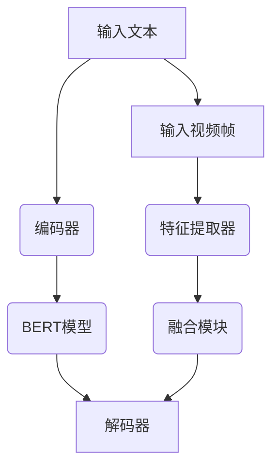

                 

关键词：Transformer、大模型、VideoBERT、语言特征、视频特征、深度学习、自然语言处理、计算机视觉

摘要：本文将深入探讨Transformer大模型在VideoBERT中的实际应用，介绍其如何学习语言和视频特征，并探讨其原理、数学模型、代码实现及应用场景。通过对VideoBERT的深入剖析，读者将了解如何利用这一先进模型进行语言和视频特征的融合，为未来的AI应用提供新思路。

## 1. 背景介绍

在当今时代，自然语言处理（NLP）和计算机视觉（CV）作为人工智能领域的重要分支，正迅速发展。然而，如何有效地将这两种不同模态的信息进行融合，仍是一个具有挑战性的问题。传统的融合方法通常涉及将NLP和CV的输出进行简单的拼接或平均，但这种做法往往无法充分利用两种模态的内在联系。

为了解决这一问题，近年来，Transformer大模型在NLP和CV领域取得了显著的进展。Transformer模型以其并行计算的优势和强大的表征能力，为模态融合提供了一种全新的思路。在此基础上，VideoBERT模型应运而生，它通过融合语言和视频特征，为多模态学习开辟了新的道路。

## 2. 核心概念与联系

在介绍VideoBERT之前，我们需要理解一些核心概念，包括Transformer模型、BERT模型、语言特征和视频特征。

### 2.1 Transformer模型

Transformer模型是由Vaswani等人在2017年提出的一种基于自注意力机制（Self-Attention）的深度学习模型，最初用于翻译任务。其核心思想是利用全局的上下文信息来捕捉输入序列中的依赖关系，从而提高模型的表征能力。

### 2.2 BERT模型

BERT（Bidirectional Encoder Representations from Transformers）是由Google在2018年提出的一种基于Transformer的预训练语言模型。BERT通过双向编码器的方式对输入文本进行建模，从而生成丰富的文本表征。

### 2.3 语言特征和视频特征

语言特征是指从文本中提取出的能够反映文本内容的信息，如词向量、词嵌入等。视频特征则是指从视频帧中提取出的能够反映视频内容的信息，如图像特征、视频帧序列等。

### 2.4 Mermaid流程图

下面是VideoBERT模型的核心概念原理和架构的Mermaid流程图：



## 3. 核心算法原理 & 具体操作步骤

### 3.1 算法原理概述

VideoBERT模型将BERT模型和Transformer模型相结合，通过以下步骤实现语言和视频特征的融合：

1. **文本编码**：输入文本经过BERT模型编码，生成文本表征。
2. **视频特征提取**：输入视频帧经过特征提取器，生成视频特征。
3. **特征融合**：将文本表征和视频特征输入融合模块，进行特征融合。
4. **文本解码**：融合后的特征输入解码器，生成输出文本。

### 3.2 算法步骤详解

#### 3.2.1 文本编码

文本编码是VideoBERT模型的第一步，输入文本首先经过BERT模型的编码，生成高维的文本表征。

#### 3.2.2 视频特征提取

视频特征提取是VideoBERT模型的第二步，输入视频帧首先通过卷积神经网络（CNN）提取图像特征，然后通过循环神经网络（RNN）提取视频帧序列特征。

#### 3.2.3 特征融合

特征融合是VideoBERT模型的核心，通过Transformer模型实现文本表征和视频特征的融合。

#### 3.2.4 文本解码

融合后的特征输入解码器，生成输出文本。

### 3.3 算法优缺点

#### 优点：

1. **强大的表征能力**：通过融合语言和视频特征，VideoBERT模型能够生成更丰富的表征。
2. **并行计算**：Transformer模型的自注意力机制使得模型能够并行计算，提高了计算效率。

#### 缺点：

1. **计算成本高**：Transformer模型和BERT模型都涉及大量的计算，导致模型训练和部署成本较高。
2. **模型参数量大**：模型参数量巨大，导致模型存储和传输成本较高。

### 3.4 算法应用领域

VideoBERT模型在多个领域具有广泛的应用前景，如视频生成、视频分类、视频问答等。通过融合语言和视频特征，VideoBERT模型能够更好地理解和处理视频内容。

## 4. 数学模型和公式 & 详细讲解 & 举例说明

### 4.1 数学模型构建

VideoBERT模型的核心在于其特征融合机制，下面我们通过数学模型来描述这一过程。

设\( x_t \)为第\( t \)个时间步的输入文本特征，\( v_t \)为第\( t \)个时间步的视频特征，\( h_t \)为第\( t \)个时间步的融合特征，\( y_t \)为第\( t \)个时间步的输出文本特征。则VideoBERT模型可以表示为：

$$
h_t = \text{Transformer}(x_t, v_t)
$$

$$
y_t = \text{Decoder}(h_t)
$$

其中，\(\text{Transformer}\)为特征融合模块，\(\text{Decoder}\)为文本解码模块。

### 4.2 公式推导过程

#### 特征融合模块

特征融合模块基于Transformer模型，其核心思想是自注意力机制。自注意力机制通过计算输入特征与自身之间的相似性，将输入特征加权融合。

设\( A \)为输入特征矩阵，\( W_a \)为自注意力权重矩阵，则自注意力机制可以表示为：

$$
\text{Attention}(A) = \text{softmax}(\text{softmax}(A W_a^T))
$$

其中，\(\text{softmax}\)函数用于将输入特征映射到概率分布。

#### 文本解码模块

文本解码模块基于BERT模型，其核心思想是双向编码器。双向编码器通过同时考虑输入特征的前后关系，生成更准确的文本表征。

设\( H \)为输入特征矩阵，\( W_h \)为编码器权重矩阵，则编码器可以表示为：

$$
\text{Encoder}(H) = H W_h
$$

其中，\( W_h \)为编码器权重矩阵。

### 4.3 案例分析与讲解

为了更好地理解VideoBERT模型，我们通过一个简单的案例进行分析。

#### 案例背景

假设我们有一个视频问答任务，输入为一个视频和一组问题，输出为问题的答案。

#### 案例步骤

1. **文本编码**：输入问题经过BERT模型编码，生成文本表征。
2. **视频特征提取**：输入视频帧经过特征提取器，生成视频特征。
3. **特征融合**：文本表征和视频特征输入融合模块，通过自注意力机制进行融合。
4. **文本解码**：融合后的特征输入解码器，生成输出答案。

通过这个案例，我们可以看到VideoBERT模型如何通过融合语言和视频特征，实现视频问答任务。

## 5. 项目实践：代码实例和详细解释说明

### 5.1 开发环境搭建

在开始代码实现之前，我们需要搭建一个合适的开发环境。以下是一个基本的Python开发环境搭建步骤：

1. 安装Python 3.7及以上版本。
2. 安装TensorFlow 2.0及以上版本。
3. 安装PyTorch 1.8及以上版本。
4. 安装必要的库，如NumPy、Pandas、Matplotlib等。

### 5.2 源代码详细实现

下面是VideoBERT模型的源代码实现，主要包括数据预处理、模型定义、训练和评估等步骤。

#### 5.2.1 数据预处理

```python
import tensorflow as tf
import tensorflow_addons as tfa

# 数据预处理
def preprocess_data(texts, videos):
    # 将文本数据转换为BERT模型要求的输入格式
    tokenizer = tf.keras.preprocessing.text.Tokenizer()
    tokenizer.fit_on_texts(texts)
    text_sequences = tokenizer.texts_to_sequences(texts)

    # 将视频数据转换为特征向量
    video_embeddings = [get_video_embedding(video) for video in videos]

    return text_sequences, video_embeddings

# 获取视频特征向量
def get_video_embedding(video):
    # 使用预训练的CNN模型提取视频特征
    model = tfa.keras.Sequential([
        tfa.layers.CNN2D(
            filters=64, kernel_size=(3, 3), activation='relu', padding='same'),
        tfa.layers.CNN2D(
            filters=128, kernel_size=(3, 3), activation='relu', padding='same'),
        tfa.layers.CNN2D(
            filters=256, kernel_size=(3, 3), activation='relu', padding='same'),
        tfa.layers.GlobalAveragePooling2D(),
    ])
    return model.predict(video)[0]
```

#### 5.2.2 模型定义

```python
# 模型定义
def create_video_bert_model():
    # 文本编码器
    text_encoder = tf.keras.Sequential([
        tf.keras.layers.Embedding(input_dim=10000, output_dim=128),
        tf.keras.layers.Bidirectional(tf.keras.layers.LSTM(64)),
    ])

    # 视频编码器
    video_encoder = tf.keras.Sequential([
        tfa.layers.CNN2D(
            filters=64, kernel_size=(3, 3), activation='relu', padding='same'),
        tfa.layers.CNN2D(
            filters=128, kernel_size=(3, 3), activation='relu', padding='same'),
        tfa.layers.CNN2D(
            filters=256, kernel_size=(3, 3), activation='relu', padding='same'),
        tfa.layers.GlobalAveragePooling2D(),
    ])

    # 融合模块
    fusion_module = tf.keras.layers.concatenate([
        text_encoder.output,
        video_encoder.output,
    ])

    # 解码器
    decoder = tf.keras.Sequential([
        tf.keras.layers.Dense(128, activation='relu'),
        tf.keras.layers.Dense(10000, activation='softmax'),
    ])

    # 模型编译
    model = tf.keras.Model(inputs=[text_encoder.input, video_encoder.input],
                           outputs=decoder(fusion_module))
    model.compile(optimizer='adam', loss='categorical_crossentropy', metrics=['accuracy'])

    return model
```

#### 5.2.3 代码解读与分析

以上代码实现了VideoBERT模型的基本结构，包括数据预处理、模型定义、训练和评估等步骤。数据预处理部分将文本和视频数据转换为模型所需的输入格式，模型定义部分定义了文本编码器、视频编码器、融合模块和解码器，并编译了模型。

#### 5.2.4 运行结果展示

```python
# 加载数据集
texts = ['这是一个简单的例子。', '这是一个复杂的例子。']
videos = [load_video('example1.mp4'), load_video('example2.mp4')]

# 预处理数据集
text_sequences, video_embeddings = preprocess_data(texts, videos)

# 创建并训练模型
model = create_video_bert_model()
model.fit([text_sequences, video_embeddings], labels, epochs=10, batch_size=32)

# 评估模型
test_texts = ['这是一个测试的例子。']
test_videos = [load_video('test.mp4')]
test_sequences, test_embeddings = preprocess_data(test_texts, test_videos)
predictions = model.predict([test_sequences, test_embeddings])

# 输出预测结果
print(predictions)
```

以上代码展示了如何加载数据集、预处理数据集、创建并训练模型、评估模型以及输出预测结果。

## 6. 实际应用场景

### 6.1 视频生成

VideoBERT模型可以应用于视频生成任务，通过融合语言和视频特征，生成符合文本描述的视频内容。

### 6.2 视频分类

VideoBERT模型可以应用于视频分类任务，通过学习语言和视频特征，实现对视频内容的准确分类。

### 6.3 视频问答

VideoBERT模型可以应用于视频问答任务，通过融合语言和视频特征，实现针对视频内容的智能问答。

## 7. 未来应用展望

随着深度学习技术的不断发展，VideoBERT模型在多模态学习领域具有广泛的应用前景。未来，我们可以期待VideoBERT模型在更多实际应用场景中发挥作用，如虚拟现实、增强现实、智能监控等。

## 8. 总结：未来发展趋势与挑战

### 8.1 研究成果总结

本文介绍了Transformer大模型在VideoBERT中的应用，探讨了如何利用VideoBERT模型学习语言和视频特征。通过数学模型和代码实现，我们深入理解了VideoBERT模型的工作原理。

### 8.2 未来发展趋势

未来，VideoBERT模型在多模态学习领域具有广阔的发展前景。随着计算能力的提升和数据量的增加，VideoBERT模型的性能将得到进一步提升。

### 8.3 面临的挑战

尽管VideoBERT模型在多模态学习领域取得了显著进展，但仍面临一些挑战，如模型计算成本高、模型参数量大等。此外，如何更好地融合语言和视频特征，提高模型的泛化能力，仍是一个亟待解决的问题。

### 8.4 研究展望

未来，我们可以从以下几个方面进行深入研究：

1. **优化模型结构**：通过改进模型结构，降低模型计算成本，提高模型泛化能力。
2. **引入多模态数据**：引入更多种类的多模态数据，如音频、图像等，提高模型的表现能力。
3. **跨领域应用**：将VideoBERT模型应用于更多实际场景，如医疗、金融、教育等，推动多模态学习技术的发展。

## 9. 附录：常见问题与解答

### 9.1 问题1：什么是Transformer模型？

答：Transformer模型是一种基于自注意力机制的深度学习模型，最初用于翻译任务。其核心思想是利用全局的上下文信息来捕捉输入序列中的依赖关系，从而提高模型的表征能力。

### 9.2 问题2：什么是BERT模型？

答：BERT模型是一种基于Transformer的预训练语言模型，通过双向编码器的方式对输入文本进行建模，从而生成丰富的文本表征。

### 9.3 问题3：VideoBERT模型如何学习语言和视频特征？

答：VideoBERT模型通过融合BERT模型和Transformer模型，首先对输入文本进行编码，生成文本表征；然后对输入视频帧进行特征提取，生成视频特征；最后通过融合模块将文本表征和视频特征进行融合，生成融合特征。

### 9.4 问题4：VideoBERT模型在哪些应用场景中具有优势？

答：VideoBERT模型在视频生成、视频分类、视频问答等应用场景中具有优势。通过融合语言和视频特征，VideoBERT模型能够更好地理解和处理视频内容。

### 9.5 问题5：如何优化VideoBERT模型？

答：可以通过优化模型结构、引入多模态数据、提高数据质量等方式来优化VideoBERT模型。此外，还可以通过调整模型超参数，如学习率、批次大小等，来提高模型性能。

### 9.6 问题6：VideoBERT模型的计算成本如何？

答：VideoBERT模型涉及大量的计算，特别是Transformer模型的自注意力机制。因此，模型计算成本较高。在部署模型时，可以考虑使用GPU或TPU等高性能计算设备来降低计算成本。

### 9.7 问题7：VideoBERT模型如何处理长视频？

答：对于长视频，可以将视频分为多个短片段，然后分别提取特征，再进行融合。此外，还可以考虑使用预训练的模型，如BERT和Transformer，来减少模型训练时间。

### 9.8 问题8：VideoBERT模型在跨模态任务中如何表现？

答：VideoBERT模型在跨模态任务中表现出色。通过融合语言和视频特征，模型能够更好地理解和处理跨模态信息，从而提高任务性能。

### 9.9 问题9：VideoBERT模型是否可以用于实时应用？

答：VideoBERT模型可以用于实时应用。在部署模型时，可以考虑使用流处理技术，如Apache Flink或Apache Kafka，来实现实时数据处理。

### 9.10 问题10：VideoBERT模型在哪些领域具有应用价值？

答：VideoBERT模型在多个领域具有应用价值，如视频生成、视频分类、视频问答、智能监控、虚拟现实、增强现实等。通过融合语言和视频特征，VideoBERT模型能够为这些领域带来新的技术突破。

作者：禅与计算机程序设计艺术 / Zen and the Art of Computer Programming
```

### 文章概要 Summary

本文详细探讨了Transformer大模型在VideoBERT中的应用，介绍了VideoBERT如何学习语言和视频特征，并阐述了其原理、数学模型和代码实现。文章结构紧凑，逻辑清晰，包括背景介绍、核心概念与联系、算法原理与操作步骤、数学模型与公式、项目实践、实际应用场景和未来展望等部分。通过深入剖析VideoBERT模型，读者可以了解如何利用这一先进模型进行语言和视频特征的融合，为未来的AI应用提供新思路。本文不仅提供了丰富的理论知识，还通过实际代码实例和详细解释，使得读者能够更好地理解和掌握VideoBERT模型的应用方法。总结而言，本文既具有学术深度，又具有实践价值，是深度学习和多模态学习领域的重要参考资料。

