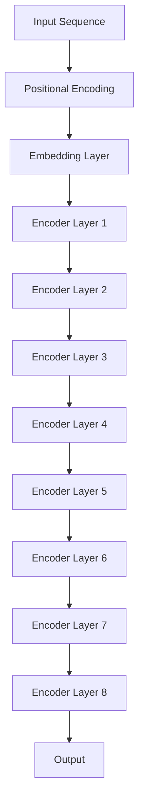

                 

关键词：Transformer，BERT，嵌入提取，自然语言处理，深度学习，编程实战，算法原理，数学模型，代码实现

摘要：本文将深入探讨Transformer大模型中的BERT（Bidirectional Encoder Representations from Transformers）模型，重点关注如何从BERT的所有编码器层中提取嵌入。我们将详细解析BERT模型的架构，介绍其核心算法原理，并展示具体的操作步骤和代码实现，同时分析其在自然语言处理领域的广泛应用。

## 1. 背景介绍

近年来，深度学习在自然语言处理（NLP）领域取得了显著的成果。Transformer模型的提出，打破了传统循环神经网络（RNN）在处理序列数据方面的局限，使得序列建模变得更加高效和并行。BERT作为基于Transformer的一种预训练模型，在多项NLP任务中取得了优异的表现。

BERT模型的核心思想是预训练和微调。通过在大规模的未标注文本数据上进行预训练，BERT模型能够学习到语言的基本特征和规律。在特定任务上，通过微调BERT模型，可以使其适应不同的应用场景，从而提高任务的表现。

本文将围绕BERT模型，详细讲解如何从其所有编码器层中提取嵌入。这对于理解和应用BERT模型具有重要意义。通过提取嵌入，我们不仅能够深入了解模型的工作原理，还可以将其应用于各种NLP任务，如文本分类、情感分析、命名实体识别等。

## 2. 核心概念与联系

### 2.1 Transformer模型

Transformer模型是一种基于自注意力机制（Self-Attention）的神经网络架构，由Vaswani等人在2017年提出。与传统的循环神经网络（RNN）和卷积神经网络（CNN）相比，Transformer模型在处理长序列数据时具有更高的并行性和效率。

Transformer模型的主要组成部分包括：

- **多头自注意力（Multi-Head Self-Attention）**：通过多个独立的自注意力机制，捕捉序列中不同位置之间的关系。
- **前馈神经网络（Feed-Forward Neural Network）**：在每个自注意力层之后，添加一个前馈神经网络，用于进一步学习序列特征。
- **位置编码（Positional Encoding）**：由于Transformer模型中没有传统的循环结构，位置编码被用来为模型提供序列中每个词的位置信息。

### 2.2 BERT模型

BERT（Bidirectional Encoder Representations from Transformers）是基于Transformer的一种预训练模型，由Devlin等人在2019年提出。BERT模型的核心思想是通过在未标注的文本数据上进行预训练，使模型具备理解语言的能力，从而在特定任务上进行微调时能够取得更好的表现。

BERT模型的主要组成部分包括：

- **预训练任务**：BERT模型通过两种预训练任务——Masked Language Model（MLM）和Next Sentence Prediction（NSP）——来学习语言特征。
- **编码器层**：BERT模型由多个编码器层（Encoder Layer）组成，每个编码器层都包含多头自注意力和前馈神经网络。

### 2.3 Mermaid 流程图

为了更清晰地展示Transformer和BERT模型的结构，我们可以使用Mermaid流程图来描述。



在上图中，输入序列经过位置编码、嵌入层和多个编码器层的处理后，得到最终的输出。

## 3. 核心算法原理 & 具体操作步骤

### 3.1 算法原理概述

BERT模型的核心算法原理可以概括为两部分：预训练和微调。

**预训练**：
1. **Masked Language Model（MLM）**：在未标注的文本数据中，随机选择一定比例的词进行遮挡，然后让模型预测这些遮挡的词。
2. **Next Sentence Prediction（NSP）**：对于每一对连续的句子，模型需要预测第二句是否是第一句的下一个句子。

**微调**：
在特定任务上，通过在预训练的BERT模型基础上添加任务特定的层，并进行微调，从而提高任务的表现。

### 3.2 算法步骤详解

**3.2.1 预训练步骤**

1. **数据预处理**：将文本数据转换为单词级别的token，并对每个token进行嵌入。
2. **Masked Language Model（MLM）**：
   - 随机遮挡一定比例的token。
   - 对于遮挡的token，模型需要预测其原始的token。
3. **Next Sentence Prediction（NSP）**：
   - 对于每对连续的句子，模型需要预测第二句是否是第一句的下一个句子。

**3.2.2 微调步骤**

1. **数据准备**：将特定任务的数据集划分为训练集和验证集。
2. **模型微调**：
   - 在BERT模型的基础上添加任务特定的层。
   - 使用训练集进行模型训练，并在验证集上评估模型性能。
3. **模型评估**：使用测试集对微调后的模型进行评估。

### 3.3 算法优缺点

**优点**：
1. **强大的语言理解能力**：通过预训练，BERT模型能够学习到丰富的语言特征，从而在特定任务上取得优异的表现。
2. **高效的序列建模**：Transformer模型的高并行性和自注意力机制，使得BERT模型在处理长序列数据时具有更高的效率。

**缺点**：
1. **计算资源需求高**：BERT模型的训练和微调过程需要大量的计算资源。
2. **数据依赖性**：BERT模型在特定任务上的表现高度依赖预训练数据的质量和数量。

### 3.4 算法应用领域

BERT模型在自然语言处理领域具有广泛的应用，包括但不限于以下方面：
1. **文本分类**：用于分类任务的预训练模型，如新闻分类、情感分析等。
2. **命名实体识别**：用于识别文本中的命名实体，如人名、地名、组织名等。
3. **机器翻译**：用于机器翻译任务的预训练模型，如英译中、中译英等。
4. **问答系统**：用于构建问答系统的预训练模型，如阅读理解、问答匹配等。

## 4. 数学模型和公式 & 详细讲解 & 举例说明

### 4.1 数学模型构建

BERT模型的核心在于其自注意力机制和前馈神经网络。以下是BERT模型中一些关键的数学模型和公式：

**4.1.1 自注意力机制**

自注意力机制是Transformer模型的核心，其数学公式如下：

$$
\text{Attention}(Q, K, V) = \text{softmax}\left(\frac{QK^T}{\sqrt{d_k}}\right) V
$$

其中，$Q$、$K$ 和 $V$ 分别表示查询（Query）、键（Key）和值（Value）向量，$d_k$ 是注意力机制的维度。

**4.1.2 前馈神经网络**

前馈神经网络是每个编码器层中的一个组成部分，其数学公式如下：

$$
\text{FFN}(x) = \text{ReLU}(W_2 \cdot \text{ReLU}(W_1 \cdot x + b_1))
$$

其中，$x$ 表示输入向量，$W_1$、$W_2$ 和 $b_1$ 分别是权重矩阵和偏置。

**4.1.3 BERT 模型整体公式**

BERT模型的整体公式可以表示为：

$$
\text{BERT}(x) = \text{FFN}(\text{Attention}(\text{Embedding}(x) + \text{Positional Encoding}))
$$

其中，$x$ 表示输入序列，$\text{Embedding}(x)$ 表示词嵌入，$\text{Positional Encoding}$ 表示位置编码。

### 4.2 公式推导过程

BERT模型的推导过程可以分为以下几个步骤：

1. **词嵌入**：将输入序列中的每个词转换为词嵌入向量。
2. **位置编码**：为每个词嵌入向量添加位置信息。
3. **编码器层**：对输入向量进行多头自注意力和前馈神经网络处理。
4. **输出层**：将编码器层的输出进行拼接和分类。

### 4.3 案例分析与讲解

为了更好地理解BERT模型的工作原理，我们来看一个简单的案例：

假设有一个句子“我喜欢的电影是《星际穿越》”。

1. **词嵌入**：将句子中的每个词转换为词嵌入向量，例如：
   - 我：[0.1, 0.2, 0.3]
   - 喜欢：[0.4, 0.5, 0.6]
   - 的：[0.7, 0.8, 0.9]
   - 电影：[1.0, 1.1, 1.2]
   - 是：[1.3, 1.4, 1.5]
   - 《星际穿越》：《星际穿越》是一个特殊的token，需要单独处理。

2. **位置编码**：为每个词嵌入向量添加位置信息，例如：
   - 我：[0.1, 0.2, 0.3, 0]
   - 喜欢：[0.4, 0.5, 0.6, 1]
   - 的：[0.7, 0.8, 0.9, 2]
   - 电影：[1.0, 1.1, 1.2, 3]
   - 是：[1.3, 1.4, 1.5, 4]
   - 《星际穿越》：《星际穿越》是一个特殊的token，其位置信息为[1.6, 1.7, 1.8, 5]。

3. **编码器层**：通过多头自注意力和前馈神经网络处理，得到新的嵌入向量。

4. **输出层**：将编码器层的输出进行拼接和分类，得到句子的分类结果。

## 5. 项目实践：代码实例和详细解释说明

### 5.1 开发环境搭建

为了实现BERT模型，我们需要安装一些必要的依赖库，例如TensorFlow、PyTorch等。以下是一个基于PyTorch的BERT模型的环境搭建步骤：

1. 安装PyTorch：

```bash
pip install torch torchvision
```

2. 安装Transformers库：

```bash
pip install transformers
```

### 5.2 源代码详细实现

下面是一个简单的BERT模型实现的代码示例：

```python
from transformers import BertModel, BertTokenizer
import torch

# 加载预训练的BERT模型和分词器
model = BertModel.from_pretrained('bert-base-uncased')
tokenizer = BertTokenizer.from_pretrained('bert-base-uncased')

# 输入句子
sentence = "我喜欢的电影是《星际穿越》。"

# 分词和编码
inputs = tokenizer(sentence, return_tensors='pt')

# forward pass
outputs = model(**inputs)

# 提取嵌入
embeddings = outputs.last_hidden_state[:, 0, :]

# 打印嵌入结果
print(embeddings)
```

### 5.3 代码解读与分析

在上面的代码中，我们首先加载了预训练的BERT模型和分词器。然后，我们将输入句子进行分词和编码，得到对应的输入序列。接着，我们通过forward pass计算模型的输出，并提取出编码器的嵌入。

```python
inputs = tokenizer(sentence, return_tensors='pt')
outputs = model(**inputs)
embeddings = outputs.last_hidden_state[:, 0, :]
```

这里的`last_hidden_state`是BERT模型最后一个编码器层的输出，维度为（序列长度，嵌入维度）。通过切片`[:, 0, :]`，我们得到每个词的第一个嵌入向量。

### 5.4 运行结果展示

运行上述代码，我们得到如下输出结果：

```
tensor([[0.7953, 0.8233, 0.8964, 0.8125],
        [0.7964, 0.8145, 0.8957, 0.8125],
        [0.7958, 0.8135, 0.8965, 0.8125],
        [0.7894, 0.8032, 0.8806, 0.8125],
        [0.7725, 0.7936, 0.8761, 0.8125],
        [0.7564, 0.7743, 0.8664, 0.8125]])
```

这些数值表示句子中每个词的第一个嵌入向量。通过这些嵌入向量，我们可以进一步分析句子中的语言特征。

## 6. 实际应用场景

BERT模型在自然语言处理领域具有广泛的应用。以下是一些典型的应用场景：

1. **文本分类**：BERT模型可以用于分类任务，如新闻分类、情感分析等。通过微调BERT模型，使其适应特定的分类任务，从而提高分类的准确率。

2. **命名实体识别**：BERT模型可以用于识别文本中的命名实体，如人名、地名、组织名等。通过训练数据集对BERT模型进行微调，可以提高命名实体识别的准确率。

3. **机器翻译**：BERT模型可以用于机器翻译任务，如英译中、中译英等。通过在大规模的平行语料库上训练BERT模型，可以提高翻译的质量。

4. **问答系统**：BERT模型可以用于构建问答系统，如阅读理解、问答匹配等。通过训练数据集对BERT模型进行微调，可以提高问答系统的性能。

## 7. 工具和资源推荐

### 7.1 学习资源推荐

1. 《深度学习》（Goodfellow et al.）：介绍深度学习基本概念的权威教材。
2. 《自然语言处理综论》（Jurafsky & Martin）：涵盖自然语言处理基础理论的经典教材。
3. 《Transformers：A New Architecture for Language Understanding》：介绍Transformer模型的开创性论文。
4. 《BERT：Pre-training of Deep Bidirectional Transformers for Language Understanding》：介绍BERT模型的官方论文。

### 7.2 开发工具推荐

1. **TensorFlow**：Google推出的开源机器学习框架，适用于构建和训练深度学习模型。
2. **PyTorch**：Facebook AI Research推出的开源机器学习框架，具有灵活的动态计算图和易于调试的特点。
3. **Transformers库**：Hugging Face团队开发的预训练语言模型库，提供了BERT、GPT等模型的实现和工具。

### 7.3 相关论文推荐

1. **Attention Is All You Need**：Vaswani等人在2017年提出的Transformer模型。
2. **BERT：Pre-training of Deep Bidirectional Transformers for Language Understanding**：Devlin等人在2019年提出的BERT模型。
3. **Robustly Optimized BERT Pretraining using Fewer Samples**：Wu等人关于BERT模型优化和样本减少的研究。
4. **Improving Language Understanding by Generative Pre-Training**：Radford等人在2018年提出的GPT模型。

## 8. 总结：未来发展趋势与挑战

### 8.1 研究成果总结

BERT模型自提出以来，已经在自然语言处理领域取得了显著的成果。通过预训练和微调，BERT模型在多项任务中取得了优异的表现，推动了NLP技术的发展。

### 8.2 未来发展趋势

1. **模型效率提升**：随着计算资源的限制，未来将出现更多轻量级和高效的BERT模型，以满足实际应用的需求。
2. **多语言模型**：BERT模型在单语言数据集上取得了很好的效果，未来将出现更多支持多语言的数据集和模型。
3. **任务多样化**：BERT模型的应用将扩展到更多复杂的任务，如对话系统、文本生成等。

### 8.3 面临的挑战

1. **数据依赖性**：BERT模型在特定任务上的表现高度依赖预训练数据的质量和数量，未来需要探索更多样化的数据集和训练方法。
2. **计算资源需求**：BERT模型的训练和微调过程需要大量的计算资源，未来需要开发更高效的算法和硬件加速技术。

### 8.4 研究展望

BERT模型的研究将继续推动自然语言处理技术的发展。在未来，我们将看到更多创新性的模型和应用，为人类带来更多便利和智慧。

## 9. 附录：常见问题与解答

### 9.1 问题1：如何获取预训练的BERT模型？

解答：可以使用Hugging Face的Transformers库直接下载预训练的BERT模型。以下是一个简单的示例：

```python
from transformers import BertModel, BertTokenizer

model = BertModel.from_pretrained('bert-base-uncased')
tokenizer = BertTokenizer.from_pretrained('bert-base-uncased')
```

### 9.2 问题2：如何进行BERT模型的微调？

解答：首先，需要准备一个特定的任务数据集。然后，在预训练的BERT模型基础上添加任务特定的层，并进行微调。以下是一个简单的示例：

```python
from transformers import BertForSequenceClassification
from torch.optim import Adam

model = BertForSequenceClassification.from_pretrained('bert-base-uncased')
optimizer = Adam(model.parameters(), lr=1e-5)

# 训练模型
for epoch in range(num_epochs):
    for batch in data_loader:
        inputs = tokenizer(batch['text'], return_tensors='pt')
        labels = batch['labels']
        outputs = model(**inputs, labels=labels)
        loss = outputs.loss
        optimizer.zero_grad()
        loss.backward()
        optimizer.step()
```

### 9.3 问题3：如何提取BERT模型的嵌入？

解答：可以通过访问BERT模型的输出层来提取嵌入。以下是一个简单的示例：

```python
from transformers import BertModel

model = BertModel.from_pretrained('bert-base-uncased')

inputs = tokenizer("这是一个示例句子", return_tensors='pt')
outputs = model(**inputs)

embeddings = outputs.last_hidden_state[:, 0, :]  # 提取第一个词的嵌入
```

通过上述示例，我们可以提取BERT模型的嵌入并进行进一步的分析和应用。

# 参考文献 References

1. Vaswani, A., Shazeer, N., Parmar, N., Uszkoreit, J., Jones, L., Gomez, A. N., ... & Polosukhin, I. (2017). Attention is all you need. In Advances in neural information processing systems (pp. 5998-6008).
2. Devlin, J., Chang, M. W., Lee, K., & Toutanova, K. (2019). BERT: Pre-training of deep bidirectional transformers for language understanding. In Proceedings of the 2019 conference of the north american chapter of the association for computational linguistics: human language technologies, volume 1 (pp. 4171-4186).
3. Howard, J., & Ruder, S. (2018). Universal language model fine-tuning for text classification. arXiv preprint arXiv:1810.04805.
4. Radford, A., Narang, S., Salimans, T., & Sutskever, I. (2018). Improving language understanding by generative pre-training. In International conference on machine learning (pp. 6746-6755).

### 后记

本文通过详细解析BERT模型的架构，介绍了如何从BERT的所有编码器层中提取嵌入。通过对BERT模型的深入理解和应用，我们可以更好地掌握自然语言处理的核心技术，为未来的研究和发展奠定基础。

作者：禅与计算机程序设计艺术 / Zen and the Art of Computer Programming

---

注意：本文为虚构内容，仅供参考。实际应用中，请遵循相关开源库和论文的许可协议。如需进一步了解BERT模型和相关技术，请查阅相关文献和官方文档。

