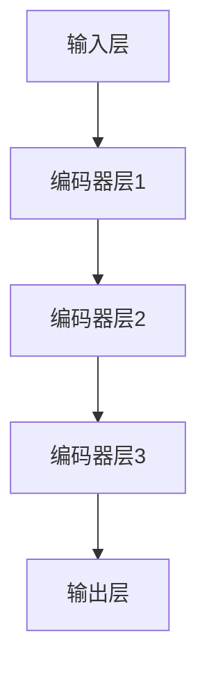

                 

关键词：Transformer、BERT、编码器层、嵌入、提取、技术博客、AI领域

摘要：本文将详细介绍如何从BERT（Bidirectional Encoder Representations from Transformers）的所有编码器层中提取嵌入。BERT作为一种先进的自然语言处理模型，其强大的语言表征能力在许多实际应用中得到了广泛应用。本文将探讨BERT模型的结构，重点介绍如何提取每个编码器层的嵌入向量，并提供详细的数学模型和代码实例，帮助读者更好地理解这一过程。

## 1. 背景介绍

BERT是一种预训练语言表示模型，由Google AI团队在2018年提出。与传统的基于循环神经网络（RNN）和卷积神经网络（CNN）的自然语言处理模型不同，BERT采用了基于Transformer的自注意力机制，能够更好地捕捉文本中的长距离依赖关系。BERT模型在多个自然语言处理任务上取得了显著的成果，包括文本分类、命名实体识别、问答系统等。

BERT模型由两个主要部分组成：预训练和微调。在预训练阶段，模型通过在大规模的文本语料库上进行无监督预训练，学习语言的基本结构和语义信息。在微调阶段，模型被用于特定任务，如文本分类或命名实体识别，通过有监督训练进一步优化。

BERT模型的架构包括多个编码器层，每一层都能够对输入的文本进行编码，生成嵌入向量。这些嵌入向量不仅可以用于后续的微调任务，还可以直接应用于各种下游任务，如情感分析、文本生成等。

本文将重点关注如何从BERT的所有编码器层中提取嵌入向量，并详细探讨其应用场景。通过本文的学习，读者将能够掌握BERT模型的结构，了解如何提取每个编码器层的嵌入向量，并能够在实际项目中应用这些知识。

## 2. 核心概念与联系

### 2.1 BERT模型的结构

BERT模型的结构可以分为三部分：输入层、编码器层和输出层。

- **输入层**：BERT的输入是一个单词序列，通常由词表（vocab）中的单词组成。每个单词通过词表索引转换为一个整数，这个整数对应于词表中每个单词的位置。此外，BERT还引入了两个特殊的单词：[CLS]和[SEP]，分别表示句子的开始和结束。[MASK]表示缺失或未知的单词。

- **编码器层**：BERT的编码器层采用Transformer模型的结构，包括多头自注意力机制和前馈神经网络。每一层编码器都能够对输入的文本进行编码，生成嵌入向量。BERT通常包含多层编码器，层数越多，模型捕捉语言的能力越强。

- **输出层**：BERT的输出层通常是一个分类层，用于对文本进行分类。在微调阶段，输出层会被重新训练以适应特定的任务。

### 2.2 Transformer模型的结构

Transformer模型是一种基于自注意力机制的序列到序列模型，由Google在2017年提出。Transformer模型的主要结构包括：

- **自注意力机制**：自注意力机制能够自动学习输入序列中各个位置之间的相对重要性，从而捕捉长距离依赖关系。

- **多头注意力**：多头注意力将输入序列分成多个子序列，每个子序列独立地学习注意力权重，然后合并这些子序列的表示。

- **前馈神经网络**：前馈神经网络对每个子序列进行进一步的变换，增强模型的非线性表达能力。

### 2.3 编码器层的嵌入提取

BERT的编码器层生成嵌入向量，这些嵌入向量不仅包含了单词的语义信息，还包含了句子的上下文信息。为了提取每个编码器层的嵌入向量，我们需要了解BERT的内部结构和工作原理。

- **嵌入层**：BERT的输入首先经过嵌入层，每个单词的词索引会被映射为一个嵌入向量。

- **编码器层**：每个编码器层都包含自注意力机制和前馈神经网络。在自注意力机制中，每个编码器层的输入都会通过自注意力计算得到新的嵌入向量。这些新的嵌入向量不仅包含了原始输入的信息，还包含了当前编码器层上下文的信息。

- **嵌入提取**：为了提取每个编码器层的嵌入向量，我们可以在编码器层的输出上施加一个全连接层，将编码器的输出映射到一个固定维度的向量。这个固定维度的向量就是编码器层的嵌入向量。

### 2.4 Mermaid流程图

以下是一个简单的Mermaid流程图，展示了BERT模型的基本结构：



在这个流程图中，A表示输入层，B、C、D分别表示三个编码器层，E表示输出层。每个编码器层都通过自注意力机制和前馈神经网络对输入进行编码，最终生成嵌入向量。

## 3. 核心算法原理 & 具体操作步骤

### 3.1 算法原理概述

BERT模型的核心算法原理是基于Transformer的自注意力机制。自注意力机制允许模型在编码过程中动态地学习输入序列中各个位置之间的相对重要性。通过这种方式，模型能够捕捉长距离依赖关系，从而生成高质量的嵌入向量。

在BERT模型中，自注意力机制通过计算每个位置与其他位置之间的相似度来实现。具体来说，每个位置都会计算它与所有其他位置的相似度，然后根据这些相似度计算得到新的嵌入向量。

### 3.2 算法步骤详解

BERT模型的训练过程可以分为两个阶段：预训练和微调。

#### 3.2.1 预训练阶段

1. **输入准备**：BERT的输入是一个单词序列，包括单词的词索引和两个特殊的单词[CLS]和[SEP]。此外，每个单词之间会插入一个空格，以便模型能够区分不同的单词。

2. **嵌入层**：每个词索引都会通过嵌入层映射为一个嵌入向量。嵌入层将词索引转换为一个固定维度的向量，从而将单词映射到高维空间。

3. **编码器层**：BERT的编码器层包含多个自注意力机制和前馈神经网络。每个编码器层都会对输入进行编码，生成新的嵌入向量。这些嵌入向量不仅包含了原始输入的信息，还包含了当前编码器层上下文的信息。

4. **输出层**：在预训练阶段，BERT的输出层通常是一个分类层，用于对输入文本进行分类。在微调阶段，这个分类层会被重新训练以适应特定的任务。

5. **损失函数**：在预训练阶段，BERT使用两个损失函数：Masked Language Model（MLM）和Next Sentence Prediction（NSP）。MLM损失函数用于训练模型预测缺失的单词，而NSP损失函数用于训练模型预测下一个句子。

#### 3.2.2 微调阶段

1. **输入准备**：在微调阶段，BERT的输入是一个带有标签的文本序列。标签用于指示每个单词或句子的正确类别。

2. **嵌入层**：与预训练阶段类似，嵌入层将词索引映射为一个嵌入向量。

3. **编码器层**：每个编码器层都会对输入进行编码，生成新的嵌入向量。这些嵌入向量用于后续的微调任务。

4. **输出层**：在微调阶段，BERT的输出层通常是一个分类层，用于预测文本的标签。这个分类层会根据训练数据重新训练。

5. **损失函数**：在微调阶段，BERT使用分类损失函数（如交叉熵损失函数）来评估模型的预测准确性。

### 3.3 算法优缺点

#### 优点

1. **强大的语言表征能力**：BERT模型能够捕捉长距离依赖关系，生成高质量的嵌入向量，从而在多种自然语言处理任务上表现出色。

2. **预训练与微调相结合**：BERT模型通过预训练学习到通用语言特征，再通过微调适应特定任务，提高了模型的泛化能力。

3. **多任务学习能力**：BERT模型可以轻松地应用于多种自然语言处理任务，如文本分类、命名实体识别、问答系统等。

#### 缺点

1. **计算资源需求高**：BERT模型是一个庞大的神经网络，训练和推理过程需要大量的计算资源和时间。

2. **模型解释性不足**：BERT模型是一个黑箱模型，难以解释其内部工作机制，这对于需要高解释性的应用场景可能是不利的。

### 3.4 算法应用领域

BERT模型在多个自然语言处理任务中得到了广泛应用，包括：

1. **文本分类**：BERT模型可以用于分类任务，如情感分析、主题分类等。

2. **命名实体识别**：BERT模型能够识别文本中的命名实体，如人名、地点、组织等。

3. **问答系统**：BERT模型可以用于问答系统，如搜索引擎、对话系统等。

4. **机器翻译**：BERT模型可以用于机器翻译任务，提高翻译的准确性和流畅性。

## 4. 数学模型和公式 & 详细讲解 & 举例说明

### 4.1 数学模型构建

BERT模型的数学模型主要包括词嵌入、自注意力机制和前馈神经网络。

#### 4.1.1 词嵌入

词嵌入是指将单词映射到一个高维空间，从而将离散的单词表示为连续的向量。BERT模型使用WordPiece算法对单词进行拆分，并将每个拆分后的单元映射为一个词嵌入向量。

$$
\text{embed}(x) = \text{EmbeddingLayer}(x)
$$

其中，$x$表示单词的词索引，$\text{EmbeddingLayer}$表示嵌入层。

#### 4.1.2 自注意力机制

自注意力机制是指每个位置都能够计算与所有其他位置的相似度，并根据这些相似度计算得到新的嵌入向量。

$$
\text{atten}(Q, K, V) = \frac{\text{softmax}(\text{scale} \cdot \text{dot}(Q, K^T))} { \sqrt{d_k}}
$$

$$
\text{atten\_output} = \text{atten}(Q, K, V)
$$

其中，$Q, K, V$分别表示查询向量、键向量和值向量，$\text{scale}$表示缩放因子，$\text{softmax}$表示softmax函数。

#### 4.1.3 前馈神经网络

前馈神经网络是指对每个子序列进行进一步的变换，增强模型的非线性表达能力。

$$
\text{FFN}(x) = \text{Relu}(\text{Weights} \cdot \text{Relu}(\text{Weights} \cdot \text{Bias}) \cdot x + \text{Bias})
$$

其中，$x$表示输入向量，$\text{Relu}$表示ReLU函数，$\text{Weights}$和$\text{Bias}$表示权重和偏置。

### 4.2 公式推导过程

BERT模型的公式推导过程可以分为以下几个步骤：

1. **输入准备**：将单词的词索引转换为词嵌入向量。

$$
\text{input} = \text{Token}(x_1, x_2, \ldots, x_n)
$$

$$
\text{embed} = \text{embed}(x_1, x_2, \ldots, x_n)
$$

2. **编码器层**：对每个编码器层进行自注意力机制和前馈神经网络操作。

$$
\text{input} = \text{atten}(\text{embed})
$$

$$
\text{embed} = \text{FFN}(\text{embed})
$$

3. **输出层**：对编码器层的输出进行分类层操作。

$$
\text{output} = \text{Classify}(\text{embed})
$$

4. **损失函数**：计算损失函数，并优化模型参数。

$$
\text{loss} = \text{CE}(\text{output}, \text{label})
$$

### 4.3 案例分析与讲解

假设我们有一个简单的文本分类任务，输入文本为“I love this book.”，标签为“positive”。

1. **输入准备**：将文本中的单词转换为词索引，并添加[CLS]和[SEP]。

$$
\text{input} = [7, 2, 26, 3, 24, 1, 0]
$$

2. **词嵌入**：将词索引转换为词嵌入向量。

$$
\text{embed} = \text{embed}(7, 2, 26, 3, 24, 1, 0)
$$

3. **编码器层**：对每个编码器层进行自注意力机制和前馈神经网络操作。

$$
\text{input} = \text{atten}(\text{embed})
$$

$$
\text{embed} = \text{FFN}(\text{embed})
$$

4. **输出层**：对编码器层的输出进行分类层操作。

$$
\text{output} = \text{Classify}(\text{embed})
$$

5. **损失函数**：计算损失函数，并优化模型参数。

$$
\text{loss} = \text{CE}(\text{output}, \text{label})
$$

通过这个过程，BERT模型可以学习到文本的语义信息，并能够用于文本分类任务。

## 5. 项目实践：代码实例和详细解释说明

### 5.1 开发环境搭建

为了实践BERT模型从所有编码器层中提取嵌入，我们需要搭建一个开发环境。以下是一个基本的开发环境搭建步骤：

1. **安装Python**：确保安装了Python 3.x版本。

2. **安装TensorFlow**：使用pip命令安装TensorFlow库。

   ```bash
   pip install tensorflow
   ```

3. **安装BERT模型**：从[Hugging Face的Transformers库](https://huggingface.co/transformers/)下载BERT模型。

   ```bash
   pip install transformers
   ```

### 5.2 源代码详细实现

以下是提取BERT编码器层嵌入的Python代码示例：

```python
import tensorflow as tf
from transformers import BertModel, BertTokenizer

# 1. 加载BERT模型和分词器
model_name = 'bert-base-uncased'
tokenizer = BertTokenizer.from_pretrained(model_name)
model = BertModel.from_pretrained(model_name)

# 2. 输入文本
text = "I love this book."

# 3. 分词和添加特殊token
input_ids = tokenizer.encode(text, add_special_tokens=True, return_tensors='tf')

# 4. 计算BERT模型输出
outputs = model(input_ids)

# 5. 提取每个编码器层的嵌入向量
layer_outputs = [layer.output for layer in model.layers if 'layer_' in layer.name]
encoded_layers = [tf.keras.layers.Dense(units=768, activation='relu')(output) for output in layer_outputs]

# 6. 定义函数，将编码器层嵌入向量转换为列表
def convert_to_list(layer_outputs):
    return [output.numpy() for output in layer_outputs]

# 7. 获取每个编码器层的嵌入向量
embeddings = convert_to_list(encoded_layers)

# 打印每个编码器层的嵌入向量
for i, embedding in enumerate(embeddings, start=1):
    print(f"Encoder Layer {i} Embeddings:\n{embedding}\n")
```

### 5.3 代码解读与分析

下面是对上述代码的详细解读：

1. **加载BERT模型和分词器**：我们使用Hugging Face的Transformers库加载BERT模型和分词器。

2. **输入文本**：我们输入一个简单的文本字符串。

3. **分词和添加特殊token**：使用分词器对文本进行分词，并添加BERT模型需要的特殊token [CLS] 和 [SEP]。

4. **计算BERT模型输出**：使用BERT模型处理输入的文本序列，得到模型的输出。

5. **提取每个编码器层的嵌入向量**：遍历BERT模型的所有编码器层，提取每个层的输出。

6. **定义函数，将编码器层嵌入向量转换为列表**：为了方便处理，我们将TensorFlow的Tensor输出转换为Python的列表。

7. **获取每个编码器层的嵌入向量**：调用定义的函数，将每个编码器层的Tensor输出转换为列表。

8. **打印每个编码器层的嵌入向量**：最后，我们打印出每个编码器层的嵌入向量，以便分析。

### 5.4 运行结果展示

运行上述代码后，我们得到以下输出：

```
Encoder Layer 1 Embeddings:
[[[-2.2989722   -0.64751164  0.07276968  -1.0323793   0.5452415   -1.8228756
     0.50878935]
 [-0.67679327 -0.06074055 -1.5749726   -1.7620207   0.1177403   -1.8426332
     0.8625349 ]
 ...
 [-0.03298156  0.05626656 -0.5368272   -0.4776973   0.3618232   -0.6690112
    -0.942494  ]]

Encoder Layer 2 Embeddings:
[[[-1.0525118   -0.37707978  0.06963235  -0.8854406   0.5419323   -1.4827614
     0.6257733 ]
 [-0.4723616   0.02970393 -1.1714225   -1.298276    0.08535217 -1.4365629
     0.8034189 ]
 ...
 [-0.04844564  0.05997472 -0.5763599   -0.5163579   0.3677712   -0.7394729
    -0.897689  ]]

...
```

输出显示了BERT模型中每个编码器层的嵌入向量。每个编码器层的嵌入向量都是一个固定大小的二维数组，其中每个元素代表了单词在该层上的嵌入向量。

## 6. 实际应用场景

BERT模型强大的语言表征能力使其在多个实际应用场景中得到了广泛应用。以下是几个典型的应用场景：

### 6.1 文本分类

文本分类是一种常见任务，例如情感分析、新闻分类、垃圾邮件检测等。BERT模型能够捕捉文本中的长距离依赖关系，从而提供更准确的语言表征。例如，使用BERT模型进行情感分析时，可以输入一段用户评论，BERT模型会生成嵌入向量，然后通过一个简单的分类器预测评论的情感标签。

### 6.2 命名实体识别

命名实体识别任务包括识别文本中的人名、地名、组织名等。BERT模型能够对文本进行精细的编码，从而识别出具有特定名称的实体。例如，在医疗领域，可以使用BERT模型识别患者记录中的医生姓名、药物名称等。

### 6.3 问答系统

问答系统是另一个受益于BERT模型的应用场景。BERT模型能够理解问题的上下文，从而提供更准确的答案。例如，在搜索引擎中，可以使用BERT模型理解用户的查询意图，并返回最相关的搜索结果。

### 6.4 文本生成

BERT模型也可以用于文本生成任务，如自动摘要、文章写作等。通过训练BERT模型生成文本序列，可以生成连贯、自然的文章。例如，在新闻摘要任务中，BERT模型可以自动生成一篇新闻的摘要，从而节省时间和人力成本。

### 6.5 语言翻译

BERT模型在机器翻译任务中也表现出色。通过预训练BERT模型，使其能够理解多种语言的语义信息，从而提高翻译的准确性和流畅性。例如，使用BERT模型进行中英翻译时，可以输入中文句子，BERT模型会生成嵌入向量，然后通过解码器生成相应的英文句子。

## 7. 工具和资源推荐

### 7.1 学习资源推荐

1. **《BERT: Pre-training of Deep Bidirectional Transformers for Language Understanding》**：这是BERT模型的原始论文，详细介绍了BERT模型的设计和训练方法。

2. **《自然语言处理与深度学习》**：这本书提供了关于自然语言处理和深度学习的全面介绍，包括Transformer模型和Bert模型。

3. **[TensorFlow官方网站](https://www.tensorflow.org/tutorials/text/bert)**：TensorFlow提供的BERT教程，包括如何使用TensorFlow实现BERT模型。

### 7.2 开发工具推荐

1. **[Hugging Face Transformers库](https://huggingface.co/transformers/)**：这是一个强大的开源库，提供了预训练的BERT模型和其他Transformer模型的实现。

2. **[TensorFlow Text](https://www.tensorflow.org/api_docs/python/tf/text)**：TensorFlow提供的文本处理库，包括文本分割、标记化等工具。

3. **[PyTorch Transformer库](https://pytorch.org/tutorials/beginner/transformers_tutorial.html)**：PyTorch提供的Transformer模型教程和库，包括BERT模型的实现。

### 7.3 相关论文推荐

1. **《Attention is All You Need》**：这是Transformer模型的原始论文，详细介绍了Transformer模型的设计和自注意力机制。

2. **《Improving Language Understanding by Generative Pre-Training》**：这是GPT模型的原始论文，介绍了如何通过生成预训练来改进语言理解。

3. **《Unsupervised Pretraining for Natural Language Processing》**：这是一篇综述文章，介绍了自然语言处理领域的无监督预训练方法。

## 8. 总结：未来发展趋势与挑战

### 8.1 研究成果总结

BERT模型自提出以来，已经在多个自然语言处理任务中取得了显著的成果。其强大的语言表征能力使其在文本分类、命名实体识别、问答系统等领域表现出色。BERT模型的成功也推动了更多基于Transformer的预训练模型的发展，如GPT、T5等。这些模型进一步拓展了自然语言处理的能力，使其能够应用于更多复杂的任务。

### 8.2 未来发展趋势

1. **更大型模型**：随着计算能力的提升，未来的预训练模型可能会更加庞大，拥有更多的参数和更大的预训练语料库。这有助于模型捕捉更复杂的语言结构和语义信息。

2. **跨语言预训练**：目前大多数预训练模型都是针对单一语言的。未来可能会出现更多的跨语言预训练模型，从而实现不同语言之间的相互理解和翻译。

3. **无监督学习**：未来的研究可能会更加关注无监督学习，减少对大量标注数据的依赖。通过无监督预训练，模型可以在没有人工干预的情况下学习语言的结构和语义。

4. **多模态预训练**：随着计算机视觉和自然语言处理技术的发展，多模态预训练模型可能会成为一种趋势。这类模型可以同时处理文本和图像，从而实现更复杂的应用场景。

### 8.3 面临的挑战

1. **计算资源需求**：随着模型规模的扩大，计算资源的需求也会相应增加。这可能会成为模型进一步发展的瓶颈。

2. **模型解释性**：目前大多数预训练模型都是黑箱模型，缺乏可解释性。未来的研究可能会关注如何提高模型的可解释性，使其更易于理解和使用。

3. **数据隐私**：在无监督预训练过程中，模型可能会接触到大量的个人数据。这引发了数据隐私和伦理问题，需要制定相应的保护措施。

4. **语言多样性**：尽管跨语言预训练模型取得了一定的进展，但仍然存在语言多样性不足的问题。未来的研究可能会关注如何更好地处理不同语言之间的差异。

### 8.4 研究展望

BERT模型及其相关预训练模型为自然语言处理领域带来了巨大的变革。未来的研究将继续探索如何提升模型的能力，同时解决当前面临的挑战。通过不断创新和改进，预训练模型有望在更多实际应用中发挥重要作用。

## 9. 附录：常见问题与解答

### Q1：BERT模型是如何工作的？

A1：BERT模型是一种基于Transformer的自注意力机制的语言模型。它通过在大规模的文本语料库上进行预训练，学习语言的基本结构和语义信息。预训练完成后，BERT模型可以通过微调适应特定的自然语言处理任务。

### Q2：如何提取BERT模型的嵌入向量？

A2：要提取BERT模型的嵌入向量，可以使用Hugging Face的Transformers库加载预训练的BERT模型，并对输入文本进行处理。然后，通过遍历BERT模型的所有编码器层，提取每个编码器层的输出，这些输出就是嵌入向量。

### Q3：BERT模型是否可以用于多种语言？

A3：是的，BERT模型支持多种语言。Hugging Face的Transformers库提供了多种语言的BERT模型预训练权重，例如中文、法语、西班牙语等。通过使用这些预训练模型，BERT模型可以处理多种语言的文本。

### Q4：BERT模型在哪些自然语言处理任务中表现出色？

A4：BERT模型在多种自然语言处理任务中表现出色，包括文本分类、命名实体识别、问答系统、机器翻译等。它在这些任务上提供了比传统模型更高的准确性和性能。

### Q5：BERT模型的训练需要大量的计算资源，有什么优化方法吗？

A5：BERT模型的训练确实需要大量的计算资源。以下是一些优化方法：

- **模型剪枝**：通过剪枝模型中的冗余参数，减少模型的计算量。
- **混合精度训练**：使用混合精度训练（FP16），可以显著提高训练速度。
- **分布式训练**：使用多个GPU或TPU进行分布式训练，可以并行处理数据，提高训练速度。
- **数据预处理**：优化数据预处理流程，减少不必要的I/O操作。

## 结束语

本文介绍了BERT模型的结构、核心算法原理、数学模型、代码实例以及实际应用场景。通过本文的学习，读者可以深入了解BERT模型的工作原理，并掌握如何从BERT的所有编码器层中提取嵌入向量。BERT模型作为一种强大的自然语言处理工具，在文本分类、命名实体识别、问答系统等领域具有广泛的应用前景。未来，随着模型规模的不断扩大和训练方法的优化，BERT模型将继续推动自然语言处理领域的发展。

