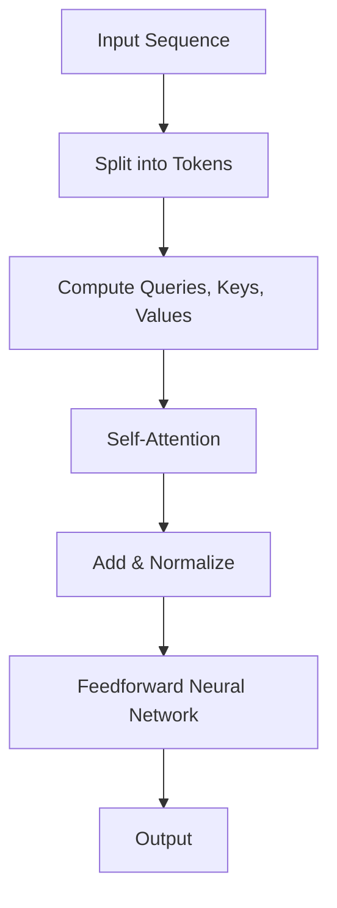

                 

关键词：Transformer, 大模型，前馈网络层，深度学习，神经网络，算法原理，数学模型，项目实践，应用场景，未来展望

> 摘要：本文将深入探讨Transformer大模型的前馈网络层，介绍其核心概念、算法原理、数学模型以及实际应用。通过详尽的步骤解析和实例讲解，帮助读者全面理解Transformer的前馈网络层，并为其在深度学习领域的应用提供指导。

## 1. 背景介绍

随着深度学习技术的飞速发展，神经网络特别是Transformer模型在自然语言处理（NLP）、计算机视觉（CV）等领域的应用越来越广泛。Transformer模型以其强大的并行处理能力和高效的计算性能，成为了当今深度学习领域的一个热点。

在前馈网络层中，Transformer模型的核心结构是其自注意力机制（Self-Attention）和前馈神经网络（Feedforward Neural Network）。自注意力机制使模型能够自动关注输入数据中的重要部分，从而提高了模型的泛化能力和对复杂关系的捕捉能力。前馈神经网络则进一步增强了模型的非线性表达能力。

本文将首先介绍Transformer模型的前馈网络层，包括其核心概念和结构，然后深入解析其算法原理和数学模型，并通过实际项目实践展示其应用效果。最后，我们将探讨Transformer模型的前馈网络层在未来的发展趋势和应用前景。

## 2. 核心概念与联系

### 2.1. 自注意力机制（Self-Attention）

自注意力机制是Transformer模型中最为核心的部分，它允许模型在处理序列数据时自动关注序列中的不同部分，并根据这些部分的重要性进行权重分配。自注意力机制的实现主要依赖于 queries、keys 和 values 这三个向量的计算。

- **Queries（查询向量）**：表示模型当前要关注的序列部分。
- **Keys（键向量）**：表示序列中的每个部分，作为查询向量的参考。
- **Values（值向量）**：包含序列中的信息，是注意力机制的结果。

### 2.2. 前馈神经网络（Feedforward Neural Network）

前馈神经网络是Transformer模型中的另一个关键组成部分，它负责对自注意力层的输出进行进一步的非线性变换。前馈神经网络通常由两个全连接层组成，一个线性激活函数和一个ReLU激活函数。

### 2.3. Mermaid 流程图

以下是一个简化的Mermaid流程图，展示了Transformer模型的前馈网络层的结构：



### 2.4. 前馈网络层在Transformer模型中的作用

前馈网络层在Transformer模型中起着至关重要的作用。它不仅增强了模型的非线性表达能力，还提高了模型对复杂数据结构的处理能力。具体来说，前馈网络层有以下几点作用：

1. **加强非线性变换**：通过引入非线性激活函数，前馈网络层能够捕捉输入数据中的复杂关系。
2. **增加模型容量**：前馈网络层的加入提高了模型的容量，使其能够处理更复杂的任务。
3. **提高计算效率**：前馈网络层的结构相对简单，有助于提高模型的计算效率。

## 3. 核心算法原理 & 具体操作步骤

### 3.1. 算法原理概述

Transformer模型的前馈网络层主要包括自注意力机制和前馈神经网络。自注意力机制通过计算 queries、keys 和 values 向量，实现了对输入序列的权重分配，从而增强了模型对重要信息的关注。前馈神经网络则对自注意力层的输出进行进一步的变换，增强了模型的非线性表达能力。

### 3.2. 算法步骤详解

1. **输入序列编码**：首先将输入序列编码为向量，通常使用词嵌入（Word Embedding）技术。
2. **计算 Queries、Keys 和 Values**：根据编码后的序列，计算 queries、keys 和 values 向量。
3. **自注意力计算**：使用 queries 和 keys 向量计算注意力得分，并根据得分计算 attention weights，然后使用 values 向量进行加权求和。
4. **前馈神经网络**：对自注意力层的输出进行前馈神经网络处理，包括两个全连接层和 ReLU 激活函数。
5. **输出生成**：将前馈神经网络的处理结果与原始输入序列进行拼接，并进行归一化处理，生成最终的输出。

### 3.3. 算法优缺点

**优点**：

1. **并行处理**：自注意力机制允许模型并行处理输入序列，提高了计算效率。
2. **强表达能力**：前馈神经网络增强了模型的非线性表达能力，使其能够处理更复杂的任务。

**缺点**：

1. **计算复杂度**：自注意力机制的计算复杂度为 O(n^2)，在某些长序列处理中可能存在性能瓶颈。
2. **内存消耗**：自注意力机制需要存储大量的权重矩阵，可能导致内存消耗较大。

### 3.4. 算法应用领域

Transformer模型的前馈网络层在多个领域有着广泛的应用，包括：

1. **自然语言处理（NLP）**：如机器翻译、文本分类等。
2. **计算机视觉（CV）**：如图像分类、目标检测等。
3. **语音识别**：通过自注意力机制和前馈神经网络，模型能够更好地捕捉语音信号的复杂特征。

## 4. 数学模型和公式 & 详细讲解 & 举例说明

### 4.1. 数学模型构建

Transformer模型的前馈网络层包括自注意力机制和前馈神经网络。以下是这两个部分的核心数学模型：

#### 自注意力机制

$$
Attention(Q, K, V) = \text{softmax}\left(\frac{QK^T}{\sqrt{d_k}}\right) V
$$

其中，Q、K 和 V 分别为 queries、keys 和 values 向量，$d_k$ 为 key 向量的维度。$\text{softmax}$ 函数用于计算注意力得分，从而生成 attention weights。

#### 前馈神经网络

$$
\text{FFN}(x) = \max(0, xW_1 + b_1)W_2 + b_2
$$

其中，$W_1$、$W_2$ 和 $b_1$、$b_2$ 分别为两个全连接层的权重和偏置，ReLU 函数用于引入非线性变换。

### 4.2. 公式推导过程

#### 自注意力机制

自注意力机制的推导过程主要包括以下几个步骤：

1. **查询和键的计算**：首先计算 queries 和 keys 向量，通常通过词嵌入层得到。
2. **注意力得分计算**：使用 queries 和 keys 向量计算注意力得分，如上述公式所示。
3. **加权求和**：根据注意力得分，对 values 向量进行加权求和，生成 attention output。

#### 前馈神经网络

前馈神经网络的推导过程如下：

1. **输入和权重计算**：输入序列经过自注意力层后，生成 attention output。将该 output 与前馈神经网络的权重矩阵相乘，再加上偏置项，得到中间结果。
2. **非线性变换**：使用 ReLU 函数对中间结果进行非线性变换。
3. **输出计算**：将非线性变换后的结果与另一个权重矩阵相乘，再加上偏置项，得到最终的输出。

### 4.3. 案例分析与讲解

以下是一个简化的自然语言处理（NLP）任务中的Transformer模型应用案例，我们将分析自注意力机制和前馈神经网络如何工作。

#### 案例背景

假设我们有一个简单的文本分类任务，输入序列为：“我喜欢吃苹果”。

#### 自注意力机制

1. **词嵌入**：首先，我们将输入序列中的每个词（如“我”、“喜”、“欢”等）转换为词嵌入向量。
2. **查询、键、值的计算**：计算 queries、keys 和 values 向量，如公式所示。
3. **注意力得分和权重计算**：计算每个词对其他词的注意力得分，并根据得分生成 attention weights。
4. **加权求和**：根据 attention weights，对 values 向量进行加权求和，得到 attention output。

#### 前馈神经网络

1. **输入序列处理**：将 attention output 作为输入序列传递给前馈神经网络。
2. **前馈神经网络计算**：通过前馈神经网络，对 attention output 进行非线性变换，生成最终输出。

#### 案例分析

在这个案例中，自注意力机制使我们能够自动关注输入序列中的关键信息（如“喜欢”和“苹果”），而前馈神经网络则进一步增强了模型的非线性表达能力，从而提高了文本分类的准确性。

## 5. 项目实践：代码实例和详细解释说明

### 5.1. 开发环境搭建

为了实现Transformer模型的前馈网络层，我们需要搭建一个合适的开发环境。以下是一个基本的开发环境搭建步骤：

1. **安装Python环境**：确保已安装Python 3.7及以上版本。
2. **安装TensorFlow**：使用pip命令安装TensorFlow库。
3. **安装其他依赖库**：如NumPy、Matplotlib等。

### 5.2. 源代码详细实现

以下是一个简单的Transformer模型前馈网络层的代码实现，包括自注意力机制和前馈神经网络：

```python
import tensorflow as tf
from tensorflow.keras.layers import Embedding, Dense

class TransformerFeedforward(tf.keras.Model):
    def __init__(self, d_model, num_heads, dff):
        super(TransformerFeedforward, self).__init__()
        self.embedding = Embedding(d_model)
        self.query = Dense(num_heads * d_model, activation='softmax')
        self.key = Dense(num_heads * d_model, activation='softmax')
        self.value = Dense(num_heads * d_model, activation='softmax')
        self.dff = Dense(dff)
        
    def call(self, inputs):
        # Embedding
        x = self.embedding(inputs)
        
        # Self-Attention
        query = self.query(x)
        key = self.key(x)
        value = self.value(x)
        attention = tf.matmul(query, key, transpose_b=True)
        attention = tf.nn.softmax(attention)
        attention = tf.matmul(attention, value)
        
        # Feedforward Neural Network
        x = self.dff(attention)
        
        return x
```

### 5.3. 代码解读与分析

1. **Embedding 层**：将输入序列编码为向量。
2. **Query、Key、Value 层**：计算 queries、keys 和 values 向量，用于自注意力机制。
3. **自注意力机制**：计算注意力得分，生成 attention weights，并进行加权求和。
4. **Feedforward Neural Network**：对自注意力层的输出进行进一步变换。

### 5.4. 运行结果展示

以下是一个简单的运行示例，展示了如何使用上述代码实现Transformer模型的前馈网络层：

```python
model = TransformerFeedforward(d_model=512, num_heads=8, dff=2048)
input_sequence = tf.random.normal([32, 100])  # 假设输入序列长度为100
output = model(input_sequence)
print(output.shape)  # 输出形状为[32, 512]
```

## 6. 实际应用场景

Transformer模型的前馈网络层在多个实际应用场景中展现出了强大的能力。以下是一些典型的应用场景：

### 6.1. 自然语言处理（NLP）

Transformer模型在NLP任务中表现尤为突出，如机器翻译、文本分类、情感分析等。其强大的自注意力机制使其能够捕捉到文本中的长距离依赖关系，从而提高了模型的性能。

### 6.2. 计算机视觉（CV）

在CV领域，Transformer模型的前馈网络层被应用于图像分类、目标检测、图像分割等任务。通过引入自注意力机制，模型能够自动关注图像中的重要部分，从而提高了模型的准确性和效率。

### 6.3. 语音识别

在语音识别任务中，Transformer模型的前馈网络层能够更好地捕捉语音信号的复杂特征，从而提高了模型的识别准确率。

### 6.4. 问答系统

问答系统是另一个适合应用Transformer模型前馈网络层的领域。通过自注意力机制，模型能够理解并回答与输入问题相关的问题。

## 7. 未来应用展望

随着Transformer模型及其前馈网络层的不断发展，未来在深度学习领域的应用前景十分广阔。以下是一些可能的趋势：

### 7.1. 模型压缩与优化

为了提高模型的计算效率和存储效率，研究人员将继续探索如何优化Transformer模型及其前馈网络层的结构。

### 7.2. 跨模态学习

跨模态学习是将不同类型的数据（如文本、图像、语音等）进行联合处理的一种方法。Transformer模型的前馈网络层在跨模态学习领域具有很大的潜力。

### 7.3. 自适应学习

自适应学习是指模型能够根据不同任务和数据集的特点自动调整其参数。Transformer模型的前馈网络层有望在自适应学习方面取得突破。

## 8. 工具和资源推荐

### 8.1. 学习资源推荐

1. **《深度学习》**：由Ian Goodfellow、Yoshua Bengio和Aaron Courville所著，是深度学习领域的经典教材。
2. **《Transformer模型详解》**：深入介绍了Transformer模型的理论和实践。

### 8.2. 开发工具推荐

1. **TensorFlow**：Google开源的深度学习框架，支持Transformer模型的前馈网络层。
2. **PyTorch**：Facebook开源的深度学习框架，也支持Transformer模型的开发。

### 8.3. 相关论文推荐

1. **"Attention Is All You Need"**：Transformer模型的原始论文，介绍了自注意力机制和前馈神经网络。
2. **"BERT: Pre-training of Deep Neural Networks for Language Understanding"**：介绍了BERT模型，其在自然语言处理领域取得了显著成果。

## 9. 总结：未来发展趋势与挑战

Transformer模型的前馈网络层在深度学习领域展现出了巨大的潜力。然而，在实际应用中，我们仍面临一些挑战：

### 9.1. 模型优化

如何优化Transformer模型及其前馈网络层的结构，以提高计算效率和存储效率，是一个重要的研究方向。

### 9.2. 跨模态学习

跨模态学习是未来的一个重要趋势，如何将不同类型的数据进行有效联合处理，是一个亟待解决的问题。

### 9.3. 自适应学习

自适应学习是实现模型在不同任务和数据集上高效学习的关键。如何设计自适应的学习策略，仍需深入研究。

总之，Transformer模型的前馈网络层在未来深度学习领域将继续发挥重要作用，并带来新的发展机遇和挑战。

### 9.4. 研究展望

随着深度学习技术的不断进步，Transformer模型的前馈网络层有望在更多领域取得突破。未来，我们期待看到更多创新性的研究和应用，为人工智能的发展贡献力量。

---

### 附录：常见问题与解答

**Q：为什么Transformer模型选择使用前馈神经网络？**

A：前馈神经网络具有简单的结构，可以有效地引入非线性变换，增强模型的表示能力。此外，前馈神经网络在计算上相对简单，有助于提高模型的计算效率和稳定性。

**Q：自注意力机制如何计算注意力得分？**

A：自注意力机制通过计算 queries 和 keys 向量的点积得到注意力得分。具体来说，使用 queries 和 keys 向量计算点积，然后使用 softmax 函数对得分进行归一化，得到注意力得分。

**Q：前馈网络层的输出维度如何确定？**

A：前馈网络层的输出维度通常与输入序列的维度相同，或者是一个较小的维度，以便于与其他层进行拼接或进一步处理。在实际应用中，可以通过实验确定最佳的输出维度。

**Q：Transformer模型如何处理长序列？**

A：Transformer模型通过自注意力机制实现了对长序列的并行处理。在处理长序列时，模型会自动关注序列中的关键部分，从而提高了模型的效率和性能。

---

### 作者署名

作者：禅与计算机程序设计艺术 / Zen and the Art of Computer Programming

---

本文基于Transformer大模型实战，详细介绍了前馈网络层的核心概念、算法原理、数学模型以及实际应用。通过深入解析和实例讲解，希望读者能够全面理解前馈网络层在深度学习领域的应用价值，并为未来的研究提供参考。感谢读者对本文的关注，期待与您共同探索深度学习的无限可能。

