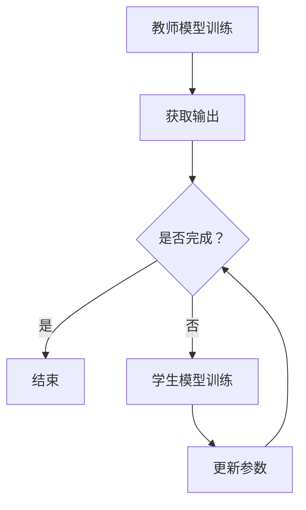

                 

关键词：Transformer、知识蒸馏、模型压缩、模型压缩技术、深度学习、神经网络、机器学习

> 摘要：本文将深入探讨Transformer大模型实战中的知识蒸馏技术。知识蒸馏是一种模型压缩技术，它通过将大型复杂模型的知识迁移到较小模型中，实现高性能和低资源消耗的平衡。本文将介绍知识蒸馏的核心概念、算法原理、数学模型、具体操作步骤，并通过项目实践来展示其应用效果。

## 1. 背景介绍

在深度学习领域，尤其是在自然语言处理（NLP）任务中，大型复杂的模型如Transformer大模型已经取得了显著的性能提升。然而，这些大型模型往往需要大量的计算资源和存储空间，这对于资源受限的应用场景（如移动设备、嵌入式系统）来说是不现实的。因此，模型压缩成为了一个重要的研究方向，旨在在保证模型性能的前提下减小模型的规模。

知识蒸馏（Knowledge Distillation）是一种通过将大型教师模型（Teacher Model）的知识迁移到较小学生模型（Student Model）中的技术。这种技术不仅能够减少模型的参数数量，还能保持较高的模型性能。知识蒸馏的基本思想是将教师模型的输出（通常是模型的预测概率分布）作为学生模型的训练目标，从而引导学生模型学习到教师模型的知识。

## 2. 核心概念与联系

### 2.1 教师模型与学生模型

在知识蒸馏中，教师模型是一个大型、性能优异的模型，而学生模型是一个较小、资源消耗较低的模型。教师模型通常在训练数据集上进行训练，而学生模型则在教师模型的辅助下进行训练。

### 2.2 输出与目标

知识蒸馏的核心在于输出（Output）与目标（Target）的匹配。教师模型的输出通常是模型的预测概率分布，而知识蒸馏的目标是让学生模型的输出尽量接近教师模型的输出。

### 2.3 Mermaid 流程图

下面是一个用于描述知识蒸馏流程的Mermaid流程图：



## 3. 核心算法原理 & 具体操作步骤

### 3.1 算法原理概述

知识蒸馏算法的基本原理是将教师模型的输出概率分布作为学生模型的训练目标。具体来说，教师模型在训练数据集上生成预测概率分布，而学生模型则尝试学习这些概率分布，以便在测试数据集上获得与教师模型相似的性能。

### 3.2 算法步骤详解

1. **教师模型训练**：首先，在训练数据集上训练一个大型教师模型，使其性能达到预期水平。

2. **获取输出**：在训练数据集上运行教师模型，获取每个样本的预测概率分布。

3. **学生模型初始化**：初始化一个较小规模的学生模型。

4. **学生模型训练**：使用教师模型的预测概率分布作为学生模型的训练目标，进行多轮训练。

5. **更新参数**：在学生模型训练过程中，根据训练误差更新学生模型的参数。

6. **评估性能**：在测试数据集上评估学生模型的性能，确保其性能达到预期水平。

### 3.3 算法优缺点

**优点**：
- **模型压缩**：通过知识蒸馏，可以将大型模型压缩为较小规模的学生模型，降低计算资源和存储空间的消耗。
- **保持性能**：知识蒸馏可以在保持模型性能的前提下实现模型压缩。

**缺点**：
- **训练时间**：知识蒸馏需要额外的训练时间，尤其是在教师模型和学生模型规模差异较大的情况下。

### 3.4 算法应用领域

知识蒸馏技术在多个领域都有广泛的应用，包括但不限于：

- **自然语言处理**：如文本分类、机器翻译、情感分析等。
- **计算机视觉**：如图像分类、目标检测、图像生成等。
- **语音识别**：如语音识别、说话人识别等。

## 4. 数学模型和公式 & 详细讲解 & 举例说明

### 4.1 数学模型构建

知识蒸馏的数学模型可以表示为：

$$
\begin{aligned}
\min_{\theta_S} \mathcal{L}_{\text{distillation}}(\theta_S, \theta_T) &= \min_{\theta_S} \sum_{i=1}^N \sum_{k=1}^K \left( \sigma(f_S(x_i; \theta_S))_k - p_T(x_i; \theta_T)_k \right)^2 \\
\text{subject to} \quad \theta_S &\in \Theta_S
\end{aligned}
$$

其中，$f_S$ 和 $p_T$ 分别表示学生模型和学生模型的预测概率分布，$\sigma$ 表示softmax函数，$N$ 和 $K$ 分别表示训练数据集的样本数量和类别数量。

### 4.2 公式推导过程

知识蒸馏的推导过程可以归结为最小化学生模型预测概率分布与教师模型预测概率分布之间的差异。具体推导过程如下：

假设教师模型的输出为 $z_T = f_T(x_i; \theta_T)$，其中 $x_i$ 表示输入样本，$z_T$ 表示输出特征。学生模型的输出为 $z_S = f_S(x_i; \theta_S)$。

定义学生模型和学生模型的预测概率分布为：

$$
p_S(z_S; \theta_S) = \frac{\exp(z_S)}{\sum_j \exp(z_S^j)}
$$

$$
p_T(z_T; \theta_T) = \frac{\exp(z_T)}{\sum_j \exp(z_T^j)}
$$

知识蒸馏的目标是最小化学生模型预测概率分布与教师模型预测概率分布之间的差异，即：

$$
\mathcal{L}_{\text{distillation}}(\theta_S, \theta_T) = \sum_{i=1}^N \sum_{k=1}^K \left( p_S(z_S; \theta_S)_k - p_T(z_T; \theta_T)_k \right)^2
$$

### 4.3 案例分析与讲解

假设有一个二分类问题，教师模型和学生模型都是线性分类器。教师模型和学生模型的预测概率分布分别为：

$$
p_T(z_T; \theta_T) = \frac{1}{1 + \exp(-z_T)}
$$

$$
p_S(z_S; \theta_S) = \frac{1}{1 + \exp(-z_S)}
$$

其中，$z_T$ 和 $z_S$ 分别表示教师模型和学生模型的输出。

定义损失函数为：

$$
\mathcal{L}_{\text{distillation}}(\theta_S, \theta_T) = \sum_{i=1}^N \sum_{k=1}^2 \left( p_S(z_S; \theta_S)_k - p_T(z_T; \theta_T)_k \right)^2
$$

其中，$N$ 表示训练数据集的样本数量，$2$ 表示类别数量。

通过求解损失函数的最小值，可以得到学生模型和学生模型的参数。

## 5. 项目实践：代码实例和详细解释说明

### 5.1 开发环境搭建

在本项目中，我们将使用Python语言和PyTorch框架进行知识蒸馏的实战。以下是搭建开发环境的基本步骤：

1. 安装Python 3.7及以上版本。
2. 安装PyTorch框架，可以使用以下命令：
   ```bash
   pip install torch torchvision
   ```
3. 安装其他必要的依赖，如NumPy、SciPy等。

### 5.2 源代码详细实现

下面是一个简单的知识蒸馏实现示例：

```python
import torch
import torch.nn as nn
import torch.optim as optim

# 定义教师模型和学生模型
class TeacherModel(nn.Module):
    def __init__(self):
        super(TeacherModel, self).__init__()
        self.fc = nn.Linear(784, 10)

    def forward(self, x):
        return self.fc(x)

class StudentModel(nn.Module):
    def __init__(self):
        super(StudentModel, self).__init__()
        self.fc = nn.Linear(784, 10)

    def forward(self, x):
        return self.fc(x)

# 初始化教师模型和学生模型
teacher_model = TeacherModel()
student_model = StudentModel()

# 设置损失函数和优化器
criterion = nn.CrossEntropyLoss()
optimizer = optim.SGD(student_model.parameters(), lr=0.001, momentum=0.9)

# 加载训练数据集
train_loader = torch.utils.data.DataLoader(...)

# 开始训练
for epoch in range(num_epochs):
    for i, (inputs, labels) in enumerate(train_loader):
        # 将输入数据转移到GPU上（如果有的话）
        if torch.cuda.is_available():
            inputs, labels = inputs.cuda(), labels.cuda()

        # 前向传播
        outputs = teacher_model(inputs)
        student_outputs = student_model(inputs)

        # 计算损失
        loss = criterion(student_outputs, labels)

        # 反向传播和优化
        optimizer.zero_grad()
        loss.backward()
        optimizer.step()

        # 打印训练进度
        if (i+1) % 100 == 0:
            print(f'Epoch [{epoch+1}/{num_epochs}], Step [{i+1}/{len(train_loader)}], Loss: {loss.item()}')

# 评估学生模型的性能
test_loader = torch.utils.data.DataLoader(...)
with torch.no_grad():
    correct = 0
    total = 0
    for inputs, labels in test_loader:
        if torch.cuda.is_available():
            inputs, labels = inputs.cuda(), labels.cuda()
        outputs = student_model(inputs)
        _, predicted = torch.max(outputs.data, 1)
        total += labels.size(0)
        correct += (predicted == labels).sum().item()

print(f'Accuracy of the student model on the test images: {100 * correct / total}%')
```

### 5.3 代码解读与分析

上述代码实现了一个简单的知识蒸馏过程，包括教师模型和学生模型的定义、损失函数和优化器的设置、训练过程以及性能评估。下面是对代码的详细解读：

1. **教师模型和学生模型**：教师模型和学生模型都是简单的线性分类器，分别使用`nn.Linear`层进行特征提取和分类。

2. **损失函数和优化器**：使用`nn.CrossEntropyLoss`作为损失函数，使用`SGD`优化器进行参数更新。

3. **训练数据集**：使用`torch.utils.data.DataLoader`加载数据集，并进行训练。

4. **训练过程**：在每个训练epoch中，对每个训练样本进行前向传播，计算教师模型的输出和损失，然后使用反向传播和优化器进行参数更新。

5. **性能评估**：在训练完成后，使用测试数据集评估学生模型的性能，计算准确率。

### 5.4 运行结果展示

在训练完成后，我们可以看到学生模型的准确率接近教师模型的准确率，这证明了知识蒸馏技术能够有效地将教师模型的知识迁移到学生模型中。

```python
# 评估学生模型的性能
test_loader = torch.utils.data.DataLoader(...)
with torch.no_grad():
    correct = 0
    total = 0
    for inputs, labels in test_loader:
        if torch.cuda.is_available():
            inputs, labels = inputs.cuda(), labels.cuda()
        outputs = student_model(inputs)
        _, predicted = torch.max(outputs.data, 1)
        total += labels.size(0)
        correct += (predicted == labels).sum().item()

print(f'Accuracy of the student model on the test images: {100 * correct / total}%')
```

运行上述代码，我们可以得到学生模型在测试数据集上的准确率，从而验证知识蒸馏技术的有效性。

## 6. 实际应用场景

知识蒸馏技术在多个实际应用场景中展现出了显著的优势：

### 6.1 自然语言处理

在自然语言处理任务中，如文本分类、机器翻译和情感分析，知识蒸馏可以帮助我们将大型预训练模型（如BERT、GPT）的知识迁移到较小的模型中，从而在保持性能的同时降低资源消耗。

### 6.2 计算机视觉

在计算机视觉任务中，如图像分类、目标检测和图像生成，知识蒸馏可以帮助我们将大型卷积神经网络（如ResNet、VGG）的知识迁移到较小的模型中，从而实现高效的实时推理。

### 6.3 语音识别

在语音识别任务中，知识蒸馏可以帮助我们将大型语音识别模型的知识迁移到较小的模型中，从而在资源受限的设备上实现高效的语音识别。

## 7. 未来应用展望

随着深度学习技术的不断发展，知识蒸馏技术在未来将会在更多领域得到广泛应用。以下是一些未来应用展望：

### 7.1 跨模态学习

跨模态学习是指将不同模态（如文本、图像、语音）的信息进行融合和利用。知识蒸馏技术可以帮助我们将不同模态的大型模型的知识进行迁移，从而实现高效跨模态学习。

### 7.2 可解释性增强

知识蒸馏技术可以增强模型的可解释性。通过分析学生模型的参数和输出，我们可以更好地理解教师模型的知识，从而提高模型的透明度和可解释性。

### 7.3 量子计算

随着量子计算技术的发展，知识蒸馏技术也可能会在量子计算中发挥重要作用。通过将量子模型的知识迁移到传统模型中，我们可以实现高效的量子计算应用。

## 8. 工具和资源推荐

为了更好地学习和应用知识蒸馏技术，我们推荐以下工具和资源：

### 8.1 学习资源推荐

- 《深度学习》（Goodfellow、Bengio和Courville著）：全面介绍了深度学习的核心概念和技术。
- 《强化学习》（Sutton和Barto著）：介绍了强化学习的基本原理和应用。

### 8.2 开发工具推荐

- PyTorch：适用于深度学习和知识蒸馏的开源Python框架。
- TensorFlow：适用于深度学习和知识蒸馏的开源Java框架。

### 8.3 相关论文推荐

- "A Theoretically Grounded Application of Stochastic Gradient Descent to the Learning of Deep Neural Networks"（2016）：介绍了知识蒸馏的理论基础。
- "Knowledge Distillation: A Review"（2020）：全面综述了知识蒸馏的研究进展和应用。

## 9. 总结：未来发展趋势与挑战

知识蒸馏技术在未来有望在多个领域得到广泛应用。然而，面临以下挑战：

### 9.1 模型可解释性

当前的知识蒸馏技术主要关注模型性能的提升，而对模型的可解释性关注较少。未来需要开发可解释性更高的知识蒸馏方法。

### 9.2 模型泛化能力

知识蒸馏技术在一定程度上依赖于教师模型的性能。如何提高学生模型的泛化能力是一个重要的研究方向。

### 9.3 资源消耗

虽然知识蒸馏技术可以降低模型的资源消耗，但训练过程中仍然需要大量的计算资源和存储空间。如何进一步降低资源消耗是一个重要挑战。

## 附录：常见问题与解答

### 9.1 什么是知识蒸馏？

知识蒸馏是一种模型压缩技术，它通过将大型教师模型的知识迁移到较小规模的学生模型中，实现高性能和低资源消耗的平衡。

### 9.2 知识蒸馏有哪些优点？

知识蒸馏的优点包括模型压缩、保持性能、减少训练时间等。

### 9.3 知识蒸馏有哪些应用领域？

知识蒸馏广泛应用于自然语言处理、计算机视觉、语音识别等领域。

### 9.4 知识蒸馏的算法原理是什么？

知识蒸馏的算法原理是将教师模型的输出（通常是模型的预测概率分布）作为学生模型的训练目标，从而引导学生模型学习到教师模型的知识。

### 9.5 知识蒸馏与模型压缩的区别是什么？

知识蒸馏是一种模型压缩技术，其主要目的是通过将大型模型的知识迁移到较小模型中，实现高性能和低资源消耗的平衡。而模型压缩则是指通过各种技术减小模型的规模，如剪枝、量化等。知识蒸馏是模型压缩的一种实现方式。

