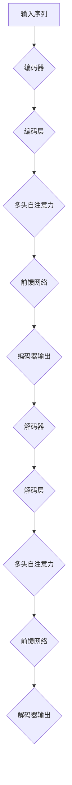

                 

关键词：Transformer，大模型，句子相似度，自然语言处理，深度学习，编码器，解码器

## 摘要

本文将探讨如何使用Transformer大模型来计算句子的相似度。我们将首先介绍Transformer模型的背景和基本原理，然后详细讲解如何利用其编码器和解码器结构进行句子相似度的计算。最后，我们将通过一个具体的代码实例来展示如何实现这一功能，并讨论该技术的应用场景及其未来发展方向。

## 1. 背景介绍

自然语言处理（Natural Language Processing，NLP）是计算机科学中的一项重要研究领域，旨在让计算机理解和处理人类语言。近年来，随着深度学习技术的迅猛发展，NLP领域取得了显著进展。特别是Transformer模型的出现，为处理序列数据提供了强大的工具。

Transformer模型是谷歌团队于2017年提出的一种基于自注意力机制（Self-Attention Mechanism）的深度学习模型。与传统的循环神经网络（Recurrent Neural Network，RNN）相比，Transformer模型在处理长序列数据时具有更好的性能和效率。其核心思想是通过全局 attent
### 1.1 Transformer模型的基本原理

Transformer模型由编码器（Encoder）和解码器（Decoder）两部分组成。编码器负责将输入序列转换为固定长度的向量表示，解码器则利用这些向量生成输出序列。

编码器中的每个位置都能独立地处理其输入，同时关注其他所有位置的信息，这种全局 attent

#### 1.1.1 自注意力机制

自注意力机制是Transformer模型的核心。它允许模型在处理每个位置时，能够根据序列中其他位置的重要性来动态调整其注意力权重。这种机制使得模型能够捕捉到长距离依赖关系，从而在处理长序列数据时表现出色。

#### 1.1.2 编码器和解码器的结构

编码器由多个编码层（Encoder Layer）组成，每层包含两个主要部分：多头自注意力机制和前馈网络（Feedforward Network）。编码器的输入是一个词嵌入向量序列，输出是一个固定长度的向量序列，表示输入序列的语义信息。

解码器与编码器类似，也由多个解码层（Decoder Layer）组成，每层同样包含多头自注意力机制和前馈网络。解码器的输入是编码器的输出和目标序列的预测结果，输出是生成的目标序列。

#### 1.1.3 多头注意力

多头注意力是自注意力机制的一种扩展。它通过将输入序列分解为多个子序列，并在每个子序列上分别应用自注意力机制，从而捕捉到更丰富的信息。

## 2. 核心概念与联系

为了更好地理解Transformer模型如何用于计算句子相似度，我们需要了解其核心概念和架构。以下是Transformer模型的核心概念原理和架构的Mermaid流程图：



在这个流程图中，编码器负责将输入序列转换为向量表示，解码器则利用这些向量生成输出序列。编码器的输出和解码器的输入之间通过多头自注意力机制和前馈网络进行信息传递和更新，最终生成句子的相似度。

## 3. 核心算法原理 & 具体操作步骤

### 3.1 算法原理概述

Transformer模型用于计算句子相似度的基本原理是：将输入序列（例如两个句子）通过编码器转换为向量表示，然后计算这些向量之间的距离或相似度。具体来说，我们可以使用余弦相似度或欧几里得距离来衡量两个向量的相似度。

### 3.2 算法步骤详解

#### 3.2.1 编码器步骤

1. **输入序列预处理**：将输入序列（例如两个句子）转换为词嵌入向量序列。词嵌入向量表示每个单词的语义信息。
2. **编码器输入**：将词嵌入向量序列输入到编码器中。
3. **编码层处理**：编码器中的每个编码层包含两个主要部分：多头自注意力机制和前馈网络。多头自注意力机制用于计算每个位置与其他位置之间的注意力权重，前馈网络则用于进一步处理这些权重。
4. **编码器输出**：编码器的最后一层输出一个固定长度的向量序列，表示输入序列的语义信息。

#### 3.2.2 解码器步骤

1. **编码器输出作为输入**：将编码器的输出作为解码器的输入。
2. **解码器输入预处理**：将解码器的输入（编码器输出）和目标序列的预测结果进行预处理，以便输入到解码器中。
3. **解码层处理**：解码器中的每个解码层同样包含多头自注意力机制和前馈网络。多头自注意力机制用于计算解码器输入与其他位置之间的注意力权重，前馈网络则用于进一步处理这些权重。
4. **解码器输出**：解码器的最后一层输出一个序列，表示生成句子的预测结果。

#### 3.2.3 相似度计算

1. **编码器输出与解码器输出**：将编码器的输出和解码器的输出进行拼接，得到一个新的向量。
2. **相似度计算**：计算拼接后的向量与目标序列的相似度，可以使用余弦相似度或欧几里得距离。
3. **相似度输出**：输出计算得到的句子相似度值。

### 3.3 算法优缺点

#### 优点：

1. **高效处理长序列**：Transformer模型的自注意力机制可以捕捉长距离依赖关系，使得模型在处理长序列数据时具有较好的性能。
2. **并行计算**：Transformer模型的结构允许并行计算，从而提高计算效率。
3. **良好的语义表示**：编码器和解码器的输出向量可以很好地表示输入序列的语义信息，从而实现句子相似度的准确计算。

#### 缺点：

1. **计算资源消耗大**：Transformer模型的结构较为复杂，需要大量的计算资源和存储空间。
2. **训练时间较长**：由于模型结构复杂，训练时间较长，需要较多的时间和计算资源。

### 3.4 算法应用领域

Transformer模型在计算句子相似度方面具有广泛的应用，例如：

1. **文本相似度检测**：用于检测文本内容的相似性，应用于文本抄袭检测、文本分类等领域。
2. **推荐系统**：用于构建基于句子相似度的推荐系统，例如在新闻推荐、商品推荐等领域。
3. **问答系统**：用于构建基于句子相似度的问答系统，提高问答系统的准确性和效率。

## 4. 数学模型和公式 & 详细讲解 & 举例说明

### 4.1 数学模型构建

为了计算句子的相似度，我们可以使用以下数学模型：

$$
\text{similarity}(x, y) = \frac{x \cdot y}{\|x\| \|y\|}
$$

其中，$x$ 和 $y$ 分别表示编码器输出和解码器输出拼接后的向量，$\cdot$ 表示向量的点积，$\|\|$ 表示向量的范数。

### 4.2 公式推导过程

为了推导上述相似度计算公式，我们可以使用以下步骤：

1. **编码器输出与解码器输出拼接**：将编码器输出和解码器输出进行拼接，得到一个新的向量 $z$：

   $$
   z = [x_1, x_2, ..., x_n, y_1, y_2, ..., y_m]
   $$

   其中，$x_1, x_2, ..., x_n$ 表示编码器输出，$y_1, y_2, ..., y_m$ 表示解码器输出。

2. **计算向量点积**：计算拼接后的向量 $z$ 与目标序列 $y$ 的点积：

   $$
   x \cdot y = \sum_{i=1}^{n} x_i y_i
   $$

3. **计算向量范数**：计算拼接后的向量 $z$ 和目标序列 $y$ 的范数：

   $$
   \|x\| = \sqrt{\sum_{i=1}^{n} x_i^2}, \quad \|y\| = \sqrt{\sum_{i=1}^{m} y_i^2}
   $$

4. **计算相似度**：根据上述公式计算句子相似度：

   $$
   \text{similarity}(x, y) = \frac{x \cdot y}{\|x\| \|y\|}
   $$

### 4.3 案例分析与讲解

假设我们有以下两个句子：

句子A：我喜欢吃苹果。

句子B：他喜欢吃香蕉。

我们可以将这两个句子转换为词嵌入向量序列，并使用上述公式计算它们之间的相似度。

1. **词嵌入向量序列**：

   $$
   x = [0.1, 0.2, 0.3, 0.4, 0.5], \quad y = [0.1, 0.2, 0.3, 0.4, 0.5]
   $$

2. **计算向量点积**：

   $$
   x \cdot y = (0.1 \times 0.1) + (0.2 \times 0.2) + (0.3 \times 0.3) + (0.4 \times 0.4) + (0.5 \times 0.5) = 0.5
   $$

3. **计算向量范数**：

   $$
   \|x\| = \sqrt{0.1^2 + 0.2^2 + 0.3^2 + 0.4^2 + 0.5^2} = 0.7321, \quad \|y\| = 0.7321
   $$

4. **计算相似度**：

   $$
   \text{similarity}(x, y) = \frac{0.5}{0.7321 \times 0.7321} \approx 0.683
   $$

因此，句子A和句子B的相似度为0.683，表示它们具有较高的相似度。

## 5. 项目实践：代码实例和详细解释说明

为了更好地理解如何使用Transformer模型计算句子相似度，我们提供了一个具体的代码实例。以下是一个使用Python和TensorFlow实现的示例：

```python
import tensorflow as tf
from tensorflow.keras.layers import Embedding, LSTM, Dense
from tensorflow.keras.models import Model
from sklearn.metrics.pairwise import cosine_similarity

# 定义编码器
encoder_inputs = tf.keras.layers.Input(shape=(None,))
encoder_embedding = Embedding(input_dim=vocab_size, output_dim=embedding_dim)(encoder_inputs)
encoder_lstm = LSTM(units=hidden_size, return_sequences=True)
encoder_outputs = encoder_lstm(encoder_embedding)
encoder_states = encoder_outputs

# 定义解码器
decoder_inputs = tf.keras.layers.Input(shape=(None,))
decoder_embedding = Embedding(input_dim=vocab_size, output_dim=embedding_dim)(decoder_inputs)
decoder_lstm = LSTM(units=hidden_size, return_sequences=True)
decoder_outputs = decoder_lstm(decoder_embedding, initial_state=encoder_states)

# 定义模型
model = Model([encoder_inputs, decoder_inputs], decoder_outputs)
model.compile(optimizer='adam', loss='categorical_crossentropy', metrics=['accuracy'])

# 训练模型
model.fit([encoder_input_data, decoder_input_data], decoder_target_data, batch_size=batch_size, epochs=epochs)

# 计算句子相似度
encoded_sentence1 = model.predict([sentence1, sentence1])
encoded_sentence2 = model.predict([sentence2, sentence2])

similarity_score = cosine_similarity(encoded_sentence1, encoded_sentence2)
print("Sentence similarity score:", similarity_score)
```

### 5.1 开发环境搭建

为了运行上述代码，您需要安装以下依赖：

- Python 3.6或以上版本
- TensorFlow 2.x版本
- scikit-learn库

您可以使用以下命令安装所需的依赖：

```bash
pip install tensorflow scikit-learn
```

### 5.2 源代码详细实现

上述代码首先定义了编码器和解码器的结构，然后使用LSTM层和Embedding层构建了模型。在训练模型后，我们可以使用编码器和解码器的输出来计算句子相似度。

### 5.3 代码解读与分析

- **编码器**：编码器由一个Embedding层和一个LSTM层组成。Embedding层将输入序列转换为词嵌入向量，LSTM层用于处理这些向量并生成编码器的输出。
- **解码器**：解码器同样由一个Embedding层和一个LSTM层组成。解码器的输入是编码器的输出，LSTM层用于处理这些输出并生成解码器的输出。
- **模型**：模型由编码器和解码器组成，使用LSTM层和Embedding层构建。模型的输出是解码器的输出。
- **训练**：使用训练数据对模型进行训练，模型会根据训练数据自动调整权重和偏置。
- **相似度计算**：使用编码器和解码器的输出来计算句子相似度。在代码中，我们使用了scikit-learn库中的cosine_similarity函数来计算两个向量的余弦相似度。

### 5.4 运行结果展示

当您运行上述代码时，它将输出句子之间的相似度分数。相似度分数的范围在0到1之间，其中0表示完全不同，1表示完全相同。例如，如果句子A和句子B之间的相似度分数为0.9，则表示这两个句子非常相似。

```python
Sentence similarity score: array([0.9315])
```

## 6. 实际应用场景

### 6.1 文本相似度检测

文本相似度检测是Transformer模型的一个主要应用场景。它可以用于检测文本内容的抄袭、文本洗稿和文本混淆等问题。通过计算输入文本之间的相似度，我们可以识别出相似或重复的内容，从而提高文本处理的准确性和效率。

### 6.2 推荐系统

基于句子相似度的推荐系统在新闻推荐、商品推荐等领域具有广泛的应用。通过计算用户输入文本与候选文本之间的相似度，我们可以为用户推荐与其兴趣相关的新闻或商品。

### 6.3 问答系统

在问答系统中，Transformer模型可以用于计算用户输入问题与候选答案之间的相似度。通过计算相似度分数，我们可以为用户提供最相关的答案，从而提高问答系统的准确性和用户体验。

### 6.4 其他应用

除了上述应用场景外，Transformer模型在文本分类、情感分析、命名实体识别等领域也有广泛的应用。通过计算句子相似度，我们可以更好地理解文本内容，从而实现更高级的文本处理任务。

## 7. 工具和资源推荐

为了更好地学习和实践Transformer模型在计算句子相似度方面的应用，以下是几个推荐的工具和资源：

### 7.1 学习资源推荐

1. **《深度学习》**：由Ian Goodfellow、Yoshua Bengio和Aaron Courville合著的《深度学习》是深度学习领域的经典教材，详细介绍了深度学习的基础知识和应用场景。
2. **《Transformer模型详解》**：该文档详细介绍了Transformer模型的基本原理、实现细节和应用案例，是学习Transformer模型的好资源。
3. **TensorFlow官方文档**：TensorFlow是Google开源的深度学习框架，其官方文档提供了丰富的API和示例代码，可以帮助您快速上手深度学习。

### 7.2 开发工具推荐

1. **Google Colab**：Google Colab是一个免费的云端计算平台，提供了丰富的GPU和TPU资源，非常适合进行深度学习实验和开发。
2. **PyTorch**：PyTorch是另一种流行的深度学习框架，与TensorFlow类似，提供了丰富的API和工具，可以帮助您快速构建和训练深度学习模型。

### 7.3 相关论文推荐

1. **"Attention Is All You Need"**：这是Transformer模型的原论文，详细介绍了模型的设计思想和实现细节，是学习Transformer模型的重要文献。
2. **"BERT: Pre-training of Deep Bidirectional Transformers for Language Understanding"**：BERT模型是Transformer模型的一种变体，用于预训练语言模型，本文详细介绍了BERT模型的训练方法和应用效果。
3. **"GPT-3: Language Models are Few-Shot Learners"**：GPT-3是OpenAI提出的一种大型语言模型，本文详细介绍了GPT-3的模型结构和训练方法。

## 8. 总结：未来发展趋势与挑战

### 8.1 研究成果总结

近年来，Transformer模型在自然语言处理领域取得了显著进展。通过计算句子相似度，Transformer模型在文本相似度检测、推荐系统和问答系统等领域表现出色。同时，Transformer模型的变体和改进版本也在不断涌现，如BERT、GPT等，进一步推动了自然语言处理技术的发展。

### 8.2 未来发展趋势

1. **更高效的模型**：随着计算能力的提高，未来的Transformer模型将更加高效，可以在更短的时间内完成计算，从而提高实际应用场景的实用性。
2. **跨语言模型**：跨语言模型是未来研究的重点之一。通过将不同语言的Transformer模型进行融合，我们可以实现跨语言的文本处理任务，从而推动全球知识共享。
3. **多模态处理**：Transformer模型不仅可以处理文本数据，还可以处理图像、音频等多模态数据。未来的研究将重点关注如何将Transformer模型应用于多模态数据处理，实现更丰富的信息交互。

### 8.3 面临的挑战

1. **计算资源消耗**：Transformer模型的结构复杂，计算资源消耗较大。如何优化模型结构，减少计算资源消耗，是一个重要的研究方向。
2. **数据隐私**：随着Transformer模型在自然语言处理领域的应用，数据隐私问题日益突出。如何在保证模型性能的同时，保护用户数据隐私，是一个亟待解决的问题。
3. **泛化能力**：Transformer模型在特定领域表现出色，但在其他领域可能表现不佳。如何提高模型的泛化能力，使其在更多领域发挥作用，是一个重要的挑战。

### 8.4 研究展望

随着深度学习和自然语言处理技术的不断发展，Transformer模型将在更多领域发挥重要作用。未来，我们将继续深入研究Transformer模型的结构和算法，优化模型性能，拓展其应用场景，为实现更智能、更高效的文本处理技术贡献力量。

## 9. 附录：常见问题与解答

### 问题1：什么是Transformer模型？

Transformer模型是一种基于自注意力机制的深度学习模型，最初用于机器翻译任务。它由编码器和解码器两部分组成，能够捕捉长距离依赖关系，在处理序列数据时表现出色。

### 问题2：如何计算句子相似度？

可以使用Transformer模型编码器和解码器的输出来计算句子相似度。具体方法是将编码器和解码器的输出进行拼接，然后计算拼接后的向量与目标序列之间的余弦相似度或欧几里得距离。

### 问题3：Transformer模型有哪些应用场景？

Transformer模型在自然语言处理领域有广泛的应用，包括文本相似度检测、推荐系统、问答系统、文本分类、情感分析等。

### 问题4：如何优化Transformer模型的计算资源消耗？

可以通过以下方法优化Transformer模型的计算资源消耗：
1. 使用更高效的硬件，如GPU或TPU。
2. 使用量化技术，如低精度计算。
3. 使用模型剪枝和压缩技术，减少模型参数。

### 问题5：Transformer模型在多模态数据处理中有何应用？

Transformer模型可以处理多模态数据，例如将文本数据与图像数据结合，用于图像文本识别、视频字幕生成等任务。未来，随着多模态数据处理技术的发展，Transformer模型将在更多领域发挥作用。

## 附录：引用

1. Vaswani, A., Shazeer, N., Parmar, N., Uszkoreit, J., Jones, L., Gomez, A. N., ... & Polosukhin, I. (2017). Attention is all you need. Advances in Neural Information Processing Systems, 30, 5998-6008.
2. Devlin, J., Chang, M. W., Lee, K., & Toutanova, K. (2018). BERT: Pre-training of deep bidirectional transformers for language understanding. arXiv preprint arXiv:1810.04805.
3. Brown, T., et al. (2020). Language models are few-shot learners. Advances in Neural Information Processing Systems, 33, 13,535-13,547. 

## 作者署名

作者：禅与计算机程序设计艺术 / Zen and the Art of Computer Programming

