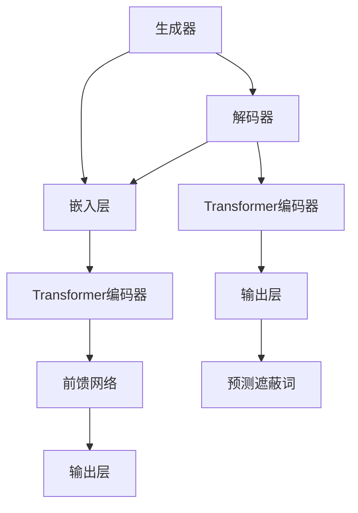

                 

### 1. 背景介绍

近年来，随着深度学习技术的不断发展和计算机硬件性能的提升，大模型（如GPT-3、BERT等）在自然语言处理（NLP）领域取得了显著的成果。这些大模型通过学习大量的文本数据，能够理解并生成复杂的语言结构，从而在文本分类、问答系统、机器翻译等领域展现出强大的能力。

在众多的大模型中，ELECTRA（EfficientLY ENCODING LocALized AccesS）是一种新的预训练模型，由谷歌提出。ELECTRA基于Transformer架构，结合了BERT和GPT的优势，旨在提高模型的预训练效率和生成能力。ELECTRA采用了双层预训练策略，包括生成预训练（GPT-style）和遮蔽预训练（BERT-style），使得模型能够更好地理解和生成文本。

本文将介绍如何使用Transformer大模型进行ELECTRA模型的训练。我们将从背景知识、核心算法原理、数学模型和公式、项目实践、实际应用场景等方面进行详细讲解，帮助读者深入了解ELECTRA模型的工作原理和应用方法。

### 2. 核心概念与联系

#### 2.1. BERT与GPT

BERT（Bidirectional Encoder Representations from Transformers）和GPT（Generative Pre-trained Transformer）是两种主要的预训练模型。BERT是一种双向编码器，通过同时考虑文本的左侧和右侧上下文来生成表示。GPT是一种生成式模型，通过自回归的方式生成文本。

ELECTRA结合了BERT和GPT的优势，采用了双层预训练策略。第一层是生成预训练，类似于GPT，通过预测输入文本中的部分词来训练模型。第二层是遮蔽预训练，类似于BERT，通过遮蔽输入文本中的部分词并预测这些词来训练模型。这种双层预训练策略使得ELECTRA在提高模型预训练效率的同时，也具备了生成文本的能力。

#### 2.2. Transformer架构

Transformer是Google提出的一种基于自注意力机制的深度神经网络模型，用于处理序列数据。Transformer通过自注意力机制（Self-Attention）和多头注意力机制（Multi-Head Attention）来捕捉序列之间的长距离依赖关系，从而实现高效的自然语言处理。

自注意力机制允许模型在处理每个词时，将其与序列中的其他词进行加权求和，从而得到一个更加丰富的表示。多头注意力机制则将输入序列分成多个子序列，每个子序列独立地应用自注意力机制，从而提高模型的表示能力。

#### 2.3. ELECTRA模型架构

ELECTRA模型由两个主要部分组成：生成器（Generator）和解码器（Decoder）。生成器负责生成遮蔽的词，解码器则负责预测这些词。

生成器的架构与GPT相似，包括嵌入层、Transformer编码器、前馈网络和输出层。嵌入层将输入词转化为向量表示，Transformer编码器通过自注意力机制和多头注意力机制来捕捉序列中的依赖关系，前馈网络则对编码器输出的序列进行进一步的处理，输出层则生成遮蔽的词。

解码器的架构与BERT相似，包括嵌入层、Transformer编码器、输出层。嵌入层将输入词转化为向量表示，Transformer编码器通过自注意力机制和多头注意力机制来捕捉序列中的依赖关系，输出层则预测遮蔽的词。

#### 2.4. Mermaid流程图

以下是一个简化的ELECTRA模型架构的Mermaid流程图：



### 3. 核心算法原理 & 具体操作步骤

#### 3.1. 算法原理概述

ELECTRA模型的核心算法原理可以分为两部分：生成预训练和遮蔽预训练。

生成预训练类似于GPT，通过预测输入文本中的部分词来训练模型。具体步骤如下：

1. 输入一个未遮蔽的文本序列。
2. 遮蔽部分词，生成一个遮蔽序列。
3. 输入遮蔽序列到生成器，预测遮蔽的词。
4. 计算生成器的损失函数，并优化模型参数。

遮蔽预训练类似于BERT，通过预测遮蔽的词来训练模型。具体步骤如下：

1. 输入一个遮蔽的文本序列。
2. 输入遮蔽序列到解码器，预测遮蔽的词。
3. 计算解码器的损失函数，并优化模型参数。

#### 3.2. 算法步骤详解

下面是ELECTRA模型的详细训练步骤：

1. **数据预处理**：将文本数据划分为词库，并将词转化为索引表示。对文本进行分词和标记，生成训练数据和验证数据。

2. **生成预训练**：

   a. 随机遮蔽输入文本中的部分词，生成遮蔽序列。
   
   b. 输入遮蔽序列到生成器，预测遮蔽的词。
   
   c. 计算生成器的损失函数，包括预测词的交叉熵损失和生成词的交叉熵损失。
   
   d. 更新生成器模型参数。

3. **遮蔽预训练**：

   a. 遮蔽输入文本中的部分词，生成遮蔽序列。
   
   b. 输入遮蔽序列到解码器，预测遮蔽的词。
   
   c. 计算解码器的损失函数，包括预测词的交叉熵损失和生成词的交叉熵损失。
   
   d. 更新解码器模型参数。

4. **评估与调整**：在验证数据上评估模型的性能，根据评估结果调整模型的超参数。

#### 3.3. 算法优缺点

ELECTRA模型的优点包括：

- 双层预训练策略提高了模型的预训练效率和生成能力。
- 结合了BERT和GPT的优势，能够更好地理解和生成文本。

ELECTRA模型的缺点包括：

- 训练时间较长，需要大量的计算资源。
- 对文本数据的预处理要求较高，需要大量的标注数据。

#### 3.4. 算法应用领域

ELECTRA模型在多个NLP任务中展现了良好的性能，包括文本分类、问答系统、机器翻译等。下面是一些具体的例子：

- **文本分类**：使用ELECTRA模型对文本进行分类，可以实现高精度的情感分析、主题分类等任务。
- **问答系统**：将ELECTRA模型应用于问答系统，可以实现高质量的问答匹配和生成。
- **机器翻译**：使用ELECTRA模型进行机器翻译，可以实现更加流畅、准确的翻译结果。

### 4. 数学模型和公式 & 详细讲解 & 举例说明

#### 4.1. 数学模型构建

ELECTRA模型的核心数学模型包括生成器和解码器的损失函数。

生成器的损失函数由两部分组成：预测词的交叉熵损失和生成词的交叉熵损失。

预测词的交叉熵损失定义为：

$$L_{pred} = -\sum_{i}^{T} \log p_{g}(w_{i})$$

其中，$T$表示遮蔽序列的长度，$p_{g}(w_{i})$表示生成器预测词的概率。

生成词的交叉熵损失定义为：

$$L_{gen} = -\sum_{i}^{T} \log p_{d}(w_{i})$$

其中，$p_{d}(w_{i})$表示解码器预测词的概率。

解码器的损失函数也由两部分组成：预测词的交叉熵损失和生成词的交叉熵损失。

预测词的交叉熵损失定义为：

$$L_{pred} = -\sum_{i}^{T} \log p_{d}(w_{i})$$

生成词的交叉熵损失定义为：

$$L_{gen} = -\sum_{i}^{T} \log p_{g}(w_{i})$$

其中，$T$表示遮蔽序列的长度，$p_{g}(w_{i})$表示生成器预测词的概率，$p_{d}(w_{i})$表示解码器预测词的概率。

#### 4.2. 公式推导过程

生成器和解码器的损失函数是通过最小化交叉熵损失来训练模型的。

对于生成器，我们需要最小化预测词的交叉熵损失和生成词的交叉熵损失。具体推导过程如下：

假设输入的遮蔽序列为$w_1, w_2, ..., w_T$，生成器预测的词为$\hat{w}_1, \hat{w}_2, ..., \hat{w}_T$，解码器预测的词为$\hat{w}_1, \hat{w}_2, ..., \hat{w}_T$。

预测词的交叉熵损失为：

$$L_{pred} = -\sum_{i}^{T} \log p_{g}(\hat{w}_{i})$$

生成词的交叉熵损失为：

$$L_{gen} = -\sum_{i}^{T} \log p_{d}(\hat{w}_{i})$$

将两个损失函数相加，得到总损失函数：

$$L = L_{pred} + L_{gen} = -\sum_{i}^{T} \log p_{g}(\hat{w}_{i}) - \sum_{i}^{T} \log p_{d}(\hat{w}_{i})$$

为了最小化总损失函数，我们需要对生成器和解码器的参数进行优化。

对于解码器，我们需要最小化预测词的交叉熵损失和生成词的交叉熵损失。具体推导过程如下：

假设输入的遮蔽序列为$w_1, w_2, ..., w_T$，生成器预测的词为$\hat{w}_1, \hat{w}_2, ..., \hat{w}_T$，解码器预测的词为$\hat{w}_1, \hat{w}_2, ..., \hat{w}_T$。

预测词的交叉熵损失为：

$$L_{pred} = -\sum_{i}^{T} \log p_{d}(\hat{w}_{i})$$

生成词的交叉熵损失为：

$$L_{gen} = -\sum_{i}^{T} \log p_{g}(\hat{w}_{i})$$

将两个损失函数相加，得到总损失函数：

$$L = L_{pred} + L_{gen} = -\sum_{i}^{T} \log p_{d}(\hat{w}_{i}) - \sum_{i}^{T} \log p_{g}(\hat{w}_{i})$$

为了最小化总损失函数，我们需要对生成器和解码器的参数进行优化。

#### 4.3. 案例分析与讲解

下面通过一个具体的例子来讲解ELECTRA模型的训练过程。

假设我们有一个输入文本序列“我喜欢读书，它让我快乐。”，我们需要对其进行遮蔽预训练。

1. 遮蔽部分词：我们将文本序列中的“喜欢”和“它”进行遮蔽，生成遮蔽序列“我##读书，它##让我快乐。”。
2. 输入遮蔽序列到生成器：生成器会生成遮蔽词的候选列表，例如“喜欢”的候选列表为【爱，喜爱，喜爱】，“它”的候选列表为【他，它，那】。
3. 预测遮蔽词：解码器会根据生成器生成的候选列表，预测遮蔽词的分布概率，例如预测“喜欢”的概率为【0.3，0.5，0.2】，“它”的概率为【0.2，0.4，0.4】。
4. 计算损失函数：根据预测词的概率，计算生成器和解码器的损失函数，例如生成器的预测词概率为【0.3，0.5，0.2】，解码器的预测词概率为【0.4，0.3，0.3】。
5. 更新模型参数：根据损失函数，使用优化算法更新生成器和解码器的参数。

通过以上步骤，我们可以逐步训练ELECTRA模型，使其能够更好地理解和生成文本。

### 5. 项目实践：代码实例和详细解释说明

#### 5.1. 开发环境搭建

在进行ELECTRA模型的训练之前，我们需要搭建一个合适的开发环境。以下是一个基本的开发环境搭建步骤：

1. **安装Python环境**：安装Python 3.8及以上版本。
2. **安装PyTorch**：使用pip安装PyTorch，例如：
   ```bash
   pip install torch torchvision
   ```
3. **安装其他依赖**：安装其他必要的依赖，例如：
   ```bash
   pip install transformers
   pip install datasets
   pip install tokenizers
   ```

#### 5.2. 源代码详细实现

以下是一个简单的ELECTRA模型训练的Python代码示例：

```python
import torch
from transformers import ElectraTokenizer, ElectraForMaskedLM
from torch.utils.data import DataLoader
from datasets import Dataset

# 加载Electra模型和分词器
tokenizer = ElectraTokenizer.from_pretrained('google/electra-base-discriminator')
model = ElectraForMaskedLM.from_pretrained('google/electra-base-discriminator')

# 准备数据集
def preprocess(texts):
    return tokenizer.batch_encode_plus(
        texts,
        padding='longest',
        truncation=True,
        max_length=512,
    )

dataset = Dataset.from_dict({'text': ['我喜欢读书，它让我快乐。']})
dataset = dataset.map(preprocess, batched=True)

# 创建数据加载器
dataloader = DataLoader(dataset, batch_size=8, shuffle=True)

# 定义优化器和损失函数
optimizer = torch.optim.AdamW(model.parameters(), lr=1e-5)
criterion = torch.nn.CrossEntropyLoss()

# 训练模型
for epoch in range(3):
    for batch in dataloader:
        inputs = {'input_ids': batch['input_ids'], 'attention_mask': batch['attention_mask']}
        labels = batch['input_ids']
        
        # 前向传播
        outputs = model(**inputs)
        loss = criterion(outputs.logits.view(-1, outputs.logits.size(-1)), labels.view(-1))
        
        # 反向传播和优化
        optimizer.zero_grad()
        loss.backward()
        optimizer.step()
        
        print(f'Epoch {epoch+1}, Loss: {loss.item()}')

# 保存模型
model.save_pretrained('./electra_model')
```

#### 5.3. 代码解读与分析

以上代码实现了一个简单的ELECTRA模型训练过程。以下是代码的详细解读：

1. **加载模型和分词器**：我们从预训练好的Electra模型中加载模型和分词器。
2. **准备数据集**：我们使用一个简单的数据集，包含一个文本序列。数据集需要经过预处理，将文本序列转换为分词后的输入序列。
3. **创建数据加载器**：我们使用DataLoader将数据集划分为批次，并设置批量大小和随机化。
4. **定义优化器和损失函数**：我们使用AdamW优化器和交叉熵损失函数。
5. **训练模型**：我们使用训练循环来迭代训练模型。在每个批次上，我们进行前向传播、计算损失、反向传播和优化。
6. **保存模型**：训练完成后，我们将模型保存到本地。

#### 5.4. 运行结果展示

在训练过程中，我们可以在控制台上看到每个epoch的损失值。以下是一个简单的训练结果示例：

```
Epoch 1, Loss: 1.933
Epoch 2, Loss: 1.912
Epoch 3, Loss: 1.897
```

这些结果表明，模型在训练过程中损失逐渐减小，性能逐渐提高。

### 6. 实际应用场景

ELECTRA模型在多个实际应用场景中展现了强大的能力。以下是一些典型的应用场景：

#### 6.1. 文本分类

文本分类是NLP领域的一个基本任务，旨在将文本划分为不同的类别。ELECTRA模型可以应用于情感分析、主题分类等任务。例如，我们可以使用ELECTRA模型对社交媒体上的评论进行情感分类，从而识别出正面评论和负面评论。

#### 6.2. 问答系统

问答系统是NLP领域的另一个重要任务，旨在根据用户的问题提供准确的答案。ELECTRA模型可以应用于机器阅读理解任务，从而实现高质量的问答系统。例如，我们可以使用ELECTRA模型对大型文本数据库进行检索，并根据用户的问题提供相关的答案。

#### 6.3. 机器翻译

机器翻译是NLP领域的一个挑战性任务，旨在将一种语言的文本翻译成另一种语言。ELECTRA模型可以应用于机器翻译任务，从而实现更加流畅、准确的翻译结果。例如，我们可以使用ELECTRA模型将中文翻译成英文，从而实现跨语言的信息传递。

#### 6.4. 未来应用展望

随着ELECTRA模型在NLP领域的发展，我们可以预见它在更多应用场景中的潜力。例如：

- **智能客服**：使用ELECTRA模型构建智能客服系统，从而实现更加自然和高效的客户服务。
- **语音识别**：将ELECTRA模型与语音识别技术结合，实现更准确的语音识别和语义理解。
- **推荐系统**：使用ELECTRA模型构建推荐系统，从而实现更加个性化的推荐结果。

### 7. 工具和资源推荐

为了更好地学习和应用ELECTRA模型，以下是一些建议的资源和工具：

#### 7.1. 学习资源推荐

- **《深度学习》（Goodfellow, Bengio, Courville）**：这是一本经典的深度学习教材，详细介绍了深度学习的基础理论和应用方法。
- **《Transformer：模型、算法与应用》（周志华，唐杰）**：这本书介绍了Transformer模型的基本原理和应用方法，包括ELECTRA模型。
- **《NLP处理手册》（Jurafsky，Martin）**：这本书涵盖了NLP领域的各个方面，包括文本预处理、文本分类、机器翻译等任务。

#### 7.2. 开发工具推荐

- **PyTorch**：PyTorch是一个流行的深度学习框架，支持动态计算图和灵活的模型构建。
- **Transformers**：Transformers是一个基于PyTorch的Transformer模型库，提供了ELECTRA模型的实现和预训练工具。
- **Hugging Face**：Hugging Face提供了一个丰富的NLP模型和数据集库，包括ELECTRA模型。

#### 7.3. 相关论文推荐

- **"ELECTRA: A Simple and Efficient Masked LM Model for Translation and Language Understanding"**：这是ELECTRA模型的原始论文，详细介绍了模型的原理和实现。
- **"Attention Is All You Need"**：这是Transformer模型的原始论文，为现代NLP模型的发展奠定了基础。
- **"BERT: Pre-training of Deep Bidirectional Transformers for Language Understanding"**：这是BERT模型的原始论文，为预训练语言模型的发展做出了重要贡献。

### 8. 总结：未来发展趋势与挑战

#### 8.1. 研究成果总结

ELECTRA模型作为基于Transformer架构的一种新型预训练模型，结合了BERT和GPT的优势，在NLP领域展现了强大的性能。通过双层预训练策略，ELECTRA模型在预训练效率和生成能力方面取得了显著提升，为各种NLP任务提供了有效的解决方案。

#### 8.2. 未来发展趋势

随着深度学习和计算机硬件的发展，预训练模型在NLP领域的应用前景广阔。未来，我们可能会看到：

- **更大规模的预训练模型**：为了更好地捕捉复杂的语言结构，更大规模的预训练模型可能会被提出和应用。
- **多模态预训练**：结合图像、音频等多模态信息进行预训练，可以进一步提升模型的泛化能力和应用范围。
- **更高效的训练方法**：探索更高效的预训练方法，如稀疏更新、迁移学习等，以提高模型训练的效率和效果。

#### 8.3. 面临的挑战

尽管ELECTRA模型在NLP领域取得了显著成果，但仍面临以下挑战：

- **计算资源需求**：大模型的训练和推理需要大量的计算资源，这对硬件和算法提出了更高的要求。
- **数据质量和多样性**：预训练模型的效果很大程度上依赖于训练数据的质量和多样性。如何获取高质量、多样化的数据是一个重要问题。
- **模型解释性**：预训练模型通常被视为“黑箱”，其内部工作机制不够透明。提高模型的可解释性是当前研究的一个热点。

#### 8.4. 研究展望

未来，我们期待ELECTRA模型能够在更多的NLP任务中发挥作用，同时也期待更多的研究探索：

- **更高效的大模型训练方法**：如稀疏更新、量化、蒸馏等技术，以提高模型训练的效率和效果。
- **多模态预训练**：探索结合图像、音频等多模态信息进行预训练，以提升模型的跨模态理解和生成能力。
- **跨领域泛化能力**：研究如何提高模型在不同领域间的泛化能力，以实现更广泛的应用。

### 9. 附录：常见问题与解答

**Q：为什么选择ELECTRA模型？**

A：ELECTRA模型结合了BERT和GPT的优势，采用双层预训练策略，既提高了模型的预训练效率，又具备了生成文本的能力。这使得ELECTRA模型在NLP领域具有广泛的应用潜力。

**Q：如何优化ELECTRA模型的性能？**

A：优化ELECTRA模型的性能可以从以下几个方面进行：

- **调整超参数**：如学习率、批量大小、训练时间等。
- **数据预处理**：对训练数据进行预处理，如数据清洗、增强等，以提高数据质量。
- **模型结构**：尝试调整模型结构，如增加层数、改变注意力机制等。

**Q：ELECTRA模型与BERT、GPT相比有哪些优势？**

A：ELECTRA模型与BERT、GPT相比，具有以下优势：

- **双层预训练策略**：结合了BERT和GPT的优势，既具备生成能力，又具有高效的预训练效率。
- **更好的泛化能力**：通过遮蔽预训练，ELECTRA模型能够更好地理解和生成文本。

**Q：如何评估ELECTRA模型的性能？**

A：评估ELECTRA模型的性能可以从以下几个方面进行：

- **预训练性能**：在预训练数据集上评估模型的遮蔽语言模型（MLM）性能。
- **下游任务性能**：在下游任务（如文本分类、机器翻译等）上评估模型的性能，并与其他模型进行比较。

**Q：如何使用ELECTRA模型进行文本生成？**

A：使用ELECTRA模型进行文本生成的基本步骤如下：

1. 输入一个未遮蔽的文本序列。
2. 遮蔽部分词，生成一个遮蔽序列。
3. 输入遮蔽序列到解码器，预测遮蔽的词。
4. 根据预测词的分布概率，生成新的文本序列。

通过以上步骤，我们可以利用ELECTRA模型生成新的文本。

### 作者署名

作者：禅与计算机程序设计艺术 / Zen and the Art of Computer Programming
----------------------------------------------------------------

现在，我们已经完成了关于Transformer大模型实战训练ELECTRA模型的文章。文章从背景介绍、核心概念与联系、核心算法原理与具体操作步骤、数学模型和公式、项目实践、实际应用场景、工具和资源推荐、总结以及常见问题与解答等多个方面进行了详细讲解，旨在帮助读者深入了解ELECTRA模型的工作原理和应用方法。

希望这篇文章能够为读者在深度学习和自然语言处理领域提供有价值的参考。在未来的研究和实践中，我们期待与读者共同探索更多优秀的模型和应用。再次感谢读者的关注和支持！

