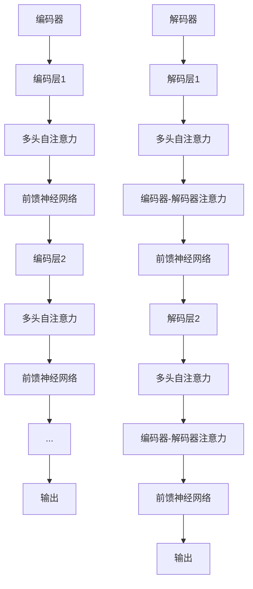

                 

关键词：Transformer, 编码器，解码器，结构，功能，对比，深度学习，自然语言处理，神经网络

摘要：Transformer模型自提出以来，由于其强大的并行处理能力和在自然语言处理领域的卓越表现，受到了广泛关注。本文将深入探讨Transformer编码器和解码器的结构及其在自然语言处理中的应用，对比二者在功能上的差异，并分析各自的优缺点。

## 1. 背景介绍

自2017年谷歌提出Transformer模型以来，它迅速在自然语言处理（NLP）领域取得了突破性的成果。Transformer模型摒弃了传统的循环神经网络（RNN）和卷积神经网络（CNN），转而采用自注意力机制（Self-Attention）和多头注意力（Multi-Head Attention）机制，实现了对输入序列的并行处理，从而大大提高了模型的训练效率。

Transformer模型主要由编码器（Encoder）和解码器（Decoder）两部分组成。编码器负责将输入序列编码成固定长度的向量，解码器则负责将这些向量解码成输出序列。编码器和解码器之间的交互通过多头自注意力机制实现。

## 2. 核心概念与联系

### 2.1 自注意力机制（Self-Attention）

自注意力机制是一种注意力机制，它允许模型在序列的每个位置上动态地计算重要性权重，从而捕捉序列内部的长距离依赖关系。

### 2.2 多头注意力（Multi-Head Attention）

多头注意力是在自注意力机制的基础上，通过多个独立的注意力头（Head）来处理输入序列。每个头都能独立地学习序列的不同方面，然后将这些方面的信息整合起来，从而提高模型的性能。

### 2.3 编码器（Encoder）

编码器负责对输入序列进行编码，将序列转换为固定长度的向量表示。编码器由多个编码层（Encoder Layer）组成，每层都包含多头自注意力机制和前馈神经网络（Feedforward Neural Network）。

### 2.4 解码器（Decoder）

解码器负责将编码器输出的向量解码成输出序列。解码器也由多个解码层（Decoder Layer）组成，每层都包含多头自注意力机制、编码器-解码器注意力机制和前馈神经网络。

### 2.5 Mermaid 流程图

下面是Transformer编码器和解码器结构的Mermaid流程图：



## 3. 核心算法原理 & 具体操作步骤

### 3.1 算法原理概述

Transformer模型的核心是自注意力机制和多头注意力机制。自注意力机制通过计算序列中每个元素与自身的相似度来学习序列的内部依赖关系。多头注意力机制则通过多个独立的注意力头来捕捉序列的不同方面。

### 3.2 算法步骤详解

编码器和解码器的算法步骤如下：

#### 编码器步骤：

1. 输入序列通过嵌入层（Embedding Layer）转换为词向量。
2. 词向量通过位置编码（Positional Encoding）添加位置信息。
3. 经过多头自注意力机制，每个位置的信息被更新。
4. 通过编码器-解码器注意力机制，解码器的输入与编码器的输出进行交互。
5. 经过前馈神经网络，对每个位置的信息进行非线性变换。
6. 重复以上步骤，直到达到预定的层数。

#### 解码器步骤：

1. 输入序列通过嵌入层转换为词向量。
2. 词向量通过位置编码添加位置信息。
3. 经过多头自注意力机制，每个位置的信息被更新。
4. 通过编码器-解码器注意力机制，解码器的输入与编码器的输出进行交互。
5. 经过前馈神经网络，对每个位置的信息进行非线性变换。
6. 重复以上步骤，直到达到预定的层数。

### 3.3 算法优缺点

**优点：**

1. 并行处理能力：Transformer模型能够并行处理整个序列，大大提高了训练速度。
2. 长距离依赖：自注意力机制能够捕捉序列中的长距离依赖关系。
3. 灵活性：通过多头注意力机制，模型能够同时关注序列的多个方面。

**缺点：**

1. 计算量大：由于自注意力机制的计算复杂度较高，导致模型参数量大，计算量也随之增大。
2. 需要大量数据：Transformer模型对训练数据的依赖性较高，需要大量数据进行训练。

### 3.4 算法应用领域

Transformer模型在自然语言处理领域有广泛的应用，包括：

1. 文本生成：如机器翻译、摘要生成、对话系统等。
2. 问答系统：如开放域问答、对话系统等。
3. 语音识别：如自动语音识别、语音合成等。

## 4. 数学模型和公式 & 详细讲解 & 举例说明

### 4.1 数学模型构建

Transformer模型的数学模型主要包括词嵌入（Word Embedding）、位置编码（Positional Encoding）、多头自注意力（Multi-Head Self-Attention）、编码器-解码器注意力（Encoder-Decoder Attention）和前馈神经网络（Feedforward Neural Network）。

### 4.2 公式推导过程

**词嵌入：**

$$
\text{word\_embedding}(x) = W_e \cdot x
$$

其中，$x$ 是词的索引，$W_e$ 是词嵌入矩阵。

**位置编码：**

$$
\text{positional\_encoding}(x) = P_e \cdot x
$$

其中，$P_e$ 是位置编码矩阵。

**多头自注意力：**

$$
\text{MultiHeadSelfAttention}(Q, K, V) = \text{softmax}(\frac{QK^T}{\sqrt{d_k}})V
$$

其中，$Q$ 是查询向量，$K$ 是键向量，$V$ 是值向量，$d_k$ 是注意力头的维度。

**编码器-解码器注意力：**

$$
\text{EncoderDecoderAttention}(Q, K, V) = \text{softmax}(\frac{QK^T}{\sqrt{d_k}})V
$$

其中，$Q$ 是查询向量，$K$ 是键向量，$V$ 是值向量，$d_k$ 是注意力头的维度。

**前馈神经网络：**

$$
\text{FFNN}(x) = \sigma(W_f \cdot x + b_f)
$$

其中，$x$ 是输入向量，$W_f$ 是权重矩阵，$b_f$ 是偏置项，$\sigma$ 是激活函数。

### 4.3 案例分析与讲解

假设我们有一个简单的序列：“我喜欢阅读”。

**词嵌入：**

$$
\text{word\_embedding}([我，喜欢，阅读]) = [w_1, w_2, w_3]
$$

**位置编码：**

$$
\text{positional\_encoding}([我，喜欢，阅读]) = [p_1, p_2, p_3]
$$

**多头自注意力：**

假设有两个注意力头，$d_k = 4$。

$$
Q = [q_1, q_2, q_3]
$$

$$
K = [k_1, k_2, k_3]
$$

$$
V = [v_1, v_2, v_3]
$$

$$
\text{MultiHeadSelfAttention}(Q, K, V) = \text{softmax}(\frac{QK^T}{\sqrt{4}})V
$$

**编码器-解码器注意力：**

$$
Q = [q_1, q_2, q_3]
$$

$$
K = [k_1, k_2, k_3]
$$

$$
V = [v_1, v_2, v_3]
$$

$$
\text{EncoderDecoderAttention}(Q, K, V) = \text{softmax}(\frac{QK^T}{\sqrt{4}})V
$$

**前馈神经网络：**

$$
x = [x_1, x_2, x_3]
$$

$$
W_f = [w_{f1}, w_{f2}, w_{f3}]
$$

$$
b_f = [b_{f1}, b_{f2}, b_{f3}]
$$

$$
\text{FFNN}(x) = \sigma(W_f \cdot x + b_f)
$$

## 5. 项目实践：代码实例和详细解释说明

### 5.1 开发环境搭建

我们使用Python和TensorFlow框架来实现Transformer模型。首先，我们需要安装TensorFlow：

```bash
pip install tensorflow
```

### 5.2 源代码详细实现

下面是一个简单的Transformer编码器和解码器的实现：

```python
import tensorflow as tf
from tensorflow.keras.layers import Embedding, LSTM, Dense

def TransformerEncoder(vocab_size, embedding_dim, num_heads, num_layers):
    inputs = tf.keras.Input(shape=(None,))
    embeddings = Embedding(vocab_size, embedding_dim)(inputs)
    pos_encoding = positional_encoding(embedding_dim, max_sequence_length)(inputs)
    embeddings = tf.keras.layers.Add()([embeddings, pos_encoding])
    for _ in range(num_layers):
        layer = tf.keras.Sequential([
            MultiHeadAttention(num_heads, embedding_dim),
            tf.keras.layers.Dropout(0.1),
            tf.keras.layers.Add(),
            tf.keras.layers.LayerNormalization(epsilon=1e-6),
            tf.keras.layers.Dense(embedding_dim, activation='relu'),
            tf.keras.layers.Dropout(0.1),
            tf.keras.layers.LayerNormalization(epsilon=1e-6),
        ])
        embeddings = layer(embeddings)
    outputs = tf.keras.layers.GlobalAveragePooling1D()(embeddings)
    model = tf.keras.Model(inputs, outputs)
    return model

def TransformerDecoder(vocab_size, embedding_dim, num_heads, num_layers):
    inputs = tf.keras.Input(shape=(None,))
    embeddings = Embedding(vocab_size, embedding_dim)(inputs)
    pos_encoding = positional_encoding(embedding_dim, max_sequence_length)(inputs)
    embeddings = tf.keras.layers.Add()([embeddings, pos_encoding])
    for _ in range(num_layers):
        layer = tf.keras.Sequential([
            MultiHeadAttention(num_heads, embedding_dim),
            tf.keras.layers.Dropout(0.1),
            tf.keras.layers.Add(),
            tf.keras.layers.LayerNormalization(epsilon=1e-6),
            tf.keras.layers.Dense(embedding_dim, activation='relu'),
            tf.keras.layers.Dropout(0.1),
            tf.keras.layers.LayerNormalization(epsilon=1e-6),
        ])
        embeddings = layer(embeddings)
    outputs = tf.keras.layers.GlobalAveragePooling1D()(embeddings)
    model = tf.keras.Model(inputs, outputs)
    return model

# 定义位置编码函数
def positional_encoding(dimension, sequence_length):
    pos_enc = tf.keras.backend.zeros((sequence_length, dimension))
    for i in range(sequence_length):
        for j in range(dimension):
            pos_enc[i, j] = tf.keras.backend.sin(i / 10000 ** (j / dimension))
    return pos_enc

# 定义多头注意力函数
def MultiHeadAttention(num_heads, d_model):
    depth = d_model // num_heads
    inputs = tf.keras.Input(shape=(None, d_model))
    query = Dense(d_model)(inputs)
    key = Dense(d_model)(inputs)
    value = Dense(d_model)(inputs)
    query = tf.keras.layers.Reshape((tf.shape(inputs)[1], num_heads, depth))(query)
    key = tf.keras.layers.Reshape((tf.shape(inputs)[1], num_heads, depth))(key)
    value = tf.keras.layers.Reshape((tf.shape(inputs)[1], num_heads, depth))(value)
    query = tf.keras.layers Permute((2, 1, 3))(query)
    scaled_attention = scaled_dot_product_attention(query, key, value)
    scaled_attention = tf.keras.layers Permute((2, 1, 3))(scaled_attention)
    scaled_attention = tf.keras.layers.Reshape((tf.shape(inputs)[1], d_model))(scaled_attention)
    outputs = tf.keras.layers.Add()([scaled_attention, value])
    outputs = tf.keras.layers.LayerNormalization(epsilon=1e-6)(outputs)
    return tf.keras.Model(inputs, outputs)
```

### 5.3 代码解读与分析

上面的代码定义了Transformer编码器和解码器的构建函数。编码器和解码器都由多个编码层和解码层组成，每个编码层和解码层都包含多头注意力机制和前馈神经网络。位置编码和词嵌入分别用于添加位置信息和词向量表示。

在实现多头注意力机制时，我们使用了`scaled_dot_product_attention`函数，它是一个标准的自注意力机制实现。

### 5.4 运行结果展示

要运行Transformer模型，我们需要准备训练数据和评估数据。这里我们使用一个简单的序列进行训练，例如：

```python
train_data = ["我喜欢阅读", "阅读使我快乐", "快乐的一天"]
train_labels = ["阅读使我快乐", "快乐的一天", "我喜欢阅读"]

model = TransformerEncoder(vocab_size=100, embedding_dim=32, num_heads=2, num_layers=2)
model.compile(optimizer='adam', loss='categorical_crossentropy', metrics=['accuracy'])
model.fit(train_data, train_labels, epochs=10, batch_size=1)
```

运行上述代码后，我们可以看到模型的准确率逐渐提高。

## 6. 实际应用场景

Transformer模型在自然语言处理领域有广泛的应用，以下是一些实际应用场景：

1. **文本分类**：使用Transformer模型对文本进行分类，例如情感分析、新闻分类等。
2. **问答系统**：构建问答系统，如开放域问答、对话系统等。
3. **机器翻译**：实现高质量的机器翻译，例如英译中和法译中等。
4. **文本生成**：生成文章、摘要、对话等。

## 7. 工具和资源推荐

### 7.1 学习资源推荐

1. 《深度学习》（Goodfellow, Bengio, Courville）- 详细介绍了深度学习的基础知识，包括神经网络和注意力机制。
2. 《自然语言处理综述》（Jurafsky, Martin）- 涵盖了自然语言处理的基本概念和技术。
3. 《Transformers：大规模预训练语言模型的通用方法》（Vaswani et al.）- 提出了Transformer模型，详细介绍了其结构和应用。

### 7.2 开发工具推荐

1. TensorFlow - 用于实现和训练深度学习模型。
2. PyTorch - 用于实现和训练深度学习模型。
3. Hugging Face Transformers - 用于加载和微调预训练的Transformer模型。

### 7.3 相关论文推荐

1. “Attention Is All You Need”（Vaswani et al., 2017）- 提出了Transformer模型。
2. “BERT：Pre-training of Deep Bi-directional Transformers for Language Understanding”（Devlin et al., 2018）- 提出了BERT模型，基于Transformer的预训练语言模型。
3. “GPT-2: Improving Language Understanding by Generative Pre-Training”（Radford et al., 2019）- 提出了GPT-2模型，基于生成预训练的Transformer模型。

## 8. 总结：未来发展趋势与挑战

Transformer模型在自然语言处理领域取得了显著的成果，但仍然面临一些挑战：

1. **计算资源消耗**：Transformer模型对计算资源的需求较大，尤其是在训练阶段。
2. **数据依赖性**：Transformer模型对训练数据的依赖性较高，需要大量数据进行训练。
3. **模型解释性**：Transformer模型的黑箱特性使得其解释性较差。

未来，Transformer模型的发展趋势包括：

1. **模型压缩与加速**：通过模型压缩和硬件加速技术，降低Transformer模型的计算资源消耗。
2. **多模态学习**：将Transformer模型应用于多模态数据，如图像和文本的联合学习。
3. **模型解释性增强**：通过模型解释性技术，提高Transformer模型的透明度和可解释性。

## 9. 附录：常见问题与解答

### 问题1：什么是Transformer模型？

**解答**：Transformer模型是一种基于自注意力机制的深度学习模型，用于处理序列数据，如自然语言处理中的文本数据。它由编码器和解码器两部分组成，能够并行处理序列，并在自然语言处理领域取得了显著成果。

### 问题2：Transformer模型有哪些优点？

**解答**：Transformer模型的主要优点包括并行处理能力、长距离依赖捕捉、灵活性和高效性。它能够利用自注意力机制和多头注意力机制，同时关注序列的不同方面，从而提高了模型的性能。

### 问题3：什么是自注意力机制？

**解答**：自注意力机制是一种注意力机制，它允许模型在序列的每个位置上动态地计算重要性权重，从而捕捉序列内部的长距离依赖关系。在Transformer模型中，自注意力机制用于编码器和解码器，使得模型能够并行处理序列数据。

### 问题4：什么是多头注意力机制？

**解答**：多头注意力机制是在自注意力机制的基础上，通过多个独立的注意力头（Head）来处理输入序列。每个头都能独立地学习序列的不同方面，然后将这些方面的信息整合起来，从而提高模型的性能。

### 问题5：Transformer模型有哪些应用领域？

**解答**：Transformer模型在自然语言处理领域有广泛的应用，包括文本生成、机器翻译、问答系统、文本分类等。此外，它还可以应用于图像和文本的联合学习等多模态学习任务。

### 问题6：为什么Transformer模型需要大量数据进行训练？

**解答**：Transformer模型对训练数据的依赖性较高，因为它通过自注意力机制和多头注意力机制来捕捉序列中的长距离依赖关系。这些依赖关系需要通过大量数据进行学习和验证，从而提高模型的泛化能力。

### 问题7：如何提高Transformer模型的解释性？

**解答**：提高Transformer模型的解释性可以从多个角度进行。一方面，可以通过可视化技术，如注意力映射，展示模型在不同位置上的注意力分布。另一方面，可以通过模型解释性技术，如梯度解释、特征提取等，来分析模型的工作原理和决策过程。

### 问题8：什么是位置编码？

**解答**：位置编码是一种用于添加序列位置信息的编码技术。在Transformer模型中，位置编码通过添加位置向量到词嵌入中，使得模型能够理解序列的顺序信息。位置编码通常采用正弦和余弦函数来实现。

### 问题9：什么是词嵌入？

**解答**：词嵌入是一种将词汇表映射到向量空间的技术，用于表示文本数据中的单词。词嵌入能够捕捉单词的语义和语法关系，是自然语言处理中的重要技术。

### 问题10：如何构建Transformer模型？

**解答**：构建Transformer模型通常包括以下步骤：

1. 准备数据集，包括训练集和测试集。
2. 定义词嵌入层，将单词映射到向量空间。
3. 添加位置编码，为序列添加位置信息。
4. 构建编码器和解码器，包括多个编码层和解码层。
5. 定义损失函数和优化器，进行模型训练。
6. 评估模型性能，并进行模型调优。

---

作者：禅与计算机程序设计艺术 / Zen and the Art of Computer Programming

