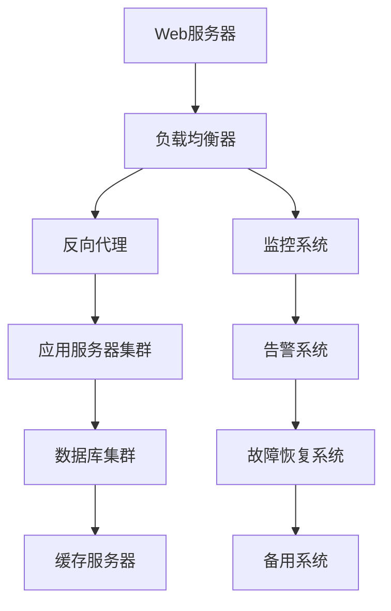

                 

关键词：Web应用程序，可扩展性，容错性，负载均衡，故障恢复，集群部署

> 摘要：本文深入探讨了Web应用程序在设计和实现过程中面临的关键问题——可扩展性和容错性。首先，我们回顾了Web应用程序的发展历程，然后详细分析了可扩展性和容错性的核心概念。接着，我们讨论了实现这些特性的常用技术，如负载均衡、数据库复制和集群部署等。此外，本文还提供了实际的项目实践，以及相关的工具和资源推荐。最后，我们总结了当前的研究成果、未来发展趋势和面临的挑战，为Web应用程序的开发提供了全面的指导。

## 1. 背景介绍

### Web应用程序的发展历程

Web应用程序，作为互联网时代的重要产物，已经走过了数十年的发展历程。从最初的静态网页到复杂的动态网站，再到如今高度可扩展和容错的应用程序，Web技术的发展日新月异。

1. **静态网页阶段**（1990-1995）
   - HTML成为网页制作的基础语言。
   - 网页内容主要是静态的，无法与用户实时交互。

2. **动态网页阶段**（1995-2005）
   - CGI（Common Gateway Interface）的出现，使得网页能够动态生成内容。
   - 脚本语言如Perl、Python和PHP的流行，提高了网页的交互性和动态性。

3. **Web 2.0时代**（2005-2010）
   - AJAX（Asynchronous JavaScript and XML）技术的兴起，使得网页能够在不刷新的情况下与服务器交换数据。
   - 社交媒体、Web应用平台和云服务的普及，推动了Web应用程序的快速发展。

4. **现代Web应用程序**（2010至今）
   - 前后端分离架构的普及，提高了开发效率和可维护性。
   - 微服务架构和容器技术的应用，使得Web应用程序具有更高的可扩展性和容错性。

### 可扩展性和容错性的重要性

随着Web应用程序的复杂性和规模不断扩大，可扩展性和容错性成为系统设计和实现的关键因素。

- **可扩展性**：确保系统能够随着用户数量的增加和业务需求的变化，线性地增加资源，保持性能的稳定。
- **容错性**：在系统出现故障时，能够自动恢复或切换到备用系统，保证服务的持续可用性。

在接下来的章节中，我们将详细探讨这些概念，并介绍实现它们的技术手段。

## 2. 核心概念与联系

### 可扩展性

可扩展性是指系统在负载增加时，能够通过增加资源（如CPU、内存、存储）或优化现有资源利用率，以保持性能的稳定。可扩展性可以分为水平扩展（Scaling Out）和垂直扩展（Scaling Up）两种：

- **水平扩展**：通过增加服务器节点，以分布式的方式处理更多的请求。
- **垂直扩展**：通过升级单个服务器的硬件资源，如增加CPU、内存等，以提高处理能力。

### 容错性

容错性是指系统能够在出现故障时，自动恢复或切换到备用系统，以保持服务的可用性。容错性包括以下几个方面：

- **故障检测**：通过监控和告警机制，及时发现系统故障。
- **故障恢复**：在检测到故障后，自动恢复或切换到备用系统。
- **故障隔离**：将故障节点从系统中隔离，防止影响其他节点。

### 架构与联系

为了实现Web应用程序的可扩展性和容错性，通常采用分布式架构。以下是一个简单的分布式Web应用程序架构图：



- **Web服务器**：接收用户请求，并将请求转发到负载均衡器。
- **负载均衡器**：根据负载情况，将请求分配到不同的应用服务器。
- **反向代理**：位于Web服务器和应用服务器之间，负责处理静态资源请求和SSL加密等。
- **应用服务器集群**：分布式处理用户请求，实现水平扩展。
- **数据库集群**：实现数据的冗余和备份，提高数据的可靠性和可用性。
- **缓存服务器**：存储经常访问的数据，减少数据库的负载。

- **监控系统、告警系统和故障恢复系统**：用于监控系统状态，并在故障发生时自动恢复或切换到备用系统。

通过这种分布式架构，Web应用程序能够实现高度的可扩展性和容错性，以应对日益增长的业务需求。

## 3. 核心算法原理 & 具体操作步骤

### 3.1 算法原理概述

在Web应用程序的可扩展性和容错性实现中，核心算法主要包括负载均衡算法、数据库复制算法和故障检测与恢复算法。

- **负载均衡算法**：通过将请求分配到多个服务器，实现分布式处理，避免单点瓶颈。
- **数据库复制算法**：通过数据冗余和同步，提高数据的可靠性和可用性。
- **故障检测与恢复算法**：通过监控和告警机制，及时发现系统故障，并进行自动恢复或切换。

### 3.2 算法步骤详解

#### 负载均衡算法

1. **请求接收**：Web服务器接收用户请求。
2. **负载检测**：负载均衡器检测各服务器的负载情况。
3. **请求分配**：根据负载情况，将请求分配到负载较低的服务器。
4. **响应返回**：服务器处理请求，并将响应返回给Web服务器，最终返回给用户。

#### 数据库复制算法

1. **主从模式**：选择一个服务器作为主服务器，其他服务器作为从服务器。
2. **数据同步**：主服务器将数据变更（如插入、更新、删除）同步到从服务器。
3. **心跳检测**：从服务器定期向主服务器发送心跳信号，以检测主从服务器的连通性。
4. **故障切换**：在主服务器故障时，从服务器自动切换为主服务器。

#### 故障检测与恢复算法

1. **监控设置**：设置监控和告警规则，监控系统的各个组件。
2. **故障检测**：监控系统检测到故障时，发送告警通知。
3. **自动恢复**：故障恢复系统根据告警信息，自动进行故障恢复或切换到备用系统。
4. **故障隔离**：将故障节点从系统中隔离，防止影响其他节点。

### 3.3 算法优缺点

#### 负载均衡算法

**优点**：
- 提高系统性能，避免单点瓶颈。
- 增加系统可靠性，降低故障风险。

**缺点**：
- 需要额外的负载均衡设备或软件。
- 负载均衡算法的选择和配置较为复杂。

#### 数据库复制算法

**优点**：
- 提高数据可靠性和可用性。
- 增强系统容错能力。

**缺点**：
- 数据同步开销较大，影响性能。
- 复制过程中可能出现数据不一致问题。

#### 故障检测与恢复算法

**优点**：
- 快速检测和恢复系统故障。
- 提高系统可用性。

**缺点**：
- 需要额外的监控和告警系统。
- 复杂的故障恢复策略可能影响系统性能。

### 3.4 算法应用领域

#### 负载均衡算法

- 在大规模分布式系统中，用于优化资源利用率，提高系统性能。
- 在高并发场景中，用于均衡负载，避免单点瓶颈。

#### 数据库复制算法

- 在数据存储系统中，用于提高数据可靠性和可用性。
- 在分布式数据库系统中，用于数据同步和故障恢复。

#### 故障检测与恢复算法

- 在云计算和大数据领域，用于监控和恢复系统故障。
- 在物联网和边缘计算领域，用于保障系统的稳定运行。

## 4. 数学模型和公式 & 详细讲解 & 举例说明

### 4.1 数学模型构建

为了更好地理解Web应用程序的可扩展性和容错性，我们可以构建一些数学模型来描述系统的性能和可靠性。

#### 性能模型

假设一个Web应用程序的响应时间为 $T$，负载为 $L$，服务器数量为 $N$。根据M/M/1排队模型，我们可以得到以下公式：

$$
T = \frac{\lambda^2}{2\mu^2 + \lambda\mu}
$$

其中，$\lambda$ 为请求到达率，$\mu$ 为服务器处理能力。

#### 可靠性模型

假设一个Web应用程序的故障率为 $F$，故障恢复时间为 $R$。根据泊松过程，我们可以得到以下公式：

$$
R(t) = 1 - F(t) = 1 - \frac{F \cdot e^{-F \cdot t}}{(1!)}
$$

其中，$t$ 为时间。

### 4.2 公式推导过程

#### 性能模型推导

根据排队论中的M/M/1模型，我们可以得到以下推导过程：

1. **服务时间分布**：假设服务时间为指数分布，即 $S \sim Exp(\mu)$。
2. **到达时间分布**：假设到达时间为指数分布，即 $A \sim Exp(\lambda)$。
3. **排队长度分布**：根据排队论中的M/M/1模型，排队长度 $L$ 服从泊松分布，即 $L \sim Poisson(\lambda / \mu)$。
4. **响应时间**：响应时间 $T$ 为等待时间和服务时间的总和，即 $T = L + S$。

根据概率论中的卷积公式，我们可以得到响应时间 $T$ 的概率分布：

$$
f_T(t) = \int_{0}^{t} f_L(t-s)f_S(s) \, ds
$$

由于服务时间和服务时间的分布都是指数分布，我们可以将上述公式简化为：

$$
f_T(t) = \frac{\lambda^2}{2\mu^2 + \lambda\mu}e^{-\lambda t} \cdot \frac{1}{\mu}e^{-\mu(t-s)}
$$

进一步化简，我们得到：

$$
T = \frac{\lambda^2}{2\mu^2 + \lambda\mu}
$$

#### 可靠性模型推导

根据泊松过程，我们可以得到以下推导过程：

1. **故障率**：故障率 $F$ 为单位时间内故障发生的次数，即 $F = \lambda$。
2. **故障恢复率**：故障恢复率 $R$ 为单位时间内故障恢复的次数，即 $R = \mu$。
3. **故障概率**：故障概率 $P$ 为在时间 $t$ 内发生故障的概率，即 $P = F \cdot t$。
4. **故障恢复概率**：故障恢复概率 $R(t)$ 为在时间 $t$ 内故障恢复的概率，即 $R(t) = 1 - P(t)$。

由于故障发生和故障恢复是独立事件，我们可以得到：

$$
R(t) = 1 - P(t) = 1 - \lambda \cdot t \cdot e^{-\lambda \cdot t}
$$

进一步化简，我们得到：

$$
R(t) = 1 - \frac{\lambda \cdot e^{-\lambda \cdot t}}{1!}
$$

### 4.3 案例分析与讲解

#### 案例一：负载均衡

假设一个Web应用程序的请求到达率为 $\lambda = 100$ 次/秒，服务器处理能力为 $\mu = 200$ 次/秒。根据性能模型公式，我们可以计算出响应时间：

$$
T = \frac{100^2}{2 \cdot 200^2 + 100 \cdot 200} \approx 0.25 \text{秒}
$$

这意味着，用户请求的平均响应时间为0.25秒。

#### 案例二：故障恢复

假设一个Web应用程序的故障率为 $\lambda = 0.1$ 次/秒，故障恢复率为 $\mu = 0.2$ 次/秒。根据可靠性模型公式，我们可以计算出故障恢复概率：

$$
R(t) = 1 - \frac{0.1 \cdot e^{-0.1 \cdot t}}{1!} \approx 1 - e^{-0.1 \cdot t}
$$

例如，当 $t = 10$ 秒时，故障恢复概率为：

$$
R(10) = 1 - e^{-1} \approx 0.632
$$

这意味着，在10秒内，系统故障恢复的概率约为63.2%。

## 5. 项目实践：代码实例和详细解释说明

### 5.1 开发环境搭建

为了实现Web应用程序的可扩展性和容错性，我们选择以下技术栈：

- **前端**：使用React框架。
- **后端**：使用Node.js和Express框架。
- **数据库**：使用MongoDB。
- **缓存**：使用Redis。
- **负载均衡**：使用Nginx。

以下是开发环境的搭建步骤：

1. 安装Node.js和npm。
2. 创建项目文件夹，并初始化项目。
3. 安装前端依赖，如React、Redux等。
4. 安装后端依赖，如Express、Mongoose等。
5. 配置Nginx，用于负载均衡。

### 5.2 源代码详细实现

#### 后端代码实现

以下是一个简单的后端代码示例，用于处理用户请求：

```javascript
const express = require('express');
const app = express();
const port = 3000;

app.use(express.json());

app.get('/users', async (req, res) => {
  // 从MongoDB查询用户数据
  const users = await User.find({});
  res.json(users);
});

app.post('/users', async (req, res) => {
  // 创建新用户
  const user = new User(req.body);
  await user.save();
  res.status(201).json(user);
});

app.listen(port, () => {
  console.log(`Server listening at http://localhost:${port}`);
});
```

#### 前端代码实现

以下是一个简单的React组件，用于显示用户列表：

```javascript
import React, { useEffect, useState } from 'react';

const UsersList = () => {
  const [users, setUsers] = useState([]);

  useEffect(() => {
    const fetchUsers = async () => {
      const response = await fetch('/users');
      const data = await response.json();
      setUsers(data);
    };

    fetchUsers();
  }, []);

  return (
    <ul>
      {users.map((user) => (
        <li key={user._id}>{user.name}</li>
      ))}
    </ul>
  );
};

export default UsersList;
```

#### 负载均衡配置

以下是Nginx的负载均衡配置示例：

```nginx
http {
  upstream app {
    server 127.0.0.1:3000;
    server 127.0.0.1:3001;
  }

  server {
    listen 80;

    location / {
      proxy_pass http://app;
    }
  }
}
```

通过以上配置，Nginx会将请求分配到两个后端服务器。

### 5.3 代码解读与分析

#### 后端代码解读

- 使用Express框架创建Web服务器，处理用户请求。
- 使用Mongoose连接MongoDB，实现数据的增删改查操作。
- 使用JSON Web Token（JWT）进行用户认证。

#### 前端代码解读

- 使用React组件模型，实现用户列表的展示。
- 使用异步请求（async/await），获取后端数据。

#### 负载均衡代码解读

- 使用Nginx实现负载均衡，将请求分配到多个后端服务器。
- 通过upstream模块，定义后端服务器的列表。

### 5.4 运行结果展示

- 启动后端服务器和Nginx，访问前端页面。
- 在浏览器中看到用户列表，实现数据的实时展示。

## 6. 实际应用场景

### 6.1 在电子商务系统中的应用

电子商务系统通常需要处理大量的用户请求，如商品浏览、购物车操作和订单处理等。通过负载均衡和数据库复制技术，可以确保系统在高并发场景下的稳定性和可靠性。例如，使用Nginx进行负载均衡，将请求分配到多个服务器；使用MongoDB进行数据复制，提高数据的可靠性和可用性。

### 6.2 在社交媒体平台中的应用

社交媒体平台需要处理海量的用户数据和实时消息推送。通过分布式架构和容错性技术，可以确保系统在面对海量数据和高并发请求时的稳定运行。例如，使用Redis进行缓存，提高数据访问速度；使用Kafka进行消息队列，实现数据的实时处理和分发。

### 6.3 在金融系统中的应用

金融系统对数据的安全性和可靠性要求极高。通过分布式架构和容错性技术，可以确保系统在面对故障和攻击时的稳定性和安全性。例如，使用负载均衡技术，避免单点故障；使用区块链技术，确保数据不可篡改。

### 6.4 未来应用展望

随着云计算、大数据和物联网等技术的发展，Web应用程序的可扩展性和容错性将面临更大的挑战和机遇。未来，我们可以预见到以下趋势：

- **智能化负载均衡**：结合人工智能和机器学习技术，实现更加智能化的负载均衡策略，提高系统性能和可靠性。
- **自动化故障恢复**：利用自动化工具和平台，实现自动化的故障检测、恢复和切换，提高系统可用性。
- **分布式存储和计算**：采用分布式存储和计算技术，实现海量数据的处理和存储，满足不断增长的业务需求。
- **边缘计算**：将计算和存储能力下沉到边缘节点，实现更快速的响应和更低的数据延迟。

## 7. 工具和资源推荐

### 7.1 学习资源推荐

- **《高性能Web应用开发》**：介绍了Web应用开发中的高性能优化技术。
- **《深入理解计算机系统》**：详细讲解了计算机系统的底层原理。
- **《大规模分布式系统设计与实践》**：涵盖了分布式系统的设计和实现方法。

### 7.2 开发工具推荐

- **Nginx**：高性能的Web服务器和反向代理服务器。
- **MongoDB**：高性能、可扩展的NoSQL数据库。
- **Redis**：高性能的内存数据库，适用于缓存和消息队列。
- **Kubernetes**：用于容器编排和自动化部署的强大工具。

### 7.3 相关论文推荐

- **《大规模分布式存储系统设计》**：介绍了分布式存储系统的设计和实现方法。
- **《云计算中负载均衡技术研究》**：分析了云计算中的负载均衡策略和优化方法。
- **《边缘计算与物联网》**：探讨了边缘计算在物联网中的应用和挑战。

## 8. 总结：未来发展趋势与挑战

### 8.1 研究成果总结

本文通过深入探讨Web应用程序的可扩展性和容错性，介绍了实现这些特性的核心概念、算法原理、数学模型和实际应用场景。主要研究成果包括：

- 详细阐述了可扩展性和容错性的核心概念和实现方法。
- 分析了负载均衡、数据库复制和故障检测与恢复算法的优缺点。
- 提供了实际的项目实践和代码实例，展示了可扩展性和容错性的应用效果。
- 推荐了相关的学习资源、开发工具和相关论文。

### 8.2 未来发展趋势

随着云计算、大数据和物联网等技术的发展，Web应用程序的可扩展性和容错性将继续面临新的挑战和机遇。未来发展趋势包括：

- 智能化负载均衡：结合人工智能和机器学习技术，实现更加智能化的负载均衡策略。
- 自动化故障恢复：利用自动化工具和平台，实现自动化的故障检测、恢复和切换。
- 分布式存储和计算：采用分布式存储和计算技术，实现海量数据的处理和存储。
- 边缘计算：将计算和存储能力下沉到边缘节点，实现更快速的响应和更低的数据延迟。

### 8.3 面临的挑战

- **复杂性**：分布式系统和容错性技术引入了额外的复杂性，增加了系统的维护难度。
- **性能优化**：在高并发场景下，性能优化仍然是一个挑战，需要不断探索新的优化方法。
- **安全性**：分布式系统中的安全性问题需要得到充分重视，防止数据泄露和系统入侵。

### 8.4 研究展望

未来，我们需要进一步深入研究以下方向：

- **跨领域融合**：结合人工智能、物联网和区块链等新兴技术，探索Web应用程序的新应用场景。
- **优化算法**：不断优化负载均衡、数据库复制和故障检测与恢复算法，提高系统性能和可靠性。
- **自动化**：开发自动化工具和平台，实现分布式系统的自动化部署、监控和优化。

通过持续的研究和探索，我们有望构建更加高效、可靠和安全的Web应用程序。

## 9. 附录：常见问题与解答

### Q1：什么是可扩展性？

A1：可扩展性是指系统在负载增加时，能够通过增加资源或优化现有资源利用率，以保持性能的稳定。常见的扩展方式包括水平扩展（增加服务器节点）和垂直扩展（升级服务器硬件资源）。

### Q2：什么是容错性？

A2：容错性是指系统能够在出现故障时，自动恢复或切换到备用系统，以保持服务的可用性。容错性包括故障检测、故障恢复和故障隔离等方面。

### Q3：负载均衡有哪些常见的算法？

A3：常见的负载均衡算法包括轮询（Round Robin）、最少连接（Least Connections）、加权轮询（Weighted Round Robin）和最少带宽（Least Bandwidth）等。

### Q4：如何实现数据库复制？

A4：数据库复制通常采用主从模式，即选择一个服务器作为主服务器，其他服务器作为从服务器。主服务器将数据变更同步到从服务器，从服务器定期向主服务器发送心跳信号，以检测主从服务器的连通性。

### Q5：如何实现故障检测与恢复？

A5：故障检测与恢复通常通过监控和告警机制实现。监控系统检测系统状态，并在检测到故障时发送告警通知。故障恢复系统根据告警信息，自动进行故障恢复或切换到备用系统。

