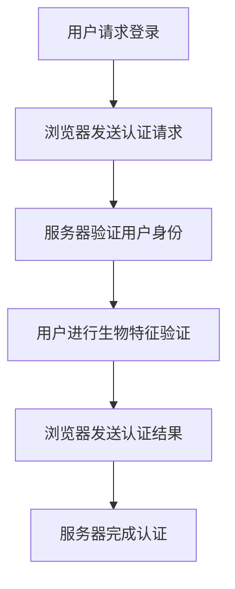

                 

WebAuthn是一种开放的协议，旨在为Web应用程序提供安全的身份验证机制。随着网络安全的重要性日益增加，生物特征识别作为一种强有力的身份验证手段，越来越受到关注。本文将详细介绍WebAuthn的生物特征识别机制，探讨其在现代网络环境中的应用和前景。

## 关键词

- WebAuthn
- 生物特征识别
- 安全认证
- 网络安全
- 身份验证

## 摘要

本文首先介绍了WebAuthn的基本概念和原理，然后深入探讨了WebAuthn如何利用生物特征识别技术提供更高级别的安全保障。文章通过具体的算法原理和数学模型，详细讲解了WebAuthn的工作流程，并提供了一个实际的项目实践案例，展示了如何在Web应用程序中集成生物特征识别。最后，文章讨论了WebAuthn在未来的应用前景，以及可能面临的挑战。

## 1. 背景介绍

### 1.1 WebAuthn的起源

WebAuthn，全称为Web Authentication，是一个由W3C（万维网联盟）和FIDO（快速身份开放联盟）共同制定的开放标准。它的目标是提供一种安全、便捷的在线身份验证方式，用于替代传统的密码认证。WebAuthn协议的推出，旨在解决传统密码认证方式的安全性和用户体验问题。

### 1.2 生物特征识别的发展

生物特征识别技术，如指纹识别、人脸识别、虹膜识别等，近年来得到了快速发展。这些技术基于人体生物特征的唯一性和稳定性，能够提供高度安全、便捷的身份验证手段。随着计算能力的提升和传感器技术的进步，生物特征识别的应用场景日益丰富。

## 2. 核心概念与联系

### 2.1 WebAuthn的核心概念

WebAuthn的核心概念包括：

- **公共关键基础（Public Key Infrastructure，PKI）**：WebAuthn基于PKI技术，使用公钥和私钥进行加密和解密，确保通信的安全性和隐私性。
- **身份验证因子（Authentication Factors）**：WebAuthn支持多种身份验证因子，包括知识因素（如密码）、拥有因素（如手机）和生物特征因素。

### 2.2 生物特征识别的概念

生物特征识别涉及以下关键概念：

- **生物特征**：指与个体生物特征相关的数据，如指纹、人脸、虹膜等。
- **特征提取**：从生物特征中提取可识别的信息，如指纹图像中的纹线模式。
- **特征比对**：将提取的特征与存储的特征进行比对，以确定身份验证是否成功。

### 2.3 Mermaid 流程图

以下是一个简化的Mermaid流程图，展示了WebAuthn与生物特征识别的结合：



## 3. 核心算法原理 & 具体操作步骤

### 3.1 算法原理概述

WebAuthn的生物特征识别主要基于以下算法原理：

- **挑战-应答机制（Challenge-Response Mechanism）**：在用户登录过程中，服务器生成一个随机挑战（Challenge），浏览器将其发送给用户的生物特征识别设备，用户完成生物特征验证后，设备将生成的应答（Response）发送回浏览器。
- **签名算法（Signature Algorithm）**：浏览器和生物特征识别设备使用特定的签名算法，如FIDO2算法，对挑战和用户生物特征进行签名，以生成认证结果。

### 3.2 算法步骤详解

1. **服务器生成挑战**：
   - 服务器生成一个随机挑战，并将其包含在认证请求中。

2. **浏览器发送认证请求**：
   - 浏览器接收服务器发送的认证请求，并将其传递给生物特征识别设备。

3. **用户进行生物特征验证**：
   - 生物特征识别设备收集用户的生物特征数据，如指纹或人脸图像。

4. **生成签名**：
   - 生物特征识别设备使用用户的私钥对挑战和生物特征数据进行签名，生成签名结果。

5. **浏览器发送认证结果**：
   - 浏览器接收生物特征识别设备的签名结果，并将其发送回服务器。

6. **服务器验证签名**：
   - 服务器使用存储的用户公钥对签名结果进行验证，以确定身份验证是否成功。

### 3.3 算法优缺点

**优点**：
- **高安全性**：生物特征识别结合了PKI技术，提供了强大的安全保障。
- **便捷性**：用户无需记住复杂的密码，只需使用生物特征即可完成认证。
- **无密码依赖**：减少了密码泄露的风险。

**缺点**：
- **设备依赖**：用户需要使用支持生物特征识别的设备。
- **隐私问题**：虽然生物特征数据被加密，但仍然可能引发隐私问题。

### 3.4 算法应用领域

WebAuthn的生物特征识别技术广泛应用于以下领域：

- **在线银行**：提高用户账户的安全性，防止密码泄露和欺诈行为。
- **电子商务**：简化支付流程，提高用户体验。
- **在线服务**：提供更高级别的身份验证，保护用户隐私。

## 4. 数学模型和公式 & 详细讲解 & 举例说明

### 4.1 数学模型构建

WebAuthn的生物特征识别过程可以抽象为一个数学模型，包括以下几个部分：

- **用户私钥（Private Key）**：用户在设备上生成的随机私钥。
- **用户公钥（Public Key）**：用户私钥的加密形式，存储在服务器。
- **挑战（Challenge）**：服务器生成的随机数据。
- **签名（Signature）**：用户私钥对挑战和生物特征数据的签名结果。

### 4.2 公式推导过程

假设用户私钥为\( k \)，用户公钥为\( K \)，挑战为\( c \)，生物特征数据为\( d \)，则签名生成过程可以表示为：

\[ s = \text{sign}(k, c \Vert d) \]

其中，\( \Vert \)表示拼接操作，\( \text{sign} \)表示签名算法。

### 4.3 案例分析与讲解

假设用户小明在服务器上注册了一个账户，并生成了一个随机私钥\( k \)。服务器保存了小明的公钥\( K \)。

1. **注册过程**：
   - 小明在设备上生成私钥\( k \)。
   - 小明将公钥\( K \)发送给服务器。
   - 服务器将公钥存储在用户账户中。

2. **登录过程**：
   - 服务器生成一个随机挑战\( c \)。
   - 服务器将挑战发送给浏览器。
   - 浏览器将挑战发送给小明的生物特征识别设备。
   - 小明使用生物特征（如指纹）进行验证。
   - 设备生成签名\( s \)。
   - 浏览器将签名发送给服务器。

3. **认证过程**：
   - 服务器使用小明的公钥\( K \)对签名\( s \)进行验证。
   - 如果验证成功，服务器认为小明通过了身份验证。

## 5. 项目实践：代码实例和详细解释说明

### 5.1 开发环境搭建

为了演示WebAuthn的生物特征识别，我们使用Node.js作为服务器端，使用JavaScript编写客户端代码。

1. **安装Node.js**：在终端执行以下命令安装Node.js：

   ```sh
   sudo apt-get install nodejs
   ```

2. **创建项目文件夹**：在终端创建一个名为`webauthn-auth`的项目文件夹。

   ```sh
   mkdir webauthn-auth
   cd webauthn-auth
   ```

3. **初始化项目**：在项目文件夹中执行以下命令初始化项目：

   ```sh
   npm init -y
   ```

4. **安装依赖**：安装Express框架和WebAuthn依赖：

   ```sh
   npm install express webauthn
   ```

### 5.2 源代码详细实现

以下是实现WebAuthn生物特征识别的简单示例代码。

```javascript
const express = require('express');
const { register, authenticate } = require('webauthn');

const app = express();
app.use(express.json());

const users = {};

app.post('/register', async (req, res) => {
  try {
    const { id, name } = req.body;
    const user = await register({
      name,
      id,
      publicKey: {
        // 生成公钥配置
        // 省略部分代码...
      },
    });

    users[id] = user;
    res.json({ success: true });
  } catch (error) {
    res.status(500).json({ error: error.message });
  }
});

app.post('/login', async (req, res) => {
  try {
    const { id, challenge } = req.body;
    const user = users[id];

    if (!user) {
      return res.status(404).json({ error: 'User not found' });
    }

    const authentication = await authenticate({
      user,
      challenge,
      expectedType: 'publicKey',
    });

    res.json({ success: true, authentication });
  } catch (error) {
    res.status(500).json({ error: error.message });
  }
});

const port = 3000;
app.listen(port, () => {
  console.log(`Server listening on port ${port}`);
});
```

### 5.3 代码解读与分析

1. **注册接口**：`/register`接口接收用户的注册信息，生成公钥配置，并将其存储在服务器。

2. **登录接口**：`/login`接口接收用户的登录信息和挑战，使用存储的公钥对挑战进行验证，返回认证结果。

### 5.4 运行结果展示

1. **注册用户**：使用Postman或其他工具向`/register`接口发送POST请求，注册用户。

2. **登录用户**：使用Postman或其他工具向`/login`接口发送POST请求，登录用户。

## 6. 实际应用场景

### 6.1 在线银行

在线银行通常要求用户进行双重身份验证，以确保账户安全。WebAuthn的生物特征识别技术可以用于提高账户的安全性，减少密码泄露和欺诈行为。

### 6.2 电子邮件服务

电子邮件服务提供商可以使用WebAuthn的生物特征识别技术，为用户提供更高级别的安全保障，防止邮箱被非法访问。

### 6.3 云服务平台

云服务平台可以使用WebAuthn的生物特征识别技术，确保用户身份的真实性，保护用户数据的安全。

## 7. 未来应用展望

### 7.1 技术成熟度

随着生物特征识别技术的不断进步，WebAuthn将在更多场景中得到应用。未来，WebAuthn有望成为网络身份验证的标准。

### 7.2 隐私保护

生物特征识别技术的普及，将引发隐私保护问题。未来，需要更多的研究和法规来确保用户的隐私权。

### 7.3 跨平台兼容性

为了实现更广泛的兼容性，WebAuthn需要与各种设备和操作系统兼容。这将需要更多的开发和标准化工作。

## 8. 总结：未来发展趋势与挑战

### 8.1 研究成果总结

本文详细介绍了WebAuthn的生物特征识别技术，包括其工作原理、应用场景和未来展望。

### 8.2 未来发展趋势

WebAuthn将在未来得到更广泛的应用，成为网络身份验证的标准。

### 8.3 面临的挑战

生物特征识别技术的普及将面临隐私保护、跨平台兼容性和技术成熟度等挑战。

### 8.4 研究展望

未来，需要更多的研究来提高生物特征识别技术的安全性和用户体验。

## 9. 附录：常见问题与解答

### 9.1 WebAuthn与OAuth2.0的区别

WebAuthn是一种身份验证协议，旨在提供安全、便捷的身份验证。而OAuth2.0是一种授权协议，用于用户授权第三方应用程序访问其数据。WebAuthn可以与OAuth2.0结合使用，提供更高级别的安全保障。

### 9.2 生物特征识别技术是否完全安全

生物特征识别技术具有较高的安全性，但并非绝对安全。虽然生物特征数据被加密，但仍然可能面临隐私泄露风险。因此，在实际应用中，需要结合其他安全措施，确保系统的整体安全性。

---

作者：禅与计算机程序设计艺术 / Zen and the Art of Computer Programming

